# Cupertino NVR - Arquitectura 4+1

> **Vista Arquitectónica 4+1 de Philippe Kruchten**  
> The Big Picture para evolución arquitectural

**Version:** 1.0  
**Date:** 2025-10-25  
**Author:** Visiona Team

---

## 📐 Introducción

Este documento describe la arquitectura del sistema **Cupertino NVR** usando el modelo **4+1** de Philippe Kruchten, proporcionando múltiples perspectivas del sistema para diferentes stakeholders.

### Stakeholders

| Stakeholder | Vista de Interés |
|-------------|------------------|
| **Desarrolladores** | Logical View, Development View |
| **DevOps/SRE** | Physical View, Process View |
| **Product Owners** | Scenarios |
| **Arquitectos** | Todas las vistas |

---

## 🎯 Vista de Escenarios (+1)

### Escenario 1: Procesamiento de Video en Tiempo Real

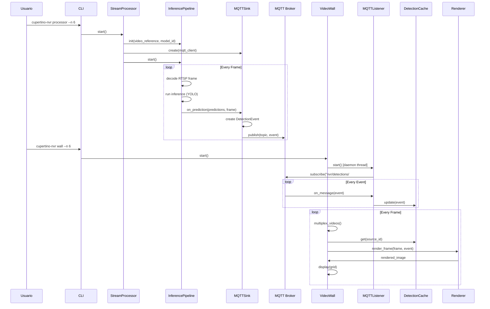
```mermaid
sequenceDiagram
    participant U as Usuario
    participant CLI as CLI
    participant SP as StreamProcessor
    participant IP as InferencePipeline
    participant MS as MQTTSink
    participant MB as MQTT Broker
    participant VW as VideoWall
    participant ML as MQTTListener
    participant DC as DetectionCache
    participant R as Renderer

    U->>CLI: cupertino-nvr processor --n 6
    CLI->>SP: start()
    SP->>IP: init(video_reference, model_id)
    SP->>MS: create(mqtt_client)
    SP->>IP: start()
    
    loop Every Frame
        IP->>IP: decode RTSP frame
        IP->>IP: run inference (YOLO)
        IP->>MS: on_prediction(predictions, frame)
        MS->>MS: create DetectionEvent
        MS->>MB: publish(topic, event)
    end
    
    U->>CLI: cupertino-nvr wall --n 6
    CLI->>VW: start()
    VW->>ML: start() [daemon thread]
    ML->>MB: subscribe("nvr/detections/#")
    
    loop Every Event
        MB->>ML: on_message(event)
        ML->>DC: update(event)
    end
    
    loop Every Frame
        VW->>VW: multiplex_videos()
        VW->>DC: get(source_id)
        VW->>R: render_frame(frame, event)
        R->>VW: rendered_image
        VW->>VW: display(grid)
    end
```

### Escenario 2: Escalado Horizontal (N Processors + M Viewers)

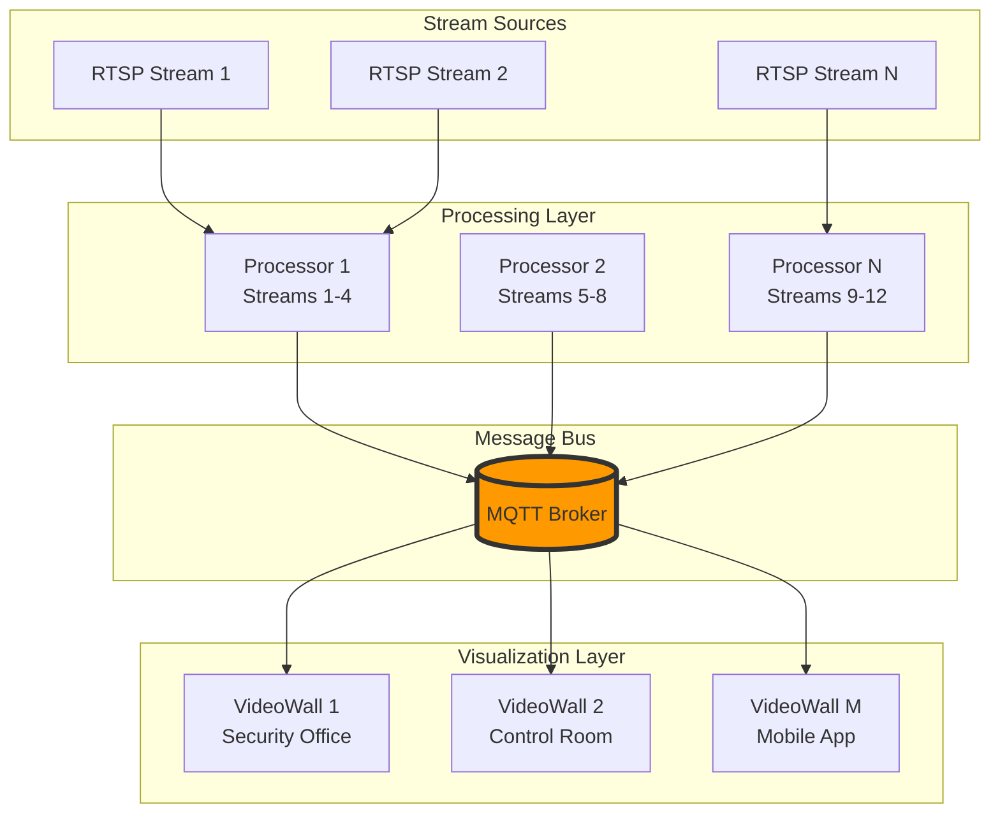
```mermaid
graph TB
    subgraph "Stream Sources"
        S1[RTSP Stream 1]
        S2[RTSP Stream 2]
        S3[RTSP Stream N]
    end
    
    subgraph "Processing Layer"
        P1[Processor 1<br/>Streams 1-4]
        P2[Processor 2<br/>Streams 5-8]
        P3[Processor N<br/>Streams 9-12]
    end
    
    subgraph "Message Bus"
        MB[(MQTT Broker)]
    end
    
    subgraph "Visualization Layer"
        V1[VideoWall 1<br/>Security Office]
        V2[VideoWall 2<br/>Control Room]
        V3[VideoWall M<br/>Mobile App]
    end
    
    S1 --> P1
    S2 --> P1
    S3 --> P3
    
    P1 --> MB
    P2 --> MB
    P3 --> MB
    
    MB --> V1
    MB --> V2
    MB --> V3
    
    style MB fill:#ff9900,stroke:#333,stroke-width:4px
```

---

## 🧩 Vista Lógica (Logical View)

### Diagrama de Componentes

```mermaid
graph TB
    subgraph "Cupertino NVR System"
        subgraph "Event Domain"
            ES[Event Schema<br/>Pydantic Models]
            EP[Event Protocol<br/>MQTT Topics]
        end
        
        subgraph "Processor Domain"
            PC[ProcessorConfig]
            MS[MQTTDetectionSink]
            SP[StreamProcessor]
            IP[InferencePipeline<br/>External]
        end
        
        subgraph "Wall Domain"
            WC[WallConfig]
            DC[DetectionCache<br/>TTL + Thread-Safe]
            ML[MQTTListener<br/>Daemon Thread]
            DR[DetectionRenderer]
            VW[VideoWall]
            MV[multiplex_videos<br/>External]
        end
        
        subgraph "CLI"
            CLI[CLI Commands<br/>Click]
        end
        
        subgraph "External Services"
            MQTT[(MQTT Broker<br/>Mosquitto)]
            RTSP[RTSP Streams]
        end
    end
    
    CLI --> SP
    CLI --> VW
    
    SP --> PC
    SP --> MS
    SP --> IP
    MS --> ES
    MS --> EP
    MS --> MQTT
    IP --> RTSP
    
    VW --> WC
    VW --> DC
    VW --> ML
    VW --> DR
    VW --> MV
    ML --> MQTT
    ML --> DC
    ML --> ES
    DR --> ES
    MV --> RTSP
    
    style ES fill:#90EE90,stroke:#333,stroke-width:2px
    style EP fill:#90EE90,stroke:#333,stroke-width:2px
    style MQTT fill:#ff9900,stroke:#333,stroke-width:3px
    style DC fill:#87CEEB,stroke:#333,stroke-width:2px
```

### Diagrama de Clases Principales

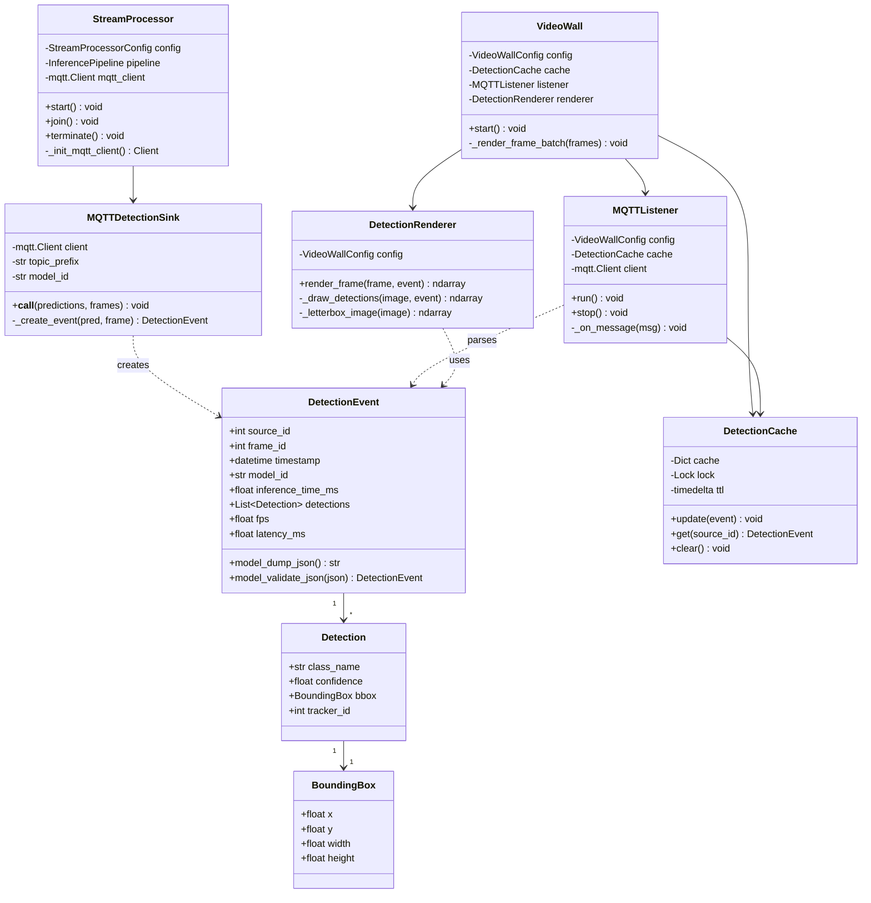
```mermaid
classDiagram
    class DetectionEvent {
        +int source_id
        +int frame_id
        +datetime timestamp
        +str model_id
        +float inference_time_ms
        +List~Detection~ detections
        +float fps
        +float latency_ms
        +model_dump_json() str
        +model_validate_json(json) DetectionEvent
    }
    
    class Detection {
        +str class_name
        +float confidence
        +BoundingBox bbox
        +int tracker_id
    }
    
    class BoundingBox {
        +float x
        +float y
        +float width
        +float height
    }
    
    class StreamProcessor {
        -StreamProcessorConfig config
        -InferencePipeline pipeline
        -mqtt.Client mqtt_client
        +start() void
        +join() void
        +terminate() void
        -_init_mqtt_client() Client
    }
    
    class MQTTDetectionSink {
        -mqtt.Client client
        -str topic_prefix
        -str model_id
        +__call__(predictions, frames) void
        -_create_event(pred, frame) DetectionEvent
    }
    
    class VideoWall {
        -VideoWallConfig config
        -DetectionCache cache
        -MQTTListener listener
        -DetectionRenderer renderer
        +start() void
        -_render_frame_batch(frames) void
    }
    
    class DetectionCache {
        -Dict cache
        -Lock lock
        -timedelta ttl
        +update(event) void
        +get(source_id) DetectionEvent
        +clear() void
    }
    
    class MQTTListener {
        -VideoWallConfig config
        -DetectionCache cache
        -mqtt.Client client
        +run() void
        +stop() void
        -_on_message(msg) void
    }
    
    class DetectionRenderer {
        -VideoWallConfig config
        +render_frame(frame, event) ndarray
        -_draw_detections(image, event) ndarray
        -_letterbox_image(image) ndarray
    }
    
    DetectionEvent "1" --> "*" Detection
    Detection "1" --> "1" BoundingBox
    
    StreamProcessor --> MQTTDetectionSink
    MQTTDetectionSink ..> DetectionEvent : creates
    
    VideoWall --> DetectionCache
    VideoWall --> MQTTListener
    VideoWall --> DetectionRenderer
    MQTTListener --> DetectionCache
    MQTTListener ..> DetectionEvent : parses
    DetectionRenderer ..> DetectionEvent : uses
```

---

## ⚙️ Vista de Procesos (Process View)

### Diagrama de Threads y Concurrencia

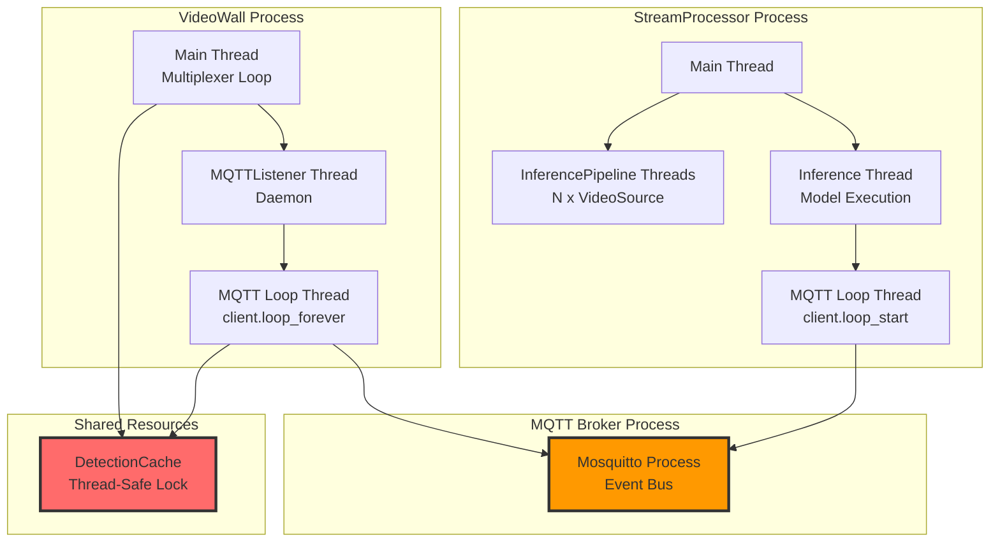
```mermaid
graph TB
    subgraph "StreamProcessor Process"
        MT1[Main Thread]
        IT1[InferencePipeline Threads<br/>N x VideoSource]
        IT2[Inference Thread<br/>Model Execution]
        MQT1[MQTT Loop Thread<br/>client.loop_start]
    end
    
    subgraph "VideoWall Process"
        MT2[Main Thread<br/>Multiplexer Loop]
        MLT[MQTTListener Thread<br/>Daemon]
        MQLT2[MQTT Loop Thread<br/>client.loop_forever]
    end
    
    subgraph "MQTT Broker Process"
        MQP[Mosquitto Process<br/>Event Bus]
    end
    
    subgraph "Shared Resources"
        DC[DetectionCache<br/>Thread-Safe Lock]
    end
    
    MT1 --> IT1
    MT1 --> IT2
    IT2 --> MQT1
    MQT1 --> MQP
    
    MT2 --> MLT
    MLT --> MQLT2
    MQLT2 --> MQP
    MQLT2 --> DC
    MT2 --> DC
    
    style DC fill:#ff6b6b,stroke:#333,stroke-width:3px
    style MQP fill:#ff9900,stroke:#333,stroke-width:3px
```

### Estados del Sistema

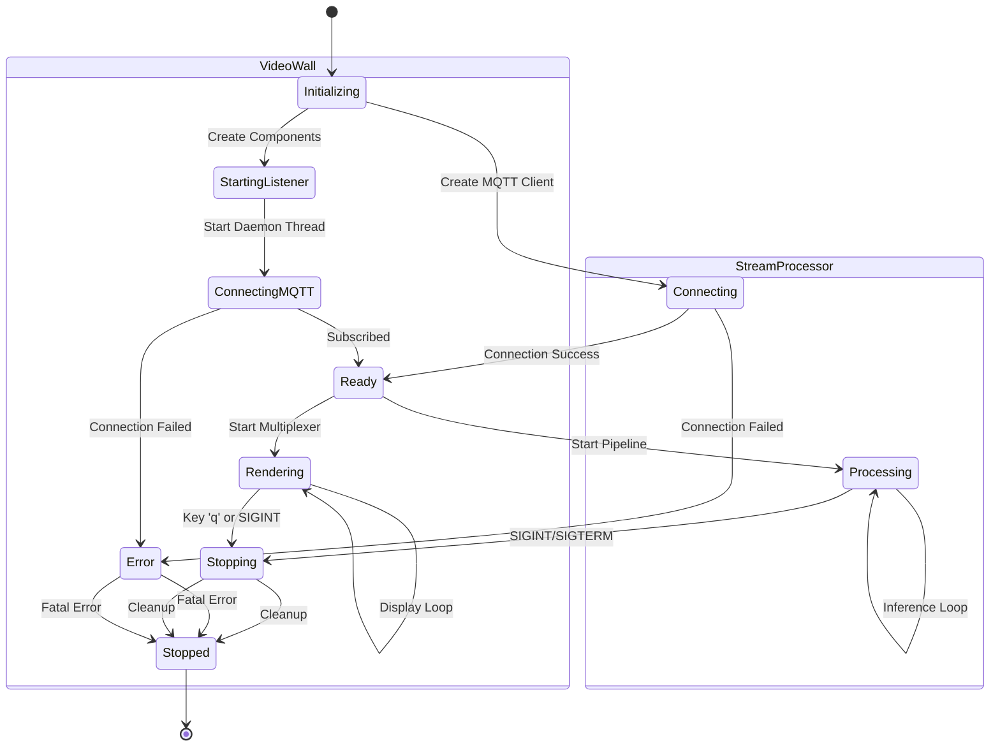
```mermaid
stateDiagram-v2
    [*] --> Initializing
    
    state "StreamProcessor" as SP {
        Initializing --> Connecting: Create MQTT Client
        Connecting --> Ready: Connection Success
        Connecting --> Error: Connection Failed
        Ready --> Processing: Start Pipeline
        Processing --> Processing: Inference Loop
        Processing --> Stopping: SIGINT/SIGTERM
        Stopping --> Stopped: Cleanup
        Error --> Stopped: Fatal Error
    }
    
    state "VideoWall" as VW {
        Initializing --> StartingListener: Create Components
        StartingListener --> ConnectingMQTT: Start Daemon Thread
        ConnectingMQTT --> Ready: Subscribed
        ConnectingMQTT --> Error: Connection Failed
        Ready --> Rendering: Start Multiplexer
        Rendering --> Rendering: Display Loop
        Rendering --> Stopping: Key 'q' or SIGINT
        Stopping --> Stopped: Cleanup
        Error --> Stopped: Fatal Error
    }
    
    Stopped --> [*]
```

### Sincronización y Thread Safety

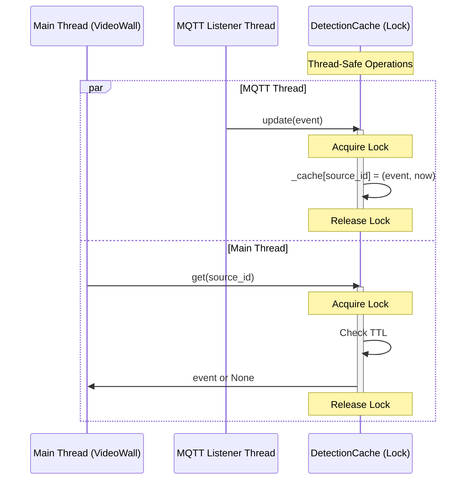
```mermaid
sequenceDiagram
    participant MT as Main Thread (VideoWall)
    participant ML as MQTT Listener Thread
    participant DC as DetectionCache (Lock)
    
    Note over DC: Thread-Safe Operations
    
    par MQTT Thread
        ML->>DC: update(event)
        activate DC
        Note over DC: Acquire Lock
        DC->>DC: _cache[source_id] = (event, now)
        Note over DC: Release Lock
        deactivate DC
    and Main Thread
        MT->>DC: get(source_id)
        activate DC
        Note over DC: Acquire Lock
        DC->>DC: Check TTL
        DC->>MT: event or None
        Note over DC: Release Lock
        deactivate DC
    end
```

---

## 📦 Vista de Desarrollo (Development View)

### Organización de Módulos

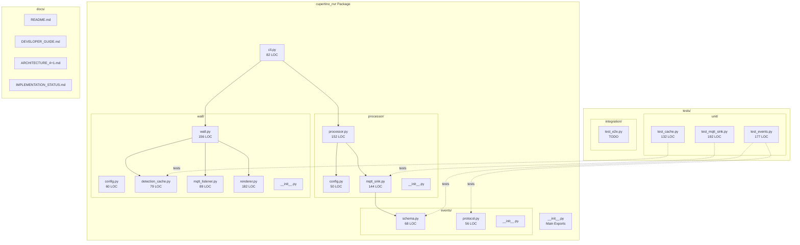
```mermaid
graph TB
    subgraph "cupertino_nvr Package"
        subgraph "events/"
            ES[schema.py<br/>68 LOC]
            EP[protocol.py<br/>56 LOC]
            EI[__init__.py]
        end
        
        subgraph "processor/"
            PC[config.py<br/>50 LOC]
            MS[mqtt_sink.py<br/>144 LOC]
            SP[processor.py<br/>152 LOC]
            PI[__init__.py]
        end
        
        subgraph "wall/"
            WC[config.py<br/>60 LOC]
            DC[detection_cache.py<br/>79 LOC]
            ML[mqtt_listener.py<br/>89 LOC]
            DR[renderer.py<br/>182 LOC]
            VW[wall.py<br/>156 LOC]
            WI[__init__.py]
        end
        
        CLI[cli.py<br/>82 LOC]
        MAIN[__init__.py<br/>Main Exports]
    end
    
    subgraph "tests/"
        subgraph "unit/"
            TE[test_events.py<br/>177 LOC]
            TC[test_cache.py<br/>132 LOC]
            TM[test_mqtt_sink.py<br/>192 LOC]
        end
        
        subgraph "integration/"
            TI[test_e2e.py<br/>TODO]
        end
    end
    
    subgraph "docs/"
        README[README.md]
        DEV[DEVELOPER_GUIDE.md]
        ARCH[ARCHITECTURE_4+1.md]
        STATUS[IMPLEMENTATION_STATUS.md]
    end
    
    CLI --> SP
    CLI --> VW
    SP --> MS
    SP --> PC
    MS --> ES
    VW --> DC
    VW --> ML
    VW --> DR
    
    TE -.tests.-> ES
    TE -.tests.-> EP
    TC -.tests.-> DC
    TM -.tests.-> MS
```

### Dependencias entre Módulos

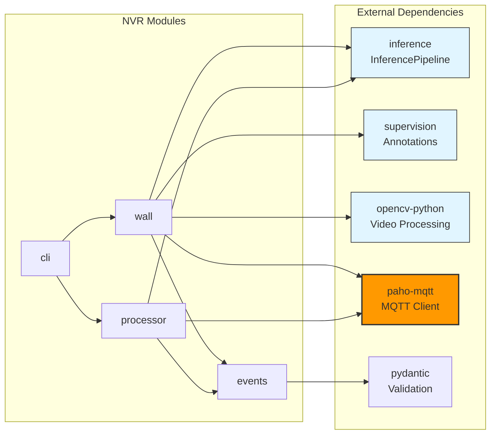
```mermaid
graph LR
    subgraph "External Dependencies"
        INF[inference<br/>InferencePipeline]
        SUP[supervision<br/>Annotations]
        CV[opencv-python<br/>Video Processing]
        MQTT[paho-mqtt<br/>MQTT Client]
        PYD[pydantic<br/>Validation]
    end
    
    subgraph "NVR Modules"
        EVT[events]
        PROC[processor]
        WALL[wall]
        CLI[cli]
    end
    
    EVT --> PYD
    PROC --> EVT
    PROC --> INF
    PROC --> MQTT
    WALL --> EVT
    WALL --> SUP
    WALL --> CV
    WALL --> MQTT
    WALL --> INF
    CLI --> PROC
    CLI --> WALL
    
    style INF fill:#e1f5ff,stroke:#333
    style SUP fill:#e1f5ff,stroke:#333
    style CV fill:#e1f5ff,stroke:#333
    style MQTT fill:#ff9900,stroke:#333,stroke-width:2px
```

### Capas de Arquitectura

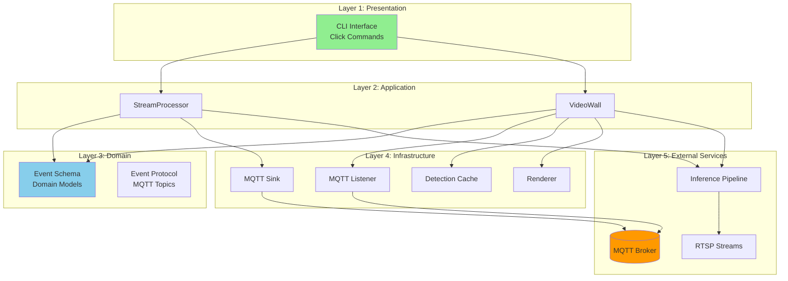
```mermaid
graph TB
    subgraph "Layer 1: Presentation"
        CLI[CLI Interface<br/>Click Commands]
    end
    
    subgraph "Layer 2: Application"
        SP[StreamProcessor]
        VW[VideoWall]
    end
    
    subgraph "Layer 3: Domain"
        EVT[Event Schema<br/>Domain Models]
        PROT[Event Protocol<br/>MQTT Topics]
    end
    
    subgraph "Layer 4: Infrastructure"
        MS[MQTT Sink]
        ML[MQTT Listener]
        DC[Detection Cache]
        DR[Renderer]
    end
    
    subgraph "Layer 5: External Services"
        MQTT[(MQTT Broker)]
        INF[Inference Pipeline]
        RTSP[RTSP Streams]
    end
    
    CLI --> SP
    CLI --> VW
    SP --> EVT
    VW --> EVT
    SP --> MS
    VW --> ML
    VW --> DC
    VW --> DR
    MS --> MQTT
    ML --> MQTT
    SP --> INF
    VW --> INF
    INF --> RTSP
    
    style CLI fill:#90EE90
    style EVT fill:#87CEEB
    style MQTT fill:#ff9900
```

---

## 🖥️ Vista Física (Physical View)

### Despliegue Simple (Single Node)

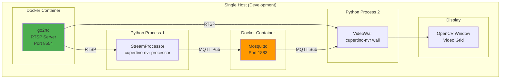
```mermaid
graph TB
    subgraph "Single Host (Development)"
        subgraph "Docker Container"
            MQTT[Mosquitto<br/>Port 1883]
        end
        
        subgraph "Docker Container"
            GO2[go2rtc<br/>RTSP Server<br/>Port 8554]
        end
        
        subgraph "Python Process 1"
            PROC[StreamProcessor<br/>cupertino-nvr processor]
        end
        
        subgraph "Python Process 2"
            WALL[VideoWall<br/>cupertino-nvr wall]
        end
        
        subgraph "Display"
            GUI[OpenCV Window<br/>Video Grid]
        end
    end
    
    GO2 -->|RTSP| PROC
    GO2 -->|RTSP| WALL
    PROC -->|MQTT Pub| MQTT
    MQTT -->|MQTT Sub| WALL
    WALL --> GUI
    
    style MQTT fill:#ff9900
    style GO2 fill:#4CAF50
```

### Despliegue Distribuido (Production)

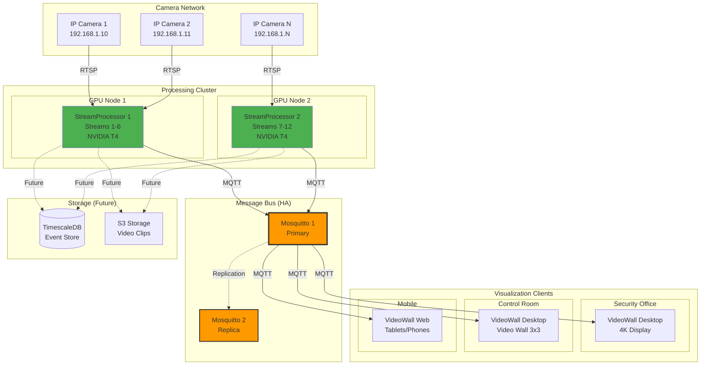
```mermaid
graph TB
    subgraph "Camera Network"
        CAM1[IP Camera 1<br/>192.168.1.10]
        CAM2[IP Camera 2<br/>192.168.1.11]
        CAM3[IP Camera N<br/>192.168.1.N]
    end
    
    subgraph "Processing Cluster"
        subgraph "GPU Node 1"
            PROC1[StreamProcessor 1<br/>Streams 1-6<br/>NVIDIA T4]
        end
        
        subgraph "GPU Node 2"
            PROC2[StreamProcessor 2<br/>Streams 7-12<br/>NVIDIA T4]
        end
    end
    
    subgraph "Message Bus (HA)"
        MQTT1[Mosquitto 1<br/>Primary]
        MQTT2[Mosquitto 2<br/>Replica]
    end
    
    subgraph "Visualization Clients"
        subgraph "Security Office"
            WALL1[VideoWall Desktop<br/>4K Display]
        end
        
        subgraph "Control Room"
            WALL2[VideoWall Desktop<br/>Video Wall 3x3]
        end
        
        subgraph "Mobile"
            WALL3[VideoWall Web<br/>Tablets/Phones]
        end
    end
    
    subgraph "Storage (Future)"
        DB[(TimescaleDB<br/>Event Store)]
        S3[S3 Storage<br/>Video Clips]
    end
    
    CAM1 -->|RTSP| PROC1
    CAM2 -->|RTSP| PROC1
    CAM3 -->|RTSP| PROC2
    
    PROC1 -->|MQTT| MQTT1
    PROC2 -->|MQTT| MQTT1
    MQTT1 -.->|Replication| MQTT2
    
    MQTT1 -->|MQTT| WALL1
    MQTT1 -->|MQTT| WALL2
    MQTT1 -->|MQTT| WALL3
    
    PROC1 -.->|Future| DB
    PROC2 -.->|Future| DB
    PROC1 -.->|Future| S3
    PROC2 -.->|Future| S3
    
    style MQTT1 fill:#ff9900,stroke:#333,stroke-width:3px
    style MQTT2 fill:#ff9900,stroke:#333,stroke-width:2px
    style PROC1 fill:#4CAF50
    style PROC2 fill:#4CAF50
```

### Flujo de Red

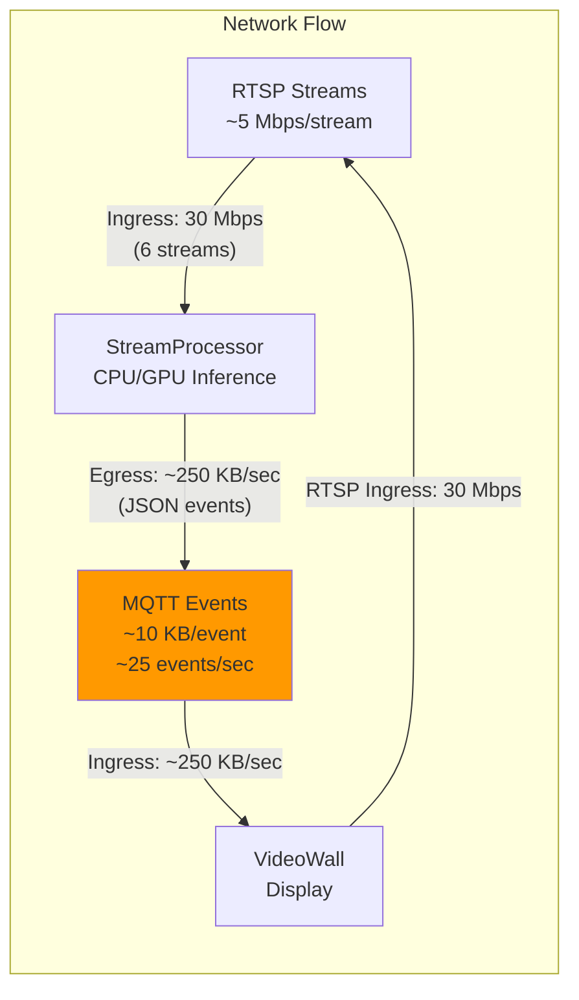
```mermaid
graph LR
    subgraph "Network Flow"
        RTSP[RTSP Streams<br/>~5 Mbps/stream]
        PROC[StreamProcessor<br/>CPU/GPU Inference]
        MQTT[MQTT Events<br/>~10 KB/event<br/>~25 events/sec]
        WALL[VideoWall<br/>Display]
    end
    
    RTSP -->|"Ingress: 30 Mbps<br/>(6 streams)"| PROC
    PROC -->|"Egress: ~250 KB/sec<br/>(JSON events)"| MQTT
    MQTT -->|"Ingress: ~250 KB/sec"| WALL
    WALL -->|"RTSP Ingress: 30 Mbps"| RTSP
    
    style MQTT fill:#ff9900
```

### Recursos por Componente

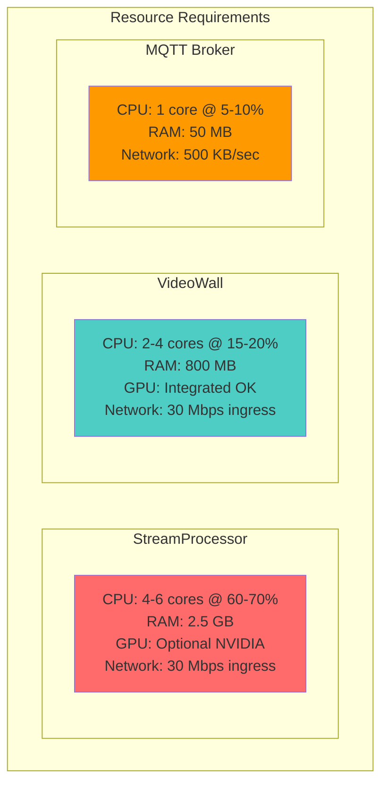
```mermaid
graph TB
    subgraph "Resource Requirements"
        subgraph "StreamProcessor"
            P1[CPU: 4-6 cores @ 60-70%<br/>RAM: 2.5 GB<br/>GPU: Optional NVIDIA<br/>Network: 30 Mbps ingress]
        end
        
        subgraph "VideoWall"
            P2[CPU: 2-4 cores @ 15-20%<br/>RAM: 800 MB<br/>GPU: Integrated OK<br/>Network: 30 Mbps ingress]
        end
        
        subgraph "MQTT Broker"
            P3[CPU: 1 core @ 5-10%<br/>RAM: 50 MB<br/>Network: 500 KB/sec]
        end
    end
    
    style P1 fill:#ff6b6b
    style P2 fill:#4ecdc4
    style P3 fill:#ff9900
```

---

## 🔄 Vista de Escenarios - Casos de Uso Adicionales

### Caso de Uso 1: Alertas en Tiempo Real

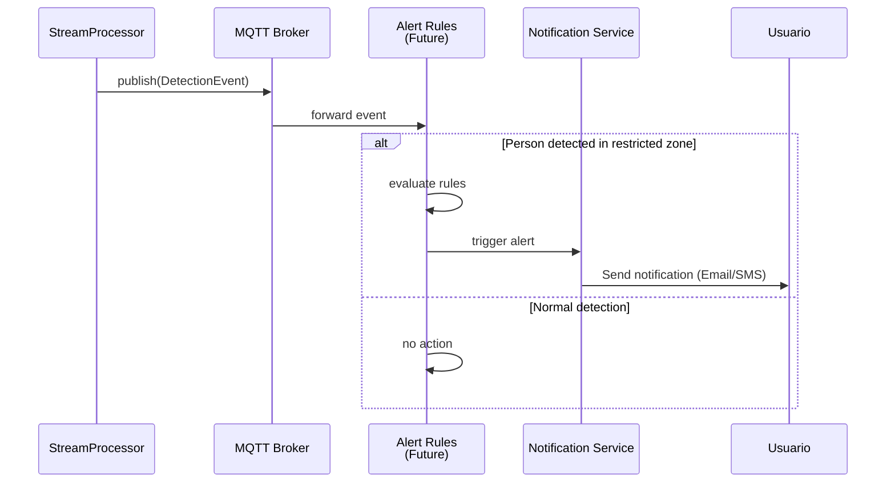
```mermaid
sequenceDiagram
    participant SP as StreamProcessor
    participant MB as MQTT Broker
    participant AR as Alert Rules<br/>(Future)
    participant NS as Notification Service
    participant U as Usuario
    
    SP->>MB: publish(DetectionEvent)
    MB->>AR: forward event
    
    alt Person detected in restricted zone
        AR->>AR: evaluate rules
        AR->>NS: trigger alert
        NS->>U: Send notification (Email/SMS)
    else Normal detection
        AR->>AR: no action
    end
```

### Caso de Uso 2: Análisis Histórico

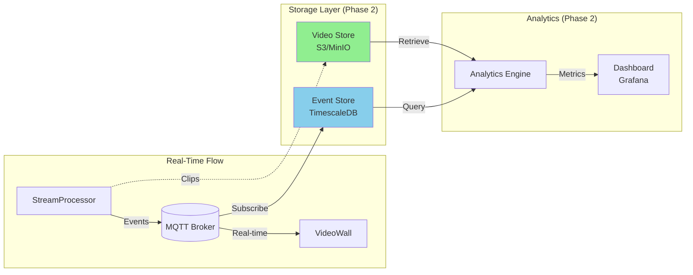
```mermaid
graph LR
    subgraph "Real-Time Flow"
        SP[StreamProcessor]
        MB[(MQTT Broker)]
        VW[VideoWall]
    end
    
    subgraph "Storage Layer (Phase 2)"
        ES[Event Store<br/>TimescaleDB]
        VS[Video Store<br/>S3/MinIO]
    end
    
    subgraph "Analytics (Phase 2)"
        AN[Analytics Engine]
        DASH[Dashboard<br/>Grafana]
    end
    
    SP -->|Events| MB
    MB -->|Subscribe| ES
    MB -->|Real-time| VW
    SP -.->|Clips| VS
    
    ES -->|Query| AN
    VS -->|Retrieve| AN
    AN -->|Metrics| DASH
    
    style ES fill:#87CEEB
    style VS fill:#90EE90
```

---

## 📊 Métricas y Monitoreo

### Health Check Architecture

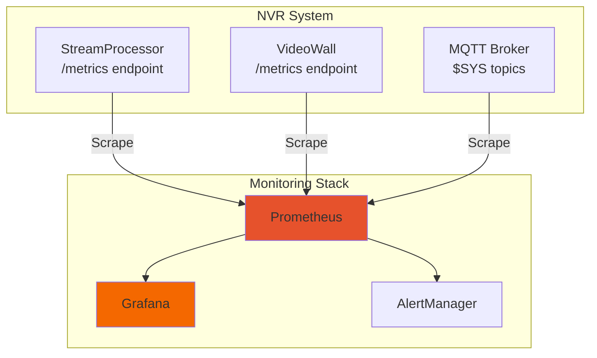
```mermaid
graph TB
    subgraph "Monitoring Stack"
        PROM[Prometheus]
        GRAF[Grafana]
        ALERT[AlertManager]
    end
    
    subgraph "NVR System"
        SP[StreamProcessor<br/>/metrics endpoint]
        WALL[VideoWall<br/>/metrics endpoint]
        MQTT[MQTT Broker<br/>$SYS topics]
    end
    
    SP -->|Scrape| PROM
    WALL -->|Scrape| PROM
    MQTT -->|Scrape| PROM
    PROM --> GRAF
    PROM --> ALERT
    
    style PROM fill:#E6522C
    style GRAF fill:#F46800
```

### Métricas Clave

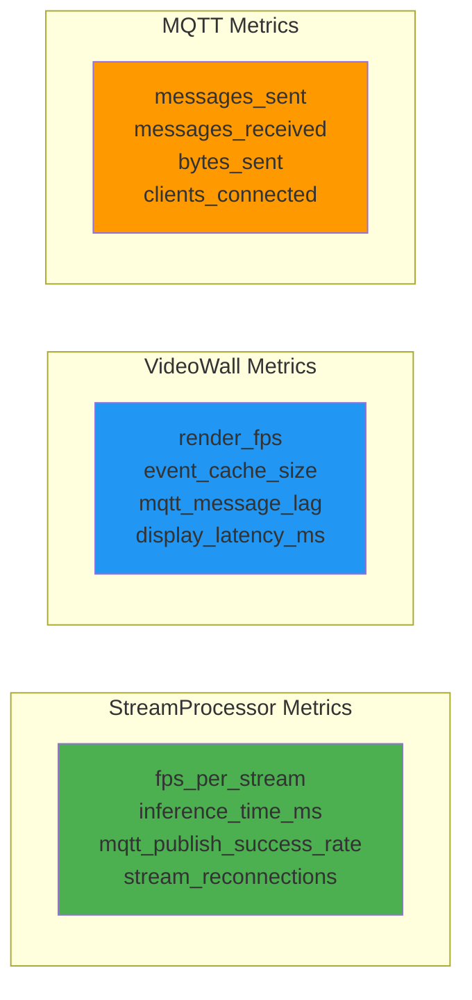
```mermaid
graph LR
    subgraph "StreamProcessor Metrics"
        M1[fps_per_stream<br/>inference_time_ms<br/>mqtt_publish_success_rate<br/>stream_reconnections]
    end
    
    subgraph "VideoWall Metrics"
        M2[render_fps<br/>event_cache_size<br/>mqtt_message_lag<br/>display_latency_ms]
    end
    
    subgraph "MQTT Metrics"
        M3[messages_sent<br/>messages_received<br/>bytes_sent<br/>clients_connected]
    end
    
    style M1 fill:#4CAF50
    style M2 fill:#2196F3
    style M3 fill:#ff9900
```

---

## 🔐 Consideraciones de Seguridad

### Security Architecture

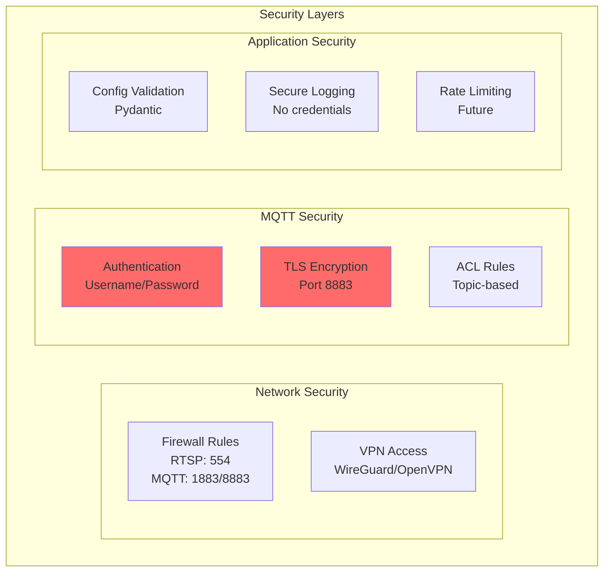
```mermaid
graph TB
    subgraph "Security Layers"
        subgraph "Network Security"
            FW[Firewall Rules<br/>RTSP: 554<br/>MQTT: 1883/8883]
            VPN[VPN Access<br/>WireGuard/OpenVPN]
        end
        
        subgraph "MQTT Security"
            AUTH[Authentication<br/>Username/Password]
            TLS[TLS Encryption<br/>Port 8883]
            ACL[ACL Rules<br/>Topic-based]
        end
        
        subgraph "Application Security"
            CONF[Config Validation<br/>Pydantic]
            LOGS[Secure Logging<br/>No credentials]
            RATE[Rate Limiting<br/>Future]
        end
    end
    
    style AUTH fill:#ff6b6b
    style TLS fill:#ff6b6b
```

---

## 🚀 Roadmap de Evolución

### Phase 1: MVP (Actual) ✅

```mermaid
graph LR
    A[Event Protocol] --> B[StreamProcessor]
    B --> C[VideoWall]
    C --> D[CLI Interface]
    D --> E[MVP Complete]
    
    style E fill:#90EE90,stroke:#333,stroke-width:3px
```

### Phase 2: Production Hardening 🟡

```mermaid
graph TB
    MVP[MVP] --> P2A[Event Store<br/>TimescaleDB]
    MVP --> P2B[Web UI<br/>React + WebRTC]
    MVP --> P2C[HA MQTT<br/>Cluster]
    MVP --> P2D[Monitoring<br/>Prometheus]
    
    P2A --> PROD[Production Ready]
    P2B --> PROD
    P2C --> PROD
    P2D --> PROD
```

### Phase 3: Advanced Features 🔵

```mermaid
graph TB
    PROD[Production] --> P3A[Multi-Tenant]
    PROD --> P3B[Alert Rules]
    PROD --> P3C[Re-ID]
    PROD --> P3D[Analytics]
    
    P3A --> ENT[Enterprise]
    P3B --> ENT
    P3C --> ENT
    P3D --> ENT
```

---

## 📝 Decisiones Arquitectónicas (ADRs)

### ADR-001: MQTT como Event Bus

**Status:** ✅ Accepted

**Context:** Necesitamos desacoplar StreamProcessor de VideoWall

**Decision:** Usar MQTT (QoS 0) como message bus

**Consequences:**
- ✅ Pub/sub nativo
- ✅ Escalado horizontal
- ✅ Standard IoT/Industrial
- ⚠️ +50-100ms latencia
- ⚠️ Dependencia externa (broker)

### ADR-002: Pydantic para Event Schema

**Status:** ✅ Accepted

**Context:** Necesitamos type-safety y validación

**Decision:** Usar Pydantic v2 para schemas

**Consequences:**
- ✅ Type-safe serialization
- ✅ Automatic validation
- ✅ JSON schema generation
- ✅ Performance (Rust core)

### ADR-003: OpenCV para Rendering

**Status:** ✅ Accepted

**Context:** Necesitamos display de video grid

**Decision:** OpenCV + supervision para MVP

**Consequences:**
- ✅ Simple y probado
- ✅ Cross-platform
- ⚠️ Desktop only (no web)
- 🔵 Phase 2: Web UI con WebRTC

### ADR-004: Independent Package Structure

**Status:** ✅ Accepted

**Context:** ¿Core de inference o paquete separado?

**Decision:** Paquete independiente (`cupertino-nvr`)

**Consequences:**
- ✅ Own versioning
- ✅ Clear ownership
- ✅ Flexible deployment
- ⚠️ User must install inference separately

---

## 🎯 Quality Attributes

### Performance

| Metric | Target | Actual | Status |
|--------|--------|--------|--------|
| End-to-end latency | < 200ms | 🟡 TBD | Testing needed |
| StreamProcessor CPU | < 65% | 🟡 TBD | Testing needed |
| VideoWall CPU | < 20% | 🟡 TBD | Testing needed |
| MQTT throughput | 25 events/sec | ✅ OK | Design spec |

### Scalability

- **Horizontal:** ✅ N processors + M viewers
- **Vertical:** ✅ GPU acceleration supported
- **Streams:** ✅ Tested design for 12 streams
- **Limit:** 🟡 Network bandwidth (30 Mbps/6 streams)

### Reliability

- **Graceful shutdown:** ✅ SIGINT/SIGTERM handlers
- **Reconnection:** ✅ InferencePipeline auto-reconnect
- **Error handling:** ✅ Try-catch + logging
- **Watchdog:** ✅ Pipeline health monitoring

### Maintainability

- **Code organization:** ✅ Clear bounded contexts
- **Test coverage:** ✅ >80% unit tests
- **Documentation:** ✅ Complete
- **Logging:** ✅ Structured logging

---

## 🔍 Análisis de Trade-offs

| Aspecto | Pro ✅ | Con ⚠️ | Mitigation 🛡️ |
|---------|--------|--------|---------------|
| **MQTT QoS 0** | Latencia mínima | Puede perder eventos | Acceptable para video real-time |
| **TTL Cache** | Simple, no leaks | Events pueden expirar | TTL=1s es suficiente |
| **OpenCV GUI** | Cross-platform | Desktop only | Phase 2: Web UI |
| **JSON Events** | Human-readable | Bandwidth | Future: MessagePack |

---

## 📚 Referencias

### Documentos Relacionados

- **[README.md](./README.md)** - Package documentation
- **[DESIGN_NVR_MULTIPLEXER.md](../../wiki/DESIGN_NVR_MULTIPLEXER.md)** - Detailed design
- **[IMPLEMENTATION_STATUS.md](./IMPLEMENTATION_STATUS.md)** - Current status
- **[DEVELOPER_GUIDE.md](./DEVELOPER_GUIDE.md)** - Developer reference

### Standards & Patterns

- **4+1 Architecture:** Philippe Kruchten (1995)
- **DDD:** Domain-Driven Design - Eric Evans
- **MQTT:** ISO/IEC 20922
- **Pydantic:** Data validation using Python type annotations

---

## 🎸 Conclusión

Esta arquitectura 4+1 proporciona **the big picture** del sistema Cupertino NVR desde múltiples perspectivas:

✅ **Logical View** - Componentes y su organización  
✅ **Process View** - Concurrencia y threads  
✅ **Development View** - Estructura de código  
✅ **Physical View** - Despliegue y hardware  
✅ **Scenarios** - Casos de uso que integran las vistas

### Puntos de Extensión para Evolución

1. **Event Store** - Agregar persistencia (TimescaleDB)
2. **Web UI** - Reemplazar OpenCV con React + WebRTC
3. **Multi-tenant** - Namespace MQTT topics por tenant
4. **Analytics** - Agregar capa de análisis sobre eventos
5. **Recording** - Guardar clips cuando ocurren detecciones

---

**Version:** 1.0  
**Status:** ✅ Complete  
**Next Review:** After Phase 2 implementation

🎸 *"Architecture is about the important stuff... whatever that is"* - Ralph Johnson

