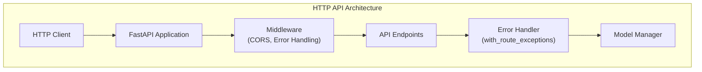
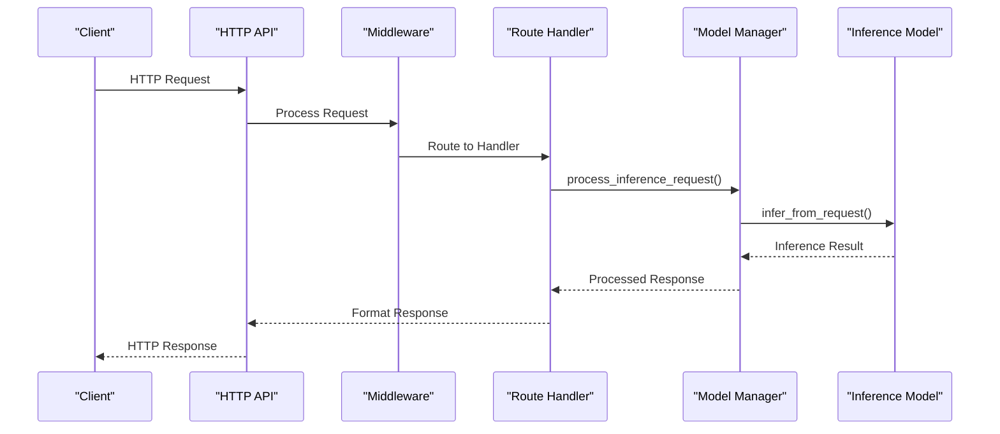
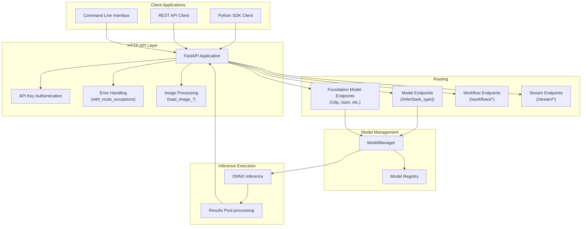
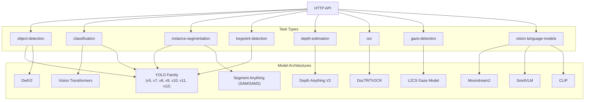

# HTTP API  

Relevant source files

- [inference/core/cache/model_artifacts.py](https://github.com/roboflow/inference/blob/55f57676/inference/core/cache/model_artifacts.py)
- [inference/core/env.py](https://github.com/roboflow/inference/blob/55f57676/inference/core/env.py)
- [inference/core/interfaces/http/http_api.py](https://github.com/roboflow/inference/blob/55f57676/inference/core/interfaces/http/http_api.py)
- [inference/core/managers/base.py](https://github.com/roboflow/inference/blob/55f57676/inference/core/managers/base.py)
- [inference/core/managers/decorators/base.py](https://github.com/roboflow/inference/blob/55f57676/inference/core/managers/decorators/base.py)
- [inference/core/managers/decorators/fixed_size_cache.py](https://github.com/roboflow/inference/blob/55f57676/inference/core/managers/decorators/fixed_size_cache.py)
- [inference/core/managers/decorators/logger.py](https://github.com/roboflow/inference/blob/55f57676/inference/core/managers/decorators/logger.py)
- [inference/core/models/base.py](https://github.com/roboflow/inference/blob/55f57676/inference/core/models/base.py)
- [inference/core/models/roboflow.py](https://github.com/roboflow/inference/blob/55f57676/inference/core/models/roboflow.py)
- [inference/core/models/stubs.py](https://github.com/roboflow/inference/blob/55f57676/inference/core/models/stubs.py)
- [inference/core/registries/roboflow.py](https://github.com/roboflow/inference/blob/55f57676/inference/core/registries/roboflow.py)
- [inference/core/roboflow_api.py](https://github.com/roboflow/inference/blob/55f57676/inference/core/roboflow_api.py)
- [inference/core/utils/roboflow.py](https://github.com/roboflow/inference/blob/55f57676/inference/core/utils/roboflow.py)
- [inference/core/utils/visualisation.py](https://github.com/roboflow/inference/blob/55f57676/inference/core/utils/visualisation.py)
- [inference/core/version.py](https://github.com/roboflow/inference/blob/55f57676/inference/core/version.py)
- [inference/models/__init__.py](https://github.com/roboflow/inference/blob/55f57676/inference/models/__init__.py)
- [inference/models/utils.py](https://github.com/roboflow/inference/blob/55f57676/inference/models/utils.py)
- [tests/inference/unit_tests/core/cache/__init__.py](https://github.com/roboflow/inference/blob/55f57676/tests/inference/unit_tests/core/cache/__init__.py)
- [tests/inference/unit_tests/core/cache/test_model_artifacts.py](https://github.com/roboflow/inference/blob/55f57676/tests/inference/unit_tests/core/cache/test_model_artifacts.py)
- [tests/inference/unit_tests/core/models/test_roboflow.py](https://github.com/roboflow/inference/blob/55f57676/tests/inference/unit_tests/core/models/test_roboflow.py)

This document provides a comprehensive overview of the HTTP API in the Roboflow Inference system, detailing how to interact with the inference server over HTTP. The HTTP API serves as the primary interface for model inference, model management, and workflow execution.

For information about model management implementation details, see [Model Management](https://deepwiki.com/roboflow/inference/2.2-model-manager-and-registry). For workflow system details, see [Workflow System](https://deepwiki.com/roboflow/inference/2.3-caching-and-persistence). For stream processing capabilities, see [Stream Processing](https://deepwiki.com/roboflow/inference/2.1-http-api-server#2.4).

## Architecture Overview

The HTTP API is implemented using FastAPI, a modern web framework for building APIs with Python. The `HttpInterface` class serves as the main entry point for the HTTP API, initializing the FastAPI application and adding routes for different inference tasks.





Sources:

- [inference/core/interfaces/http/http_api.py543-587](https://github.com/roboflow/inference/blob/55f57676/inference/core/interfaces/http/http_api.py#L543-L587)
- [inference/core/interfaces/http/http_api.py258-533](https://github.com/roboflow/inference/blob/55f57676/inference/core/interfaces/http/http_api.py#L258-L533)

## Request Processing Flow

When a request is received by the API, it follows a specific processing flow through the system:



Sources:

- [inference/core/interfaces/http/http_api.py773-791](https://github.com/roboflow/inference/blob/55f57676/inference/core/interfaces/http/http_api.py#L773-L791)
- [inference/core/interfaces/http/http_api.py793-833](https://github.com/roboflow/inference/blob/55f57676/inference/core/interfaces/http/http_api.py#L793-L833)

## Endpoints

The Inference HTTP API provides several categories of endpoints:

### Core Server Information

- **GET /info**: Get server version information
- **GET /device/stats**: Get device statistics (when configured)

Sources:

- [inference/core/interfaces/http/http_api.py952-968](https://github.com/roboflow/inference/blob/55f57676/inference/core/interfaces/http/http_api.py#L952-L968)
- [inference/core/interfaces/http/http_api.py671-693](https://github.com/roboflow/inference/blob/55f57676/inference/core/interfaces/http/http_api.py#L671-L693)

### Model Management

- **GET /model/registry**: List all loaded models
- **POST /model/add**: Add a model to the registry
- **POST /model/clear**: Remove a model from the registry

Sources:

- [inference/core/interfaces/http/http_api.py973-988](https://github.com/roboflow/inference/blob/55f57676/inference/core/interfaces/http/http_api.py#L973-L988)
- [inference/core/interfaces/http/http_api.py1005-1033](https://github.com/roboflow/inference/blob/55f57676/inference/core/interfaces/http/http_api.py#L1005-L1033)
- [inference/core/interfaces/http/http_api.py1035-1062](https://github.com/roboflow/inference/blob/55f57676/inference/core/interfaces/http/http_api.py#L1035-L1062)

### Inference Endpoints

The main inference endpoints follow the pattern `/infer/{task_type}` where `task_type` can be:

- **object-detection**: Detect objects in an image
- **classification**: Classify an image
- **instance-segmentation**: Segment objects in an image
- **keypoint-detection**: Detect keypoints (like pose estimation)
- **depth-estimation**: Estimate depth from a single image
- Various other specialized tasks

Example endpoint:

```
POST /infer/object-detection
```

Sources:

- [inference/core/interfaces/http/http_api.py1145-1185](https://github.com/roboflow/inference/blob/55f57676/inference/core/interfaces/http/http_api.py#L1145-L1185)
- [inference/core/interfaces/http/http_api.py1187-1230](https://github.com/roboflow/inference/blob/55f57676/inference/core/interfaces/http/http_api.py#L1187-L1230)
- [inference/core/interfaces/http/http_api.py1232-1272](https://github.com/roboflow/inference/blob/55f57676/inference/core/interfaces/http/http_api.py#L1232-L1272)
- [inference/core/interfaces/http/http_api.py1274-1313](https://github.com/roboflow/inference/blob/55f57676/inference/core/interfaces/http/http_api.py#L1274-L1313)
- [inference/core/interfaces/http/http_api.py3099-3137](https://github.com/roboflow/inference/blob/55f57676/inference/core/interfaces/http/http_api.py#L3099-L3137)

### Foundation Model Endpoints

Endpoints for specific foundation models:

- **Clip**: Text/image embedding and comparison
- **SAM/SAM2**: Segment Anything Model operations
- **GAZE**: Gaze detection
- **OwlV2**: Open-vocabulary object detection
- **DocTR/TrOCR**: Document OCR
- **Depth Estimation**: Single-image depth estimation

Sources:

- [inference/core/interfaces/http/http_api.py1315-1417](https://github.com/roboflow/inference/blob/55f57676/inference/core/interfaces/http/http_api.py#L1315-L1417)
- [inference/core/interfaces/http/http_api.py1419-1542](https://github.com/roboflow/inference/blob/55f57676/inference/core/interfaces/http/http_api.py#L1419-L1542)
- [inference/core/interfaces/http/http_api.py1544-1585](https://github.com/roboflow/inference/blob/55f57676/inference/core/interfaces/http/http_api.py#L1544-L1585)
- [inference/core/interfaces/http/http_api.py2171-2210](https://github.com/roboflow/inference/blob/55f57676/inference/core/interfaces/http/http_api.py#L2171-L2210)
- [inference/core/interfaces/http/http_api.py3099-3137](https://github.com/roboflow/inference/blob/55f57676/inference/core/interfaces/http/http_api.py#L3099-L3137)

### Workflow Endpoints

- **POST /workflows/specification/infer**: Run an inference workflow from a specification
- **POST /workflows/predefined/infer**: Run a predefined workflow
- **GET /workflows/blocks/describe**: Get information about available workflow blocks

Sources:

- [inference/core/interfaces/http/http_api.py2269-2338](https://github.com/roboflow/inference/blob/55f57676/inference/core/interfaces/http/http_api.py#L2269-L2338)
- [inference/core/interfaces/http/http_api.py2340-2402](https://github.com/roboflow/inference/blob/55f57676/inference/core/interfaces/http/http_api.py#L2340-L2402)
- [inference/core/interfaces/http/http_api.py2404-2433](https://github.com/roboflow/inference/blob/55f57676/inference/core/interfaces/http/http_api.py#L2404-L2433)

### Stream API Endpoints

- **GET /stream/pipelines**: List active stream pipelines
- **POST /stream/pipelines**: Create a new stream pipeline
- **GET /stream/pipelines/{pipeline_id}**: Get stream pipeline status
- **DELETE /stream/pipelines/{pipeline_id}**: Stop and remove a stream pipeline

Sources:

- [inference/core/interfaces/http/http_api.py1778-1806](https://github.com/roboflow/inference/blob/55f57676/inference/core/interfaces/http/http_api.py#L1778-L1806)
- [inference/core/interfaces/http/http_api.py1808-1874](https://github.com/roboflow/inference/blob/55f57676/inference/core/interfaces/http/http_api.py#L1808-L1874)
- [inference/core/interfaces/http/http_api.py1876-1904](https://github.com/roboflow/inference/blob/55f57676/inference/core/interfaces/http/http_api.py#L1876-L1904)
- [inference/core/interfaces/http/http_api.py1906-1934](https://github.com/roboflow/inference/blob/55f57676/inference/core/interfaces/http/http_api.py#L1906-L1934)

## Request Format

All requests to the inference API follow a structured format. Here's a breakdown of the common components:

### Authentication

Authentication is done via the `api_key` parameter, which can be passed in either:

- As a query parameter: `?api_key=YOUR_API_KEY`
- In the request body JSON

```
{
  "api_key": "YOUR_API_KEY",
  "model_id": "project/version",
  ...
}
```

Sources:

- [inference/core/interfaces/http/http_api.py696-757](https://github.com/roboflow/inference/blob/55f57676/inference/core/interfaces/http/http_api.py#L696-L757)
- [inference/core/entities/requests/inference.py23-25](https://github.com/roboflow/inference/blob/55f57676/inference/core/entities/requests/inference.py#L23-L25)

### Base Request Structure

All inference requests inherit from the `BaseRequest` class and have these common fields:

|Field|Type|Description|
|---|---|---|
|id|string|Unique request identifier (auto-generated)|
|api_key|string|Roboflow API key for authentication|
|model_id|string|Model identifier in format "project/version"|
|source|string|Optional source of the request|

Sources:

- [inference/core/entities/requests/inference.py9-29](https://github.com/roboflow/inference/blob/55f57676/inference/core/entities/requests/inference.py#L9-L29)
- [inference/core/entities/requests/inference.py31-41](https://github.com/roboflow/inference/blob/55f57676/inference/core/entities/requests/inference.py#L31-L41)

### Image Input Formats

For vision tasks, images can be provided in several formats:

|Format|Description|Configuration Flag|
|---|---|---|
|base64|Base64-encoded image|Always enabled|
|url|URL pointing to an image|ALLOW_URL_INPUT (default: true)|
|file|Path to a local file|ALLOW_LOADING_IMAGES_FROM_LOCAL_FILESYSTEM (default: true)|
|multipart|File uploaded via multipart form|Always enabled|
|numpy|Serialized numpy array|ALLOW_NUMPY_INPUT (default: false)|

Example image specification:

```
"image": {
  "type": "url",
  "value": "https://example.com/image.jpg"
}
```

Sources:

- [inference/core/entities/requests/inference.py43-59](https://github.com/roboflow/inference/blob/55f57676/inference/core/entities/requests/inference.py#L43-L59)
- [inference/core/utils/image_utils.py42-51](https://github.com/roboflow/inference/blob/55f57676/inference/core/utils/image_utils.py#L42-L51)
- [docs/server_configuration/accepted_input_formats.md17-91](https://github.com/roboflow/inference/blob/55f57676/docs/server_configuration/accepted_input_formats.md#L17-L91)

### Task-Specific Parameters

Different inference tasks have different parameters. Here are some examples:

#### Object Detection

```
{
  "model_id": "project/version",
  "api_key": "YOUR_API_KEY",
  "image": {"type": "url", "value": "https://example.com/image.jpg"},
  "confidence": 0.5,
  "iou_threshold": 0.3,
  "class_agnostic_nms": false,
  "max_detections": 300,
  "class_filter": ["car", "person"],
  "visualize_predictions": true
}
```

Sources:

- [inference/core/entities/requests/inference.py118-188](https://github.com/roboflow/inference/blob/55f57676/inference/core/entities/requests/inference.py#L118-L188)

#### Classification

```
{
  "model_id": "project/version",
  "api_key": "YOUR_API_KEY",
  "image": {"type": "url", "value": "https://example.com/image.jpg"},
  "confidence": 0.4
}
```

Sources:

- [inference/core/entities/requests/inference.py223-260](https://github.com/roboflow/inference/blob/55f57676/inference/core/entities/requests/inference.py#L223-L260)

## Response Format

The API uses structured response objects for all endpoints. Different task types have different response formats.

### Common Response Fields

All inference responses include:

|Field|Type|Description|
|---|---|---|
|inference_id|string|Unique identifier for the inference|
|time|float|Time taken to process the request (in seconds)|
|image|object|Information about the input image (width, height)|

Sources:

- [inference/core/entities/responses/inference.py163-183](https://github.com/roboflow/inference/blob/55f57676/inference/core/entities/responses/inference.py#L163-L183)
- [inference/core/entities/responses/inference.py186-194](https://github.com/roboflow/inference/blob/55f57676/inference/core/entities/responses/inference.py#L186-L194)

### Task-Specific Responses

#### Object Detection Response

```
{
  "inference_id": "abc123",
  "time": 0.123,
  "image": {
    "width": 640,
    "height": 480
  },
  "predictions": [
    {
      "x": 100,
      "y": 200,
      "width": 50,
      "height": 80,
      "confidence": 0.95,
      "class": "person",
      "class_id": 0
    },
    ...
  ],
  "visualization": "base64_encoded_image_data"
}
```

Sources:

- [inference/core/entities/responses/inference.py215-224](https://github.com/roboflow/inference/blob/55f57676/inference/core/entities/responses/inference.py#L215-L224)
- [inference/core/entities/responses/inference.py8-52](https://github.com/roboflow/inference/blob/55f57676/inference/core/entities/responses/inference.py#L8-L52)

#### Classification Response

```
{
  "inference_id": "abc123",
  "time": 0.05,
  "image": {
    "width": 640,
    "height": 480
  },
  "predictions": [
    {
      "class": "cat",
      "class_id": 0,
      "confidence": 0.98
    },
    ...
  ],
  "top": "cat",
  "confidence": 0.98
}
```

Sources:

- [inference/core/entities/responses/inference.py255-275](https://github.com/roboflow/inference/blob/55f57676/inference/core/entities/responses/inference.py#L255-L275)
- [inference/core/entities/responses/inference.py120-134](https://github.com/roboflow/inference/blob/55f57676/inference/core/entities/responses/inference.py#L120-L134)

#### Depth Estimation Response

```
{
  "time": 0.234,
  "normalized_depth": [[0.1, 0.2, ...], [0.3, 0.4, ...], ...],
  "visualization": "base64_encoded_depth_visualization"
}
```

Sources:

- [inference/core/entities/responses/inference.py319-333](https://github.com/roboflow/inference/blob/55f57676/inference/core/entities/responses/inference.py#L319-L333)
- [inference/models/depth_estimation/depthestimation.py53-108](https://github.com/roboflow/inference/blob/55f57676/inference/models/depth_estimation/depthestimation.py#L53-L108)

## Error Handling

The API uses standard HTTP status codes and returns JSON error responses:

|Status Code|Description|Common Causes|
|---|---|---|
|400|Bad Request|Invalid input parameters, malformed image|
|401|Unauthorized|Invalid or missing API key|
|404|Not Found|Model or resource not found|
|500|Internal Server Error|Server-side processing error|
|502|Bad Gateway|Error communicating with Roboflow API|
|503|Service Unavailable|Roboflow API connection error|
|504|Gateway Timeout|Timeout connecting to Roboflow API|

Error responses follow this format:

```
{
  "message": "Error description for the user",
  "error_type": "ErrorClassName"
}
```

Complex errors may include additional fields like `context`, `inner_error_type`, etc.

Sources:

- [inference/core/interfaces/http/http_api.py258-533](https://github.com/roboflow/inference/blob/55f57676/inference/core/interfaces/http/http_api.py#L258-L533)
- [inference/core/exceptions.py4-210](https://github.com/roboflow/inference/blob/55f57676/inference/core/exceptions.py#L4-L210)

## Complete API Flow Diagram

This diagram illustrates the full request-response cycle, showing the interaction between various components:




Sources:

- [inference/core/interfaces/http/http_api.py544-3407](https://github.com/roboflow/inference/blob/55f57676/inference/core/interfaces/http/http_api.py#L544-L3407)
- [inference/core/managers/base.py](https://github.com/roboflow/inference/blob/55f57676/inference/core/managers/base.py)
- [inference/models/utils.py45-483](https://github.com/roboflow/inference/blob/55f57676/inference/models/utils.py#L45-L483)

## Supported Models

The HTTP API supports a wide range of inference models through a unified interface. The models are categorized by task type and model architecture:





Sources:

- [inference/models/utils.py45-483](https://github.com/roboflow/inference/blob/55f57676/inference/models/utils.py#L45-L483)
- [inference/models/__init__.py1-107](https://github.com/roboflow/inference/blob/55f57676/inference/models/__init__.py#L1-L107)
- [inference/core/registries/roboflow.py46-60](https://github.com/roboflow/inference/blob/55f57676/inference/core/registries/roboflow.py#L46-L60)

## Examples of API Usage

### Basic Object Detection Request

```
import requests

api_url = "http://localhost:9001/infer/object-detection"
data = {
    "api_key": "YOUR_API_KEY",
    "model_id": "project-name/version-number",
    "image": {
        "type": "url",
        "value": "https://example.com/image.jpg"
    },
    "confidence": 0.5,
    "iou_threshold": 0.3,
    "visualize_predictions": True
}

response = requests.post(api_url, json=data)
results = response.json()
```

### Basic Depth Estimation Request

```
import requests

api_url = "http://localhost:9001/infer/depth-estimation"
data = {
    "api_key": "YOUR_API_KEY",
    "model_id": "depth-anything-v2/small",
    "image": {
        "type": "url",
        "value": "https://example.com/image.jpg"
    }
}

response = requests.post(api_url, json=data)
results = response.json()
# Access the normalized depth map and visualization
depth_map = results["normalized_depth"]
visualization = results["visualization"]  # Base64-encoded image
```

Sources:

- [inference/core/entities/requests/inference.py92-192](https://github.com/roboflow/inference/blob/55f57676/inference/core/entities/requests/inference.py#L92-L192)
- [inference/core/entities/requests/inference.py92-116](https://github.com/roboflow/inference/blob/55f57676/inference/core/entities/requests/inference.py#L92-L116)
- [inference/models/depth_estimation/depthestimation.py53-108](https://github.com/roboflow/inference/blob/55f57676/inference/models/depth_estimation/depthestimation.py#L53-L108)