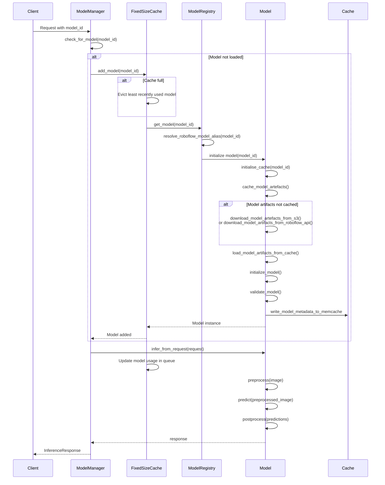
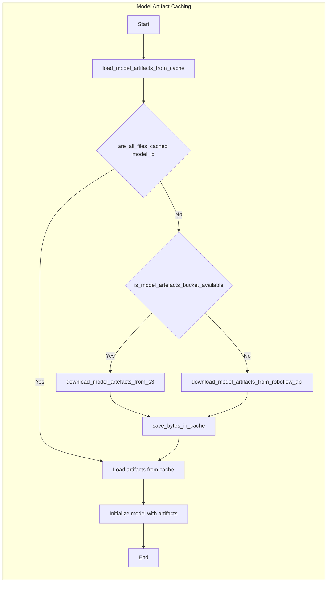
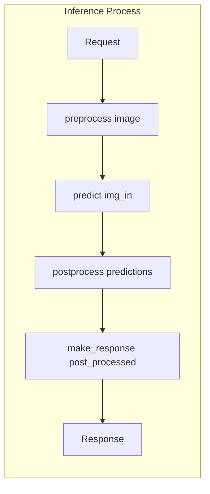

# Model Management

Relevant source files

- [inference/core/cache/model_artifacts.py](https://github.com/roboflow/inference/blob/55f57676/inference/core/cache/model_artifacts.py)
- [inference/core/env.py](https://github.com/roboflow/inference/blob/55f57676/inference/core/env.py)
- [inference/core/interfaces/http/http_api.py](https://github.com/roboflow/inference/blob/55f57676/inference/core/interfaces/http/http_api.py)
- [inference/core/managers/base.py](https://github.com/roboflow/inference/blob/55f57676/inference/core/managers/base.py)
- [inference/core/managers/decorators/base.py](https://github.com/roboflow/inference/blob/55f57676/inference/core/managers/decorators/base.py)
- [inference/core/managers/decorators/fixed_size_cache.py](https://github.com/roboflow/inference/blob/55f57676/inference/core/managers/decorators/fixed_size_cache.py)
- [inference/core/managers/decorators/logger.py](https://github.com/roboflow/inference/blob/55f57676/inference/core/managers/decorators/logger.py)
- [inference/core/models/base.py](https://github.com/roboflow/inference/blob/55f57676/inference/core/models/base.py)
- [inference/core/models/roboflow.py](https://github.com/roboflow/inference/blob/55f57676/inference/core/models/roboflow.py)
- [inference/core/models/stubs.py](https://github.com/roboflow/inference/blob/55f57676/inference/core/models/stubs.py)
- [inference/core/registries/roboflow.py](https://github.com/roboflow/inference/blob/55f57676/inference/core/registries/roboflow.py)
- [inference/core/roboflow_api.py](https://github.com/roboflow/inference/blob/55f57676/inference/core/roboflow_api.py)
- [inference/core/utils/roboflow.py](https://github.com/roboflow/inference/blob/55f57676/inference/core/utils/roboflow.py)
- [inference/core/utils/visualisation.py](https://github.com/roboflow/inference/blob/55f57676/inference/core/utils/visualisation.py)
- [inference/core/version.py](https://github.com/roboflow/inference/blob/55f57676/inference/core/version.py)
- [inference/models/__init__.py](https://github.com/roboflow/inference/blob/55f57676/inference/models/__init__.py)
- [inference/models/utils.py](https://github.com/roboflow/inference/blob/55f57676/inference/models/utils.py)
- [tests/inference/unit_tests/core/cache/__init__.py](https://github.com/roboflow/inference/blob/55f57676/tests/inference/unit_tests/core/cache/__init__.py)
- [tests/inference/unit_tests/core/cache/test_model_artifacts.py](https://github.com/roboflow/inference/blob/55f57676/tests/inference/unit_tests/core/cache/test_model_artifacts.py)
- [tests/inference/unit_tests/core/models/test_roboflow.py](https://github.com/roboflow/inference/blob/55f57676/tests/inference/unit_tests/core/models/test_roboflow.py)

This page explains how models are loaded, cached, and managed within the Roboflow Inference server. The model management system is responsible for the entire lifecycle of machine learning models, from loading model weights to efficient caching and inference execution.

## Architecture Overview

The Model Management system follows a layered architecture pattern, separating the model handling responsibilities into distinct components:

- **ModelManager**: Central component for tracking and routing requests to the appropriate models
- **Model Registry**: Responsible for resolving model identifiers and instantiating the correct model classes
- **Model Classes**: Base abstractions and task-specific implementations of models
- **Cache Management**: Strategies for efficiently managing model memory usage

### Class Hierarchy Diagram

Sources:

- [inference/core/managers/base.py26-414](https://github.com/roboflow/inference/blob/55f57676/inference/core/managers/base.py#L26-L414)
- [inference/core/managers/decorators/base.py13-222](https://github.com/roboflow/inference/blob/55f57676/inference/core/managers/decorators/base.py#L13-L222)
- [inference/core/managers/decorators/fixed_size_cache.py13-166](https://github.com/roboflow/inference/blob/55f57676/inference/core/managers/decorators/fixed_size_cache.py#L13-L166)
- [inference/core/managers/decorators/logger.py10-74](https://github.com/roboflow/inference/blob/55f57676/inference/core/managers/decorators/logger.py#L10-L74)
- [inference/core/models/base.py13-162](https://github.com/roboflow/inference/blob/55f57676/inference/core/models/base.py#L13-L162)
- [inference/core/models/roboflow.py106-887](https://github.com/roboflow/inference/blob/55f57676/inference/core/models/roboflow.py#L106-L887)

## Key Components

### ModelManager

The ModelManager is the central class that tracks loaded models and routes requests to the appropriate model instances. It stores a dictionary of models keyed by their model_id and provides methods for adding, removing, and using models for inference.

```
class ModelManager:
    def __init__(self, model_registry: ModelRegistry, models: Optional[dict] = None):
        self.model_registry = model_registry
        self._models: Dict[str, Model] = models if models is not None else {}
        self.pingback = None
```

The ModelManager's primary responsibilities include:

1. **Model Lifecycle Management**: Adding and removing models from memory
2. **Inference Coordination**: Routing inference requests to the appropriate model
3. **Error Handling**: Dealing with missing models or inference failures
4. **Metrics Collection**: Tracking inference counts and timing information

Sources:

- [inference/core/managers/base.py26-95](https://github.com/roboflow/inference/blob/55f57676/inference/core/managers/base.py#L26-L95)
- [inference/core/managers/base.py234-257](https://github.com/roboflow/inference/blob/55f57676/inference/core/managers/base.py#L234-L257)

### Model Abstractions

The system is built on a hierarchy of model abstractions that provide a common interface while allowing for specialized implementations.

#### Base Model Class

The `Model` class provides the foundational interface for all models in the system:

```
class Model(BaseInference):
    def infer_from_request(self, request: InferenceRequest) -> Union[List[InferenceResponse], InferenceResponse]:
        t1 = perf_counter()
        responses = self.infer(**request.dict(), return_image_dims=False)
        for response in responses:
            response.time = perf_counter() - t1
            if request.id:
                response.inference_id = request.id
        # ...
        return responses
```

Every model implements these key methods:

- `preprocess`: Prepares input data for the model
- `predict`: Executes the actual model inference
- `postprocess`: Transforms raw predictions into structured responses
- `infer`: Orchestrates the entire inference pipeline
- `infer_from_request`: Handles an inference request and returns a formatted response

Sources:

- [inference/core/models/base.py77-162](https://github.com/roboflow/inference/blob/55f57676/inference/core/models/base.py#L77-L162)
- [inference/core/models/base.py13-49](https://github.com/roboflow/inference/blob/55f57676/inference/core/models/base.py#L13-L49)

#### RoboflowInferenceModel

The `RoboflowInferenceModel` class extends the base Model class with Roboflow-specific functionality:

```
class RoboflowInferenceModel(Model):
    def __init__(self, model_id: str, cache_dir_root=MODEL_CACHE_DIR, api_key=None, load_weights=True):
        self.load_weights = load_weights
        self.metrics = {"num_inferences": 0, "avg_inference_time": 0.0}
        self.api_key = api_key if api_key else API_KEY
        model_id = resolve_roboflow_model_alias(model_id=model_id)
        self.dataset_id, self.version_id = get_model_id_chunks(model_id=model_id)
        self.endpoint = model_id
        self.device_id = GLOBAL_DEVICE_ID
        self.cache_dir = os.path.join(cache_dir_root, self.endpoint)
        self.keypoints_metadata: Optional[dict] = None
        initialise_cache(model_id=self.endpoint)
```

This class adds capabilities for:

- Model artifact retrieval and caching
- Preprocessing images according to model requirements
- Drawing prediction visualizations
- Managing class metadata and color mappings

Sources:

- [inference/core/models/roboflow.py106-204](https://github.com/roboflow/inference/blob/55f57676/inference/core/models/roboflow.py#L106-L204)
- [inference/core/models/roboflow.py221-268](https://github.com/roboflow/inference/blob/55f57676/inference/core/models/roboflow.py#L221-L268)

#### OnnxRoboflowInferenceModel

The `OnnxRoboflowInferenceModel` class specializes further for ONNX runtime models:

```
class OnnxRoboflowInferenceModel(RoboflowInferenceModel):
    def __init__(self, model_id: str, onnxruntime_execution_providers: List[str] = get_onnxruntime_execution_providers(ONNXRUNTIME_EXECUTION_PROVIDERS), *args, **kwargs):
        super().__init__(model_id, *args, **kwargs)
        if self.load_weights or not self.has_model_metadata:
            self.onnxruntime_execution_providers = onnxruntime_execution_providers
            # ...
        self.initialize_model()
        self.image_loader_threadpool = ThreadPoolExecutor(max_workers=None)
        try:
            self.validate_model()
        except ModelArtefactError as e:
            # Error handling...
```

This class adds ONNX-specific capabilities:

- Creating and managing ONNX runtime sessions
- Configuring execution providers (CPU, CUDA, TensorRT)
- Model validation and testing
- Batch processing optimizations
- Model metadata caching

Sources:

- [inference/core/models/roboflow.py675-800](https://github.com/roboflow/inference/blob/55f57676/inference/core/models/roboflow.py#L675-L800)
- [inference/core/models/roboflow.py801-924](https://github.com/roboflow/inference/blob/55f57676/inference/core/models/roboflow.py#L801-L924)

### Task-Specific Model Implementations

The system includes specialized model classes for different computer vision tasks:

1. **Object Detection**: `ObjectDetectionBaseOnnxRoboflowInferenceModel`
2. **Classification**: `ClassificationBaseOnnxRoboflowInferenceModel`
3. **Instance Segmentation**: `InstanceSegmentationBaseOnnxRoboflowInferenceModel`
4. **Keypoints Detection**: (Keypoints detection models)

Each task-specific class implements the common model interface while providing specialized preprocessing, inference, and postprocessing logic for that task.

#### YOLOv8 Implementation Example

```
class YOLOv8ObjectDetection(ObjectDetectionBaseOnnxRoboflowInferenceModel):
    @property
    def weights_file(self) -> str:
        return "weights.onnx"

    def predict(self, img_in: ImageMetaType, **kwargs) -> Tuple[np.ndarray]:
        predictions = run_session_via_iobinding(self.onnx_session, self.input_name, img_in)[0]
        predictions = predictions.transpose(0, 2, 1)
        boxes = predictions[:, :, :4]
        class_confs = predictions[:, :, 4:]
        confs = np.expand_dims(np.max(class_confs, axis=2), axis=2)
        predictions = np.concatenate([boxes, confs, class_confs], axis=2)
        return (predictions,)
```

Sources:

- [inference/core/models/object_detection_base.py36-324](https://github.com/roboflow/inference/blob/55f57676/inference/core/models/object_detection_base.py#L36-L324)
- [inference/core/models/classification_base.py27-396](https://github.com/roboflow/inference/blob/55f57676/inference/core/models/classification_base.py#L27-L396)
- [inference/core/models/instance_segmentation_base.py38-300](https://github.com/roboflow/inference/blob/55f57676/inference/core/models/instance_segmentation_base.py#L38-L300)
- [inference/models/yolov8/yolov8_object_detection.py13-52](https://github.com/roboflow/inference/blob/55f57676/inference/models/yolov8/yolov8_object_detection.py#L13-L52)

## Model Loading and Caching Flow

The following diagram illustrates how models are loaded, cached, and managed in the system:



Sources:

- [inference/core/managers/base.py73-137](https://github.com/roboflow/inference/blob/55f57676/inference/core/managers/base.py#L73-L137)
- [inference/core/managers/decorators/fixed_size_cache.py13-95](https://github.com/roboflow/inference/blob/55f57676/inference/core/managers/decorators/fixed_size_cache.py#L13-L95)
- [inference/core/models/roboflow.py223-364](https://github.com/roboflow/inference/blob/55f57676/inference/core/models/roboflow.py#L223-L364)
- [inference/core/models/roboflow.py675-798](https://github.com/roboflow/inference/blob/55f57676/inference/core/models/roboflow.py#L675-L798)

## Model Cache Management

The system includes a sophisticated cache management system to efficiently handle memory usage, particularly important when dealing with large ML models.

### Fixed-Size Cache Decorator

The `WithFixedSizeCache` decorator enhances the ModelManager with a fixed-size LRU (Least Recently Used) cache:

```
class WithFixedSizeCache(ModelManagerDecorator):
    def __init__(self, model_manager: ModelManager, max_size: int = 8):
        super().__init__(model_manager)
        self.max_size = max_size
        self._key_queue = deque(self.model_manager.keys())
```

Key aspects of the cache management include:

1. **Maximum Capacity**: Limits the number of models loaded at any time (default: 8)
2. **LRU Eviction**: Removes the least recently used model when capacity is reached
3. **Usage Tracking**: Updates model position in the queue on every access
4. **Memory Pressure Detection**: Optionally monitors GPU memory and evicts models when memory is low

The `_key_queue` is a deque that maintains the order of model usage, with the most recently used at the end.

Sources:

- [inference/core/managers/decorators/fixed_size_cache.py13-166](https://github.com/roboflow/inference/blob/55f57676/inference/core/managers/decorators/fixed_size_cache.py#L13-L166)

### Model Artifact Caching

Models also have a caching system for their artifacts (weights, configuration files):

Aquí tienes el Mermaid del flujo de “Model Artifact Caching”:




The caching system includes:

1. **File System Cache**: Stores model weights and configuration files on disk
2. **Source Prioritization**: First checks local cache, then S3, then Roboflow API
3. **Concurrent Access Protection**: Uses file locks to prevent race conditions
4. **Metadata Caching**: Stores model metadata in memory for faster reuse

Sources:

- [inference/core/cache/model_artifacts.py21-213](https://github.com/roboflow/inference/blob/55f57676/inference/core/cache/model_artifacts.py#L21-L213)
- [inference/core/models/roboflow.py223-364](https://github.com/roboflow/inference/blob/55f57676/inference/core/models/roboflow.py#L223-L364)

## Model Inference Flow

The model inference process follows a consistent pipeline across all model types:



### Preprocessing Phase

The preprocessing phase prepares input data for the model:

1. **Image Loading**: Handles various input formats (path, bytes, numpy array)
2. **Image Resizing**: Adjusts image to model input dimensions
3. **Normalization**: Scales pixel values (typically to 0-1 range)
4. **Data Type Conversion**: Ensures correct data type (typically float32)
5. **Task-specific Preprocessing**: Applies task-specific transformations

Example preprocessing from `ObjectDetectionBaseOnnxRoboflowInferenceModel`:

```
def preprocess(self, image: Any, disable_preproc_auto_orient: bool = False, ...) -> Tuple[np.ndarray, PreprocessReturnMetadata]:
    img_in, img_dims = self.load_image(image, disable_preproc_auto_orient=disable_preproc_auto_orient, ...)
    img_in /= 255.0  # Normalize to 0-1
    # Handle batch processing, padding, etc.
    return img_in, PreprocessReturnMetadata({
        "img_dims": img_dims,
        "disable_preproc_static_crop": disable_preproc_static_crop,
    })
```

Sources:

- [inference/core/models/object_detection_base.py203-298](https://github.com/roboflow/inference/blob/55f57676/inference/core/models/object_detection_base.py#L203-L298)
- [inference/core/utils/preprocess.py35-190](https://github.com/roboflow/inference/blob/55f57676/inference/core/utils/preprocess.py#L35-L190)

### Prediction Phase

The prediction phase executes the actual model inference:

1. **Session Running**: Creates input/output bindings for the ONNX session
2. **Execution**: Runs the model with the preprocessed input
3. **Result Extraction**: Retrieves the raw predictions from the session

Example prediction from `YOLOv8ObjectDetection`:

```
def predict(self, img_in: ImageMetaType, **kwargs) -> Tuple[np.ndarray]:
    predictions = run_session_via_iobinding(self.onnx_session, self.input_name, img_in)[0]
    predictions = predictions.transpose(0, 2, 1)
    boxes = predictions[:, :, :4]
    class_confs = predictions[:, :, 4:]
    confs = np.expand_dims(np.max(class_confs, axis=2), axis=2)
    predictions = np.concatenate([boxes, confs, class_confs], axis=2)
    return (predictions,)
```

Sources:

- [inference/models/yolov8/yolov8_object_detection.py35-52](https://github.com/roboflow/inference/blob/55f57676/inference/models/yolov8/yolov8_object_detection.py#L35-L52)
- [inference/core/utils/onnx.py30-83](https://github.com/roboflow/inference/blob/55f57676/inference/core/utils/onnx.py#L30-L83)

### Postprocessing Phase

The postprocessing phase transforms raw model outputs into structured results:

1. **Format Conversion**: Reshapes outputs to standard format
2. **Non-maximum Suppression**: Filters duplicate detections (for object detection)
3. **Confidence Filtering**: Removes low-confidence predictions
4. **Coordinate Conversion**: Transforms model coordinates to image coordinates
5. **Task-specific Postprocessing**: Applies task-specific transformations

Example postprocessing from `ObjectDetectionBaseOnnxRoboflowInferenceModel`:

```
def postprocess(self, predictions: Tuple[np.ndarray, ...], preproc_return_metadata: PreprocessReturnMetadata, ...) -> List[ObjectDetectionInferenceResponse]:
    predictions = predictions[0]
    predictions = w_np_non_max_suppression(predictions, conf_thresh=confidence, iou_thresh=iou_threshold, ...)
    infer_shape = (self.img_size_h, self.img_size_w)
    img_dims = preproc_return_metadata["img_dims"]
    predictions = post_process_bboxes(predictions, infer_shape, img_dims, self.preproc, ...)
    return self.make_response(predictions, img_dims, **kwargs)
```

Sources:

- [inference/core/models/object_detection_base.py152-201](https://github.com/roboflow/inference/blob/55f57676/inference/core/models/object_detection_base.py#L152-L201)

## Supported Model Types and Architectures

The system supports multiple model types and architectures through specialized implementation classes:

|Model Type|Base Class|Implementations|Task Type|
|---|---|---|---|
|Object Detection|ObjectDetectionBaseOnnxRoboflowInferenceModel|YOLOv5, YOLOv7, YOLOv8|object-detection|
|Classification|ClassificationBaseOnnxRoboflowInferenceModel|YOLOv8 Classification|classification|
|Instance Segmentation|InstanceSegmentationBaseOnnxRoboflowInferenceModel|YOLOv5, YOLOv7, YOLOv8, YOLACT|instance-segmentation|
|Keypoint Detection|KeypointsDetectionBaseOnnxRoboflowInferenceModel|YOLOv8 Keypoints|keypoint-detection|
|OCR|RoboflowCoreModel|DocTR|ocr|

Each model type implements the common interface while providing specialized processing for its specific task.

Sources:

- [inference/models/yolov8/yolov8_object_detection.py13-52](https://github.com/roboflow/inference/blob/55f57676/inference/models/yolov8/yolov8_object_detection.py#L13-L52)
- [inference/models/yolov5/yolov5_object_detection.py11-42](https://github.com/roboflow/inference/blob/55f57676/inference/models/yolov5/yolov5_object_detection.py#L11-L42)
- [inference/models/yolov8/yolov8_instance_segmentation.py11-51](https://github.com/roboflow/inference/blob/55f57676/inference/models/yolov8/yolov8_instance_segmentation.py#L11-L51)
- [inference/models/yolov5/yolov5_instance_segmentation.py11-42](https://github.com/roboflow/inference/blob/55f57676/inference/models/yolov5/yolov5_instance_segmentation.py#L11-L42)
- [inference/models/yolov7/yolov7_instance_segmentation.py11-35](https://github.com/roboflow/inference/blob/55f57676/inference/models/yolov7/yolov7_instance_segmentation.py#L11-L35)
- [inference/models/yolact/yolact_instance_segmentation.py28-343](https://github.com/roboflow/inference/blob/55f57676/inference/models/yolact/yolact_instance_segmentation.py#L28-L343)
- [inference/models/yolov8/yolov8_keypoints_detection.py13-62](https://github.com/roboflow/inference/blob/55f57676/inference/models/yolov8/yolov8_keypoints_detection.py#L13-L62)
- [inference/models/yolov8/yolov8_classification.py1-14](https://github.com/roboflow/inference/blob/55f57676/inference/models/yolov8/yolov8_classification.py#L1-L14)
- [inference/models/doctr/doctr_model.py21-179](https://github.com/roboflow/inference/blob/55f57676/inference/models/doctr/doctr_model.py#L21-L179)

## Model Validation and Error Handling

The system includes robust validation and error handling to ensure models function correctly:

1. **Test Inference**: Runs inference on a test image to verify model functionality
2. **Class Validation**: Ensures the model has the expected number of output classes
3. **Memory Management**: Handles out-of-memory conditions by evicting models
4. **Timeouts**: Implements timeouts for model loading and inference operations

Key validation and error handling methods in `OnnxRoboflowInferenceModel`:

```
def validate_model(self) -> None:
    if MODEL_VALIDATION_DISABLED:
        logger.debug("Model validation disabled.")
        return None
    # ... validation logic
    try:
        assert self.onnx_session is not None
    except AssertionError as e:
        # ... error handling
    try:
        self.run_test_inference()
    except Exception as e:
        # ... error handling
    try:
        self.validate_model_classes()
    except Exception as e:
        # ... error handling
```

Sources:

- [inference/core/models/roboflow.py747-792](https://github.com/roboflow/inference/blob/55f57676/inference/core/models/roboflow.py#L747-L792)
- [inference/core/models/object_detection_base.py314-324](https://github.com/roboflow/inference/blob/55f57676/inference/core/models/object_detection_base.py#L314-L324)
- [inference/core/models/classification_base.py388-396](https://github.com/roboflow/inference/blob/55f57676/inference/core/models/classification_base.py#L388-L396)
- [inference/core/models/instance_segmentation_base.py290-300](https://github.com/roboflow/inference/blob/55f57676/inference/core/models/instance_segmentation_base.py#L290-L300)

## Conclusion

The Model Management system in Roboflow Inference provides a robust framework for loading, caching, and executing various types of computer vision models. Its key features include:

- **Consistent Interface**: Common model interface across different task types
- **Efficient Caching**: LRU-based model caching to manage memory usage
- **Flexible Loading**: Multiple source options for model artifacts
- **Task-Specific Processing**: Specialized processing for different vision tasks
- **Robust Validation**: Testing and validation to ensure model reliability

For information about the HTTP API that interfaces with this model management system, see [HTTP API](https://deepwiki.com/roboflow/inference/2.1-http-api-server). For details about the workflow system that can chain multiple models together, see [Workflow System](https://deepwiki.com/roboflow/inference/2.3-caching-and-persistence).