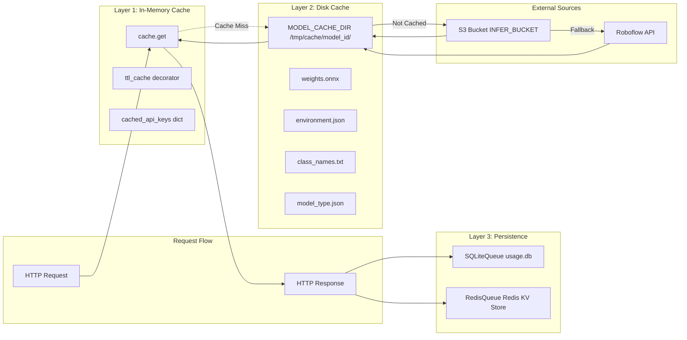
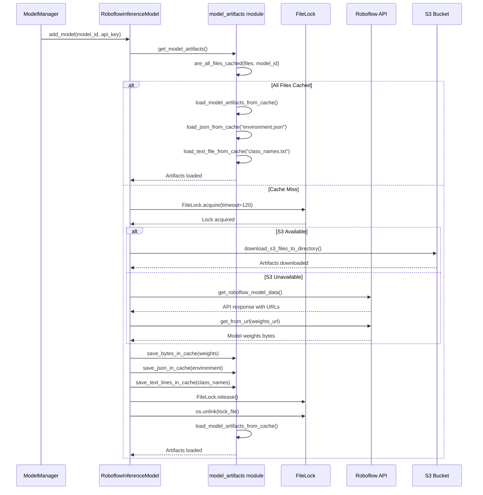
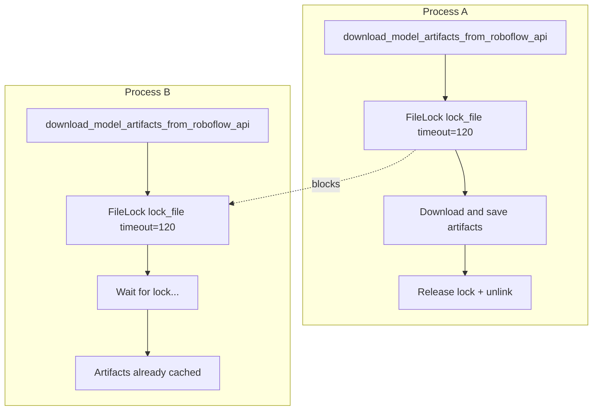
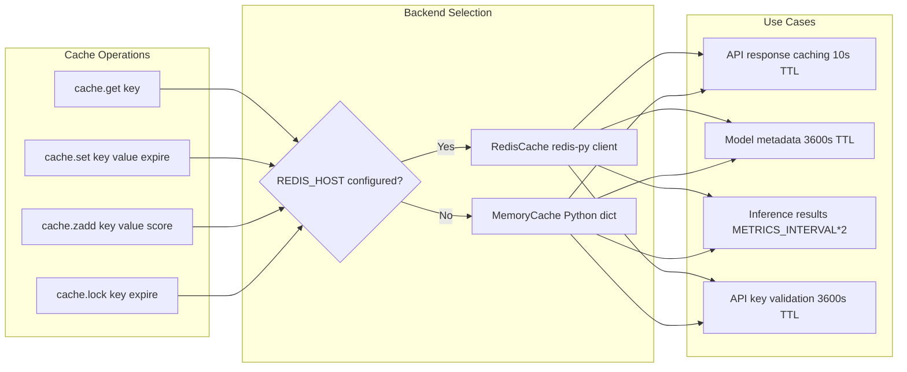
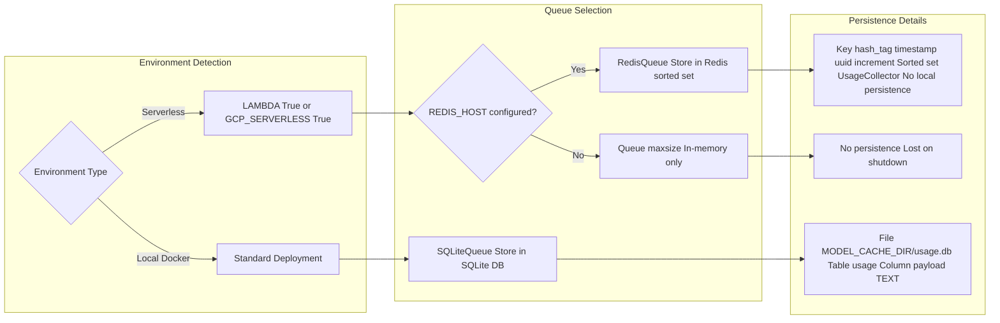
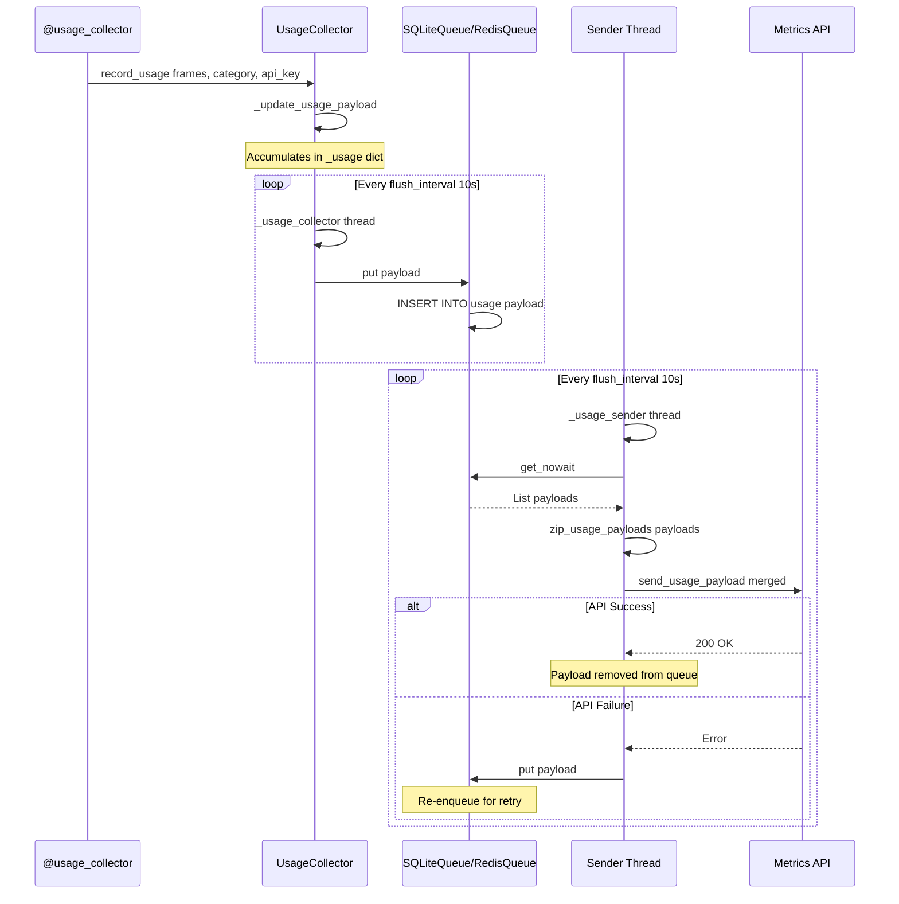
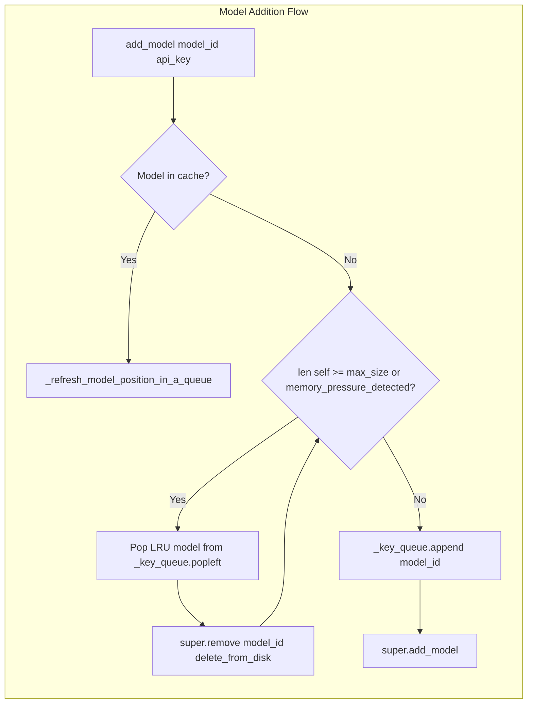

# Caching and Persistence

Relevant source files

- [inference/core/__init__.py](https://github.com/roboflow/inference/blob/55f57676/inference/core/__init__.py)
- [inference/core/cache/model_artifacts.py](https://github.com/roboflow/inference/blob/55f57676/inference/core/cache/model_artifacts.py)
- [inference/core/env.py](https://github.com/roboflow/inference/blob/55f57676/inference/core/env.py)
- [inference/core/interfaces/http/http_api.py](https://github.com/roboflow/inference/blob/55f57676/inference/core/interfaces/http/http_api.py)
- [inference/core/managers/base.py](https://github.com/roboflow/inference/blob/55f57676/inference/core/managers/base.py)
- [inference/core/managers/decorators/base.py](https://github.com/roboflow/inference/blob/55f57676/inference/core/managers/decorators/base.py)
- [inference/core/managers/decorators/fixed_size_cache.py](https://github.com/roboflow/inference/blob/55f57676/inference/core/managers/decorators/fixed_size_cache.py)
- [inference/core/managers/decorators/logger.py](https://github.com/roboflow/inference/blob/55f57676/inference/core/managers/decorators/logger.py)
- [inference/core/models/base.py](https://github.com/roboflow/inference/blob/55f57676/inference/core/models/base.py)
- [inference/core/models/roboflow.py](https://github.com/roboflow/inference/blob/55f57676/inference/core/models/roboflow.py)
- [inference/core/models/stubs.py](https://github.com/roboflow/inference/blob/55f57676/inference/core/models/stubs.py)
- [inference/core/registries/roboflow.py](https://github.com/roboflow/inference/blob/55f57676/inference/core/registries/roboflow.py)
- [inference/core/roboflow_api.py](https://github.com/roboflow/inference/blob/55f57676/inference/core/roboflow_api.py)
- [inference/core/utils/roboflow.py](https://github.com/roboflow/inference/blob/55f57676/inference/core/utils/roboflow.py)
- [inference/core/utils/sqlite_wrapper.py](https://github.com/roboflow/inference/blob/55f57676/inference/core/utils/sqlite_wrapper.py)
- [inference/core/utils/visualisation.py](https://github.com/roboflow/inference/blob/55f57676/inference/core/utils/visualisation.py)
- [inference/core/version.py](https://github.com/roboflow/inference/blob/55f57676/inference/core/version.py)
- [inference/models/__init__.py](https://github.com/roboflow/inference/blob/55f57676/inference/models/__init__.py)
- [inference/models/utils.py](https://github.com/roboflow/inference/blob/55f57676/inference/models/utils.py)
- [inference/usage_tracking/collector.py](https://github.com/roboflow/inference/blob/55f57676/inference/usage_tracking/collector.py)
- [inference/usage_tracking/config.py](https://github.com/roboflow/inference/blob/55f57676/inference/usage_tracking/config.py)
- [inference/usage_tracking/payload_helpers.py](https://github.com/roboflow/inference/blob/55f57676/inference/usage_tracking/payload_helpers.py)
- [inference/usage_tracking/plan_details.py](https://github.com/roboflow/inference/blob/55f57676/inference/usage_tracking/plan_details.py)
- [inference/usage_tracking/redis_queue.py](https://github.com/roboflow/inference/blob/55f57676/inference/usage_tracking/redis_queue.py)
- [inference/usage_tracking/sqlite_queue.py](https://github.com/roboflow/inference/blob/55f57676/inference/usage_tracking/sqlite_queue.py)
- [inference/usage_tracking/utils.py](https://github.com/roboflow/inference/blob/55f57676/inference/usage_tracking/utils.py)
- [tests/inference/unit_tests/core/cache/__init__.py](https://github.com/roboflow/inference/blob/55f57676/tests/inference/unit_tests/core/cache/__init__.py)
- [tests/inference/unit_tests/core/cache/test_model_artifacts.py](https://github.com/roboflow/inference/blob/55f57676/tests/inference/unit_tests/core/cache/test_model_artifacts.py)
- [tests/inference/unit_tests/core/models/test_roboflow.py](https://github.com/roboflow/inference/blob/55f57676/tests/inference/unit_tests/core/models/test_roboflow.py)
- [tests/inference/unit_tests/core/utils/test_sqlite_wrapper.py](https://github.com/roboflow/inference/blob/55f57676/tests/inference/unit_tests/core/utils/test_sqlite_wrapper.py)
- [tests/inference/unit_tests/usage_tracking/test_collect_func_params.py](https://github.com/roboflow/inference/blob/55f57676/tests/inference/unit_tests/usage_tracking/test_collect_func_params.py)
- [tests/inference/unit_tests/usage_tracking/test_collector.py](https://github.com/roboflow/inference/blob/55f57676/tests/inference/unit_tests/usage_tracking/test_collector.py)
- [tests/inference/unit_tests/usage_tracking/test_persistent_queue.py](https://github.com/roboflow/inference/blob/55f57676/tests/inference/unit_tests/usage_tracking/test_persistent_queue.py)
- [tests/inference/unit_tests/usage_tracking/test_plan_details.py](https://github.com/roboflow/inference/blob/55f57676/tests/inference/unit_tests/usage_tracking/test_plan_details.py)

This document describes the multi-layer caching and persistence architecture used throughout the inference server to optimize performance, reduce API calls, and ensure reliable telemetry collection. The system employs three primary caching mechanisms: **model artifact disk caching**, **in-memory/Redis response caching**, and **usage tracking persistence**.

For information about the Model Manager's role in managing loaded models, see [Model Manager and Registry](https://deepwiki.com/roboflow/inference/2.2-model-manager-and-registry). For details on usage tracking and telemetry, see [Usage Tracking and Telemetry](https://deepwiki.com/roboflow/inference/8.1-usage-tracking-and-telemetry).

---

## Overview of Caching Layers

The inference server implements a three-tier caching strategy to minimize latency and network overhead:


**Sources:** [inference/core/cache/model_artifacts.py1-342](https://github.com/roboflow/inference/blob/55f57676/inference/core/cache/model_artifacts.py#L1-L342) [inference/core/roboflow_api.py193-248](https://github.com/roboflow/inference/blob/55f57676/inference/core/roboflow_api.py#L193-L248) [inference/core/managers/base.py1-450](https://github.com/roboflow/inference/blob/55f57676/inference/core/managers/base.py#L1-L450)

---

## Model Artifact Disk Caching

### Cache Directory Structure

Model artifacts are stored in a hierarchical directory structure under `MODEL_CACHE_DIR` (default: `/tmp/cache`):

```
/tmp/cache/
├── {dataset_id}/
│   ├── {version_id}/
│   │   ├── weights.onnx           # Model weights
│   │   ├── environment.json       # Preprocessing config
│   │   ├── class_names.txt        # Class labels
│   │   ├── model_type.json        # Task type metadata
│   │   └── keypoints_metadata.json # Optional keypoints config
│   └── _file_locks/
│       └── {version_id}.lock      # FileLock for concurrent access
└── usage.db                       # SQLite usage tracking
```

**Sources:** [inference/core/cache/model_artifacts.py139-141](https://github.com/roboflow/inference/blob/55f57676/inference/core/cache/model_artifacts.py#L139-L141) [inference/core/env.py337-338](https://github.com/roboflow/inference/blob/55f57676/inference/core/env.py#L337-L338)

### Artifact Caching Flow



**Sources:** [inference/core/models/roboflow.py231-416](https://github.com/roboflow/inference/blob/55f57676/inference/core/models/roboflow.py#L231-L416) [inference/core/cache/model_artifacts.py26-136](https://github.com/roboflow/inference/blob/55f57676/inference/core/cache/model_artifacts.py#L26-L136)

### Atomic Write Operations

To prevent corruption from concurrent writes, the system supports atomic cache writes when `ATOMIC_CACHE_WRITES_ENABLED=True`:

|Write Type|Standard Function|Atomic Function|Implementation|
|---|---|---|---|
|Binary|`dump_bytes()`|`dump_bytes_atomic()`|Write to temp file, then `os.replace()`|
|JSON|`dump_json()`|`dump_json_atomic()`|Write to temp file, then `os.replace()`|
|Text Lines|`dump_text_lines()`|`dump_text_lines_atomic()`|Write to temp file, then `os.replace()`|

**Sources:** [inference/core/cache/model_artifacts.py81-136](https://github.com/roboflow/inference/blob/55f57676/inference/core/cache/model_artifacts.py#L81-L136) [inference/core/env.py58](https://github.com/roboflow/inference/blob/55f57676/inference/core/env.py#L58-L58)

### File Locking Strategy

Concurrent access to model artifacts during download is managed using `filelock.FileLock`:



Lock files are stored in `MODEL_CACHE_DIR/_file_locks/` with filenames based on cache directory basename. The timeout is 120 seconds.

**Sources:** [inference/core/models/roboflow.py314-415](https://github.com/roboflow/inference/blob/55f57676/inference/core/models/roboflow.py#L314-L415) [inference/core/cache/model_artifacts.py173-226](https://github.com/roboflow/inference/blob/55f57676/inference/core/cache/model_artifacts.py#L173-L226)

### Cache Cleanup

The `clear_cache()` function removes cached artifacts for a specific model or the entire cache directory:

- **Parameters:** `model_id` (optional), `delete_from_disk` (default: `True`)
- **Locking:** Uses same FileLock pattern to prevent deletion during downloads
- **Error Handling:** Custom `_rmtree_onerror` handler manages concurrent deletion conflicts
- **Triggered by:** LRU eviction in `WithFixedSizeCache` when `DISK_CACHE_CLEANUP=True`

**Sources:** [inference/core/cache/model_artifacts.py173-226](https://github.com/roboflow/inference/blob/55f57676/inference/core/cache/model_artifacts.py#L173-L226) [inference/core/env.py640](https://github.com/roboflow/inference/blob/55f57676/inference/core/env.py#L640-L640)

---

## In-Memory Caching

### Redis/Memory Cache Architecture

The `cache` singleton provides a unified interface to either Redis (if `REDIS_HOST` is configured) or an in-memory fallback:



**Sources:** [inference/core/cache/base.py1-50](https://github.com/roboflow/inference/blob/55f57676/inference/core/cache/base.py#L1-L50) [inference/core/cache/redis.py1-100](https://github.com/roboflow/inference/blob/55f57676/inference/core/cache/redis.py#L1-L100) [inference/core/env.py376-383](https://github.com/roboflow/inference/blob/55f57676/inference/core/env.py#L376-L383)

### TTL-Based Caching with Decorators

The system uses `@ttl_cache` decorators from `cachetools` for function memoization:

|Function|TTL|Max Size|Purpose|
|---|---|---|---|
|`get_roboflow_workspace()`|`MODELS_CACHE_AUTH_CACHE_TTL` (900s)|`MODELS_CACHE_AUTH_CACHE_MAX_SIZE` (100M)|Workspace ID lookup|
|`_check_if_api_key_has_access_to_model()`|900s|100M|API key authorization|
|Model metadata retrieval|Varies|N/A|Model type resolution|

**Sources:** [inference/core/roboflow_api.py193-208](https://github.com/roboflow/inference/blob/55f57676/inference/core/roboflow_api.py#L193-L208) [inference/core/registries/roboflow.py106-136](https://github.com/roboflow/inference/blob/55f57676/inference/core/registries/roboflow.py#L106-L136) [inference/core/env.py315-324](https://github.com/roboflow/inference/blob/55f57676/inference/core/env.py#L315-L324)

### API Key Validation Caching

API key validation is cached in-memory to reduce authentication overhead:

```
# In HttpInterface.__init__
cached_api_keys = dict()  # api_key -> expiration_timestamp

# In check_authorization middleware
if cached_api_keys.get(api_key, 0) < time.time():
    workspace_url = await get_roboflow_workspace_async(api_key=api_key)
    cached_api_keys[api_key] = time.time() + 3600  # 1 hour TTL
```

Cache expiration is 3600 seconds (1 hour). Keys are stored as `{api_key: timestamp}`.

**Sources:** [inference/core/interfaces/http/http_api.py429-578](https://github.com/roboflow/inference/blob/55f57676/inference/core/interfaces/http/http_api.py#L429-L578)

### Model Metadata Caching

Model type metadata is cached at two levels:

1. **Disk cache:** `{MODEL_CACHE_DIR}/{dataset_id}/{version_id}/model_type.json`
    
    - Contains `PROJECT_TASK_TYPE_KEY` and `MODEL_TYPE_KEY`
    - Persistent across server restarts
    - Protected by FileLock during writes
2. **Memory cache:** `cache.get(f"metadata:{endpoint}")`
    
    - TTL: `MODEL_METADATA_CACHE_EXPIRATION_TIMEOUT` (3600s)
    - Skipped when `LAMBDA=True` to avoid distributed cache issues

**Sources:** [inference/core/registries/roboflow.py240-342](https://github.com/roboflow/inference/blob/55f57676/inference/core/registries/roboflow.py#L240-L342) [inference/core/models/roboflow.py84](https://github.com/roboflow/inference/blob/55f57676/inference/core/models/roboflow.py#L84-L84)

### Inference Result Caching

When `DISABLE_INFERENCE_CACHE=False`, inference results are stored in Redis sorted sets:

```
cache.zadd(
    f"inference:{GLOBAL_INFERENCE_SERVER_ID}:{model_id}",
    value=to_cachable_inference_item(request, response),
    score=finish_time,
    expire=METRICS_INTERVAL * 2
)
```

- **Key pattern:** `inference:{server_id}:{model_id}`
- **Score:** Unix timestamp (for time-based queries)
- **Expiration:** `METRICS_INTERVAL * 2` (default: 120s)
- **Serialization:** JSON via `to_cachable_inference_item()`

**Sources:** [inference/core/managers/base.py181-210](https://github.com/roboflow/inference/blob/55f57676/inference/core/managers/base.py#L181-L210) [inference/core/env.py208](https://github.com/roboflow/inference/blob/55f57676/inference/core/env.py#L208-L208)

---

## Usage Tracking Persistence

### Dual Queue Architecture

Usage telemetry is persisted through one of two queue implementations based on environment:



**Sources:** [inference/usage_tracking/collector.py114-142](https://github.com/roboflow/inference/blob/55f57676/inference/usage_tracking/collector.py#L114-L142) [inference/usage_tracking/sqlite_queue.py1-70](https://github.com/roboflow/inference/blob/55f57676/inference/usage_tracking/sqlite_queue.py#L1-L70) [inference/usage_tracking/redis_queue.py1-70](https://github.com/roboflow/inference/blob/55f57676/inference/usage_tracking/redis_queue.py#L1-L70)

### SQLiteQueue Implementation

The `SQLiteQueue` class persists usage payloads to a local SQLite database:

|Component|Value|Purpose|
|---|---|---|
|Database Path|`MODEL_CACHE_DIR/usage.db`|`/tmp/cache/usage.db` by default|
|Table Name|`usage`|Stores serialized payloads|
|Columns|`id INTEGER PRIMARY KEY`, `payload TEXT NOT NULL`|Auto-incrementing ID + JSON payload|
|Operations|`put()`, `get_nowait()`, `empty()`, `full()`|Queue interface|

The implementation uses `BEGIN EXCLUSIVE` transactions to ensure atomic writes:

**Sources:** [inference/usage_tracking/sqlite_queue.py1-70](https://github.com/roboflow/inference/blob/55f57676/inference/usage_tracking/sqlite_queue.py#L1-L70) [inference/core/utils/sqlite_wrapper.py1-150](https://github.com/roboflow/inference/blob/55f57676/inference/core/utils/sqlite_wrapper.py#L1-L150)

### RedisQueue Implementation

For serverless deployments with Redis, `RedisQueue` uses a hash-tagged key pattern:

```
# Key pattern
self._prefix = f"{{{hash_tag}}}:{time.time()}:{uuid4().hex[:5]}"
redis_key = f"{self._prefix}:{self._increment}"

# Atomic pipeline
redis_pipeline.set(name=redis_key, value=json.dumps(payload))
redis_pipeline.zadd(name="UsageCollector", mapping={redis_key: time.time()})
redis_pipeline.execute()
```

- **Hash tag:** `{UsageCollector}` ensures keys route to same Redis node (prevents CROSSLOT errors)
- **Sorted set:** `UsageCollector` acts as index for external consumers
- **No local persistence:** Queue appears always empty/never full from server perspective

**Sources:** [inference/usage_tracking/redis_queue.py1-70](https://github.com/roboflow/inference/blob/55f57676/inference/usage_tracking/redis_queue.py#L1-L70)

### Usage Payload Lifecycle



**Sources:** [inference/usage_tracking/collector.py485-564](https://github.com/roboflow/inference/blob/55f57676/inference/usage_tracking/collector.py#L485-L564) [inference/usage_tracking/payload_helpers.py58-150](https://github.com/roboflow/inference/blob/55f57676/inference/usage_tracking/payload_helpers.py#L58-L150)

---

## Cache Eviction Strategies

### LRU Eviction in WithFixedSizeCache

The `WithFixedSizeCache` decorator implements Least Recently Used (LRU) eviction:




**Key Implementation Details:**

- **Data structure:** `collections.deque` for O(1) append/popleft
- **Capacity:** Configurable via `max_size` parameter (default: 8)
- **Refresh on access:** Any `infer*()` or `preprocess()` call moves model to end of queue
- **Batch eviction:** Removes 3 models at once to prevent thrashing around threshold
- **Disk cleanup:** Controlled by `DISK_CACHE_CLEANUP` environment variable

**Sources:** [inference/core/managers/decorators/fixed_size_cache.py28-230](https://github.com/roboflow/inference/blob/55f57676/inference/core/managers/decorators/fixed_size_cache.py#L28-L230) [inference/core/env.py640](https://github.com/roboflow/inference/blob/55f57676/inference/core/env.py#L640-L640)

### Memory Pressure Detection

When `MEMORY_FREE_THRESHOLD > 0`, the system monitors available memory:

```
def memory_pressure_detected(self) -> bool:
    try:
        import psutil
        memory = psutil.virtual_memory()
        available_percent = memory.available / memory.total
        return available_percent < MEMORY_FREE_THRESHOLD
    except ImportError:
        return False
```

- **Threshold:** Percentage of free memory (0.0 disables, 0.1 = 10% free minimum)
- **Action:** Triggers aggressive eviction (removes 3 models) before adding new one
- **Fallback:** No eviction if `psutil` not available

**Sources:** [inference/core/managers/decorators/fixed_size_cache.py210-230](https://github.com/roboflow/inference/blob/55f57676/inference/core/managers/decorators/fixed_size_cache.py#L210-L230) [inference/core/env.py641-643](https://github.com/roboflow/inference/blob/55f57676/inference/core/env.py#L641-L643)

### TTL Expiration

In-memory and Redis caches use time-based expiration:

|Cache Type|TTL Configuration|Cleanup Strategy|
|---|---|---|
|Roboflow API responses|10 seconds|Redis auto-expiry or memory cache sweep|
|Model metadata|3600 seconds|Redis auto-expiry|
|API key validation|3600 seconds|Manual timestamp check in dict|
|Inference results|`METRICS_INTERVAL * 2`|Redis sorted set expiry|

**Sources:** [inference/core/roboflow_api.py374-383](https://github.com/roboflow/inference/blob/55f57676/inference/core/roboflow_api.py#L374-L383) [inference/core/models/roboflow.py222-225](https://github.com/roboflow/inference/blob/55f57676/inference/core/models/roboflow.py#L222-L225)

---

## Configuration Options

### Environment Variables

|Variable|Default|Purpose|Impact|
|---|---|---|---|
|`MODEL_CACHE_DIR`|`/tmp/cache`|Root directory for cached artifacts|All disk caching|
|`DISABLE_INFERENCE_CACHE`|`False`|Disable inference result caching|Saves memory, increases latency|
|`ATOMIC_CACHE_WRITES_ENABLED`|`False`|Use atomic file writes|Prevents corruption, slight overhead|
|`DISK_CACHE_CLEANUP`|`True`|Delete evicted model weights|Saves disk space|
|`MEMORY_FREE_THRESHOLD`|`0.0`|Minimum free memory percentage|Triggers aggressive eviction|
|`REDIS_HOST`|`None`|Redis server hostname|Enables distributed caching|
|`REDIS_PORT`|`6379`|Redis server port|Connection config|
|`REDIS_SSL`|`False`|Use SSL for Redis|Secure connections|
|`REDIS_TIMEOUT`|`2.0`|Redis operation timeout (seconds)|Prevents hangs|
|`CACHE_METADATA_LOCK_TIMEOUT`|`1.0`|Metadata lock timeout (seconds)|Concurrent access control|
|`MODEL_LOCK_ACQUIRE_TIMEOUT`|`60.0`|Model addition lock timeout (seconds)|Prevents deadlocks|
|`MODELS_CACHE_AUTH_CACHE_TTL`|`900`|API key auth cache TTL (seconds)|Reduces API calls|
|`MODELS_CACHE_AUTH_CACHE_MAX_SIZE`|`100000000`|Max cached auth entries|Memory management|
|`MD5_VERIFICATION_ENABLED`|`False`|Verify downloaded file checksums|Integrity checking|

**Sources:** [inference/core/env.py1-669](https://github.com/roboflow/inference/blob/55f57676/inference/core/env.py#L1-L669)

### Cache Size Tuning

The `WithFixedSizeCache` decorator's `max_size` parameter controls the maximum number of simultaneously loaded models:

```
from inference.core.managers.decorators.fixed_size_cache import WithFixedSizeCache

model_manager = WithFixedSizeCache(
    model_manager=base_manager,
    max_size=16  # Allow 16 models in memory
)
```

Recommended values:

- **Low memory (< 8GB):** `max_size=4`
- **Medium memory (8-16GB):** `max_size=8` (default)
- **High memory (> 16GB):** `max_size=16` or higher

**Sources:** [inference/core/managers/decorators/fixed_size_cache.py29-35](https://github.com/roboflow/inference/blob/55f57676/inference/core/managers/decorators/fixed_size_cache.py#L29-L35)

### Usage Queue Configuration

Telemetry persistence queue behavior is configured via `TelemetrySettings`:

|Setting|Default|Range|Purpose|
|---|---|---|---|
|`flush_interval`|10|10-300|Seconds between queue flushes|
|`queue_size`|10|10-10000|Max payloads in memory before blocking|
|`opt_out`|`False`|Boolean|Completely disable telemetry|

**Sources:** [inference/usage_tracking/config.py1-34](https://github.com/roboflow/inference/blob/55f57676/inference/usage_tracking/config.py#L1-L34)

---

## Cache Observability

### Cache Hit Metrics

The system logs cache operations at DEBUG level:

```
logger.debug(f"Loaded model data from cache with key: {api_data_cache_key}.")
logger.debug(f"Model artifacts already downloaded, loading from cache")
logger.debug("Persistence through SQLiteQueue")
```

Monitor logs for cache effectiveness indicators.

**Sources:** [inference/core/roboflow_api.py350-383](https://github.com/roboflow/inference/blob/55f57676/inference/core/roboflow_api.py#L350-L383) [inference/core/models/roboflow.py674](https://github.com/roboflow/inference/blob/55f57676/inference/core/models/roboflow.py#L674-L674)

### Lock Diagnostics

Lock acquisition failures throw `ModelManagerLockAcquisitionError`:

```
with acquire_with_timeout(lock=model_lock, timeout=MODEL_LOCK_ACQUIRE_TIMEOUT) as acquired:
    if not acquired:
        raise ModelManagerLockAcquisitionError(
            f"Could not acquire lock for model with id={model_id}."
        )
```

Timeouts indicate contention or deadlocks.

**Sources:** [inference/core/managers/base.py90-95](https://github.com/roboflow/inference/blob/55f57676/inference/core/managers/base.py#L90-L95) [inference/core/managers/decorators/fixed_size_cache.py82-86](https://github.com/roboflow/inference/blob/55f57676/inference/core/managers/decorators/fixed_size_cache.py#L82-L86)

### Queue Monitoring

For SQLiteQueue persistence, inspect the database directly:

```
SELECT COUNT(*) FROM usage;
SELECT payload FROM usage ORDER BY id DESC LIMIT 10;
```

For RedisQueue, check the sorted set:

```
ZCARD UsageCollector
ZRANGE UsageCollector 0 -1 WITHSCORES
```

**Sources:** [inference/usage_tracking/sqlite_queue.py42-70](https://github.com/roboflow/inference/blob/55f57676/inference/usage_tracking/sqlite_queue.py#L42-L70) [inference/usage_tracking/redis_queue.py30-70](https://github.com/roboflow/inference/blob/55f57676/inference/usage_tracking/redis_queue.py#L30-L70)