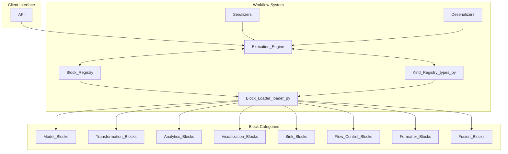
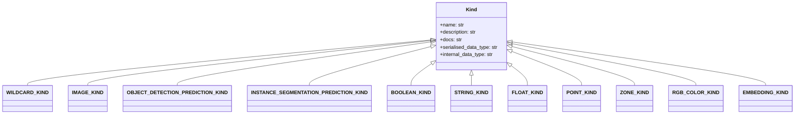
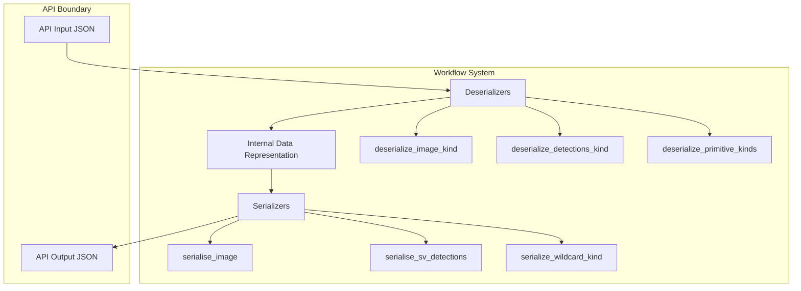
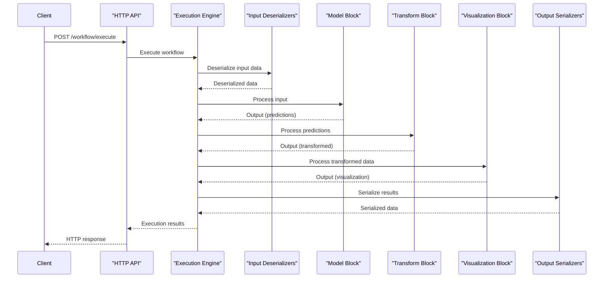

# Workflow System

Relevant source files

- [development/docs/build_block_docs.py](https://github.com/roboflow/inference/blob/55f57676/development/docs/build_block_docs.py)
- [development/docs/workflows_gallery_builder.py](https://github.com/roboflow/inference/blob/55f57676/development/docs/workflows_gallery_builder.py)
- [docs/fine-tuned/yolov11.md](https://github.com/roboflow/inference/blob/55f57676/docs/fine-tuned/yolov11.md)
- [docs/javascript/workflows.js](https://github.com/roboflow/inference/blob/55f57676/docs/javascript/workflows.js)
- [docs/styles/workflows.css](https://github.com/roboflow/inference/blob/55f57676/docs/styles/workflows.css)
- [docs/workflows/blocks_gallery_template.md](https://github.com/roboflow/inference/blob/55f57676/docs/workflows/blocks_gallery_template.md)
- [docs/workflows/gallery_index_template.md](https://github.com/roboflow/inference/blob/55f57676/docs/workflows/gallery_index_template.md)
- [docs/workflows/kinds_template.md](https://github.com/roboflow/inference/blob/55f57676/docs/workflows/kinds_template.md)
- [inference/core/workflows/core_steps/loader.py](https://github.com/roboflow/inference/blob/55f57676/inference/core/workflows/core_steps/loader.py)
- [inference/core/workflows/core_steps/models/foundation/openai/v3.py](https://github.com/roboflow/inference/blob/55f57676/inference/core/workflows/core_steps/models/foundation/openai/v3.py)
- [inference/core/workflows/execution_engine/entities/types.py](https://github.com/roboflow/inference/blob/55f57676/inference/core/workflows/execution_engine/entities/types.py)

The Workflow System is a core component of Roboflow Inference that provides a flexible, composable architecture for creating custom inference pipelines. It allows users to connect different processing blocks into workflows, with each block performing specific operations like running models, transforming data, analyzing results, or visualizing outputs.

This page focuses on the architecture and implementation of the Workflow System. For information about video stream processing, see [Stream Processing](https://deepwiki.com/roboflow/inference/3-workflow-system#2.4).

## Architecture Overview

The Workflow System is designed around a block-based architecture where data flows between different processing components, with type safety enforced via a "Kind" system.




si querés, después lo paso también a `sequenceDiagram` con los mensajes principales, pero para la vista de arquitectura este flowchart queda prolijo y cumple tus restricciones.
Sources: [inference/core/workflows/core_steps/loader.py1-693](https://github.com/roboflow/inference/blob/55f57676/inference/core/workflows/core_steps/loader.py#L1-L693)

## Core Components

### Block System

At the heart of the Workflow System is the `WorkflowBlock` class, which serves as the base for all workflow processing blocks. Each block has defined input and output ports with specific "Kinds" (types) to ensure type safety between connections.

```mermaid
classDiagram
class WorkflowBlock {
  +process(inputs)
  +validate_inputs(inputs)
  +validate_outputs(outputs)
}

%% Top-level categories
WorkflowBlock <|-- ModelBlock
WorkflowBlock <|-- TransformationBlock
WorkflowBlock <|-- AnalyticsBlock
WorkflowBlock <|-- VisualizationBlock
WorkflowBlock <|-- SinkBlock
WorkflowBlock <|-- FlowControlBlock
WorkflowBlock <|-- FormatterBlock
WorkflowBlock <|-- FusionBlock

%% ModelBlock implementations
ModelBlock <|-- RoboflowObjectDetectionModelBlock
ModelBlock <|-- ClipModelBlock
ModelBlock <|-- SegmentAnything2Block

%% TransformationBlock implementations
TransformationBlock <|-- DynamicCropBlock
TransformationBlock <|-- ByteTrackerBlock
TransformationBlock <|-- DetectionsFilterBlock

%% AnalyticsBlock implementations
AnalyticsBlock <|-- LineCounterBlock
AnalyticsBlock <|-- TimeInZoneBlock

%% VisualizationBlock implementations
VisualizationBlock <|-- BoundingBoxVisualizationBlock
VisualizationBlock <|-- MaskVisualizationBlock

%% SinkBlock implementations
SinkBlock <|-- WebhookSinkBlock
SinkBlock <|-- RoboflowDatasetUploadBlock

%% FlowControlBlock implementations
FlowControlBlock <|-- ContinueIfBlock
FlowControlBlock <|-- RateLimiterBlock

%% FormatterBlock implementations
FormatterBlock <|-- CSVFormatterBlock
FormatterBlock <|-- JSONParserBlock

%% FusionBlock implementations
FusionBlock <|-- BufferBlock
FusionBlock <|-- DetectionsStitchBlock
```





Sources: [inference/core/workflows/core_steps/loader.py10-454](https://github.com/roboflow/inference/blob/55f57676/inference/core/workflows/core_steps/loader.py#L10-L454) [inference/core/workflows/prototypes/block.py457](https://github.com/roboflow/inference/blob/55f57676/inference/core/workflows/prototypes/block.py#L457-L457)

The Workflow System includes a large library of pre-built blocks, registered via the `load_blocks` function:

|Block Category|Examples|Purpose|
|---|---|---|
|**Model Blocks**|`RoboflowObjectDetectionModelBlockV1`, `ClipModelBlockV1`|Run inference using various AI models|
|**Transformation Blocks**|`DynamicCropBlockV1`, `ByteTrackerBlockV1`|Transform images or modify detection results|
|**Analytics Blocks**|`LineCounterBlockV1`, `TimeInZoneBlockV1`|Analyze detection results for insights|
|**Visualization Blocks**|`BoundingBoxVisualizationBlockV1`, `MaskVisualizationBlockV1`|Add visual elements to images|
|**Sink Blocks**|`WebhookSinkBlockV1`, `EmailNotificationBlockV1`|Output results to external systems|
|**Flow Control Blocks**|`ContinueIfBlockV1`, `RateLimiterBlockV1`|Control workflow execution flow|
|**Formatter Blocks**|`CSVFormatterBlockV1`, `ExpressionBlockV1`|Format data for output|
|**Fusion Blocks**|`BufferBlockV1`, `DetectionsStitchBlockV1`|Combine data from multiple sources|

Sources: [inference/core/workflows/core_steps/loader.py515-650](https://github.com/roboflow/inference/blob/55f57676/inference/core/workflows/core_steps/loader.py#L515-L650)

### Kind System

The Kind system defines the data types that can flow between workflow blocks, with serialization and deserialization rules for each type.



Sources: [inference/core/workflows/execution_engine/entities/types.py7-31](https://github.com/roboflow/inference/blob/55f57676/inference/core/workflows/execution_engine/entities/types.py#L7-L31)

The system includes many predefined Kinds registered through the `load_kinds` function. Some key Kinds include:

|Kind|Purpose|Internal Representation|
|---|---|---|
|`IMAGE_KIND`|Represents an image|`WorkflowImageData`|
|`OBJECT_DETECTION_PREDICTION_KIND`|Object detection results|`sv.Detections`|
|`INSTANCE_SEGMENTATION_PREDICTION_KIND`|Instance segmentation results|`sv.Detections`|
|`KEYPOINT_DETECTION_PREDICTION_KIND`|Keypoint detection results|`sv.Detections`|
|`BOOLEAN_KIND`|Boolean values|`bool`|
|`INTEGER_KIND`|Integer values|`int`|
|`FLOAT_KIND`|Floating-point values|`float`|
|`STRING_KIND`|String values|`str`|
|`POINT_KIND`|2D coordinates|`Tuple[int, int]`|
|`ZONE_KIND`|Polygon zone definition|`List[Tuple[int, int]]`|

Sources: [inference/core/workflows/execution_engine/entities/types.py33-691](https://github.com/roboflow/inference/blob/55f57676/inference/core/workflows/execution_engine/entities/types.py#L33-L691) [inference/core/workflows/core_steps/loader.py653-692](https://github.com/roboflow/inference/blob/55f57676/inference/core/workflows/core_steps/loader.py#L653-L692)

### Serialization and Deserialization

The system includes mechanisms to convert between internal data representations and API-compatible formats:



Sources: [inference/core/workflows/core_steps/common/serializers.py1-206](https://github.com/roboflow/inference/blob/55f57676/inference/core/workflows/core_steps/common/serializers.py#L1-L206) [inference/core/workflows/core_steps/common/deserializers.py1-466](https://github.com/roboflow/inference/blob/55f57676/inference/core/workflows/core_steps/common/deserializers.py#L1-L466)

Key functions include:

- `serialise_sv_detections`: Converts `sv.Detections` objects to JSON format
- `serialise_image`: Converts internal image representation to base64-encoded format
- `deserialize_image_kind`: Converts various image formats to internal representation
- `deserialize_detections_kind`: Converts detection JSON to `sv.Detections` objects

The serializers and deserializers are registered in the `KINDS_SERIALIZERS` and `KINDS_DESERIALIZERS` dictionaries:

```
KINDS_SERIALIZERS = {
    IMAGE_KIND.name: serialise_image,
    VIDEO_METADATA_KIND.name: serialize_video_metadata_kind,
    OBJECT_DETECTION_PREDICTION_KIND.name: serialise_sv_detections,
    INSTANCE_SEGMENTATION_PREDICTION_KIND.name: serialise_sv_detections,
    # ...
}

KINDS_DESERIALIZERS = {
    IMAGE_KIND.name: deserialize_image_kind,
    VIDEO_METADATA_KIND.name: deserialize_video_metadata_kind,
    OBJECT_DETECTION_PREDICTION_KIND.name: deserialize_detections_kind,
    INSTANCE_SEGMENTATION_PREDICTION_KIND.name: deserialize_detections_kind,
    # ...
}
```

Sources: [inference/core/workflows/core_steps/loader.py470-512](https://github.com/roboflow/inference/blob/55f57676/inference/core/workflows/core_steps/loader.py#L470-L512)

## Workflow Execution

When a workflow is executed, data flows through blocks in the defined order with type checking at each step:




The execution engine validates that the output kind of each block matches the expected input kind of the next block, ensuring type safety throughout the workflow.

## Environment Configuration

The Workflow System can be configured using environment variables:

```
ALLOW_WORKFLOW_BLOCKS_ACCESSING_ENVIRONMENTAL_VARIABLES
ALLOW_WORKFLOW_BLOCKS_ACCESSING_LOCAL_STORAGE
WORKFLOW_BLOCKS_WRITE_DIRECTORY
WORKFLOWS_STEP_EXECUTION_MODE
```

These variables control security aspects like file system access and execution behavior.

Sources: [inference/core/workflows/core_steps/loader.py4-9](https://github.com/roboflow/inference/blob/55f57676/inference/core/workflows/core_steps/loader.py#L4-L9)

## Block Categories in Detail

### Model Blocks

Model blocks run inference using various AI models. The system supports a wide range of models:

1. **Roboflow Models**:
    
    - Object detection (e.g., `RoboflowObjectDetectionModelBlockV1/V2`)
    - Instance segmentation (e.g., `RoboflowInstanceSegmentationModelBlockV1/V2`)
    - Keypoint detection (e.g., `RoboflowKeypointDetectionModelBlockV1/V2`)
    - Classification (e.g., `RoboflowClassificationModelBlockV1/V2`)
2. **Foundation Models**:
    
    - CLIP (e.g., `ClipModelBlockV1`)
    - Segment Anything (e.g., `SegmentAnything2BlockV1`)
    - Vision-Language Models (e.g., `SmolVLM2BlockV1`, `Moondream2BlockV1`)
    - Text generation models (e.g., `OpenAIBlockV1/V2`, `AnthropicClaudeBlockV1`)

Sources: [inference/core/workflows/core_steps/loader.py155-220](https://github.com/roboflow/inference/blob/55f57676/inference/core/workflows/core_steps/loader.py#L155-L220) [inference/core/workflows/core_steps/loader.py221-250](https://github.com/roboflow/inference/blob/55f57676/inference/core/workflows/core_steps/loader.py#L221-L250)

### Transformation Blocks

Transformation blocks modify images or detection results:

1. **Image Transformations**:
    
    - Cropping (e.g., `DynamicCropBlockV1`, `AbsoluteStaticCropBlockV1`)
    - Slicing (e.g., `ImageSlicerBlockV1/V2`)
    - Perspective correction (e.g., `PerspectiveCorrectionBlockV1`)
2. **Detection Transformations**:
    
    - Tracking (e.g., `ByteTrackerBlockV1/V2/V3`)
    - Filtering (e.g., `DetectionsFilterBlockV1`)
    - Merging (e.g., `DetectionsMergeBlockV1`)

Sources: [inference/core/workflows/core_steps/loader.py289-345](https://github.com/roboflow/inference/blob/55f57676/inference/core/workflows/core_steps/loader.py#L289-L345)

### Analytics and Visualization

Analytics blocks analyze detection results, while visualization blocks add visual elements:

1. **Analytics**:
    
    - Counting (e.g., `LineCounterBlockV1/V2`)
    - Zone analytics (e.g., `TimeInZoneBlockV1/V2`)
    - Path analysis (e.g., `PathDeviationAnalyticsBlockV1/V2`)
2. **Visualization**:
    
    - Bounding boxes (e.g., `BoundingBoxVisualizationBlockV1`)
    - Masks (e.g., `MaskVisualizationBlockV1`)
    - Labels (e.g., `LabelVisualizationBlockV1`)
    - Shapes (e.g., `CircleVisualizationBlockV1`, `PolygonVisualizationBlockV1`)

Sources: [inference/core/workflows/core_steps/loader.py11-33](https://github.com/roboflow/inference/blob/55f57676/inference/core/workflows/core_steps/loader.py#L11-L33) [inference/core/workflows/core_steps/loader.py348-416](https://github.com/roboflow/inference/blob/55f57676/inference/core/workflows/core_steps/loader.py#L348-L416)

## Extending the Workflow System

The Workflow System is designed to be extensible. Developers can create custom blocks by:

1. Subclassing `WorkflowBlock`
2. Defining input and output kinds
3. Implementing the `process` method
4. Registering the block with the system

This extensibility allows the Workflow System to be adapted to a wide range of computer vision tasks beyond those covered by the pre-built blocks.

## Integration with Roboflow Inference

The Workflow System integrates with other components of Roboflow Inference:

- **HTTP API**: Workflows are exposed through API endpoints
- **Model Management**: Workflow blocks use models loaded by the Model Manager
- **Stream Processing**: Workflows can be used as processing steps in video streams

This integration makes the Workflow System a central part of the Roboflow Inference ecosystem, providing flexible processing capabilities for diverse computer vision applications.

Sources: [inference/core/workflows/core_steps/loader.py1-693](https://github.com/roboflow/inference/blob/55f57676/inference/core/workflows/core_steps/loader.py#L1-L693)