# Workflow Execution

Relevant source files

- [development/docs/build_block_docs.py](https://github.com/roboflow/inference/blob/55f57676/development/docs/build_block_docs.py)
- [development/docs/workflows_gallery_builder.py](https://github.com/roboflow/inference/blob/55f57676/development/docs/workflows_gallery_builder.py)
- [docs/fine-tuned/yolov11.md](https://github.com/roboflow/inference/blob/55f57676/docs/fine-tuned/yolov11.md)
- [docs/javascript/workflows.js](https://github.com/roboflow/inference/blob/55f57676/docs/javascript/workflows.js)
- [docs/styles/workflows.css](https://github.com/roboflow/inference/blob/55f57676/docs/styles/workflows.css)
- [docs/workflows/blocks_gallery_template.md](https://github.com/roboflow/inference/blob/55f57676/docs/workflows/blocks_gallery_template.md)
- [docs/workflows/gallery_index_template.md](https://github.com/roboflow/inference/blob/55f57676/docs/workflows/gallery_index_template.md)
- [docs/workflows/kinds_template.md](https://github.com/roboflow/inference/blob/55f57676/docs/workflows/kinds_template.md)
- [inference/core/workflows/core_steps/loader.py](https://github.com/roboflow/inference/blob/55f57676/inference/core/workflows/core_steps/loader.py)
- [inference/core/workflows/core_steps/models/foundation/openai/v3.py](https://github.com/roboflow/inference/blob/55f57676/inference/core/workflows/core_steps/models/foundation/openai/v3.py)
- [inference/core/workflows/execution_engine/entities/types.py](https://github.com/roboflow/inference/blob/55f57676/inference/core/workflows/execution_engine/entities/types.py)

This page documents the workflow execution system, covering compilation, validation, execution modes, and runtime data flow. For information about individual workflow blocks, see [Workflow Blocks](https://deepwiki.com/roboflow/inference/3.1-workflow-blocks). For details on the type system used during compilation, see [Kind Type System](https://deepwiki.com/roboflow/inference/3.2-kind-type-system).

## Overview

Workflow execution occurs in two distinct phases:

1. **Compilation Phase**: Validates workflow definitions, checks type compatibility between connected blocks, and generates an execution plan with topological ordering
2. **Execution Phase**: Processes inputs through the validated execution plan, managing data serialization/deserialization and coordinating block execution

The system supports three execution modes optimized for different use cases: single/batch image processing, real-time video stream processing, and batch API processing of large datasets.

Sources: High-level diagram 5 (Workflow System)

## Workflow Definition Structure

Workflows are defined as JSON documents containing two primary components: an array of blocks (processing steps) and an array of connections (data flow edges).

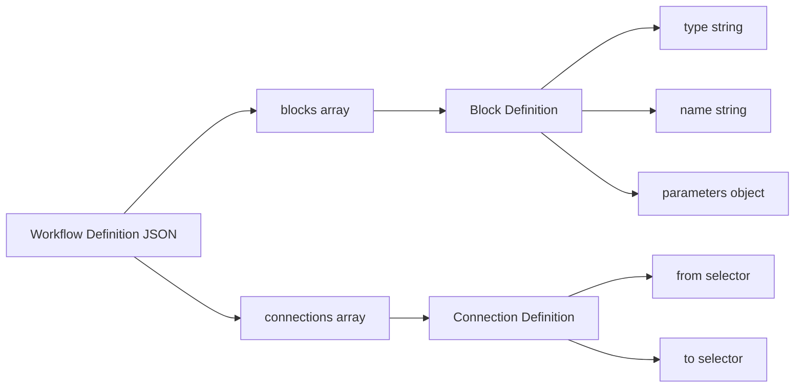

Each block definition specifies:

- `type`: Block type identifier (e.g., `"roboflow_core/open_ai@v3"`)
- `name`: Unique step identifier within the workflow
- Block-specific parameters (inputs, configuration)

Connections define data flow using selectors (e.g., `$steps.model.predictions` → `$steps.filter.detections`).

Sources: [inference/core/workflows/core_steps/models/foundation/openai/v3.py89-110](https://github.com/roboflow/inference/blob/55f57676/inference/core/workflows/core_steps/models/foundation/openai/v3.py#L89-L110) [development/docs/build_block_docs.py582-596](https://github.com/roboflow/inference/blob/55f57676/development/docs/build_block_docs.py#L582-L596)

## Block Registry and Loading

The workflow system maintains a registry of available blocks and kinds loaded at initialization.

### Block Loading

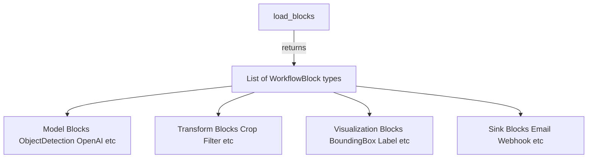

The `load_blocks()` function at [inference/core/workflows/core_steps/loader.py548-694](https://github.com/roboflow/inference/blob/55f57676/inference/core/workflows/core_steps/loader.py#L548-L694) returns a list of 100+ block classes organized into categories:

- Model blocks (Roboflow models, foundation models, third-party)
- Transform blocks (crop, filter, track, merge)
- Visualization blocks (bounding boxes, labels, masks)
- Sink blocks (notifications, data storage)
- Analytics blocks (line counting, zone monitoring)
- Classical CV blocks (SIFT, contours, template matching)

### Kind Loading and Serialization

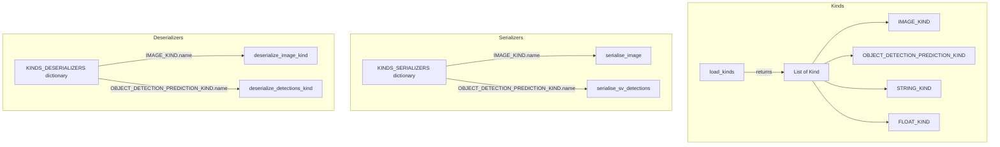

The `load_kinds()` function at [inference/core/workflows/core_steps/loader.py697-737](https://github.com/roboflow/inference/blob/55f57676/inference/core/workflows/core_steps/loader.py#L697-L737) returns 35+ kind definitions. Each kind has dual data representation:

- **External**: JSON-serializable format for API clients (defined in `serialised_data_type`)
- **Internal**: Python object format for block execution (defined in `internal_data_type`)

The `KINDS_SERIALIZERS` dictionary at [inference/core/workflows/core_steps/loader.py502-513](https://github.com/roboflow/inference/blob/55f57676/inference/core/workflows/core_steps/loader.py#L502-L513) maps kind names to serialization functions. The `KINDS_DESERIALIZERS` dictionary at [inference/core/workflows/core_steps/loader.py514-545](https://github.com/roboflow/inference/blob/55f57676/inference/core/workflows/core_steps/loader.py#L514-L545) maps kind names to deserialization functions.

Sources: [inference/core/workflows/core_steps/loader.py491-545](https://github.com/roboflow/inference/blob/55f57676/inference/core/workflows/core_steps/loader.py#L491-L545) [inference/core/workflows/core_steps/loader.py548-694](https://github.com/roboflow/inference/blob/55f57676/inference/core/workflows/core_steps/loader.py#L548-L694) [inference/core/workflows/core_steps/loader.py697-737](https://github.com/roboflow/inference/blob/55f57676/inference/core/workflows/core_steps/loader.py#L697-L737) [inference/core/workflows/execution_engine/entities/types.py7-31](https://github.com/roboflow/inference/blob/55f57676/inference/core/workflows/execution_engine/entities/types.py#L7-L31)

## Compilation Phase

The compilation phase transforms a workflow definition into a validated execution plan.

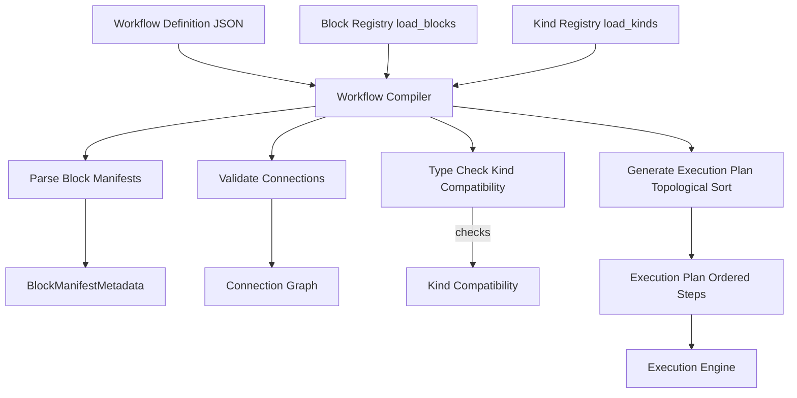
### Block Manifest Parsing

Each block class provides a manifest describing its inputs and outputs. The system uses introspection to extract this metadata:

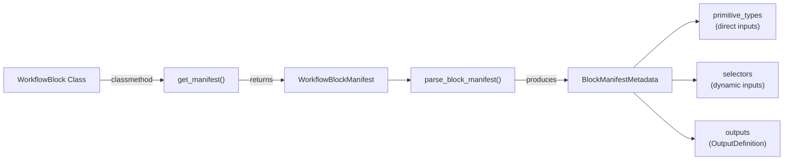

The `parse_block_manifest()` function analyzes the Pydantic manifest model to extract:

- **Primitive types**: Direct input parameters (strings, numbers, booleans)
- **Selectors**: Dynamic inputs referencing other steps or workflow inputs
- **Allowed references**: Kind constraints for each selector

Sources: [development/docs/build_block_docs.py15-28](https://github.com/roboflow/inference/blob/55f57676/development/docs/build_block_docs.py#L15-L28) [inference/core/workflows/core_steps/models/foundation/openai/v3.py89-110](https://github.com/roboflow/inference/blob/55f57676/inference/core/workflows/core_steps/models/foundation/openai/v3.py#L89-L110) [inference/core/workflows/core_steps/models/foundation/openai/v3.py237-243](https://github.com/roboflow/inference/blob/55f57676/inference/core/workflows/core_steps/models/foundation/openai/v3.py#L237-L243)

### Type Checking and Kind Compatibility

The compiler validates that connections between blocks satisfy kind constraints:

|Validation Check|Purpose|Enforced At|
|---|---|---|
|Kind compatibility|Ensures output kind matches input kind requirements|Compile time|
|Dimensionality|Validates batch dimensions align correctly|Compile time|
|Selector references|Confirms referenced steps exist|Compile time|
|Required parameters|Checks all required inputs are provided|Compile time|

The kind system prevents runtime type errors by ensuring:

- Block outputs declaring `IMAGE_KIND` can only connect to inputs accepting `IMAGE_KIND`
- Union kinds allow flexibility (e.g., `STRING_KIND | LANGUAGE_MODEL_OUTPUT_KIND`)
- Wildcard kind (`*`) accepts any input when type safety is not critical

Sources: [inference/core/workflows/execution_engine/entities/types.py7-31](https://github.com/roboflow/inference/blob/55f57676/inference/core/workflows/execution_engine/entities/types.py#L7-L31) High-level diagram 5

### Execution Plan Generation

After validation, the compiler generates an execution plan using topological sorting to determine the correct execution order:

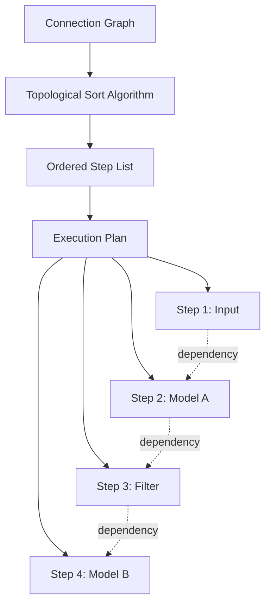

The topological ordering ensures:

- Dependencies execute before dependent steps
- Parallel execution opportunities are identified
- Cycles are detected and rejected
- Output dependencies are satisfied

Sources: High-level diagram 5

## Execution Engine Architecture

The execution engine processes workflows according to the compiled execution plan.

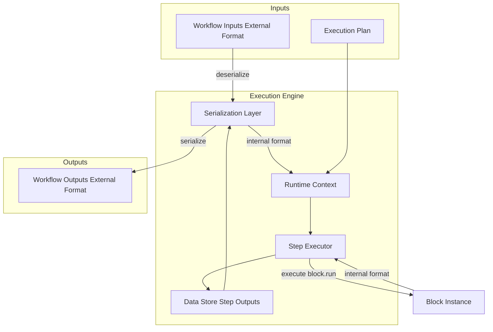

### Runtime Context Initialization

The execution engine initializes blocks with registered dependencies from `REGISTERED_INITIALIZERS`:

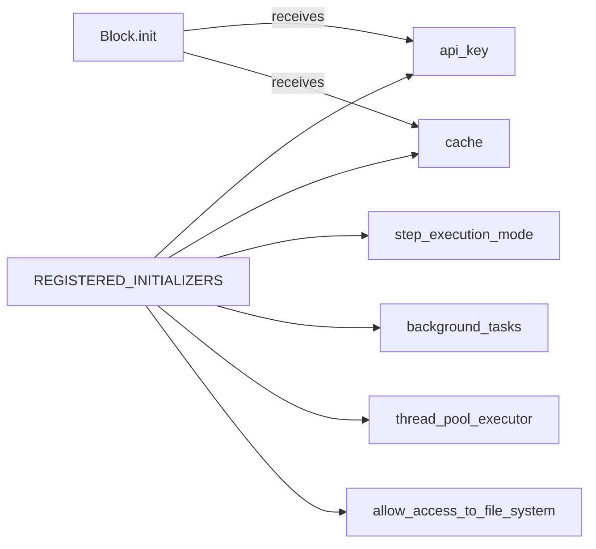

The `REGISTERED_INITIALIZERS` dictionary at [inference/core/workflows/core_steps/loader.py491-500](https://github.com/roboflow/inference/blob/55f57676/inference/core/workflows/core_steps/loader.py#L491-L500) provides:

- `api_key`: Roboflow API key from environment
- `cache`: Multi-layer cache instance
- `step_execution_mode`: Controls execution behavior (local vs remote)
- `background_tasks`: For async operations
- `thread_pool_executor`: For parallel execution
- File system access controls

Blocks declare required initializers via `get_init_parameters()` classmethod at [inference/core/workflows/core_steps/models/foundation/openai/v3.py261-262](https://github.com/roboflow/inference/blob/55f57676/inference/core/workflows/core_steps/models/foundation/openai/v3.py#L261-L262)

Sources: [inference/core/workflows/core_steps/loader.py491-500](https://github.com/roboflow/inference/blob/55f57676/inference/core/workflows/core_steps/loader.py#L491-L500) [inference/core/workflows/core_steps/models/foundation/openai/v3.py252-258](https://github.com/roboflow/inference/blob/55f57676/inference/core/workflows/core_steps/models/foundation/openai/v3.py#L252-L258) [inference/core/workflows/core_steps/models/foundation/openai/v3.py261-262](https://github.com/roboflow/inference/blob/55f57676/inference/core/workflows/core_steps/models/foundation/openai/v3.py#L261-L262)

### Step Execution Flow

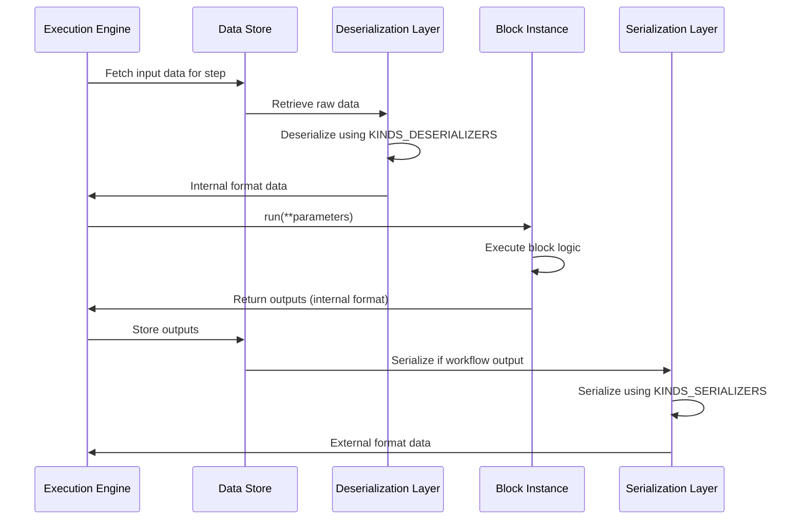

For each step in the execution plan:

1. **Parameter Resolution**: Selectors are resolved by fetching data from the data store
2. **Deserialization**: External format converted to internal format using `KINDS_DESERIALIZERS`
3. **Block Execution**: Block's `run()` method is invoked with deserialized parameters
4. **Output Storage**: Results stored in data store for downstream steps
5. **Serialization**: If step output is a workflow output, serialize using `KINDS_SERIALIZERS`

Sources: [inference/core/workflows/core_steps/loader.py502-545](https://github.com/roboflow/inference/blob/55f57676/inference/core/workflows/core_steps/loader.py#L502-L545)

## Execution Modes

The execution engine supports three distinct modes optimized for different workload patterns.

### Image Mode (Single and Batch Processing)

Processes individual images or batches of images through the workflow:

**Batching Support**: Blocks declare batch acceptance via `get_parameters_accepting_batches()` classmethod at [inference/core/workflows/core_steps/models/foundation/openai/v3.py233-234](https://github.com/roboflow/inference/blob/55f57676/inference/core/workflows/core_steps/models/foundation/openai/v3.py#L233-L234) The OpenAI v3 block accepts batches on the `images` parameter, enabling parallel processing with configurable concurrency.

**Concurrency Control**: The `max_concurrent_requests` parameter at [inference/core/workflows/core_steps/models/foundation/openai/v3.py206-211](https://github.com/roboflow/inference/blob/55f57676/inference/core/workflows/core_steps/models/foundation/openai/v3.py#L206-L211) limits parallel execution. If unset, defaults to `WORKFLOWS_REMOTE_EXECUTION_MAX_STEP_CONCURRENT_REQUESTS` environment variable.

Sources: [inference/core/workflows/core_steps/models/foundation/openai/v3.py206-211](https://github.com/roboflow/inference/blob/55f57676/inference/core/workflows/core_steps/models/foundation/openai/v3.py#L206-L211) [inference/core/workflows/core_steps/models/foundation/openai/v3.py233-234](https://github.com/roboflow/inference/blob/55f57676/inference/core/workflows/core_steps/models/foundation/openai/v3.py#L233-L234) [inference/core/workflows/core_steps/models/foundation/openai/v3.py272-303](https://github.com/roboflow/inference/blob/55f57676/inference/core/workflows/core_steps/models/foundation/openai/v3.py#L272-L303) High-level diagram 5

### Video Mode (Stream Processing)

Processes video frames in real-time through stateful workflow execution. See [InferencePipeline](https://deepwiki.com/roboflow/inference/4.1-inferencepipeline) for video processing architecture details.

### Batch API Processing

Handles large-scale batch processing of thousands of images. See [Batch Processing Architecture](https://deepwiki.com/roboflow/inference/6.4-parallel-processing-architecture) for parallel processing implementation.

Sources: High-level diagram 5

## Data Serialization and Deserialization

The serialization layer translates between external (API/UI) and internal (block execution) data formats.

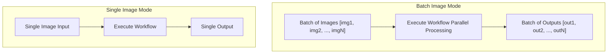
### Serialization Process

**Key Serializers** defined at [inference/core/workflows/core_steps/loader.py502-513](https://github.com/roboflow/inference/blob/55f57676/inference/core/workflows/core_steps/loader.py#L502-L513):

|Kind|Internal Type|External Type|Serializer Function|
|---|---|---|---|
|`IMAGE_KIND`|`WorkflowImageData`|`dict`|`serialise_image`|
|`OBJECT_DETECTION_PREDICTION_KIND`|`sv.Detections`|`dict`|`serialise_sv_detections`|
|`INSTANCE_SEGMENTATION_PREDICTION_KIND`|`sv.Detections`|`dict`|`serialise_sv_detections`|
|`SECRET_KIND`|`str`|`str` (masked)|`serialize_secret`|
|`TIMESTAMP_KIND`|`datetime`|`str` (ISO format)|`serialize_timestamp`|
|`WILDCARD_KIND`|`Any`|`Any`|`serialize_wildcard_kind`|

Sources: [inference/core/workflows/core_steps/loader.py502-513](https://github.com/roboflow/inference/blob/55f57676/inference/core/workflows/core_steps/loader.py#L502-L513)

### Deserialization Process

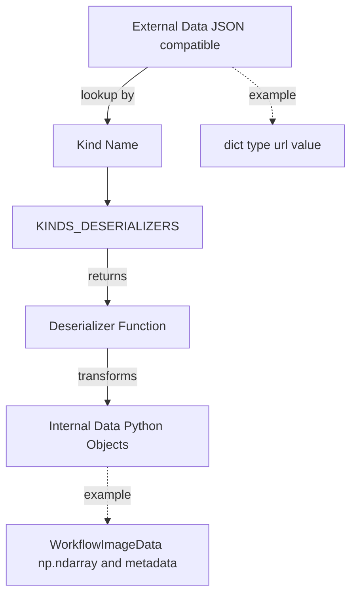

**Key Deserializers** defined at [inference/core/workflows/core_steps/loader.py514-545](https://github.com/roboflow/inference/blob/55f57676/inference/core/workflows/core_steps/loader.py#L514-L545):

|Kind|External Type|Internal Type|Deserializer Function|
|---|---|---|---|
|`IMAGE_KIND`|`dict`|`WorkflowImageData`|`deserialize_image_kind`|
|`OBJECT_DETECTION_PREDICTION_KIND`|`dict`|`sv.Detections`|`deserialize_detections_kind`|
|`NUMPY_ARRAY_KIND`|`list`|`np.ndarray`|`deserialize_numpy_array`|
|`CLASSIFICATION_PREDICTION_KIND`|`dict`|`dict`|`deserialize_classification_prediction_kind`|
|`TIMESTAMP_KIND`|`str` (ISO format)|`datetime`|`deserialize_timestamp`|

The deserialization layer handles multiple input formats for `IMAGE_KIND` (np.ndarray, PIL image, base64, URL) as documented at [inference/core/workflows/execution_engine/entities/types.py56-93](https://github.com/roboflow/inference/blob/55f57676/inference/core/workflows/execution_engine/entities/types.py#L56-L93)

Sources: [inference/core/workflows/core_steps/loader.py514-545](https://github.com/roboflow/inference/blob/55f57676/inference/core/workflows/core_steps/loader.py#L514-L545) [inference/core/workflows/execution_engine/entities/types.py56-93](https://github.com/roboflow/inference/blob/55f57676/inference/core/workflows/execution_engine/entities/types.py#L56-L93)

## Block Lifecycle and Execution

### Block Implementation Pattern

Blocks implement the `WorkflowBlock` interface with these key methods:

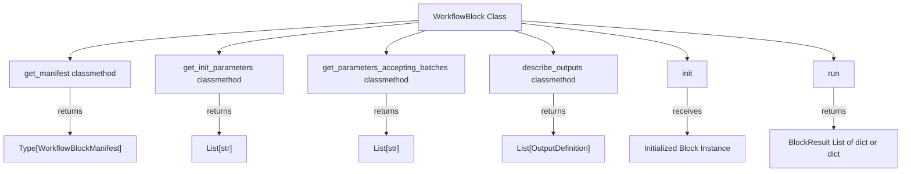

**Example: OpenAI Block v3** at [inference/core/workflows/core_steps/models/foundation/openai/v3.py250-303](https://github.com/roboflow/inference/blob/55f57676/inference/core/workflows/core_steps/models/foundation/openai/v3.py#L250-L303):

1. `get_manifest()` returns `BlockManifest` class defining inputs/outputs
2. `get_init_parameters()` declares required initializers: `["model_manager", "api_key"]`
3. `get_parameters_accepting_batches()` declares `["images"]` accepts batches
4. `describe_outputs()` defines output kinds: `[("output", STRING_KIND | LANGUAGE_MODEL_OUTPUT_KIND), ("classes", LIST_OF_VALUES_KIND)]`
5. `__init__()` receives and stores `model_manager` and `api_key`
6. `run()` executes the block logic with deserialized parameters

Sources: [inference/core/workflows/core_steps/models/foundation/openai/v3.py250-303](https://github.com/roboflow/inference/blob/55f57676/inference/core/workflows/core_steps/models/foundation/openai/v3.py#L250-L303)

### Execution with Model Manager Integration

Blocks requiring model inference integrate with the `ModelManager`:

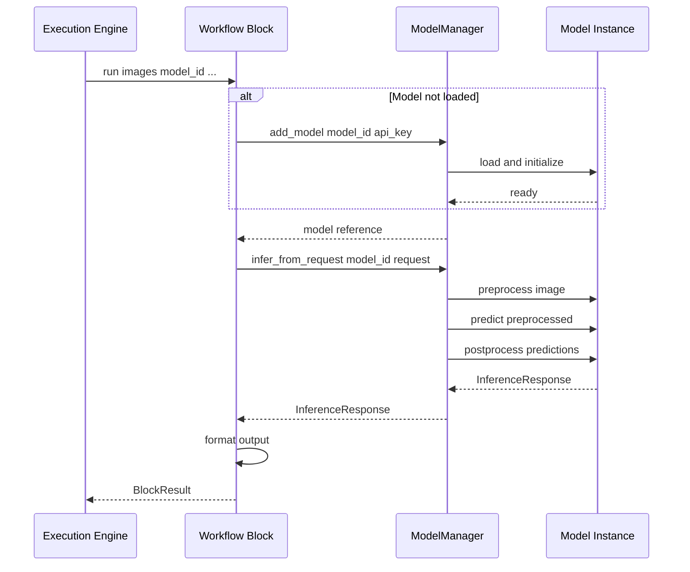

The `ModelManager` provides:

- Lazy model loading (models loaded on first use)
- Model caching (reuse across workflow executions)
- Unified inference interface across model types

Sources: High-level diagram 3, [Core Architecture](https://deepwiki.com/roboflow/inference/2-core-architecture)

## Documentation Generation

The workflow system auto-generates documentation by introspecting blocks and kinds:

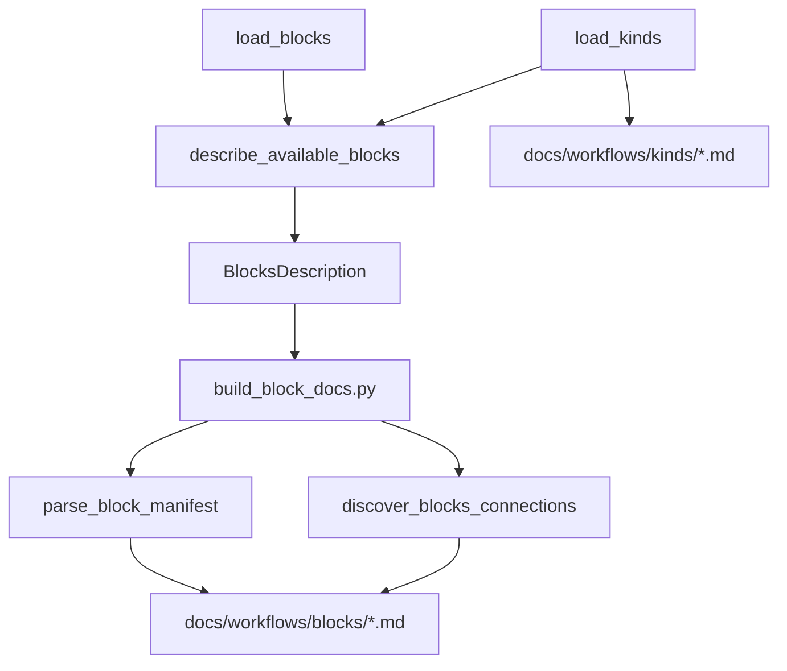

The documentation build process at [development/docs/build_block_docs.py251-254](https://github.com/roboflow/inference/blob/55f57676/development/docs/build_block_docs.py#L251-L254):

1. Calls `describe_available_blocks()` to introspect all registered blocks
2. Calls `discover_blocks_connections()` to compute compatibility graph
3. Generates markdown pages for each block family showing:
    - Type identifier for workflow definitions
    - Input parameters with kind annotations
    - Output bindings with kind annotations
    - Compatible input/output blocks
    - Example JSON step definition
4. Generates kind pages documenting data representations

This ensures documentation stays synchronized with code as blocks evolve.

Sources: [development/docs/build_block_docs.py15-28](https://github.com/roboflow/inference/blob/55f57676/development/docs/build_block_docs.py#L15-L28) [development/docs/build_block_docs.py251-336](https://github.com/roboflow/inference/blob/55f57676/development/docs/build_block_docs.py#L251-L336)

## Workflow Gallery System

The workflow gallery demonstrates example workflows through automated collection and publishing:

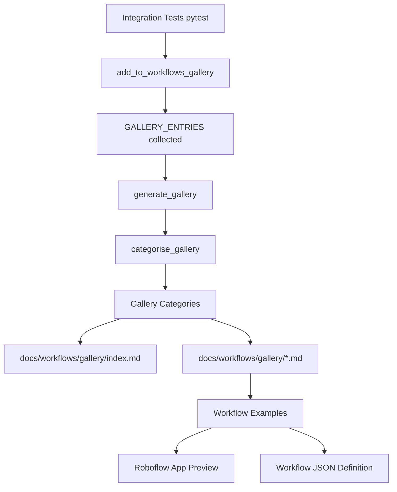

The gallery builder at [development/docs/workflows_gallery_builder.py42-47](https://github.com/roboflow/inference/blob/55f57676/development/docs/workflows_gallery_builder.py#L42-L47):

1. Runs pytest collection to find decorated test cases
2. Categorizes workflows by use case
3. Publishes workflows to Roboflow app via API
4. Generates gallery pages with embedded previews

Each gallery entry includes workflow definition and interactive preview hosted in Roboflow app.

Sources: [development/docs/workflows_gallery_builder.py1-368](https://github.com/roboflow/inference/blob/55f57676/development/docs/workflows_gallery_builder.py#L1-L368) [development/docs/workflows_gallery_builder.py42-47](https://github.com/roboflow/inference/blob/55f57676/development/docs/workflows_gallery_builder.py#L42-L47) [development/docs/workflows_gallery_builder.py150-194](https://github.com/roboflow/inference/blob/55f57676/development/docs/workflows_gallery_builder.py#L150-L194)

## Performance Considerations

### Parallel Execution

Blocks can leverage parallel execution for batch processing:

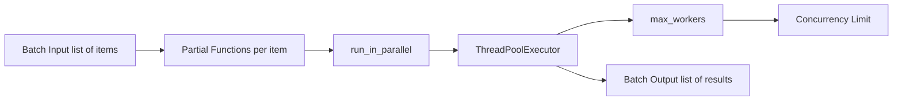

The OpenAI block uses `run_in_parallel()` at [inference/core/workflows/core_steps/models/foundation/openai/v3.py372-375](https://github.com/roboflow/inference/blob/55f57676/inference/core/workflows/core_steps/models/foundation/openai/v3.py#L372-L375) to execute requests concurrently with configurable `max_workers` to avoid rate limits.

Sources: [inference/core/workflows/core_steps/models/foundation/openai/v3.py306-375](https://github.com/roboflow/inference/blob/55f57676/inference/core/workflows/core_steps/models/foundation/openai/v3.py#L306-L375)

### Caching Strategy

Blocks can access the shared cache instance for optimization:

- Model artifact caching (weights, configurations)
- Inference result caching
- API response caching (e.g., workspace lookups with 1-hour TTL)

See [Caching and Persistence](https://deepwiki.com/roboflow/inference/2.3-caching-and-persistence) for cache architecture details.

Sources: [inference/core/workflows/core_steps/loader.py493](https://github.com/roboflow/inference/blob/55f57676/inference/core/workflows/core_steps/loader.py#L493-L493) High-level diagram 3

## Error Handling and Validation

The compilation phase prevents runtime errors through comprehensive validation:

|Error Type|Detection Phase|Example|
|---|---|---|
|Missing blocks|Compilation|Referenced block type not in registry|
|Type mismatch|Compilation|IMAGE_KIND output → STRING_KIND input|
|Cyclic dependencies|Compilation|Step A → Step B → Step A|
|Missing parameters|Compilation|Required parameter not provided|
|Invalid selectors|Compilation|Reference to non-existent step|
|Runtime execution|Execution|API failures, model errors|

Validation occurs at [inference/core/workflows/core_steps/models/foundation/openai/v3.py213-230](https://github.com/roboflow/inference/blob/55f57676/inference/core/workflows/core_steps/models/foundation/openai/v3.py#L213-L230) using Pydantic `@model_validator` to ensure task-specific parameters are provided.

Sources: [inference/core/workflows/core_steps/models/foundation/openai/v3.py213-230](https://github.com/roboflow/inference/blob/55f57676/inference/core/workflows/core_steps/models/foundation/openai/v3.py#L213-L230) High-level diagram 5