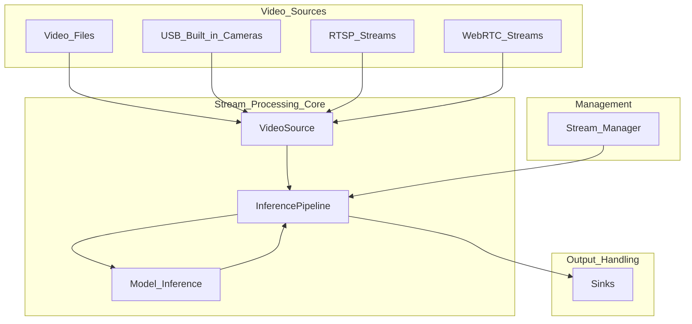
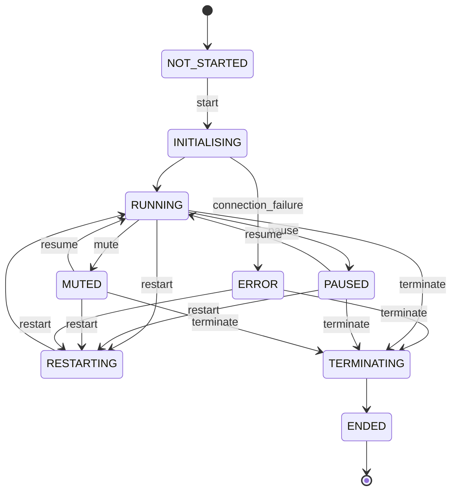
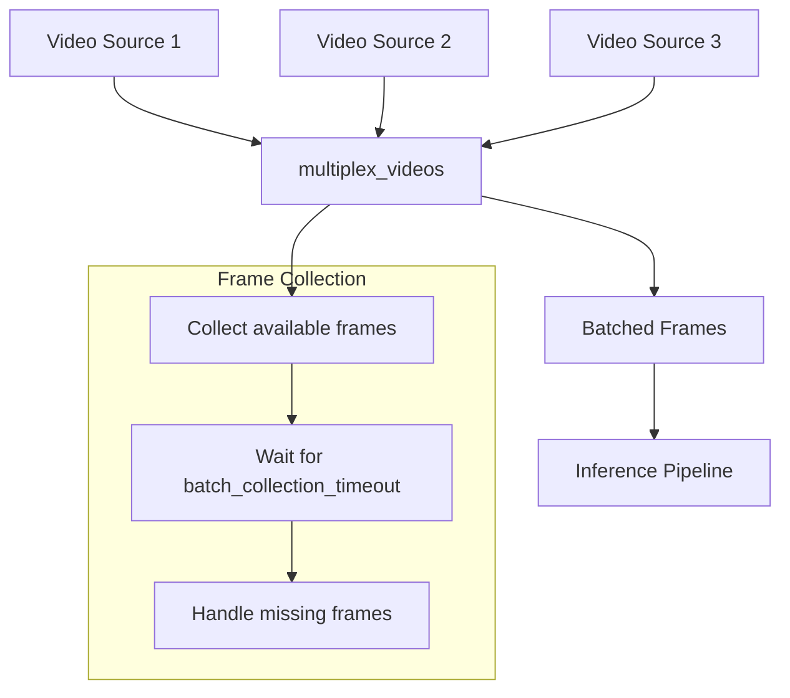
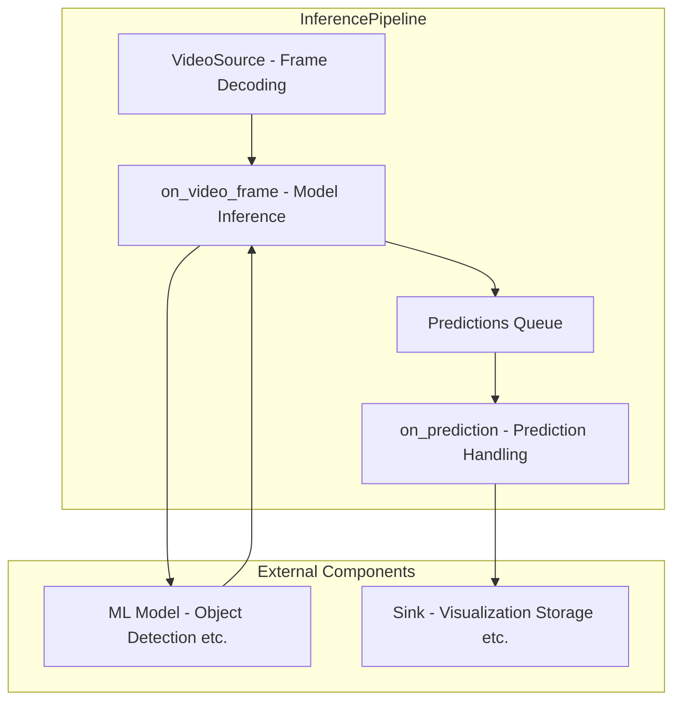
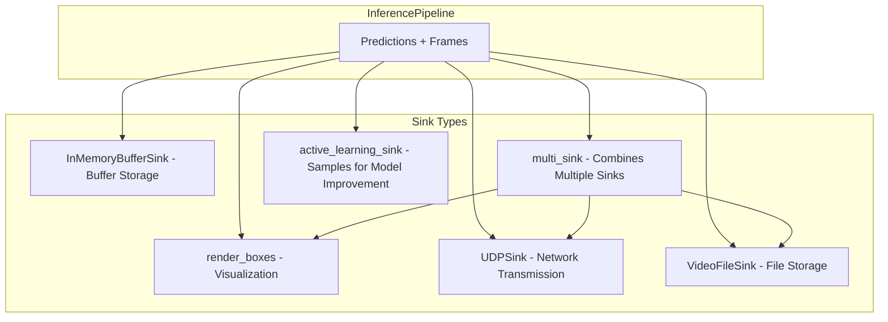
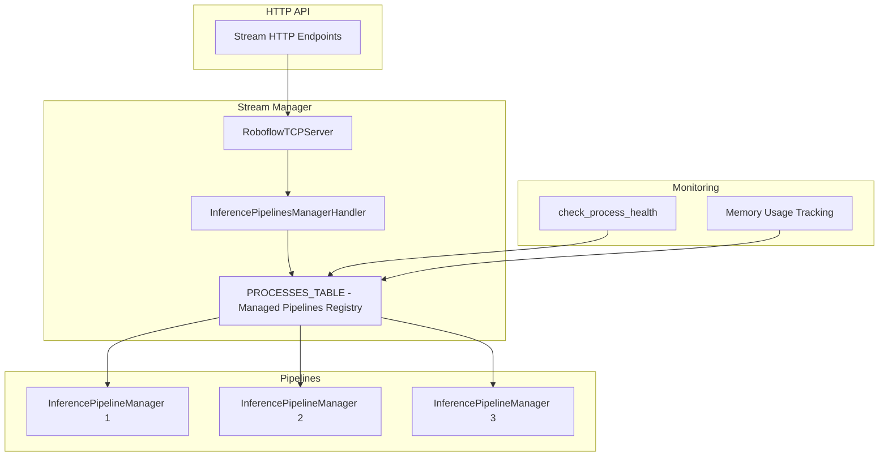
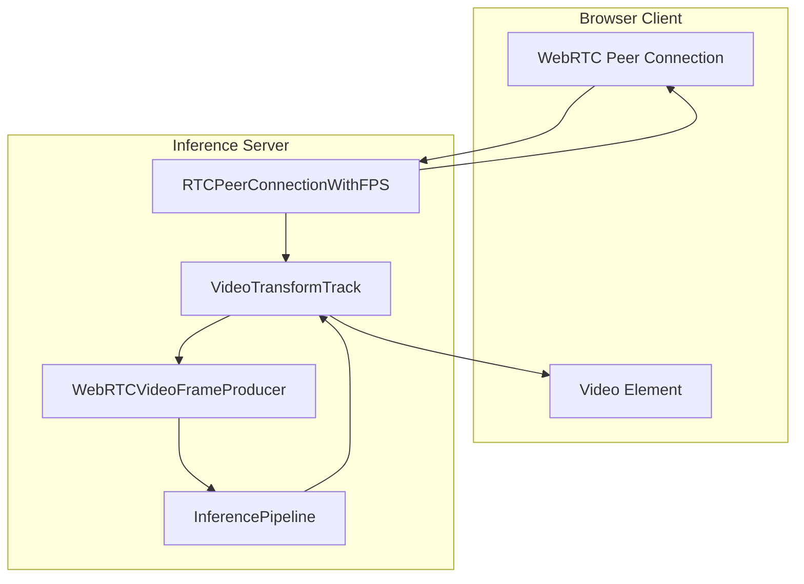
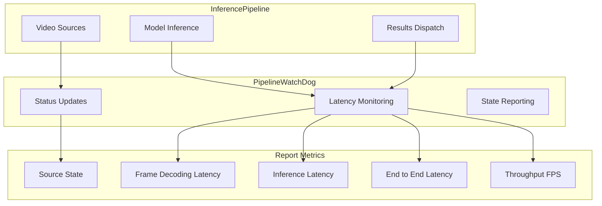

# Stream Processing

Relevant source files

- [development/__init__.py](https://github.com/roboflow/inference/blob/55f57676/development/__init__.py)
- [development/stream_interface/__init__.py](https://github.com/roboflow/inference/blob/55f57676/development/stream_interface/__init__.py)
- [development/stream_interface/camera_demo.py](https://github.com/roboflow/inference/blob/55f57676/development/stream_interface/camera_demo.py)
- [development/stream_interface/camera_test.py](https://github.com/roboflow/inference/blob/55f57676/development/stream_interface/camera_test.py)
- [development/stream_interface/multiplexer.py](https://github.com/roboflow/inference/blob/55f57676/development/stream_interface/multiplexer.py)
- [development/stream_interface/multiplexer_demo.py](https://github.com/roboflow/inference/blob/55f57676/development/stream_interface/multiplexer_demo.py)
- [development/stream_interface/multiplexer_inference_pipeline.py](https://github.com/roboflow/inference/blob/55f57676/development/stream_interface/multiplexer_inference_pipeline.py)
- [development/stream_interface/old_camera_demo.py](https://github.com/roboflow/inference/blob/55f57676/development/stream_interface/old_camera_demo.py)
- [docker/config/cpu_http.py](https://github.com/roboflow/inference/blob/55f57676/docker/config/cpu_http.py)
- [docker/config/gpu_http.py](https://github.com/roboflow/inference/blob/55f57676/docker/config/gpu_http.py)
- [docker/config/lambda.py](https://github.com/roboflow/inference/blob/55f57676/docker/config/lambda.py)
- [inference/core/interfaces/camera/entities.py](https://github.com/roboflow/inference/blob/55f57676/inference/core/interfaces/camera/entities.py)
- [inference/core/interfaces/camera/exceptions.py](https://github.com/roboflow/inference/blob/55f57676/inference/core/interfaces/camera/exceptions.py)
- [inference/core/interfaces/camera/utils.py](https://github.com/roboflow/inference/blob/55f57676/inference/core/interfaces/camera/utils.py)
- [inference/core/interfaces/camera/video_source.py](https://github.com/roboflow/inference/blob/55f57676/inference/core/interfaces/camera/video_source.py)
- [inference/core/interfaces/stream/entities.py](https://github.com/roboflow/inference/blob/55f57676/inference/core/interfaces/stream/entities.py)
- [inference/core/interfaces/stream/inference_pipeline.py](https://github.com/roboflow/inference/blob/55f57676/inference/core/interfaces/stream/inference_pipeline.py)
- [inference/core/interfaces/stream/sinks.py](https://github.com/roboflow/inference/blob/55f57676/inference/core/interfaces/stream/sinks.py)
- [inference/core/interfaces/stream/utils.py](https://github.com/roboflow/inference/blob/55f57676/inference/core/interfaces/stream/utils.py)
- [inference/core/interfaces/stream/watchdog.py](https://github.com/roboflow/inference/blob/55f57676/inference/core/interfaces/stream/watchdog.py)
- [inference/core/interfaces/stream_manager/api/entities.py](https://github.com/roboflow/inference/blob/55f57676/inference/core/interfaces/stream_manager/api/entities.py)
- [inference/core/interfaces/stream_manager/api/errors.py](https://github.com/roboflow/inference/blob/55f57676/inference/core/interfaces/stream_manager/api/errors.py)
- [inference/core/interfaces/stream_manager/api/stream_manager_client.py](https://github.com/roboflow/inference/blob/55f57676/inference/core/interfaces/stream_manager/api/stream_manager_client.py)
- [inference/core/interfaces/stream_manager/manager_app/app.py](https://github.com/roboflow/inference/blob/55f57676/inference/core/interfaces/stream_manager/manager_app/app.py)
- [inference/core/interfaces/stream_manager/manager_app/communication.py](https://github.com/roboflow/inference/blob/55f57676/inference/core/interfaces/stream_manager/manager_app/communication.py)
- [inference/core/interfaces/stream_manager/manager_app/entities.py](https://github.com/roboflow/inference/blob/55f57676/inference/core/interfaces/stream_manager/manager_app/entities.py)
- [inference/core/interfaces/stream_manager/manager_app/errors.py](https://github.com/roboflow/inference/blob/55f57676/inference/core/interfaces/stream_manager/manager_app/errors.py)
- [inference/core/interfaces/stream_manager/manager_app/inference_pipeline_manager.py](https://github.com/roboflow/inference/blob/55f57676/inference/core/interfaces/stream_manager/manager_app/inference_pipeline_manager.py)
- [inference/core/interfaces/stream_manager/manager_app/serialisation.py](https://github.com/roboflow/inference/blob/55f57676/inference/core/interfaces/stream_manager/manager_app/serialisation.py)
- [inference/core/interfaces/stream_manager/manager_app/webrtc.py](https://github.com/roboflow/inference/blob/55f57676/inference/core/interfaces/stream_manager/manager_app/webrtc.py)
- [inference/core/utils/async_utils.py](https://github.com/roboflow/inference/blob/55f57676/inference/core/utils/async_utils.py)
- [inference/core/utils/drawing.py](https://github.com/roboflow/inference/blob/55f57676/inference/core/utils/drawing.py)
- [inference/core/utils/environment.py](https://github.com/roboflow/inference/blob/55f57676/inference/core/utils/environment.py)
- [inference/enterprise/stream_management/manager/entities.py](https://github.com/roboflow/inference/blob/55f57676/inference/enterprise/stream_management/manager/entities.py)
- [tests/inference/unit_tests/core/interfaces/__init__.py](https://github.com/roboflow/inference/blob/55f57676/tests/inference/unit_tests/core/interfaces/__init__.py)
- [tests/inference/unit_tests/core/interfaces/camera/test_video_source.py](https://github.com/roboflow/inference/blob/55f57676/tests/inference/unit_tests/core/interfaces/camera/test_video_source.py)
- [tests/inference/unit_tests/core/interfaces/stream/test_interface_pipeline.py](https://github.com/roboflow/inference/blob/55f57676/tests/inference/unit_tests/core/interfaces/stream/test_interface_pipeline.py)
- [tests/inference/unit_tests/core/interfaces/stream/test_sinks.py](https://github.com/roboflow/inference/blob/55f57676/tests/inference/unit_tests/core/interfaces/stream/test_sinks.py)
- [tests/inference/unit_tests/core/interfaces/stream/test_watchdog.py](https://github.com/roboflow/inference/blob/55f57676/tests/inference/unit_tests/core/interfaces/stream/test_watchdog.py)
- [tests/inference/unit_tests/core/utils/test_environment.py](https://github.com/roboflow/inference/blob/55f57676/tests/inference/unit_tests/core/utils/test_environment.py)

## Purpose and Scope

This document details the Stream Processing system within Roboflow Inference, which provides capabilities for processing video streams through computer vision models. It covers the architecture and components involved in video capture, frame processing, model inference, and result handling.

The Stream Processing system enables:

- Processing video from files, cameras, RTSP streams, and WebRTC
- Running inference on video frames in real-time
- Multiple output handling methods for inference results
- Multi-stream processing with parallel execution
- Pipeline monitoring and management

For information about the HTTP API that can be used to control stream processing, see [HTTP API](https://deepwiki.com/roboflow/inference/2.1-http-api-server). For workflow creation and execution that can be used within stream processing, see [Workflow System](https://deepwiki.com/roboflow/inference/2.3-caching-and-persistence).

## Architecture Overview

The Stream Processing system consists of several interconnected components that handle different aspects of video processing.



Sources:

- [inference/core/interfaces/stream/inference_pipeline.py](https://github.com/roboflow/inference/blob/55f57676/inference/core/interfaces/stream/inference_pipeline.py)
- [inference/core/interfaces/camera/video_source.py](https://github.com/roboflow/inference/blob/55f57676/inference/core/interfaces/camera/video_source.py)
- [inference/core/interfaces/stream_manager/manager_app/inference_pipeline_manager.py](https://github.com/roboflow/inference/blob/55f57676/inference/core/interfaces/stream_manager/manager_app/inference_pipeline_manager.py)

### Core Components

- **VideoSource**: Manages video capture, frame buffering, and source state (running, paused, etc.)
- **InferencePipeline**: Coordinates frame processing, model inference, and result handling
- **Sinks**: Handle prediction outputs (visualization, storage, transmission)
- **StreamManager**: Manages multiple inference pipelines

Sources:

- [inference/core/interfaces/stream/inference_pipeline.py85-456](https://github.com/roboflow/inference/blob/55f57676/inference/core/interfaces/stream/inference_pipeline.py#L85-L456)

## Video Source Management

### VideoSource Class

The `VideoSource` class abstracts various video inputs (files, streams, cameras) and handles:

- Frame decoding and buffering
- Source state management (running, paused, muted, terminated)
- Rate limiting and frame dropping strategies
- Error handling and reconnection



Sources:

- [inference/core/interfaces/camera/video_source.py191-726](https://github.com/roboflow/inference/blob/55f57676/inference/core/interfaces/camera/video_source.py#L191-L726)
- [inference/core/interfaces/camera/entities.py48-71](https://github.com/roboflow/inference/blob/55f57676/inference/core/interfaces/camera/entities.py#L48-L71)

### Buffer Management Strategies

VideoSource offers flexible strategies for managing frames in buffers:

**Buffer Filling Strategies:**

- `WAIT`: Wait for buffer space before grabbing new frames
- `DROP_OLDEST`: Discard oldest frames when buffer is full
- `DROP_LATEST`: Discard newly decoded frames when buffer is full
- `ADAPTIVE_DROP_OLDEST` / `ADAPTIVE_DROP_LATEST`: Adaptive versions that adjust based on source and consumption pacing

**Buffer Consumption Strategies:**

- `LAZY`: Process all buffered frames one by one
- `EAGER`: Take only the most recent frame and discard others

These strategies allow optimization for different use cases:

- For video files: `WAIT` filling + `LAZY` consumption ensures all frames are processed
- For live streams: `DROP_OLDEST` filling + `EAGER` consumption minimizes latency

Sources:

- [inference/core/interfaces/camera/video_source.py88-106](https://github.com/roboflow/inference/blob/55f57676/inference/core/interfaces/camera/video_source.py#L88-L106)
- [inference/core/interfaces/camera/video_source.py216-245](https://github.com/roboflow/inference/blob/55f57676/inference/core/interfaces/camera/video_source.py#L216-L245)

### Multi-source Processing

The system supports processing multiple video sources in parallel using frame multiplexing:



The `multiplex_videos()` function handles:

- Collecting frames from multiple sources
- Batch timeout management
- Source reconnection
- Missing frame handling

Sources:

- [inference/core/interfaces/camera/utils.py239-317](https://github.com/roboflow/inference/blob/55f57676/inference/core/interfaces/camera/utils.py#L239-L317)
- [inference/core/interfaces/stream/utils.py22-47](https://github.com/roboflow/inference/blob/55f57676/inference/core/interfaces/stream/utils.py#L22-L47)

## Inference Pipeline

The `InferencePipeline` class is the central coordinator of the Stream Processing system, managing the flow from video sources to prediction outputs.



The pipeline operates with these main components:

1. **Video Source**: Provides video frames
2. **Process Frame Function**: Applies ML models to frames
3. **Predictions Queue**: Buffers model predictions
4. **Sink Handler**: Processes prediction results

Sources:

- [inference/core/interfaces/stream/inference_pipeline.py85-457](https://github.com/roboflow/inference/blob/55f57676/inference/core/interfaces/stream/inference_pipeline.py#L85-L457)

### Initialization Options

InferencePipeline offers several initialization methods for different use cases:

1. **Standard Initialization** (`init`):
    
    ```
    pipeline = InferencePipeline.init(
        model_id="model-name/version",
        video_reference="video.mp4",
        on_prediction=display_function
    )
    ```
    
2. **YOLO World Initialization** (`init_with_yolo_world`):
    
    ```
    pipeline = InferencePipeline.init_with_yolo_world(
        video_reference="rtsp://camera-stream",
        classes=["car", "person"],
        model_size="s"
    )
    ```
    
3. **Workflow Initialization** (`init_with_workflow`):
    
    ```
    pipeline = InferencePipeline.init_with_workflow(
        video_reference=0,  # Camera ID
        workflow_specification=workflow_json,
        image_input_name="image"
    )
    ```
    
4. **Custom Logic** (`init_with_custom_logic`):
    
    ```
    pipeline = InferencePipeline.init_with_custom_logic(
        video_reference="video.mp4",
        on_video_frame=custom_process_function,
        on_prediction=custom_sink_function
    )
    ```
    

Sources:

- [inference/core/interfaces/stream/inference_pipeline.py86-456](https://github.com/roboflow/inference/blob/55f57676/inference/core/interfaces/stream/inference_pipeline.py#L86-L456)
- [inference/core/interfaces/stream/inference_pipeline.py458-568](https://github.com/roboflow/inference/blob/55f57676/inference/core/interfaces/stream/inference_pipeline.py#L458-L568)

### Pipeline Lifecycle

The InferencePipeline has a simple lifecycle management API:

```
# Start the pipeline
pipeline.start()

# For stream sources:
pipeline.mute_stream()  # Pause grabbing frames but continue stream connection
pipeline.resume_stream()  # Resume after muting

# Stop the pipeline
pipeline.terminate()

# Wait for pipeline to complete
pipeline.join()
```

Sources:

- [inference/core/interfaces/stream/inference_pipeline.py699-794](https://github.com/roboflow/inference/blob/55f57676/inference/core/interfaces/stream/inference_pipeline.py#L699-L794)

### Active Learning Integration

The InferencePipeline includes built-in support for Active Learning, which can automatically:

1. Sample frames and predictions
2. Register data with the Roboflow platform
3. Integrate with model improvement workflows

This is controlled by the `active_learning_enabled` parameter and `ACTIVE_LEARNING_ENABLED` environment variable.

Sources:

- [inference/core/interfaces/stream/inference_pipeline.py257-289](https://github.com/roboflow/inference/blob/55f57676/inference/core/interfaces/stream/inference_pipeline.py#L257-L289)
- [inference/core/interfaces/stream/sinks.py369-403](https://github.com/roboflow/inference/blob/55f57676/inference/core/interfaces/stream/sinks.py#L369-L403)

## Output Handling with Sinks

Sinks handle the output of inference pipelines, processing predictions in various ways.



### Built-in Sink Types

1. **Visualization** (`render_boxes`):
    
    - Renders bounding boxes on frames
    - Displays prediction confidence and labels
    - Shows FPS and latency statistics
2. **UDP Transmission** (`UDPSink`):
    
    - Sends predictions over network via UDP
    - Adds metadata (timestamps, frame IDs)
    - Serializes to JSON format
3. **Video Recording** (`VideoFileSink`):
    
    - Saves annotated frames to video file
    - Configurable output resolution and FPS
    - Compatible with multi-source pipelines
4. **In-Memory Buffering** (`InMemoryBufferSink`):
    
    - Stores predictions in memory buffer
    - Used by Stream Manager for client retrieval
    - Configurable buffer size
5. **Multi-Sink** (`multi_sink`):
    
    - Combines multiple sinks
    - Error handling for individual sinks
    - Used for simultaneous visualization and storage
6. **Active Learning** (`active_learning_sink`):
    
    - Samples frames for model improvement
    - Integrates with Roboflow platform
    - Configurable sampling strategies

Sources:

- [inference/core/interfaces/stream/sinks.py40-115](https://github.com/roboflow/inference/blob/55f57676/inference/core/interfaces/stream/sinks.py#L40-L115)
- [inference/core/interfaces/stream/sinks.py228-318](https://github.com/roboflow/inference/blob/55f57676/inference/core/interfaces/stream/sinks.py#L228-L318)
- [inference/core/interfaces/stream/sinks.py369-404](https://github.com/roboflow/inference/blob/55f57676/inference/core/interfaces/stream/sinks.py#L369-L404)
- [inference/core/interfaces/stream/sinks.py406-542](https://github.com/roboflow/inference/blob/55f57676/inference/core/interfaces/stream/sinks.py#L406-L542)
- [inference/core/interfaces/stream/sinks.py544-571](https://github.com/roboflow/inference/blob/55f57676/inference/core/interfaces/stream/sinks.py#L544-L571)

### Sink Mode Options

When using multiple video sources, sinks can operate in different modes:

- **SEQUENTIAL**: Process each frame individually
- **BATCH**: Process batches of frames from all sources
- **ADAPTIVE**: Automatically select mode based on source count

```
# Example of sink modes
pipeline = InferencePipeline.init(
    video_reference=["video1.mp4", "video2.mp4"],
    model_id="model/1",
    on_prediction=my_sink_function,
    sink_mode=SinkMode.BATCH
)
```

Sources:

- [inference/core/interfaces/stream/inference_pipeline.py79-83](https://github.com/roboflow/inference/blob/55f57676/inference/core/interfaces/stream/inference_pipeline.py#L79-L83)
- [inference/core/interfaces/stream/inference_pipeline.py211-225](https://github.com/roboflow/inference/blob/55f57676/inference/core/interfaces/stream/inference_pipeline.py#L211-L225)

## Stream Manager

The Stream Manager provides centralized management of multiple inference pipelines through a TCP interface. It's designed for production deployments where multiple streams need to be managed.



### InferencePipelineManager

Each managed pipeline runs in a separate process and handles:

1. Initialization of video sources
2. Model loading and inference
3. Result buffering and consumption
4. Pipeline state management (mute, resume, terminate)

The manager communicates with the Stream Manager via command and response queues.

Sources:

- [inference/core/interfaces/stream_manager/manager_app/inference_pipeline_manager.py63-571](https://github.com/roboflow/inference/blob/55f57676/inference/core/interfaces/stream_manager/manager_app/inference_pipeline_manager.py#L63-L571)

### Stream Manager Commands

The Stream Manager supports several command types:

- **INIT**: Initialize a new pipeline
- **WEBRTC**: Initialize a WebRTC-based pipeline
- **TERMINATE**: Stop and clean up a pipeline
- **MUTE**: Pause frame processing
- **RESUME**: Resume frame processing
- **STATUS**: Get pipeline status information
- **CONSUME_RESULT**: Retrieve buffered predictions
- **LIST_PIPELINES**: List active pipelines

Sources:

- [inference/core/interfaces/stream_manager/manager_app/entities.py38-46](https://github.com/roboflow/inference/blob/55f57676/inference/core/interfaces/stream_manager/manager_app/entities.py#L38-L46)
- [inference/core/interfaces/stream_manager/manager_app/app.py80-255](https://github.com/roboflow/inference/blob/55f57676/inference/core/interfaces/stream_manager/manager_app/app.py#L80-L255)

### Resource Management

The Stream Manager includes resource monitoring features:

- Memory usage tracking per pipeline
- Automatic pipeline termination for depleted sources
- Pipeline warm-up for faster initialization
- Timeout management for inactive pipelines

Sources:

- [inference/core/interfaces/stream_manager/manager_app/app.py316-392](https://github.com/roboflow/inference/blob/55f57676/inference/core/interfaces/stream_manager/manager_app/app.py#L316-L392)
- [inference/core/interfaces/stream_manager/manager_app/app.py395-417](https://github.com/roboflow/inference/blob/55f57676/inference/core/interfaces/stream_manager/manager_app/app.py#L395-L417)

## WebRTC Integration

The Stream Processing system includes WebRTC support for browser-based video streaming.



WebRTC integration allows:

- Real-time video streaming from browsers
- Low-latency inference feedback
- Cross-platform compatibility
- NAT traversal with TURN configuration

Sources:

- [inference/core/interfaces/stream_manager/manager_app/webrtc.py33-276](https://github.com/roboflow/inference/blob/55f57676/inference/core/interfaces/stream_manager/manager_app/webrtc.py#L33-L276)
- [inference/core/interfaces/stream_manager/manager_app/inference_pipeline_manager.py241-397](https://github.com/roboflow/inference/blob/55f57676/inference/core/interfaces/stream_manager/manager_app/inference_pipeline_manager.py#L241-L397)

## Pipeline Monitoring

The Stream Processing system includes monitoring capabilities through the `PipelineWatchDog` interface.



The watchdog provides:

- Frame decoding latency tracking
- Inference latency measurement
- End-to-end pipeline latency
- Pipeline throughput metrics
- Source state monitoring

Sources:

- [inference/core/interfaces/stream/watchdog.py31-56](https://github.com/roboflow/inference/blob/55f57676/inference/core/interfaces/stream/watchdog.py#L31-L56)
- [inference/core/interfaces/stream/watchdog.py79-154](https://github.com/roboflow/inference/blob/55f57676/inference/core/interfaces/stream/watchdog.py#L79-L154)

## Practical Usage Examples

### Basic Video File Processing

```
from inference import InferencePipeline
from inference.core.interfaces.stream.sinks import render_boxes

# Initialize pipeline with visualization
pipeline = InferencePipeline.init(
    model_id="model-name/1",
    video_reference="video.mp4",
    on_prediction=render_boxes
)

# Run pipeline
pipeline.start()
pipeline.join()
```

### Multi-camera Object Detection

```
from inference import InferencePipeline
from inference.core.interfaces.stream.sinks import UDPSink

# Create UDP sink for sending results over network
udp_sink = UDPSink.init(ip_address="192.168.1.100", port=9090)

# Initialize pipeline with multiple cameras
pipeline = InferencePipeline.init(
    model_id="object-detection-model/2",
    video_reference=[0, 1],  # Camera IDs 0 and 1
    on_prediction=udp_sink.send_predictions,
    batch_collection_timeout=0.1  # Wait max 100ms for frame batch
)

# Run pipeline
pipeline.start()
pipeline.join()
```

### Video Recording with Annotations

```
from inference import InferencePipeline
from inference.core.interfaces.stream.sinks import VideoFileSink

# Create video file sink
video_sink = VideoFileSink.init(
    video_file_name="output.avi",
    output_fps=30,
    video_frame_size=(1920, 1080)
)

# Initialize pipeline with RTSP stream
pipeline = InferencePipeline.init(
    model_id="instance-segmentation-model/1",
    video_reference="rtsp://camera-stream-url",
    on_prediction=video_sink.on_prediction,
    max_fps=30  # Limit processing rate
)

# Run pipeline
pipeline.start()
try:
    # Run for a specific duration or until manual interrupt
    pipeline.join()
finally:
    # Ensure video file is properly closed
    video_sink.release()
```

Sources:

- [inference/core/interfaces/stream/inference_pipeline.py85-456](https://github.com/roboflow/inference/blob/55f57676/inference/core/interfaces/stream/inference_pipeline.py#L85-L456)
- [inference/core/interfaces/stream/sinks.py40-115](https://github.com/roboflow/inference/blob/55f57676/inference/core/interfaces/stream/sinks.py#L40-L115)
- [inference/core/interfaces/stream/sinks.py228-318](https://github.com/roboflow/inference/blob/55f57676/inference/core/interfaces/stream/sinks.py#L228-L318)
- [inference/core/interfaces/stream/sinks.py406-542](https://github.com/roboflow/inference/blob/55f57676/inference/core/interfaces/stream/sinks.py#L406-L542)