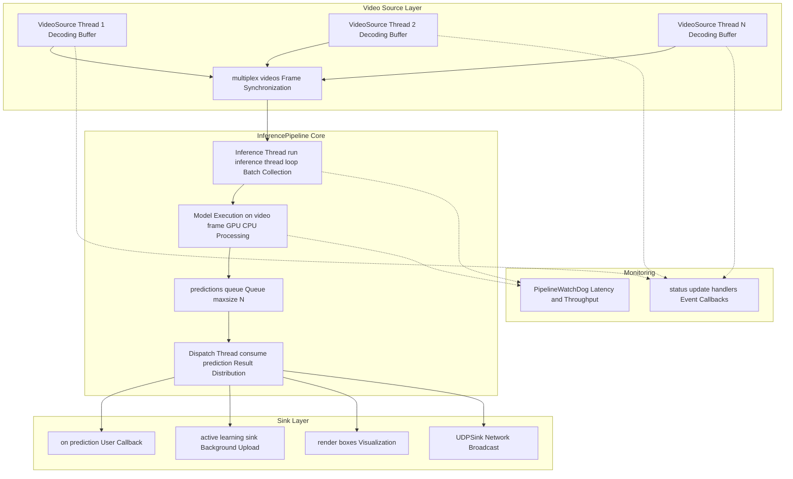
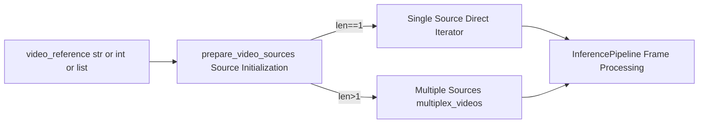
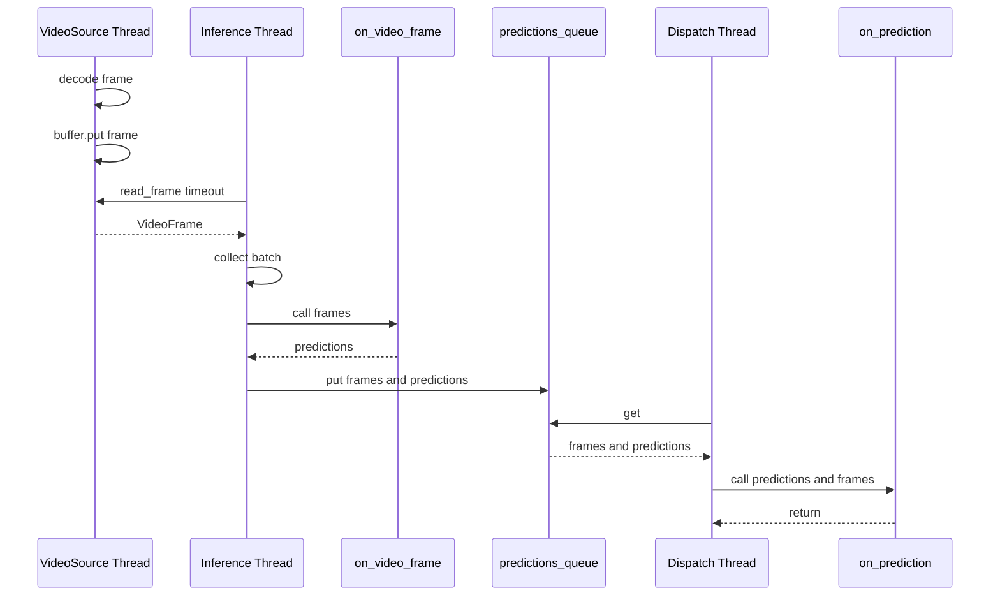
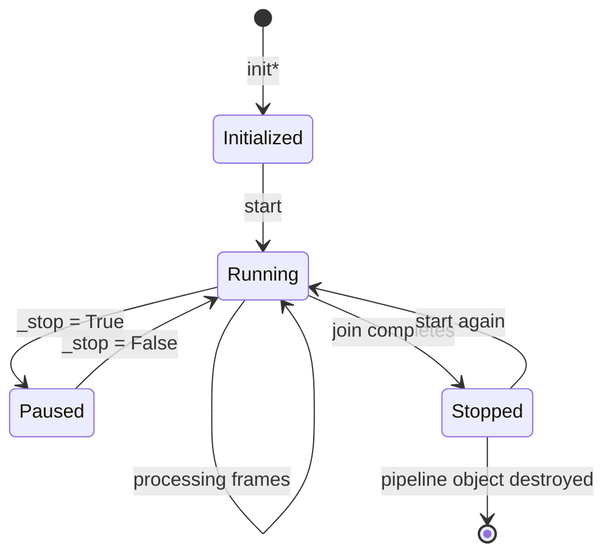
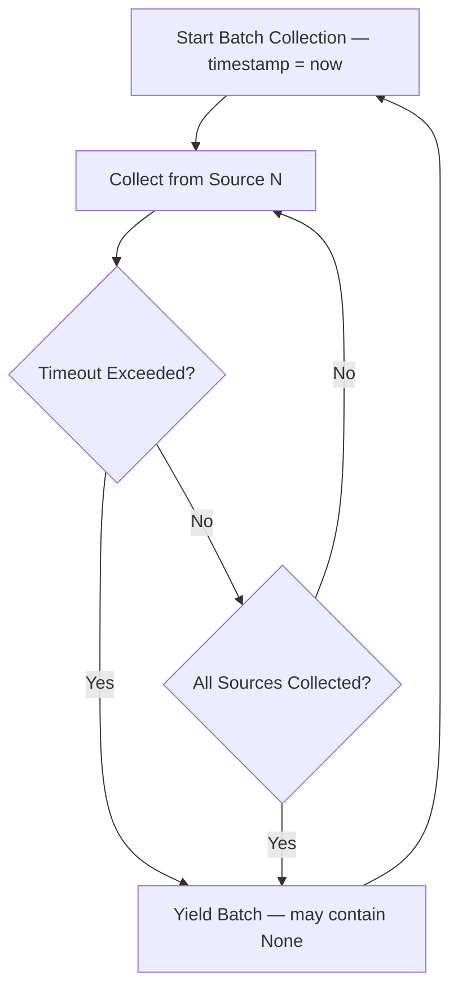
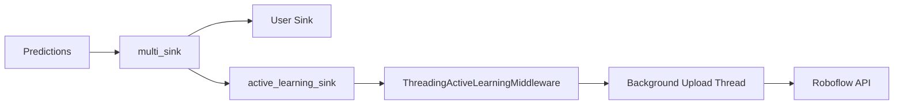

# InferencePipeline

Relevant source files

- [development/__init__.py](https://github.com/roboflow/inference/blob/55f57676/development/__init__.py)
- [development/stream_interface/__init__.py](https://github.com/roboflow/inference/blob/55f57676/development/stream_interface/__init__.py)
- [development/stream_interface/camera_demo.py](https://github.com/roboflow/inference/blob/55f57676/development/stream_interface/camera_demo.py)
- [development/stream_interface/camera_test.py](https://github.com/roboflow/inference/blob/55f57676/development/stream_interface/camera_test.py)
- [development/stream_interface/multiplexer.py](https://github.com/roboflow/inference/blob/55f57676/development/stream_interface/multiplexer.py)
- [development/stream_interface/multiplexer_demo.py](https://github.com/roboflow/inference/blob/55f57676/development/stream_interface/multiplexer_demo.py)
- [development/stream_interface/old_camera_demo.py](https://github.com/roboflow/inference/blob/55f57676/development/stream_interface/old_camera_demo.py)
- [inference/core/interfaces/camera/utils.py](https://github.com/roboflow/inference/blob/55f57676/inference/core/interfaces/camera/utils.py)
- [inference/core/interfaces/camera/video_source.py](https://github.com/roboflow/inference/blob/55f57676/inference/core/interfaces/camera/video_source.py)
- [inference/core/interfaces/stream/entities.py](https://github.com/roboflow/inference/blob/55f57676/inference/core/interfaces/stream/entities.py)
- [inference/core/interfaces/stream/inference_pipeline.py](https://github.com/roboflow/inference/blob/55f57676/inference/core/interfaces/stream/inference_pipeline.py)
- [inference/core/interfaces/stream/sinks.py](https://github.com/roboflow/inference/blob/55f57676/inference/core/interfaces/stream/sinks.py)
- [inference/core/interfaces/stream/watchdog.py](https://github.com/roboflow/inference/blob/55f57676/inference/core/interfaces/stream/watchdog.py)
- [inference/core/utils/environment.py](https://github.com/roboflow/inference/blob/55f57676/inference/core/utils/environment.py)
- [tests/inference/unit_tests/core/interfaces/__init__.py](https://github.com/roboflow/inference/blob/55f57676/tests/inference/unit_tests/core/interfaces/__init__.py)
- [tests/inference/unit_tests/core/interfaces/camera/test_video_source.py](https://github.com/roboflow/inference/blob/55f57676/tests/inference/unit_tests/core/interfaces/camera/test_video_source.py)
- [tests/inference/unit_tests/core/interfaces/stream/test_interface_pipeline.py](https://github.com/roboflow/inference/blob/55f57676/tests/inference/unit_tests/core/interfaces/stream/test_interface_pipeline.py)
- [tests/inference/unit_tests/core/interfaces/stream/test_sinks.py](https://github.com/roboflow/inference/blob/55f57676/tests/inference/unit_tests/core/interfaces/stream/test_sinks.py)
- [tests/inference/unit_tests/core/interfaces/stream/test_watchdog.py](https://github.com/roboflow/inference/blob/55f57676/tests/inference/unit_tests/core/interfaces/stream/test_watchdog.py)
- [tests/inference/unit_tests/core/utils/test_environment.py](https://github.com/roboflow/inference/blob/55f57676/tests/inference/unit_tests/core/utils/test_environment.py)

## Purpose and Scope

`InferencePipeline` is the primary abstraction for running real-time computer vision inference against video streams and files. It orchestrates video decoding, model inference, and result dispatching through a multi-threaded architecture designed for high throughput and low latency. This page documents the pipeline's architecture, threading model, configuration options, and integration patterns.

For information about the underlying video decoding system, see [Video Sources and Multiplexing](https://deepwiki.com/roboflow/inference/4.2-video-sources-and-multiplexing). For workflow-based inference instead of direct model inference, see [Workflow Execution](https://deepwiki.com/roboflow/inference/3.3-workflow-execution). For batch processing of static images, see [HTTP API Server](https://deepwiki.com/roboflow/inference/2.1-http-api-server).

---

## Architecture Overview

The `InferencePipeline` class coordinates four primary subsystems: video source management, inference execution, result dispatching, and performance monitoring. These subsystems operate on separate threads to maximize throughput and minimize latency.



**Architecture: InferencePipeline Thread Coordination**

The pipeline operates with a producer-consumer pattern where video sources produce frames, the inference thread consumes and processes them, and the dispatch thread delivers results to sinks. The `predictions_queue` decouples inference from dispatching to prevent slow sinks from blocking model execution.

**Sources:** [inference/core/interfaces/stream/inference_pipeline.py85-1050](https://github.com/roboflow/inference/blob/55f57676/inference/core/interfaces/stream/inference_pipeline.py#L85-L1050)

---

## Core Components

### Video Source Management

The pipeline accepts one or more `VideoSource` instances or video references (file paths, stream URLs, device IDs). For single sources, the pipeline uses the source's native iterator. For multiple sources, it delegates to `multiplex_videos()` which synchronizes frame collection across sources with configurable timeout.



**Component: Video Source Selection Strategy**

The `prepare_video_sources()` function in [inference/core/interfaces/stream/utils.py52-107](https://github.com/roboflow/inference/blob/55f57676/inference/core/interfaces/stream/utils.py#L52-L107) initializes sources and sets appropriate buffer strategies. Files default to `BufferFillingStrategy.WAIT` with `BufferConsumptionStrategy.LAZY` to process all frames. Streams default to `BufferFillingStrategy.ADAPTIVE_DROP_OLDEST` with `BufferConsumptionStrategy.EAGER` for low latency.

**Sources:** [inference/core/interfaces/stream/inference_pipeline.py621-723](https://github.com/roboflow/inference/blob/55f57676/inference/core/interfaces/stream/inference_pipeline.py#L621-L723) [inference/core/interfaces/stream/utils.py239-349](https://github.com/roboflow/inference/blob/55f57676/inference/core/interfaces/stream/utils.py#L239-L349)

### Threading Model

The pipeline uses three primary threads (four when Active Learning is enabled):

|Thread|Function|Responsibility|
|---|---|---|
|**Inference Thread**|`_run_inference_thread_loop()`|Collects frames from sources, batches them, invokes `on_video_frame()` callback|
|**Dispatch Thread**|`_consume_prediction()`|Retrieves predictions from queue, calls `on_prediction()` sink|
|**Video Source Threads**|`VideoSource._consume_video()`|Decodes video frames, fills decoding buffers (one thread per source)|
|**Active Learning Thread**|`ActiveLearningMiddleware`|Background upload of samples (optional, started via `on_pipeline_start`)|




**Sequence: Frame Processing Flow**

The inference thread blocks on `batch_collection_timeout` when collecting frames from multiple sources [inference/core/interfaces/stream/inference_pipeline.py774-793](https://github.com/roboflow/inference/blob/55f57676/inference/core/interfaces/stream/inference_pipeline.py#L774-L793) If timeout expires, it proceeds with partial batches to maintain throughput.

**Sources:** [inference/core/interfaces/stream/inference_pipeline.py731-871](https://github.com/roboflow/inference/blob/55f57676/inference/core/interfaces/stream/inference_pipeline.py#L731-L871) [inference/core/interfaces/camera/video_source.py667-721](https://github.com/roboflow/inference/blob/55f57676/inference/core/interfaces/camera/video_source.py#L667-L721)

### Sink Pattern

Sinks are callbacks that receive predictions and video frames. The pipeline supports three sink modes via the `SinkMode` enum:

- **`SEQUENTIAL`**: Each frame/prediction pair triggers a separate sink call
- **`BATCH`**: Lists of frames/predictions are passed together (includes `None` for timed-out sources)
- **`ADAPTIVE`**: Automatic selection - `SEQUENTIAL` for single source, `BATCH` for multiple sources

The `multi_sink()` utility composes multiple sinks, calling each in sequence and catching exceptions to prevent one sink from blocking others.

```
# Sink function signature (SEQUENTIAL mode)
def on_prediction(prediction: dict, video_frame: VideoFrame) -> None: ...

# Sink function signature (BATCH mode)  
def on_prediction(
    predictions: List[Optional[dict]], 
    video_frames: List[Optional[VideoFrame]]
) -> None: ...
```

**Sources:** [inference/core/interfaces/stream/inference_pipeline.py79-83](https://github.com/roboflow/inference/blob/55f57676/inference/core/interfaces/stream/inference_pipeline.py#L79-L83) [inference/core/interfaces/stream/sinks.py321-367](https://github.com/roboflow/inference/blob/55f57676/inference/core/interfaces/stream/sinks.py#L321-L367)

### Watchdog and Status Updates

The `PipelineWatchDog` interface provides observability into pipeline operation. The `BasePipelineWatchDog` implementation tracks:

- **Latency**: Frame decoding, inference, and end-to-end latency per source
- **Throughput**: Inference FPS via `sv.FPSMonitor`
- **Source Status**: Stream state changes, connection errors, frame drops

Status update handlers receive `StatusUpdate` events from video sources and can be used for custom logging or alerting. The watchdog maintains circular buffers (max 64 latency samples, max 512 status updates) to compute rolling averages.

**Sources:** [inference/core/interfaces/stream/watchdog.py80-258](https://github.com/roboflow/inference/blob/55f57676/inference/core/interfaces/stream/watchdog.py#L80-L258) [inference/core/interfaces/stream/inference_pipeline.py873-906](https://github.com/roboflow/inference/blob/55f57676/inference/core/interfaces/stream/inference_pipeline.py#L873-L906)

---

## Initialization Methods

The `InferencePipeline` class provides four class methods for initialization, each optimized for different use cases:

### init() - Roboflow Models

```
InferencePipeline.init(
    video_reference: Union[VideoSourceIdentifier, List[VideoSourceIdentifier]],
    model_id: str,
    on_prediction: SinkHandler = None,
    api_key: Optional[str] = None,
    confidence: Optional[float] = None,
    # ... additional post-processing parameters
)
```

This method initializes the pipeline for Roboflow models (YOLO v5-v11, instance segmentation, classification, keypoint detection). It:

1. Loads the model via `get_model(model_id, api_key)`
2. Wraps inference in `default_process_frame()` with configured post-processing
3. Optionally enables Active Learning middleware if `active_learning_enabled=True`
4. Chains Active Learning sink with user sink via `multi_sink()`

**Sources:** [inference/core/interfaces/stream/inference_pipeline.py86-308](https://github.com/roboflow/inference/blob/55f57676/inference/core/interfaces/stream/inference_pipeline.py#L86-L308)

### init_with_yolo_world() - Zero-Shot Detection

```
InferencePipeline.init_with_yolo_world(
    video_reference: Union[str, int, List[Union[str, int]]],
    classes: List[str],
    model_size: str = "s",  # "s", "m", "l"
    on_prediction: SinkHandler = None,
    # ...
)
```

Initializes pipeline for YOLO-World zero-shot object detection. Requires `inference[yolo-world]` dependencies. The `classes` parameter defines detection vocabulary at runtime without fine-tuning.

**Sources:** [inference/core/interfaces/stream/inference_pipeline.py310-456](https://github.com/roboflow/inference/blob/55f57676/inference/core/interfaces/stream/inference_pipeline.py#L310-L456)

### init_with_workflow() - Workflow Execution

```
InferencePipeline.init_with_workflow(
    video_reference: Union[str, int, List[Union[str, int]]],
    workflow_specification: Optional[dict] = None,
    workspace_name: Optional[str] = None,
    workflow_id: Optional[str] = None,
    image_input_name: str = "image",
    workflows_parameters: Optional[Dict[str, Any]] = None,
    # ...
)
```

Enables workflow-based inference where each frame is processed through a multi-step workflow definition. The pipeline injects frames via the `image_input_name` parameter and optional video metadata via `video_metadata_input_name`. Workflows support blocks like model inference, transformations, visualizations, and output actions.

Profiling can be enabled via `ENABLE_WORKFLOWS_PROFILING=True` environment variable with traces saved to `profiling_directory`.

**Sources:** [inference/core/interfaces/stream/inference_pipeline.py458-641](https://github.com/roboflow/inference/blob/55f57676/inference/core/interfaces/stream/inference_pipeline.py#L458-L641)

### init_with_custom_logic() - Custom Inference Functions

```
InferencePipeline.init_with_custom_logic(
    video_reference: Union[VideoSourceIdentifier, List[VideoSourceIdentifier]],
    on_video_frame: InferenceHandler,
    on_prediction: SinkHandler = None,
    on_pipeline_start: Optional[Callable[[], None]] = None,
    on_pipeline_end: Optional[Callable[[], None]] = None,
    # ...
)
```

The most flexible initialization method. Accepts an `on_video_frame` callback that receives `List[VideoFrame]` and returns `List[AnyPrediction]`. This enables custom inference logic, ensemble models, or integration with external APIs.

**Sources:** [inference/core/interfaces/stream/inference_pipeline.py643-786](https://github.com/roboflow/inference/blob/55f57676/inference/core/interfaces/stream/inference_pipeline.py#L643-L786)

---

## Configuration Parameters

### Post-Processing Configuration

Model post-processing is configured via the `ModelConfig` dataclass:

|Parameter|Environment Variable|Default|Description|
|---|---|---|---|
|`class_agnostic_nms`|`CLASS_AGNOSTIC_NMS`|`False`|Apply NMS across all classes|
|`confidence`|`CONFIDENCE`|`0.5`|Minimum confidence threshold|
|`iou_threshold`|`IOU_THRESHOLD`|`0.5`|IoU threshold for NMS|
|`max_candidates`|`MAX_CANDIDATES`|`3000`|Maximum candidates before NMS|
|`max_detections`|`MAX_DETECTIONS`|`300`|Maximum detections after NMS|
|`mask_decode_mode`|-|`"accurate"`|Instance segmentation mask decoding|
|`tradeoff_factor`|-|`0.0`|Instance segmentation speed/accuracy tradeoff|

**Sources:** [inference/core/interfaces/stream/entities.py24-98](https://github.com/roboflow/inference/blob/55f57676/inference/core/interfaces/stream/entities.py#L24-L98) [inference/core/interfaces/stream/inference_pipeline.py244-252](https://github.com/roboflow/inference/blob/55f57676/inference/core/interfaces/stream/inference_pipeline.py#L244-L252)

### Buffer and Queue Configuration

|Parameter|Environment Variable|Default|Description|
|---|---|---|---|
|`decoding_buffer_size`|`VIDEO_SOURCE_BUFFER_SIZE`|`64`|Size of video source decoding buffer|
|`predictions_queue_size`|`INFERENCE_PIPELINE_PREDICTIONS_QUEUE_SIZE`|`512`|Size of predictions queue between inference and dispatch threads|
|`batch_collection_timeout`|-|`None`|Max seconds to wait for full batch from all sources (infinite if `None`)|

Setting `batch_collection_timeout` is critical for production deployments with multiple streams. Without a timeout, a single slow or disconnected source can block the entire pipeline.

**Sources:** [inference/core/interfaces/stream/inference_pipeline.py106-114](https://github.com/roboflow/inference/blob/55f57676/inference/core/interfaces/stream/inference_pipeline.py#L106-L114) [inference/core/env.py23-24](https://github.com/roboflow/inference/blob/55f57676/inference/core/env.py#L23-L24)

### FPS Limiting

The `max_fps` parameter limits frame processing rate. The implementation changed in v0.26.0:

- **Old behavior** (deprecated): Wait `1/max_fps` seconds between frames
- **New behavior** (`ENABLE_FRAME_DROP_ON_VIDEO_FILE_RATE_LIMITING=True`): Drop intermediate frames

For video files, frames are dropped to maintain `max_fps`. For streams, frame limiting helps prevent resource exhaustion but may cause buffer overflows if `max_fps` is too low.

**Sources:** [inference/core/interfaces/stream/inference_pipeline.py160-169](https://github.com/roboflow/inference/blob/55f57676/inference/core/interfaces/stream/inference_pipeline.py#L160-L169) [inference/core/interfaces/camera/utils.py46-97](https://github.com/roboflow/inference/blob/55f57676/inference/core/interfaces/camera/utils.py#L46-L97)

---

## Execution Flow

### Pipeline Lifecycle



**State Diagram: Pipeline Lifecycle**

The pipeline can be restarted after completion by calling `start()` again. Each `start()` call spawns new inference and dispatch threads.

**Sources:** [inference/core/interfaces/stream/inference_pipeline.py908-1050](https://github.com/roboflow/inference/blob/55f57676/inference/core/interfaces/stream/inference_pipeline.py#L908-L1050)

### Inference Thread Loop

The inference thread executes the following loop:

1. **Collect Frames**: Call `next(video_source)` to get batch of frames
2. **Check Stop**: Exit if `self._stop` is `True`
3. **Execute Inference**: Call `on_video_frame(frames)` to get predictions
4. **Enqueue Results**: `predictions_queue.put((frames, predictions))`
5. **Report to Watchdog**: Notify `watchdog.on_model_prediction_ready()`
6. **Handle Exceptions**: Log errors, attempt stream reconnection if applicable

For single sources, frame collection is straightforward. For multiple sources, `multiplex_videos()` handles synchronization and reconnection logic.

**Sources:** [inference/core/interfaces/stream/inference_pipeline.py731-871](https://github.com/roboflow/inference/blob/55f57676/inference/core/interfaces/stream/inference_pipeline.py#L731-L871)

### Dispatch Thread Loop

The dispatch thread is simpler:

1. **Dequeue Results**: `predictions_queue.get()` blocks until predictions available
2. **Check Stop**: Exit if result is `None` (poison pill)
3. **Invoke Sink**: Call `on_prediction(predictions, frames)` with sink mode handling
4. **Handle Exceptions**: Log errors but continue processing

The dispatch thread receives `None` as a poison pill when the inference thread terminates, signaling it to exit gracefully.

**Sources:** [inference/core/interfaces/stream/inference_pipeline.py873-906](https://github.com/roboflow/inference/blob/55f57676/inference/core/interfaces/stream/inference_pipeline.py#L873-L906)

---

## Multi-Source Processing

When multiple video sources are provided, the pipeline uses `multiplex_videos()` to synchronize frame collection. This function yields `List[VideoFrame]` where each element corresponds to a source (or `None` if that source timed out).

### Batch Collection Timeout

The `batch_collection_timeout` parameter controls how long `multiplex_videos()` waits for all sources to provide frames before yielding a partial batch:



**Flow: Batch Collection with Timeout**

Without a timeout (`batch_collection_timeout=None`), the pipeline waits indefinitely for each source, which can cause performance degradation if sources have variable latency. Setting a timeout (e.g., `0.05` for 50ms) ensures the pipeline maintains throughput even when individual sources lag.

**Sources:** [inference/core/interfaces/camera/utils.py239-325](https://github.com/roboflow/inference/blob/55f57676/inference/core/interfaces/camera/utils.py#L239-L325) [inference/core/interfaces/stream/inference_pipeline.py210-219](https://github.com/roboflow/inference/blob/55f57676/inference/core/interfaces/stream/inference_pipeline.py#L210-L219)

### Stream Reconnection

For video streams (not files), `multiplex_videos()` automatically attempts reconnection when a source disconnects. Reconnection logic:

1. Detect `EndOfStreamError` from `VideoSource.read_frame()`
2. Spawn background thread running `_attempt_reconnect()`
3. Continue collecting from other sources
4. Re-integrate source when reconnection succeeds

The reconnection thread calls `VideoSource.restart()` with exponential backoff (delay controlled by `RESTART_ATTEMPT_DELAY` environment variable, default 5 seconds).

**Sources:** [inference/core/interfaces/camera/utils.py420-447](https://github.com/roboflow/inference/blob/55f57676/inference/core/interfaces/camera/utils.py#L420-L447) [inference/core/interfaces/stream/inference_pipeline.py791-804](https://github.com/roboflow/inference/blob/55f57676/inference/core/interfaces/stream/inference_pipeline.py#L791-L804)

---

## Sink Modes

The `SinkMode` enum controls how predictions and frames are passed to sinks:

### SEQUENTIAL Mode

```
pipeline = InferencePipeline.init(
    video_reference=[source1, source2],
    model_id="model/1",
    on_prediction=my_sink,
    sink_mode=SinkMode.SEQUENTIAL
)

def my_sink(prediction: dict, frame: VideoFrame) -> None:
    # Called once per frame (from any source)
    print(f"Source {frame.source_id}: {prediction}")
```

In `SEQUENTIAL` mode, the pipeline calls the sink separately for each frame/prediction pair, even when processing multiple sources. This maintains backward compatibility with older sinks.

### BATCH Mode

```
def batch_sink(
    predictions: List[Optional[dict]], 
    frames: List[Optional[VideoFrame]]
) -> None:
    # Called once per batch
    # predictions and frames aligned by source order
    for pred, frame in zip(predictions, frames):
        if frame is None:
            continue  # Source timed out
        print(f"Source {frame.source_id}: {pred}")
```

In `BATCH` mode, the sink receives lists aligned with source order. `None` values indicate sources that didn't provide frames within `batch_collection_timeout`.

### ADAPTIVE Mode (Default)

`ADAPTIVE` automatically selects `SEQUENTIAL` for single sources and `BATCH` for multiple sources. This allows existing sinks to work unchanged with single sources while enabling batch-aware sinks for multi-source pipelines.

**Sources:** [inference/core/interfaces/stream/inference_pipeline.py854-871](https://github.com/roboflow/inference/blob/55f57676/inference/core/interfaces/stream/inference_pipeline.py#L854-L871) [inference/core/interfaces/stream/sinks.py116-153](https://github.com/roboflow/inference/blob/55f57676/inference/core/interfaces/stream/sinks.py#L116-L153)

---

## Active Learning Integration

When `active_learning_enabled=True`, the pipeline automatically:

1. Wraps the user's `on_prediction` sink with `multi_sink([user_sink, active_learning_sink])`
2. Initializes `ThreadingActiveLearningMiddleware` with background upload thread
3. Registers predictions via `active_learning_middleware.register_batch()`
4. Starts background thread on `start()` via `on_pipeline_start` callback
5. Stops background thread on `join()` via `on_pipeline_end` callback

The Active Learning middleware samples predictions based on server-side configuration and uploads selected frames to the Roboflow platform for dataset augmentation. Sampling happens in the background to avoid blocking inference.



**Flow: Active Learning Integration**

The `active_learning_target_dataset` parameter allows registering data to a different dataset than the model's training dataset, useful for cross-dataset workflows.

**Sources:** [inference/core/interfaces/stream/inference_pipeline.py257-291](https://github.com/roboflow/inference/blob/55f57676/inference/core/interfaces/stream/inference_pipeline.py#L257-L291) [inference/core/interfaces/stream/sinks.py369-404](https://github.com/roboflow/inference/blob/55f57676/inference/core/interfaces/stream/sinks.py#L369-L404)

---

## Built-in Sinks

### render_boxes()

Renders bounding boxes on frames using `supervision` annotators and displays via OpenCV or custom callback:

```
from inference.core.interfaces.stream.sinks import render_boxes

pipeline = InferencePipeline.init(
    model_id="model/1",
    video_reference="video.mp4",
    on_prediction=render_boxes  # Default: display in OpenCV window
)
```

Supports custom annotators, FPS monitoring, latency display, and batch rendering (creates tiles for multiple sources).

**Sources:** [inference/core/interfaces/stream/sinks.py40-196](https://github.com/roboflow/inference/blob/55f57676/inference/core/interfaces/stream/sinks.py#L40-L196)

### UDPSink

Broadcasts predictions over UDP socket as JSON:

```
from inference.core.interfaces.stream.sinks import UDPSink

udp_sink = UDPSink.init(ip_address="127.0.0.1", port=9090)

pipeline = InferencePipeline.init(
    model_id="model/1",
    video_reference="stream.mp4",
    on_prediction=udp_sink.send_predictions
)
```

Automatically adds `inference_metadata` with frame ID, timestamp, and emission time to each message.

**Sources:** [inference/core/interfaces/stream/sinks.py228-319](https://github.com/roboflow/inference/blob/55f57676/inference/core/interfaces/stream/sinks.py#L228-L319)

### VideoFileSink

Records annotated frames to video file:

```
from inference.core.interfaces.stream.sinks import VideoFileSink

with VideoFileSink.init(
    video_file_name="output.avi",
    output_fps=25,
    video_frame_size=(1280, 720)
) as sink:
    pipeline = InferencePipeline.init(
        model_id="model/1",
        video_reference="input.mp4",
        on_prediction=sink.on_prediction
    )
    pipeline.start()
    pipeline.join()
```

Supports context manager protocol for automatic resource cleanup.

**Sources:** [inference/core/interfaces/stream/sinks.py406-542](https://github.com/roboflow/inference/blob/55f57676/inference/core/interfaces/stream/sinks.py#L406-L542)

### InMemoryBufferSink

Buffers predictions in memory for programmatic access:

```
from inference.core.interfaces.stream.sinks import InMemoryBufferSink

buffer = InMemoryBufferSink.init(queue_size=100)
pipeline = InferencePipeline.init(
    model_id="model/1",
    video_reference="video.mp4",
    on_prediction=buffer.on_prediction
)
pipeline.start()
# ... pipeline runs in background
while not buffer.empty():
    predictions, frames = buffer.consume_prediction()
```

Useful for testing or when predictions need to be processed by another thread/process.

**Sources:** [inference/core/interfaces/stream/sinks.py544-571](https://github.com/roboflow/inference/blob/55f57676/inference/core/interfaces/stream/sinks.py#L544-L571)

---

## Example Usage Patterns

### Basic Video File Processing

```
from inference import InferencePipeline

def my_sink(prediction: dict, video_frame: VideoFrame) -> None:
    print(f"Frame {video_frame.frame_id}: {len(prediction['predictions'])} detections")

pipeline = InferencePipeline.init(
    model_id="my-model/3",
    video_reference="./video.mp4",
    on_prediction=my_sink,
    confidence=0.5
)
pipeline.start()
pipeline.join()
```

### Real-Time Stream with Visualization

```
from inference import InferencePipeline
from inference.core.interfaces.stream.sinks import render_boxes

pipeline = InferencePipeline.init(
    model_id="vehicle-detection/1",
    video_reference="rtsp://camera.local/stream",
    on_prediction=render_boxes,
    max_fps=30,
    confidence=0.6
)
pipeline.start()
pipeline.join()
```

### Multi-Source Processing with Custom Sink

```
from functools import partial
from inference.core.interfaces.stream.sinks import multi_sink, UDPSink

def log_sink(predictions: List[dict], frames: List[VideoFrame]) -> None:
    for pred, frame in zip(predictions, frames):
        if frame is None:
            continue
        print(f"Source {frame.source_id} at {frame.frame_timestamp}: {pred}")

udp_sink = UDPSink.init(ip_address="127.0.0.1", port=9090)
combined_sink = partial(multi_sink, sinks=[log_sink, udp_sink.send_predictions])

pipeline = InferencePipeline.init(
    model_id="model/1",
    video_reference=["rtsp://cam1/stream", "rtsp://cam2/stream"],
    on_prediction=combined_sink,
    batch_collection_timeout=0.1,  # 100ms timeout
    sink_mode=SinkMode.BATCH
)
pipeline.start()
pipeline.join()
```

### Workflow-Based Processing

```
from inference import InferencePipeline

workflow = {
    "version": "1.0",
    "inputs": [{"type": "InferenceImage", "name": "image"}],
    "steps": [
        {
            "type": "ObjectDetectionModel",
            "name": "detector",
            "image": "$inputs.image",
            "model_id": "model/1"
        },
        {
            "type": "BoundingBoxVisualization", 
            "name": "visualize",
            "image": "$inputs.image",
            "predictions": "$steps.detector.predictions"
        }
    ],
    "outputs": [
        {"type": "JsonField", "name": "result", "selector": "$steps.visualize.image"}
    ]
}

def workflow_sink(result: dict, frame: VideoFrame) -> None:
    # result contains workflow outputs
    print(result["result"])

pipeline = InferencePipeline.init_with_workflow(
    video_reference="video.mp4",
    workflow_specification=workflow,
    on_prediction=workflow_sink
)
pipeline.start()
pipeline.join()
```

**Sources:** [tests/inference/unit_tests/core/interfaces/stream/test_interface_pipeline.py143-235](https://github.com/roboflow/inference/blob/55f57676/tests/inference/unit_tests/core/interfaces/stream/test_interface_pipeline.py#L143-L235)

---

## Performance Monitoring

The `PipelineWatchDog` provides real-time performance metrics via `get_report()`:

```
from inference.core.interfaces.stream.watchdog import BasePipelineWatchDog

watchdog = BasePipelineWatchDog()
pipeline = InferencePipeline.init(
    model_id="model/1",
    video_reference="video.mp4",
    on_prediction=my_sink,
    watchdog=watchdog
)
pipeline.start()

# Query metrics while running
report = watchdog.get_report()
print(f"Throughput: {report.inference_throughput} FPS")
for latency_report in report.latency_reports:
    print(f"Source {latency_report.source_id}:")
    print(f"  E2E Latency: {latency_report.e2e_latency}s")
    print(f"  Inference Latency: {latency_report.inference_latency}s")

pipeline.join()
```

Latency metrics are computed as rolling averages over the last 64 frames per source. The report also includes source metadata (state, buffer configuration, FPS) and status updates (connection errors, frame drops).

**Sources:** [inference/core/interfaces/stream/watchdog.py200-258](https://github.com/roboflow/inference/blob/55f57676/inference/core/interfaces/stream/watchdog.py#L200-L258) [tests/inference/unit_tests/core/interfaces/stream/test_watchdog.py201-250](https://github.com/roboflow/inference/blob/55f57676/tests/inference/unit_tests/core/interfaces/stream/test_watchdog.py#L201-L250)

---

## Environment Variables

|Variable|Default|Description|
|---|---|---|
|`VIDEO_SOURCE_BUFFER_SIZE`|`64`|Size of video decoding buffer|
|`INFERENCE_PIPELINE_PREDICTIONS_QUEUE_SIZE`|`512`|Size of predictions queue|
|`INFERENCE_PIPELINE_RESTART_ATTEMPT_DELAY`|`5.0`|Seconds between reconnection attempts|
|`ACTIVE_LEARNING_ENABLED`|`False`|Enable Active Learning by default|
|`ENABLE_FRAME_DROP_ON_VIDEO_FILE_RATE_LIMITING`|`False`|Use new FPS limiting behavior (will be default in Q4 2024)|
|`ENABLE_WORKFLOWS_PROFILING`|`False`|Enable workflow execution profiling|
|`WORKFLOWS_PROFILER_BUFFER_SIZE`|`100`|Number of workflow runs to keep in profiler buffer|

**Sources:** [inference/core/env.py15-25](https://github.com/roboflow/inference/blob/55f57676/inference/core/env.py#L15-L25) [inference/core/interfaces/stream/inference_pipeline.py15-25](https://github.com/roboflow/inference/blob/55f57676/inference/core/interfaces/stream/inference_pipeline.py#L15-L25)