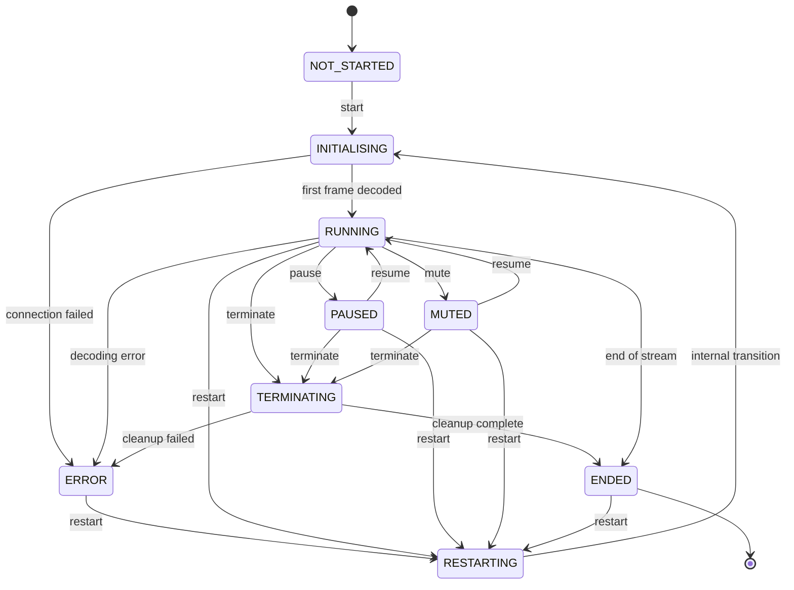
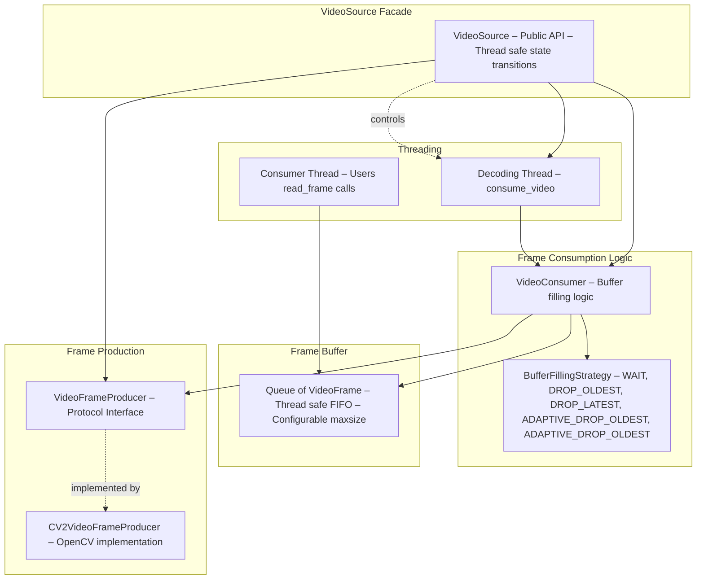
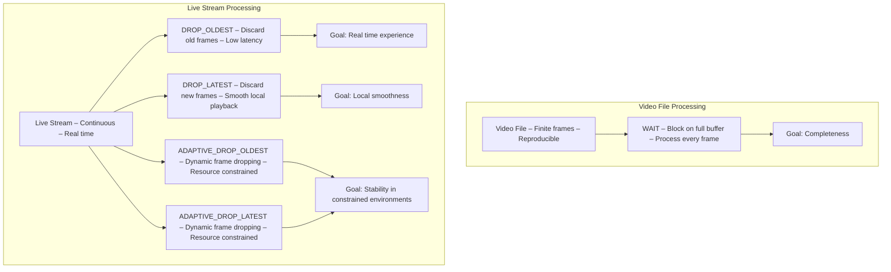
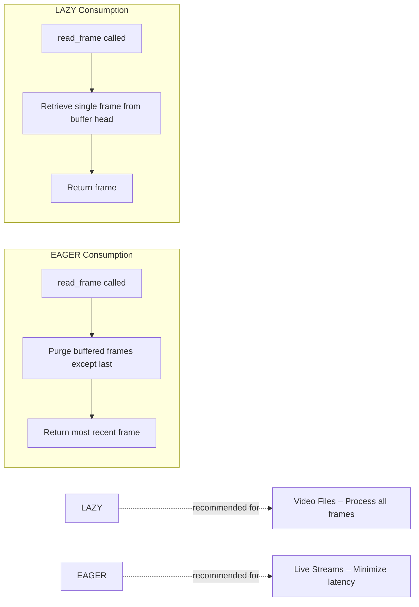
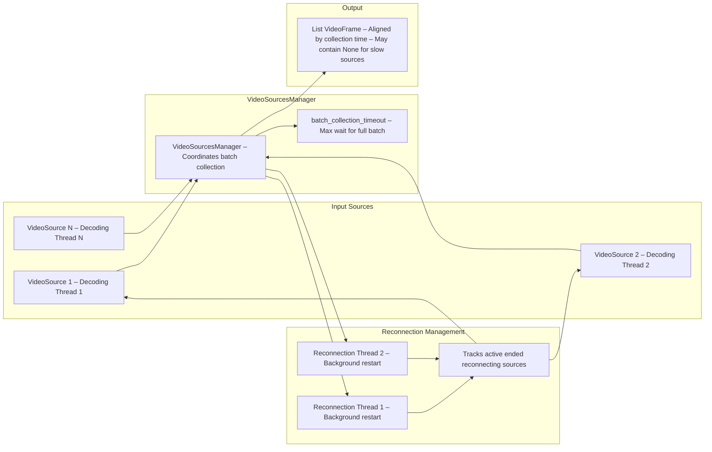
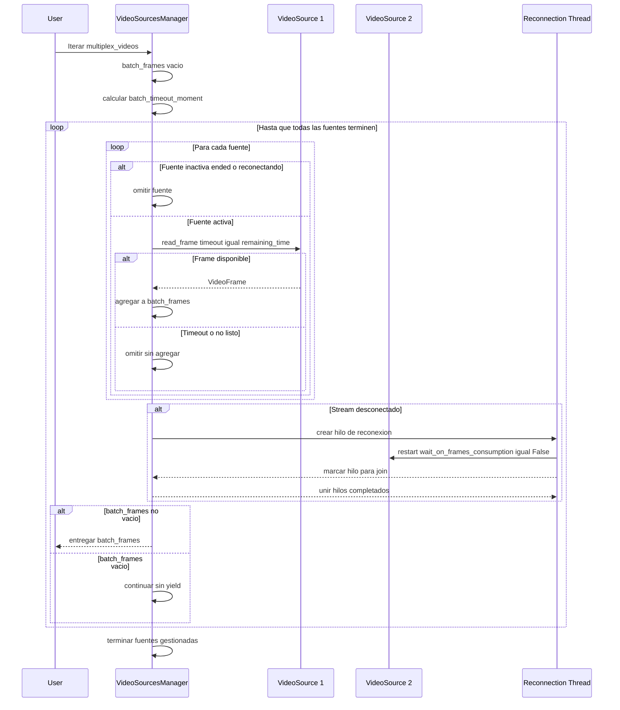
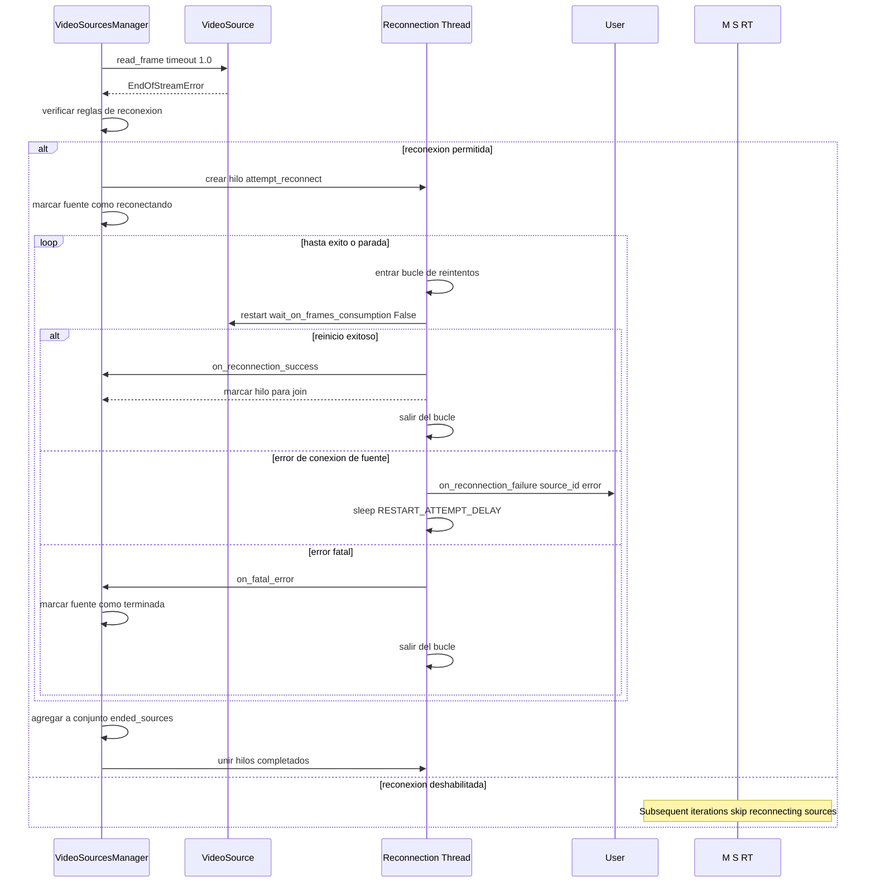
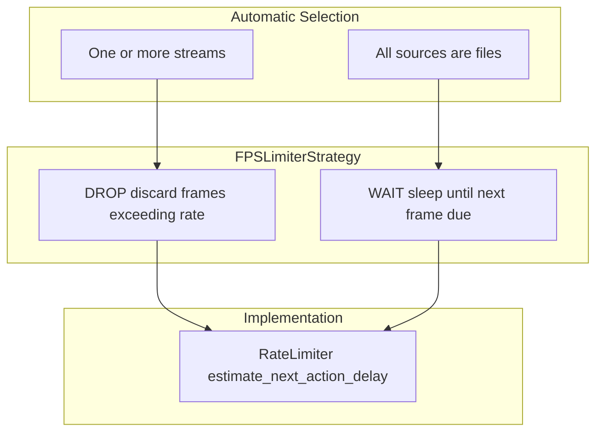

# Video Sources and Multiplexing

Relevant source files

- [development/__init__.py](https://github.com/roboflow/inference/blob/55f57676/development/__init__.py)
- [development/stream_interface/__init__.py](https://github.com/roboflow/inference/blob/55f57676/development/stream_interface/__init__.py)
- [development/stream_interface/camera_demo.py](https://github.com/roboflow/inference/blob/55f57676/development/stream_interface/camera_demo.py)
- [development/stream_interface/camera_test.py](https://github.com/roboflow/inference/blob/55f57676/development/stream_interface/camera_test.py)
- [development/stream_interface/multiplexer.py](https://github.com/roboflow/inference/blob/55f57676/development/stream_interface/multiplexer.py)
- [development/stream_interface/multiplexer_demo.py](https://github.com/roboflow/inference/blob/55f57676/development/stream_interface/multiplexer_demo.py)
- [development/stream_interface/old_camera_demo.py](https://github.com/roboflow/inference/blob/55f57676/development/stream_interface/old_camera_demo.py)
- [inference/core/interfaces/camera/utils.py](https://github.com/roboflow/inference/blob/55f57676/inference/core/interfaces/camera/utils.py)
- [inference/core/interfaces/camera/video_source.py](https://github.com/roboflow/inference/blob/55f57676/inference/core/interfaces/camera/video_source.py)
- [inference/core/interfaces/stream/entities.py](https://github.com/roboflow/inference/blob/55f57676/inference/core/interfaces/stream/entities.py)
- [inference/core/interfaces/stream/inference_pipeline.py](https://github.com/roboflow/inference/blob/55f57676/inference/core/interfaces/stream/inference_pipeline.py)
- [inference/core/interfaces/stream/sinks.py](https://github.com/roboflow/inference/blob/55f57676/inference/core/interfaces/stream/sinks.py)
- [inference/core/interfaces/stream/watchdog.py](https://github.com/roboflow/inference/blob/55f57676/inference/core/interfaces/stream/watchdog.py)
- [inference/core/utils/environment.py](https://github.com/roboflow/inference/blob/55f57676/inference/core/utils/environment.py)
- [tests/inference/unit_tests/core/interfaces/__init__.py](https://github.com/roboflow/inference/blob/55f57676/tests/inference/unit_tests/core/interfaces/__init__.py)
- [tests/inference/unit_tests/core/interfaces/camera/test_video_source.py](https://github.com/roboflow/inference/blob/55f57676/tests/inference/unit_tests/core/interfaces/camera/test_video_source.py)
- [tests/inference/unit_tests/core/interfaces/stream/test_interface_pipeline.py](https://github.com/roboflow/inference/blob/55f57676/tests/inference/unit_tests/core/interfaces/stream/test_interface_pipeline.py)
- [tests/inference/unit_tests/core/interfaces/stream/test_sinks.py](https://github.com/roboflow/inference/blob/55f57676/tests/inference/unit_tests/core/interfaces/stream/test_sinks.py)
- [tests/inference/unit_tests/core/interfaces/stream/test_watchdog.py](https://github.com/roboflow/inference/blob/55f57676/tests/inference/unit_tests/core/interfaces/stream/test_watchdog.py)
- [tests/inference/unit_tests/core/utils/test_environment.py](https://github.com/roboflow/inference/blob/55f57676/tests/inference/unit_tests/core/utils/test_environment.py)

This page documents the video source abstraction layer and multi-stream multiplexing capabilities in the inference pipeline. It covers the `VideoSource` class, buffer management strategies, and the `multiplex_videos` function that enables synchronized processing of multiple video streams.

For information about how video sources integrate with the inference pipeline and sink patterns, see [InferencePipeline](https://deepwiki.com/roboflow/inference/4.1-inferencepipeline). For details on the Stream Manager process that orchestrates multiple pipelines, see [Stream Manager](https://deepwiki.com/roboflow/inference/4.3-stream-manager).

## Purpose and Scope

The video source system provides a unified interface for consuming video from diverse sources (files, streams, cameras, WebRTC) with configurable buffering and frame-rate limiting. The multiplexing layer enables synchronized batch collection from multiple sources with timeout controls and automatic reconnection handling.

**Key responsibilities:**

- Abstract video decoding across file and stream sources
- Manage frame buffering with multiple strategies for different use cases
- Coordinate frame retrieval from multiple sources simultaneously
- Handle stream disconnections and automatic reconnection
- Support both offline (video files) and online (live streams) processing

## VideoSource Architecture

The `VideoSource` class ([video_source.py191-721](https://github.com/roboflow/inference/blob/55f57676/video_source.py#L191-L721)) provides a thread-safe abstraction over video inputs with a state machine governing lifecycle operations.

### State Machine




**State Definitions** ([video_source.py51-60](https://github.com/roboflow/inference/blob/55f57676/video_source.py#L51-L60)):

- `NOT_STARTED`: Initial state before `start()` is called
- `INITIALISING`: Connecting to source and decoding first frame
- `RUNNING`: Actively decoding and buffering frames
- `PAUSED`: Frame decoding suspended (buffer consumption halted)
- `MUTED`: Frame grabbing continues but decoding/buffering suspended (drops intermediate frames)
- `RESTARTING`: Internal transition state during reconnection
- `TERMINATING`: Cleanup in progress
- `ENDED`: Source consumption complete or terminated
- `ERROR`: Fatal error encountered

Sources: [inference/core/interfaces/camera/video_source.py51-86](https://github.com/roboflow/inference/blob/55f57676/inference/core/interfaces/camera/video_source.py#L51-L86) [inference/core/interfaces/camera/video_source.py191-721](https://github.com/roboflow/inference/blob/55f57676/inference/core/interfaces/camera/video_source.py#L191-L721)

### Component Architecture




**Key Classes:**

- **`VideoSource`** ([video_source.py191-721](https://github.com/roboflow/inference/blob/55f57676/video_source.py#L191-L721)): Main facade providing thread-safe state management and frame access
- **`VideoFrameProducer`** ([video_source.py28-30](https://github.com/roboflow/inference/blob/55f57676/video_source.py#L28-L30)): Protocol defining video decoding interface (`grab()`, `retrieve()`, `isOpened()`)
- **`CV2VideoFrameProducer`** ([video_source.py136-181](https://github.com/roboflow/inference/blob/55f57676/video_source.py#L136-L181)): OpenCV-based implementation supporting files, streams, and camera devices
- **`VideoConsumer`** ([video_source.py763-1124](https://github.com/roboflow/inference/blob/55f57676/video_source.py#L763-L1124)): Encapsulates frame consumption logic and buffer management

Sources: [inference/core/interfaces/camera/video_source.py28-181](https://github.com/roboflow/inference/blob/55f57676/inference/core/interfaces/camera/video_source.py#L28-L181) [inference/core/interfaces/camera/video_source.py191-721](https://github.com/roboflow/inference/blob/55f57676/inference/core/interfaces/camera/video_source.py#L191-L721) [inference/core/interfaces/camera/video_source.py763-1124](https://github.com/roboflow/inference/blob/55f57676/inference/core/interfaces/camera/video_source.py#L763-L1124)

### Video Frame Data Structure

Each decoded frame is wrapped in a `VideoFrame` dataclass ([entities.py52-60](https://github.com/roboflow/inference/blob/55f57676/entities.py#L52-L60)):

|Field|Type|Description|
|---|---|---|
|`image`|`np.ndarray`|Decoded frame as numpy array (H, W, C)|
|`frame_id`|`int`|Monotonically increasing frame identifier|
|`frame_timestamp`|`datetime`|Timestamp when frame was decoded|
|`source_id`|`Optional[int]`|Identifier for multi-source scenarios|

Sources: [inference/core/interfaces/camera/entities.py52-60](https://github.com/roboflow/inference/blob/55f57676/inference/core/interfaces/camera/entities.py#L52-L60)

## Buffer Management Strategies

The buffering system balances throughput, latency, and frame completeness through configurable strategies for buffer filling and consumption.

### Buffer Filling Strategies




**Strategy Definitions** ([video_source.py88-94](https://github.com/roboflow/inference/blob/55f57676/video_source.py#L88-L94)):

|Strategy|Behavior When Buffer Full|Use Case|
|---|---|---|
|`WAIT`|Block decoding until space available|Video files - ensure all frames processed|
|`DROP_OLDEST`|Remove oldest buffered frame|Live streams - minimize latency|
|`DROP_LATEST`|Discard newly decoded frame|Live streams - smooth local sections|
|`ADAPTIVE_DROP_OLDEST`|Dynamic dropping based on pace monitoring|Resource-constrained real-time processing|
|`ADAPTIVE_DROP_LATEST`|Dynamic dropping based on pace monitoring|Resource-constrained smooth playback|

Sources: [inference/core/interfaces/camera/video_source.py88-104](https://github.com/roboflow/inference/blob/55f57676/inference/core/interfaces/camera/video_source.py#L88-L104)

### Adaptive Mode Details

Adaptive strategies ([video_source.py96-99](https://github.com/roboflow/inference/blob/55f57676/video_source.py#L96-L99)) monitor both stream pace and consumption pace to intelligently drop frames when:

1. **Stream pace deviation**: Frame grabbing falls behind declared FPS by more than `adaptive_mode_stream_pace_tolerance` (default: 0.1)
2. **Reader pace deviation**: Consumer is slower than decoder by more than `adaptive_mode_reader_pace_tolerance` (default: 5.0)
3. **Consecutive drop limit**: Maximum `maximum_adaptive_frames_dropped_in_row` (default: 16) not exceeded

This prevents decoder thread from overwhelming slow consumers on resource-constrained hardware (e.g., Jetson devices with hi-res streams).

**Configuration** ([video_source.py200-203](https://github.com/roboflow/inference/blob/55f57676/video_source.py#L200-L203)):

```
VideoSource.init(
    adaptive_mode_stream_pace_tolerance=0.1,  # 10% tolerance
    adaptive_mode_reader_pace_tolerance=5.0,   # 5x slower reader
    maximum_adaptive_frames_dropped_in_row=16  # Max consecutive drops
)
```

Sources: [inference/core/interfaces/camera/video_source.py200-291](https://github.com/roboflow/inference/blob/55f57676/inference/core/interfaces/camera/video_source.py#L200-L291) [inference/core/interfaces/camera/video_source.py763-1124](https://github.com/roboflow/inference/blob/55f57676/inference/core/interfaces/camera/video_source.py#L763-L1124)

### Buffer Consumption Strategies



**Strategy Definitions** ([video_source.py106-109](https://github.com/roboflow/inference/blob/55f57676/video_source.py#L106-L109)):

|Strategy|Behavior|Typical Pairing|
|---|---|---|
|`LAZY`|Consume frames one-by-one from buffer|`WAIT` filling (video files)|
|`EAGER`|Purge buffer and return only most recent frame|`DROP_OLDEST` filling (live streams)|

The `get_from_queue()` utility ([video_source.py1174-1210](https://github.com/roboflow/inference/blob/55f57676/video_source.py#L1174-L1210)) implements the purging logic when `purge=True`.

Sources: [inference/core/interfaces/camera/video_source.py106-109](https://github.com/roboflow/inference/blob/55f57676/inference/core/interfaces/camera/video_source.py#L106-L109) [inference/core/interfaces/camera/video_source.py1174-1210](https://github.com/roboflow/inference/blob/55f57676/inference/core/interfaces/camera/video_source.py#L1174-L1210)

### Default Strategy Selection

`VideoSource` automatically selects strategies based on source type ([video_source.py659-666](https://github.com/roboflow/inference/blob/55f57676/video_source.py#L659-L666)):

```
# For video files
buffer_filling_strategy = BufferFillingStrategy.WAIT
buffer_consumption_strategy = BufferConsumptionStrategy.LAZY

# For live streams
buffer_filling_strategy = BufferFillingStrategy.ADAPTIVE_DROP_OLDEST
buffer_consumption_strategy = BufferConsumptionStrategy.EAGER
```

Sources: [inference/core/interfaces/camera/video_source.py618-666](https://github.com/roboflow/inference/blob/55f57676/inference/core/interfaces/camera/video_source.py#L618-L666)

## Multi-Source Video Processing

The `multiplex_videos()` function ([utils.py239-325](https://github.com/roboflow/inference/blob/55f57676/utils.py#L239-L325)) enables synchronized frame collection from multiple video sources with timeout controls and automatic reconnection.

### Multiplexing Architecture




**Key Components:**

- **`multiplex_videos()`** ([utils.py239-325](https://github.com/roboflow/inference/blob/55f57676/utils.py#L239-L325)): Main entry point that initializes sources and delegates to internal implementation
- **`VideoSourcesManager`** ([utils.py110-237](https://github.com/roboflow/inference/blob/55f57676/utils.py#L110-L237)): Manages batch collection loop, reconnection threads, and source lifecycle
- **`VideoSources`** dataclass ([utils.py40-43](https://github.com/roboflow/inference/blob/55f57676/utils.py#L40-L43)): Container holding all sources, managed sources, and reconnection rules

Sources: [inference/core/interfaces/camera/utils.py110-325](https://github.com/roboflow/inference/blob/55f57676/inference/core/interfaces/camera/utils.py#L110-L325)

### Batch Collection Algorithm




**Timeout Behavior** ([utils.py148-175](https://github.com/roboflow/inference/blob/55f57676/utils.py#L148-L175)):

- `batch_collection_timeout=None`: Infinite wait for frames from all sources
- `batch_collection_timeout=0.5`: Wait at most 0.5 seconds for batch to fill
- If timeout expires before all sources provide frames, yield partial batch (missing sources simply not included)

Sources: [inference/core/interfaces/camera/utils.py143-237](https://github.com/roboflow/inference/blob/55f57676/inference/core/interfaces/camera/utils.py#L143-L237)

### Reconnection Rules

The `_establish_sources_reconnection_rules()` function ([utils.py404-417](https://github.com/roboflow/inference/blob/55f57676/utils.py#L404-L417)) determines which sources should auto-reconnect:

|Source Type|`force_stream_reconnection`|Reconnection Enabled|
|---|---|---|
|Video file|Any value|❌ Never reconnect|
|Stream|`True`|✅ Auto-reconnect on disconnect|
|Stream|`False`|❌ Mark as ended on disconnect|

**Reconnection disabled by source** ([entities.py22-32](https://github.com/roboflow/inference/blob/55f57676/entities.py#L22-L32)):

- If `SourceProperties.is_reconnectable=False`, source will never reconnect regardless of type

Sources: [inference/core/interfaces/camera/utils.py404-417](https://github.com/roboflow/inference/blob/55f57676/inference/core/interfaces/camera/utils.py#L404-L417) [inference/core/interfaces/camera/entities.py22-32](https://github.com/roboflow/inference/blob/55f57676/inference/core/interfaces/camera/entities.py#L22-L32)

### Multi-Source Example

```
from inference.core.interfaces.camera.utils import multiplex_videos

# Process 3 streams simultaneously with 1-second batch timeout
for frames in multiplex_videos(
    videos=["rtsp://stream1", "rtsp://stream2", "/path/to/file.mp4"],
    batch_collection_timeout=1.0,  # 1 second max wait per batch
    force_stream_reconnection=True,
):
    # frames is List[VideoFrame] with 0-3 elements
    # Missing sources (slow, disconnected, ended) simply not included
    for frame in frames:
        print(f"Source {frame.source_id}, Frame {frame.frame_id}")
```

Sources: [inference/core/interfaces/camera/utils.py239-325](https://github.com/roboflow/inference/blob/55f57676/inference/core/interfaces/camera/utils.py#L239-L325)

## Stream Reconnection Mechanism

When a stream disconnects (raises `EndOfStreamError`), the multiplexing system handles reconnection in a background thread to avoid blocking batch collection.

### Reconnection Flow



**Key Configuration:**

- `RESTART_ATTEMPT_DELAY` ([env.py48](https://github.com/roboflow/inference/blob/55f57676/env.py#L48-L48)): Delay between reconnection attempts (default: 10 seconds)
- Reconnection runs in background - does not block other sources

Sources: [inference/core/interfaces/camera/utils.py420-446](https://github.com/roboflow/inference/blob/55f57676/inference/core/interfaces/camera/utils.py#L420-L446) [inference/core/env.py48](https://github.com/roboflow/inference/blob/55f57676/inference/core/env.py#L48-L48)

### Reconnection Thread Safety

The `VideoSourcesManager` ([utils.py110-237](https://github.com/roboflow/inference/blob/55f57676/utils.py#L110-L237)) maintains several state dictionaries to coordinate reconnection:

|State Dictionary|Purpose|
|---|---|
|`_reconnection_threads`|Active reconnection threads (source_ord → Thread)|
|`_enforce_stop`|Per-source stop signals (source_ord → bool)|
|`_ended_sources`|Set of source ordinals that have permanently ended|
|`_threads_to_join`|Set of source ordinals with completed reconnection threads|

**Thread lifecycle** ([utils.py201-231](https://github.com/roboflow/inference/blob/55f57676/utils.py#L201-L231)):

1. On `EndOfStreamError`, spawn thread calling `_attempt_reconnect()`
2. Thread registers itself for joining on success/fatal error
3. `join_all_reconnection_threads()` called after each batch collection
4. Completed threads are purged and removed from tracking

Sources: [inference/core/interfaces/camera/utils.py110-237](https://github.com/roboflow/inference/blob/55f57676/inference/core/interfaces/camera/utils.py#L110-L237)

### Source State Tracking

The `_is_source_inactive()` check ([utils.py188-192](https://github.com/roboflow/inference/blob/55f57676/utils.py#L188-L192)) determines whether to skip a source:

```
def _is_source_inactive(self, source_ord: int) -> bool:
    return (
        source_ord in self._ended_sources
        or source_ord in self._reconnection_threads
    )
```

Sources: [inference/core/interfaces/camera/utils.py188-237](https://github.com/roboflow/inference/blob/55f57676/inference/core/interfaces/camera/utils.py#L188-L237)

## Frame Rate Limiting

Both single-source and multi-source processing support FPS limiting via the `limit_frame_rate()` generator ([utils.py479-497](https://github.com/roboflow/inference/blob/55f57676/utils.py#L479-L497)).

### Rate Limiting Strategies



**Strategy selection logic** ([utils.py449-476](https://github.com/roboflow/inference/blob/55f57676/utils.py#L449-L476)):

- Explicitly provided strategy takes precedence
- If all sources are files: default to `WAIT` (process all frames)
- If any source is a stream: default to `DROP` (real-time experience)
- Mixed files and streams: `DROP` with warning logged

**Multi-source FPS calculation** ([utils.py317](https://github.com/roboflow/inference/blob/55f57676/utils.py#L317-L317)): `max_fps` is divided evenly across all sources:

```
max_fps = max_fps / len(videos)  # Per-source limit
```

Sources: [inference/core/interfaces/camera/utils.py46-98](https://github.com/roboflow/inference/blob/55f57676/inference/core/interfaces/camera/utils.py#L46-L98) [inference/core/interfaces/camera/utils.py449-497](https://github.com/roboflow/inference/blob/55f57676/inference/core/interfaces/camera/utils.py#L449-L497)

## Integration with InferencePipeline

The `InferencePipeline` ([inference_pipeline.py85-309](https://github.com/roboflow/inference/blob/55f57676/inference_pipeline.py#L85-L309)) uses `multiplex_videos()` internally when multiple video sources are provided.

**Initialization pattern** ([utils.py50-68](https://github.com/roboflow/inference/blob/55f57676/utils.py#L50-L68)):

```
# Single source - direct VideoSource iteration
video = VideoSource.init(video_reference="stream.mp4")
video.start()
for frame in video:
    process(frame)

# Multiple sources - multiplex_videos iteration  
for frames in multiplex_videos(
    videos=["stream1.mp4", "stream2.mp4"],
    batch_collection_timeout=0.5,
):
    for frame in frames:
        process(frame)
```

**Pipeline preparation** ([inference_pipeline.py597-615](https://github.com/roboflow/inference/blob/55f57676/inference_pipeline.py#L597-L615)): The `prepare_video_sources()` utility creates `VideoSource` instances from references (strings, ints) and wraps pre-initialized sources, maintaining consistent interface for both single and multi-source scenarios.

Sources: [inference/core/interfaces/stream/utils.py50-68](https://github.com/roboflow/inference/blob/55f57676/inference/core/interfaces/stream/utils.py#L50-L68) [inference/core/interfaces/stream/inference_pipeline.py597-615](https://github.com/roboflow/inference/blob/55f57676/inference/core/interfaces/stream/inference_pipeline.py#L597-L615)

## Configuration Summary

### Environment Variables

|Variable|Default|Purpose|
|---|---|---|
|`VIDEO_SOURCE_BUFFER_SIZE`|64|Size of frame decoding buffer|
|`VIDEO_SOURCE_ADAPTIVE_MODE_STREAM_PACE_TOLERANCE`|0.1|Stream pace deviation threshold (10%)|
|`VIDEO_SOURCE_ADAPTIVE_MODE_READER_PACE_TOLERANCE`|5.0|Consumer pace deviation threshold (5x)|
|`VIDEO_SOURCE_MINIMUM_ADAPTIVE_MODE_SAMPLES`|10|Samples needed before adaptive mode activates|
|`VIDEO_SOURCE_MAXIMUM_ADAPTIVE_FRAMES_DROPPED_IN_ROW`|16|Max consecutive frame drops in adaptive mode|
|`INFERENCE_PIPELINE_RESTART_ATTEMPT_DELAY`|10|Seconds between stream reconnection attempts|

Sources: [inference/core/env.py16-23](https://github.com/roboflow/inference/blob/55f57676/inference/core/env.py#L16-L23) [inference/core/env.py48](https://github.com/roboflow/inference/blob/55f57676/inference/core/env.py#L48-L48)

### Initialization Parameters

**`VideoSource.init()`** key parameters ([video_source.py193-318](https://github.com/roboflow/inference/blob/55f57676/video_source.py#L193-L318)):

- `video_reference`: File path, stream URL, camera device ID, or callable returning `VideoFrameProducer`
- `buffer_size`: Decoding buffer size (default: 64)
- `buffer_filling_strategy`: How to handle full buffer (auto-selected if None)
- `buffer_consumption_strategy`: How to consume frames (auto-selected if None)
- `video_source_properties`: OpenCV capture properties (`cv2.CAP_PROP_*`)
- `source_id`: Optional identifier for multi-source scenarios
- `desired_fps`: FPS limit applied during decoding

**`multiplex_videos()`** key parameters ([utils.py239-301](https://github.com/roboflow/inference/blob/55f57676/utils.py#L239-L301)):

- `videos`: List of sources (VideoSource instances, file paths, URLs, device IDs)
- `batch_collection_timeout`: Max wait time for batch (None = infinite)
- `force_stream_reconnection`: Enable auto-reconnection for streams (default: True)
- `should_stop`: External stop signal callable
- `on_reconnection_error`: Callback for reconnection failures

Sources: [inference/core/interfaces/camera/video_source.py193-340](https://github.com/roboflow/inference/blob/55f57676/inference/core/interfaces/camera/video_source.py#L193-L340) [inference/core/interfaces/camera/utils.py239-301](https://github.com/roboflow/inference/blob/55f57676/inference/core/interfaces/camera/utils.py#L239-L301)