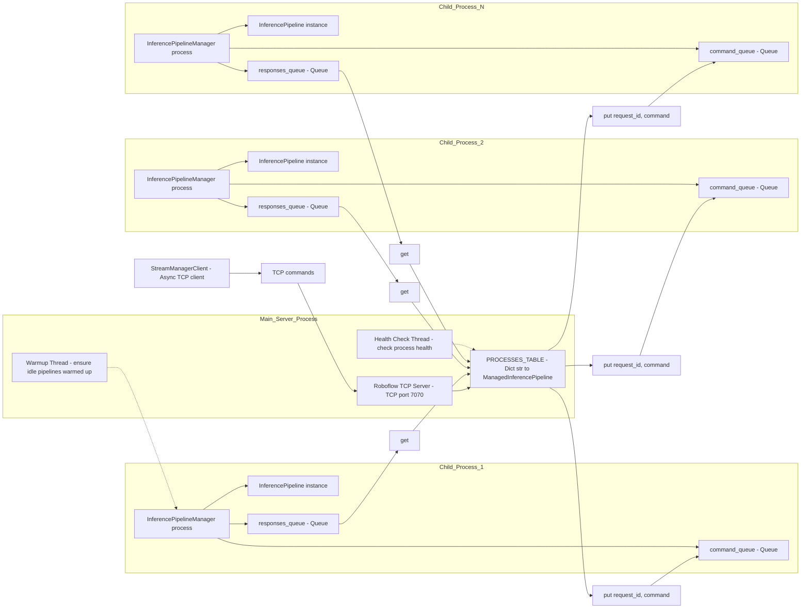
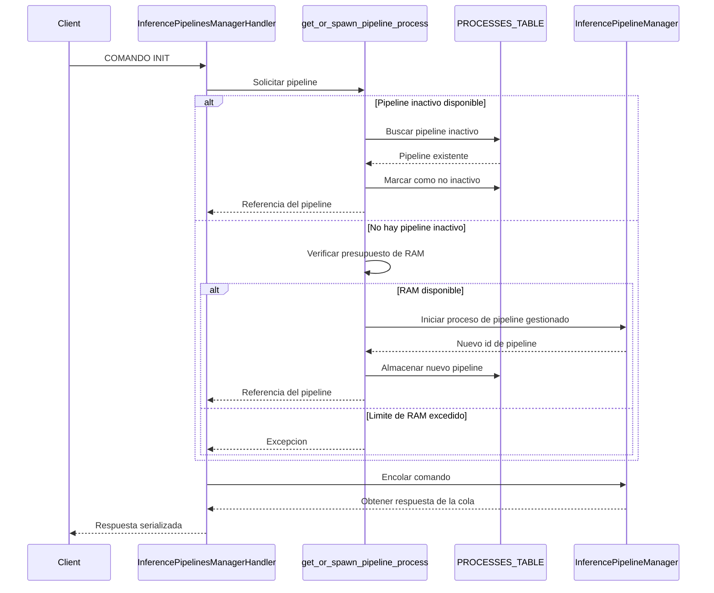
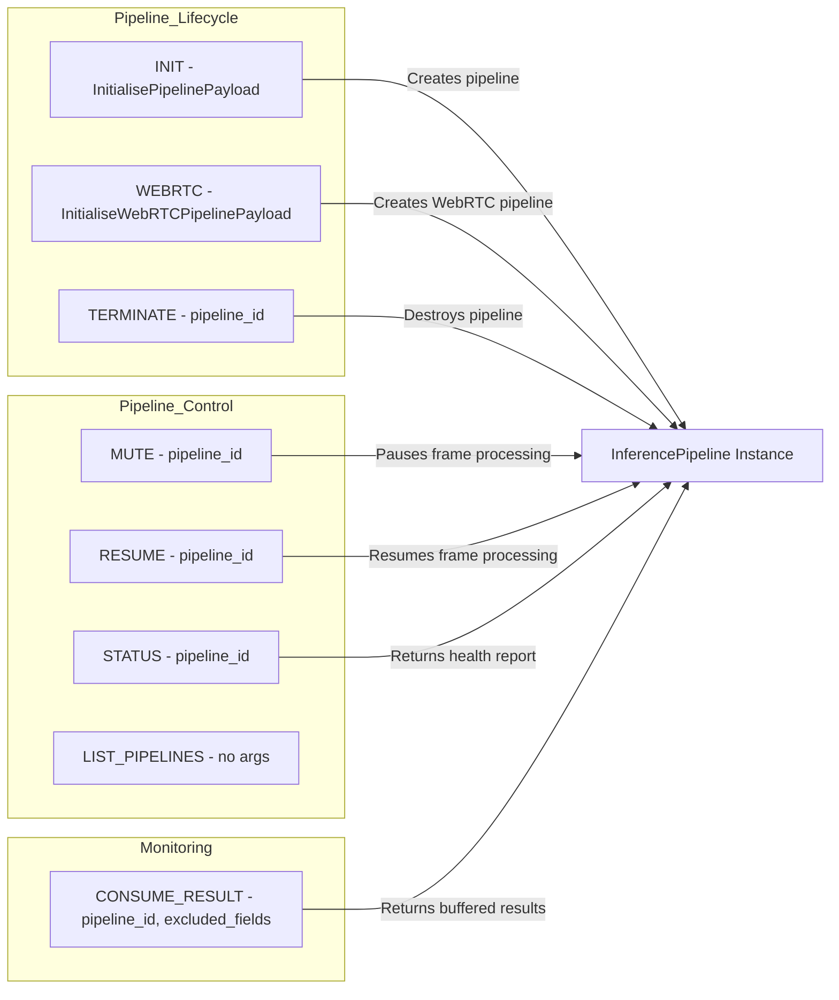
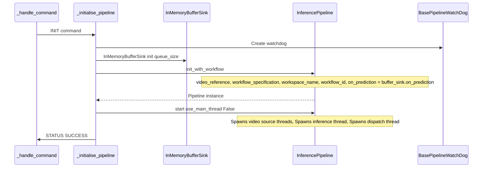
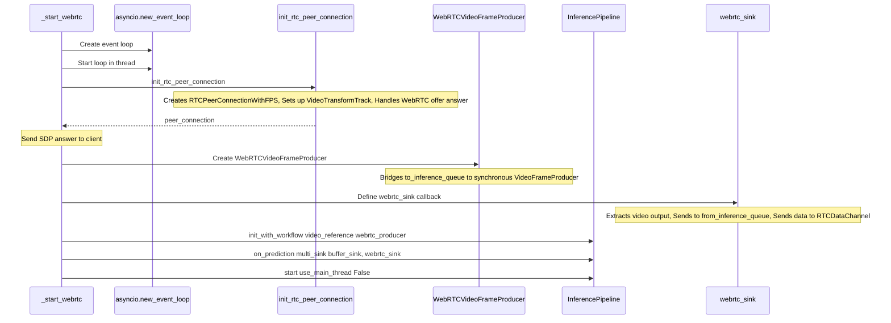

# Stream Manager

Relevant source files

- [development/stream_interface/multiplexer_inference_pipeline.py](https://github.com/roboflow/inference/blob/55f57676/development/stream_interface/multiplexer_inference_pipeline.py)
- [docker/config/cpu_http.py](https://github.com/roboflow/inference/blob/55f57676/docker/config/cpu_http.py)
- [docker/config/gpu_http.py](https://github.com/roboflow/inference/blob/55f57676/docker/config/gpu_http.py)
- [docker/config/lambda.py](https://github.com/roboflow/inference/blob/55f57676/docker/config/lambda.py)
- [inference/core/interfaces/camera/entities.py](https://github.com/roboflow/inference/blob/55f57676/inference/core/interfaces/camera/entities.py)
- [inference/core/interfaces/camera/exceptions.py](https://github.com/roboflow/inference/blob/55f57676/inference/core/interfaces/camera/exceptions.py)
- [inference/core/interfaces/stream/utils.py](https://github.com/roboflow/inference/blob/55f57676/inference/core/interfaces/stream/utils.py)
- [inference/core/interfaces/stream_manager/api/entities.py](https://github.com/roboflow/inference/blob/55f57676/inference/core/interfaces/stream_manager/api/entities.py)
- [inference/core/interfaces/stream_manager/api/errors.py](https://github.com/roboflow/inference/blob/55f57676/inference/core/interfaces/stream_manager/api/errors.py)
- [inference/core/interfaces/stream_manager/api/stream_manager_client.py](https://github.com/roboflow/inference/blob/55f57676/inference/core/interfaces/stream_manager/api/stream_manager_client.py)
- [inference/core/interfaces/stream_manager/manager_app/app.py](https://github.com/roboflow/inference/blob/55f57676/inference/core/interfaces/stream_manager/manager_app/app.py)
- [inference/core/interfaces/stream_manager/manager_app/communication.py](https://github.com/roboflow/inference/blob/55f57676/inference/core/interfaces/stream_manager/manager_app/communication.py)
- [inference/core/interfaces/stream_manager/manager_app/entities.py](https://github.com/roboflow/inference/blob/55f57676/inference/core/interfaces/stream_manager/manager_app/entities.py)
- [inference/core/interfaces/stream_manager/manager_app/errors.py](https://github.com/roboflow/inference/blob/55f57676/inference/core/interfaces/stream_manager/manager_app/errors.py)
- [inference/core/interfaces/stream_manager/manager_app/inference_pipeline_manager.py](https://github.com/roboflow/inference/blob/55f57676/inference/core/interfaces/stream_manager/manager_app/inference_pipeline_manager.py)
- [inference/core/interfaces/stream_manager/manager_app/serialisation.py](https://github.com/roboflow/inference/blob/55f57676/inference/core/interfaces/stream_manager/manager_app/serialisation.py)
- [inference/core/interfaces/stream_manager/manager_app/webrtc.py](https://github.com/roboflow/inference/blob/55f57676/inference/core/interfaces/stream_manager/manager_app/webrtc.py)
- [inference/core/utils/async_utils.py](https://github.com/roboflow/inference/blob/55f57676/inference/core/utils/async_utils.py)
- [inference/core/utils/drawing.py](https://github.com/roboflow/inference/blob/55f57676/inference/core/utils/drawing.py)
- [inference/enterprise/stream_management/manager/entities.py](https://github.com/roboflow/inference/blob/55f57676/inference/enterprise/stream_management/manager/entities.py)

## Purpose and Scope

The Stream Manager is a multi-process orchestration system for managing concurrent video stream processing pipelines. It operates as a standalone TCP server that spawns and controls multiple `InferencePipeline` instances in isolated child processes, enabling safe concurrent execution of video inference workflows with resource monitoring and automatic lifecycle management.

For information about the `InferencePipeline` class itself, see [InferencePipeline](https://deepwiki.com/roboflow/inference/4.1-inferencepipeline). For details on video sources and multiplexing, see [Video Sources and Multiplexing](https://deepwiki.com/roboflow/inference/4.2-video-sources-and-multiplexing). For WebRTC video streaming capabilities, see [WebRTC Integration](https://deepwiki.com/roboflow/inference/4.4-webrtc-integration).

Sources: [inference/core/interfaces/stream_manager/manager_app/app.py1-587](https://github.com/roboflow/inference/blob/55f57676/inference/core/interfaces/stream_manager/manager_app/app.py#L1-L587) [inference/core/interfaces/stream_manager/manager_app/inference_pipeline_manager.py1-653](https://github.com/roboflow/inference/blob/55f57676/inference/core/interfaces/stream_manager/manager_app/inference_pipeline_manager.py#L1-L653)

## System Architecture

The Stream Manager implements a three-tier process architecture:




**Main Server Process**: Runs a TCP server on port 7070 (configurable via `STREAM_MANAGER_PORT`). Maintains `PROCESSES_TABLE` mapping pipeline IDs to `ManagedInferencePipeline` instances. Two daemon threads continuously monitor process health and maintain a pool of idle processes.

**Child Processes**: Each `InferencePipelineManager` runs in a separate process and manages a single `InferencePipeline` instance. Communication occurs via multiprocessing `Queue` objects for commands and responses.

**Client API**: The `StreamManagerClient` provides async methods for sending commands over TCP and receiving responses.

Sources: [inference/core/interfaces/stream_manager/manager_app/app.py59-78](https://github.com/roboflow/inference/blob/55f57676/inference/core/interfaces/stream_manager/manager_app/app.py#L59-L78) [inference/core/interfaces/stream_manager/manager_app/app.py552-583](https://github.com/roboflow/inference/blob/55f57676/inference/core/interfaces/stream_manager/manager_app/app.py#L552-L583) [inference/core/interfaces/stream_manager/api/stream_manager_client.py60-91](https://github.com/roboflow/inference/blob/55f57676/inference/core/interfaces/stream_manager/api/stream_manager_client.py#L60-L91)

## Multi-Process Architecture

### ManagedInferencePipeline Structure

```
@dataclass
class ManagedInferencePipeline:
    pipeline_id: str
    pipeline_manager: InferencePipelineManager
    command_queue: Queue
    responses_queue: Queue
    operation_lock: Lock
    is_idle: bool
    ram_usage_queue: Deque
    is_terminating: bool = False
```

Each managed pipeline encapsulates:

|Field|Purpose|
|---|---|
|`pipeline_id`|UUID assigned at spawn time|
|`pipeline_manager`|Child `Process` instance running `InferencePipelineManager`|
|`command_queue`|Multiprocessing queue for sending commands to child|
|`responses_queue`|Multiprocessing queue for receiving responses from child|
|`operation_lock`|Thread lock preventing concurrent command execution|
|`is_idle`|Flag indicating pipeline has no active work (available for reuse)|
|`ram_usage_queue`|Rolling window of recent RAM measurements (size: 10)|
|`is_terminating`|Flag to prevent health check interference during shutdown|

Sources: [inference/core/interfaces/stream_manager/manager_app/app.py60-74](https://github.com/roboflow/inference/blob/55f57676/inference/core/interfaces/stream_manager/manager_app/app.py#L60-L74)

### Process Spawning Strategy



The spawning logic implements a pool pattern with RAM-based budgeting:

1. **Idle Pipeline Reuse**: If `get_idle_pipelines_id()` returns any pipeline IDs, the first one is reused by setting `is_idle = False`
2. **RAM Budget Check**: Calculates current RAM usage plus highest observed pipeline RAM usage. Spawning is blocked if this exceeds `STREAM_MANAGER_MAX_RAM_MB`
3. **Process Creation**: Calls `spawn_managed_pipeline_process()` which creates `Queue` objects, initializes `InferencePipelineManager`, and starts the process
4. **Warmup Thread**: Continuously ensures at least `STREAM_API_PRELOADED_PROCESSES` idle pipelines exist for low-latency startup

Sources: [inference/core/interfaces/stream_manager/manager_app/app.py443-493](https://github.com/roboflow/inference/blob/55f57676/inference/core/interfaces/stream_manager/manager_app/app.py#L443-L493) [inference/core/interfaces/stream_manager/manager_app/app.py495-502](https://github.com/roboflow/inference/blob/55f57676/inference/core/interfaces/stream_manager/manager_app/app.py#L495-L502) [inference/core/interfaces/stream_manager/manager_app/app.py514-543](https://github.com/roboflow/inference/blob/55f57676/inference/core/interfaces/stream_manager/manager_app/app.py#L514-L543)

## TCP Control Interface

### Protocol Specification

The Stream Manager implements a length-prefixed binary protocol over TCP:

```
Message Format:
┌─────────────────┬──────────────────────────┐
│  Header (4B)    │   JSON Payload (N bytes) │
│  Big-endian     │   UTF-8 encoded          │
│  payload size   │                          │
└─────────────────┴──────────────────────────┘
```

**Sending**: [inference/core/interfaces/stream_manager/manager_app/communication.py51-84](https://github.com/roboflow/inference/blob/55f57676/inference/core/interfaces/stream_manager/manager_app/communication.py#L51-L84)

1. Serialize command dict to UTF-8 JSON
2. Encode payload size as 4-byte big-endian integer
3. Concatenate header + payload
4. Call `socket.sendall()`

**Receiving**: [inference/core/interfaces/stream_manager/manager_app/communication.py17-49](https://github.com/roboflow/inference/blob/55f57676/inference/core/interfaces/stream_manager/manager_app/communication.py#L17-L49)

1. Read 4-byte header
2. Decode payload size
3. Read chunks until full payload received
4. Deserialize JSON

Sources: [inference/core/interfaces/stream_manager/manager_app/communication.py1-84](https://github.com/roboflow/inference/blob/55f57676/inference/core/interfaces/stream_manager/manager_app/communication.py#L1-L84)

### Command Types



All commands include a `TYPE_KEY` field with a `CommandType` enum value. Commands targeting existing pipelines include a `PIPELINE_ID_KEY` field.

Sources: [inference/core/interfaces/stream_manager/manager_app/entities.py43-52](https://github.com/roboflow/inference/blob/55f57676/inference/core/interfaces/stream_manager/manager_app/entities.py#L43-L52) [inference/core/interfaces/stream_manager/manager_app/app.py96-167](https://github.com/roboflow/inference/blob/55f57676/inference/core/interfaces/stream_manager/manager_app/app.py#L96-L167)

### Request Handler Flow

The `InferencePipelinesManagerHandler` class extends `BaseRequestHandler` to process incoming TCP connections:

```
class InferencePipelinesManagerHandler(BaseRequestHandler):
    def handle(self) -> None:
        data = receive_socket_data(source=self.request, ...)
        data[TYPE_KEY] = CommandType(data[TYPE_KEY])
        
        if data[TYPE_KEY] is CommandType.LIST_PIPELINES:
            return self._list_pipelines(request_id=request_id)
        if data[TYPE_KEY] is CommandType.INIT:
            return self._initialise_pipeline(request_id=request_id, command=data)
        if data[TYPE_KEY] is CommandType.WEBRTC:
            return self._start_webrtc(request_id=request_id, command=data)
        
        pipeline_id = data[PIPELINE_ID_KEY]
        if data[TYPE_KEY] is CommandType.TERMINATE:
            self._terminate_pipeline(request_id, pipeline_id, command=data)
        else:
            response = handle_command(processes_table, request_id, pipeline_id, command=data)
            # Send response back over socket
```

For most commands, `handle_command()` acquires the pipeline's `operation_lock`, puts the command on `command_queue`, and blocks waiting for a response on `responses_queue`. The lock ensures serial command execution per pipeline.

Sources: [inference/core/interfaces/stream_manager/manager_app/app.py85-167](https://github.com/roboflow/inference/blob/55f57676/inference/core/interfaces/stream_manager/manager_app/app.py#L85-L167) [inference/core/interfaces/stream_manager/manager_app/app.py275-294](https://github.com/roboflow/inference/blob/55f57676/inference/core/interfaces/stream_manager/manager_app/app.py#L275-L294)

## Pipeline Lifecycle Management

### InferencePipelineManager Run Loop

Each child process runs this event loop:

```
def run(self) -> None:
    signal.signal(signal.SIGINT, ignore_signal)
    signal.signal(signal.SIGTERM, self._handle_termination_signal)
    
    while not self._stop:
        self._check_pipeline_timeout()
        
        try:
            command: Optional[Tuple[str, dict]] = self._command_queue.get(timeout=1)
        except Empty:
            continue
        
        if command is None:
            break
        
        request_id, payload = command
        self._handle_command(request_id=request_id, payload=payload)
```

**Signal Handling**: `SIGINT` is ignored (allows graceful parent shutdown), `SIGTERM` triggers `_execute_termination()` which calls `terminate()` and `join()` on the `InferencePipeline`.

**Timeout Monitoring**: `_check_pipeline_timeout()` terminates the pipeline if no results have been consumed for `consumption_timeout` seconds (configured in `InitialisePipelinePayload`).

**Command Handling**: Dispatches to handler methods based on `CommandType`.

Sources: [inference/core/interfaces/stream_manager/manager_app/inference_pipeline_manager.py64-69](https://github.com/roboflow/inference/blob/55f57676/inference/core/interfaces/stream_manager/manager_app/inference_pipeline_manager.py#L64-L69) [inference/core/interfaces/stream_manager/manager_app/inference_pipeline_manager.py98-113](https://github.com/roboflow/inference/blob/55f57676/inference/core/interfaces/stream_manager/manager_app/inference_pipeline_manager.py#L98-L113) [inference/core/interfaces/stream_manager/manager_app/inference_pipeline_manager.py114-132](https://github.com/roboflow/inference/blob/55f57676/inference/core/interfaces/stream_manager/manager_app/inference_pipeline_manager.py#L114-L132)

### Pipeline Initialization



Key initialization parameters from `InitialisePipelinePayload`:

|Parameter|Purpose|
|---|---|
|`video_configuration.video_reference`|Video source identifier(s)|
|`processing_configuration.workflow_specification`|Workflow JSON definition|
|`processing_configuration.workspace_name`|Roboflow workspace|
|`processing_configuration.workflow_id`|Alternative to inline spec|
|`sink_configuration.results_buffer_size`|`InMemoryBufferSink` queue capacity|
|`consumption_timeout`|Seconds before auto-termination if no consumption|
|`predictions_queue_size`|Internal inference results queue size|
|`decoding_buffer_size`|Video source frame buffer size|

The `InMemoryBufferSink` is initialized with a bounded queue. The `on_prediction` callback from `InferencePipeline` pushes results into this queue, which are later retrieved via `CONSUME_RESULT` commands.

Sources: [inference/core/interfaces/stream_manager/manager_app/inference_pipeline_manager.py177-248](https://github.com/roboflow/inference/blob/55f57676/inference/core/interfaces/stream_manager/manager_app/inference_pipeline_manager.py#L177-L248) [inference/core/interfaces/stream_manager/manager_app/entities.py85-95](https://github.com/roboflow/inference/blob/55f57676/inference/core/interfaces/stream_manager/manager_app/entities.py#L85-L95)

### WebRTC Pipeline Initialization

WebRTC pipelines follow a more complex initialization sequence:



The WebRTC flow requires two `SyncAsyncQueue` instances to bridge async WebRTC (aiortc) with synchronous `InferencePipeline`:

- **to_inference_queue**: Async WebRTC track receives frames → sync `WebRTCVideoFrameProducer` retrieves them
- **from_inference_queue**: Sync `webrtc_sink` pushes results → async `VideoTransformTrack.recv()` retrieves them

The `webrtc_sink` callback extracts visualizations from workflow outputs and sends them over the WebRTC video track, while also sending JSON metadata over an `RTCDataChannel` if configured.

Sources: [inference/core/interfaces/stream_manager/manager_app/inference_pipeline_manager.py249-478](https://github.com/roboflow/inference/blob/55f57676/inference/core/interfaces/stream_manager/manager_app/inference_pipeline_manager.py#L249-L478) [inference/core/interfaces/stream_manager/manager_app/webrtc.py378-482](https://github.com/roboflow/inference/blob/55f57676/inference/core/interfaces/stream_manager/manager_app/webrtc.py#L378-L482)

## Health Monitoring and Resource Management

### Health Check Thread

The `check_process_health()` function runs continuously in a daemon thread:

```
def check_process_health() -> None:
    while True:
        total_ram_usage: int = _get_current_process_ram_usage_mb()
        with PROCESSES_TABLE_LOCK:
            for pipeline_id, managed_pipeline in list(PROCESSES_TABLE.items()):
                process = managed_pipeline.pipeline_manager
                process_ram_usage_mb = _get_process_memory_usage_mb(process=process)
                managed_pipeline.ram_usage_queue.append(process_ram_usage_mb)
                
                if managed_pipeline.is_terminating:
                    continue
                
                if not process.is_alive():
                    # Terminate and remove dead process
                    process.terminate()
                    process.join()
                    del PROCESSES_TABLE[pipeline_id]
                    continue
                
                # Check if all sources have ended
                response = handle_command(..., command={TYPE: STATUS, ...})
                all_sources_statues = set(...)
                if all_sources_statues.issubset({StreamState.ENDED, StreamState.ERROR}):
                    # Auto-terminate completed pipeline
                    handle_command(..., command={TYPE: TERMINATE, ...})
                    process.join()
                    del PROCESSES_TABLE[pipeline_id]
        
        time.sleep(1)
```

**Liveness Detection**: Checks `process.is_alive()` and terminates dead processes.

**RAM Tracking**: Uses `psutil.Process(pid).memory_info().rss` to measure memory, appending to a bounded deque for trend analysis.

**Automatic Cleanup**: Sends `STATUS` commands to active pipelines. If all video sources are in `ENDED` or `ERROR` states, sends `TERMINATE` and removes the pipeline.

**Termination Lock**: The `is_terminating` flag prevents the health check from interfering with explicit `TERMINATE` commands.

Sources: [inference/core/interfaces/stream_manager/manager_app/app.py334-436](https://github.com/roboflow/inference/blob/55f57676/inference/core/interfaces/stream_manager/manager_app/app.py#L334-L436)

### RAM Budget Enforcement

When spawning new pipelines, `get_or_spawn_pipeline_process()` calculates projected RAM usage:

```
current_ram_usage = (
    sum(managed_pipeline.ram_usage_queue[-1] for managed_pipeline in processes_table.values())
    + _get_current_process_ram_usage_mb()
)

highest_pipeline_ram_usage = max(
    max(managed_pipeline.ram_usage_queue) for managed_pipeline in processes_table.values()
)

if (
    STREAM_MANAGER_MAX_RAM_MB is not None
    and current_ram_usage + highest_pipeline_ram_usage > STREAM_MANAGER_MAX_RAM_MB
):
    raise Exception("Cannot spawn new pipeline due to insufficient RAM")
```

This pessimistically assumes the new pipeline will consume as much RAM as the largest observed pipeline, preventing spawn if the limit would be exceeded.

Environment variables:

- `STREAM_MANAGER_MAX_RAM_MB`: Maximum total RAM in megabytes
- `STREAM_MANAGER_RAM_USAGE_QUEUE_SIZE`: Size of rolling window for RAM measurements (default: 10)

Sources: [inference/core/interfaces/stream_manager/manager_app/app.py453-487](https://github.com/roboflow/inference/blob/55f57676/inference/core/interfaces/stream_manager/manager_app/app.py#L453-L487) [inference/core/env.py](https://github.com/roboflow/inference/blob/55f57676/inference/core/env.py)

### Idle Pipeline Pool

The warmup thread maintains pre-spawned idle pipelines:

```
def ensure_idle_pipelines_warmed_up(expected_warmed_up_pipelines: int) -> None:
    while True:
        with PROCESSES_TABLE_LOCK:
            idle_pipelines = len(get_idle_pipelines_id(processes_table=PROCESSES_TABLE))
            if idle_pipelines < expected_warmed_up_pipelines:
                _ = spawn_managed_pipeline_process(
                    processes_table=PROCESSES_TABLE,
                    mark_as_idle=True
                )
        time.sleep(5)
```

Configured via `STREAM_API_PRELOADED_PROCESSES` environment variable. Idle pipelines have `is_idle=True` and can be reused for subsequent `INIT` or `WEBRTC` commands without spawning overhead.

Sources: [inference/core/interfaces/stream_manager/manager_app/app.py495-502](https://github.com/roboflow/inference/blob/55f57676/inference/core/interfaces/stream_manager/manager_app/app.py#L495-L502)

## Command Handling Reference

### INIT Command

**Payload**: `InitialisePipelinePayload`

**Handler**: `InferencePipelineManager._initialise_pipeline()`

**Response**: `{STATUS: SUCCESS}` or error with `ErrorType`

Creates a new `InferencePipeline` with workflow execution. Returns immediately after calling `start(use_main_thread=False)`.

Sources: [inference/core/interfaces/stream_manager/manager_app/inference_pipeline_manager.py177-248](https://github.com/roboflow/inference/blob/55f57676/inference/core/interfaces/stream_manager/manager_app/inference_pipeline_manager.py#L177-L248)

### WEBRTC Command

**Payload**: `InitialiseWebRTCPipelinePayload` (extends `InitialisePipelinePayload`)

**Handler**: `InferencePipelineManager._start_webrtc()`

**Response**: `{STATUS: SUCCESS, sdp: str, type: str}` containing WebRTC answer

Creates a WebRTC-enabled pipeline with bidirectional video streaming. The `webrtc_offer` field contains the client's SDP offer. Response includes the server's SDP answer for establishing the peer connection.

Sources: [inference/core/interfaces/stream_manager/manager_app/inference_pipeline_manager.py249-478](https://github.com/roboflow/inference/blob/55f57676/inference/core/interfaces/stream_manager/manager_app/inference_pipeline_manager.py#L249-L478) [inference/core/interfaces/stream_manager/manager_app/entities.py108-124](https://github.com/roboflow/inference/blob/55f57676/inference/core/interfaces/stream_manager/manager_app/entities.py#L108-L124)

### TERMINATE Command

**Handler**: `InferencePipelineManager._terminate_pipeline()`

**Response**: `{STATUS: SUCCESS}`

Calls `terminate()` and `join()` on the `InferencePipeline`. The main server's handler then joins the `InferencePipelineManager` process and removes it from `PROCESSES_TABLE`.

Sources: [inference/core/interfaces/stream_manager/manager_app/inference_pipeline_manager.py479-499](https://github.com/roboflow/inference/blob/55f57676/inference/core/interfaces/stream_manager/manager_app/inference_pipeline_manager.py#L479-L499) [inference/core/interfaces/stream_manager/manager_app/app.py231-272](https://github.com/roboflow/inference/blob/55f57676/inference/core/interfaces/stream_manager/manager_app/app.py#L231-L272)

### MUTE Command

**Handler**: `InferencePipelineManager._mute_pipeline()`

**Response**: `{STATUS: SUCCESS}`

Calls `mute_stream()` on the `InferencePipeline`, pausing frame consumption without destroying the pipeline.

Sources: [inference/core/interfaces/stream_manager/manager_app/inference_pipeline_manager.py516-536](https://github.com/roboflow/inference/blob/55f57676/inference/core/interfaces/stream_manager/manager_app/inference_pipeline_manager.py#L516-L536)

### RESUME Command

**Handler**: `InferencePipelineManager._resume_pipeline()`

**Response**: `{STATUS: SUCCESS}`

Calls `resume_stream()` on the `InferencePipeline`, resuming frame consumption after muting.

Sources: [inference/core/interfaces/stream_manager/manager_app/inference_pipeline_manager.py537-557](https://github.com/roboflow/inference/blob/55f57676/inference/core/interfaces/stream_manager/manager_app/inference_pipeline_manager.py#L537-L557)

### STATUS Command

**Handler**: `InferencePipelineManager._get_pipeline_status()`

**Response**: `{STATUS: SUCCESS, report: dict}`

Returns the watchdog's status report containing source metadata, FPS measurements, and status updates.

Sources: [inference/core/interfaces/stream_manager/manager_app/inference_pipeline_manager.py558-587](https://github.com/roboflow/inference/blob/55f57676/inference/core/interfaces/stream_manager/manager_app/inference_pipeline_manager.py#L558-L587)

### CONSUME_RESULT Command

**Payload**: `{excluded_fields: List[str]}`

**Handler**: `InferencePipelineManager._consume_results()`

**Response**: `{STATUS: SUCCESS, outputs: List[dict], frames_metadata: List[dict]}`

Drains the `InMemoryBufferSink` queue, returning all buffered workflow outputs and associated frame metadata. Updates `_last_consume_time` to reset the consumption timeout.

Sources: [inference/core/interfaces/stream_manager/manager_app/inference_pipeline_manager.py588-637](https://github.com/roboflow/inference/blob/55f57676/inference/core/interfaces/stream_manager/manager_app/inference_pipeline_manager.py#L588-L637)

### LIST_PIPELINES Command

**Handler**: `InferencePipelinesManagerHandler._list_pipelines()`

**Response**: `{STATUS: SUCCESS, pipelines: List[str]}`

Returns a list of all active pipeline IDs (excludes idle pipelines).

Sources: [inference/core/interfaces/stream_manager/manager_app/app.py169-186](https://github.com/roboflow/inference/blob/55f57676/inference/core/interfaces/stream_manager/manager_app/app.py#L169-L186)

## Client API

The `StreamManagerClient` provides an async Python interface for interacting with the Stream Manager:

```
client = StreamManagerClient.init(
    host="127.0.0.1",
    port=7070,
    operations_timeout=30.0
)

# List active pipelines
response = await client.list_pipelines()

# Initialize a pipeline
payload = InitialisePipelinePayload(
    video_configuration=VideoConfiguration(...),
    processing_configuration=WorkflowConfiguration(...),
)
response = await client.initialise_pipeline(payload)
pipeline_id = response.context.pipeline_id

# Get status
status = await client.get_status(pipeline_id)

# Consume results
results = await client.consume_pipeline_result(
    pipeline_id=pipeline_id,
    excluded_fields=["image"]
)

# Terminate
await client.terminate_pipeline(pipeline_id)
```

All methods return typed response objects (`CommandResponse`, `InferencePipelineStatusResponse`, etc.) with `status` and `context` fields. Errors are raised as exceptions (`ProcessesManagerInternalError`, `ProcessesManagerNotFoundError`, etc.) based on the `ERROR_TYPE_KEY` in the response.

Sources: [inference/core/interfaces/stream_manager/api/stream_manager_client.py60-215](https://github.com/roboflow/inference/blob/55f57676/inference/core/interfaces/stream_manager/api/stream_manager_client.py#L60-L215) [inference/core/interfaces/stream_manager/api/entities.py1-43](https://github.com/roboflow/inference/blob/55f57676/inference/core/interfaces/stream_manager/api/entities.py#L1-L43)

## Deployment Integration

The Stream Manager is conditionally spawned when the HTTP server starts, if `ENABLE_STREAM_API` environment variable is set:

```
# docker/config/cpu_http.py
if ENABLE_STREAM_API:
    stream_manager_process = Process(
        target=partial(start, expected_warmed_up_pipelines=STREAM_API_PRELOADED_PROCESSES),
    )
    stream_manager_process.start()
```

On GPU deployments, a "spawn" multiprocessing context is explicitly set to avoid CUDA initialization issues in forked processes:

```
# docker/config/gpu_http.py
if ENABLE_STREAM_API:
    multiprocessing_context = multiprocessing.get_context(method="spawn")
    stream_manager_process = multiprocessing_context.Process(
        target=partial(start, expected_warmed_up_pipelines=STREAM_API_PRELOADED_PROCESSES),
    )
    stream_manager_process.start()
```

The Stream Manager runs independently of the HTTP API server, communicating only via TCP. This isolation allows the HTTP server to restart without disrupting active video pipelines.

Sources: [docker/config/cpu_http.py26-30](https://github.com/roboflow/inference/blob/55f57676/docker/config/cpu_http.py#L26-L30) [docker/config/gpu_http.py25-30](https://github.com/roboflow/inference/blob/55f57676/docker/config/gpu_http.py#L25-L30)