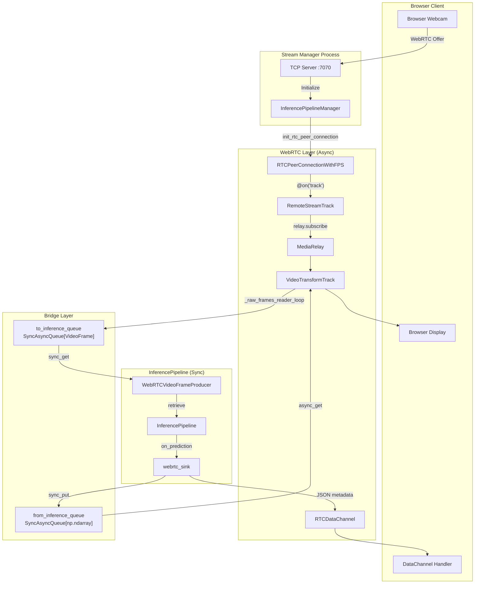
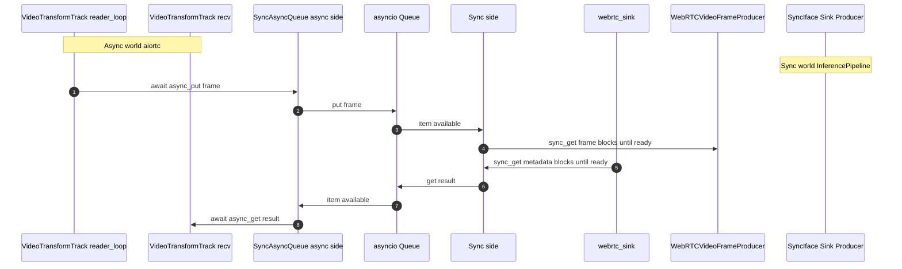
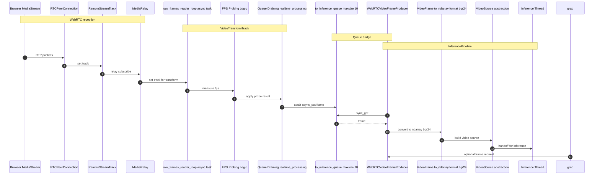
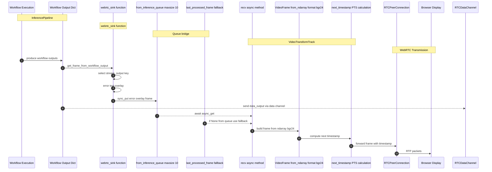
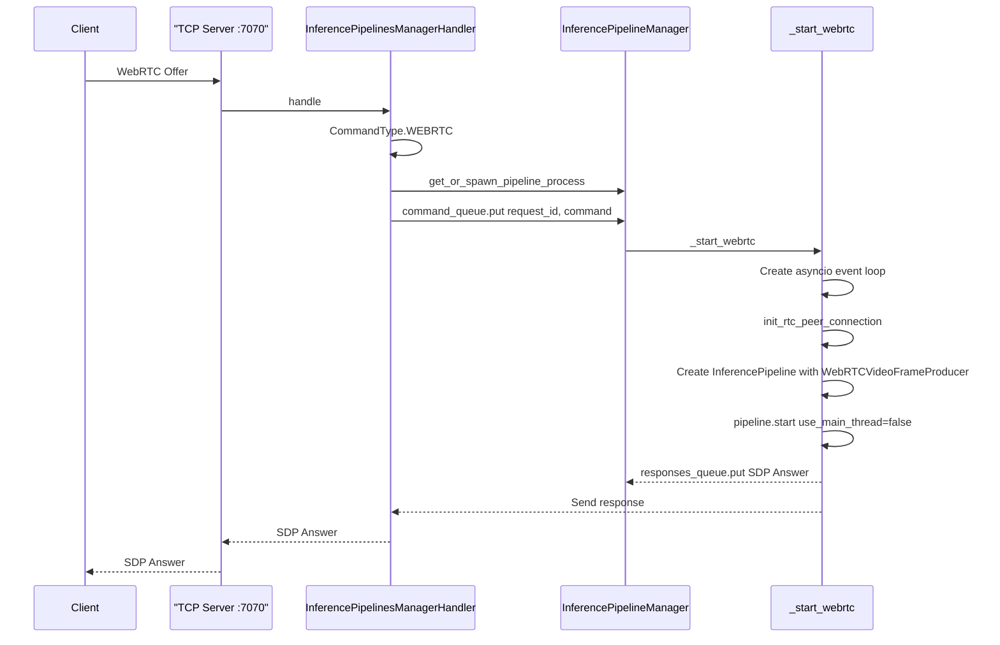

# WebRTC Integration

Relevant source files

- [development/stream_interface/multiplexer_inference_pipeline.py](https://github.com/roboflow/inference/blob/55f57676/development/stream_interface/multiplexer_inference_pipeline.py)
- [docker/config/cpu_http.py](https://github.com/roboflow/inference/blob/55f57676/docker/config/cpu_http.py)
- [docker/config/gpu_http.py](https://github.com/roboflow/inference/blob/55f57676/docker/config/gpu_http.py)
- [docker/config/lambda.py](https://github.com/roboflow/inference/blob/55f57676/docker/config/lambda.py)
- [inference/core/interfaces/camera/entities.py](https://github.com/roboflow/inference/blob/55f57676/inference/core/interfaces/camera/entities.py)
- [inference/core/interfaces/camera/exceptions.py](https://github.com/roboflow/inference/blob/55f57676/inference/core/interfaces/camera/exceptions.py)
- [inference/core/interfaces/stream/utils.py](https://github.com/roboflow/inference/blob/55f57676/inference/core/interfaces/stream/utils.py)
- [inference/core/interfaces/stream_manager/api/entities.py](https://github.com/roboflow/inference/blob/55f57676/inference/core/interfaces/stream_manager/api/entities.py)
- [inference/core/interfaces/stream_manager/api/errors.py](https://github.com/roboflow/inference/blob/55f57676/inference/core/interfaces/stream_manager/api/errors.py)
- [inference/core/interfaces/stream_manager/api/stream_manager_client.py](https://github.com/roboflow/inference/blob/55f57676/inference/core/interfaces/stream_manager/api/stream_manager_client.py)
- [inference/core/interfaces/stream_manager/manager_app/app.py](https://github.com/roboflow/inference/blob/55f57676/inference/core/interfaces/stream_manager/manager_app/app.py)
- [inference/core/interfaces/stream_manager/manager_app/communication.py](https://github.com/roboflow/inference/blob/55f57676/inference/core/interfaces/stream_manager/manager_app/communication.py)
- [inference/core/interfaces/stream_manager/manager_app/entities.py](https://github.com/roboflow/inference/blob/55f57676/inference/core/interfaces/stream_manager/manager_app/entities.py)
- [inference/core/interfaces/stream_manager/manager_app/errors.py](https://github.com/roboflow/inference/blob/55f57676/inference/core/interfaces/stream_manager/manager_app/errors.py)
- [inference/core/interfaces/stream_manager/manager_app/inference_pipeline_manager.py](https://github.com/roboflow/inference/blob/55f57676/inference/core/interfaces/stream_manager/manager_app/inference_pipeline_manager.py)
- [inference/core/interfaces/stream_manager/manager_app/serialisation.py](https://github.com/roboflow/inference/blob/55f57676/inference/core/interfaces/stream_manager/manager_app/serialisation.py)
- [inference/core/interfaces/stream_manager/manager_app/webrtc.py](https://github.com/roboflow/inference/blob/55f57676/inference/core/interfaces/stream_manager/manager_app/webrtc.py)
- [inference/core/utils/async_utils.py](https://github.com/roboflow/inference/blob/55f57676/inference/core/utils/async_utils.py)
- [inference/core/utils/drawing.py](https://github.com/roboflow/inference/blob/55f57676/inference/core/utils/drawing.py)
- [inference/enterprise/stream_management/manager/entities.py](https://github.com/roboflow/inference/blob/55f57676/inference/enterprise/stream_management/manager/entities.py)

## Purpose and Scope

This page documents the WebRTC streaming integration that enables real-time bidirectional video communication between web browsers and the Inference Pipeline. The system allows browser-based video sources (webcam, screen capture) to be processed by inference workflows with visualized results streamed back to the browser in real-time.

For general stream processing architecture, see [4](https://deepwiki.com/roboflow/inference/4-stream-processing). For the underlying InferencePipeline mechanics, see [4.1](https://deepwiki.com/roboflow/inference/4.1-inferencepipeline). For multi-process stream management, see [4.3](https://deepwiki.com/roboflow/inference/4.3-stream-manager).

## Architecture Overview

The WebRTC integration bridges the asynchronous event loop of `aiortc` (a Python WebRTC library) with the synchronous multi-threaded architecture of `InferencePipeline`. This is accomplished through bidirectional queues and custom video track implementations.

### High-Level Component Diagram


**Sources:** [inference/core/interfaces/stream_manager/manager_app/webrtc.py1-483](https://github.com/roboflow/inference/blob/55f57676/inference/core/interfaces/stream_manager/manager_app/webrtc.py#L1-L483) [inference/core/interfaces/stream_manager/manager_app/inference_pipeline_manager.py249-477](https://github.com/roboflow/inference/blob/55f57676/inference/core/interfaces/stream_manager/manager_app/inference_pipeline_manager.py#L249-L477)

## Peer Connection Lifecycle

### Initialization Flow

WebRTC connections are established through the Stream Manager's TCP interface. The initialization process involves:

1. **WebRTC Offer Reception**: Client sends `CommandType.WEBRTC` with SDP offer
2. **Peer Connection Setup**: `init_rtc_peer_connection` creates `RTCPeerConnectionWithFPS`
3. **Track Registration**: `@peer_connection.on("track")` callback registers remote video
4. **SDP Answer**: Server returns SDP answer to complete signaling

**Sources:** [inference/core/interfaces/stream_manager/manager_app/inference_pipeline_manager.py249-301](https://github.com/roboflow/inference/blob/55f57676/inference/core/interfaces/stream_manager/manager_app/inference_pipeline_manager.py#L249-L301) [inference/core/interfaces/stream_manager/manager_app/webrtc.py378-482](https://github.com/roboflow/inference/blob/55f57676/inference/core/interfaces/stream_manager/manager_app/webrtc.py#L378-L482)

### Configuration Options

The `InitialiseWebRTCPipelinePayload` configures WebRTC behavior:

|Parameter|Type|Default|Description|
|---|---|---|---|
|`webrtc_offer`|`WebRTCOffer`|Required|SDP offer from browser|
|`webrtc_turn_config`|`WebRTCTURNConfig`|`None`|TURN server credentials for NAT traversal|
|`webrtc_realtime_processing`|`bool`|`WEBRTC_REALTIME_PROCESSING`|Enable frame dropping for real-time performance|
|`webcam_fps`|`float`|`None`|Expected webcam FPS (auto-detected if None)|
|`fps_probe_frames`|`int`|`10`|Number of frames used for FPS detection|
|`stream_output`|`List[str]`|`[]`|Workflow output key for video stream|
|`data_output`|`List[str]`|`[]`|Workflow output key for data channel|

**Sources:** [inference/core/interfaces/stream_manager/manager_app/entities.py108-124](https://github.com/roboflow/inference/blob/55f57676/inference/core/interfaces/stream_manager/manager_app/entities.py#L108-L124)

### TURN Server Support

For clients behind restrictive NATs or firewalls, TURN server configuration is supported:

```
# Configuration structure
class WebRTCTURNConfig(BaseModel):
    urls: str              # e.g., "turn:turnserver.example.com:3478"
    username: str          # TURN authentication username
    credential: str        # TURN authentication credential
```

When provided, the TURN server is registered as an ICE server during peer connection initialization at [inference/core/interfaces/stream_manager/manager_app/webrtc.py401-413](https://github.com/roboflow/inference/blob/55f57676/inference/core/interfaces/stream_manager/manager_app/webrtc.py#L401-L413)

**Sources:** [inference/core/interfaces/stream_manager/manager_app/entities.py102-106](https://github.com/roboflow/inference/blob/55f57676/inference/core/interfaces/stream_manager/manager_app/entities.py#L102-L106) [inference/core/interfaces/stream_manager/manager_app/webrtc.py401-413](https://github.com/roboflow/inference/blob/55f57676/inference/core/interfaces/stream_manager/manager_app/webrtc.py#L401-L413)

## SyncAsyncQueue Bridge

The core challenge in WebRTC integration is bridging `aiortc`'s asynchronous event loop with `InferencePipeline`'s synchronous threading model. This is solved by `SyncAsyncQueue`, which provides both synchronous and asynchronous interfaces to an underlying `asyncio.Queue`.

### Queue Architecture


**Sources:** [inference/core/utils/async_utils.py27-97](https://github.com/roboflow/inference/blob/55f57676/inference/core/utils/async_utils.py#L27-L97)

### Queue Implementation Details

The `Queue` class from `async_utils.py` manages event loop lifecycle automatically:

|Scenario|Behavior|
|---|---|
|Created in sync context, no running loop|Creates new event loop in daemon thread|
|Created with explicit loop parameter|Uses provided loop|
|Created in async context|Uses current running loop|

Key methods:

- **Async Methods**: `async_put()`, `async_get()`, `async_put_nowait()`, `async_get_nowait()`
- **Sync Methods**: `sync_put()`, `sync_get()`, `sync_put_nowait()`, `sync_get_nowait()`

The sync methods use `asyncio.run_coroutine_threadsafe()` to execute operations on the asyncio event loop from synchronous threads.

**Sources:** [inference/core/utils/async_utils.py27-97](https://github.com/roboflow/inference/blob/55f57676/inference/core/utils/async_utils.py#L27-L97)

## Bidirectional Video Flow

### Input Path: Browser → InferencePipeline

The input video path processes frames from the browser's media stream through the inference pipeline:



**Sources:** [inference/core/interfaces/stream_manager/manager_app/webrtc.py166-255](https://github.com/roboflow/inference/blob/55f57676/inference/core/interfaces/stream_manager/manager_app/webrtc.py#L166-L255) [inference/core/interfaces/stream_manager/manager_app/webrtc.py287-334](https://github.com/roboflow/inference/blob/55f57676/inference/core/interfaces/stream_manager/manager_app/webrtc.py#L287-L334)

#### Frame Reading Loop

The `VideoTransformTrack._raw_frames_reader_loop()` continuously receives frames from the remote track:

1. **Frame Reception**: `await self.track.recv()` retrieves next `VideoFrame` from aiortc
2. **FPS Probing**: First `fps_probe_frames` frames calculate incoming stream FPS
3. **Queue Draining**: If `webrtc_realtime_processing=True`, drains buffered frames to maintain real-time performance
4. **Queue Insertion**: Places frame in `to_inference_queue` for pipeline consumption

The loop runs until `_track_active` is set to `False` or the connection closes.

**Sources:** [inference/core/interfaces/stream_manager/manager_app/webrtc.py166-255](https://github.com/roboflow/inference/blob/55f57676/inference/core/interfaces/stream_manager/manager_app/webrtc.py#L166-L255)

#### Real-Time Processing Mode

When `drain_remote_stream_track=True` (controlled by `webrtc_realtime_processing` configuration), the system actively drains the `RemoteStreamTrack._queue` to prevent buffering:

```
if self._drain_remote_stream_track:
    if self.track._queue.qsize() > 10:
        logger.warning("Draining RemoteStreamTrack._queue: %s (UNBOUNDED)", 
                      self.track._queue.qsize())
        while self.track._queue.qsize() > 0:
            frame: VideoFrame = await self.track.recv()
```

This ensures the system processes the most recent frame rather than falling behind with buffered frames.

**Sources:** [inference/core/interfaces/stream_manager/manager_app/webrtc.py224-232](https://github.com/roboflow/inference/blob/55f57676/inference/core/interfaces/stream_manager/manager_app/webrtc.py#L224-L232)

#### FPS Detection

The incoming stream FPS is auto-detected by measuring time between frames:

```
self._probe_count += 1
now = time.time()
if self._probe_count == 1:
    self._fps_probe_t1 = now
elif self._probe_count == self._fps_probe_frames:
    self._fps_probe_t2 = now
    dt = max(1e-6, (self._fps_probe_t2 - self._fps_probe_t1))
    self.incoming_stream_fps = (self._fps_probe_frames - 1) / dt
```

This probed FPS is exposed through `WebRTCVideoFrameProducer.discover_source_properties()` for pipeline configuration.

**Sources:** [inference/core/interfaces/stream_manager/manager_app/webrtc.py234-243](https://github.com/roboflow/inference/blob/55f57676/inference/core/interfaces/stream_manager/manager_app/webrtc.py#L234-L243) [inference/core/interfaces/stream_manager/manager_app/webrtc.py320-330](https://github.com/roboflow/inference/blob/55f57676/inference/core/interfaces/stream_manager/manager_app/webrtc.py#L320-L330)

### Output Path: InferencePipeline → Browser

The output video path sends processed frames back to the browser:



**Sources:** [inference/core/interfaces/stream_manager/manager_app/inference_pipeline_manager.py322-408](https://github.com/roboflow/inference/blob/55f57676/inference/core/interfaces/stream_manager/manager_app/inference_pipeline_manager.py#L322-L408) [inference/core/interfaces/stream_manager/manager_app/webrtc.py256-284](https://github.com/roboflow/inference/blob/55f57676/inference/core/interfaces/stream_manager/manager_app/webrtc.py#L256-L284)

#### Workflow Output Selection

The `webrtc_sink` function extracts the appropriate frame from workflow outputs using `get_frame_from_workflow_output()`:

1. **Primary Lookup**: Attempts to find `stream_output` key in workflow results
2. **Fallback Search**: If not found, iterates through all outputs to find any `WorkflowImageData`
3. **Error Frame**: If no visualization found, uses original input frame with error text overlay

**Sources:** [inference/core/interfaces/stream_manager/manager_app/webrtc.py62-97](https://github.com/roboflow/inference/blob/55f57676/inference/core/interfaces/stream_manager/manager_app/webrtc.py#L62-L97) [inference/core/interfaces/stream_manager/manager_app/inference_pipeline_manager.py370-408](https://github.com/roboflow/inference/blob/55f57676/inference/core/interfaces/stream_manager/manager_app/inference_pipeline_manager.py#L370-L408)

#### Frame Presentation Timestamp (PTS)

The `VideoTransformTrack.recv()` method assigns presentation timestamps to ensure smooth playback:

```
pts, time_base = await self.next_timestamp()
new_frame.pts = pts
new_frame.time_base = time_base
```

The `next_timestamp()` method (inherited from `VideoStreamTrack`) calculates PTS based on the incoming stream FPS, which is either provided as `webcam_fps` or auto-detected during the probing phase.

**Sources:** [inference/core/interfaces/stream_manager/manager_app/webrtc.py256-284](https://github.com/roboflow/inference/blob/55f57676/inference/core/interfaces/stream_manager/manager_app/webrtc.py#L256-L284)

## Data Channel Integration

In addition to video streams, WebRTC data channels transmit inference results as JSON metadata.

### Data Channel Setup

Data channels are established automatically by the browser and handled by the `@peer_connection.on("datachannel")` callback:

```
@peer_connection.on("datachannel")
def on_datachannel(channel: RTCDataChannel):
    logger.info("Data channel %s received", channel.label)
    
    @channel.on("message")
    def on_message(message):
        message = WebRTCData(**json.loads(message))
        if message.stream_output is not None:
            peer_connection.stream_output = message.stream_output or None
        if message.data_output is not None:
            peer_connection.data_output = message.data_output or None
    
    peer_connection.data_channel = channel
```

This allows the browser to dynamically reconfigure which workflow outputs are streamed.

**Sources:** [inference/core/interfaces/stream_manager/manager_app/webrtc.py441-458](https://github.com/roboflow/inference/blob/55f57676/inference/core/interfaces/stream_manager/manager_app/webrtc.py#L441-L458)

### Metadata Transmission

The `webrtc_sink` function serializes workflow outputs and sends them through the data channel:

```
if (peer_connection.data_output is not None
    and peer_connection.data_channel
    and peer_connection.data_channel.readyState == "open"):
    
    if peer_connection.data_output in prediction:
        workflow_output = prediction[peer_connection.data_output]
        
        # Handle different output types
        if isinstance(workflow_output, sv.Detections):
            serialized_data = json.dumps(serialise_sv_detections(workflow_output))
        elif isinstance(workflow_output, dict):
            serialized_data = json.dumps(workflow_output)
        else:
            serialized_data = str(workflow_output)
        
        peer_connection.data_channel.send(serialized_data)
```

This enables the browser to receive structured inference results (detections, classifications, etc.) alongside the video stream.

**Sources:** [inference/core/interfaces/stream_manager/manager_app/inference_pipeline_manager.py332-368](https://github.com/roboflow/inference/blob/55f57676/inference/core/interfaces/stream_manager/manager_app/inference_pipeline_manager.py#L332-L368)

## WebRTC-Specific Classes

### RTCPeerConnectionWithFPS

Extends `aiortc.RTCPeerConnection` with Inference-specific attributes:

|Attribute|Type|Purpose|
|---|---|---|
|`video_transform_track`|`VideoTransformTrack`|Reference to output video track|
|`stream_output`|`Optional[str]`|Workflow output key for video stream|
|`data_output`|`Optional[str]`|Workflow output key for data channel|
|`data_channel`|`Optional[RTCDataChannel]`|Active data channel instance|
|`_consumers_signalled`|`bool`|Tracks if termination signal sent to queues|

**Sources:** [inference/core/interfaces/stream_manager/manager_app/webrtc.py336-353](https://github.com/roboflow/inference/blob/55f57676/inference/core/interfaces/stream_manager/manager_app/webrtc.py#L336-L353)

### WebRTCPipelineWatchDog

Implements `BasePipelineWatchDog` to handle pipeline lifecycle events:

```
class WebRTCPipelineWatchDog(BasePipelineWatchDog):
    def on_status_update(self, status_update: StatusUpdate) -> None:
        if status_update.event_type == INFERENCE_THREAD_FINISHED_EVENT:
            logger.debug("InferencePipeline thread finished, closing WebRTC peer connection")
            asyncio.run_coroutine_threadsafe(
                self._webrtc_peer_connection.close(), 
                self._asyncio_loop
            )
```

This ensures the WebRTC connection is cleanly closed when the inference pipeline terminates.

**Sources:** [inference/core/interfaces/stream_manager/manager_app/webrtc.py355-376](https://github.com/roboflow/inference/blob/55f57676/inference/core/interfaces/stream_manager/manager_app/webrtc.py#L355-L376)

## Connection Lifecycle Management

### Graceful Shutdown

The connection state is monitored through the `@peer_connection.on("connectionstatechange")` callback:

```
@peer_connection.on("connectionstatechange")
async def on_connectionstatechange():
    logger.info("Connection state is %s", peer_connection.connectionState)
    if peer_connection.connectionState in {"failed", "closed"}:
        await peer_connection.close()
        
        # Signal termination to inference pipeline
        try:
            await to_inference_queue.async_put_nowait(None)
        except asyncio.QueueFull:
            await to_inference_queue.async_get_nowait()
            await to_inference_queue.async_put_nowait(None)
        
        peer_connection._consumers_signalled = True
```

Sending `None` through `to_inference_queue` signals the `WebRTCVideoFrameProducer` to stop, which triggers pipeline termination.

**Sources:** [inference/core/interfaces/stream_manager/manager_app/webrtc.py460-473](https://github.com/roboflow/inference/blob/55f57676/inference/core/interfaces/stream_manager/manager_app/webrtc.py#L460-L473)

### Debugging and Monitoring

The system includes comprehensive queue monitoring when `DEBUG_AIORTC_QUEUES` is enabled:

```
if DEBUG_AIORTC_QUEUES and current_time - self._last_queue_log_time >= 5.0:
    logger.warning("=== AIORTC QUEUE SIZES ===")
    logger.warning("from_inference_queue: %s", self.from_inference_queue._queue.qsize())
    logger.warning("to_inference_queue: %s", self.to_inference_queue._queue.qsize())
    
    if self.track and hasattr(self.track, "_queue"):
        logger.warning("RemoteStreamTrack._queue: %s (UNBOUNDED!)", 
                      self.track._queue.qsize())
```

This tracks queue sizes across:

- `to_inference_queue` / `from_inference_queue` (bounded at 10)
- `RemoteStreamTrack._queue` (unbounded, managed by aiortc)
- `RTCRtpReceiver.__decoder_queue` (unbounded)
- `RTCRtpReceiver.JitterBuffer` (bounded)

**Sources:** [inference/core/interfaces/stream_manager/manager_app/webrtc.py171-221](https://github.com/roboflow/inference/blob/55f57676/inference/core/interfaces/stream_manager/manager_app/webrtc.py#L171-L221)

## Integration with Stream Manager

WebRTC pipelines are managed through the same Stream Manager infrastructure as standard pipelines, with a specialized initialization path.

### Command Flow




si querés, después le agrego activaciones o notas, pero así ya respeta tus restricciones y refleja el flujo que armaste.
**Sources:** [inference/core/interfaces/stream_manager/manager_app/app.py209-229](https://github.com/roboflow/inference/blob/55f57676/inference/core/interfaces/stream_manager/manager_app/app.py#L209-L229) [inference/core/interfaces/stream_manager/manager_app/inference_pipeline_manager.py249-477](https://github.com/roboflow/inference/blob/55f57676/inference/core/interfaces/stream_manager/manager_app/inference_pipeline_manager.py#L249-L477)

### Process Isolation

Each WebRTC pipeline runs in a dedicated `InferencePipelineManager` process, ensuring:

- **Memory Isolation**: Pipeline crashes don't affect other streams
- **Resource Tracking**: RAM usage monitored per-pipeline
- **Clean Shutdown**: Process termination cleans up all resources

The Stream Manager's health check monitors WebRTC pipelines alongside standard pipelines, automatically cleaning up completed connections.

**Sources:** [inference/core/interfaces/stream_manager/manager_app/app.py334-436](https://github.com/roboflow/inference/blob/55f57676/inference/core/interfaces/stream_manager/manager_app/app.py#L334-L436)

## Configuration and Environment Variables

WebRTC behavior is controlled through environment variables and runtime configuration:

|Variable|Default|Description|
|---|---|---|
|`WEBRTC_REALTIME_PROCESSING`|`True`|Enable frame dropping for real-time performance|
|`DEBUG_AIORTC_QUEUES`|`False`|Log queue sizes every 5 seconds|
|`DEBUG_WEBRTC_PROCESSING_LATENCY`|`False`|Log end-to-end processing latency|
|`ENABLE_STREAM_API`|-|Enable Stream Manager and WebRTC support|
|`STREAM_MANAGER_HOST`|`127.0.0.1`|TCP server host|
|`STREAM_MANAGER_PORT`|`7070`|TCP server port|

**Sources:** [inference/core/interfaces/stream_manager/manager_app/webrtc.py25-26](https://github.com/roboflow/inference/blob/55f57676/inference/core/interfaces/stream_manager/manager_app/webrtc.py#L25-L26) [inference/core/interfaces/stream_manager/manager_app/entities.py9-14](https://github.com/roboflow/inference/blob/55f57676/inference/core/interfaces/stream_manager/manager_app/entities.py#L9-L14)