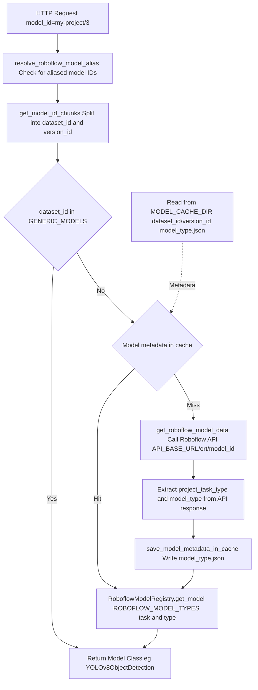
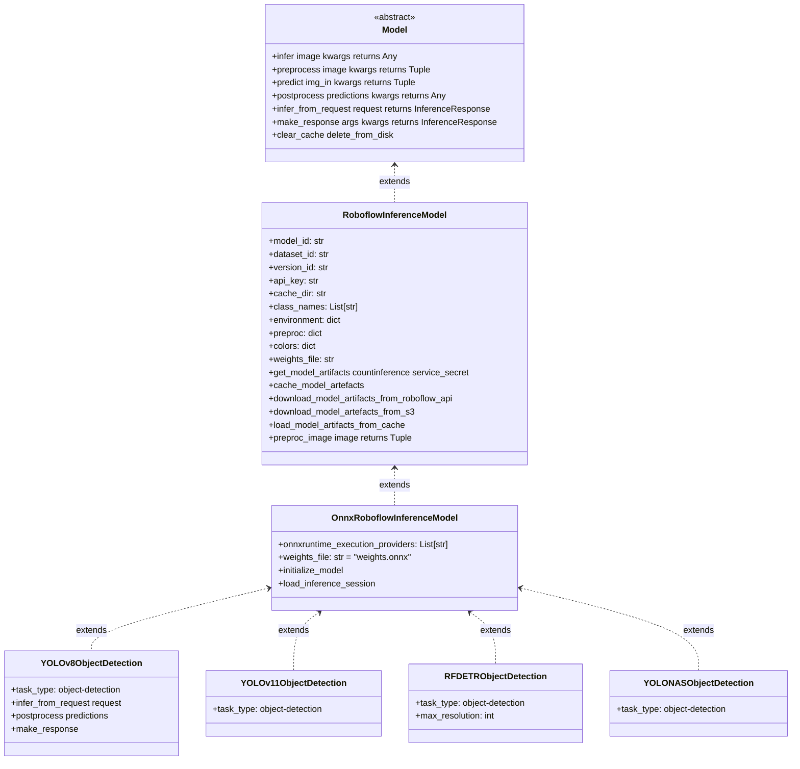
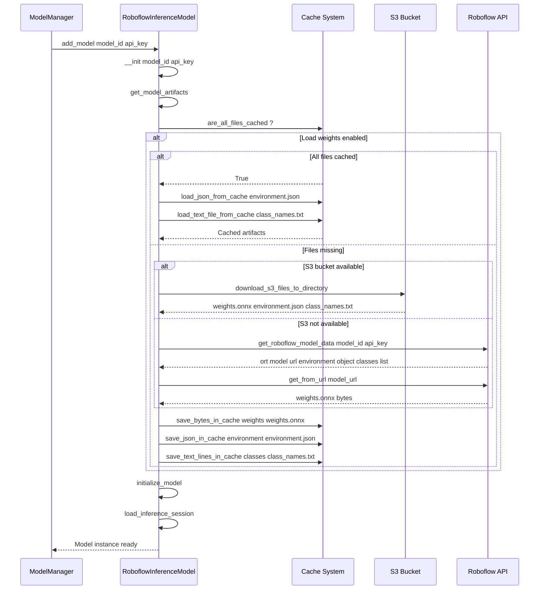
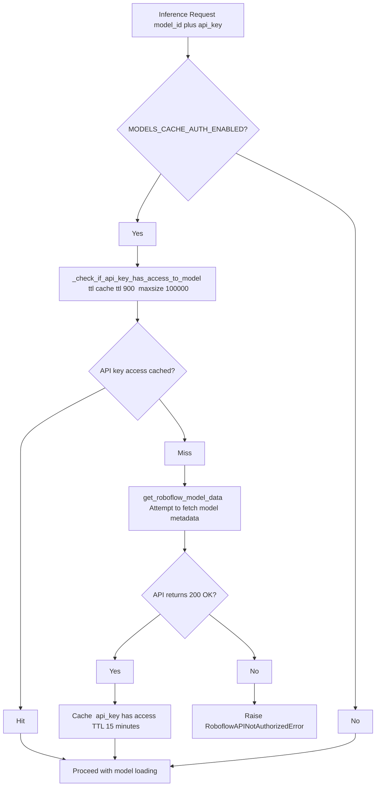
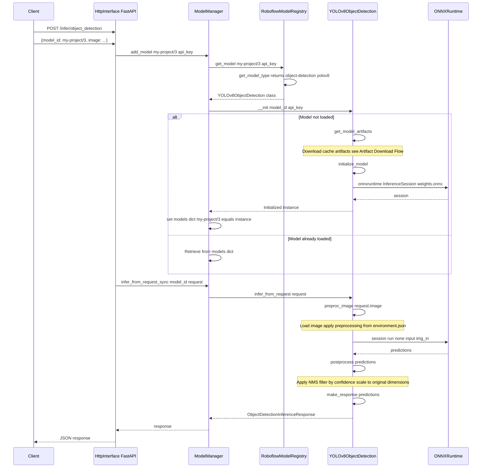
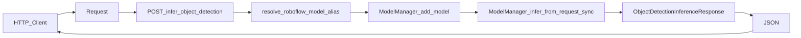

# Fine-Tuned Models

Relevant source files

- [inference/core/cache/model_artifacts.py](https://github.com/roboflow/inference/blob/55f57676/inference/core/cache/model_artifacts.py)
- [inference/core/env.py](https://github.com/roboflow/inference/blob/55f57676/inference/core/env.py)
- [inference/core/interfaces/http/http_api.py](https://github.com/roboflow/inference/blob/55f57676/inference/core/interfaces/http/http_api.py)
- [inference/core/managers/base.py](https://github.com/roboflow/inference/blob/55f57676/inference/core/managers/base.py)
- [inference/core/managers/decorators/base.py](https://github.com/roboflow/inference/blob/55f57676/inference/core/managers/decorators/base.py)
- [inference/core/managers/decorators/fixed_size_cache.py](https://github.com/roboflow/inference/blob/55f57676/inference/core/managers/decorators/fixed_size_cache.py)
- [inference/core/managers/decorators/logger.py](https://github.com/roboflow/inference/blob/55f57676/inference/core/managers/decorators/logger.py)
- [inference/core/models/base.py](https://github.com/roboflow/inference/blob/55f57676/inference/core/models/base.py)
- [inference/core/models/roboflow.py](https://github.com/roboflow/inference/blob/55f57676/inference/core/models/roboflow.py)
- [inference/core/models/stubs.py](https://github.com/roboflow/inference/blob/55f57676/inference/core/models/stubs.py)
- [inference/core/registries/roboflow.py](https://github.com/roboflow/inference/blob/55f57676/inference/core/registries/roboflow.py)
- [inference/core/roboflow_api.py](https://github.com/roboflow/inference/blob/55f57676/inference/core/roboflow_api.py)
- [inference/core/utils/roboflow.py](https://github.com/roboflow/inference/blob/55f57676/inference/core/utils/roboflow.py)
- [inference/core/utils/visualisation.py](https://github.com/roboflow/inference/blob/55f57676/inference/core/utils/visualisation.py)
- [inference/core/version.py](https://github.com/roboflow/inference/blob/55f57676/inference/core/version.py)
- [inference/models/__init__.py](https://github.com/roboflow/inference/blob/55f57676/inference/models/__init__.py)
- [inference/models/utils.py](https://github.com/roboflow/inference/blob/55f57676/inference/models/utils.py)
- [tests/inference/unit_tests/core/cache/__init__.py](https://github.com/roboflow/inference/blob/55f57676/tests/inference/unit_tests/core/cache/__init__.py)
- [tests/inference/unit_tests/core/cache/test_model_artifacts.py](https://github.com/roboflow/inference/blob/55f57676/tests/inference/unit_tests/core/cache/test_model_artifacts.py)
- [tests/inference/unit_tests/core/models/test_roboflow.py](https://github.com/roboflow/inference/blob/55f57676/tests/inference/unit_tests/core/models/test_roboflow.py)

Fine-tuned models are custom computer vision models trained on the Roboflow platform using user-provided datasets. These models are identified by a `project_name/version_number` format and support multiple YOLO architectures (v5-v12), YOLO-NAS, and RF-DETR for object detection, instance segmentation, classification, and keypoint detection tasks.

For information about foundation models (CLIP, SAM, etc.), see [Foundation Models](https://deepwiki.com/roboflow/inference/5.2-foundation-models). For pre-trained COCO checkpoint models, see the model registry documentation.

## Model ID Format

Fine-tuned models use a two-part identifier format: `dataset_id/version_id`. The `dataset_id` corresponds to the Roboflow project name, and the `version_id` is an integer representing the model version.

```
Examples:
  - "my-object-detector/3"
  - "license-plate-recognition/12"
  - "crack-detection/1"
```

The model ID is parsed by `get_model_id_chunks()` which splits on the forward slash and validates the format:

[inference/core/utils/roboflow.py7-42](https://github.com/roboflow/inference/blob/55f57676/inference/core/utils/roboflow.py#L7-L42)

Special case: If the version ID is "0", the model is treated as a stub model that returns placeholder predictions without performing real inference.

**Sources:** [inference/core/utils/roboflow.py7-42](https://github.com/roboflow/inference/blob/55f57676/inference/core/utils/roboflow.py#L7-L42) [inference/core/models/roboflow.py137](https://github.com/roboflow/inference/blob/55f57676/inference/core/models/roboflow.py#L137-L137)

## Supported Model Architectures

Fine-tuned models support multiple architectures across four task types. The `ROBOFLOW_MODEL_TYPES` dictionary maps `(task_type, model_type)` tuples to concrete model classes:

### Object Detection

|Model Type|Model Class|Variants|
|---|---|---|
|`yolov5*`|`YOLOv5ObjectDetection`|v2s, v6n, v6s, v6m, v6l, v6x|
|`yolov8*`|`YOLOv8ObjectDetection`|n, s, m, l, x|
|`yolov9`|`YOLOv9ObjectDetection`|-|
|`yolov10*`|`YOLOv10ObjectDetection`|n, s, b, m, l, x|
|`yolov11*`|`YOLOv11ObjectDetection`|n, s, b, m, l, x|
|`yolov12*`|`YOLOv12ObjectDetection`|n, s, m, l, x|
|`yolo_nas_*`|`YOLONASObjectDetection`|s, m, l|
|`rfdetr-*`|`RFDETRObjectDetection`|nano, small, medium, base, large|

### Instance Segmentation

|Model Type|Model Class|Variants|
|---|---|---|
|`yolov5*-seg`|`YOLOv5InstanceSegmentation`|n, s, m, l, x|
|`yolov8*-seg`|`YOLOv8InstanceSegmentation`|n, s, m, l, x|
|`yolov11*-seg`|`YOLOv11InstanceSegmentation`|n, s, m, l, x|
|`yolact`|`YOLACT`|-|

### Classification

|Model Type|Model Class|
|---|---|
|`vit`|`VitClassification`|
|`resnet*`|`ResNetClassification` (18, 34, 50, 101)|
|`yolov8*`|`YOLOv8Classification` (n, s, m, l, x)|

### Keypoint Detection

|Model Type|Model Class|Variants|
|---|---|---|
|`yolov8*-pose`|`YOLOv8KeypointsDetection`|n, s, m, l, x|
|`yolov11*-pose`|`YOLOv11KeypointsDetection`|n, s, m, l, x|

**Sources:** [inference/models/utils.py55-255](https://github.com/roboflow/inference/blob/55f57676/inference/models/utils.py#L55-L255) [inference/models/__init__.py52-71](https://github.com/roboflow/inference/blob/55f57676/inference/models/__init__.py#L52-L71)

## Model Resolution Flow

The following diagram illustrates how a model ID is resolved to a concrete model class:



**Sources:** [inference/core/registries/roboflow.py138-237](https://github.com/roboflow/inference/blob/55f57676/inference/core/registries/roboflow.py#L138-L237) [inference/core/registries/roboflow.py67-103](https://github.com/roboflow/inference/blob/55f57676/inference/core/registries/roboflow.py#L67-L103) [inference/models/aliases.py](https://github.com/roboflow/inference/blob/55f57676/inference/models/aliases.py)

## Model Class Hierarchy

Fine-tuned models inherit from a common base class hierarchy that provides artifact management and inference capabilities:



**Sources:** [inference/core/models/base.py77-162](https://github.com/roboflow/inference/blob/55f57676/inference/core/models/base.py#L77-L162) [inference/core/models/roboflow.py113-638](https://github.com/roboflow/inference/blob/55f57676/inference/core/models/roboflow.py#L113-L638)

## Model Artifacts

Each fine-tuned model consists of three primary artifacts downloaded from the Roboflow API or S3:

### Artifact Files

|File|Purpose|Format|
|---|---|---|
|`weights.onnx`|Model weights in ONNX format|Binary|
|`environment.json`|Preprocessing configuration and metadata|JSON|
|`class_names.txt`|Ordered list of class labels|Text (newline-separated)|
|`keypoints_metadata.json`|Keypoint definitions (pose models only)|JSON|

### environment.json Structure

The environment file contains critical model configuration:

```
{
  "PREPROCESSING": {
    "auto-orient": true,
    "resize": {
      "enabled": true,
      "format": "Stretch to",
      "width": 640,
      "height": 640
    },
    "static-crop": {...},
    "grayscale": {...},
    "contrast": {...}
  },
  "COLORS": {
    "class_a": "#4892EA",
    "class_b": "#00EEC3"
  },
  "CLASS_MAP": {
    "0": "class_a",
    "1": "class_b"
  },
  "MULTICLASS": false
}
```

### Artifact Download Flow



**Sources:** [inference/core/models/roboflow.py231-257](https://github.com/roboflow/inference/blob/55f57676/inference/core/models/roboflow.py#L231-L257) [inference/core/models/roboflow.py284-299](https://github.com/roboflow/inference/blob/55f57676/inference/core/models/roboflow.py#L284-L299) [inference/core/models/roboflow.py305-415](https://github.com/roboflow/inference/blob/55f57676/inference/core/models/roboflow.py#L305-L415) [inference/core/cache/model_artifacts.py](https://github.com/roboflow/inference/blob/55f57676/inference/core/cache/model_artifacts.py)

## Authentication and Authorization

Fine-tuned models require API key authentication to access model artifacts and perform inference. The authentication system operates at multiple levels:

### API Key Validation Flow




### Multi-Level Authorization

The authorization system performs checks at three key points:

1. **ModelManager.add_model()** - Before loading a model [inference/core/managers/base.py73-83](https://github.com/roboflow/inference/blob/55f57676/inference/core/managers/base.py#L73-L83)
2. **RoboflowModelRegistry.get_model()** - During model type resolution [inference/core/registries/roboflow.py166-175](https://github.com/roboflow/inference/blob/55f57676/inference/core/registries/roboflow.py#L166-L175)
3. **RoboflowInferenceModel.get_model_artifacts()** - Before downloading artifacts [inference/core/models/roboflow.py241-251](https://github.com/roboflow/inference/blob/55f57676/inference/core/models/roboflow.py#L241-L251)

### Dedicated Deployment Authentication

For dedicated deployments, an additional middleware layer validates that the API key belongs to the correct workspace:

[inference/core/interfaces/http/http_api.py510-578](https://github.com/roboflow/inference/blob/55f57676/inference/core/interfaces/http/http_api.py#L510-L578)

This middleware:

- Caches API key → workspace mappings for 1 hour
- Validates against `DEDICATED_DEPLOYMENT_WORKSPACE_URL` environment variable
- Returns HTTP 401 for unauthorized requests

**Sources:** [inference/core/registries/roboflow.py106-135](https://github.com/roboflow/inference/blob/55f57676/inference/core/registries/roboflow.py#L106-L135) [inference/core/managers/base.py73-83](https://github.com/roboflow/inference/blob/55f57676/inference/core/managers/base.py#L73-L83) [inference/core/interfaces/http/http_api.py510-578](https://github.com/roboflow/inference/blob/55f57676/inference/core/interfaces/http/http_api.py#L510-L578)

## Model Caching Strategy

The caching system uses a multi-tiered approach to minimize API calls and speed up model loading:

### Cache Directory Structure

```
MODEL_CACHE_DIR/
├── dataset_id/
│   ├── version_id/
│   │   ├── weights.onnx
│   │   ├── environment.json
│   │   ├── class_names.txt
│   │   ├── keypoints_metadata.json (optional)
│   │   └── model_type.json (metadata cache)
│   └── _file_locks/
│       └── version_id.lock
```

### Cache Layers

|Layer|Purpose|Location|TTL|
|---|---|---|---|
|Model Type Metadata|Cache task type and model type to avoid API calls|`{MODEL_CACHE_DIR}/{dataset_id}/{version_id}/model_type.json`|Indefinite (file-based)|
|API Response Cache|Cache raw API responses|Memory (cachetools)|10 seconds|
|API Key Access Cache|Cache authorization checks|Memory (TTL cache)|15 minutes|
|Model Artifacts|Cache downloaded weights and configs|Disk|Indefinite|

### File Locking for Concurrent Access

To prevent race conditions during concurrent model loading, the system uses file locks:

[inference/core/models/roboflow.py313-319](https://github.com/roboflow/inference/blob/55f57676/inference/core/models/roboflow.py#L313-L319)

The locking mechanism:

- Creates a dedicated `_file_locks/` directory
- Acquires a 120-second timeout lock during downloads
- Cleans up lock files after operations complete
- Allows multiple processes to safely share the cache

### Cache Eviction

Models can be evicted from memory via the `WithFixedSizeCache` decorator, which implements an LRU (Least Recently Used) eviction policy:

[inference/core/managers/decorators/fixed_size_cache.py28-253](https://github.com/roboflow/inference/blob/55f57676/inference/core/managers/decorators/fixed_size_cache.py#L28-L253)

The eviction policy:

- Maintains a `deque` of model IDs ordered by last use
- Evicts oldest models when `max_size` is reached
- Optionally deletes artifacts from disk based on `DISK_CACHE_CLEANUP` flag
- Monitors memory pressure on GPU systems

**Sources:** [inference/core/cache/model_artifacts.py](https://github.com/roboflow/inference/blob/55f57676/inference/core/cache/model_artifacts.py) [inference/core/models/roboflow.py259-276](https://github.com/roboflow/inference/blob/55f57676/inference/core/models/roboflow.py#L259-L276) [inference/core/managers/decorators/fixed_size_cache.py28-253](https://github.com/roboflow/inference/blob/55f57676/inference/core/managers/decorators/fixed_size_cache.py#L28-L253)

## Model Lifecycle

The complete lifecycle of a fine-tuned model from request to inference:




### Lazy Loading Pattern

Models are loaded on-demand when first requested, not at server startup:

1. **First Request**: Model class instantiation, artifact download, ONNX session creation (slow)
2. **Subsequent Requests**: Direct lookup from `_models` dictionary (fast)

This pattern is implemented in:

[inference/core/managers/base.py89-141](https://github.com/roboflow/inference/blob/55f57676/inference/core/managers/base.py#L89-L141)

### Preprocessing Pipeline

The preprocessing pipeline applies transformations specified in `environment.json`:

1. **Load Image**: From file path, URL, bytes, numpy array, etc.
2. **Auto-Orient**: Correct EXIF orientation (if enabled)
3. **Static Crop**: Apply fixed region crop (if configured)
4. **Grayscale**: Convert to grayscale (if enabled)
5. **Contrast Adjustment**: Apply contrast enhancement (if configured)
6. **Resize**: Scale to model input dimensions using configured method:
    - `"Stretch to"`: Direct resize to `(width, height)`
    - `"Fit (black edges) in"`: Letterbox with black padding
    - `"Fit (white edges) in"`: Letterbox with white padding
    - `"Fit (grey edges) in"`: Letterbox with grey padding
7. **Normalize**: Convert to float32, transpose to CHW format

[inference/core/models/roboflow.py499-598](https://github.com/roboflow/inference/blob/55f57676/inference/core/models/roboflow.py#L499-L598)

**Sources:** [inference/core/managers/base.py57-141](https://github.com/roboflow/inference/blob/55f57676/inference/core/managers/base.py#L57-L141) [inference/core/models/roboflow.py113-638](https://github.com/roboflow/inference/blob/55f57676/inference/core/models/roboflow.py#L113-L638) [inference/core/interfaces/http/http_api.py594-622](https://github.com/roboflow/inference/blob/55f57676/inference/core/interfaces/http/http_api.py#L594-L622)

## Integration with HTTP API

Fine-tuned models are accessible through multiple HTTP endpoints that handle different task types:

### Object Detection Endpoint

```
POST /infer/object_detection
Content-Type: application/json

{
  "model_id": "my-detector/3",
  "image": {
    "type": "url",
    "value": "https://example.com/image.jpg"
  },
  "api_key": "your_api_key",
  "confidence": 0.5,
  "iou_threshold": 0.4,
  "max_detections": 300,
  "visualize_predictions": false
}
```

[inference/core/interfaces/http/http_api.py981-1014](https://github.com/roboflow/inference/blob/55f57676/inference/core/interfaces/http/http_api.py#L981-L1014)

### Instance Segmentation Endpoint

```
POST /infer/instance_segmentation
```

[inference/core/interfaces/http/http_api.py1036-1069](https://github.com/roboflow/inference/blob/55f57676/inference/core/interfaces/http/http_api.py#L1036-L1069)

### Classification Endpoint

```
POST /infer/classification
```

[inference/core/interfaces/http/http_api.py1091-1123](https://github.com/roboflow/inference/blob/55f57676/inference/core/interfaces/http/http_api.py#L1091-L1123)

### Model Alias Resolution

The system supports model aliases for common pre-trained models:

[inference/models/aliases.py](https://github.com/roboflow/inference/blob/55f57676/inference/models/aliases.py)

Example aliases:

- `"yolov8x-1280"` → Full YOLOv8x model at 1280px resolution
- `"yolov8n-640"` → Nano YOLOv8 model at 640px resolution

These aliases are resolved before model loading:

[inference/core/interfaces/http/http_api.py610-612](https://github.com/roboflow/inference/blob/55f57676/inference/core/interfaces/http/http_api.py#L610-L612)

### Request Flow Summary



**Sources:** [inference/core/interfaces/http/http_api.py981-1123](https://github.com/roboflow/inference/blob/55f57676/inference/core/interfaces/http/http_api.py#L981-L1123) [inference/models/aliases.py](https://github.com/roboflow/inference/blob/55f57676/inference/models/aliases.py)

## Model Metadata Cache Format

The model metadata cache stores the resolved task type and model type to avoid repeated API calls:

### model_type.json Structure

```
{
  "project_task_type": "object-detection",
  "model_type": "yolov8"
}
```

### Cache Operations

The cache is managed through these functions:

|Function|Purpose|Location|
|---|---|---|
|`get_model_metadata_from_cache()`|Read cached metadata with file locking|[inference/core/registries/roboflow.py240-253](https://github.com/roboflow/inference/blob/55f57676/inference/core/registries/roboflow.py#L240-L253)|
|`save_model_metadata_in_cache()`|Write metadata with file locking|[inference/core/registries/roboflow.py291-333](https://github.com/roboflow/inference/blob/55f57676/inference/core/registries/roboflow.py#L291-L333)|
|`construct_model_type_cache_path()`|Build cache file path|[inference/core/registries/roboflow.py335-341](https://github.com/roboflow/inference/blob/55f57676/inference/core/registries/roboflow.py#L335-L341)|

### Cache Validation

The system validates cached metadata to ensure data integrity:

[inference/core/registries/roboflow.py276-288](https://github.com/roboflow/inference/blob/55f57676/inference/core/registries/roboflow.py#L276-L288)

Validation checks:

- File exists and is readable
- Content is valid JSON
- Contains required keys: `project_task_type` and `model_type`

**Sources:** [inference/core/registries/roboflow.py240-341](https://github.com/roboflow/inference/blob/55f57676/inference/core/registries/roboflow.py#L240-L341)

## Stub Models

Stub models (version "0") provide placeholder responses without performing real inference. They are used for testing and development:

```
model_id = "my-project/0"  # Version 0 triggers stub mode
```

The stub system:

1. Detects version "0" in model ID
2. Queries Roboflow API for project task type
3. Returns appropriate stub class: `ObjectDetectionModelStub`, `ClassificationModelStub`, etc.
4. Generates dummy predictions matching the task type schema

[inference/core/registries/roboflow.py183-199](https://github.com/roboflow/inference/blob/55f57676/inference/core/registries/roboflow.py#L183-L199) [inference/core/models/stubs.py16-137](https://github.com/roboflow/inference/blob/55f57676/inference/core/models/stubs.py#L16-L137)

**Sources:** [inference/core/registries/roboflow.py183-199](https://github.com/roboflow/inference/blob/55f57676/inference/core/registries/roboflow.py#L183-L199) [inference/core/models/stubs.py](https://github.com/roboflow/inference/blob/55f57676/inference/core/models/stubs.py)