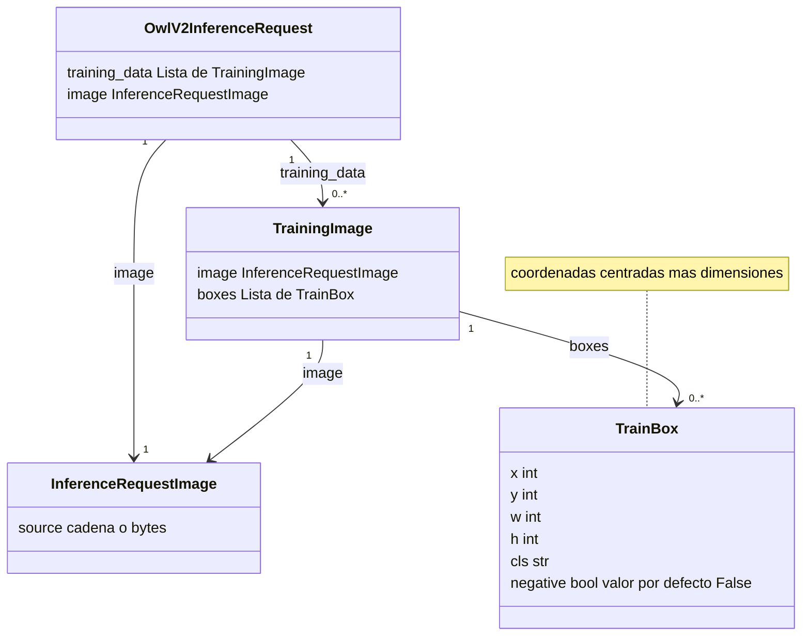
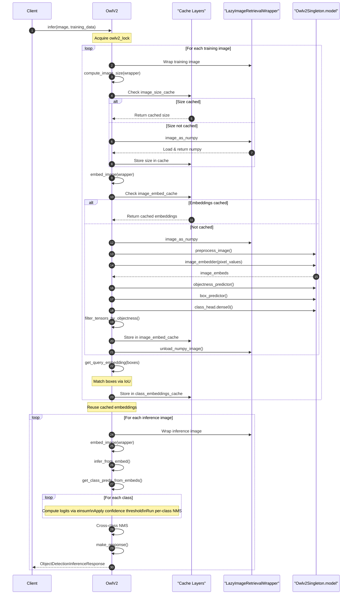
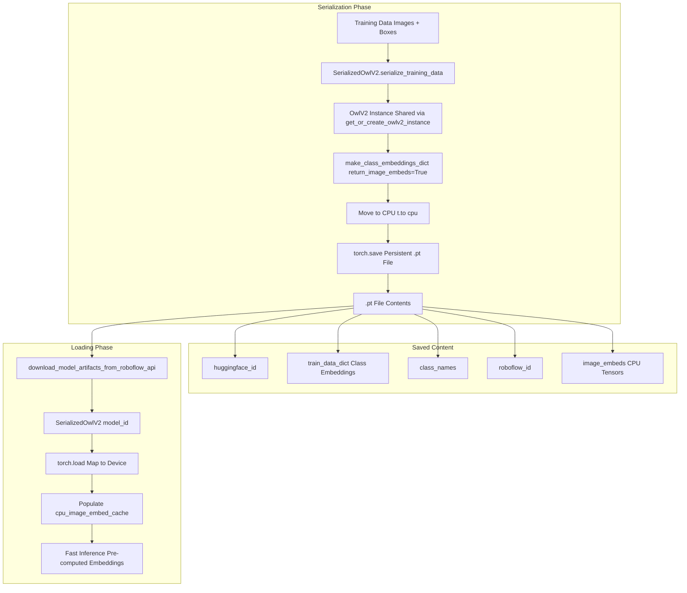

# OwlV2 Few-Shot Detection

Relevant source files

- [development/benchmark_scripts/benchmark_owlv2_inference_time.py](https://github.com/roboflow/inference/blob/55f57676/development/benchmark_scripts/benchmark_owlv2_inference_time.py)
- [inference/core/entities/requests/owlv2.py](https://github.com/roboflow/inference/blob/55f57676/inference/core/entities/requests/owlv2.py)
- [inference/models/owlv2/owlv2.py](https://github.com/roboflow/inference/blob/55f57676/inference/models/owlv2/owlv2.py)
- [tests/inference/models_predictions_tests/test_owlv2.py](https://github.com/roboflow/inference/blob/55f57676/tests/inference/models_predictions_tests/test_owlv2.py)
- [tests/workflows/unit_tests/core_steps/cache/test_cache.py](https://github.com/roboflow/inference/blob/55f57676/tests/workflows/unit_tests/core_steps/cache/test_cache.py)
- [tests/workflows/unit_tests/core_steps/fusion/test_buffer.py](https://github.com/roboflow/inference/blob/55f57676/tests/workflows/unit_tests/core_steps/fusion/test_buffer.py)
- [tests/workflows/unit_tests/core_steps/visualizations/test_grid.py](https://github.com/roboflow/inference/blob/55f57676/tests/workflows/unit_tests/core_steps/visualizations/test_grid.py)

This page documents the OwlV2 few-shot object detection model implementation, including its multi-level caching architecture, training data serialization, and memory optimization strategies. OwlV2 enables object detection from a few labeled examples rather than requiring extensive training datasets.

For general information about foundation models, see [Foundation Models](https://deepwiki.com/roboflow/inference/5.2-foundation-models). For other specialized models, see [Model Ecosystem](https://deepwiki.com/roboflow/inference/5-model-ecosystem).

**Sources:** [inference/models/owlv2/owlv2.py1-1007](https://github.com/roboflow/inference/blob/55f57676/inference/models/owlv2/owlv2.py#L1-L1007)

## Overview

OwlV2 (Open-World Localization v2) is a few-shot object detection model that learns to detect objects from a small number of labeled examples provided at inference time. Unlike traditional object detectors that require extensive training, OwlV2 can adapt to new object classes using just a few annotated boxes.

The implementation provides:

- **Few-shot detection**: Detect objects using 1-N labeled examples per class
- **Positive and negative examples**: Support for contrastive learning via negative samples
- **Multi-level caching**: GPU, CPU, and embedding caches for optimal performance
- **Training data serialization**: Pre-compute embeddings for faster repeated inference
- **Lazy image loading**: Memory-efficient image handling via `LazyImageRetrievalWrapper`
- **Singleton model management**: Shared model instances across requests

**Sources:** [inference/models/owlv2/owlv2.py372-802](https://github.com/roboflow/inference/blob/55f57676/inference/models/owlv2/owlv2.py#L372-L802) [inference/core/entities/requests/owlv2.py1-96](https://github.com/roboflow/inference/blob/55f57676/inference/core/entities/requests/owlv2.py#L1-L96)

## Architecture

```mermaid
flowchart TD
  subgraph Request_Processing
    OwlV2InferenceRequest_Training_Data_plus_Image
    LazyImageRetrievalWrapper_Memory_Efficient_Loading
    ObjectDetectionInferenceResponse_Predictions
  end

  subgraph Inference_Models
    OwlV2_RoboflowInferenceModel
    SerializedOwlV2_Pre_serialized_Embeddings
  end

  subgraph Caching_Layers
    image_embed_cache_LimitedSizeDict_GPU_Tensor_Cache
    cpu_image_embed_cache_LimitedSizeDict_CPU_Tensor_Cache
    image_size_cache_Dimension_Cache
    class_embeddings_cache_Training_Data_Cache
  end

  subgraph Training_Data_Flow
    TrainingImage_array_boxes_plus_image
    hash_wrapped_training_data_Content_Hashing
    Class_Embeddings_Dict_positive_negative_tensors
    torch_save_Persistent_Storage
  end

  subgraph Model_Management
    Owlv2Singleton_Shared_Model_Instance
    Owlv2ForObjectDetection_HuggingFace_Model
    Owlv2Processor_Image_Preprocessing
  end

  OwlV2InferenceRequest_Training_Data_plus_Image --> OwlV2_RoboflowInferenceModel
  OwlV2InferenceRequest_Training_Data_plus_Image --> TrainingImage_array_boxes_plus_image

  OwlV2_RoboflowInferenceModel --> Owlv2Singleton_Shared_Model_Instance
  SerializedOwlV2_Pre_serialized_Embeddings --> Owlv2Singleton_Shared_Model_Instance
  Owlv2Singleton_Shared_Model_Instance --> Owlv2ForObjectDetection_HuggingFace_Model
  Owlv2Singleton_Shared_Model_Instance --> Owlv2Processor_Image_Preprocessing

  OwlV2_RoboflowInferenceModel --> LazyImageRetrievalWrapper_Memory_Efficient_Loading
  OwlV2_RoboflowInferenceModel --> image_embed_cache_LimitedSizeDict_GPU_Tensor_Cache
  OwlV2_RoboflowInferenceModel --> cpu_image_embed_cache_LimitedSizeDict_CPU_Tensor_Cache
  OwlV2_RoboflowInferenceModel --> image_size_cache_Dimension_Cache
  OwlV2_RoboflowInferenceModel --> class_embeddings_cache_Training_Data_Cache

  TrainingImage_array_boxes_plus_image --> hash_wrapped_training_data_Content_Hashing
  hash_wrapped_training_data_Content_Hashing --> class_embeddings_cache_Training_Data_Cache

  TrainingImage_array_boxes_plus_image --> Class_Embeddings_Dict_positive_negative_tensors
  Class_Embeddings_Dict_positive_negative_tensors --> torch_save_Persistent_Storage
  torch_save_Persistent_Storage --> SerializedOwlV2_Pre_serialized_Embeddings

  OwlV2_RoboflowInferenceModel --> ObjectDetectionInferenceResponse_Predictions
  SerializedOwlV2_Pre_serialized_Embeddings --> ObjectDetectionInferenceResponse_Predictions
```




**OwlV2 Architecture and Component Relationships**

This diagram illustrates the key components of the OwlV2 system. The `Owlv2Singleton` manages shared model instances, while multiple caching layers optimize performance. `LazyImageRetrievalWrapper` enables memory-efficient image loading, and `SerializedOwlV2` supports pre-computed embeddings for faster inference.

**Sources:** [inference/models/owlv2/owlv2.py96-126](https://github.com/roboflow/inference/blob/55f57676/inference/models/owlv2/owlv2.py#L96-L126) [inference/models/owlv2/owlv2.py326-358](https://github.com/roboflow/inference/blob/55f57676/inference/models/owlv2/owlv2.py#L326-L358) [inference/models/owlv2/owlv2.py400-410](https://github.com/roboflow/inference/blob/55f57676/inference/models/owlv2/owlv2.py#L400-L410) [inference/models/owlv2/owlv2.py804-880](https://github.com/roboflow/inference/blob/55f57676/inference/models/owlv2/owlv2.py#L804-L880)

## Core Classes

### Owlv2Singleton

The `Owlv2Singleton` class implements a singleton pattern to ensure only one instance of each HuggingFace model variant exists in memory, reducing GPU memory usage when multiple OwlV2 instances are created.

|Attribute|Type|Description|
|---|---|---|
|`_instances`|`WeakValueDictionary`|Weak references to model instances by HuggingFace ID|
|`huggingface_id`|`str`|HuggingFace model identifier (e.g., "google/owlv2-base-patch16-ensemble")|
|`model`|`Owlv2ForObjectDetection`|Loaded PyTorch model on device|

**Key behaviors:**

- Returns existing instance if already loaded for given `huggingface_id`
- Supports preloading via `PRELOAD_HF_IDS` environment variable
- Optionally compiles vision model with `torch.compile()` if `OWLV2_COMPILE_MODEL=true`
- Uses weak references to allow garbage collection when no longer needed

**Sources:** [inference/models/owlv2/owlv2.py96-126](https://github.com/roboflow/inference/blob/55f57676/inference/models/owlv2/owlv2.py#L96-L126) [inference/models/owlv2/owlv2.py203-229](https://github.com/roboflow/inference/blob/55f57676/inference/models/owlv2/owlv2.py#L203-L229)

### OwlV2

The primary inference class inheriting from `RoboflowInferenceModel`.

|Method|Purpose|
|---|---|
|`embed_image()`|Converts image to feature embeddings with objectness scores|
|`make_class_embeddings_dict()`|Generates embeddings from training data boxes|
|`get_query_embedding()`|Extracts embeddings for specific box regions via IoU matching|
|`infer_from_embed()`|Performs detection using cached embeddings|
|`infer()`|End-to-end inference from training data|
|`reset_cache()`|Clears all caching layers|

**Sources:** [inference/models/owlv2/owlv2.py372-802](https://github.com/roboflow/inference/blob/55f57676/inference/models/owlv2/owlv2.py#L372-L802)

### SerializedOwlV2

Supports pre-serialized training data for faster repeated inference. Instead of re-embedding training images on every request, embeddings are computed once and saved to disk.

|Class Method|Purpose|
|---|---|
|`serialize_training_data()`|Computes embeddings and saves to `.pt` file|
|`save_model()`|Persists embeddings, class names, and metadata|
|`get_or_create_owlv2_instance()`|Caches OwlV2 instances across serialization calls|

The serialized format includes:

- `huggingface_id`: Model variant identifier
- `train_data_dict`: Class embeddings (positive/negative tensors)
- `class_names`: List of class names
- `roboflow_id`: Roboflow-compatible model ID
- `image_embeds`: Optional image embeddings for CPU cache

**Sources:** [inference/models/owlv2/owlv2.py804-880](https://github.com/roboflow/inference/blob/55f57676/inference/models/owlv2/owlv2.py#L804-L880)

### LazyImageRetrievalWrapper

A wrapper class that defers image loading until needed, reducing memory usage when images are cached or when only hashes are required.

|Property/Method|Description|
|---|---|
|`image_as_numpy`|Lazy-loads numpy array on first access|
|`image_hash`|Computes content hash without loading full image when possible|
|`unload_numpy_image()`|Clears loaded numpy array from memory|

**Hash computation strategy:**

- URL or file path: Use path string as hash
- Base64: Hash the base64 string
- Numpy array: Hash the raw bytes

**Sources:** [inference/models/owlv2/owlv2.py326-358](https://github.com/roboflow/inference/blob/55f57676/inference/models/owlv2/owlv2.py#L326-L358)

## Multi-Level Caching System

```mermaid
flowchart TD
  subgraph Cache_Operations
    Image_Hash_SHA1_Content_Hash
    Training_Data_Hash_hash_wrapped_training_data
    get_image_embeds_L1_to_L2_Fallback
    embed_image_Compute_and_Cache
    make_class_embeddings_dict_Training_to_Embeddings
  end

  subgraph Cache_Hierarchy
    L1_image_embed_cache_GPU_Tensors_Size_OWLV2_IMAGE_CACHE_SIZE
    L2_cpu_image_embed_cache_CPU_Tensors_Size_OWLV2_CPU_IMAGE_CACHE_SIZE
    L3_image_size_cache_Image_Dimensions_Lightweight_Metadata
    L4_class_embeddings_cache_Training_Data_Embeddings_Size_OWLV2_MODEL_CACHE_SIZE
  end

  subgraph LRU_Eviction
    LimitedSizeDict_OrderedDict_plus_Size_Limit
    _check_size_limit_popitem_last_false
  end

  Image_Hash_SHA1_Content_Hash --> L1_image_embed_cache_GPU_Tensors_Size_OWLV2_IMAGE_CACHE_SIZE
  Image_Hash_SHA1_Content_Hash --> L2_cpu_image_embed_cache_CPU_Tensors_Size_OWLV2_CPU_IMAGE_CACHE_SIZE
  Image_Hash_SHA1_Content_Hash --> L3_image_size_cache_Image_Dimensions_Lightweight_Metadata

  Training_Data_Hash_hash_wrapped_training_data --> L4_class_embeddings_cache_Training_Data_Embeddings_Size_OWLV2_MODEL_CACHE_SIZE

  get_image_embeds_L1_to_L2_Fallback --> L1_image_embed_cache_GPU_Tensors_Size_OWLV2_IMAGE_CACHE_SIZE
  get_image_embeds_L1_to_L2_Fallback --> L2_cpu_image_embed_cache_CPU_Tensors_Size_OWLV2_CPU_IMAGE_CACHE_SIZE

  embed_image_Compute_and_Cache --> L1_image_embed_cache_GPU_Tensors_Size_OWLV2_IMAGE_CACHE_SIZE

  make_class_embeddings_dict_Training_to_Embeddings --> L4_class_embeddings_cache_Training_Data_Embeddings_Size_OWLV2_MODEL_CACHE_SIZE

  L1_image_embed_cache_GPU_Tensors_Size_OWLV2_IMAGE_CACHE_SIZE --> LimitedSizeDict_OrderedDict_plus_Size_Limit
  L2_cpu_image_embed_cache_CPU_Tensors_Size_OWLV2_CPU_IMAGE_CACHE_SIZE --> LimitedSizeDict_OrderedDict_plus_Size_Limit
  L3_image_size_cache_Image_Dimensions_Lightweight_Metadata --> LimitedSizeDict_OrderedDict_plus_Size_Limit
  L4_class_embeddings_cache_Training_Data_Embeddings_Size_OWLV2_MODEL_CACHE_SIZE --> LimitedSizeDict_OrderedDict_plus_Size_Limit

  LimitedSizeDict_OrderedDict_plus_Size_Limit --> _check_size_limit_popitem_last_false
```



**Multi-Level Caching Architecture**

The OwlV2 implementation uses four cache layers with different purposes and storage locations.

**Sources:** [inference/models/owlv2/owlv2.py400-410](https://github.com/roboflow/inference/blob/55f57676/inference/models/owlv2/owlv2.py#L400-L410) [inference/models/owlv2/owlv2.py442-450](https://github.com/roboflow/inference/blob/55f57676/inference/models/owlv2/owlv2.py#L442-L450) [inference/models/owlv2/owlv2.py80-94](https://github.com/roboflow/inference/blob/55f57676/inference/models/owlv2/owlv2.py#L80-L94)

### Cache Layer Details

#### Level 1: GPU Image Embeddings (`image_embed_cache`)

Stores complete image embeddings on GPU for fastest access.

**Content per entry:**

- `objectness`: Objectness scores (filtered to top `MAX_DETECTIONS`)
- `boxes`: Predicted box coordinates
- `image_class_embeds`: Normalized feature embeddings
- `logit_shift`: Per-box logit adjustments
- `logit_scale`: Per-box logit scaling factors

**Size:** ~300 × 4KB per entry = ~1.2MB per cached image. Default limit controlled by `OWLV2_IMAGE_CACHE_SIZE`.

**Sources:** [inference/models/owlv2/owlv2.py464-531](https://github.com/roboflow/inference/blob/55f57676/inference/models/owlv2/owlv2.py#L464-L531) [inference/models/owlv2/owlv2.py514-520](https://github.com/roboflow/inference/blob/55f57676/inference/models/owlv2/owlv2.py#L514-L520)

#### Level 2: CPU Image Embeddings (`cpu_image_embed_cache`)

Stores image embeddings on CPU for lower memory pressure. Used by `SerializedOwlV2` to persist embeddings across sessions.

**Key difference from L1:** Tensors stored on CPU device, moved to GPU on access via `get_image_embeds()`.

**Sources:** [inference/models/owlv2/owlv2.py442-450](https://github.com/roboflow/inference/blob/55f57676/inference/models/owlv2/owlv2.py#L442-L450) [inference/models/owlv2/owlv2.py851-852](https://github.com/roboflow/inference/blob/55f57676/inference/models/owlv2/owlv2.py#L851-L852)

#### Level 3: Image Size Cache (`image_size_cache`)

Caches image dimensions to avoid loading full images when only size is needed.

**Content:** `(width, height)` tuples

**Usage:** Enables `compute_image_size()` to work with `LazyImageRetrievalWrapper` without forcing image load.

**Sources:** [inference/models/owlv2/owlv2.py452-462](https://github.com/roboflow/inference/blob/55f57676/inference/models/owlv2/owlv2.py#L452-L462)

#### Level 4: Class Embeddings Cache (`class_embeddings_cache`)

Caches processed training data embeddings to avoid re-computing them for repeated inference with same training data.

**Cache key:** Hash of training data via `hash_wrapped_training_data()` - includes image hashes and box coordinates.

**Content:** Dictionary mapping class names to positive/negative embedding tensors.

**Structure:**

```
{
    "class_name": {
        "positive": torch.Tensor,  # Shape: (N, embedding_dim)
        "negative": torch.Tensor   # Shape: (M, embedding_dim) or None
    }
}
```

**Sources:** [inference/models/owlv2/owlv2.py693-775](https://github.com/roboflow/inference/blob/55f57676/inference/models/owlv2/owlv2.py#L693-L775) [inference/models/owlv2/owlv2.py360-369](https://github.com/roboflow/inference/blob/55f57676/inference/models/owlv2/owlv2.py#L360-L369) [inference/models/owlv2/owlv2.py708-725](https://github.com/roboflow/inference/blob/55f57676/inference/models/owlv2/owlv2.py#L708-L725)

### LimitedSizeDict Implementation

A custom `OrderedDict` subclass that enforces maximum size via LRU eviction.

```
class LimitedSizeDict(OrderedDict):
    def __init__(self, *args, **kwds):
        self.size_limit = kwds.pop("size_limit", None)
        OrderedDict.__init__(self, *args, **kwds)
        self._check_size_limit()
    
    def _check_size_limit(self):
        if self.size_limit is not None:
            while len(self) > self.size_limit:
                self.popitem(last=False)  # Remove oldest item
```

**Eviction strategy:** Least Recently Used (LRU) - `popitem(last=False)` removes the oldest entry first.

**Sources:** [inference/models/owlv2/owlv2.py80-94](https://github.com/roboflow/inference/blob/55f57676/inference/models/owlv2/owlv2.py#L80-L94)

## Training Data Format




**Training Data Structure**

**Sources:** [inference/core/entities/requests/owlv2.py13-32](https://github.com/roboflow/inference/blob/55f57676/inference/core/entities/requests/owlv2.py#L13-L32) [inference/core/entities/requests/owlv2.py34-96](https://github.com/roboflow/inference/blob/55f57676/inference/core/entities/requests/owlv2.py#L34-L96)

### TrainingImage Schema

Each training image contains:

|Field|Type|Description|
|---|---|---|
|`image`|`InferenceRequestImage`|Image containing training examples (URL, base64, file path, or numpy)|
|`boxes`|`List[TrainBox]`|Bounding boxes with class labels|

### TrainBox Schema

Each box defines an example instance:

|Field|Type|Default|Description|
|---|---|---|---|
|`x`|`int`|-|Center x-coordinate in pixels|
|`y`|`int`|-|Center y-coordinate in pixels|
|`w`|`int`|-|Width in pixels|
|`h`|`int`|-|Height in pixels|
|`cls`|`str`|-|Class name for this object|
|`negative`|`bool`|`False`|Whether this is a negative example (contrastive learning)|

**Box format:** Center coordinates (xywh), not corners. Consistent with `OwlV2.box_format = "xywh"`.

**Positive vs. Negative Examples:**

- **Positive** (`negative=False`): "Detect objects like this"
- **Negative** (`negative=True`): "Do NOT detect objects like this"

Negative examples enable contrastive learning to suppress false positives.

**Sources:** [inference/core/entities/requests/owlv2.py13-23](https://github.com/roboflow/inference/blob/55f57676/inference/core/entities/requests/owlv2.py#L13-L23) [inference/models/owlv2/owlv2.py746-759](https://github.com/roboflow/inference/blob/55f57676/inference/models/owlv2/owlv2.py#L746-L759)

### Example Request

```
request = OwlV2InferenceRequest(
    image={"type": "url", "value": "https://example.com/image.jpg"},
    training_data=[
        {
            "image": {"type": "url", "value": "https://example.com/train1.jpg"},
            "boxes": [
                {"x": 100, "y": 150, "w": 50, "h": 80, "cls": "post", "negative": False},
                {"x": 200, "y": 150, "w": 50, "h": 80, "cls": "post", "negative": False}
            ]
        },
        {
            "image": {"type": "url", "value": "https://example.com/train2.jpg"},
            "boxes": [
                {"x": 300, "y": 200, "w": 40, "h": 60, "cls": "post", "negative": True}
            ]
        }
    ],
    confidence=0.99
)
```

**Sources:** [tests/inference/models_predictions_tests/test_owlv2.py23-69](https://github.com/roboflow/inference/blob/55f57676/tests/inference/models_predictions_tests/test_owlv2.py#L23-L69)

## Inference Pipeline




**Inference Pipeline Flow**

This sequence diagram shows the complete inference flow including caching optimizations and lazy image loading.

**Sources:** [inference/models/owlv2/owlv2.py634-691](https://github.com/roboflow/inference/blob/55f57676/inference/models/owlv2/owlv2.py#L634-L691) [inference/models/owlv2/owlv2.py693-775](https://github.com/roboflow/inference/blob/55f57676/inference/models/owlv2/owlv2.py#L693-L775) [inference/models/owlv2/owlv2.py464-531](https://github.com/roboflow/inference/blob/55f57676/inference/models/owlv2/owlv2.py#L464-L531) [inference/models/owlv2/owlv2.py566-632](https://github.com/roboflow/inference/blob/55f57676/inference/models/owlv2/owlv2.py#L566-L632)

### Key Pipeline Stages

#### 1. Training Data Processing

The `make_class_embeddings_dict()` method processes training images to extract embeddings for labeled boxes.

**Steps:**

1. Hash training data to check `class_embeddings_cache`
2. If cached, return immediately
3. Otherwise, for each training image:
    - Wrap in `LazyImageRetrievalWrapper`
    - Compute image size (cached if possible)
    - Embed full image (cached if possible)
    - Extract embeddings for labeled boxes via IoU matching
    - Group by class and positive/negative

**IoU matching:** Uses `get_query_embedding()` to find predicted boxes overlapping training boxes with IoU > `iou_threshold` (default 0.3).

**Sources:** [inference/models/owlv2/owlv2.py693-775](https://github.com/roboflow/inference/blob/55f57676/inference/models/owlv2/owlv2.py#L693-L775) [inference/models/owlv2/owlv2.py533-564](https://github.com/roboflow/inference/blob/55f57676/inference/models/owlv2/owlv2.py#L533-L564)

#### 2. Image Embedding

The `embed_image()` method computes feature representations for input images.

**Forward pass through model:**

```
# Vision encoder
image_embeds, _ = model.image_embedder(pixel_values=pixel_values)

# Reshape for object detection
image_features = image_embeds.reshape(batch_size, h * w, dim)

# Objectness prediction
objectness = model.objectness_predictor(image_features)

# Box prediction
boxes = model.box_predictor(image_features, feature_map=image_embeds)

# Class embeddings
image_class_embeds = model.class_head.dense0(image_features)
# L2 normalization
image_class_embeds /= (torch.linalg.norm(...) + 1e-6)

# Logit adjustments
logit_shift = model.class_head.logit_shift(image_features)
logit_scale = model.class_head.elu(model.class_head.logit_scale(...)) + 1
```

**Filtering:** Only top `MAX_DETECTIONS` boxes by objectness score are retained via `filter_tensors_by_objectness()`.

**Sources:** [inference/models/owlv2/owlv2.py464-531](https://github.com/roboflow/inference/blob/55f57676/inference/models/owlv2/owlv2.py#L464-L531) [inference/models/owlv2/owlv2.py231-248](https://github.com/roboflow/inference/blob/55f57676/inference/models/owlv2/owlv2.py#L231-L248)

#### 3. Detection via Embedding Similarity

The `infer_from_embed()` method computes predictions by matching image embeddings to class embeddings.

**Per-class prediction:**

```
# Compute similarity scores
pred_logits = torch.einsum("sd,nd->ns", image_class_embeds, class_embedding)

# Get max score per detection
prediction_scores = pred_logits.max(dim=0)[0]

# Normalize to [0, 1]
prediction_scores = (prediction_scores + 1) / 2

# Threshold and NMS
score_mask = prediction_scores > confidence
filtered_boxes = image_boxes[score_mask]
nms_indices = torchvision.ops.nms(boxes, scores, iou_threshold)
```

**Multi-class NMS:** After per-class NMS, a final cross-class NMS removes duplicate detections.

**Sources:** [inference/models/owlv2/owlv2.py566-632](https://github.com/roboflow/inference/blob/55f57676/inference/models/owlv2/owlv2.py#L566-L632) [inference/models/owlv2/owlv2.py251-303](https://github.com/roboflow/inference/blob/55f57676/inference/models/owlv2/owlv2.py#L251-L303)

#### 4. Response Construction

The `make_response()` method converts predictions to the standard `ObjectDetectionInferenceResponse` format.

**Coordinate denormalization:** Predictions are in normalized coordinates [0, 1], scaled by `max(image_size)` for output.

**Sources:** [inference/models/owlv2/owlv2.py777-801](https://github.com/roboflow/inference/blob/55f57676/inference/models/owlv2/owlv2.py#L777-L801)

## Memory Optimization Strategies

### Lazy Image Loading

The `LazyImageRetrievalWrapper` defers image loading until actually needed:

**Optimizations:**

1. **Hash-first:** Compute hash from URL/file path without loading
2. **Size-before-load:** Check `image_size_cache` before loading full image
3. **Unload after use:** Call `unload_numpy_image()` after embedding to free memory

**Memory impact:** Avoids keeping multiple large numpy arrays in memory simultaneously.

**Sources:** [inference/models/owlv2/owlv2.py326-358](https://github.com/roboflow/inference/blob/55f57676/inference/models/owlv2/owlv2.py#L326-L358) [inference/models/owlv2/owlv2.py528-530](https://github.com/roboflow/inference/blob/55f57676/inference/models/owlv2/owlv2.py#L528-L530)

### GPU Memory Management

**Explicit cleanup after embedding:**

```
# Delete temporary tensors
del pixel_values, np_image, image_features, image_embeds
gc.collect()
if torch.cuda.is_available():
    torch.cuda.empty_cache()
```

**Autocast for reduced precision:** Uses FP16 on CUDA devices to reduce memory footprint and increase speed.

**Sources:** [inference/models/owlv2/owlv2.py522-526](https://github.com/roboflow/inference/blob/55f57676/inference/models/owlv2/owlv2.py#L522-L526) [inference/models/owlv2/owlv2.py489-492](https://github.com/roboflow/inference/blob/55f57676/inference/models/owlv2/owlv2.py#L489-L492)

### CPU/GPU Cache Migration

The `SerializedOwlV2` workflow:

1. Embed training images (GPU)
2. Move embeddings to CPU for storage
3. Load back to GPU only when needed for inference

**Benefit:** Allows storing more training examples by using cheaper CPU memory.

**Sources:** [inference/models/owlv2/owlv2.py736-740](https://github.com/roboflow/inference/blob/55f57676/inference/models/owlv2/owlv2.py#L736-L740) [inference/models/owlv2/owlv2.py851-852](https://github.com/roboflow/inference/blob/55f57676/inference/models/owlv2/owlv2.py#L851-L852)

### Model Compilation

Optional `torch.compile()` optimization for vision encoder:

```
if OWLV2_COMPILE_MODEL:
    torch._dynamo.config.suppress_errors = True
    model.owlv2.vision_model = torch.compile(model.owlv2.vision_model)
```

Enabled via `OWLV2_COMPILE_MODEL=true` environment variable. Compiles the vision model for faster inference with PyTorch 2.0+.

**Sources:** [inference/models/owlv2/owlv2.py120-122](https://github.com/roboflow/inference/blob/55f57676/inference/models/owlv2/owlv2.py#L120-L122)

## Serialization Workflow


**Training Data Serialization Workflow**

**Sources:** [inference/models/owlv2/owlv2.py830-880](https://github.com/roboflow/inference/blob/55f57676/inference/models/owlv2/owlv2.py#L830-L880) [inference/models/owlv2/owlv2.py889-1007](https://github.com/roboflow/inference/blob/55f57676/inference/models/owlv2/owlv2.py#L889-L1007)

### Serialization Process

The `serialize_training_data()` class method enables pre-computing embeddings for training data:

**Parameters:**

|Parameter|Type|Description|
|---|---|---|
|`training_data`|`List[Any]`|Training images with boxes|
|`hf_id`|`str`|HuggingFace model ID (e.g., "google/owlv2-base-patch16-ensemble")|
|`iou_threshold`|`float`|IoU threshold for box matching (default 0.3)|
|`save_dir`|`str`|Directory for serialized output|
|`previous_embeddings_file`|`str`|Optional path to existing embeddings for incremental updates|

**Output:** Path to saved `.pt` file containing:

- Class embeddings (positive/negative tensors per class)
- Image embeddings (for CPU cache initialization)
- Metadata (HuggingFace ID, Roboflow ID, class names)

**Sources:** [inference/models/owlv2/owlv2.py830-858](https://github.com/roboflow/inference/blob/55f57676/inference/models/owlv2/owlv2.py#L830-L858)

### Loading Serialized Models

The `SerializedOwlV2` class loads pre-computed embeddings:

**Initialization flow:**

1. Call `get_model_artifacts()` to load or download `.pt` file
2. `download_model_artifacts_from_roboflow_api()` fetches from Roboflow API
3. `torch.load()` deserializes the file
4. Populate `cpu_image_embed_cache` with training image embeddings
5. Store `train_data_dict` in `class_embeddings_cache`

**File locking:** Uses `FileLock` to prevent concurrent downloads corrupting cache files.

**Sources:** [inference/models/owlv2/owlv2.py889-1007](https://github.com/roboflow/inference/blob/55f57676/inference/models/owlv2/owlv2.py#L889-L1007) [inference/models/owlv2/owlv2.py907-957](https://github.com/roboflow/inference/blob/55f57676/inference/models/owlv2/owlv2.py#L907-L957)

### Incremental Serialization

The `previous_embeddings_file` parameter enables adding new training data to existing embeddings:

```
new_file = SerializedOwlV2.serialize_training_data(
    training_data=additional_examples,
    previous_embeddings_file="path/to/existing.pt"
)
```

**Process:**

1. Load existing embeddings into `cpu_image_embed_cache`
2. Compute embeddings for new training data
3. Merge with existing embeddings
4. Save combined result

**Sources:** [inference/models/owlv2/owlv2.py842-852](https://github.com/roboflow/inference/blob/55f57676/inference/models/owlv2/owlv2.py#L842-L852)

### Small Model Optimization

The `save_small_model_without_image_embeds()` method creates a lighter version by removing image embeddings while keeping class embeddings:

```
small_path = model.save_small_model_without_image_embeds()
```

**Use case:** When CPU cache is not needed, reducing file size by excluding `image_embeds` dict.

**Sources:** [tests/inference/models_predictions_tests/test_owlv2.py129-132](https://github.com/roboflow/inference/blob/55f57676/tests/inference/models_predictions_tests/test_owlv2.py#L129-L132)

## Configuration

### Environment Variables

|Variable|Default|Description|
|---|---|---|
|`OWLV2_VERSION_ID`|`"owlv2-base-patch16-ensemble"`|Default HuggingFace model variant|
|`OWLV2_IMAGE_CACHE_SIZE`|`1000`|GPU image embedding cache size|
|`OWLV2_CPU_IMAGE_CACHE_SIZE`|`1000`|CPU image embedding cache size|
|`OWLV2_MODEL_CACHE_SIZE`|`10`|Class embeddings cache size|
|`OWLV2_COMPILE_MODEL`|`False`|Enable torch.compile() for vision model|
|`PRELOAD_HF_IDS`|`None`|Comma-separated HuggingFace IDs to preload at startup|
|`MAX_DETECTIONS`|`300`|Maximum detections per image|
|`DEVICE`|`"cuda:0"` or `"cpu"`|PyTorch device|

**Sources:** [inference/core/env.py](https://github.com/roboflow/inference/blob/55f57676/inference/core/env.py) (referenced in [inference/models/owlv2/owlv2.py27-37](https://github.com/roboflow/inference/blob/55f57676/inference/models/owlv2/owlv2.py#L27-L37))

### Model Variants

Common HuggingFace model IDs:

- `google/owlv2-base-patch16` - Base model
- `google/owlv2-base-patch16-ensemble` - Ensemble variant (default)
- `google/owlv2-large-patch14` - Larger model for higher accuracy
- `google/owlv2-large-patch14-ensemble` - Large ensemble

**Sources:** [inference/models/owlv2/owlv2.py376-388](https://github.com/roboflow/inference/blob/55f57676/inference/models/owlv2/owlv2.py#L376-L388) [inference/core/entities/requests/owlv2.py45-49](https://github.com/roboflow/inference/blob/55f57676/inference/core/entities/requests/owlv2.py#L45-L49)

## Integration Points

### Workflow Block Integration

OwlV2 can be used within the workflow system via the few-shot detection block (if available). Training data can be provided dynamically from workflow outputs.

### HTTP API Endpoints

Standard object detection endpoints support OwlV2 via model ID:

- `/infer/object_detection` - Single image inference
- Batch inference for multiple images

Requires `OwlV2InferenceRequest` with `training_data` field populated.

**Sources:** [inference/core/entities/requests/owlv2.py34-96](https://github.com/roboflow/inference/blob/55f57676/inference/core/entities/requests/owlv2.py#L34-L96)

### Roboflow API Integration

The `SerializedOwlV2` class fetches pre-serialized embeddings from Roboflow API:

- Model versioned projects: Via `get_roboflow_model_data()` with `ModelEndpointType.OWLV2`
- Instant models: Via `get_roboflow_instant_model_data()`

**Sources:** [inference/models/owlv2/owlv2.py914-951](https://github.com/roboflow/inference/blob/55f57676/inference/models/owlv2/owlv2.py#L914-L951)

## Performance Characteristics

### Latency Breakdown

Based on benchmark results from a typical request:

|Stage|Time (Cold)|Time (Warm)|
|---|---|---|
|Training image embedding|~500ms per image|~5ms (cached)|
|Class embedding creation|~100ms|~1ms (cached)|
|Inference image embedding|~500ms|~5ms (cached)|
|Prediction computation|~50ms|~50ms|

**Total:** ~1.2s first run, ~100ms subsequent runs with same training data.

**Sources:** [development/benchmark_scripts/benchmark_owlv2_inference_time.py1-53](https://github.com/roboflow/inference/blob/55f57676/development/benchmark_scripts/benchmark_owlv2_inference_time.py#L1-L53)

### Memory Usage

**Model footprint:**

- Base model: ~1.2GB GPU memory
- Large model: ~2.5GB GPU memory

**Cache overhead:**

- Image embeddings: ~1.2MB per image (default 1000 = 1.2GB)
- Class embeddings: ~10KB per training set (default 10 = 100KB)

**Sources:** [inference/models/owlv2/owlv2.py209-224](https://github.com/roboflow/inference/blob/55f57676/inference/models/owlv2/owlv2.py#L209-L224) [inference/models/owlv2/owlv2.py401-410](https://github.com/roboflow/inference/blob/55f57676/inference/models/owlv2/owlv2.py#L401-L410)

### Optimization Recommendations

1. **Serialize training data** for production: Pre-compute embeddings once, reuse across requests
2. **Enable model compilation**: Set `OWLV2_COMPILE_MODEL=true` for 10-20% speedup
3. **Adjust cache sizes**: Tune based on available memory and workload patterns
4. **Use lazy loading**: Pass file paths or URLs instead of numpy arrays when possible
5. **Batch training images**: Provide multiple training examples per class for better accuracy

**Sources:** [inference/models/owlv2/owlv2.py120-122](https://github.com/roboflow/inference/blob/55f57676/inference/models/owlv2/owlv2.py#L120-L122) [inference/models/owlv2/owlv2.py400-410](https://github.com/roboflow/inference/blob/55f57676/inference/models/owlv2/owlv2.py#L400-L410)