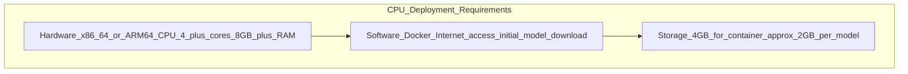

# Docker Deployment

Relevant source files

- [docker/dockerfiles/Dockerfile.onnx.cpu](https://github.com/roboflow/inference/blob/55f57676/docker/dockerfiles/Dockerfile.onnx.cpu)
- [docker/dockerfiles/Dockerfile.onnx.cpu.dev](https://github.com/roboflow/inference/blob/55f57676/docker/dockerfiles/Dockerfile.onnx.cpu.dev)
- [docker/dockerfiles/Dockerfile.onnx.cpu.parallel](https://github.com/roboflow/inference/blob/55f57676/docker/dockerfiles/Dockerfile.onnx.cpu.parallel)
- [docker/dockerfiles/Dockerfile.onnx.cpu.slim](https://github.com/roboflow/inference/blob/55f57676/docker/dockerfiles/Dockerfile.onnx.cpu.slim)
- [docker/dockerfiles/Dockerfile.onnx.cpu.stream_manager](https://github.com/roboflow/inference/blob/55f57676/docker/dockerfiles/Dockerfile.onnx.cpu.stream_manager)
- [docker/dockerfiles/Dockerfile.stream_management_api](https://github.com/roboflow/inference/blob/55f57676/docker/dockerfiles/Dockerfile.stream_management_api)


## Overview of Docker Deployment Options

Roboflow Inference provides multiple Docker images optimized for different environments and use cases. The following diagram illustrates the available deployment options:


## Standard Deployment Images

### CPU Deployment

The CPU deployment option is suitable for environments without GPU acceleration. It uses ONNX Runtime optimized for CPU execution.

**Key features:**

- Base image: `python:3.9`
- Runtime: ONNX Runtime CPU
- Port: 9001 (default)
- Support for all Roboflow models with CPU execution

**Deployment command:**

```
docker run -p 9001:9001 roboflow/roboflow-inference-server-cpu
```

Sources: [docker/dockerfiles/Dockerfile.onnx.cpu1-81](https://github.com/roboflow/inference/blob/55f57676/docker/dockerfiles/Dockerfile.onnx.cpu#L1-L81)

## Specialized Variants

### Slim Images

Slim images are reduced-size variants with fewer pre-installed models and dependencies, optimized for smaller container size and faster startup.

**Available for:**

- CPU: `roboflow/roboflow-inference-server-cpu:slim`
- Lambda: `roboflow/roboflow-inference-server-lambda:slim`

**Key differences:**

- Core models disabled by default (CLIP, SAM, etc.)
- Smaller image size
- Faster container startup time
- Reduced memory footprint

### Parallel Processing Images

Parallel images are designed for high-throughput scenarios, using Redis and Celery for parallel task processing.

**Available for:**

- CPU: `roboflow/roboflow-inference-server-cpu:parallel`

**Key features:**

- Redis for task queue management
- Celery for distributed task processing
- Pre-processing and post-processing queues
- Higher throughput for multiple simultaneous requests


### Development Images

Development images include additional tools for development and debugging purposes.

**Available for:**

- CPU: `roboflow/roboflow-inference-server-cpu:dev`

**Key features:**

- JupyterLab included for interactive development
- File watching for auto-reloading during code changes
- All model dependencies pre-installed
- Useful for extending or customizing the inference server

Sources: [docker/dockerfiles/Dockerfile.onnx.cpu.dev1-82](https://github.com/roboflow/inference/blob/55f57676/docker/dockerfiles/Dockerfile.onnx.cpu.dev#L1-L82) [docker/dockerfiles/Dockerfile.onnx.gpu.dev1-83](https://github.com/roboflow/inference/blob/55f57676/docker/dockerfiles/Dockerfile.onnx.gpu.dev#L1-L83)

## Configuration and Environment Variables

The Roboflow Inference Docker images are highly configurable through environment variables. Here are the most important ones:

|Environment Variable|Description|Default|
|---|---|---|
|`NUM_WORKERS`|Number of Uvicorn workers|1|
|`HOST`|Host address to bind|0.0.0.0|
|`PORT`|Port to expose|9001|
|`WORKFLOWS_STEP_EXECUTION_MODE`|Workflow execution mode|local|
|`WORKFLOWS_MAX_CONCURRENT_STEPS`|Max concurrent workflow steps|4 (CPU/GPU), 2 (Jetson)|
|`API_LOGGING_ENABLED`|Enable API logging|True|
|`CORE_MODEL_*_ENABLED`|Enable specific foundation models|Varies by image|
|`ENABLE_STREAM_API`|Enable video streaming API|True (except Lambda)|
|`ENABLE_PROMETHEUS`|Enable Prometheus metrics|True|
|`ONNXRUNTIME_EXECUTION_PROVIDERS`|ONNX runtime providers|TensorrtExecutionProvider (TRT only)|

**Model-specific flags:**

- `CORE_MODEL_SAM_ENABLED`: Enable Segment Anything Model
- `CORE_MODEL_SAM2_ENABLED`: Enable SAM2 Model
- `CORE_MODEL_CLIP_ENABLED`: Enable CLIP Model
- `CORE_MODEL_OWLV2_ENABLED`: Enable OwlV2 Model
- `CORE_MODEL_GAZE_ENABLED`: Enable Gaze Detection Model
- `CORE_MODEL_DOCTR_ENABLED`: Enable Document OCR Model
- `LMM_ENABLED`: Enable Language-Vision Models

Sources: [docker/dockerfiles/Dockerfile.onnx.cpu66-79](https://github.com/roboflow/inference/blob/55f57676/docker/dockerfiles/Dockerfile.onnx.cpu#L66-L79) [docker/dockerfiles/Dockerfile.onnx.gpu90-103](https://github.com/roboflow/inference/blob/55f57676/docker/dockerfiles/Dockerfile.onnx.gpu#L90-L103) [docker/dockerfiles/Dockerfile.onnx.trt55-71](https://github.com/roboflow/inference/blob/55f57676/docker/dockerfiles/Dockerfile.onnx.trt#L55-L71)

## Runtime Requirements

The hardware requirements vary based on the deployment option:

### CPU Deployment



## Deployment Examples

### Basic CPU Deployment

```
docker run -d --name inference-cpu \
  -p 9001:9001 \
  -e NUM_WORKERS=2 \
  roboflow/roboflow-inference-server-cpu
```

### Parallel Processing Deployment for High Throughput

```
docker run -d --name inference-parallel \
  --gpus all \
  -p 9001:9001 \
  -e NUM_CELERY_WORKERS=8 \
  roboflow/roboflow-inference-server-gpu:parallel
```

## Building Custom Images

You can build custom Docker images by modifying the Dockerfiles in the repository:

```
# Clone the repository
git clone https://github.com/roboflow/inference.git
cd inference

# Build a custom CPU image
docker build -f docker/dockerfiles/Dockerfile.onnx.cpu -t custom-inference-cpu .

# Build a custom GPU image
docker build -f docker/dockerfiles/Dockerfile.onnx.gpu -t custom-inference-gpu .
```

This is useful when you need to:

- Add custom dependencies
- Modify default configuration
- Pre-install specific models
- Optimize for specific hardware

Sources: All Dockerfiles

## Troubleshooting Common Issues

|Issue|Possible Cause|Solution|
|---|---|---|
|Container fails to start|Insufficient memory|Increase available memory or use a slim image variant|
|GPU not detected|Missing NVIDIA drivers or container toolkit|Install NVIDIA drivers and container toolkit|
|Slow model loading|Cold start with large models|Use volume mounts to persist model cache between runs|
|Out of memory errors|Too many models loaded or insufficient GPU memory|Use smaller models, reduce batch size, or upgrade hardware|
|Connection refused|Incorrect port mapping|Check port configuration and firewall settings|

Sources: [docker/dockerfiles/Dockerfile.onnx.cpu](https://github.com/roboflow/inference/blob/55f57676/docker/dockerfiles/Dockerfile.onnx.cpu) 

## Summary

Roboflow Inference provides multiple Docker deployment options tailored for different environments and use cases. By choosing the appropriate image and configuration, you can optimize for your specific hardware, throughput requirements, and model needs.

For detailed information on hardware optimizations and supported platforms, refer to the [Hardware Support](https://deepwiki.com/roboflow/inference/4.2-video-sources-and-multiplexing) page.