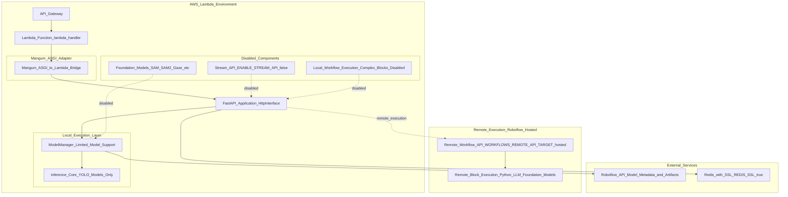
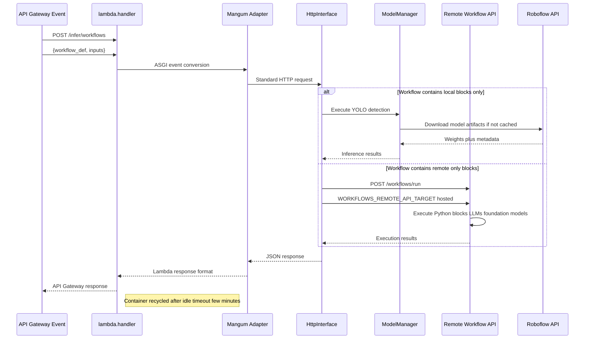
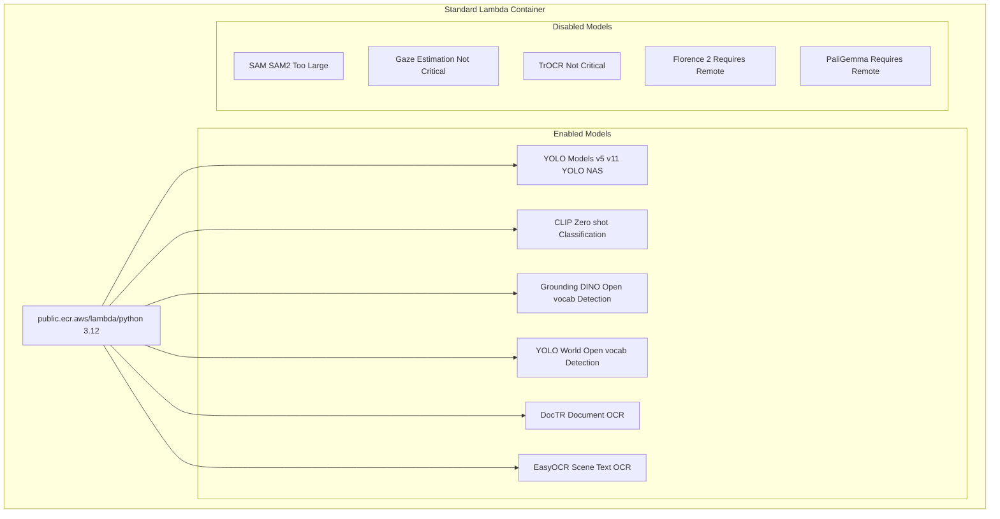
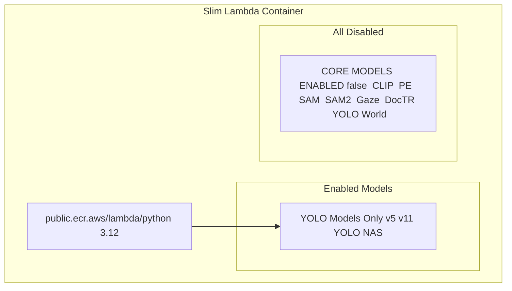
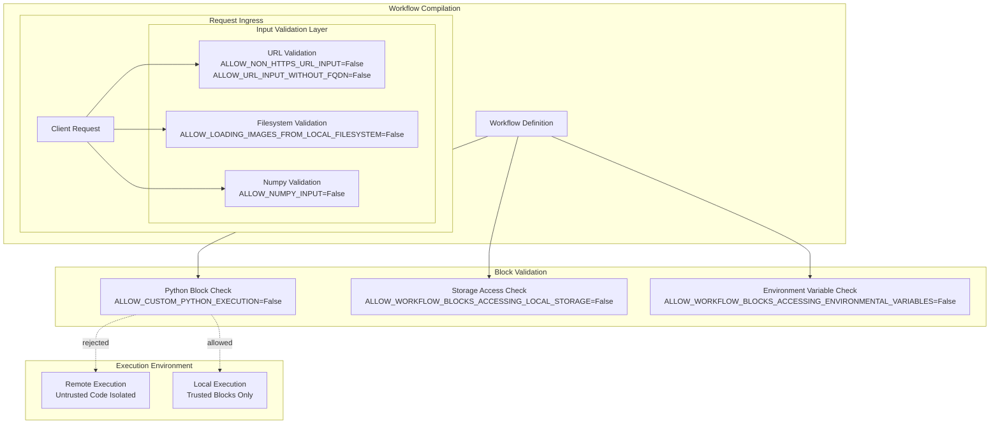
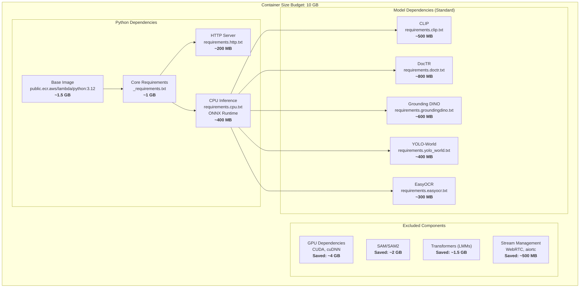

# Serverless Deployment

Relevant source files


## Purpose and Scope

This document describes AWS Lambda deployment of the Roboflow Inference server for serverless, event-driven inference workloads. Lambda deployment provides automatic scaling, pay-per-request pricing, and zero infrastructure management at the cost of container size limitations and cold start latency.

For Docker-based deployments with persistent containers, see [Docker Containers](https://deepwiki.com/roboflow/inference/6.1-docker-containers). For hardware-specific optimizations (GPU, Jetson), see [Hardware Targets](https://deepwiki.com/roboflow/inference/6.2-hardware-targets). For distributed processing with Redis and Celery, see [Parallel Processing Architecture](https://deepwiki.com/roboflow/inference/6.4-parallel-processing-architecture).

**Key Characteristics:**

- 10 GB container size limit (AWS Lambda constraint)
- Remote workflow execution to minimize container footprint
- Strict security restrictions for multi-tenant hosted environments
- Two variants: standard (with foundation models) and slim (minimal footprint)
- Event-driven invocation via API Gateway or direct Lambda invocation

## Architecture Overview

Lambda deployments use a specialized architecture that differs significantly from long-running Docker containers. The inference server runs as a request-scoped Lambda function, with complex operations delegated to remote execution endpoints.


**Sources:** [docker/dockerfiles/Dockerfile.onnx.lambda1-88](https://github.com/roboflow/inference/blob/55f57676/docker/dockerfiles/Dockerfile.onnx.lambda#L1-L88) [docker/dockerfiles/Dockerfile.onnx.lambda.slim1-80](https://github.com/roboflow/inference/blob/55f57676/docker/dockerfiles/Dockerfile.onnx.lambda.slim#L1-L80)

### Request Flow


**Sources:** [docker/dockerfiles/Dockerfile.onnx.lambda52-56](https://github.com/roboflow/inference/blob/55f57676/docker/dockerfiles/Dockerfile.onnx.lambda#L52-L56) [docker/dockerfiles/Dockerfile.onnx.lambda60](https://github.com/roboflow/inference/blob/55f57676/docker/dockerfiles/Dockerfile.onnx.lambda#L60-L60) [docker/dockerfiles/Dockerfile.onnx.lambda70-71](https://github.com/roboflow/inference/blob/55f57676/docker/dockerfiles/Dockerfile.onnx.lambda#L70-L71)

## Container Variants

Lambda deployments provide two Dockerfile variants optimized for different size/capability trade-offs.

### Standard Lambda Container

The standard variant supports YOLO-based object detection models plus select foundation models within Lambda's 10 GB container limit.




**Configuration:**

|Setting|Value|Reason|
|---|---|---|
|`CORE_MODEL_SAM_ENABLED`|`False`|Model size exceeds Lambda limits|
|`CORE_MODEL_SAM2_ENABLED`|`False`|Model size exceeds Lambda limits|
|`CORE_MODEL_TROCR_ENABLED`|`false`|Not critical for most workflows|
|`DEPTH_ESTIMATION_ENABLED`|`False`|Not critical for most workflows|

**Sources:** [docker/dockerfiles/Dockerfile.onnx.lambda22-32](https://github.com/roboflow/inference/blob/55f57676/docker/dockerfiles/Dockerfile.onnx.lambda#L22-L32) [docker/dockerfiles/Dockerfile.onnx.lambda39-56](https://github.com/roboflow/inference/blob/55f57676/docker/dockerfiles/Dockerfile.onnx.lambda#L39-L56) [docker/dockerfiles/Dockerfile.onnx.lambda63-64](https://github.com/roboflow/inference/blob/55f57676/docker/dockerfiles/Dockerfile.onnx.lambda#L63-L64) [docker/dockerfiles/Dockerfile.onnx.lambda82-83](https://github.com/roboflow/inference/blob/55f57676/docker/dockerfiles/Dockerfile.onnx.lambda#L82-L83)

### Slim Lambda Container

The slim variant disables all foundation models, supporting only YOLO-based detection and classification. This minimizes container size for deployments that rely heavily on remote workflow execution.



**Configuration:**

|Setting|Value|Purpose|
|---|---|---|
|`CORE_MODEL_CLIP_ENABLED`|`false`|Minimize container size|
|`CORE_MODEL_PE_ENABLED`|`false`|Minimize container size|
|`CORE_MODEL_SAM_ENABLED`|`false`|Minimize container size|
|`CORE_MODEL_SAM2_ENABLED`|`false`|Minimize container size|
|`CORE_MODEL_GAZE_ENABLED`|`false`|Minimize container size|
|`CORE_MODEL_DOCTR_ENABLED`|`false`|Minimize container size|
|`CORE_MODEL_YOLO_WORLD_ENABLED`|`false`|Minimize container size|
|`CORE_MODELS_ENABLED`|`false`|Global disable flag|

**Sources:** [docker/dockerfiles/Dockerfile.onnx.lambda.slim21-27](https://github.com/roboflow/inference/blob/55f57676/docker/dockerfiles/Dockerfile.onnx.lambda.slim#L21-L27) [docker/dockerfiles/Dockerfile.onnx.lambda.slim32-43](https://github.com/roboflow/inference/blob/55f57676/docker/dockerfiles/Dockerfile.onnx.lambda.slim#L32-L43) [docker/dockerfiles/Dockerfile.onnx.lambda.slim51-58](https://github.com/roboflow/inference/blob/55f57676/docker/dockerfiles/Dockerfile.onnx.lambda.slim#L51-L58)

## Remote Workflow Execution

Lambda deployments execute complex workflow blocks remotely to avoid exceeding container size limits and enable capabilities that require heavy dependencies (large language models, specialized foundation models).

### Execution Mode Configuration

```mermaid
flowchart TB

%% ---------------- Configuration ----------------
subgraph Configuration
  execMode["WORKFLOWS_STEP_EXECUTION_MODE=remote"]
  remoteTarget["WORKFLOWS_REMOTE_API_TARGET=hosted"]
  remoteAPI["POST /workflows/run"]

  execMode --> remoteAPI
  remoteTarget --> remoteAPI
end

%% -------- Workflow Block Classification --------
subgraph "Workflow Block Classification"
  %% Remote-capable blocks
  subgraph "Remote Block Types"
    pyBlock["Python Execution Block\nALLOW_CUSTOM_PYTHON_EXECUTION=false"]
    lmmBlock["Large Multimodal Models\nFlorence-2, PaliGemma, Qwen"]
    samBlock["SAM/SAM2 Segmentation\nModels too large"]
    customML["Custom ML Models\nUser-defined endpoints"]
  end

  %% Local/lightweight blocks
  subgraph "Local Block Types"
    imgIn["InferenceImage"]
    yoloDet["YOLO Object Detection"]
    detFilter["Detections Filter"]
    imgCrop["Image Crop"]
    detConsensus["Detections Consensus"]
  end

  remoteExec["Remote Execution\nComplex, Heavy Blocks"]
  localExec["Local Execution\nSimple, Lightweight Blocks"]

  %% Classify blocks
  pyBlock --> remoteExec
  lmmBlock --> remoteExec
  samBlock --> remoteExec
  customML --> remoteExec

  imgIn --> localExec
  yoloDet --> localExec
  detFilter --> localExec
  imgCrop --> localExec
  detConsensus --> localExec
end

%% -------- Execution routing --------
remoteExec --> remoteAPI
localExec --> localRunner["Local Lambda Execution"]
```



**Sources:** [docker/dockerfiles/Dockerfile.onnx.lambda70-71](https://github.com/roboflow/inference/blob/55f57676/docker/dockerfiles/Dockerfile.onnx.lambda#L70-L71) [docker/dockerfiles/Dockerfile.onnx.lambda.slim64-65](https://github.com/roboflow/inference/blob/55f57676/docker/dockerfiles/Dockerfile.onnx.lambda.slim#L64-L65)

### Remote Execution Strategy

The workflow compiler analyzes workflow definitions and splits execution:

1. **Local Execution**: Lightweight blocks (image preprocessing, YOLO inference, bounding box filtering) execute within the Lambda container
2. **Remote Execution**: Heavy blocks (Python code execution, LLMs, foundation models) are proxied to the hosted Roboflow API
3. **Data Transfer**: Only necessary data (images, intermediate results) is serialized and sent to remote endpoints
4. **Result Aggregation**: Local and remote results are merged into a single workflow response

This strategy enables Lambda deployments to support the full 100+ block catalog while staying within the 10 GB container limit.

**Sources:** [docker/dockerfiles/Dockerfile.onnx.lambda70-71](https://github.com/roboflow/inference/blob/55f57676/docker/dockerfiles/Dockerfile.onnx.lambda#L70-L71)

## Security Restrictions

Lambda deployments run in multi-tenant hosted environments and enforce strict security constraints to prevent unauthorized access and resource abuse.

### Security Configuration Matrix

|Category|Setting|Value|Enforcement Point|
|---|---|---|---|
|**Input Validation**|`ALLOW_NUMPY_INPUT`|`False`|Request deserialization|
||`ALLOW_NON_HTTPS_URL_INPUT`|`False`|Image loading|
||`ALLOW_URL_INPUT_WITHOUT_FQDN`|`False`|Image loading|
||`ALLOW_LOADING_IMAGES_FROM_LOCAL_FILESYSTEM`|`False`|Image loading|
|**Workflow Execution**|`ALLOW_CUSTOM_PYTHON_EXECUTION_IN_WORKFLOWS`|`False`|Workflow compiler|
||`ALLOW_WORKFLOW_BLOCKS_ACCESSING_LOCAL_STORAGE`|`False`|Block execution|
||`ALLOW_WORKFLOW_BLOCKS_ACCESSING_ENVIRONMENTAL_VARIABLES`|`False`|Block execution|
||`USE_FILE_CACHE_FOR_WORKFLOWS_DEFINITIONS`|`False`|Workflow loading|
|**Model Validation**|`MODEL_VALIDATION_DISABLED`|`True`|Skip expensive checks|



### Security Rationale

These restrictions prevent common attack vectors in serverless environments:

- **No numpy input**: Prevents deserialization attacks via malicious pickle payloads
- **HTTPS-only URLs**: Prevents exposure of internal network resources
- **FQDN-only URLs**: Prevents SSRF attacks against AWS metadata endpoints (`http://169.254.169.254`)
- **No local filesystem**: Prevents reading Lambda container secrets or temporary credentials
- **No custom Python**: Prevents arbitrary code execution (delegated to isolated remote environment)
- **No environment variables**: Prevents leaking AWS credentials or API keys

## Size Optimization Strategies

Lambda's 10 GB container limit requires aggressive size optimization. The inference server employs multiple strategies to minimize container footprint.




### Optimization Techniques

**Sources:** [docker/dockerfiles/Dockerfile.onnx.lambda1](https://github.com/roboflow/inference/blob/55f57676/docker/dockerfiles/Dockerfile.onnx.lambda#L1-L1) [docker/dockerfiles/Dockerfile.onnx.lambda22-33](https://github.com/roboflow/inference/blob/55f57676/docker/dockerfiles/Dockerfile.onnx.lambda#L22-L33) [docker/dockerfiles/Dockerfile.onnx.lambda39-56](https://github.com/roboflow/inference/blob/55f57676/docker/dockerfiles/Dockerfile.onnx.lambda#L39-L56)

### Dependency Exclusions

**GPU Dependencies Removed:**

- No CUDA toolkit installation
- No cuDNN libraries
- No TensorRT
- CPU-only PyTorch via `--extra-index-url https://download.pytorch.org/whl/cpu`

**Model Dependencies Excluded:**

- SAM/SAM2: ~2 GB of model weights
- Transformers with flash attention: ~1.5 GB
- Stream management libraries: ~500 MB

### Platform-Specific Optimizations


## Configuration Reference

### Core Lambda Settings

|Environment Variable|Value|Purpose|
|---|---|---|
|`LAMBDA`|`True`|Enables Lambda-specific code paths|
|`INFERENCE_SERVER_ID`|`HostedInferenceLambda`|Telemetry identifier|
|`DISABLE_VERSION_CHECK`|`true`|Skip update checks (no internet egress)|

**Sources:** [docker/dockerfiles/Dockerfile.onnx.lambda62](https://github.com/roboflow/inference/blob/55f57676/docker/dockerfiles/Dockerfile.onnx.lambda#L62-L62) [docker/dockerfiles/Dockerfile.onnx.lambda66](https://github.com/roboflow/inference/blob/55f57676/docker/dockerfiles/Dockerfile.onnx.lambda#L66-L66) [docker/dockerfiles/Dockerfile.onnx.lambda67](https://github.com/roboflow/inference/blob/55f57676/docker/dockerfiles/Dockerfile.onnx.lambda#L67-L67)

### Workflow Execution Settings

|Environment Variable|Value|Purpose|
|---|---|---|
|`WORKFLOWS_STEP_EXECUTION_MODE`|`remote`|Execute complex blocks remotely|
|`WORKFLOWS_REMOTE_API_TARGET`|`hosted`|Use Roboflow hosted API|
|`USE_FILE_CACHE_FOR_WORKFLOWS_DEFINITIONS`|`False`|Prevent file system caching|

**Sources:** [docker/dockerfiles/Dockerfile.onnx.lambda70-71](https://github.com/roboflow/inference/blob/55f57676/docker/dockerfiles/Dockerfile.onnx.lambda#L70-L71) [docker/dockerfiles/Dockerfile.onnx.lambda78](https://github.com/roboflow/inference/blob/55f57676/docker/dockerfiles/Dockerfile.onnx.lambda#L78-L78)

### Performance Tuning

|Environment Variable|Value|Purpose|
|---|---|---|
|`DOCTR_MULTIPROCESSING_DISABLE`|`TRUE`|Prevent process forking in Lambda|
|`REDIS_SSL`|`true`|Use encrypted Redis connections|
|`MODEL_VALIDATION_DISABLED`|`True`|Skip validation for faster cold starts|

**Sources:** [docker/dockerfiles/Dockerfile.onnx.lambda68](https://github.com/roboflow/inference/blob/55f57676/docker/dockerfiles/Dockerfile.onnx.lambda#L68-L68) [docker/dockerfiles/Dockerfile.onnx.lambda69](https://github.com/roboflow/inference/blob/55f57676/docker/dockerfiles/Dockerfile.onnx.lambda#L69-L69) [docker/dockerfiles/Dockerfile.onnx.lambda73](https://github.com/roboflow/inference/blob/55f57676/docker/dockerfiles/Dockerfile.onnx.lambda#L73-L73)

### Security Settings

|Environment Variable|Value|Purpose|
|---|---|---|
|`ALLOW_NUMPY_INPUT`|`False`|Prevent pickle deserialization attacks|
|`ALLOW_NON_HTTPS_URL_INPUT`|`False`|Enforce HTTPS for external resources|
|`ALLOW_URL_INPUT_WITHOUT_FQDN`|`False`|Prevent SSRF attacks|
|`ALLOW_CUSTOM_PYTHON_EXECUTION_IN_WORKFLOWS`|`False`|Disable arbitrary code execution|
|`ALLOW_WORKFLOW_BLOCKS_ACCESSING_LOCAL_STORAGE`|`False`|Prevent file system access|
|`ALLOW_WORKFLOW_BLOCKS_ACCESSING_ENVIRONMENTAL_VARIABLES`|`False`|Prevent credential leaks|
|`ALLOW_LOADING_IMAGES_FROM_LOCAL_FILESYSTEM`|`False`|Prevent file system access|

**Sources:** [docker/dockerfiles/Dockerfile.onnx.lambda65](https://github.com/roboflow/inference/blob/55f57676/docker/dockerfiles/Dockerfile.onnx.lambda#L65-L65) [docker/dockerfiles/Dockerfile.onnx.lambda74-76](https://github.com/roboflow/inference/blob/55f57676/docker/dockerfiles/Dockerfile.onnx.lambda#L74-L76) [docker/dockerfiles/Dockerfile.onnx.lambda76](https://github.com/roboflow/inference/blob/55f57676/docker/dockerfiles/Dockerfile.onnx.lambda#L76-L76) [docker/dockerfiles/Dockerfile.onnx.lambda78-81](https://github.com/roboflow/inference/blob/55f57676/docker/dockerfiles/Dockerfile.onnx.lambda#L78-L81)

### Model Enablement Matrix

**Standard Lambda:**

```
CORE_MODEL_SAM_ENABLED=False
CORE_MODEL_SAM2_ENABLED=False
CORE_MODEL_TROCR_ENABLED=false
DEPTH_ESTIMATION_ENABLED=False
```

**Slim Lambda:**

```
CORE_MODEL_CLIP_ENABLED=false
CORE_MODEL_PE_ENABLED=false
CORE_MODEL_SAM_ENABLED=false
CORE_MODEL_SAM2_ENABLED=false
CORE_MODEL_GAZE_ENABLED=false
CORE_MODEL_DOCTR_ENABLED=false
CORE_MODEL_YOLO_WORLD_ENABLED=false
CORE_MODELS_ENABLED=false
```


## Deployment Process

### Build Commands

**Standard Lambda Container:**

```
docker build -f docker/dockerfiles/Dockerfile.onnx.lambda \
  --platform linux/amd64 \
  -t inference-lambda:latest .
```

**Slim Lambda Container:**

```
docker build -f docker/dockerfiles/Dockerfile.onnx.lambda.slim \
  --platform linux/amd64 \
  -t inference-lambda-slim:latest .
```

**Sources:** [docker/dockerfiles/Dockerfile.onnx.lambda1](https://github.com/roboflow/inference/blob/55f57676/docker/dockerfiles/Dockerfile.onnx.lambda#L1-L1) [docker/dockerfiles/Dockerfile.onnx.lambda.slim1](https://github.com/roboflow/inference/blob/55f57676/docker/dockerfiles/Dockerfile.onnx.lambda.slim#L1-L1)

### AWS Deployment

1. **Push to ECR:**
    
    ```
    aws ecr get-login-password --region us-east-1 | \
      docker login --username AWS --password-stdin <account-id>.dkr.ecr.us-east-1.amazonaws.com
    
    docker tag inference-lambda:latest \
      <account-id>.dkr.ecr.us-east-1.amazonaws.com/inference-lambda:latest
    
    docker push <account-id>.dkr.ecr.us-east-1.amazonaws.com/inference-lambda:latest
    ```
    
2. **Create Lambda Function:**
    
    ```
    aws lambda create-function \
      --function-name inference-lambda \
      --package-type Image \
      --code ImageUri=<account-id>.dkr.ecr.us-east-1.amazonaws.com/inference-lambda:latest \
      --role arn:aws:iam::<account-id>:role/lambda-execution-role \
      --timeout 900 \
      --memory-size 10240
    ```
    
3. **Configure Environment Variables:**
    
    ```
    aws lambda update-function-configuration \
      --function-name inference-lambda \
      --environment Variables='{
        "LAMBDA":"True",
        "WORKFLOWS_STEP_EXECUTION_MODE":"remote",
        "WORKFLOWS_REMOTE_API_TARGET":"hosted",
        "REDIS_SSL":"true"
      }'
    ```
    

**Sources:** [docker/dockerfiles/Dockerfile.onnx.lambda88](https://github.com/roboflow/inference/blob/55f57676/docker/dockerfiles/Dockerfile.onnx.lambda#L88-L88)

### Invocation

**Direct Lambda Invocation:**

```
aws lambda invoke \
  --function-name inference-lambda \
  --payload '{"httpMethod":"POST","path":"/infer/workflows","body":"{\"workflow_definition\":{...}}"}' \
  response.json
```

**API Gateway Integration:** The `mangum` adapter ([docker/dockerfiles/Dockerfile.onnx.lambda52](https://github.com/roboflow/inference/blob/55f57676/docker/dockerfiles/Dockerfile.onnx.lambda#L52-L52)) automatically converts API Gateway events to ASGI requests, enabling standard HTTP endpoints:

```
POST https://<api-id>.execute-api.us-east-1.amazonaws.com/prod/infer/object_detection
POST https://<api-id>.execute-api.us-east-1.amazonaws.com/prod/infer/workflows
GET  https://<api-id>.execute-api.us-east-1.amazonaws.com/prod/info
```

**Sources:** [docker/dockerfiles/Dockerfile.onnx.lambda52](https://github.com/roboflow/inference/blob/55f57676/docker/dockerfiles/Dockerfile.onnx.lambda#L52-L52) [docker/dockerfiles/Dockerfile.onnx.lambda88](https://github.com/roboflow/inference/blob/55f57676/docker/dockerfiles/Dockerfile.onnx.lambda#L88-L88)

## Performance Considerations

### Cold Start Optimization

Lambda cold starts (container initialization time) vary by container size:

|Variant|Container Size|Cold Start Time|Warm Execution Time|
|---|---|---|---|
|Slim|~3 GB|5-8 seconds|50-200 ms|
|Standard|~8 GB|10-15 seconds|50-200 ms|

**Optimization strategies:**

- Use slim variant for latency-sensitive workloads
- Configure provisioned concurrency for predictable latency
- Implement model caching via `/tmp` (512 MB - 10 GB available)
- Disable version checks: `DISABLE_VERSION_CHECK=true`

**Sources:** [docker/dockerfiles/Dockerfile.onnx.lambda67](https://github.com/roboflow/inference/blob/55f57676/docker/dockerfiles/Dockerfile.onnx.lambda#L67-L67)

### Resource Limits

|Resource|Lambda Limit|Recommendation|
|---|---|---|
|Memory|128 MB - 10 GB|4-8 GB for standard, 2-4 GB for slim|
|Timeout|900 seconds max|300-600 seconds for workflows|
|Ephemeral storage (`/tmp`)|512 MB - 10 GB|2-4 GB for model caching|
|Container size|10 GB|Use slim variant if exceeding|

The `/tmp` directory persists between warm invocations, enabling model artifact caching to reduce subsequent latency.

### Workflow Execution Latency

Remote workflow execution adds network latency:

|Execution Mode|Latency Overhead|Use Case|
|---|---|---|
|Local only (YOLO blocks)|0 ms|Simple detection pipelines|
|Mixed (local + remote)|200-500 ms|Workflows with LLM/foundation model blocks|
|Remote heavy|500-2000 ms|Complex multi-stage workflows|

For latency-critical applications, prefer Docker deployments with local workflow execution (see [Docker Containers](https://deepwiki.com/roboflow/inference/6.1-docker-containers)).

**Sources:** [docker/dockerfiles/Dockerfile.onnx.lambda70-71](https://github.com/roboflow/inference/blob/55f57676/docker/dockerfiles/Dockerfile.onnx.lambda#L70-L71)