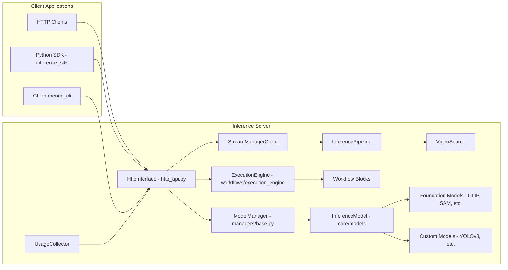
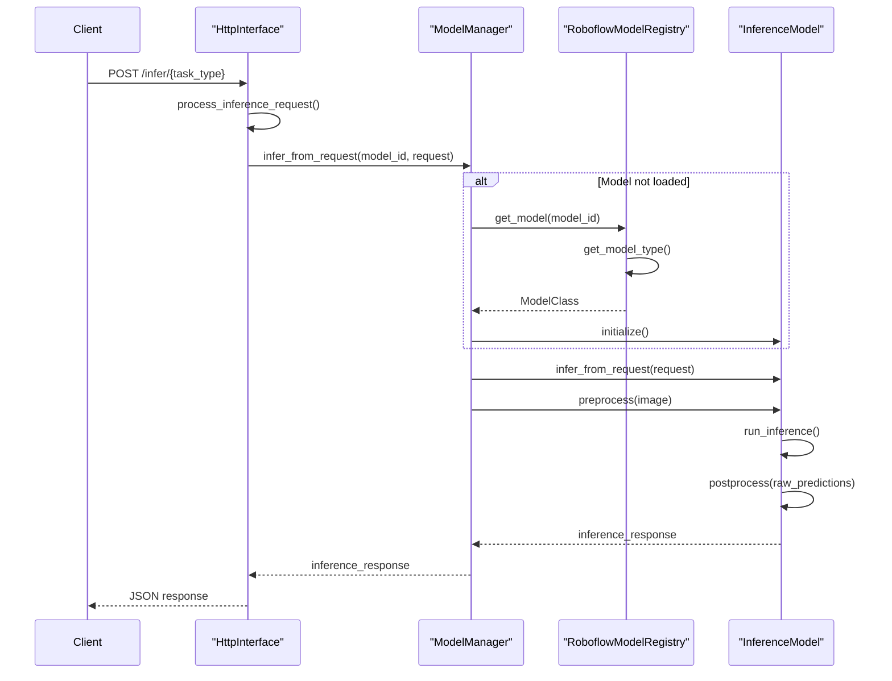
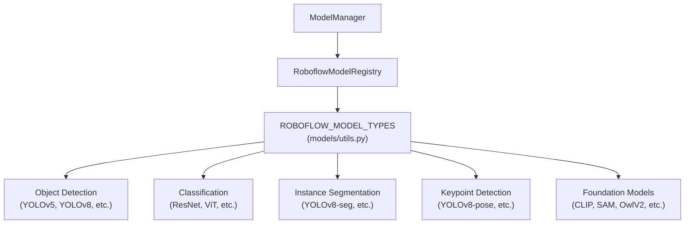
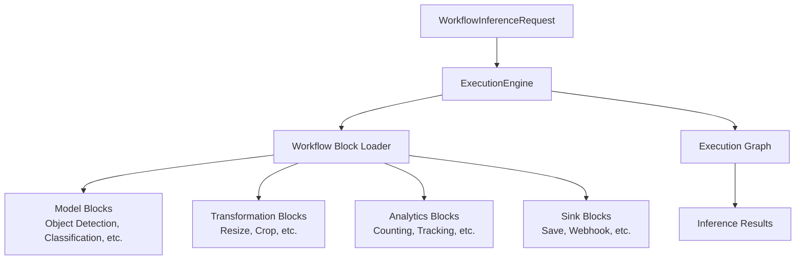
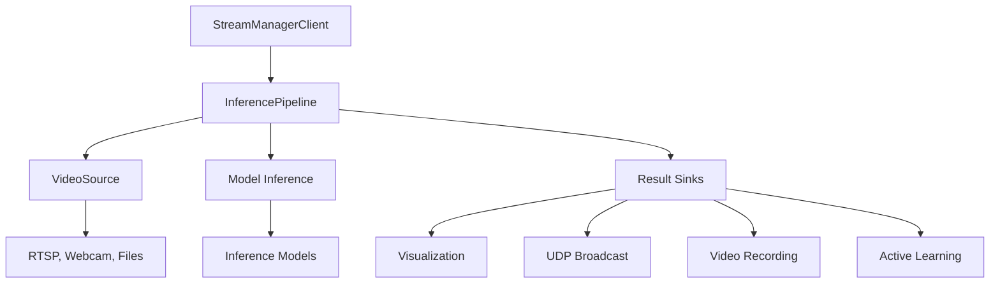

# Overview

Relevant source files

- [.github/workflows/test.jetson_6.0.0.yml](https://github.com/roboflow/inference/blob/55f57676/.github/workflows/test.jetson_6.0.0.yml)
- [README.md](https://github.com/roboflow/inference/blob/55f57676/README.md)
- [docs/index.md](https://github.com/roboflow/inference/blob/55f57676/docs/index.md)
- [docs/quickstart/configure_api_key.md](https://github.com/roboflow/inference/blob/55f57676/docs/quickstart/configure_api_key.md)
- [docs/quickstart/docker.md](https://github.com/roboflow/inference/blob/55f57676/docs/quickstart/docker.md)
- [docs/quickstart/explore_models.md](https://github.com/roboflow/inference/blob/55f57676/docs/quickstart/explore_models.md)
- [docs/quickstart/http_inference.md](https://github.com/roboflow/inference/blob/55f57676/docs/quickstart/http_inference.md)
- [docs/quickstart/inference_101.md](https://github.com/roboflow/inference/blob/55f57676/docs/quickstart/inference_101.md)
- [docs/quickstart/run_a_model.md](https://github.com/roboflow/inference/blob/55f57676/docs/quickstart/run_a_model.md)
- [docs/quickstart/run_model_on_image.md](https://github.com/roboflow/inference/blob/55f57676/docs/quickstart/run_model_on_image.md)
- [docs/quickstart/run_model_on_rtsp_webcam.md](https://github.com/roboflow/inference/blob/55f57676/docs/quickstart/run_model_on_rtsp_webcam.md)
- [docs/quickstart/run_model_over_udp.md](https://github.com/roboflow/inference/blob/55f57676/docs/quickstart/run_model_over_udp.md)
- [docs/styles.css](https://github.com/roboflow/inference/blob/55f57676/docs/styles.css)
- [docs/using_inference/http_api.md](https://github.com/roboflow/inference/blob/55f57676/docs/using_inference/http_api.md)
- [docs/using_inference/native_python_api.md](https://github.com/roboflow/inference/blob/55f57676/docs/using_inference/native_python_api.md)
- [examples/inference-client/README.md](https://github.com/roboflow/inference/blob/55f57676/examples/inference-client/README.md)
- [inference/core/cache/model_artifacts.py](https://github.com/roboflow/inference/blob/55f57676/inference/core/cache/model_artifacts.py)
- [inference/core/env.py](https://github.com/roboflow/inference/blob/55f57676/inference/core/env.py)
- [inference/core/interfaces/http/http_api.py](https://github.com/roboflow/inference/blob/55f57676/inference/core/interfaces/http/http_api.py)
- [inference/core/managers/base.py](https://github.com/roboflow/inference/blob/55f57676/inference/core/managers/base.py)
- [inference/core/managers/decorators/base.py](https://github.com/roboflow/inference/blob/55f57676/inference/core/managers/decorators/base.py)
- [inference/core/managers/decorators/fixed_size_cache.py](https://github.com/roboflow/inference/blob/55f57676/inference/core/managers/decorators/fixed_size_cache.py)
- [inference/core/managers/decorators/logger.py](https://github.com/roboflow/inference/blob/55f57676/inference/core/managers/decorators/logger.py)
- [inference/core/models/base.py](https://github.com/roboflow/inference/blob/55f57676/inference/core/models/base.py)
- [inference/core/models/roboflow.py](https://github.com/roboflow/inference/blob/55f57676/inference/core/models/roboflow.py)
- [inference/core/models/stubs.py](https://github.com/roboflow/inference/blob/55f57676/inference/core/models/stubs.py)
- [inference/core/registries/roboflow.py](https://github.com/roboflow/inference/blob/55f57676/inference/core/registries/roboflow.py)
- [inference/core/roboflow_api.py](https://github.com/roboflow/inference/blob/55f57676/inference/core/roboflow_api.py)
- [inference/core/utils/roboflow.py](https://github.com/roboflow/inference/blob/55f57676/inference/core/utils/roboflow.py)
- [inference/core/utils/visualisation.py](https://github.com/roboflow/inference/blob/55f57676/inference/core/utils/visualisation.py)
- [inference/core/version.py](https://github.com/roboflow/inference/blob/55f57676/inference/core/version.py)
- [inference/models/__init__.py](https://github.com/roboflow/inference/blob/55f57676/inference/models/__init__.py)
- [inference/models/utils.py](https://github.com/roboflow/inference/blob/55f57676/inference/models/utils.py)
- [inference_cli/README.md](https://github.com/roboflow/inference/blob/55f57676/inference_cli/README.md)
- [mkdocs.yml](https://github.com/roboflow/inference/blob/55f57676/mkdocs.yml)
- [tests/inference/unit_tests/core/cache/__init__.py](https://github.com/roboflow/inference/blob/55f57676/tests/inference/unit_tests/core/cache/__init__.py)
- [tests/inference/unit_tests/core/cache/test_model_artifacts.py](https://github.com/roboflow/inference/blob/55f57676/tests/inference/unit_tests/core/cache/test_model_artifacts.py)
- [tests/inference/unit_tests/core/models/test_roboflow.py](https://github.com/roboflow/inference/blob/55f57676/tests/inference/unit_tests/core/models/test_roboflow.py)

Roboflow Inference is an open-source computer vision deployment framework designed to run models on a wide range of hardware, from cloud servers to edge devices. It provides a consistent API for running inference with various model architectures while handling the complexities of model loading, preprocessing, batching, and hardware acceleration.

For deployment options and hardware requirements, see [Deployment](https://deepwiki.com/roboflow/inference/4-stream-processing), and for client interfaces, see [SDK and CLI](https://deepwiki.com/roboflow/inference/5-model-ecosystem).

## System Architecture

Roboflow Inference uses a modular architecture that separates concerns between model management, API serving, workflow execution, and stream processing.

Sources: [inference/core/interfaces/http/http_api.py543-569](https://github.com/roboflow/inference/blob/55f57676/inference/core/interfaces/http/http_api.py#L543-L569) [inference/core/managers/base.py](https://github.com/roboflow/inference/blob/55f57676/inference/core/managers/base.py) [inference/models/__init__.py16-45](https://github.com/roboflow/inference/blob/55f57676/inference/models/__init__.py#L16-L45)

The primary components include:

1. **HTTP API Interface**: Handles requests, routes them to appropriate handlers, manages authentication, and returns responses
2. **Model Manager**: Loads, initializes, and caches models for inference
3. **Workflow Engine**: Executes complex inference pipelines defined as workflows
4. **Stream Manager**: Processes video inputs for real-time inference

## Core Components

### HTTP API Interface

The HTTP API provides a RESTful interface for interacting with the inference system through the `HttpInterface` class. It's built using FastAPI and handles request routing, validation, and comprehensive error handling.

Sources: [inference/core/interfaces/http/http_api.py773-791](https://github.com/roboflow/inference/blob/55f57676/inference/core/interfaces/http/http_api.py#L773-L791) [inference/core/registries/roboflow.py65-88](https://github.com/roboflow/inference/blob/55f57676/inference/core/registries/roboflow.py#L65-L88)

The API supports multiple inference tasks through specialized request and response models:

|Task Type|Request Model|Response Model|
|---|---|---|
|Object Detection|`ObjectDetectionInferenceRequest`|`ObjectDetectionInferenceResponse`|
|Classification|`ClassificationInferenceRequest`|`ClassificationInferenceResponse`|
|Instance Segmentation|`InstanceSegmentationInferenceRequest`|`InstanceSegmentationInferenceResponse`|
|Keypoint Detection|`KeypointsDetectionInferenceRequest`|`KeypointsDetectionInferenceResponse`|
|Depth Estimation|`DepthEstimationRequest`|`DepthEstimationResponse`|
|LMM (Large Multimodal Models)|`LMMInferenceRequest`|`LMMInferenceResponse`|

Sources: [inference/core/entities/requests/inference.py31-270](https://github.com/roboflow/inference/blob/55f57676/inference/core/entities/requests/inference.py#L31-L270) [inference/core/entities/responses/inference.py8-349](https://github.com/roboflow/inference/blob/55f57676/inference/core/entities/responses/inference.py#L8-L349)

### Model Management

The Model Manager system loads, initializes, and caches computer vision models for inference. It supports a comprehensive registry of model types through the `RoboflowModelRegistry` class.

Sources: [inference/models/utils.py45-245](https://github.com/roboflow/inference/blob/55f57676/inference/models/utils.py#L45-L245) [inference/core/registries/roboflow.py46-60](https://github.com/roboflow/inference/blob/55f57676/inference/core/registries/roboflow.py#L46-L60)

The system supports lazy loading of models through a registry pattern, allowing efficient memory usage by only loading models when needed. Models are accessed via the `get_model` function, which handles model type resolution and initialization.

### Workflow System

The Workflow System enables creating complex inference pipelines by chaining together various processing steps. A workflow is defined as a directed acyclic graph (DAG) of processing blocks, executed by the `ExecutionEngine`.

Sources: [inference/core/interfaces/http/http_api.py793-833](https://github.com/roboflow/inference/blob/55f57676/inference/core/interfaces/http/http_api.py#L793-L833) [inference/core/workflows/execution_engine/core.py](https://github.com/roboflow/inference/blob/55f57676/inference/core/workflows/execution_engine/core.py)

Workflows can be defined using JSON/YAML and executed through the HTTP API or Python SDK. The system includes built-in blocks for common tasks and supports custom blocks for specialized needs.

### Stream Processing

The Stream Processing system handles video inputs for real-time inference, supporting various sources like webcams, RTSP streams, and video files.

Sources: [inference/core/interfaces/http/http_api.py761-771](https://github.com/roboflow/inference/blob/55f57676/inference/core/interfaces/http/http_api.py#L761-L771)

The system is designed for efficient processing of video streams, with support for batching, hardware acceleration, and various output options.

## Supported Models

Inference supports a wide range of model architectures:

1. **Object Detection**:
    
    - YOLOv5, YOLOv7, YOLOv8, YOLOv9, YOLOv10, YOLOv11, YOLOv12
    - YOLO-NAS
    - RFDETR
    - GroundingDINO
    - YOLO-World
    - OwlV2
2. **Classification**:
    
    - ResNet (18, 34, 50, 101)
    - ViT (Vision Transformer)
    - YOLOv8 Classification
3. **Instance Segmentation**:
    
    - YOLOv5-seg, YOLOv7-seg, YOLOv8-seg, YOLOv11-seg
    - YOLACT
    - Segment Anything Model (SAM/SAM2)
4. **Keypoint Detection**:
    
    - YOLOv8-pose, YOLOv11-pose
5. **Foundation Models**:
    
    - CLIP (Contrastive Language-Image Pre-training)
    - SAM/SAM2 (Segment Anything)
    - Gaze Detection (L2CS)
    - DocTR and TrOCR (OCR)
    - Depth Anything V2 (Depth Estimation)
    - Large Multimodal Models (Moondream2, SmolVLM2, PaliGemma, Florence-2)

Sources: [inference/models/__init__.py18-45](https://github.com/roboflow/inference/blob/55f57676/inference/models/__init__.py#L18-L45) [inference/models/utils.py45-245](https://github.com/roboflow/inference/blob/55f57676/inference/models/utils.py#L45-L245)

## Deployment Options

Inference can be deployed in various environments:

Sources: [inference/core/env.py228-571](https://github.com/roboflow/inference/blob/55f57676/inference/core/env.py#L228-L571) [mkdocs.yml166-180](https://github.com/roboflow/inference/blob/55f57676/mkdocs.yml#L166-L180)

The system is containerized using Docker, with specialized images for different environments:

- **CPU**: For standard servers or computers without GPUs
- **GPU**: For acceleration using NVIDIA GPUs with CUDA
- **Jetson**: For NVIDIA Jetson devices
- **Cloud Services**: For deployment in AWS Lambda, GCP, or other cloud environments

## Client Interfaces

Roboflow Inference provides multiple ways to interact with the system:

1. **Python SDK** (`inference_sdk`): A client library for making HTTP requests to the Inference server
2. **Command Line Interface** (`inference_cli`): For managing the Inference server and running inference from the command line
3. **HTTP API**: A REST API for integration with any language or system
4. **Native Python API** (`inference`): For direct integration in Python applications

Sources: [inference_cli/README.md20-26](https://github.com/roboflow/inference/blob/55f57676/inference_cli/README.md#L20-L26) [README.md144-186](https://github.com/roboflow/inference/blob/55f57676/README.md#L144-L186)

## Configuration

The system is highly configurable through environment variables, allowing customization of:

- Hardware acceleration options (CUDA, TensorRT, etc.)
- Model caching behavior
- API authentication
- Preprocessing parameters
- Foundation model options
- Stream processing settings

Key environment variables include:

- `ROBOFLOW_API_KEY`: API key for accessing private models
- `ONNXRUNTIME_EXECUTION_PROVIDERS`: Specifies hardware acceleration options
- `MAX_ACTIVE_MODELS`: Controls the number of models kept in memory
- `CORE_MODELS_ENABLED`: Enables/disables foundation models

Sources: [inference/core/env.py17-571](https://github.com/roboflow/inference/blob/55f57676/inference/core/env.py#L17-L571)

## Current Version

The current version of Roboflow Inference is `0.47.0`.

Sources: [inference/core/version.py1](https://github.com/roboflow/inference/blob/55f57676/inference/core/version.py#L1-L1)

This overview provides a high-level understanding of the Roboflow Inference system. For more detailed information on specific components, please refer to the corresponding sections in the documentation.