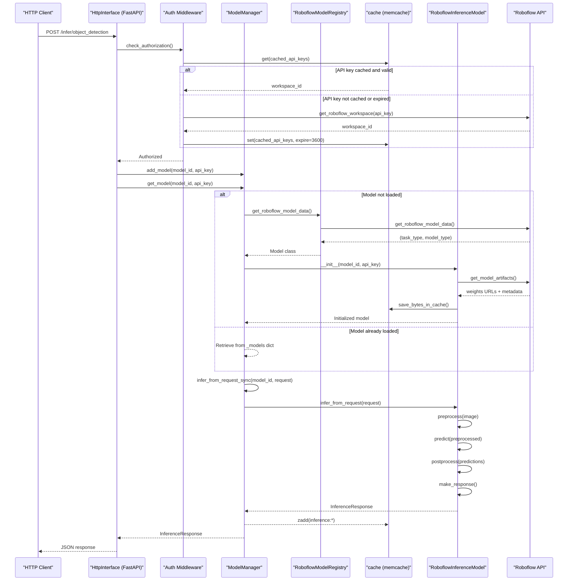
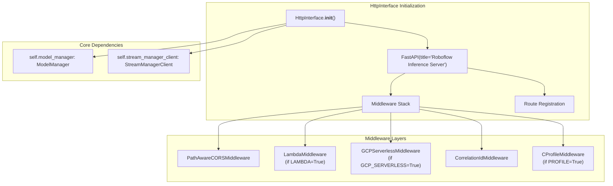
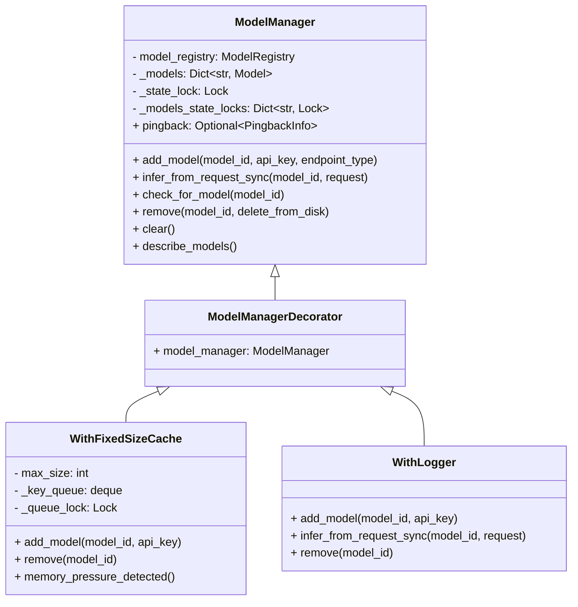
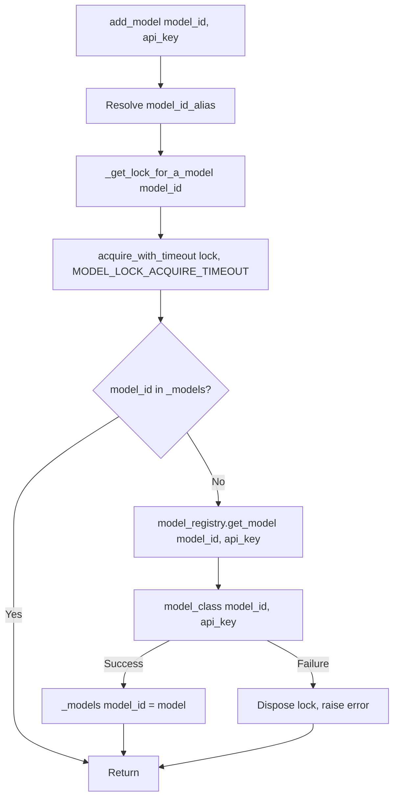
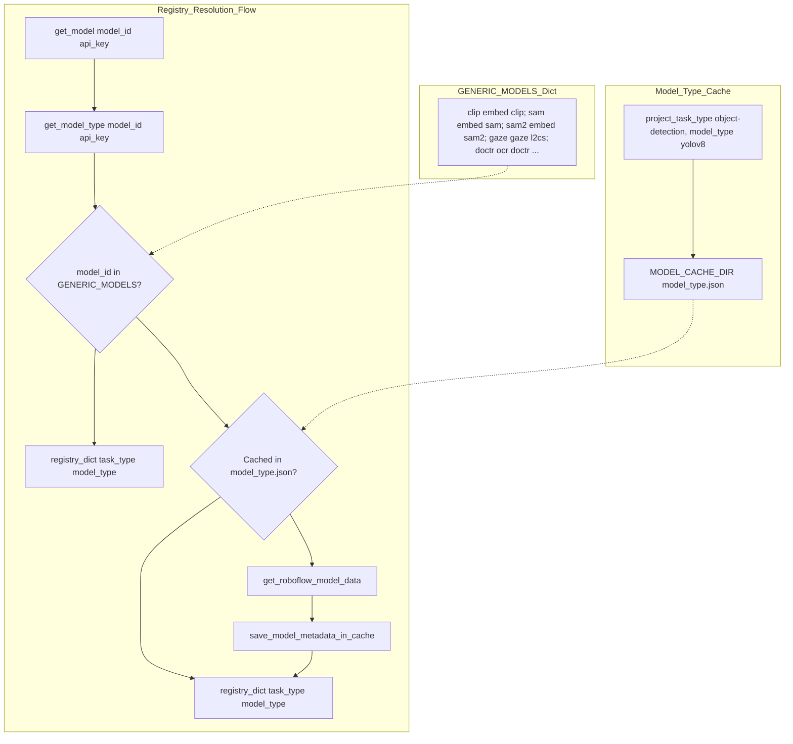
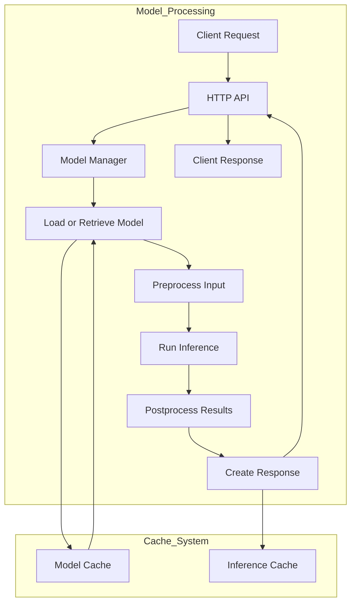
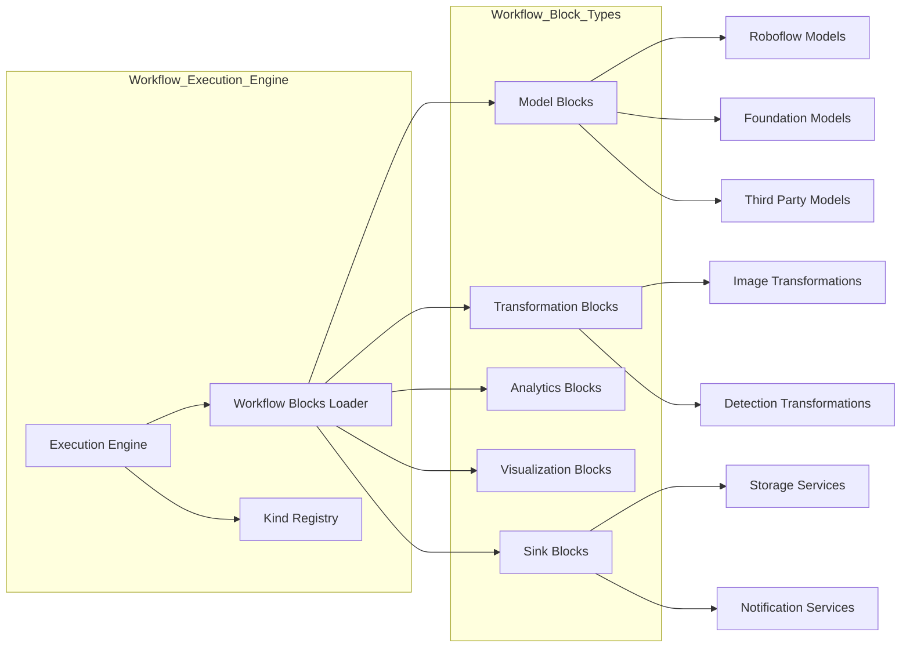
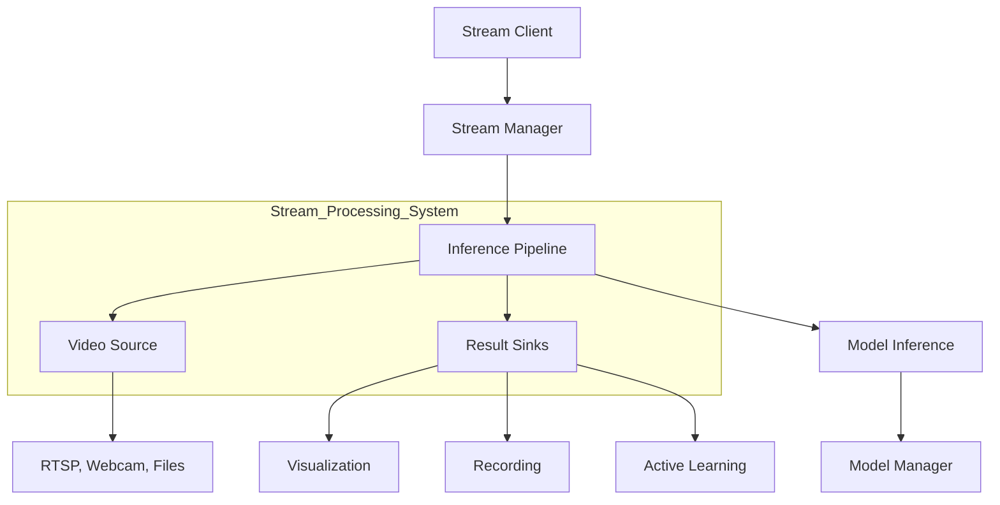
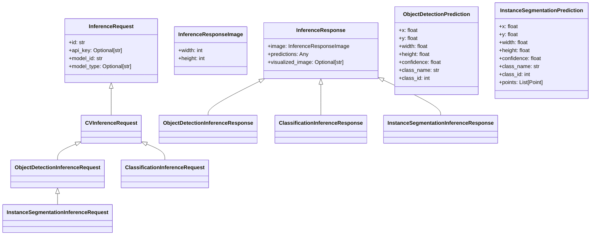
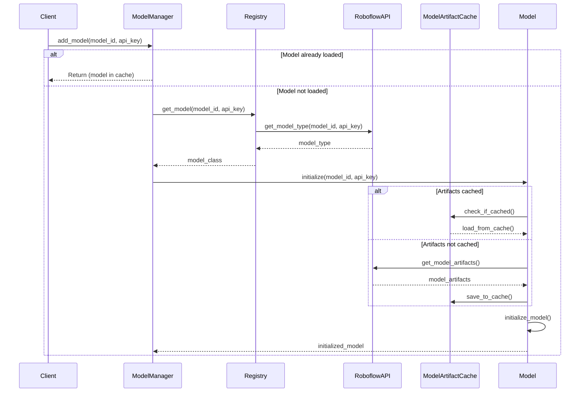

# Core Architecture

Relevant source files

- [inference/core/cache/model_artifacts.py](https://github.com/roboflow/inference/blob/55f57676/inference/core/cache/model_artifacts.py)
- [inference/core/env.py](https://github.com/roboflow/inference/blob/55f57676/inference/core/env.py)
- [inference/core/interfaces/http/http_api.py](https://github.com/roboflow/inference/blob/55f57676/inference/core/interfaces/http/http_api.py)
- [inference/core/managers/base.py](https://github.com/roboflow/inference/blob/55f57676/inference/core/managers/base.py)
- [inference/core/managers/decorators/base.py](https://github.com/roboflow/inference/blob/55f57676/inference/core/managers/decorators/base.py)
- [inference/core/managers/decorators/fixed_size_cache.py](https://github.com/roboflow/inference/blob/55f57676/inference/core/managers/decorators/fixed_size_cache.py)
- [inference/core/managers/decorators/logger.py](https://github.com/roboflow/inference/blob/55f57676/inference/core/managers/decorators/logger.py)
- [inference/core/models/base.py](https://github.com/roboflow/inference/blob/55f57676/inference/core/models/base.py)
- [inference/core/models/roboflow.py](https://github.com/roboflow/inference/blob/55f57676/inference/core/models/roboflow.py)
- [inference/core/models/stubs.py](https://github.com/roboflow/inference/blob/55f57676/inference/core/models/stubs.py)
- [inference/core/registries/roboflow.py](https://github.com/roboflow/inference/blob/55f57676/inference/core/registries/roboflow.py)
- [inference/core/roboflow_api.py](https://github.com/roboflow/inference/blob/55f57676/inference/core/roboflow_api.py)
- [inference/core/utils/roboflow.py](https://github.com/roboflow/inference/blob/55f57676/inference/core/utils/roboflow.py)
- [inference/core/utils/visualisation.py](https://github.com/roboflow/inference/blob/55f57676/inference/core/utils/visualisation.py)
- [inference/core/version.py](https://github.com/roboflow/inference/blob/55f57676/inference/core/version.py)
- [inference/models/__init__.py](https://github.com/roboflow/inference/blob/55f57676/inference/models/__init__.py)
- [inference/models/utils.py](https://github.com/roboflow/inference/blob/55f57676/inference/models/utils.py)
- [tests/inference/unit_tests/core/cache/__init__.py](https://github.com/roboflow/inference/blob/55f57676/tests/inference/unit_tests/core/cache/__init__.py)
- [tests/inference/unit_tests/core/cache/test_model_artifacts.py](https://github.com/roboflow/inference/blob/55f57676/tests/inference/unit_tests/core/cache/test_model_artifacts.py)
- [tests/inference/unit_tests/core/models/test_roboflow.py](https://github.com/roboflow/inference/blob/55f57676/tests/inference/unit_tests/core/models/test_roboflow.py)

This document details the technical architecture of the inference server's core components: the HTTP API layer, model management system, and caching infrastructure. These components form the foundation for processing inference requests from initial HTTP request to final response.

## Overview

The core architecture consists of three primary subsystems:

1. **HTTP API Server** (`HttpInterface`) - FastAPI-based application handling incoming requests, authentication, and response formatting
2. **Model Manager and Registry** (`ModelManager`, `RoboflowModelRegistry`) - Model lifecycle management, lazy loading, and type resolution
3. **Caching and Persistence** - Multi-layer caching for model artifacts, API metadata, and inference results

### Request Processing Flow



Sources:

- [inference/core/interfaces/http/http_api.py276-581](https://github.com/roboflow/inference/blob/55f57676/inference/core/interfaces/http/http_api.py#L276-L581)
- [inference/core/managers/base.py39-321](https://github.com/roboflow/inference/blob/55f57676/inference/core/managers/base.py#L39-L321)
- [inference/core/registries/roboflow.py67-238](https://github.com/roboflow/inference/blob/55f57676/inference/core/registries/roboflow.py#L67-L238)
- [inference/core/models/roboflow.py113-257](https://github.com/roboflow/inference/blob/55f57676/inference/core/models/roboflow.py#L113-L257)
- [inference/core/roboflow_api.py193-248](https://github.com/roboflow/inference/blob/55f57676/inference/core/roboflow_api.py#L193-L248)

## HTTP API Server

The `HttpInterface` class wraps a FastAPI application, providing HTTP endpoints for inference, model management, and system introspection. It coordinates between client requests, the `ModelManager`, and execution engines.

### FastAPI Application Structure

The `HttpInterface` initializes a FastAPI application with OpenAPI documentation, CORS middleware, and environment-specific middleware for serverless deployments:



Sources:

- [inference/core/interfaces/http/http_api.py287-383](https://github.com/roboflow/inference/blob/55f57676/inference/core/interfaces/http/http_api.py#L287-L383)
- [inference/core/interfaces/http/http_api.py584-593](https://github.com/roboflow/inference/blob/55f57676/inference/core/interfaces/http/http_api.py#L584-L593)

### Endpoint Categories

The HTTP API exposes endpoints organized by functionality:

|Category|Example Endpoints|Handler Function|
|---|---|---|
|Model Inference|`/infer/object_detection`, `/infer/classification`|`process_inference_request()`|
|Model Management|`/model/add`, `/model/remove`, `/model/clear`|`model_add()`, `model_remove()`, `model_clear()`|
|Workflow Execution|`/workflows/run`, `/workflows/blocks/describe`|`process_workflow_inference_request()`|
|Core Models|`/clip/compare`, `/sam/embed_image`, `/gaze/gaze_detection`|`load_core_model()` + task handlers|
|System Info|`/info`, `/model/registry`|`root()`, `registry()`|

Sources:

- [inference/core/interfaces/http/http_api.py594-623](https://github.com/roboflow/inference/blob/55f57676/inference/core/interfaces/http/http_api.py#L594-L623)
- [inference/core/interfaces/http/http_api.py667-804](https://github.com/roboflow/inference/blob/55f57676/inference/core/interfaces/http/http_api.py#L667-L804)
- [inference/core/interfaces/http/http_api.py805-890](https://github.com/roboflow/inference/blob/55f57676/inference/core/interfaces/http/http_api.py#L805-L890)

### Authentication Middleware

Two authentication modes are supported based on deployment environment:

**Dedicated Deployment Mode** (`DEDICATED_DEPLOYMENT_WORKSPACE_URL` set):

- Validates that API key belongs to the specific workspace
- Caches validated API keys with 1-hour TTL in `cached_api_keys` dict
- Calls `get_roboflow_workspace_async(api_key)` to verify workspace ownership

**GCP Serverless Mode** (`GCP_SERVERLESS=True`):

- Requires API key for all endpoints except static resources and docs
- Bypasses authentication for `/workflows/blocks/describe` and `/workflows/definition/schema` when no dynamic blocks provided
- Uses same caching strategy with 1-hour expiration

Sources:

- [inference/core/interfaces/http/http_api.py429-508](https://github.com/roboflow/inference/blob/55f57676/inference/core/interfaces/http/http_api.py#L429-L508)
- [inference/core/interfaces/http/http_api.py510-578](https://github.com/roboflow/inference/blob/55f57676/inference/core/interfaces/http/http_api.py#L510-L578)
- [inference/core/roboflow_api.py210-248](https://github.com/roboflow/inference/blob/55f57676/inference/core/roboflow_api.py#L210-L248)

### Request/Response Handling

The `process_inference_request()` function implements the standard inference flow:

```
def process_inference_request(
    inference_request: InferenceRequest,
    countinference: Optional[bool] = None,
    service_secret: Optional[str] = None,
    **kwargs,
) -> InferenceResponse:
    # Resolve model aliases (e.g., "yolov8x-640" -> full model ID)
    de_aliased_model_id = resolve_roboflow_model_alias(
        model_id=inference_request.model_id
    )
    
    # Ensure model is loaded in ModelManager
    self.model_manager.add_model(
        de_aliased_model_id,
        inference_request.api_key,
        countinference=countinference,
        service_secret=service_secret,
    )
    
    # Execute inference
    resp = self.model_manager.infer_from_request_sync(
        de_aliased_model_id, inference_request, **kwargs
    )
    
    # Serialize response using orjson
    return orjson_response(resp)
```

Sources:

- [inference/core/interfaces/http/http_api.py594-622](https://github.com/roboflow/inference/blob/55f57676/inference/core/interfaces/http/http_api.py#L594-L622)
- [inference/models/aliases.py](https://github.com/roboflow/inference/blob/55f57676/inference/models/aliases.py)

### Error Handling

Errors are wrapped by the `@with_route_exceptions` decorator, which converts exceptions into appropriate HTTP responses:

- `RoboflowAPINotAuthorizedError` → 401 Unauthorized
- `InferenceModelNotFound` → 404 Not Found
- `ModelArtefactError` → 500 Internal Server Error with error details
- `ContentTypeInvalid` → 400 Bad Request

Sources:

- [inference/core/interfaces/http/error_handlers.py](https://github.com/roboflow/inference/blob/55f57676/inference/core/interfaces/http/error_handlers.py)
- [inference/core/exceptions.py](https://github.com/roboflow/inference/blob/55f57676/inference/core/exceptions.py)

## Model Manager and Registry

The `ModelManager` class provides model lifecycle management with thread-safe operations, lazy loading, and LRU eviction. The `RoboflowModelRegistry` resolves model IDs to concrete model classes by querying the Roboflow API.

### ModelManager Class Structure



Sources:

- [inference/core/managers/base.py39-327](https://github.com/roboflow/inference/blob/55f57676/inference/core/managers/base.py#L39-L327)
- [inference/core/managers/decorators/fixed_size_cache.py28-253](https://github.com/roboflow/inference/blob/55f57676/inference/core/managers/decorators/fixed_size_cache.py#L28-L253)
- [inference/core/managers/decorators/base.py14-237](https://github.com/roboflow/inference/blob/55f57676/inference/core/managers/decorators/base.py#L14-L237)
- [inference/core/managers/decorators/logger.py11-88](https://github.com/roboflow/inference/blob/55f57676/inference/core/managers/decorators/logger.py#L11-L88)

### Model Loading with Lazy Initialization

The `add_model()` method implements lazy loading with fine-grained locking per model:




Key features:

- **Lock Acquisition**: Timeout-based lock acquisition prevents deadlocks (default: 60 seconds via `MODEL_LOCK_ACQUIRE_TIMEOUT`)
- **Thread Safety**: Per-model locks in `_models_state_locks` dict prevent concurrent initialization
- **Error Handling**: Lock is disposed on initialization failure via `_dispose_model_lock()`
- **Idempotent**: Returns immediately if model already loaded

Sources:

- [inference/core/managers/base.py57-142](https://github.com/roboflow/inference/blob/55f57676/inference/core/managers/base.py#L57-L142)
- [inference/core/env.py662](https://github.com/roboflow/inference/blob/55f57676/inference/core/env.py#L662-L662)

### RoboflowModelRegistry

The `RoboflowModelRegistry` maps `(task_type, model_type)` tuples to model classes:

Aquí tienes el Mermaid sin paréntesis dentro de corchetes y sin `<br/>`, `\n`, `[()]` ni `[|]`:


Sources:

- [inference/core/registries/roboflow.py46-62](https://github.com/roboflow/inference/blob/55f57676/inference/core/registries/roboflow.py#L46-L62)
- [inference/core/registries/roboflow.py138-238](https://github.com/roboflow/inference/blob/55f57676/inference/core/registries/roboflow.py#L138-L238)
- [inference/core/registries/roboflow.py240-342](https://github.com/roboflow/inference/blob/55f57676/inference/core/registries/roboflow.py#L240-L342)

### Decorator Pattern for Caching

The `WithFixedSizeCache` decorator wraps `ModelManager` to provide LRU eviction:

**Eviction Algorithm**:

1. Models tracked in `_key_queue` (deque) by insertion/access order
2. On `add_model()`, if `len(_models) >= max_size` or `memory_pressure_detected()`:
    - Remove 3 models from left of queue (LRU)
    - Call `super().remove(model_id, delete_from_disk=DISK_CACHE_CLEANUP)`
    - Run `gc.collect()` to free memory
3. On inference (`infer_from_request_sync()`), move model to right of queue (MRU)

**Memory Pressure Detection**:

```
def memory_pressure_detected(self) -> bool:
    if torch.cuda.is_available():
        free_memory, total_memory = torch.cuda.mem_get_info()
        return (free_memory / total_memory) < MEMORY_FREE_THRESHOLD
    return False
```

Sources:

- [inference/core/managers/decorators/fixed_size_cache.py41-132](https://github.com/roboflow/inference/blob/55f57676/inference/core/managers/decorators/fixed_size_cache.py#L41-L132)
- [inference/core/managers/decorators/fixed_size_cache.py234-253](https://github.com/roboflow/inference/blob/55f57676/inference/core/managers/decorators/fixed_size_cache.py#L234-L253)
- [inference/core/env.py641-643](https://github.com/roboflow/inference/blob/55f57676/inference/core/env.py#L641-L643)

## Caching and Persistence

### Inference Request Flow

The inference process follows a standard pattern across model types, with task-specific preprocessing and postprocessing logic.



Sources:

- [inference/core/interfaces/http/http_api.py773-791](https://github.com/roboflow/inference/blob/55f57676/inference/core/interfaces/http/http_api.py#L773-L791) Inference request processing
- [inference/core/models/base.py19-53](https://github.com/roboflow/inference/blob/55f57676/inference/core/models/base.py#L19-L53) Base inference logic
- [inference/core/models/object_detection_base.py42-202](https://github.com/roboflow/inference/blob/55f57676/inference/core/models/object_detection_base.py#L42-L202) Object detection inference flow
- [inference/core/models/classification_base.py27-175](https://github.com/roboflow/inference/blob/55f57676/inference/core/models/classification_base.py#L27-L175) Classification inference flow

### Workflow System

The workflow system allows chaining multiple processing steps into complex pipelines that can include models, transformations, analytics, and visualization components.



Sources:

- [inference/core/workflows/core_steps/loader.py1-693](https://github.com/roboflow/inference/blob/55f57676/inference/core/workflows/core_steps/loader.py#L1-L693) Workflow blocks loader
- [inference/core/workflows/execution_engine/entities/types.py1-692](https://github.com/roboflow/inference/blob/55f57676/inference/core/workflows/execution_engine/entities/types.py#L1-L692) Workflow execution engine types
- [inference/core/interfaces/http/http_api.py793-833](https://github.com/roboflow/inference/blob/55f57676/inference/core/interfaces/http/http_api.py#L793-L833) Workflow inference handling

### Stream Processing

The stream processing system handles video inputs through a pipeline architecture that connects video sources to model inference and result sinks.



Sources:

- [inference/core/interfaces/http/http_api.py763-772](https://github.com/roboflow/inference/blob/55f57676/inference/core/interfaces/http/http_api.py#L763-L772) Stream manager initialization
- [inference/core/env.py419-452](https://github.com/roboflow/inference/blob/55f57676/inference/core/env.py#L419-L452) Stream processing configuration

## Core Data Models

The system uses several key data models for requests and responses:



Sources:

- [inference/core/entities/requests/inference.py1-243](https://github.com/roboflow/inference/blob/55f57676/inference/core/entities/requests/inference.py#L1-L243) Inference request models
- [inference/core/entities/responses/inference.py1-362](https://github.com/roboflow/inference/blob/55f57676/inference/core/entities/responses/inference.py#L1-L362) Inference response models

## Model Loading and Caching

The system employs a sophisticated model loading and caching mechanism to efficiently manage model artifacts and optimize inference performance.



Sources:

- [inference/core/managers/base.py42-64](https://github.com/roboflow/inference/blob/55f57676/inference/core/managers/base.py#L42-L64) Model loading in ModelManager
- [inference/core/managers/decorators/fixed_size_cache.py25-63](https://github.com/roboflow/inference/blob/55f57676/inference/core/managers/decorators/fixed_size_cache.py#L25-L63) Fixed-size caching with LRU eviction
- [inference/core/models/roboflow.py223-345](https://github.com/roboflow/inference/blob/55f57676/inference/core/models/roboflow.py#L223-L345) Model artifact caching
- [inference/core/cache/model_artifacts.py21-172](https://github.com/roboflow/inference/blob/55f57676/inference/core/cache/model_artifacts.py#L21-L172) Model cache utilities

## Environment Configuration

The system is highly configurable through environment variables, allowing for flexible deployment across various environments and hardware configurations.

|Category|Key Variables|Description|
|---|---|---|
|Core Configuration|`MODEL_CACHE_DIR`, `PORT`, `HOST`|Basic server configuration|
|Model Settings|`MAX_ACTIVE_MODELS`, `CORE_MODELS_ENABLED`|Control model loading behavior|
|Hardware Optimization|`REQUIRED_ONNX_PROVIDERS`, `DEVICE`|Configure hardware acceleration|
|Feature Toggles|`ENABLE_STREAM_API`, `DISABLE_WORKFLOW_ENDPOINTS`|Enable/disable specific features|
|Performance|`NUM_WORKERS`, `MAX_BATCH_SIZE`|Tune performance characteristics|
|Security|`API_KEY`, `ROBOFLOW_SERVICE_SECRET`|Authentication and security settings|
|Monitoring|`METRICS_ENABLED`, `API_LOGGING_ENABLED`|Configure observability|

Sources:

- [inference/core/env.py1-564](https://github.com/roboflow/inference/blob/55f57676/inference/core/env.py#L1-L564) Environment variable definitions and defaults
- [inference/core/interfaces/http/http_api.py573-589](https://github.com/roboflow/inference/blob/55f57676/inference/core/interfaces/http/http_api.py#L573-L589) Server configuration from environment

## Conclusion

The Roboflow Inference architecture is designed with modularity, extensibility, and performance in mind. The separation of concerns between the HTTP API, model management, workflow execution, and stream processing enables a flexible system that can handle a wide range of computer vision tasks while supporting multiple deployment options and hardware configurations.

The use of architectural patterns like decorators for model managers, factories for model creation, and a unified interface for model inference allows for easy extension and customization of the system to meet specific requirements.