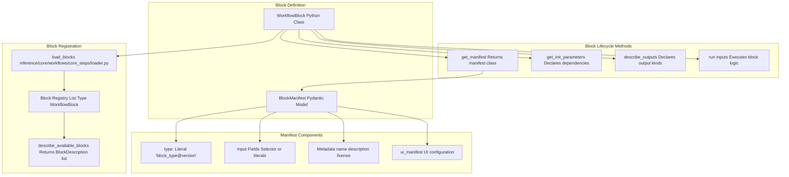
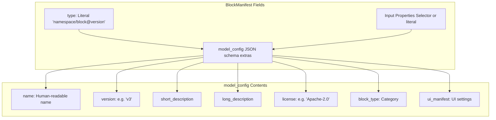
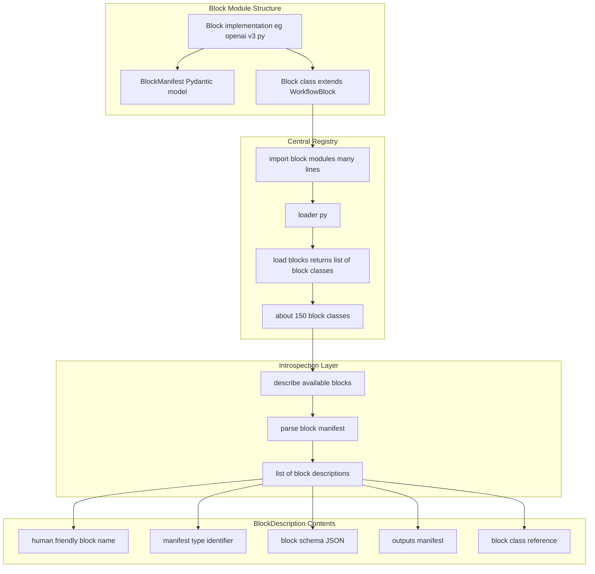
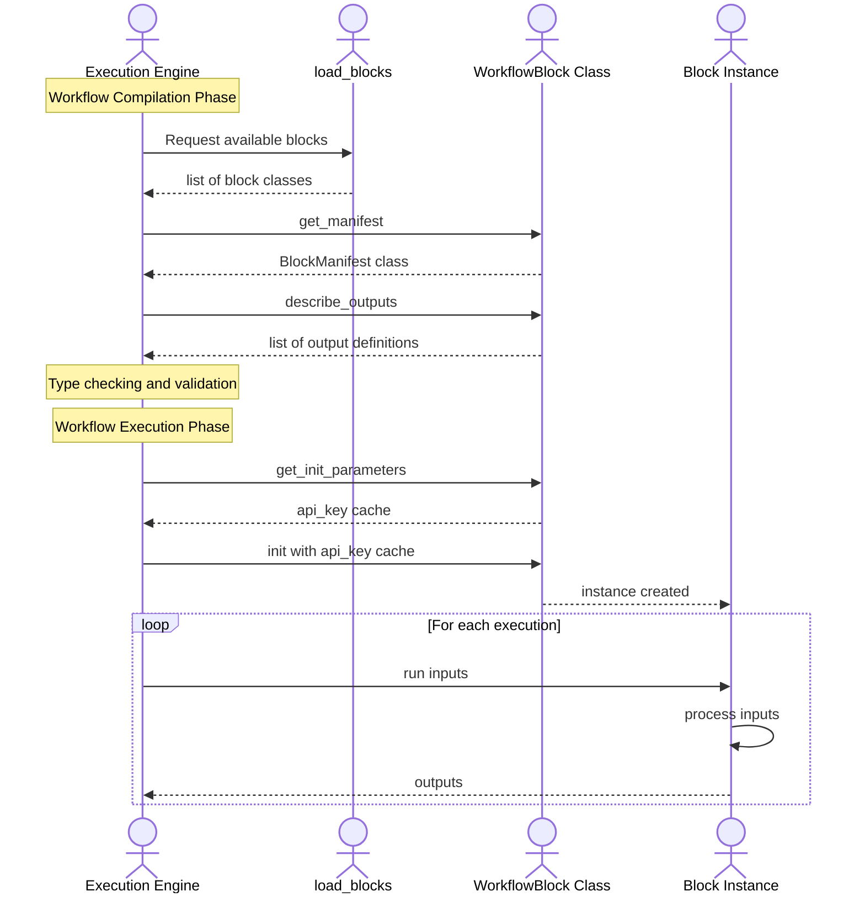
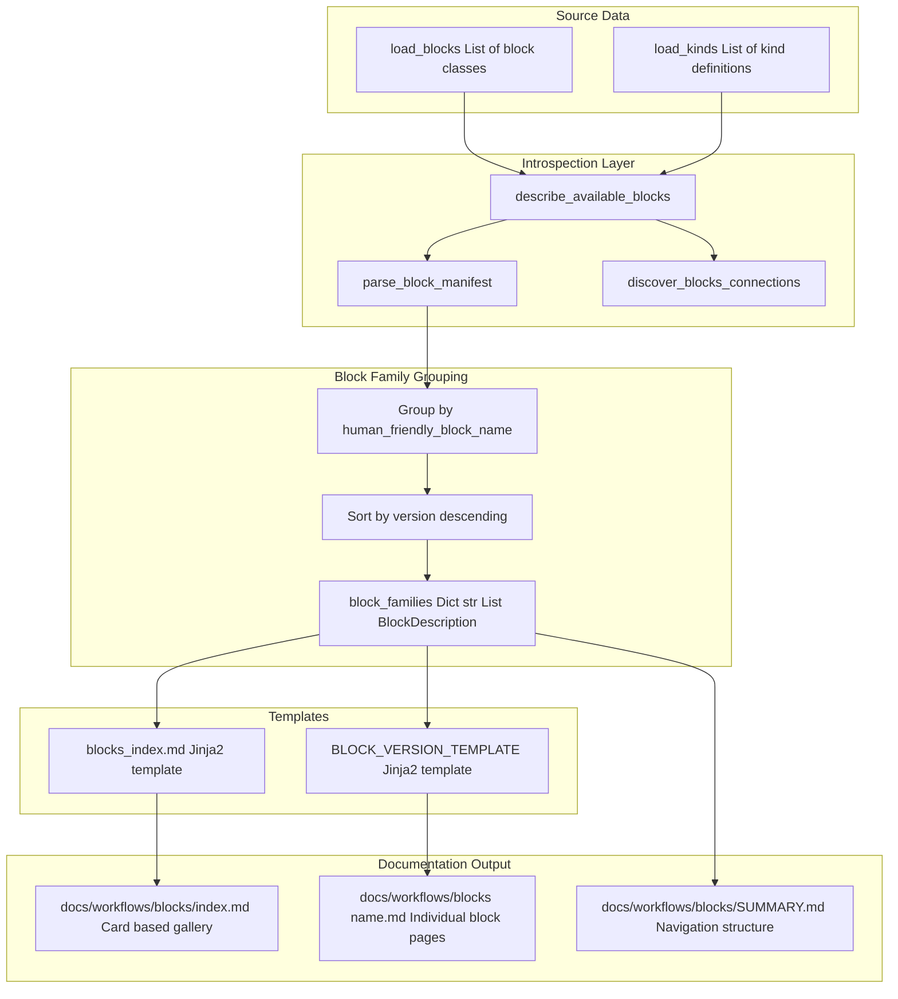
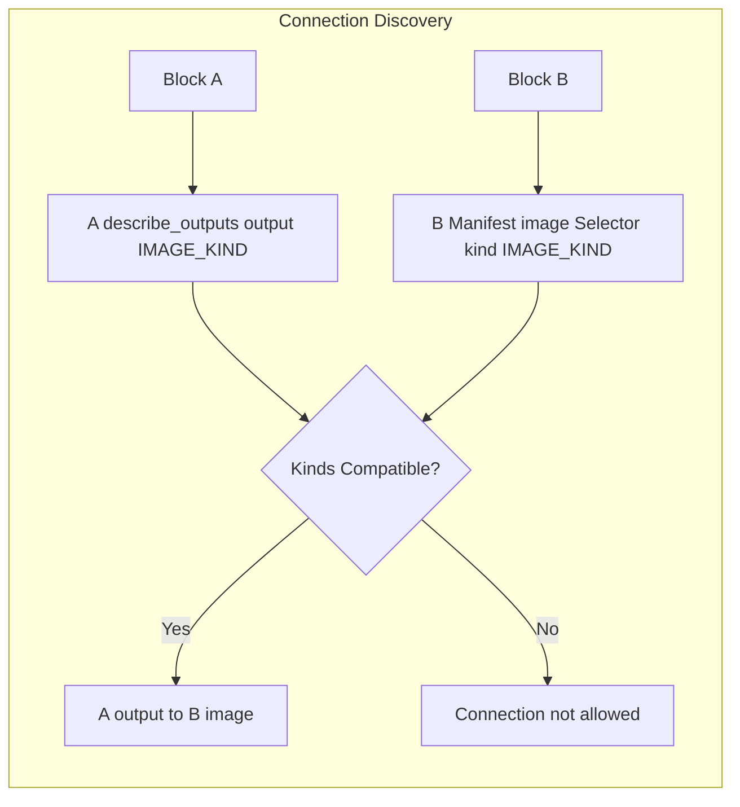

# Workflow Blocks

Relevant source files

- [development/docs/build_block_docs.py](https://github.com/roboflow/inference/blob/55f57676/development/docs/build_block_docs.py)
- [development/docs/workflows_gallery_builder.py](https://github.com/roboflow/inference/blob/55f57676/development/docs/workflows_gallery_builder.py)
- [docs/fine-tuned/yolov11.md](https://github.com/roboflow/inference/blob/55f57676/docs/fine-tuned/yolov11.md)
- [docs/javascript/workflows.js](https://github.com/roboflow/inference/blob/55f57676/docs/javascript/workflows.js)
- [docs/styles/workflows.css](https://github.com/roboflow/inference/blob/55f57676/docs/styles/workflows.css)
- [docs/workflows/blocks_gallery_template.md](https://github.com/roboflow/inference/blob/55f57676/docs/workflows/blocks_gallery_template.md)
- [docs/workflows/gallery_index_template.md](https://github.com/roboflow/inference/blob/55f57676/docs/workflows/gallery_index_template.md)
- [docs/workflows/kinds_template.md](https://github.com/roboflow/inference/blob/55f57676/docs/workflows/kinds_template.md)
- [inference/core/workflows/core_steps/loader.py](https://github.com/roboflow/inference/blob/55f57676/inference/core/workflows/core_steps/loader.py)
- [inference/core/workflows/core_steps/models/foundation/openai/v3.py](https://github.com/roboflow/inference/blob/55f57676/inference/core/workflows/core_steps/models/foundation/openai/v3.py)
- [inference/core/workflows/execution_engine/entities/types.py](https://github.com/roboflow/inference/blob/55f57676/inference/core/workflows/execution_engine/entities/types.py)

This document describes the **Workflow Block** abstraction, which forms the building blocks of the Workflows system. A block is a reusable, composable unit that performs a specific operation within a workflow—ranging from running ML models to transforming data to sending notifications.

For information about the data type system that blocks use, see [Kind Type System](https://deepwiki.com/roboflow/inference/3.2-kind-type-system). For information about how blocks are compiled and executed together, see [Workflow Execution](https://deepwiki.com/roboflow/inference/3.3-workflow-execution).

## Purpose and Scope

Workflow Blocks provide:

- **Composability**: Blocks can be connected together via inputs and outputs to build complex workflows
- **Reusability**: A single block type can be used multiple times in a workflow with different parameters
- **Type Safety**: Blocks declare their input/output kinds, enabling compile-time validation
- **Self-Documentation**: Blocks automatically generate documentation from their manifests
- **Versioning**: Multiple versions of a block can coexist, allowing backward compatibility

The system currently provides 100+ built-in blocks across seven categories, with support for custom Python blocks and plugin-based extensions.

## Block Architecture Overview



**Sources**: [inference/core/workflows/core_steps/loader.py548-694](https://github.com/roboflow/inference/blob/55f57676/inference/core/workflows/core_steps/loader.py#L548-L694) [inference/core/workflows/core_steps/models/foundation/openai/v3.py89-248](https://github.com/roboflow/inference/blob/55f57676/inference/core/workflows/core_steps/models/foundation/openai/v3.py#L89-L248) [inference/core/workflows/prototypes/block.py](https://github.com/roboflow/inference/blob/55f57676/inference/core/workflows/prototypes/block.py)

## Block Manifest System

Every block defines a **manifest** as a Pydantic model that inherits from `WorkflowBlockManifest`. The manifest serves as both the block's schema and its metadata.

### Manifest Structure




**Example Manifest Definition**:

```
# From inference/core/workflows/core_steps/models/foundation/openai/v3.py:89-243
class BlockManifest(WorkflowBlockManifest):
    model_config = ConfigDict(
        json_schema_extra={
            "name": "OpenAI",
            "version": "v3",
            "short_description": "Run OpenAI's GPT models with vision capabilities.",
            "long_description": LONG_DESCRIPTION,
            "license": "Apache-2.0",
            "block_type": "model",
            "ui_manifest": {
                "section": "model",
                "icon": "fal fa-atom",
                "blockPriority": 5,
            },
        },
    )
    type: Literal["roboflow_core/open_ai@v3"]
    images: Selector(kind=[IMAGE_KIND]) = ImageInputField
    prompt: Optional[Union[Selector(kind=[STRING_KIND]), str]] = Field(...)
    # ... more inputs
```

**Key Features**:

- **Type Identifier**: Format `namespace/block_name@version` uniquely identifies the block
- **Input Definitions**: Use `Selector(kind=[...])` for workflow inputs or plain types for literals
- **Conditional Inputs**: `json_schema_extra.relevant_for` allows inputs to be shown/hidden based on other field values
- **Batch Processing**: `get_parameters_accepting_batches()` declares which inputs can handle batched data

**Sources**: [inference/core/workflows/core_steps/models/foundation/openai/v3.py89-248](https://github.com/roboflow/inference/blob/55f57676/inference/core/workflows/core_steps/models/foundation/openai/v3.py#L89-L248) [inference/core/workflows/execution_engine/entities/types.py7-31](https://github.com/roboflow/inference/blob/55f57676/inference/core/workflows/execution_engine/entities/types.py#L7-L31)

## Block Categories

The Workflows system organizes blocks into seven primary categories, defined in the auto-documentation system:

|Category|Section ID|Description|Example Blocks|
|---|---|---|---|
|**Models**|`model`|ML model inference blocks|`RoboflowObjectDetectionModelBlockV2`, `OpenAIBlockV3`, `ClipModelBlockV1`|
|**Visualizations**|`visualization`|Drawing annotations on images|`BoundingBoxVisualizationBlockV1`, `LabelVisualizationBlockV1`, `HaloVisualizationBlockV1`|
|**Logic and Branching**|`flow_control`|Conditional execution and filtering|`ContinueIfBlockV1`, `RateLimiterBlockV1`, `DeltaFilterBlockV1`|
|**Data Storage**|`data_storage`|Caching and persistence|`CacheGetBlockV1`, `CacheSetBlockV1`, `BufferBlockV1`|
|**Notifications**|`notifications`|External communication|`EmailNotificationBlockV1`, `SlackNotificationBlockV1`, `WebhookSinkBlockV1`|
|**Transformations**|`transformation`|Data manipulation|`DynamicCropBlockV1`, `DetectionsFilterBlockV1`, `ByteTrackerBlockV3`|
|**Classical Computer Vision**|`classical_cv`|Non-ML image processing|`ImageThresholdBlockV1`, `SIFTBlockV1`, `TemplateMatchingBlockV1`|
|**Video**|`video`|Video-specific analytics|`TimeInZoneBlockV3`, `PathDeviationAnalyticsBlockV2`, `VelocityBlockV1`|
|**Advanced**|`advanced`|Complex/specialized blocks|`IdentifyOutliersBlockV1`, `DimensionCollapseBlockV1`, `ExpressionBlockV1`|

**Sources**: [development/docs/build_block_docs.py202-248](https://github.com/roboflow/inference/blob/55f57676/development/docs/build_block_docs.py#L202-L248) [inference/core/workflows/core_steps/loader.py11-373](https://github.com/roboflow/inference/blob/55f57676/inference/core/workflows/core_steps/loader.py#L11-L373)

## Block Registry and Loading

### Block Registration Flow



**The `load_blocks()` Function**:

```
# From inference/core/workflows/core_steps/loader.py:548-694
def load_blocks() -> List[Type[WorkflowBlock]]:
    return [
        AbsoluteStaticCropBlockV1,
        DynamicCropBlockV1,
        DetectionsFilterBlockV1,
        # ... ~150 block classes
        QRCodeGeneratorBlockV1,
        DetectionsCombineBlockV1,
    ]
```

This function serves as the **single source of truth** for all available blocks. The execution engine calls this function to discover blocks at runtime.

**Sources**: [inference/core/workflows/core_steps/loader.py548-694](https://github.com/roboflow/inference/blob/55f57676/inference/core/workflows/core_steps/loader.py#L548-L694) [inference/core/workflows/execution_engine/introspection/blocks_loader.py](https://github.com/roboflow/inference/blob/55f57676/inference/core/workflows/execution_engine/introspection/blocks_loader.py)

### Registered Initializers

Blocks can declare dependencies that are injected during initialization:

```
# From inference/core/workflows/core_steps/loader.py:491-500
REGISTERED_INITIALIZERS = {
    "api_key": API_KEY,
    "cache": cache,
    "step_execution_mode": StepExecutionMode(WORKFLOWS_STEP_EXECUTION_MODE),
    "background_tasks": None,
    "thread_pool_executor": None,
    "allow_access_to_file_system": ALLOW_WORKFLOW_BLOCKS_ACCESSING_LOCAL_STORAGE,
    "allowed_write_directory": WORKFLOW_BLOCKS_WRITE_DIRECTORY,
    "allow_access_to_environmental_variables": ALLOW_WORKFLOW_BLOCKS_ACCESSING_ENVIRONMENTAL_VARIABLES,
}
```

Blocks declare which initializers they need via `get_init_parameters()`:

```
# Example from inference/core/workflows/core_steps/models/foundation/openai/v3.py:260-262
@classmethod
def get_init_parameters(cls) -> List[str]:
    return ["model_manager", "api_key"]
```

**Sources**: [inference/core/workflows/core_steps/loader.py491-500](https://github.com/roboflow/inference/blob/55f57676/inference/core/workflows/core_steps/loader.py#L491-L500) [inference/core/workflows/core_steps/models/foundation/openai/v3.py260-262](https://github.com/roboflow/inference/blob/55f57676/inference/core/workflows/core_steps/models/foundation/openai/v3.py#L260-L262)

## Block Lifecycle



**Block Interface Contract**:

1. **`get_manifest()`**: Returns the manifest class (not instance)
2. **`get_init_parameters()`**: Declares what dependencies to inject
3. **`describe_outputs()`**: Declares output names and kinds
4. **`get_parameters_accepting_batches()`**: Declares batch-capable inputs
5. **`run(**inputs)`**: Executes the block logic with validated inputs

**Sources**: [inference/core/workflows/prototypes/block.py](https://github.com/roboflow/inference/blob/55f57676/inference/core/workflows/prototypes/block.py) [inference/core/workflows/core_steps/models/foundation/openai/v3.py250-303](https://github.com/roboflow/inference/blob/55f57676/inference/core/workflows/core_steps/models/foundation/openai/v3.py#L250-L303)

## Block Input and Output Definitions

### Input Definitions via Selectors

Blocks use `Selector()` to define inputs that can accept workflow data:

```
# Type annotation for a selector input
images: Selector(kind=[IMAGE_KIND]) = ImageInputField
prompt: Optional[Union[Selector(kind=[STRING_KIND]), str]] = Field(default=None)
classes: Optional[Union[Selector(kind=[LIST_OF_VALUES_KIND]), List[str]]] = Field(default=None)
```

**Key Concepts**:

- **`Selector(kind=[...])`**: Declares that the input can reference workflow data of specified kinds
- **`Union[Selector(...), T]`**: Allows either a workflow reference OR a literal value of type `T`
- **Batch Parameters**: Declared via `get_parameters_accepting_batches()` to handle lists of values

### Output Definitions

Blocks declare outputs via `describe_outputs()`:

```
# From inference/core/workflows/core_steps/models/foundation/openai/v3.py:237-243
@classmethod
def describe_outputs(cls) -> List[OutputDefinition]:
    return [
        OutputDefinition(
            name="output", kind=[STRING_KIND, LANGUAGE_MODEL_OUTPUT_KIND]
        ),
        OutputDefinition(name="classes", kind=[LIST_OF_VALUES_KIND]),
    ]
```

Each `OutputDefinition` specifies:

- **`name`**: The output property name (used in selectors like `$steps.my_step.output`)
- **`kind`**: List of compatible kinds (union type)

**Sources**: [inference/core/workflows/execution_engine/entities/base.py](https://github.com/roboflow/inference/blob/55f57676/inference/core/workflows/execution_engine/entities/base.py) [inference/core/workflows/core_steps/models/foundation/openai/v3.py237-243](https://github.com/roboflow/inference/blob/55f57676/inference/core/workflows/core_steps/models/foundation/openai/v3.py#L237-L243)

## Block Versioning

Multiple versions of a block can coexist, identified by the `@version` suffix in the type identifier:

```
# Version 1
type: Literal["roboflow_core/open_ai@v1"]

# Version 2
type: Literal["roboflow_core/open_ai@v2"]

# Version 3
type: Literal["roboflow_core/open_ai@v3"]
```

**Versioning Strategy**:

- **Human-Friendly Name**: Common across versions (e.g., "OpenAI")
- **Type Identifier**: Unique per version (e.g., `roboflow_core/open_ai@v3`)
- **Family Grouping**: Documentation groups versions by human-friendly name

The registry maintains all versions simultaneously:

```
# From inference/core/workflows/core_steps/loader.py:549-694
def load_blocks() -> List[Type[WorkflowBlock]]:
    return [
        ByteTrackerBlockV1,
        ByteTrackerBlockV2,
        ByteTrackerBlockV3,  # Three versions of same block family
        # ...
    ]
```

**Sources**: [inference/core/workflows/core_steps/loader.py549-694](https://github.com/roboflow/inference/blob/55f57676/inference/core/workflows/core_steps/loader.py#L549-L694) [development/docs/build_block_docs.py416-429](https://github.com/roboflow/inference/blob/55f57676/development/docs/build_block_docs.py#L416-L429)

## Auto-Documentation System

The documentation for all blocks is **automatically generated** from their manifests and introspection data.

### Documentation Generation Pipeline





**Key Files**:

- **Generator**: [development/docs/build_block_docs.py](https://github.com/roboflow/inference/blob/55f57676/development/docs/build_block_docs.py)
- **Templates**: [development/docs/templates/blocks_index.md](https://github.com/roboflow/inference/blob/55f57676/development/docs/templates/blocks_index.md)
- **Output Directory**: `docs/workflows/blocks/`

### Generated Documentation Structure

For each block family, the system generates:

1. **Block Index Page** (`docs/workflows/blocks/index.md`):
    
    - Card-based gallery organized by category
    - Searchable/filterable interface
    - Links to individual block pages
2. **Individual Block Pages** (`docs/workflows/blocks/<slug>.md`):
    
    - Type identifier and description
    - Input properties table
    - Input/output binding kinds
    - Compatible block connections
    - Example JSON definition
    - Multiple version sections (if applicable)
3. **Navigation Structure** (`docs/workflows/blocks/SUMMARY.md`):
    
    - Hierarchical navigation by category
    - Auto-generated from block metadata

**Documentation Generation Process**:

```
# From development/docs/build_block_docs.py:251-254
def main() -> None:
    blocks_description = describe_available_blocks(dynamic_blocks=[])
    write_kinds_docs(blocks_description)
    write_blocks_docs(blocks_description)
```

**Sources**: [development/docs/build_block_docs.py251-272](https://github.com/roboflow/inference/blob/55f57676/development/docs/build_block_docs.py#L251-L272) [development/docs/build_block_docs.py275-334](https://github.com/roboflow/inference/blob/55f57676/development/docs/build_block_docs.py#L275-L334)

### Auto-Generated Content Examples

**Block Input Table**:

|**Name**|**Type**|**Description**|Refs|
|---|---|---|---|
|`images`|`Selector(kind=[IMAGE_KIND])`|Input images|✅|
|`prompt`|`Optional[Union[Selector(kind=[STRING_KIND]), str]]`|Text prompt|✅|
|`max_tokens`|`int`|Maximum tokens|❌|

**Input Bindings**:

- `images` (_[`image`](https://deepwiki.com/roboflow/inference/3.2-kind-type-system)_): Input images for processing
- `prompt` (_[`string`](https://deepwiki.com/roboflow/inference/3.2-kind-type-system)_): Text prompt to the model

**Output Bindings**:

- `output` ([`string`](https://deepwiki.com/roboflow/inference/3.2-kind-type-system), [`language_model_output`](https://deepwiki.com/roboflow/inference/3.2-kind-type-system)): Generated text response
- `classes` ([`list_of_values`](https://deepwiki.com/roboflow/inference/3.2-kind-type-system)): List of predicted classes

**Sources**: [development/docs/build_block_docs.py501-564](https://github.com/roboflow/inference/blob/55f57676/development/docs/build_block_docs.py#L501-L564)

## Serialization and Deserialization

Blocks rely on the **Kind System** for automatic serialization/deserialization of inputs and outputs.

### Serializer/Deserializer Registry

```
# From inference/core/workflows/core_steps/loader.py:502-545
KINDS_SERIALIZERS = {
    IMAGE_KIND.name: serialise_image,
    VIDEO_METADATA_KIND.name: serialize_video_metadata_kind,
    OBJECT_DETECTION_PREDICTION_KIND.name: serialise_sv_detections,
    INSTANCE_SEGMENTATION_PREDICTION_KIND.name: serialise_sv_detections,
    # ...
}

KINDS_DESERIALIZERS = {
    IMAGE_KIND.name: deserialize_image_kind,
    VIDEO_METADATA_KIND.name: deserialize_video_metadata_kind,
    OBJECT_DETECTION_PREDICTION_KIND.name: deserialize_detections_kind,
    # ...
}
```

**How It Works**:

1. **Input Deserialization**: When a block receives input from an external source (HTTP API), the execution engine looks up the deserializer for each input's kind and converts from external format to internal format
2. **Output Serialization**: When a workflow completes, outputs are serialized back to external format for the API response
3. **Internal Processing**: Between blocks, data remains in internal format (no serialization overhead)

**Example Transformations**:

- **`IMAGE_KIND`**: `dict` → `WorkflowImageData` → `dict`
- **`OBJECT_DETECTION_PREDICTION_KIND`**: `dict` → `sv.Detections` → `dict`
- **`TIMESTAMP_KIND`**: `str` (ISO format) → `datetime` → `str`

**Sources**: [inference/core/workflows/core_steps/loader.py502-545](https://github.com/roboflow/inference/blob/55f57676/inference/core/workflows/core_steps/loader.py#L502-L545) [inference/core/workflows/core_steps/common/deserializers.py](https://github.com/roboflow/inference/blob/55f57676/inference/core/workflows/core_steps/common/deserializers.py) [inference/core/workflows/core_steps/common/serializers.py](https://github.com/roboflow/inference/blob/55f57676/inference/core/workflows/core_steps/common/serializers.py)

## Block Examples by Category

### Model Blocks

Execute machine learning inference:

- **`RoboflowObjectDetectionModelBlockV2`**: Fine-tuned object detection
- **`OpenAIBlockV3`**: GPT vision models
- **`ClipModelBlockV1`**: CLIP embeddings
- **`Florence2BlockV2`**: Multi-task vision-language model
- **`YoloWorldModelBlockV1`**: Open-vocabulary object detection

### Transformation Blocks

Manipulate images and detections:

- **`DynamicCropBlockV1`**: Crop images based on detections
- **`DetectionsFilterBlockV1`**: Filter detections by confidence, class, size
- **`ByteTrackerBlockV3`**: Object tracking across frames
- **`DetectionsConsensusBlockV1`**: Merge predictions from multiple models
- **`ImageSlicerBlockV2`**: Slice large images into tiles

### Visualization Blocks

Annotate images with detection results:

- **`BoundingBoxVisualizationBlockV1`**: Draw bounding boxes
- **`LabelVisualizationBlockV1`**: Add class labels
- **`MaskVisualizationBlockV1`**: Draw segmentation masks
- **`HaloVisualizationBlockV1`**: Add colored halos around objects
- **`TraceVisualizationBlockV1`**: Draw object paths over time

### Flow Control Blocks

Control workflow execution paths:

- **`ContinueIfBlockV1`**: Conditional execution based on boolean expression
- **`RateLimiterBlockV1`**: Limit execution frequency
- **`DeltaFilterBlockV1`**: Execute only when values change significantly

### Output/Sink Blocks

Send data to external systems:

- **`RoboflowDatasetUploadBlockV2`**: Upload images to Roboflow dataset
- **`EmailNotificationBlockV1`**: Send email alerts
- **`SlackNotificationBlockV1`**: Post to Slack channels
- **`WebhookSinkBlockV1`**: HTTP POST to external endpoints
- **`LocalFileSinkBlockV1`**: Save to local filesystem

**Sources**: [inference/core/workflows/core_steps/loader.py11-373](https://github.com/roboflow/inference/blob/55f57676/inference/core/workflows/core_steps/loader.py#L11-L373)

## Block Discovery and Connections

The introspection system provides information about which blocks can connect to each other:




The `discover_blocks_connections()` function analyzes all blocks and produces:

- **Input Connections**: Which blocks can provide data TO this block
- **Output Connections**: Which blocks can receive data FROM this block

This information is used in:

- Auto-generated documentation
- Visual workflow builders
- Compile-time validation

**Sources**: [inference/core/workflows/execution_engine/introspection/connections_discovery.py](https://github.com/roboflow/inference/blob/55f57676/inference/core/workflows/execution_engine/introspection/connections_discovery.py) [development/docs/build_block_docs.py280-282](https://github.com/roboflow/inference/blob/55f57676/development/docs/build_block_docs.py#L280-L282)

## Summary

The Workflow Blocks system provides:

1. **150+ Pre-built Blocks** across 9 categories covering ML models, transformations, visualizations, and integrations
2. **Strong Type Safety** via the Kind system with compile-time validation
3. **Self-Documenting** with automatic documentation generation from manifests
4. **Versioning Support** allowing multiple block versions to coexist
5. **Extensibility** through custom Python blocks and plugin architecture
6. **Composability** with automatic connection validation and data transformation

The central registry at [inference/core/workflows/core_steps/loader.py548-694](https://github.com/roboflow/inference/blob/55f57676/inference/core/workflows/core_steps/loader.py#L548-L694) serves as the single source of truth, while the auto-documentation system at [development/docs/build_block_docs.py](https://github.com/roboflow/inference/blob/55f57676/development/docs/build_block_docs.py) ensures documentation stays synchronized with code.

For creating custom blocks, developers implement the `WorkflowBlock` interface and add their block to the registry. The system handles initialization, input validation, execution, and documentation generation automatically.