# Kind Type System

Relevant source files

- [development/docs/build_block_docs.py](https://github.com/roboflow/inference/blob/55f57676/development/docs/build_block_docs.py)
- [development/docs/workflows_gallery_builder.py](https://github.com/roboflow/inference/blob/55f57676/development/docs/workflows_gallery_builder.py)
- [docs/fine-tuned/yolov11.md](https://github.com/roboflow/inference/blob/55f57676/docs/fine-tuned/yolov11.md)
- [docs/javascript/workflows.js](https://github.com/roboflow/inference/blob/55f57676/docs/javascript/workflows.js)
- [docs/styles/workflows.css](https://github.com/roboflow/inference/blob/55f57676/docs/styles/workflows.css)
- [docs/workflows/blocks_gallery_template.md](https://github.com/roboflow/inference/blob/55f57676/docs/workflows/blocks_gallery_template.md)
- [docs/workflows/gallery_index_template.md](https://github.com/roboflow/inference/blob/55f57676/docs/workflows/gallery_index_template.md)
- [docs/workflows/kinds_template.md](https://github.com/roboflow/inference/blob/55f57676/docs/workflows/kinds_template.md)
- [inference/core/workflows/core_steps/loader.py](https://github.com/roboflow/inference/blob/55f57676/inference/core/workflows/core_steps/loader.py)
- [inference/core/workflows/core_steps/models/foundation/openai/v3.py](https://github.com/roboflow/inference/blob/55f57676/inference/core/workflows/core_steps/models/foundation/openai/v3.py)
- [inference/core/workflows/execution_engine/entities/types.py](https://github.com/roboflow/inference/blob/55f57676/inference/core/workflows/execution_engine/entities/types.py)

This document describes the Kind Type System, which provides semantic type definitions for data flowing through workflow blocks. The Kind system enables compile-time type checking, automatic serialization/deserialization, and clear data contracts between workflow components.

For information about workflow blocks that use these kinds, see [Workflow Blocks](https://deepwiki.com/roboflow/inference/3.1-workflow-blocks). For details on workflow compilation and type checking, see [Workflow Execution](https://deepwiki.com/roboflow/inference/3.3-workflow-execution).

## Purpose and Scope

The Kind Type System serves three primary functions:

1. **Semantic Type Definition**: Provides meaningful names (e.g., `image`, `object_detection_prediction`) that express data purpose rather than just data structure
2. **Dual Representation**: Defines both external (JSON-serializable) and internal (Python object) representations for each data type
3. **Type Safety**: Enables compile-time validation of workflow connections by ensuring compatible kinds are connected

The system consists of 35+ predefined kinds covering images, predictions, primitives, and specialized data types. Each kind declaration includes serialization/deserialization logic to bridge external and internal representations.

## Core Architecture

### The Kind Class

The fundamental building block is the `Kind` class, defined in [inference/core/workflows/execution_engine/entities/types.py7-31](https://github.com/roboflow/inference/blob/55f57676/inference/core/workflows/execution_engine/entities/types.py#L7-L31):

```
class Kind(BaseModel):
    name: str
    description: Optional[str]
    docs: Optional[str]
    serialised_data_type: Optional[str]  # External representation type hint
    internal_data_type: Optional[str]    # Internal representation type hint
```

Each `Kind` instance provides:

- **name**: The semantic identifier (e.g., `"image"`, `"float_zero_to_one"`)
- **description**: Brief human-readable summary
- **docs**: Detailed documentation with examples
- **serialised_data_type**: Python type hint for external clients (JSON-compatible format)
- **internal_data_type**: Python type hint for block developers (runtime format)

**Sources**: [inference/core/workflows/execution_engine/entities/types.py7-31](https://github.com/roboflow/inference/blob/55f57676/inference/core/workflows/execution_engine/entities/types.py#L7-L31)

### Dual Representation Architecture

The Kind system uses dual representation to separate external API concerns from internal processing efficiency:


**Example**: The `IMAGE_KIND` has:

- **External**: `dict` with `{"type": "url", "value": "https://..."}` or `{"type": "base64", "value": "..."}`
- **Internal**: `WorkflowImageData` object with decoded numpy array and metadata

This separation allows:

- External clients to use simple JSON structures
- Internal blocks to work with efficient Python objects (numpy arrays, supervision Detections, etc.)
- Automatic conversion at workflow boundaries

**Sources**: [inference/core/workflows/execution_engine/entities/types.py94-100](https://github.com/roboflow/inference/blob/55f57676/inference/core/workflows/execution_engine/entities/types.py#L94-L100) [inference/core/workflows/core_steps/loader.py502-545](https://github.com/roboflow/inference/blob/55f57676/inference/core/workflows/core_steps/loader.py#L502-L545)

### Kind Registry and Loader

The `load_kinds()` function in [inference/core/workflows/core_steps/loader.py697-737](https://github.com/roboflow/inference/blob/55f57676/inference/core/workflows/core_steps/loader.py#L697-L737) returns the complete list of available kinds:

```
def load_kinds() -> List[Kind]:
    return [
        WILDCARD_KIND,
        IMAGE_KIND,
        VIDEO_METADATA_KIND,
        ROBOFLOW_MODEL_ID_KIND,
        # ... 35+ total kinds
    ]
```

This registry is used by:

- The workflow compiler for type checking connections
- The introspection system to describe available types
- The auto-documentation system to generate kind reference pages

**Sources**: [inference/core/workflows/core_steps/loader.py697-737](https://github.com/roboflow/inference/blob/55f57676/inference/core/workflows/core_steps/loader.py#L697-L737)

## Serialization System

### Serializers

The `KINDS_SERIALIZERS` dictionary maps kind names to serialization functions in [inference/core/workflows/core_steps/loader.py502-513](https://github.com/roboflow/inference/blob/55f57676/inference/core/workflows/core_steps/loader.py#L502-L513):

```
KINDS_SERIALIZERS = {
    IMAGE_KIND.name: serialise_image,
    VIDEO_METADATA_KIND.name: serialize_video_metadata_kind,
    OBJECT_DETECTION_PREDICTION_KIND.name: serialise_sv_detections,
    INSTANCE_SEGMENTATION_PREDICTION_KIND.name: serialise_sv_detections,
    KEYPOINT_DETECTION_PREDICTION_KIND.name: serialise_sv_detections,
    QR_CODE_DETECTION_KIND.name: serialise_sv_detections,
    BAR_CODE_DETECTION_KIND.name: serialise_sv_detections,
    SECRET_KIND.name: serialize_secret,
    WILDCARD_KIND.name: serialize_wildcard_kind,
    TIMESTAMP_KIND.name: serialize_timestamp,
}
```

Serializers convert internal Python objects to JSON-compatible dictionaries suitable for API responses.

**Sources**: [inference/core/workflows/core_steps/loader.py502-513](https://github.com/roboflow/inference/blob/55f57676/inference/core/workflows/core_steps/loader.py#L502-L513)

### Deserializers

The `KINDS_DESERIALIZERS` dictionary maps kind names to deserialization functions in [inference/core/workflows/core_steps/loader.py514-545](https://github.com/roboflow/inference/blob/55f57676/inference/core/workflows/core_steps/loader.py#L514-L545):

```
KINDS_DESERIALIZERS = {
    IMAGE_KIND.name: deserialize_image_kind,
    VIDEO_METADATA_KIND.name: deserialize_video_metadata_kind,
    OBJECT_DETECTION_PREDICTION_KIND.name: deserialize_detections_kind,
    INSTANCE_SEGMENTATION_PREDICTION_KIND.name: deserialize_detections_kind,
    # ... mappings for all 35+ kinds
}
```

Deserializers convert external JSON data into internal Python objects before passing to workflow blocks.

**Sources**: [inference/core/workflows/core_steps/loader.py514-545](https://github.com/roboflow/inference/blob/55f57676/inference/core/workflows/core_steps/loader.py#L514-L545)

### Serialization Flow


**Sources**: [inference/core/workflows/core_steps/loader.py502-545](https://github.com/roboflow/inference/blob/55f57676/inference/core/workflows/core_steps/loader.py#L502-L545) [inference/core/workflows/core_steps/common/deserializers.py](https://github.com/roboflow/inference/blob/55f57676/inference/core/workflows/core_steps/common/deserializers.py) [inference/core/workflows/core_steps/common/serializers.py](https://github.com/roboflow/inference/blob/55f57676/inference/core/workflows/core_steps/common/serializers.py)

## Built-in Kinds

The workflow system provides 35+ predefined kinds organized into categories:

### Core Data Types

|Kind Name|Description|External Type|Internal Type|
|---|---|---|---|
|`wildcard`|Matches any type|`Any`|`Any`|
|`boolean`|Boolean flag|`bool`|`bool`|
|`integer`|Integer value|`int`|`int`|
|`float`|Float value|`float`|`float`|
|`float_zero_to_one`|Float in range [0.0, 1.0]|`float`|`float`|
|`string`|String value|`str`|`str`|
|`dictionary`|Dictionary|`dict`|`dict`|
|`list_of_values`|List of any values|`List[Any]`|`List[Any]`|
|`bytes`|Bytes data|`str` (base64)|`bytes`|

**Sources**: [inference/core/workflows/execution_engine/entities/types.py49-413](https://github.com/roboflow/inference/blob/55f57676/inference/core/workflows/execution_engine/entities/types.py#L49-L413)

### Image and Media

|Kind Name|Description|External Type|Internal Type|
|---|---|---|---|
|`image`|Image in workflows|`dict`|`WorkflowImageData`|
|`video_metadata`|Video metadata (deprecated)|`dict`|`VideoMetadata`|
|`timestamp`|Timestamp object|`str` (ISO format)|`datetime`|

The `IMAGE_KIND` is fundamental to the workflow system. Its external format supports multiple input types:

```
{
    "type": "url",           # or "base64", "numpy_object", etc.
    "value": "...",          # URL, base64 string, or numpy array
    "video_metadata": {      # Optional, added in EE v1.2.0
        "video_identifier": "rtsp://stream",
        "frame_number": 42,
        "fps": 30.0
    }
}
```

Internally, this becomes a `WorkflowImageData` object with the decoded `numpy.ndarray` and associated metadata.

**Sources**: [inference/core/workflows/execution_engine/entities/types.py56-149](https://github.com/roboflow/inference/blob/55f57676/inference/core/workflows/execution_engine/entities/types.py#L56-L149)

### Model Predictions

|Kind Name|Description|External Type|Internal Type|
|---|---|---|---|
|`object_detection_prediction`|Object detection results|`dict`|`sv.Detections`|
|`instance_segmentation_prediction`|Instance segmentation results|`dict`|`sv.Detections`|
|`keypoint_detection_prediction`|Keypoint detection results|`sv.Detections`|`sv.Detections`|
|`classification_prediction`|Classification results|`dict`|`dict`|
|`qr_code_detection`|QR code detections|`dict`|`sv.Detections`|
|`bar_code_detection`|Barcode detections|`dict`|`sv.Detections`|
|`detection`|Single detection element|`Tuple[list, ...]`|`Tuple[np.ndarray, ...]`|

The detection-based kinds use the `supervision` library's `sv.Detections` format internally, with extended metadata fields:

```
sv.Detections(
    xyxy=array([[x1, y1, x2, y2], ...]),
    confidence=array([0.95, 0.87, ...]),
    class_id=array([0, 2, ...]),
    data={
        'class_name': array(['car', 'truck', ...]),
        'detection_id': array(['uuid-1', 'uuid-2', ...]),
        'parent_id': array(['image.[0]', 'image.[0]', ...]),
        'parent_dimensions': array([[480, 640], [480, 640], ...]),
        # ... additional tracking metadata
    }
)
```

**Sources**: [inference/core/workflows/execution_engine/entities/types.py456-708](https://github.com/roboflow/inference/blob/55f57676/inference/core/workflows/execution_engine/entities/types.py#L456-L708)

### Geometric Types

|Kind Name|Description|External Type|Internal Type|
|---|---|---|---|
|`point`|2D point|`Tuple[int, int]`|`Tuple[int, int]`|
|`zone`|Polygon zone definition|`List[Tuple[int, int]]`|`List[Tuple[int, int]]`|
|`rgb_color`|RGB color tuple|`Tuple[int, int, int]`|`Tuple[int, int, int]`|
|`contours`|List of contour arrays|`List[list]`|`List[np.ndarray]`|
|`image_keypoints`|Classical CV keypoints|`dict`|`dict`|

**Sources**: [inference/core/workflows/execution_engine/entities/types.py478-516](https://github.com/roboflow/inference/blob/55f57676/inference/core/workflows/execution_engine/entities/types.py#L478-L516)

### Specialized Types

|Kind Name|Description|External Type|Internal Type|
|---|---|---|---|
|`numpy_array`|Numpy array|`list`|`np.ndarray`|
|`embedding`|Vector embedding|`List[float]`|`List[float]`|
|`language_model_output`|LLM output text|`str`|`str`|
|`secret`|Secret/credential|(redacted)|`str`|
|`serialised_payloads`|Serialized sink data|`List[Union[str, dict]]`|`List[Union[str, bytes, dict]]`|

**Sources**: [inference/core/workflows/execution_engine/entities/types.py241-328](https://github.com/roboflow/inference/blob/55f57676/inference/core/workflows/execution_engine/entities/types.py#L241-L328)

### Roboflow-Specific

|Kind Name|Description|External Type|Internal Type|
|---|---|---|---|
|`roboflow_model_id`|Model ID (`project/version`)|`str`|`str`|
|`roboflow_project`|Project name|`str`|`str`|
|`roboflow_api_key`|API key|`str`|`str`|
|`ROBOFLOW_MANAGED_KEY`|Managed credential|`str`|`str`|
|`top_class`|Top classification class|`str`|`str`|
|`prediction_type`|Prediction type string|`str`|`str`|
|`parent_id`|Parent element ID|`str`|`str`|
|`inference_id`|Inference request ID|`str`|`str`|
|`image_metadata`|Image metadata|`dict`|`dict`|

**Sources**: [inference/core/workflows/execution_engine/entities/types.py151-204](https://github.com/roboflow/inference/blob/55f57676/inference/core/workflows/execution_engine/entities/types.py#L151-L204) [inference/core/workflows/execution_engine/entities/types.py370-384](https://github.com/roboflow/inference/blob/55f57676/inference/core/workflows/execution_engine/entities/types.py#L370-L384)

## Kind Usage in Workflow Blocks

### Block Manifest Kind Declarations

Workflow blocks declare their input and output kinds in their manifest. Example from [inference/core/workflows/core_steps/models/foundation/openai/v3.py89-243](https://github.com/roboflow/inference/blob/55f57676/inference/core/workflows/core_steps/models/foundation/openai/v3.py#L89-L243):

```
class BlockManifest(WorkflowBlockManifest):
    type: Literal["roboflow_core/open_ai@v3"]
    images: Selector(kind=[IMAGE_KIND]) = ImageInputField
    prompt: Optional[Union[Selector(kind=[STRING_KIND]), str]] = Field(...)
    classes: Optional[Union[Selector(kind=[LIST_OF_VALUES_KIND]), List[str]]] = Field(...)
    api_key: Union[Selector(kind=[STRING_KIND, SECRET_KIND, ROBOFLOW_MANAGED_KEY]), str] = Field(...)
    
    @classmethod
    def describe_outputs(cls) -> List[OutputDefinition]:
        return [
            OutputDefinition(name="output", kind=[STRING_KIND, LANGUAGE_MODEL_OUTPUT_KIND]),
            OutputDefinition(name="classes", kind=[LIST_OF_VALUES_KIND]),
        ]
```

The `Selector(kind=[...])` annotation indicates that a field can accept:

1. A static value of the specified type
2. A selector reference (e.g., `$inputs.my_image` or `$steps.detection.predictions`) to data of compatible kinds

**Sources**: [inference/core/workflows/core_steps/models/foundation/openai/v3.py89-243](https://github.com/roboflow/inference/blob/55f57676/inference/core/workflows/core_steps/models/foundation/openai/v3.py#L89-L243)

### Type Checking During Compilation

```mermaid
flowchart TB

subgraph WD[Workflow Definition]
  Step1[Step 1 Object Detection outputs predictions type object_detection_prediction]
  Step2[Step 2 Dynamic Crop input predictions type object_detection_prediction]
  Conn[Connection steps dot step1 dot predictions to step2 dot predictions]
end

subgraph CP[Compilation Phase]
  Compiler[Workflow Compiler]
  TypeChecker[Kind Type Checker]
  Kinds[load_kinds]
end

subgraph V[Validation]
  Compatible[Kinds Compatible]
  Incompatible[Type Error]
  Plan[Generate Execution Plan]
  Error[Raise ValidationError]
end

Conn --> Compiler
Compiler --> TypeChecker
TypeChecker --> Kinds
Kinds --> TypeChecker

TypeChecker --> Match[object_detection_prediction matches object_detection_prediction]
Match --> Compatible
TypeChecker --> NoMatch[string does not match object_detection_prediction]
NoMatch --> Incompatible

Compatible --> Plan
Incompatible --> Error
```



The workflow compiler validates that:

- Each connection's source output kind matches (or is compatible with) the target input kind
- Union types are properly handled (e.g., `STRING_KIND | LANGUAGE_MODEL_OUTPUT_KIND`)
- Required inputs have compatible sources

**Sources**: [development/docs/build_block_docs.py511-563](https://github.com/roboflow/inference/blob/55f57676/development/docs/build_block_docs.py#L511-L563)

## Auto-Generated Documentation

The Kind system includes automatic documentation generation. The `build_block_docs.py` script in [development/docs/build_block_docs.py629-685](https://github.com/roboflow/inference/blob/55f57676/development/docs/build_block_docs.py#L629-L685) generates:

1. **Kind Index Page**: Lists all available kinds with descriptions
2. **Individual Kind Pages**: Detailed documentation for each kind including:
    - External and internal data representations
    - Type hints
    - Usage examples
    - Serialization warnings (when representations differ)

```
def write_kinds_docs(blocks_description):
    for declared_kind in blocks_description.declared_kinds:
        warning = ""
        if declared_kind.internal_data_type != declared_kind.serialised_data_type:
            warning = DATA_REPRESENTATION_WARNING
        kind_page = KIND_PAGE_TEMPLATE.format(
            kind_name=declared_kind.name,
            description=description,
            details=details,
            data_representation_warning=warning,
            serialised_data_type=declared_kind.serialised_data_type,
            internal_data_type=declared_kind.internal_data_type,
        )
```

The documentation automatically warns users when a kind has different external and internal representations, helping them understand the serialization layer.

**Sources**: [development/docs/build_block_docs.py629-685](https://github.com/roboflow/inference/blob/55f57676/development/docs/build_block_docs.py#L629-L685) [development/docs/build_block_docs.py156-198](https://github.com/roboflow/inference/blob/55f57676/development/docs/build_block_docs.py#L156-L198)

## Kind System Integration Points

### Integration with Block Loader

The kind system integrates with the block loading mechanism through [inference/core/workflows/core_steps/loader.py491-545](https://github.com/roboflow/inference/blob/55f57676/inference/core/workflows/core_steps/loader.py#L491-L545):

```
REGISTERED_INITIALIZERS = {
    "api_key": API_KEY,
    "cache": cache,
    # ... other initializers
}

KINDS_SERIALIZERS = { ... }  # Mapping of kind names to serializers
KINDS_DESERIALIZERS = { ... }  # Mapping of kind names to deserializers

def load_blocks() -> List[Type[WorkflowBlock]]:
    return [
        # 100+ block classes
    ]

def load_kinds() -> List[Kind]:
    return [
        # 35+ kind definitions
    ]
```

This provides a centralized registry where:

- Blocks declare their kind requirements
- The execution engine queries available kinds
- Serializers/deserializers are discovered for each kind

**Sources**: [inference/core/workflows/core_steps/loader.py491-737](https://github.com/roboflow/inference/blob/55f57676/inference/core/workflows/core_steps/loader.py#L491-L737)

### Kind Name Constants

All kind definitions use constant references defined in [inference/core/workflows/execution_engine/entities/types.py](https://github.com/roboflow/inference/blob/55f57676/inference/core/workflows/execution_engine/entities/types.py):

```
IMAGE_KIND = Kind(name="image", ...)
OBJECT_DETECTION_PREDICTION_KIND = Kind(name="object_detection_prediction", ...)
# ... etc
```

These constants are imported throughout the codebase to ensure consistency:

```
from inference.core.workflows.execution_engine.entities.types import (
    IMAGE_KIND,
    OBJECT_DETECTION_PREDICTION_KIND,
    STRING_KIND,
    # ... other kinds as needed
)
```

This approach prevents string typos and allows IDE autocomplete for kind names.

**Sources**: [inference/core/workflows/core_steps/loader.py448-487](https://github.com/roboflow/inference/blob/55f57676/inference/core/workflows/core_steps/loader.py#L448-L487)

## Extensibility

The Kind system is designed to be extensible. Custom workflow plugins can:

1. **Define new kinds** by creating `Kind` instances with unique names
2. **Register serializers** in `KINDS_SERIALIZERS` for custom external formats
3. **Register deserializers** in `KINDS_DESERIALIZERS` for custom internal formats
4. **Use union types** to make blocks compatible with multiple existing kinds

When extending the system, ensure:

- Kind names are unique across all plugins
- Both serializer and deserializer are provided if representations differ
- Documentation strings (`description` and `docs`) are comprehensive
- Type hints (`serialised_data_type` and `internal_data_type`) are accurate

**Sources**: [inference/core/workflows/core_steps/loader.py697-737](https://github.com/roboflow/inference/blob/55f57676/inference/core/workflows/core_steps/loader.py#L697-L737) [inference/core/workflows/execution_engine/entities/types.py7-31](https://github.com/roboflow/inference/blob/55f57676/inference/core/workflows/execution_engine/entities/types.py#L7-L31)