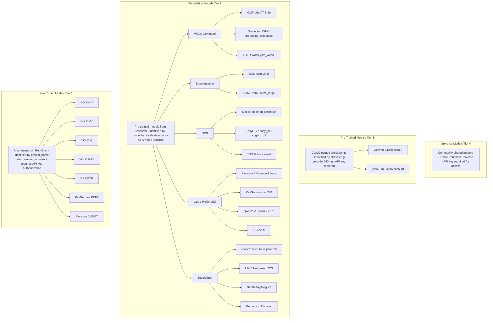
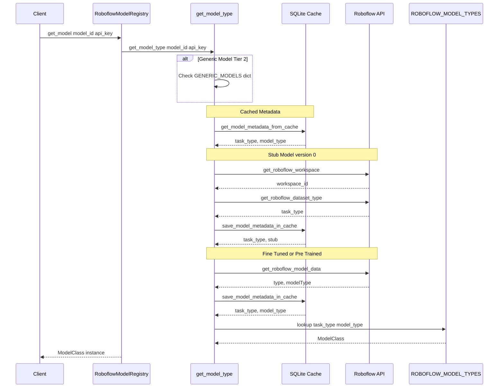
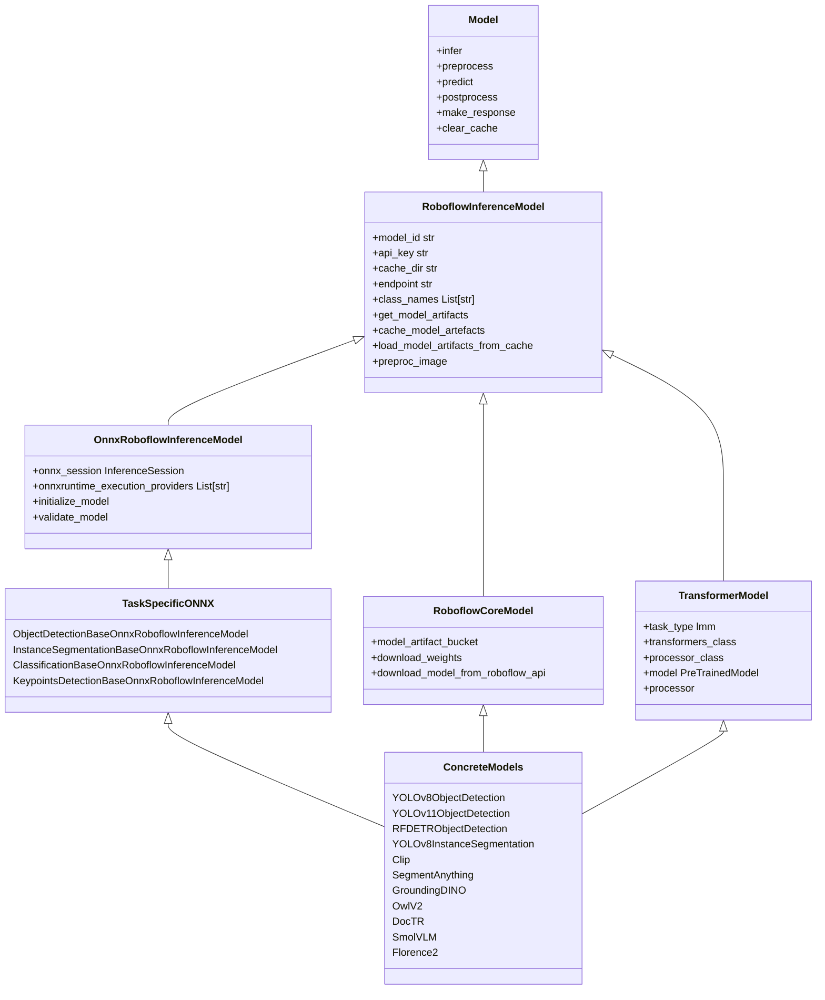
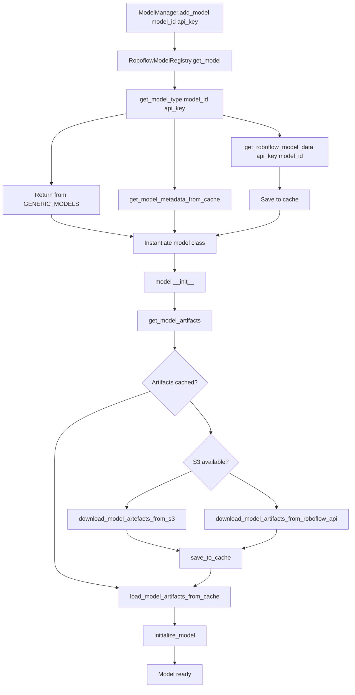

# Model Ecosystem

Relevant source files

- [inference/core/cache/model_artifacts.py](https://github.com/roboflow/inference/blob/55f57676/inference/core/cache/model_artifacts.py)
- [inference/core/env.py](https://github.com/roboflow/inference/blob/55f57676/inference/core/env.py)
- [inference/core/interfaces/http/http_api.py](https://github.com/roboflow/inference/blob/55f57676/inference/core/interfaces/http/http_api.py)
- [inference/core/managers/base.py](https://github.com/roboflow/inference/blob/55f57676/inference/core/managers/base.py)
- [inference/core/managers/decorators/base.py](https://github.com/roboflow/inference/blob/55f57676/inference/core/managers/decorators/base.py)
- [inference/core/managers/decorators/fixed_size_cache.py](https://github.com/roboflow/inference/blob/55f57676/inference/core/managers/decorators/fixed_size_cache.py)
- [inference/core/managers/decorators/logger.py](https://github.com/roboflow/inference/blob/55f57676/inference/core/managers/decorators/logger.py)
- [inference/core/models/base.py](https://github.com/roboflow/inference/blob/55f57676/inference/core/models/base.py)
- [inference/core/models/roboflow.py](https://github.com/roboflow/inference/blob/55f57676/inference/core/models/roboflow.py)
- [inference/core/models/stubs.py](https://github.com/roboflow/inference/blob/55f57676/inference/core/models/stubs.py)
- [inference/core/registries/roboflow.py](https://github.com/roboflow/inference/blob/55f57676/inference/core/registries/roboflow.py)
- [inference/core/roboflow_api.py](https://github.com/roboflow/inference/blob/55f57676/inference/core/roboflow_api.py)
- [inference/core/utils/roboflow.py](https://github.com/roboflow/inference/blob/55f57676/inference/core/utils/roboflow.py)
- [inference/core/utils/visualisation.py](https://github.com/roboflow/inference/blob/55f57676/inference/core/utils/visualisation.py)
- [inference/core/version.py](https://github.com/roboflow/inference/blob/55f57676/inference/core/version.py)
- [inference/models/__init__.py](https://github.com/roboflow/inference/blob/55f57676/inference/models/__init__.py)
- [inference/models/utils.py](https://github.com/roboflow/inference/blob/55f57676/inference/models/utils.py)
- [tests/inference/unit_tests/core/cache/__init__.py](https://github.com/roboflow/inference/blob/55f57676/tests/inference/unit_tests/core/cache/__init__.py)
- [tests/inference/unit_tests/core/cache/test_model_artifacts.py](https://github.com/roboflow/inference/blob/55f57676/tests/inference/unit_tests/core/cache/test_model_artifacts.py)
- [tests/inference/unit_tests/core/models/test_roboflow.py](https://github.com/roboflow/inference/blob/55f57676/tests/inference/unit_tests/core/models/test_roboflow.py)

The Roboflow Inference server supports 50+ model types organized into a four-tier taxonomy. All models share a unified interface through base classes that provide consistent model loading, caching, and inference capabilities.

This page documents the model taxonomy, model identification system, and the unified model interface that enables seamless integration of diverse model types.

For information about how models are managed at runtime, see [Model Manager and Registry](https://deepwiki.com/roboflow/inference/2.2-model-manager-and-registry). For deployment configurations, refer to [Docker Containers](https://deepwiki.com/roboflow/inference/6.1-docker-containers).

## Four-Tier Model Taxonomy

The model ecosystem is organized into four tiers based on training provenance and availability:

### Model Taxonomy Diagram





Sources:

- [inference/core/registries/roboflow.py46-62](https://github.com/roboflow/inference/blob/55f57676/inference/core/registries/roboflow.py#L46-L62)
- [inference/models/utils.py55-255](https://github.com/roboflow/inference/blob/55f57676/inference/models/utils.py#L55-L255)
- [inference/models/aliases.py60-101](https://github.com/roboflow/inference/blob/55f57676/inference/models/aliases.py#L60-L101)
- [inference/core/env.py149-196](https://github.com/roboflow/inference/blob/55f57676/inference/core/env.py#L149-L196)

### Tier 1: Fine-Tuned Models

Fine-tuned models are trained by users on the Roboflow platform and identified by `project_name/version_number` format. These models require API key authentication for access.

**Supported Architectures:**

- YOLOv5, YOLOv7, YOLOv8, YOLOv9, YOLOv10, YOLOv11 (object detection, instance segmentation, keypoint detection)
- YOLO-NAS (object detection)
- RF-DETR (object detection)
- ViT, ResNet (classification)
- PaliGemma, Florence-2, Qwen2.5-VL (with PEFT/LoRA fine-tuning)

**Model ID Format:** `{workspace}/{project}/{version}` → resolved to `{project}/{version}`

**Example:**

```
model = get_model("my-project/3", api_key="YOUR_API_KEY")
```

Sources:

- [inference/models/utils.py55-111](https://github.com/roboflow/inference/blob/55f57676/inference/models/utils.py#L55-L111)
- [inference/core/utils/roboflow.py7-42](https://github.com/roboflow/inference/blob/55f57676/inference/core/utils/roboflow.py#L7-L42)

### Tier 2: Foundation Models

Foundation models are pre-trained models from research that require no API key. They are organized into five categories:

|Category|Models|Task Types|
|---|---|---|
|**Vision-Language**|CLIP, Grounding DINO, YOLO-World|Zero-shot classification, open-vocabulary detection|
|**Segmentation**|SAM, SAM2|Segment Anything, video segmentation|
|**OCR**|DocTR, EasyOCR, TrOCR|Document OCR, scene text OCR, printed text|
|**Large Multimodal**|Florence-2, PaliGemma, Qwen2-VL, SmolVLM, Moondream2|VQA, captioning, grounding|
|**Specialized**|OwlV2, L2CS-Net, Depth Anything V2, Perception Encoder|Few-shot detection, gaze estimation, depth, embeddings|

**Model ID Format:** `{model_family}/{variant}` (e.g., `clip/ViT-B-16`, `sam2/hiera_large`)

**Generic Model Mapping:**

The `GENERIC_MODELS` dictionary in [inference/core/registries/roboflow.py46-62](https://github.com/roboflow/inference/blob/55f57676/inference/core/registries/roboflow.py#L46-L62) maps model family names to their task and model types:

```
GENERIC_MODELS = {
    "clip": ("embed", "clip"),
    "sam": ("embed", "sam"),
    "sam2": ("embed", "sam2"),
    "gaze": ("gaze", "l2cs"),
    "doctr": ("ocr", "doctr"),
    "easy_ocr": ("ocr", "easy_ocr"),
    "trocr": ("ocr", "trocr"),
    "grounding_dino": ("object-detection", "grounding-dino"),
    "yolo_world": ("object-detection", "yolo-world"),
    "owlv2": ("object-detection", "owlv2"),
    # ...additional models
}
```

Sources:

- [inference/core/registries/roboflow.py46-62](https://github.com/roboflow/inference/blob/55f57676/inference/core/registries/roboflow.py#L46-L62)
- [inference/models/utils.py366-520](https://github.com/roboflow/inference/blob/55f57676/inference/models/utils.py#L366-L520)
- [inference/core/env.py149-196](https://github.com/roboflow/inference/blob/55f57676/inference/core/env.py#L149-L196)

### Tier 3: Pre-Trained Models

Pre-trained models are COCO-trained checkpoints accessible via user-friendly aliases. The aliasing system maps short names to specific model IDs.

**Alias Examples:**

|Alias|Maps To|Description|
|---|---|---|
|`yolov8n-640`|`coco/3`|YOLOv8 nano, 640px input|
|`yolov8s-640`|`coco/6`|YOLOv8 small, 640px input|
|`yolov8m-1280`|`coco/9`|YOLOv8 medium, 1280px input|
|`yolov11n-seg-640`|`coco/15`|YOLOv11 nano segmentation|

The complete alias mapping is defined in [inference/models/aliases.py60-101](https://github.com/roboflow/inference/blob/55f57676/inference/models/aliases.py#L60-L101)

Sources:

- [inference/models/aliases.py60-105](https://github.com/roboflow/inference/blob/55f57676/inference/models/aliases.py#L60-L105)

### Tier 4: Universe Models

Universe models are community-shared models available on the public Roboflow Universe. These models require API key authentication and use the same `project_name/version_number` format as fine-tuned models.

Sources:

- [inference/core/roboflow_api.py336-384](https://github.com/roboflow/inference/blob/55f57676/inference/core/roboflow_api.py#L336-L384)

## Model Identification and Resolution

The `RoboflowModelRegistry` resolves model IDs to concrete model classes through a multi-step lookup process:

### Model Resolution Flow





Sources:

- [inference/core/registries/roboflow.py138-237](https://github.com/roboflow/inference/blob/55f57676/inference/core/registries/roboflow.py#L138-L237)
- [inference/core/registries/roboflow.py240-289](https://github.com/roboflow/inference/blob/55f57676/inference/core/registries/roboflow.py#L240-L289)

### Model Type Registry

The `ROBOFLOW_MODEL_TYPES` dictionary in [inference/models/utils.py55-255](https://github.com/roboflow/inference/blob/55f57676/inference/models/utils.py#L55-L255) maps `(task_type, model_type)` tuples to concrete model classes:

```
ROBOFLOW_MODEL_TYPES = {
    ("classification", "vit"): VitClassification,
    ("object-detection", "yolov8"): YOLOv8ObjectDetection,
    ("object-detection", "yolov11"): YOLOv11ObjectDetection,
    ("object-detection", "rfdetr-base"): RFDETRObjectDetection,
    ("instance-segmentation", "yolov8n-seg"): YOLOv8InstanceSegmentation,
    ("keypoint-detection", "yolov8n-pose"): YOLOv8KeypointsDetection,
    ("embed", "clip"): Clip,
    ("embed", "sam"): SegmentAnything,
    ("embed", "sam2"): SegmentAnything2,
    ("object-detection", "grounding-dino"): GroundingDINO,
    ("object-detection", "owlv2"): OwlV2,
    ("ocr", "doctr"): DocTR,
    ("lmm", "smolvlm-2.2b-instruct"): SmolVLM,
    # ...100+ additional mappings
}
```

Sources:

- [inference/models/utils.py55-520](https://github.com/roboflow/inference/blob/55f57676/inference/models/utils.py#L55-L520)

## Unified Model Interface

All models implement a common base class hierarchy that provides a unified interface for model lifecycle management and inference:

### Base Class Hierarchy




Sources:

- [inference/core/models/base.py13-162](https://github.com/roboflow/inference/blob/55f57676/inference/core/models/base.py#L13-L162)
- [inference/core/models/roboflow.py113-638](https://github.com/roboflow/inference/blob/55f57676/inference/core/models/roboflow.py#L113-L638)
- [inference/core/models/roboflow.py640-672](https://github.com/roboflow/inference/blob/55f57676/inference/core/models/roboflow.py#L640-L672)
- [inference/core/models/roboflow.py675-770](https://github.com/roboflow/inference/blob/55f57676/inference/core/models/roboflow.py#L675-L770)
- [inference/models/transformers/transformers.py41-287](https://github.com/roboflow/inference/blob/55f57676/inference/models/transformers/transformers.py#L41-L287)

### RoboflowInferenceModel Base Class

The `RoboflowInferenceModel` class in [inference/core/models/roboflow.py113-638](https://github.com/roboflow/inference/blob/55f57676/inference/core/models/roboflow.py#L113-L638) provides the foundation for all models:

**Core Responsibilities:**

- Model artifact management (download, cache, load)
- Preprocessing image inputs
- Color mapping and class names
- Cache management

**Key Attributes:**

|Attribute|Type|Description|
|---|---|---|
|`model_id`|`str`|Full model identifier (e.g., `project/3`)|
|`endpoint`|`str`|Model endpoint path|
|`cache_dir`|`str`|Local cache directory path|
|`api_key`|`str`|API key for authentication|
|`class_names`|`List[str]`|Model class labels|
|`environment`|`dict`|Model configuration from environment.json|

**Key Methods:**

- `get_model_artifacts()` - Downloads model files from S3 or Roboflow API
- `cache_model_artefacts()` - Caches model weights and metadata
- `load_model_artifacts_from_cache()` - Loads cached environment and class names
- `preproc_image()` - Preprocesses images with resize and normalization

Sources:

- [inference/core/models/roboflow.py113-638](https://github.com/roboflow/inference/blob/55f57676/inference/core/models/roboflow.py#L113-L638)

### OnnxRoboflowInferenceModel

The `OnnxRoboflowInferenceModel` class in [inference/core/models/roboflow.py675-770](https://github.com/roboflow/inference/blob/55f57676/inference/core/models/roboflow.py#L675-L770) extends `RoboflowInferenceModel` for ONNX-based models:

**Additional Responsibilities:**

- ONNX Runtime session management
- Execution provider configuration (CPU, CUDA, TensorRT, OpenVINO)
- Model validation

**Key Attributes:**

|Attribute|Type|Description|
|---|---|---|
|`onnx_session`|`InferenceSession`|ONNX Runtime session|
|`onnxruntime_execution_providers`|`List[str]`|Configured execution providers|
|`input_name`|`str`|ONNX model input tensor name|

**Execution Provider Priority:** The class configures execution providers based on availability and environment variables defined in [inference/core/env.py365-368](https://github.com/roboflow/inference/blob/55f57676/inference/core/env.py#L365-L368):

```
Priority: TensorRT → CUDA → OpenVINO → CoreML → CPU
```

Sources:

- [inference/core/models/roboflow.py675-770](https://github.com/roboflow/inference/blob/55f57676/inference/core/models/roboflow.py#L675-L770)
- [inference/core/utils/onnx.py30-83](https://github.com/roboflow/inference/blob/55f57676/inference/core/utils/onnx.py#L30-L83)

### RoboflowCoreModel

The `RoboflowCoreModel` class in [inference/core/models/roboflow.py640-672](https://github.com/roboflow/inference/blob/55f57676/inference/core/models/roboflow.py#L640-L672) is used for foundation models that don't require versioning:

**Differences from RoboflowInferenceModel:**

- Uses `CORE_MODEL_BUCKET` instead of `INFER_BUCKET` for artifact storage
- Downloads weights immediately on initialization
- No version ID in model path

**Usage:** Foundation models like CLIP, SAM, and Gaze inherit from this class.

Sources:

- [inference/core/models/roboflow.py640-672](https://github.com/roboflow/inference/blob/55f57676/inference/core/models/roboflow.py#L640-L672)
- [inference/core/env.py432-440](https://github.com/roboflow/inference/blob/55f57676/inference/core/env.py#L432-L440)

### TransformerModel

The `TransformerModel` class in [inference/models/transformers/transformers.py41-287](https://github.com/roboflow/inference/blob/55f57676/inference/models/transformers/transformers.py#L41-L287) supports Hugging Face transformer-based models:

**Key Attributes:**

|Attribute|Type|Description|
|---|---|---|
|`task_type`|`str`|Always "lmm" for large multimodal models|
|`transformers_class`|`type`|HuggingFace model class|
|`processor_class`|`type`|HuggingFace processor class|
|`model`|`PreTrainedModel`|Loaded transformer model|
|`processor`|`Processor`|Text/image processor|

**Loading Strategies:**

1. **From Roboflow** (`load_base_from_roboflow=True`): Downloads base model from Roboflow API, loads fine-tuned weights
2. **From HuggingFace** (`load_base_from_roboflow=False`): Loads directly from HuggingFace Hub

Sources:

- [inference/models/transformers/transformers.py41-287](https://github.com/roboflow/inference/blob/55f57676/inference/models/transformers/transformers.py#L41-L287)

### Task-Specific Base Classes

ONNX-based models inherit from task-specific base classes that implement standardized inference pipelines:

|Task Type|Base Class|Key Methods|Response Type|
|---|---|---|---|
|Object Detection|`ObjectDetectionBaseOnnxRoboflowInferenceModel`|`preprocess()`, `predict()`, `postprocess()`, `make_response()`|`ObjectDetectionInferenceResponse`|
|Instance Segmentation|`InstanceSegmentationBaseOnnxRoboflowInferenceModel`|`preprocess()`, `predict()`, `postprocess()`, `make_response()`|`InstanceSegmentationInferenceResponse`|
|Classification|`ClassificationBaseOnnxRoboflowInferenceModel`|`preprocess()`, `predict()`, `postprocess()`, `make_response()`, `softmax()`|`ClassificationInferenceResponse`|
|Keypoint Detection|`KeypointsDetectionBaseOnnxRoboflowInferenceModel`|`preprocess()`, `predict()`, `postprocess()`, `make_response()`|`KeypointsDetectionInferenceResponse`|

**Common Interface:**

All task-specific base classes implement the same four-stage pipeline:

1. **preprocess()** - Loads and prepares images
2. **predict()** - Runs ONNX session inference
3. **postprocess()** - Applies NMS, filters, and formats predictions
4. **make_response()** - Constructs standardized response objects

Sources:

- [inference/core/models/object_detection_base.py36-324](https://github.com/roboflow/inference/blob/55f57676/inference/core/models/object_detection_base.py#L36-L324)
- [inference/core/models/instance_segmentation_base.py38-300](https://github.com/roboflow/inference/blob/55f57676/inference/core/models/instance_segmentation_base.py#L38-L300)
- [inference/core/models/classification_base.py27-396](https://github.com/roboflow/inference/blob/55f57676/inference/core/models/classification_base.py#L27-L396)
- [inference/core/models/keypoints_detection_base.py1-300](https://github.com/roboflow/inference/blob/55f57676/inference/core/models/keypoints_detection_base.py#L1-L300)

### Concrete Model Implementations

Concrete models extend base classes and typically only need to specify:

1. The `weights_file` property (filename of model weights)
2. Optional `predict()` override for model-specific inference logic

**ONNX Model Example (YOLOv8):**

```
# YOLOv8ObjectDetection only needs to specify weights_file
class YOLOv8ObjectDetection(ObjectDetectionBaseOnnxRoboflowInferenceModel):
    @property
    def weights_file(self) -> str:
        return "weights.onnx"
```

**Transformer Model Example (SmolVLM):**

```
class SmolVLM(TransformerModel):
    generation_includes_input = True
    transformers_class = AutoModelForVision2Seq
    processor_class = AutoProcessor
    
    def predict(self, image_in: Any, prompt: str = "", **kwargs) -> str:
        # Custom prediction logic for VLM
        # ...
```

**Foundation Model Example (OwlV2):**

OwlV2 has a unique implementation that doesn't follow the standard ONNX or Transformer patterns. It uses PyTorch directly and implements custom caching for image embeddings and class embeddings.

See [OwlV2 Few-Shot Detection](https://deepwiki.com/roboflow/inference/5.3-owlv2-few-shot-detection) for details.

Sources:

- [inference/models/yolov8/yolov8_object_detection.py13-52](https://github.com/roboflow/inference/blob/55f57676/inference/models/yolov8/yolov8_object_detection.py#L13-L52)
- [inference/models/yolov8/yolov8_instance_segmentation.py11-51](https://github.com/roboflow/inference/blob/55f57676/inference/models/yolov8/yolov8_instance_segmentation.py#L11-L51)
- [inference/models/yolov8/yolov8_classification.py1-14](https://github.com/roboflow/inference/blob/55f57676/inference/models/yolov8/yolov8_classification.py#L1-L14)
- [inference/models/smolvlm/smolvlm.py8-48](https://github.com/roboflow/inference/blob/55f57676/inference/models/smolvlm/smolvlm.py#L8-L48)

## Model Artifact Management

Models download and cache artifacts (weights, configuration, class names) through a multi-tier system:

### Artifact Download Flow




Sources:

- [inference/core/managers/base.py57-141](https://github.com/roboflow/inference/blob/55f57676/inference/core/managers/base.py#L57-L141)
- [inference/core/models/roboflow.py231-277](https://github.com/roboflow/inference/blob/55f57676/inference/core/models/roboflow.py#L231-L277)
- [inference/core/models/roboflow.py284-416](https://github.com/roboflow/inference/blob/55f57676/inference/core/models/roboflow.py#L284-L416)

### Cached Artifacts

Model artifacts are stored in `MODEL_CACHE_DIR` (default: `/tmp/cache`) with the following structure:

```
/tmp/cache/
├── {model_id}/
│   ├── weights.onnx              # Model weights
│   ├── environment.json          # Model configuration
│   ├── class_names.txt           # Class labels
│   └── keypoints_metadata.json   # Optional: keypoint structure
└── {model_id}/
    └── model_type.json           # Cached model type metadata
```

**Key Artifact Files:**

|File|Description|Loaded By|
|---|---|---|
|`weights.onnx`|ONNX model weights|`initialize_model()`|
|`environment.json`|Preprocessing config, class mapping, colors|`load_model_artifacts_from_cache()`|
|`class_names.txt`|Class names (one per line)|`load_model_artifacts_from_cache()`|
|`model_type.json`|Cached `(task_type, model_type)` tuple|`get_model_metadata_from_cache()`|

Sources:

- [inference/core/cache/model_artifacts.py26-244](https://github.com/roboflow/inference/blob/55f57676/inference/core/cache/model_artifacts.py#L26-L244)
- [inference/core/models/roboflow.py417-449](https://github.com/roboflow/inference/blob/55f57676/inference/core/models/roboflow.py#L417-L449)

### Cache Clearing

Models can be removed from cache via:

```
model.clear_cache(delete_from_disk=True)  # Delete cached files
```

The cache clearing mechanism in [inference/core/cache/model_artifacts.py173-238](https://github.com/roboflow/inference/blob/55f57676/inference/core/cache/model_artifacts.py#L173-L238) uses file locks to prevent race conditions during concurrent operations.

Sources:

- [inference/core/cache/model_artifacts.py173-238](https://github.com/roboflow/inference/blob/55f57676/inference/core/cache/model_artifacts.py#L173-L238)
- [inference/core/models/base.py95-101](https://github.com/roboflow/inference/blob/55f57676/inference/core/models/base.py#L95-L101)

## Environment Variables and Model Flags

Foundation models can be enabled/disabled via environment variables:

|Environment Variable|Default|Description|
|---|---|---|
|`CORE_MODELS_ENABLED`|`True`|Global flag for all foundation models|
|`CORE_MODEL_CLIP_ENABLED`|`True`|Enable CLIP model|
|`CORE_MODEL_SAM_ENABLED`|`True`|Enable SAM model|
|`CORE_MODEL_SAM2_ENABLED`|`True`|Enable SAM2 model|
|`CORE_MODEL_OWLV2_ENABLED`|`False`|Enable OwlV2 model|
|`CORE_MODEL_GAZE_ENABLED`|`True`|Enable gaze detection|
|`CORE_MODEL_DOCTR_ENABLED`|`True`|Enable DocTR OCR|
|`CORE_MODEL_EASYOCR_ENABLED`|`True`|Enable EasyOCR|
|`CORE_MODEL_TROCR_ENABLED`|`True`|Enable TrOCR|
|`CORE_MODEL_GROUNDINGDINO_ENABLED`|`True`|Enable Grounding DINO|
|`CORE_MODEL_YOLO_WORLD_ENABLED`|`True`|Enable YOLO-World|
|`LMM_ENABLED`|`False`|Enable large multimodal models|
|`PALIGEMMA_ENABLED`|`True`|Enable PaliGemma|
|`FLORENCE2_ENABLED`|`True`|Enable Florence-2|
|`QWEN_2_5_ENABLED`|`True`|Enable Qwen2.5-VL|
|`SMOLVLM2_ENABLED`|`True`|Enable SmolVLM|
|`MOONDREAM2_ENABLED`|`True`|Enable Moondream2|
|`DEPTH_ESTIMATION_ENABLED`|`True`|Enable depth estimation|

These flags control model availability in [inference/models/utils.py257-520](https://github.com/roboflow/inference/blob/55f57676/inference/models/utils.py#L257-L520) where models are conditionally added to `ROBOFLOW_MODEL_TYPES`.

Sources:

- [inference/core/env.py149-196](https://github.com/roboflow/inference/blob/55f57676/inference/core/env.py#L149-L196)
- [inference/models/utils.py257-520](https://github.com/roboflow/inference/blob/55f57676/inference/models/utils.py#L257-L520)

## Usage Examples

### Basic Model Loading

```
from inference import get_model

# Load a fine-tuned model (requires API key)
model = get_model("my-project/3", api_key="YOUR_API_KEY")

# Load a pre-trained model via alias
model = get_model("yolov8n-640")

# Load a foundation model
model = get_model("clip/ViT-B-16")

# Run inference
results = model.infer("path/to/image.jpg")
```

### Model Type Checking

```
from inference.core.registries.roboflow import get_model_type

# Get model type without loading
task_type, model_type = get_model_type(
    model_id="yolov8n-640",
    api_key="YOUR_API_KEY"
)
# Returns: ("object-detection", "yolov8n")
```

### Cache Management

```
# Clear cache for a specific model
model.clear_cache(delete_from_disk=True)

# Check if artifacts are cached
from inference.core.cache.model_artifacts import are_all_files_cached

cached = are_all_files_cached(
    files=["weights.onnx", "environment.json"],
    model_id="my-project/3"
)
```

Sources:

- [inference_sdk/http/client.py1-500](https://github.com/roboflow/inference/blob/55f57676/inference_sdk/http/client.py#L1-L500)
- [inference/core/registries/roboflow.py138-237](https://github.com/roboflow/inference/blob/55f57676/inference/core/registries/roboflow.py#L138-L237)
- [inference/core/cache/model_artifacts.py31-44](https://github.com/roboflow/inference/blob/55f57676/inference/core/cache/model_artifacts.py#L31-L44)

## Working with Models

### Basic Usage

```
from inference import get_model

# Initialize a model by ID or alias
model = get_model("yolov8n-640")

# Run inference on a single image
results = model.infer("https://example.com/image.jpg")

# Process results
for prediction in results[0].predictions:
    print(f"Class: {prediction.class_name}, Confidence: {prediction.confidence}")
    print(f"Bounding Box: x={prediction.x}, y={prediction.y}, w={prediction.width}, h={prediction.height}")

# Batch inference on multiple images
batch_results = model.infer(["image1.jpg", "image2.jpg", "image3.jpg"])
```

### Custom Model Implementation

```
from typing import Tuple
import numpy as np
from inference.core.models.object_detection_base import ObjectDetectionBaseOnnxRoboflowInferenceModel
from inference.core.utils.onnx import run_session_via_iobinding

class MyCustomDetectionModel(ObjectDetectionBaseOnnxRoboflowInferenceModel):
    task_type = "object-detection"
    box_format = "xywh"
    
    @property
    def weights_file(self) -> str:
        return "my_custom_weights.onnx"
    
    def predict(self, img_in: np.ndarray, **kwargs) -> Tuple[np.ndarray]:
        predictions = run_session_via_iobinding(
            self.onnx_session, self.input_name, img_in
        )[0]
        # Process raw predictions...
        return (predictions,)
```

## Conclusion

The Roboflow Inference model system provides a flexible and extensible framework for executing various computer vision and multimodal models. By following a consistent architecture and inference pipeline, it enables easy integration of new models and tasks while maintaining a unified interface for clients.

For more details on how these models are integrated into the inference server, see [HTTP API](https://deepwiki.com/roboflow/inference/2.1-http-api-server). For deployment options, see [Deployment](https://deepwiki.com/roboflow/inference/4-stream-processing).

Sources:

- [inference/core/models/roboflow.py](https://github.com/roboflow/inference/blob/55f57676/inference/core/models/roboflow.py)
- [inference/models/yolov8/yolov8_object_detection.py](https://github.com/roboflow/inference/blob/55f57676/inference/models/yolov8/yolov8_object_detection.py)
- [inference/models/owlv2/owlv2.py](https://github.com/roboflow/inference/blob/55f57676/inference/models/owlv2/owlv2.py)
- [inference/models/transformers/transformers.py](https://github.com/roboflow/inference/blob/55f57676/inference/models/transformers/transformers.py)