# Foundation Models

Relevant source files

- [inference/core/cache/model_artifacts.py](https://github.com/roboflow/inference/blob/55f57676/inference/core/cache/model_artifacts.py)
- [inference/core/entities/requests/easy_ocr.py](https://github.com/roboflow/inference/blob/55f57676/inference/core/entities/requests/easy_ocr.py)
- [inference/core/entities/responses/ocr.py](https://github.com/roboflow/inference/blob/55f57676/inference/core/entities/responses/ocr.py)
- [inference/core/env.py](https://github.com/roboflow/inference/blob/55f57676/inference/core/env.py)
- [inference/core/interfaces/http/http_api.py](https://github.com/roboflow/inference/blob/55f57676/inference/core/interfaces/http/http_api.py)
- [inference/core/managers/base.py](https://github.com/roboflow/inference/blob/55f57676/inference/core/managers/base.py)
- [inference/core/managers/decorators/base.py](https://github.com/roboflow/inference/blob/55f57676/inference/core/managers/decorators/base.py)
- [inference/core/managers/decorators/fixed_size_cache.py](https://github.com/roboflow/inference/blob/55f57676/inference/core/managers/decorators/fixed_size_cache.py)
- [inference/core/managers/decorators/logger.py](https://github.com/roboflow/inference/blob/55f57676/inference/core/managers/decorators/logger.py)
- [inference/core/models/base.py](https://github.com/roboflow/inference/blob/55f57676/inference/core/models/base.py)
- [inference/core/models/roboflow.py](https://github.com/roboflow/inference/blob/55f57676/inference/core/models/roboflow.py)
- [inference/core/models/stubs.py](https://github.com/roboflow/inference/blob/55f57676/inference/core/models/stubs.py)
- [inference/core/registries/roboflow.py](https://github.com/roboflow/inference/blob/55f57676/inference/core/registries/roboflow.py)
- [inference/core/roboflow_api.py](https://github.com/roboflow/inference/blob/55f57676/inference/core/roboflow_api.py)
- [inference/core/utils/roboflow.py](https://github.com/roboflow/inference/blob/55f57676/inference/core/utils/roboflow.py)
- [inference/core/utils/visualisation.py](https://github.com/roboflow/inference/blob/55f57676/inference/core/utils/visualisation.py)
- [inference/core/version.py](https://github.com/roboflow/inference/blob/55f57676/inference/core/version.py)
- [inference/core/workflows/core_steps/common/utils.py](https://github.com/roboflow/inference/blob/55f57676/inference/core/workflows/core_steps/common/utils.py)
- [inference/core/workflows/core_steps/models/foundation/easy_ocr/v1.py](https://github.com/roboflow/inference/blob/55f57676/inference/core/workflows/core_steps/models/foundation/easy_ocr/v1.py)
- [inference/core/workflows/core_steps/models/foundation/ocr/v1.py](https://github.com/roboflow/inference/blob/55f57676/inference/core/workflows/core_steps/models/foundation/ocr/v1.py)
- [inference/models/__init__.py](https://github.com/roboflow/inference/blob/55f57676/inference/models/__init__.py)
- [inference/models/aliases.py](https://github.com/roboflow/inference/blob/55f57676/inference/models/aliases.py)
- [inference/models/doctr/doctr_model.py](https://github.com/roboflow/inference/blob/55f57676/inference/models/doctr/doctr_model.py)
- [inference/models/easy_ocr/easy_ocr.py](https://github.com/roboflow/inference/blob/55f57676/inference/models/easy_ocr/easy_ocr.py)
- [inference/models/utils.py](https://github.com/roboflow/inference/blob/55f57676/inference/models/utils.py)
- [inference_sdk/http/utils/aliases.py](https://github.com/roboflow/inference/blob/55f57676/inference_sdk/http/utils/aliases.py)
- [tests/inference/hosted_platform_tests/test_core_models.py](https://github.com/roboflow/inference/blob/55f57676/tests/inference/hosted_platform_tests/test_core_models.py)
- [tests/inference/integration_tests/doctr_test.py](https://github.com/roboflow/inference/blob/55f57676/tests/inference/integration_tests/doctr_test.py)
- [tests/inference/integration_tests/easy_ocr_test.py](https://github.com/roboflow/inference/blob/55f57676/tests/inference/integration_tests/easy_ocr_test.py)
- [tests/inference/unit_tests/core/cache/__init__.py](https://github.com/roboflow/inference/blob/55f57676/tests/inference/unit_tests/core/cache/__init__.py)
- [tests/inference/unit_tests/core/cache/test_model_artifacts.py](https://github.com/roboflow/inference/blob/55f57676/tests/inference/unit_tests/core/cache/test_model_artifacts.py)
- [tests/inference/unit_tests/core/models/test_roboflow.py](https://github.com/roboflow/inference/blob/55f57676/tests/inference/unit_tests/core/models/test_roboflow.py)
- [tests/workflows/unit_tests/core_steps/models/foundation/test_easy_ocr.py](https://github.com/roboflow/inference/blob/55f57676/tests/workflows/unit_tests/core_steps/models/foundation/test_easy_ocr.py)

## Purpose and Scope

This document describes the Foundation Models subsystem within Roboflow Inference. Foundation models are pre-trained, general-purpose models that can be used directly without fine-tuning. Unlike fine-tuned models (documented in [Fine-Tuned Models](https://deepwiki.com/roboflow/inference/5.1-fine-tuned-models)), foundation models are identified by a standard naming scheme (`model_type/version_id`) and do not require API key authentication for model access, though API keys may be required for usage tracking.

For information about OCR-specific implementations, see [OCR Models](https://deepwiki.com/roboflow/inference/5.4-ocr-models). For details on OwlV2 few-shot detection, see [OwlV2 Few-Shot Detection](https://deepwiki.com/roboflow/inference/5.3-owlv2-few-shot-detection). For embedding models, see [Perception Encoder](https://deepwiki.com/roboflow/inference/5.5-perception-encoder).

## Foundation Model Categories

Foundation models in the inference server are organized into five categories based on their capabilities and task types. The system supports over 20 different foundation model types across these categories.

### Model Taxonomy and Registry


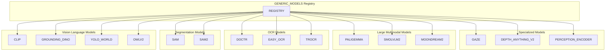

**Sources:** [inference/core/registries/roboflow.py46-62](https://github.com/roboflow/inference/blob/55f57676/inference/core/registries/roboflow.py#L46-L62)

The `GENERIC_MODELS` dictionary maps model dataset IDs to their `(TaskType, ModelType)` tuples. When a model ID like `clip/ViT-B-16` is requested, the registry extracts the dataset ID (`clip`) and looks it up in this dictionary to determine which model class to instantiate.

### Environment-Based Model Enablement

Foundation models are controlled by environment variables that enable or disable specific models at runtime. This allows for flexible deployment configurations based on hardware capabilities and use case requirements.

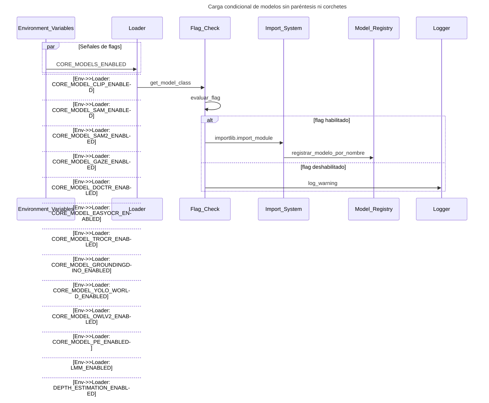
**Sources:** [inference/core/env.py149-196](https://github.com/roboflow/inference/blob/55f57676/inference/core/env.py#L149-L196) [inference/models/__init__.py74-98](https://github.com/roboflow/inference/blob/55f57676/inference/models/__init__.py#L74-L98)

The lazy loading pattern in `inference/models/__init__.py` checks environment flags before importing model modules. This prevents unnecessary imports and allows for smaller container images when certain models are disabled.

## Model Loading and Initialization Flow

Foundation models follow a different loading flow than fine-tuned models. They use the `CORE_MODEL` endpoint type and download weights from a core model bucket rather than the inference bucket.

### Core Model Type Resolution


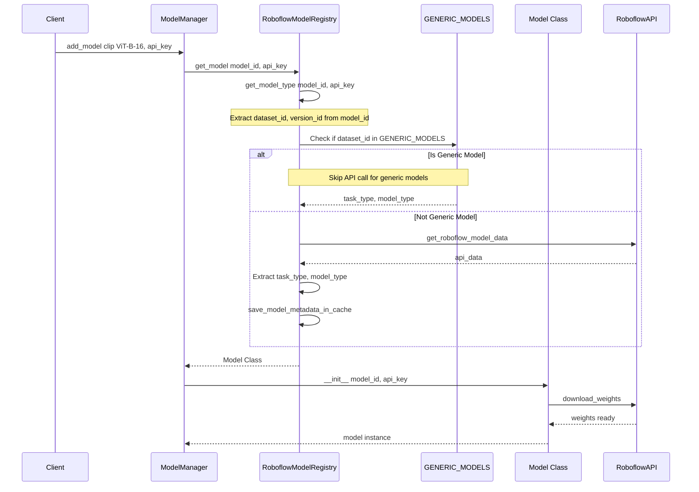
**Sources:** [inference/core/registries/roboflow.py138-237](https://github.com/roboflow/inference/blob/55f57676/inference/core/registries/roboflow.py#L138-L237) [inference/core/managers/base.py57-141](https://github.com/roboflow/inference/blob/55f57676/inference/core/managers/base.py#L57-L141)

The key difference for foundation models is at line 162-164 in `RoboflowModelRegistry.get_model_type()`: if the `dataset_id` is in `GENERIC_MODELS`, the method immediately returns the hardcoded task and model types without making an API call. This makes foundation model loading faster and independent of Roboflow API availability.

### RoboflowCoreModel Base Class

All foundation models inherit from `RoboflowCoreModel`, which provides a standardized initialization and weight download pattern.

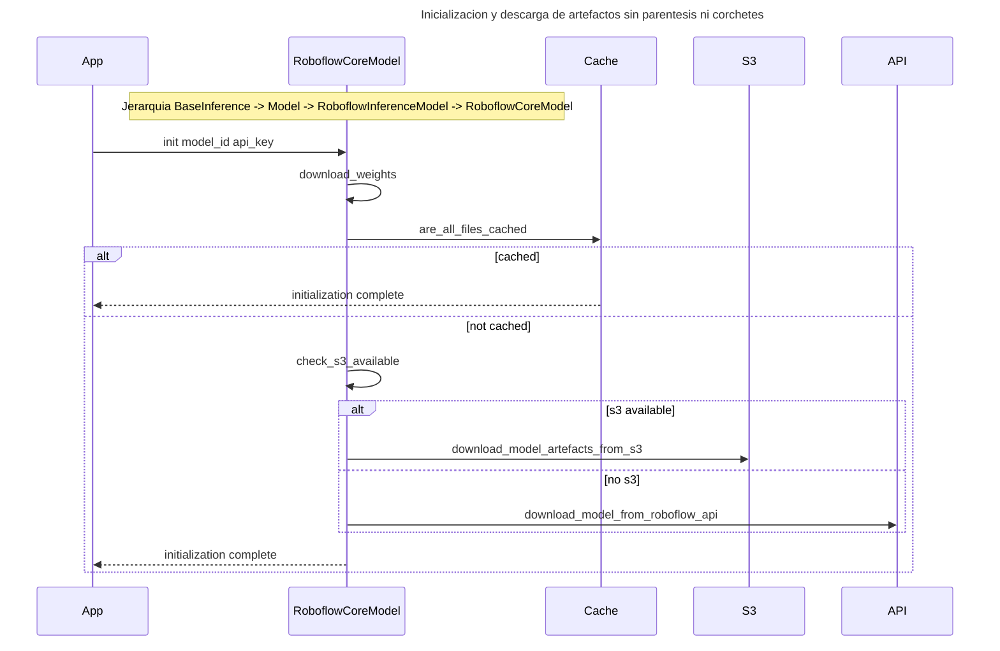
**Sources:** [inference/core/models/roboflow.py640-717](https://github.com/roboflow/inference/blob/55f57676/inference/core/models/roboflow.py#L640-L717)

The `RoboflowCoreModel.__init__()` method at line 643-656 automatically calls `download_weights()`, which handles three scenarios:

1. **Cache hit**: Files already exist locally, skip download
2. **S3 available**: Download from S3 bucket (`CORE_MODEL_BUCKET`)
3. **API fallback**: Download from Roboflow API using `ModelEndpointType.CORE_MODEL`

### Weight Download and Caching


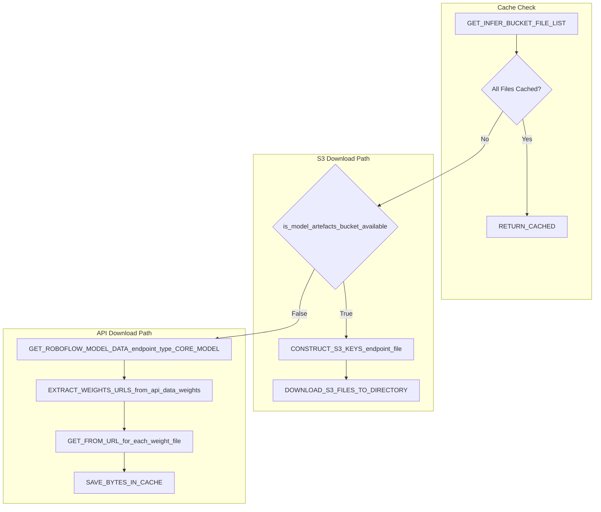
**Sources:** [inference/core/models/roboflow.py658-717](https://github.com/roboflow/inference/blob/55f57676/inference/core/models/roboflow.py#L658-L717) [inference/core/cache/model_artifacts.py26-55](https://github.com/roboflow/inference/blob/55f57676/inference/core/cache/model_artifacts.py#L26-L55)

The weight download process prioritizes local cache, then S3, then API. For core models, the API response at line 688-691 contains a `weights` dictionary with URLs for each weight file, rather than a single model file like fine-tuned models.

## HTTP API Endpoints for Foundation Models

The HTTP API provides specialized endpoints for foundation models that differ from the standard inference endpoints used by fine-tuned models.

### Core Model Loading Pattern

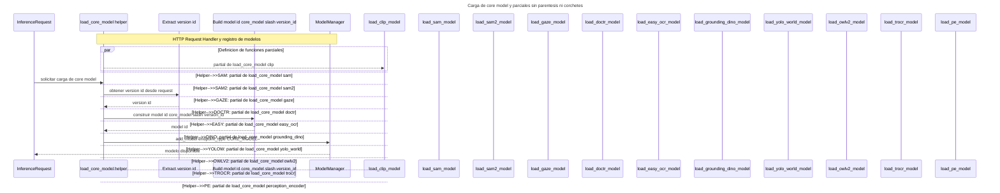
**Sources:** [inference/core/interfaces/http/http_api.py667-803](https://github.com/roboflow/inference/blob/55f57676/inference/core/interfaces/http/http_api.py#L667-L803)

The `load_core_model()` function at line 667-699 is a generic helper that:

1. Accepts an `InferenceRequest` and `core_model` name
2. Extracts the version ID from a field like `{core_model}_version_id`
3. Constructs the full model ID as `{core_model}/{version_id}`
4. Calls `model_manager.add_model()` with `endpoint_type=ModelEndpointType.CORE_MODEL`

Partial functions (lines 701-803) specialize this for each model type, making endpoint handlers cleaner.

### Example: CLIP Endpoints

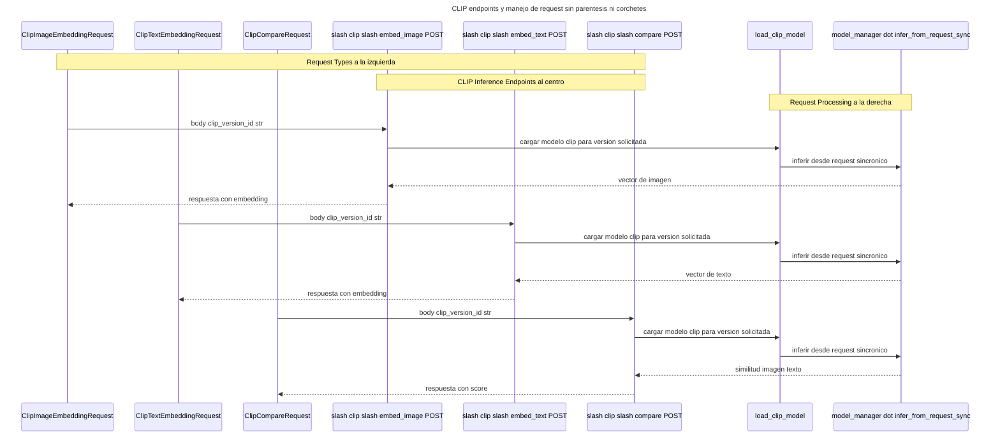

**Sources:** [inference/core/interfaces/http/http_api.py1582-1671](https://github.com/roboflow/inference/blob/55f57676/inference/core/interfaces/http/http_api.py#L1582-L1671) [inference/core/entities/requests/clip.py](https://github.com/roboflow/inference/blob/55f57676/inference/core/entities/requests/clip.py)

Each CLIP endpoint follows the same pattern:

1. Receive a typed request (e.g., `ClipImageEmbeddingRequest`) containing `clip_version_id`
2. Call `load_clip_model()` to ensure the model is loaded
3. Pass the request to `model_manager.infer_from_request_sync()`

The version ID from the request (e.g., `ViT-B-16`) gets combined with the model type (`clip`) to form the full model ID (`clip/ViT-B-16`).

## Workflow Integration

Foundation models are integrated into the workflow system through dedicated workflow blocks. These blocks wrap the core model functionality with workflow-specific metadata handling.

### Core Model Loading in Workflows


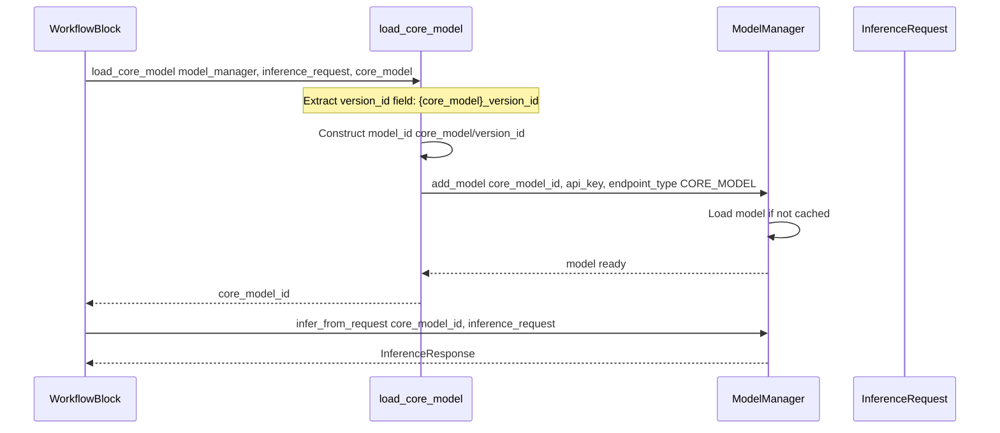
**Sources:** [inference/core/workflows/core_steps/common/utils.py57-78](https://github.com/roboflow/inference/blob/55f57676/inference/core/workflows/core_steps/common/utils.py#L57-L78)

The workflow-specific `load_core_model()` function (distinct from the HTTP API version) at line 57-78 provides a unified interface for workflow blocks to load foundation models. It extracts the version ID from the inference request object dynamically using `__getattribute__()`.

### Example: EasyOCR Workflow Block

The EasyOCR workflow block demonstrates the pattern used by all OCR foundation model blocks.

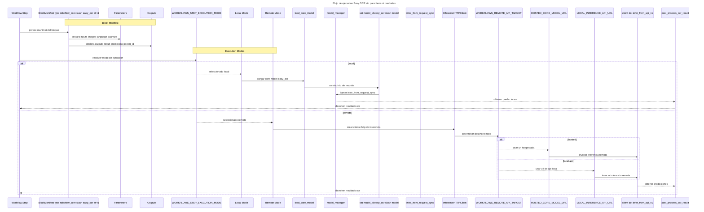
**Sources:** [inference/core/workflows/core_steps/models/foundation/easy_ocr/v1.py94-245](https://github.com/roboflow/inference/blob/55f57676/inference/core/workflows/core_steps/models/foundation/easy_ocr/v1.py#L94-L245)

The EasyOCR block supports both local and remote execution:

**Local execution** (line 164-195):

1. Constructs `EasyOCRInferenceRequest` with model and language parameters
2. Calls `load_core_model()` to ensure model is loaded
3. Runs inference through `model_manager`
4. Post-processes results to attach parent metadata

**Remote execution** (line 196-245):

1. Creates an `InferenceHTTPClient`
2. Routes to either local API or hosted API based on `WORKFLOWS_REMOTE_API_TARGET`
3. Batches requests according to `WORKFLOWS_REMOTE_EXECUTION_MAX_STEP_BATCH_SIZE`
4. Processes responses in parallel with `WORKFLOWS_REMOTE_EXECUTION_MAX_STEP_CONCURRENT_REQUESTS`

### OCR Result Post-Processing

OCR models require special post-processing to integrate with the workflow system's metadata tracking:

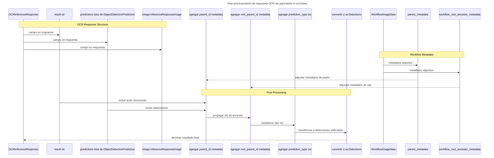
**Sources:** [inference/core/workflows/core_steps/common/utils.py457-516](https://github.com/roboflow/inference/blob/55f57676/inference/core/workflows/core_steps/common/utils.py#L457-L516)

The `post_process_ocr_result()` function at line 457-516 transforms raw OCR responses into workflow-compatible outputs by:

1. Extracting `parent_id` from `WorkflowImageData`
2. Adding `root_parent_id` from workflow ancestry metadata
3. Setting `prediction_type` to `"ocr"` for all detections
4. Converting predictions to `sv.Detections` format with metadata fields

## Model-Specific Implementations

### EasyOCR Implementation

The EasyOCR model demonstrates the pattern used by all OCR foundation models.

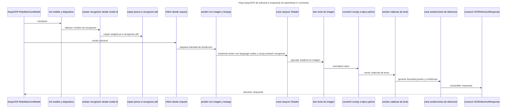
**Sources:** [inference/models/easy_ocr/easy_ocr.py34-147](https://github.com/roboflow/inference/blob/55f57676/inference/models/easy_ocr/easy_ocr.py#L34-L147)

The EasyOCR implementation has several notable characteristics:

**Initialization** (line 41-58):

- Copies `weights.pt` to `{recognizer}.pth` to match EasyOCR's expected naming
- Stores recognizer type extracted from model ID (e.g., `english_g2`)
- Sets device based on CUDA/MPS availability

**Prediction** (line 60-90):

- Creates a new `easyocr.Reader` instance for each inference (models are stateless)
- Configures reader with `download_enabled=False` and custom storage directories
- Converts numpy types in results to standard Python types for JSON serialization

**Response format** (line 120-143):

- Joins all detected text into a single `result` string
- Creates `ObjectDetectionPrediction` objects with bounding boxes for each text region
- Calculates center coordinates and dimensions from corner coordinates

### DocTR Implementation

DocTR uses a dual-model architecture with separate detection and recognition models.


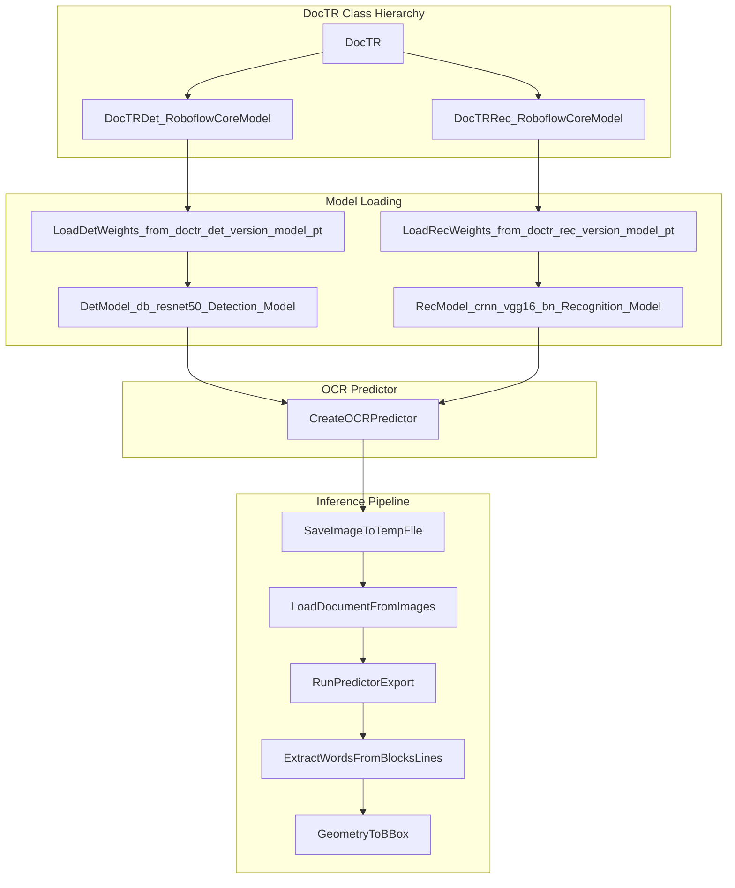
**Sources:** [inference/models/doctr/doctr_model.py49-217](https://github.com/roboflow/inference/blob/55f57676/inference/models/doctr/doctr_model.py#L49-L217)

DocTR's implementation is more complex than EasyOCR:

**Dual model structure** (line 50-81):

- `DocTRDet` and `DocTRRec` are separate `RoboflowCoreModel` instances
- Main `DocTR` class orchestrates both models
- Copies weights from separate cache locations to unified `doctr/models/` directory

**Preprocessing** (line 158-167):

- Saves numpy array to temporary file (DocTR requires file paths)
- Uses `DocumentFile.from_images()` to create document object

**Output structure** (line 168-208):

- Exports results as hierarchical structure: pages → blocks → lines → words
- Converts normalized geometry coordinates to absolute bounding boxes
- Creates `ObjectDetectionPrediction` with text content and confidence scores

## Configuration and Environment Variables

Foundation models are configured through environment variables that control model availability and behavior.

### Model Enablement Flags

|Environment Variable|Default|Purpose|Models Affected|
|---|---|---|---|
|`CORE_MODELS_ENABLED`|`True`|Master switch for all core models|All foundation models|
|`CORE_MODEL_CLIP_ENABLED`|`True`|Enable CLIP model|CLIP|
|`CORE_MODEL_SAM_ENABLED`|`True`|Enable SAM model|SAM|
|`CORE_MODEL_SAM2_ENABLED`|`True`|Enable SAM2 model|SAM2|
|`CORE_MODEL_OWLV2_ENABLED`|`False`|Enable OwlV2 model|OwlV2|
|`CORE_MODEL_GAZE_ENABLED`|`True`|Enable gaze detection|L2CS-Net|
|`CORE_MODEL_DOCTR_ENABLED`|`True`|Enable DocTR OCR|DocTR|
|`CORE_MODEL_EASYOCR_ENABLED`|`True`|Enable EasyOCR|EasyOCR|
|`CORE_MODEL_TROCR_ENABLED`|`True`|Enable TrOCR|TrOCR|
|`CORE_MODEL_GROUNDINGDINO_ENABLED`|`True`|Enable Grounding DINO|Grounding DINO|
|`CORE_MODEL_YOLO_WORLD_ENABLED`|`True`|Enable YOLO-World|YOLO-World|
|`CORE_MODEL_PE_ENABLED`|`True`|Enable Perception Encoder|Perception Encoder|
|`LMM_ENABLED`|`False`|Enable LMM models|All LMMs|
|`DEPTH_ESTIMATION_ENABLED`|`True`|Enable depth estimation|Depth Anything V2|
|`PALIGEMMA_ENABLED`|`True`|Enable PaliGemma|PaliGemma|
|`FLORENCE2_ENABLED`|`True`|Enable Florence-2|Florence-2|
|`QWEN_2_5_ENABLED`|`True`|Enable Qwen2.5-VL|Qwen2.5-VL|
|`SMOLVLM2_ENABLED`|`True`|Enable SmolVLM|SmolVLM|
|`MOONDREAM2_ENABLED`|`True`|Enable Moondream2|Moondream2|

**Sources:** [inference/core/env.py149-196](https://github.com/roboflow/inference/blob/55f57676/inference/core/env.py#L149-L196)

### Model-Specific Configuration

Foundation models also have model-specific configuration options:

|Environment Variable|Default|Purpose|
|---|---|---|
|`CLIP_VERSION_ID`|`ViT-B-16`|Default CLIP model variant|
|`CLIP_MAX_BATCH_SIZE`|`8`|Maximum batch size for CLIP inference|
|`SAM_VERSION_ID`|`vit_h`|Default SAM model size|
|`SAM_MAX_EMBEDDING_CACHE_SIZE`|`10`|Number of SAM embeddings to cache|
|`SAM2_VERSION_ID`|`hiera_large`|Default SAM2 model size|
|`SAM2_MAX_EMBEDDING_CACHE_SIZE`|`100`|Number of SAM2 embeddings to cache|
|`SAM2_MAX_LOGITS_CACHE_SIZE`|`1000`|Number of SAM2 logits to cache|
|`DISABLE_SAM2_LOGITS_CACHE`|`False`|Disable SAM2 logits caching|
|`GAZE_VERSION_ID`|`L2CS`|Default gaze detection model|
|`GAZE_MAX_BATCH_SIZE`|`8`|Maximum batch size for gaze detection|
|`EASYOCR_VERSION_ID`|`english_g2`|Default EasyOCR recognizer|
|`OWLV2_VERSION_ID`|`owlv2-large-patch14-ensemble`|Default OwlV2 variant|
|`OWLV2_IMAGE_CACHE_SIZE`|`10000`|OwlV2 image embedding cache size|
|`OWLV2_MODEL_CACHE_SIZE`|`100`|OwlV2 text embedding cache size|
|`OWLV2_CPU_IMAGE_CACHE_SIZE`|`1000`|OwlV2 CPU image cache size|
|`OWLV2_COMPILE_MODEL`|`True`|Enable PyTorch model compilation for OwlV2|
|`PERCEPTION_ENCODER_VERSION_ID`|`PE-Core-L14-336`|Default Perception Encoder variant|
|`PALIGEMMA_VERSION_ID`|`paligemma-3b-mix-224`|Default PaliGemma variant|

**Sources:** [inference/core/env.py82-116](https://github.com/roboflow/inference/blob/55f57676/inference/core/env.py#L82-L116)

### Model Cache Configuration

Foundation models share the same caching infrastructure as fine-tuned models:

|Environment Variable|Default|Purpose|
|---|---|---|
|`MODEL_CACHE_DIR`|`/tmp/cache`|Base directory for model artifacts|
|`CORE_MODEL_BUCKET`|`roboflow-core-model-prod`|S3 bucket for core model weights|

**Sources:** [inference/core/env.py338-450](https://github.com/roboflow/inference/blob/55f57676/inference/core/env.py#L338-L450)

The cache directory structure for foundation models follows the pattern:

```
{MODEL_CACHE_DIR}/
  {model_type}/
    {version_id}/
      weights.pt
      model.pt
      environment.json (if applicable)
      class_names.txt (if applicable)
```

For models like DocTR with multiple components, each component has its own cache directory (e.g., `doctr_det/db_resnet50/` and `doctr_rec/crnn_vgg16_bn/`).