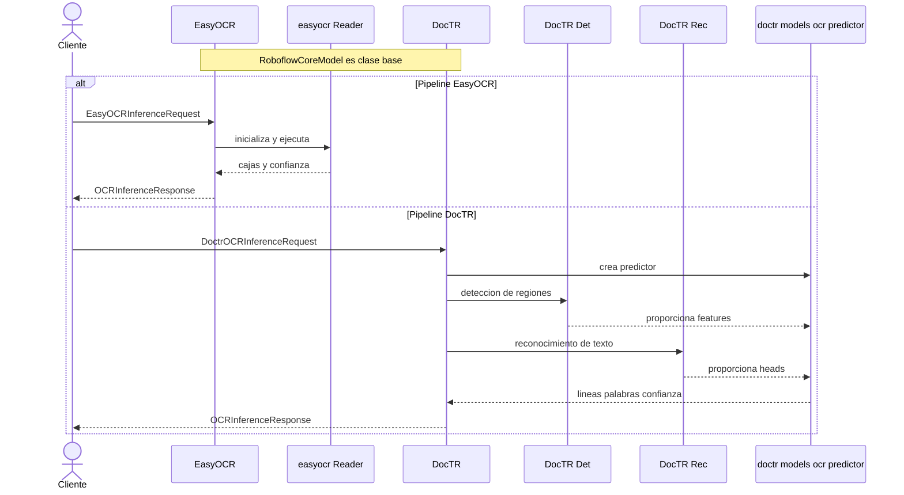
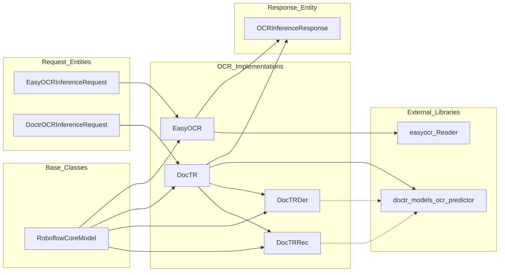
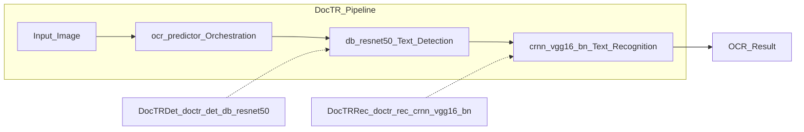
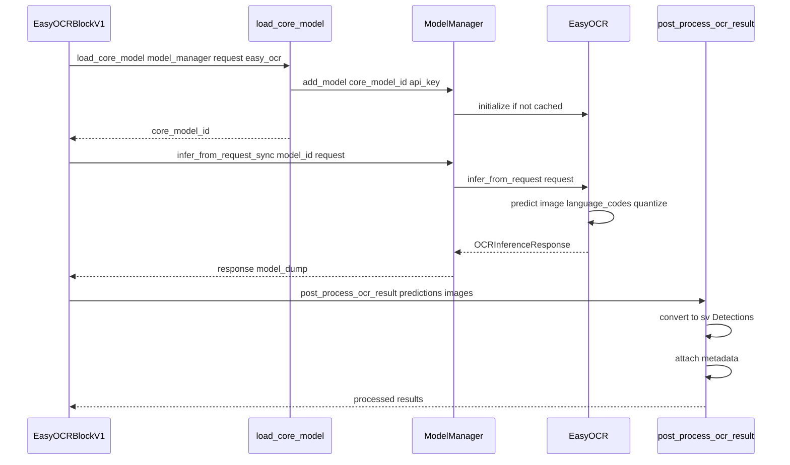

# OCR Models

Relevant source files

- [inference/core/entities/requests/easy_ocr.py](https://github.com/roboflow/inference/blob/55f57676/inference/core/entities/requests/easy_ocr.py)
- [inference/core/entities/responses/ocr.py](https://github.com/roboflow/inference/blob/55f57676/inference/core/entities/responses/ocr.py)
- [inference/core/workflows/core_steps/common/utils.py](https://github.com/roboflow/inference/blob/55f57676/inference/core/workflows/core_steps/common/utils.py)
- [inference/core/workflows/core_steps/models/foundation/easy_ocr/v1.py](https://github.com/roboflow/inference/blob/55f57676/inference/core/workflows/core_steps/models/foundation/easy_ocr/v1.py)
- [inference/core/workflows/core_steps/models/foundation/ocr/v1.py](https://github.com/roboflow/inference/blob/55f57676/inference/core/workflows/core_steps/models/foundation/ocr/v1.py)
- [inference/models/aliases.py](https://github.com/roboflow/inference/blob/55f57676/inference/models/aliases.py)
- [inference/models/doctr/doctr_model.py](https://github.com/roboflow/inference/blob/55f57676/inference/models/doctr/doctr_model.py)
- [inference/models/easy_ocr/easy_ocr.py](https://github.com/roboflow/inference/blob/55f57676/inference/models/easy_ocr/easy_ocr.py)
- [inference_sdk/http/utils/aliases.py](https://github.com/roboflow/inference/blob/55f57676/inference_sdk/http/utils/aliases.py)
- [tests/inference/hosted_platform_tests/test_core_models.py](https://github.com/roboflow/inference/blob/55f57676/tests/inference/hosted_platform_tests/test_core_models.py)
- [tests/inference/integration_tests/doctr_test.py](https://github.com/roboflow/inference/blob/55f57676/tests/inference/integration_tests/doctr_test.py)
- [tests/inference/integration_tests/easy_ocr_test.py](https://github.com/roboflow/inference/blob/55f57676/tests/inference/integration_tests/easy_ocr_test.py)
- [tests/workflows/unit_tests/core_steps/models/foundation/test_easy_ocr.py](https://github.com/roboflow/inference/blob/55f57676/tests/workflows/unit_tests/core_steps/models/foundation/test_easy_ocr.py)

## Purpose and Scope

This document describes the Optical Character Recognition (OCR) model implementations in Roboflow Inference. The system provides two OCR engines: **EasyOCR** and **DocTR**, both exposed as core models with consistent request/response interfaces and workflow block integration.

For information about other foundation models, see [Foundation Models](https://deepwiki.com/roboflow/inference/5.2-foundation-models). For general model architecture patterns, see [Model Ecosystem](https://deepwiki.com/roboflow/inference/5-model-ecosystem).

## Overview

Roboflow Inference supports two OCR implementations, each with distinct characteristics:

|Model|Library|Use Case|Language Support|Quantization|
|---|---|---|---|---|
|**EasyOCR**|`easyocr`|Scene text, multi-language|80+ languages|Optional|
|**DocTR**|`doctr`|Document text, structured layouts|Latin-based|N/A|

Both implementations:

- Inherit from `RoboflowCoreModel` base class
- Return `OCRInferenceResponse` with extracted text and bounding boxes
- Support batch and single-image inference
- Integrate with the workflow system via dedicated blocks

**Sources:** [inference/models/easy_ocr/easy_ocr.py34-147](https://github.com/roboflow/inference/blob/55f57676/inference/models/easy_ocr/easy_ocr.py#L34-L147) [inference/models/doctr/doctr_model.py49-216](https://github.com/roboflow/inference/blob/55f57676/inference/models/doctr/doctr_model.py#L49-L216) [inference/core/entities/responses/ocr.py11-36](https://github.com/roboflow/inference/blob/55f57676/inference/core/entities/responses/ocr.py#L11-L36)

## Model Architecture








**Sources:** [inference/models/easy_ocr/easy_ocr.py34-50](https://github.com/roboflow/inference/blob/55f57676/inference/models/easy_ocr/easy_ocr.py#L34-L50) [inference/models/doctr/doctr_model.py49-98](https://github.com/roboflow/inference/blob/55f57676/inference/models/doctr/doctr_model.py#L49-L98) [inference/core/entities/responses/ocr.py11-36](https://github.com/roboflow/inference/blob/55f57676/inference/core/entities/responses/ocr.py#L11-L36)

## EasyOCR Implementation

### Model Class

The `EasyOCR` class provides multi-language text recognition with optional quantization for performance optimization.

**Class Definition:** [inference/models/easy_ocr/easy_ocr.py34-147](https://github.com/roboflow/inference/blob/55f57676/inference/models/easy_ocr/easy_ocr.py#L34-L147)

**Key Attributes:**

- `model_id`: Format `easy_ocr/{recognizer}` (e.g., `easy_ocr/english_g2`)
- `device`: Target device (cuda:0, mps, or cpu) auto-detected from environment
- `task_type`: Set to `"ocr"`
- `recognizer`: Language-specific recognizer model identifier

**Initialization:** [inference/models/easy_ocr/easy_ocr.py41-58](https://github.com/roboflow/inference/blob/55f57676/inference/models/easy_ocr/easy_ocr.py#L41-L58)

The constructor copies weights to the expected location for the EasyOCR library:

```
shutil.copyfile(
    f"{MODEL_CACHE_DIR}/{model_id}/weights.pt",
    f"{MODEL_CACHE_DIR}/{model_id}/{self.recognizer}.pth",
)
```

### Language Support

EasyOCR supports multiple language configurations, defined in the workflow block manifest:

|Language|Recognizer|Language Codes|
|---|---|---|
|English|`english_g2`|`["en"]`|
|Japanese|`japanese_g2`|`["en", "ja"]`|
|Kannada|`kannada_g2`|`["en", "kn"]`|
|Korean|`korean_g2`|`["en", "ko"]`|
|Latin|`latin_g2`|`["en", "la", "es", "fr", "it", "pt", "de", "pl", "nl"]`|
|Telugu|`telugu_g2`|`["en", "te"]`|
|Simplified Chinese|`zh_sim_g2`|`["en", "ch_sim"]`|

**Sources:** [inference/core/workflows/core_steps/models/foundation/easy_ocr/v1.py47-67](https://github.com/roboflow/inference/blob/55f57676/inference/core/workflows/core_steps/models/foundation/easy_ocr/v1.py#L47-L67)

### Prediction Pipeline

The `predict` method creates a new `easyocr.Reader` instance per inference call:

**Implementation:** [inference/models/easy_ocr/easy_ocr.py60-90](https://github.com/roboflow/inference/blob/55f57676/inference/models/easy_ocr/easy_ocr.py#L60-L90)

**Parameters:**

- `language_codes`: List of language codes (default: `["en"]`)
- `quantize`: Boolean flag for model quantization (default: `False`)

**Reader Configuration:**

- `download_enabled=False`: Weights pre-downloaded to cache
- `user_network_directory`: Points to model cache
- `detect_network="craft"`: CRAFT text detection
- `recog_network`: Language-specific recognizer

**Output Format:** List of tuples `(bounding_box, text, confidence)` where bounding box is a list of four `[x, y]` coordinates.

### Response Generation

The `infer_from_request` method handles both single images and batches:

**Implementation:** [inference/models/easy_ocr/easy_ocr.py108-143](https://github.com/roboflow/inference/blob/55f57676/inference/models/easy_ocr/easy_ocr.py#L108-L143)

Each prediction is converted to an `OCRInferenceResponse`:

- `result`: Space-joined text from all detections
- `predictions`: List of `ObjectDetectionPrediction` objects with bounding boxes
- `time`: Inference duration
- Bounding boxes converted from corner coordinates to center + width/height format

**Sources:** [inference/models/easy_ocr/easy_ocr.py60-143](https://github.com/roboflow/inference/blob/55f57676/inference/models/easy_ocr/easy_ocr.py#L60-L143)

## DocTR Implementation

### Model Architecture

DocTR uses a two-stage pipeline combining separate detection and recognition models.

clarísimo. acá tenés el **flowchart** en Mermaid de ese pipeline, sin paréntesis, corchetes, pipes ni html, y con guiones bajos en lugar de espacios:



si necesitás que aparezca el texto loads_weights en los vínculos punteados, lo pongo como noditos intermedios para no usar pipes.
**Sources:** [inference/models/doctr/doctr_model.py49-98](https://github.com/roboflow/inference/blob/55f57676/inference/models/doctr/doctr_model.py#L49-L98)

### Component Classes

The implementation uses three model classes:

1. **DocTRDet** [inference/models/doctr/doctr_model.py243-272](https://github.com/roboflow/inference/blob/55f57676/inference/models/doctr/doctr_model.py#L243-L272)
    
    - Model ID: `doctr_det/db_resnet50`
    - Provides detection model weights
2. **DocTRRec** [inference/models/doctr/doctr_model.py219-241](https://github.com/roboflow/inference/blob/55f57676/inference/models/doctr/doctr_model.py#L219-L241)
    
    - Model ID: `doctr_rec/crnn_vgg16_bn`
    - Provides recognition model weights
3. **DocTR** [inference/models/doctr/doctr_model.py49-216](https://github.com/roboflow/inference/blob/55f57676/inference/models/doctr/doctr_model.py#L49-L216)
    
    - Main orchestrator
    - Initializes and coordinates detection/recognition models

### Initialization

The `DocTR` constructor assembles the complete pipeline:

**Implementation:** [inference/models/doctr/doctr_model.py50-98](https://github.com/roboflow/inference/blob/55f57676/inference/models/doctr/doctr_model.py#L50-L98)

**Steps:**

1. Instantiate `DocTRDet` and `DocTRRec` sub-models
2. Copy weights from cache to DocTR models directory
3. Load detection model (`db_resnet50`) from weights
4. Load recognition model (`crnn_vgg16_bn`) from weights
5. Create `ocr_predictor` combining both models

### Inference Pipeline

The `infer` method processes images through the complete OCR pipeline:

**Implementation:** [inference/models/doctr/doctr_model.py143-208](https://github.com/roboflow/inference/blob/55f57676/inference/models/doctr/doctr_model.py#L143-L208)

**Processing Steps:**

1. **Image Loading**: Load image via `load_image` utility
2. **Document Conversion**: Save to temporary file and load as `DocumentFile`
3. **OCR Execution**: Run `self.model(doc).export()`
4. **Result Extraction**:
    - Parse hierarchical structure (pages → blocks → lines → words)
    - Extract text values and geometries
    - Convert normalized coordinates to pixel coordinates

### Bounding Box Generation

When `generate_bounding_boxes=True`, the model converts normalized geometries to pixel coordinates:

**Conversion Function:** [inference/models/doctr/doctr_model.py33-46](https://github.com/roboflow/inference/blob/55f57676/inference/models/doctr/doctr_model.py#L33-L46)

```
def _geometry_to_bbox(page_dimensions: Tuple[int, int], geometry: dict) -> list[int]:
    x_min = int(page_dimensions[1] * geometry[0][0])
    y_min = int(page_dimensions[0] * geometry[0][1])
    x_max = int(page_dimensions[1] * geometry[1][0])
    y_max = int(page_dimensions[0] * geometry[1][1])
    return [x_min, y_min, x_max, y_max]
```

The response includes:

- `result`: Space-joined text from all words
- `image`: Image dimensions metadata
- `predictions`: List of `ObjectDetectionPrediction` with bounding boxes, confidence, and text

**Sources:** [inference/models/doctr/doctr_model.py33-208](https://github.com/roboflow/inference/blob/55f57676/inference/models/doctr/doctr_model.py#L33-L208)

## Request and Response Formats

### EasyOCRInferenceRequest

**Definition:** [inference/core/entities/requests/easy_ocr.py12-38](https://github.com/roboflow/inference/blob/55f57676/inference/core/entities/requests/easy_ocr.py#L12-L38)

**Fields:**

- `image`: Single `InferenceRequestImage` or list of images
- `easy_ocr_version_id`: Recognizer identifier (default from `EASYOCR_VERSION_ID` env var)
- `model_id`: Computed as `easy_ocr/{easy_ocr_version_id}`
- `language_codes`: List of language codes (default: `["en"]`)
- `quantize`: Boolean flag for quantization (default: `False`)
- `api_key`: Roboflow API key for authentication

### DoctrOCRInferenceRequest

**Definition:** Referenced in [inference/core/entities/requests/doctr.py](https://github.com/roboflow/inference/blob/55f57676/inference/core/entities/requests/doctr.py)

**Fields:**

- `image`: Single `InferenceRequestImage` or list of images
- `generate_bounding_boxes`: Boolean flag to include bounding boxes in response
- `api_key`: Roboflow API key for authentication

### OCRInferenceResponse

**Definition:** [inference/core/entities/responses/ocr.py11-36](https://github.com/roboflow/inference/blob/55f57676/inference/core/entities/responses/ocr.py#L11-L36)

**Fields:**

|Field|Type|Description|
|---|---|---|
|`result`|`str`|Combined OCR text (space-joined)|
|`image`|`Optional[InferenceResponseImage]`|Image dimensions metadata|
|`predictions`|`Optional[List[ObjectDetectionPrediction]]`|Bounding boxes for detected text|
|`time`|`float`|Inference duration in seconds|
|`parent_id`|`Optional[str]`|Parent image region identifier|

Each `ObjectDetectionPrediction` in `predictions` contains:

- `x`, `y`: Center coordinates of text region
- `width`, `height`: Dimensions of bounding box
- `confidence`: Detection confidence score
- `class`: Extracted text string
- `class_id`: Always `0` for OCR
- `detection_id`: UUID for the detection

**Sources:** [inference/core/entities/responses/ocr.py11-36](https://github.com/roboflow/inference/blob/55f57676/inference/core/entities/responses/ocr.py#L11-L36) [inference/core/entities/requests/easy_ocr.py12-38](https://github.com/roboflow/inference/blob/55f57676/inference/core/entities/requests/easy_ocr.py#L12-L38)

## Workflow Block Integration

Both OCR implementations provide workflow blocks for use in the Workflows execution engine.

### Block Execution Modes

Both blocks support two execution modes determined by `StepExecutionMode`:

1. **LOCAL**: Inference runs on local `ModelManager` instance
2. **REMOTE**: Requests routed to remote inference API (hosted or local)

**Sources:** [inference/core/workflows/core_steps/models/foundation/easy_ocr/v1.py148-196](https://github.com/roboflow/inference/blob/55f57676/inference/core/workflows/core_steps/models/foundation/easy_ocr/v1.py#L148-L196) [inference/core/workflows/core_steps/models/foundation/ocr/v1.py110-201](https://github.com/roboflow/inference/blob/55f57676/inference/core/workflows/core_steps/models/foundation/ocr/v1.py#L110-L201)

### EasyOCR Workflow Block

**Implementation:** [inference/core/workflows/core_steps/models/foundation/easy_ocr/v1.py94-270](https://github.com/roboflow/inference/blob/55f57676/inference/core/workflows/core_steps/models/foundation/easy_ocr/v1.py#L94-L270)

**Block Manifest:**

```
type: Literal["roboflow_core/easy_ocr@v1", "EasyOCR"]
name: str  # Step name
images: Selector(kind=[IMAGE_KIND])
language: LANGUAGES  # "English", "Japanese", etc.
quantize: bool = False
```

**Output Definitions:** [inference/core/workflows/core_steps/models/foundation/easy_ocr/v1.py132-141](https://github.com/roboflow/inference/blob/55f57676/inference/core/workflows/core_steps/models/foundation/easy_ocr/v1.py#L132-L141)

- `result` (STRING_KIND): Extracted text
- `predictions` (OBJECT_DETECTION_PREDICTION_KIND): Detections with bounding boxes
- `parent_id` (PARENT_ID_KIND): Parent image identifier
- `root_parent_id` (PARENT_ID_KIND): Root ancestor identifier
- `prediction_type` (PREDICTION_TYPE_KIND): Set to `"ocr"`

**Local Execution Flow:**





**Sources:** [inference/core/workflows/core_steps/models/foundation/easy_ocr/v1.py197-230](https://github.com/roboflow/inference/blob/55f57676/inference/core/workflows/core_steps/models/foundation/easy_ocr/v1.py#L197-L230)

**Remote Execution:** [inference/core/workflows/core_steps/models/foundation/easy_ocr/v1.py232-269](https://github.com/roboflow/inference/blob/55f57676/inference/core/workflows/core_steps/models/foundation/easy_ocr/v1.py#L232-L269)

Routes requests to inference API via `InferenceHTTPClient`:

- Target URL: `LOCAL_INFERENCE_API_URL` or `HOSTED_CORE_MODEL_URL`
- API version: v0 for hosted, default for local
- Batch configuration via `InferenceConfiguration`

### OCR Model (DocTR) Workflow Block

**Implementation:** [inference/core/workflows/core_steps/models/foundation/ocr/v1.py68-201](https://github.com/roboflow/inference/blob/55f57676/inference/core/workflows/core_steps/models/foundation/ocr/v1.py#L68-L201)

**Block Manifest:**

```
type: Literal["roboflow_core/ocr_model@v1", "OCRModel"]
name: str  # Step name
images: Selector(kind=[IMAGE_KIND])
```

**Output Definitions:** [inference/core/workflows/core_steps/models/foundation/ocr/v1.py94-103](https://github.com/roboflow/inference/blob/55f57676/inference/core/workflows/core_steps/models/foundation/ocr/v1.py#L94-L103)

Identical to EasyOCR block: `result`, `predictions`, `parent_id`, `root_parent_id`, `prediction_type`.

**Local Execution:** [inference/core/workflows/core_steps/models/foundation/ocr/v1.py144-168](https://github.com/roboflow/inference/blob/55f57676/inference/core/workflows/core_steps/models/foundation/ocr/v1.py#L144-L168)

Uses `DoctrOCRInferenceRequest` with `generate_bounding_boxes=True` to ensure predictions are included.

**Remote Execution:** [inference/core/workflows/core_steps/models/foundation/ocr/v1.py170-201](https://github.com/roboflow/inference/blob/55f57676/inference/core/workflows/core_steps/models/foundation/ocr/v1.py#L170-L201)

Calls `client.ocr_image()` which routes to DocTR by default.

**Sources:** [inference/core/workflows/core_steps/models/foundation/ocr/v1.py68-201](https://github.com/roboflow/inference/blob/55f57676/inference/core/workflows/core_steps/models/foundation/ocr/v1.py#L68-L201)

## OCR Postprocessing

The workflow blocks use a shared postprocessing utility to normalize OCR results.

### post_process_ocr_result Function

**Implementation:** [inference/core/workflows/core_steps/common/utils.py432-448](https://github.com/roboflow/inference/blob/55f57676/inference/core/workflows/core_steps/common/utils.py#L432-L448)

**Purpose:** Convert raw OCR responses to workflow-compatible format with `sv.Detections` and metadata.

**Processing Steps:**

1. **Extract Detection IDs**: Preserve UUIDs from predictions
2. **Convert to Detections**: Use `sv.Detections.from_inference(prediction)`
3. **Attach Detection IDs**: Store as numpy array in detections data
4. **Set Prediction Type**: Add `"ocr"` type marker
5. **Attach Parent IDs**: Link to parent and root parent images
6. **Remove Unexpected Keys**: Filter response to expected output keys

**Expected Output Keys:** [inference/core/workflows/core_steps/models/foundation/easy_ocr/v1.py85-91](https://github.com/roboflow/inference/blob/55f57676/inference/core/workflows/core_steps/models/foundation/easy_ocr/v1.py#L85-L91)

```
EXPECTED_OUTPUT_KEYS = {
    "result",
    "parent_id", 
    "root_parent_id",
    "prediction_type",
    "predictions",
}
```

**Key Operations:**

```
# Convert predictions dict to sv.Detections
prediction["predictions"] = sv.Detections.from_inference(prediction)

# Attach detection IDs
prediction["predictions"]["detection_id"] = detection_ids

# Set prediction type
prediction[PREDICTION_TYPE_KEY] = "ocr"

# Link to parent images
prediction[PARENT_ID_KEY] = image.parent_metadata.parent_id
prediction[ROOT_PARENT_ID_KEY] = image.workflow_root_ancestor_metadata.parent_id
```

This normalization ensures OCR results are compatible with downstream workflow blocks that expect `sv.Detections` format.

**Sources:** [inference/core/workflows/core_steps/common/utils.py432-448](https://github.com/roboflow/inference/blob/55f57676/inference/core/workflows/core_steps/common/utils.py#L432-L448) [inference/core/workflows/core_steps/models/foundation/easy_ocr/v1.py85-91](https://github.com/roboflow/inference/blob/55f57676/inference/core/workflows/core_steps/models/foundation/easy_ocr/v1.py#L85-L91)

## Model Loading and Caching

### Core Model Registration

OCR models are loaded via the `load_core_model` utility:

**Implementation:** [inference/core/workflows/core_steps/common/utils.py57-78](https://github.com/roboflow/inference/blob/55f57676/inference/core/workflows/core_steps/common/utils.py#L57-L78)

```
def load_core_model(
    model_manager: ModelManager,
    inference_request: Union[DoctrOCRInferenceRequest, EasyOCRInferenceRequest, ...],
    core_model: str,
) -> str:
    version_id_field = f"{core_model}_version_id"
    core_model_id = f"{core_model}/{inference_request.__getattribute__(version_id_field)}"
    
    model_manager.add_model(
        core_model_id,
        inference_request.api_key,
        endpoint_type=ModelEndpointType.CORE_MODEL,
    )
    
    return core_model_id
```

**Model ID Construction:**

- EasyOCR: `easy_ocr/{easy_ocr_version_id}` (e.g., `easy_ocr/english_g2`)
- DocTR: `doctr/{doctr_version_id}` (e.g., `doctr/db_resnet50`)

**Endpoint Type:** `ModelEndpointType.CORE_MODEL` marks these as foundation models in the registry.

### Weight Management

Both implementations manage model weights through the cache system:

**EasyOCR:** [inference/models/easy_ocr/easy_ocr.py145-146](https://github.com/roboflow/inference/blob/55f57676/inference/models/easy_ocr/easy_ocr.py#L145-L146)

```
def get_infer_bucket_file_list(self) -> List[str]:
    return ["weights.pt", "craft_mlt_25k.pth"]
```

**DocTR:** [inference/models/doctr/doctr_model.py210-216](https://github.com/roboflow/inference/blob/55f57676/inference/models/doctr/doctr_model.py#L210-L216)

```
def get_infer_bucket_file_list(self) -> list:
    return ["model.pt"]
```

These lists define which files the model manager should download from the artifact bucket.

**Sources:** [inference/core/workflows/core_steps/common/utils.py57-78](https://github.com/roboflow/inference/blob/55f57676/inference/core/workflows/core_steps/common/utils.py#L57-L78) [inference/models/easy_ocr/easy_ocr.py145-146](https://github.com/roboflow/inference/blob/55f57676/inference/models/easy_ocr/easy_ocr.py#L145-L146) [inference/models/doctr/doctr_model.py210-216](https://github.com/roboflow/inference/blob/55f57676/inference/models/doctr/doctr_model.py#L210-L216)

## API Endpoints

OCR models are accessible via HTTP endpoints defined in the alias registry.

### Endpoint Mapping

**Definition:** [inference_sdk/http/utils/aliases.py93-97](https://github.com/roboflow/inference/blob/55f57676/inference_sdk/http/utils/aliases.py#L93-L97)

```
OCR_ENDPOINTS = {
    "doctr": "/doctr/ocr",
    "trocr": "/ocr/trocr", 
    "easy_ocr": "/easy_ocr/ocr",
}
```

### Client SDK Usage

The `InferenceHTTPClient` provides a unified `ocr_image` method:

**Usage Pattern:**

```
client.ocr_image(
    inference_input=images,
    model="easy_ocr",  # or "doctr"
    version=version_id,
    quantize=False,
    language_codes=["en"],
)
```

The SDK resolves the endpoint path using `resolve_ocr_path()` [inference_sdk/http/utils/aliases.py112-124](https://github.com/roboflow/inference/blob/55f57676/inference_sdk/http/utils/aliases.py#L112-L124)

**Sources:** [inference_sdk/http/utils/aliases.py93-125](https://github.com/roboflow/inference/blob/55f57676/inference_sdk/http/utils/aliases.py#L93-L125) [tests/inference/hosted_platform_tests/test_core_models.py65-84](https://github.com/roboflow/inference/blob/55f57676/tests/inference/hosted_platform_tests/test_core_models.py#L65-L84)

## Integration Testing

OCR models are tested across multiple environments with common test patterns.

### Test Structure

**EasyOCR Tests:** [tests/inference/integration_tests/easy_ocr_test.py14-52](https://github.com/roboflow/inference/blob/55f57676/tests/inference/integration_tests/easy_ocr_test.py#L14-L52)

**DocTR Tests:** [tests/inference/integration_tests/doctr_test.py14-52](https://github.com/roboflow/inference/blob/55f57676/tests/inference/integration_tests/doctr_test.py#L14-L52)

**Common Assertions:**

1. Response contains `"result"` field (extracted text)
2. Response contains `"predictions"` field (bounding boxes)
3. Result is a non-empty string
4. Batch inputs return list of results

### Sample Test Case

```
payload = {
    "image": {
        "type": "url",
        "value": "https://media.roboflow.com/swift.png",
    }
}
response = requests.post(f"{base_url}:{port}/easy_ocr/ocr", json=payload)
data = response.json()

assert "result" in data
assert "predictions" in data
assert isinstance(data["result"], str) and len(data["result"]) > 0
```

### Platform Testing

**Hosted Platform Tests:** [tests/inference/hosted_platform_tests/test_core_models.py64-106](https://github.com/roboflow/inference/blob/55f57676/tests/inference/hosted_platform_tests/test_core_models.py#L64-L106)

Tests verify:

- Authentication requirements (API key validation)
- URL security restrictions (HTTPS only, no IP addresses)
- Response format consistency
- Batch processing capabilities

**Sources:** [tests/inference/integration_tests/easy_ocr_test.py14-111](https://github.com/roboflow/inference/blob/55f57676/tests/inference/integration_tests/easy_ocr_test.py#L14-L111) [tests/inference/integration_tests/doctr_test.py14-111](https://github.com/roboflow/inference/blob/55f57676/tests/inference/integration_tests/doctr_test.py#L14-L111) [tests/inference/hosted_platform_tests/test_core_models.py64-198](https://github.com/roboflow/inference/blob/55f57676/tests/inference/hosted_platform_tests/test_core_models.py#L64-L198)

## Usage Examples

### Workflow Block Usage

```
{
  "version": "1.0",
  "inputs": [
    {"type": "InferenceImage", "name": "image"}
  ],
  "steps": [
    {
      "type": "roboflow_core/easy_ocr@v1",
      "name": "ocr_step",
      "images": "$inputs.image",
      "language": "English",
      "quantize": false
    }
  ],
  "outputs": [
    {"type": "JsonField", "name": "text", "selector": "$steps.ocr_step.result"},
    {"type": "JsonField", "name": "detections", "selector": "$steps.ocr_step.predictions"}
  ]
}
```

### Direct Model Usage

```
from inference.models.easy_ocr import EasyOCR

model = EasyOCR(model_id="easy_ocr/english_g2")
result = model.infer(
    image="path/to/image.jpg",
    language_codes=["en"],
    quantize=False
)
# result is (predictions, image_metadata) tuple
```

**Sources:** [inference/core/workflows/core_steps/models/foundation/easy_ocr/v1.py94-141](https://github.com/roboflow/inference/blob/55f57676/inference/core/workflows/core_steps/models/foundation/easy_ocr/v1.py#L94-L141) [inference/models/easy_ocr/easy_ocr.py60-106](https://github.com/roboflow/inference/blob/55f57676/inference/models/easy_ocr/easy_ocr.py#L60-L106)