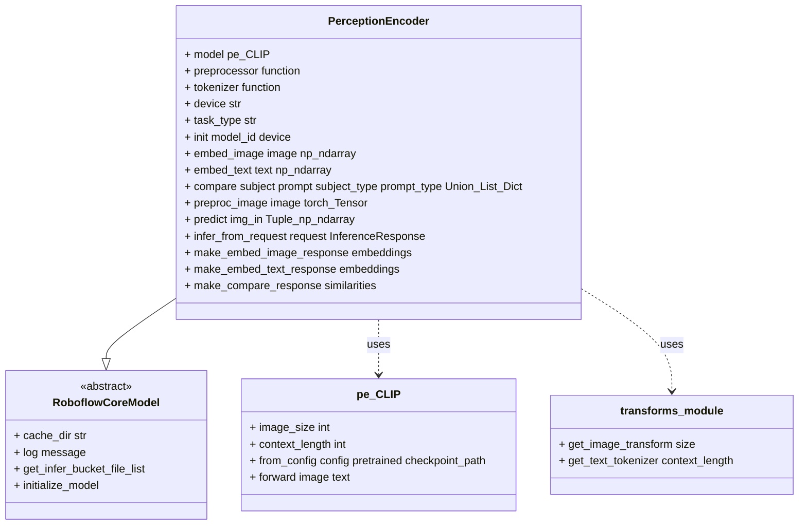
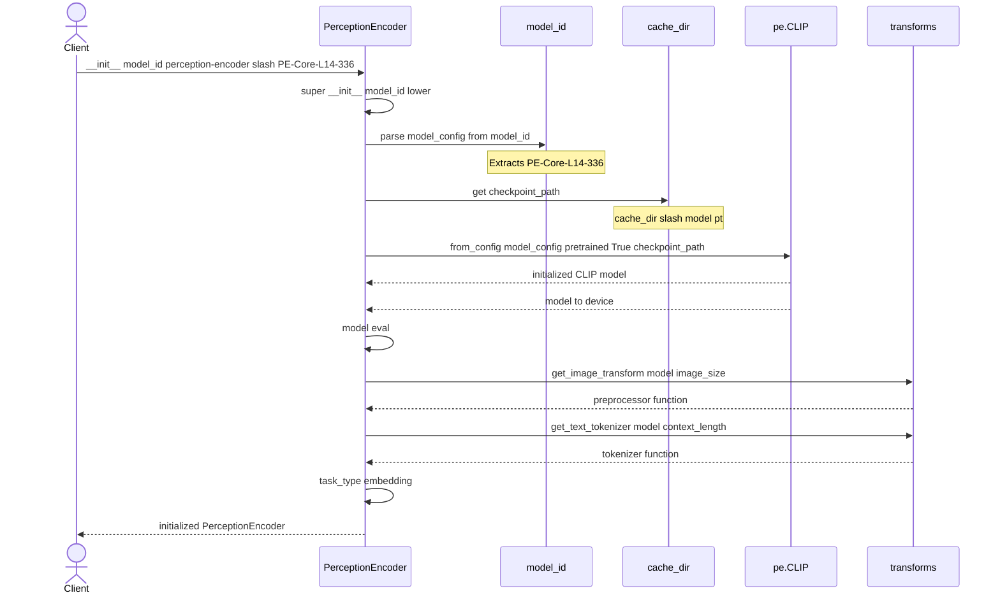
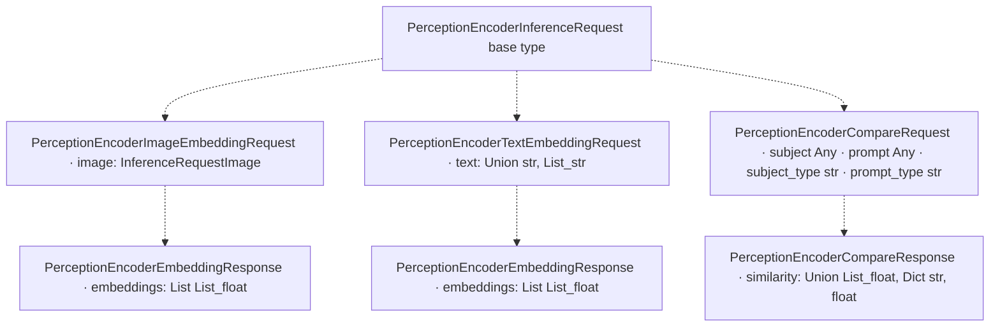
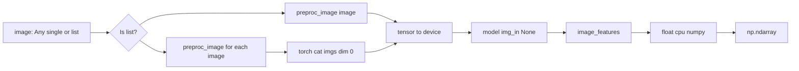
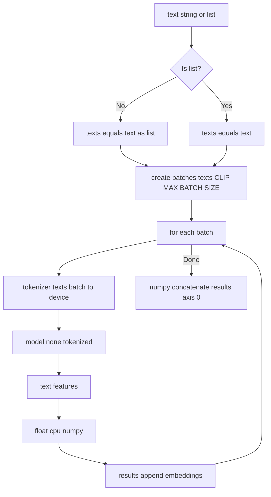
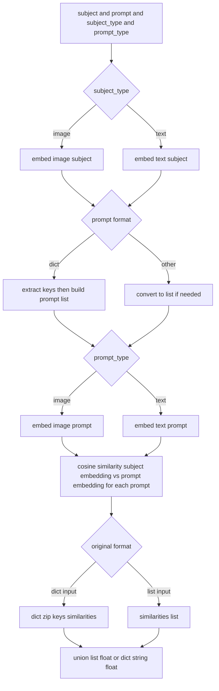
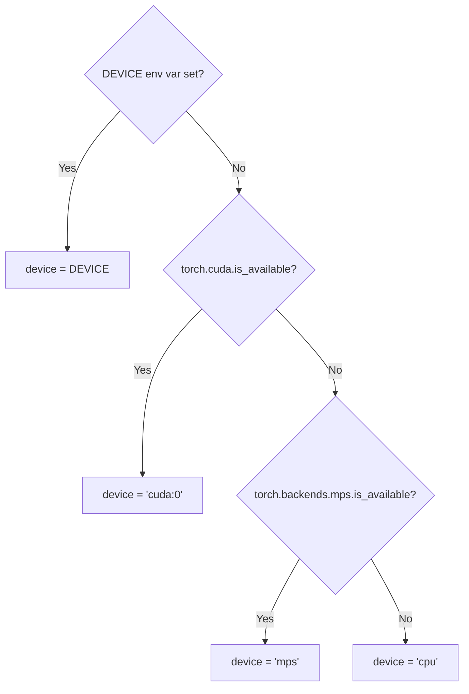
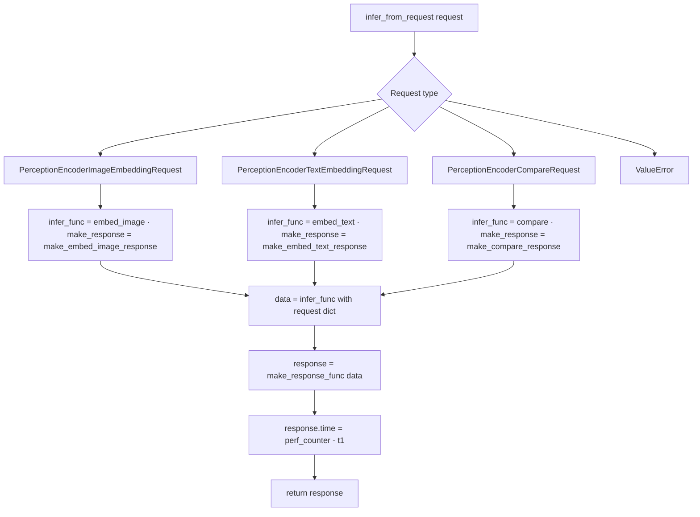
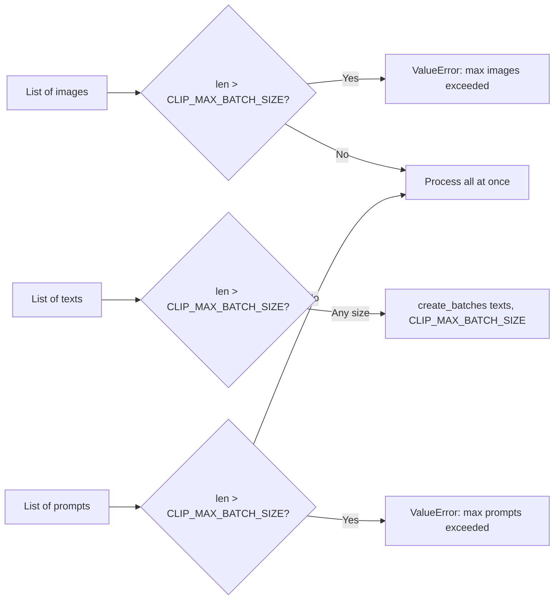
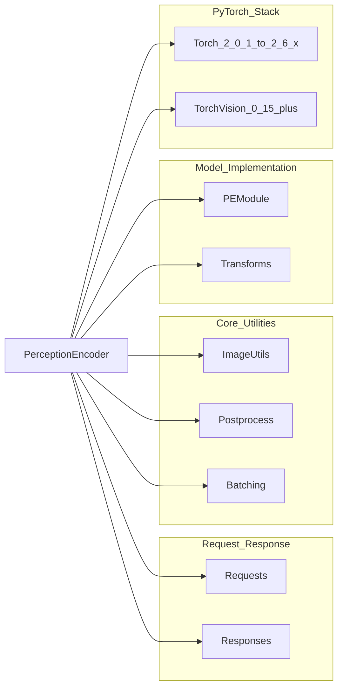

# Perception Encoder

Relevant source files

- [inference/models/README.md](https://github.com/roboflow/inference/blob/55f57676/inference/models/README.md)
- [inference/models/perception_encoder/LICENSE](https://github.com/roboflow/inference/blob/55f57676/inference/models/perception_encoder/LICENSE)
- [inference/models/perception_encoder/__init__.py](https://github.com/roboflow/inference/blob/55f57676/inference/models/perception_encoder/__init__.py)
- [inference/models/perception_encoder/perception_encoder.py](https://github.com/roboflow/inference/blob/55f57676/inference/models/perception_encoder/perception_encoder.py)
- [requirements/_requirements.txt](https://github.com/roboflow/inference/blob/55f57676/requirements/_requirements.txt)
- [requirements/requirements.cli.txt](https://github.com/roboflow/inference/blob/55f57676/requirements/requirements.cli.txt)
- [requirements/requirements.sam.txt](https://github.com/roboflow/inference/blob/55f57676/requirements/requirements.sam.txt)
- [requirements/requirements.sdk.http.txt](https://github.com/roboflow/inference/blob/55f57676/requirements/requirements.sdk.http.txt)
- [requirements/requirements.test.unit.txt](https://github.com/roboflow/inference/blob/55f57676/requirements/requirements.test.unit.txt)
- [requirements/requirements.transformers.txt](https://github.com/roboflow/inference/blob/55f57676/requirements/requirements.transformers.txt)
- [tests/inference/models_predictions_tests/test_perception_encoder.py](https://github.com/roboflow/inference/blob/55f57676/tests/inference/models_predictions_tests/test_perception_encoder.py)

## Purpose and Scope

This document covers the **Perception Encoder** model implementation, a foundation model for generating image and text embeddings based on the PE-CLIP architecture. Perception Encoder enables zero-shot image classification, image-text similarity matching, and semantic search capabilities within the Roboflow Inference server.

For general information about foundation models, see [Foundation Models](https://deepwiki.com/roboflow/inference/5.2-foundation-models). For details on other specialized vision models, see [OwlV2 Few-Shot Detection](https://deepwiki.com/roboflow/inference/5.3-owlv2-few-shot-detection) or [OCR Models](https://deepwiki.com/roboflow/inference/5.4-ocr-models).

**Sources:** [inference/models/perception_encoder/perception_encoder.py1-317](https://github.com/roboflow/inference/blob/55f57676/inference/models/perception_encoder/perception_encoder.py#L1-L317) [inference/models/README.md34](https://github.com/roboflow/inference/blob/55f57676/inference/models/README.md#L34-L34)

---

## Model Overview

Perception Encoder is a **vision-language model** that produces dense embeddings for both images and text. The model is based on the PE-CLIP (Perception Encoder CLIP) architecture and enables:

- **Image embeddings**: Convert images into fixed-length feature vectors
- **Text embeddings**: Convert text strings into feature vectors in the same embedding space
- **Similarity computation**: Calculate cosine similarity between any combination of images and text

The model is identified by the format `perception-encoder/PE-Core-L14-336` where the suffix indicates the model configuration (e.g., `PE-Core-L14-336` refers to a Core model with L14 vision encoder and 336px input size).

**License**: Apache 2.0, permissively licensed for commercial use.

**Sources:** [inference/models/perception_encoder/perception_encoder.py39-76](https://github.com/roboflow/inference/blob/55f57676/inference/models/perception_encoder/perception_encoder.py#L39-L76) [inference/models/README.md34](https://github.com/roboflow/inference/blob/55f57676/inference/models/README.md#L34-L34)

---

## Class Architecture

### PerceptionEncoder Class Hierarchy




The `PerceptionEncoder` class extends `RoboflowCoreModel` and manages the lifecycle of the PE-CLIP model. Unlike ONNX-based models (YOLOs), this model uses native PyTorch for inference.

**Sources:** [inference/models/perception_encoder/perception_encoder.py39-84](https://github.com/roboflow/inference/blob/55f57676/inference/models/perception_encoder/perception_encoder.py#L39-L84) [inference/core/models/roboflow.py](https://github.com/roboflow/inference/blob/55f57676/inference/core/models/roboflow.py)

---

## Model Initialization and Loading

### Initialization Flow





The model parses its configuration from the `model_id` parameter. For example, `perception-encoder/PE-Core-L14-336` extracts `PE-Core-L14-336` as the configuration string, which is passed to `pe.CLIP.from_config()` to instantiate the appropriate architecture.

**Model artifacts**: The checkpoint file `model.pt` is downloaded to the cache directory during initialization.

**Sources:** [inference/models/perception_encoder/perception_encoder.py52-80](https://github.com/roboflow/inference/blob/55f57676/inference/models/perception_encoder/perception_encoder.py#L52-L80)

---

## Request and Response Types

### Request Type Hierarchy





The model supports three request types, each with its own response format:

|Request Type|Purpose|Input|Output|
|---|---|---|---|
|`PerceptionEncoderImageEmbeddingRequest`|Generate image embeddings|Single image or list of images|`embeddings: List[List[float]]`|
|`PerceptionEncoderTextEmbeddingRequest`|Generate text embeddings|Single text or list of texts|`embeddings: List[List[float]]`|
|`PerceptionEncoderCompareRequest`|Compute similarity|Subject + prompt(s) of any type|`similarity: List[float]` or `Dict[str, float]`|

**Sources:** [inference/core/entities/requests/perception_encoder.py](https://github.com/roboflow/inference/blob/55f57676/inference/core/entities/requests/perception_encoder.py) [inference/core/entities/responses/perception_encoder.py](https://github.com/roboflow/inference/blob/55f57676/inference/core/entities/responses/perception_encoder.py) [inference/models/perception_encoder/perception_encoder.py280-301](https://github.com/roboflow/inference/blob/55f57676/inference/models/perception_encoder/perception_encoder.py#L280-L301)

---

## Core Operations

### Image Embedding

The `embed_image` method converts images into dense feature vectors:




**Batch size limit**: Enforced by `CLIP_MAX_BATCH_SIZE` environment variable to prevent out-of-memory errors.

**Preprocessing**: Images are converted to PIL format, then transformed using `self.preprocessor` which applies resizing, normalization, and tensor conversion.

**Sources:** [inference/models/perception_encoder/perception_encoder.py166-204](https://github.com/roboflow/inference/blob/55f57676/inference/models/perception_encoder/perception_encoder.py#L166-L204) [inference/models/perception_encoder/perception_encoder.py86-95](https://github.com/roboflow/inference/blob/55f57676/inference/models/perception_encoder/perception_encoder.py#L86-L95)

### Text Embedding

The `embed_text` method converts text strings into feature vectors using automatic batching:



**Automatic batching**: Text embedding automatically splits inputs into batches to respect `CLIP_MAX_BATCH_SIZE`, then concatenates results.

**Sources:** [inference/models/perception_encoder/perception_encoder.py206-243](https://github.com/roboflow/inference/blob/55f57676/inference/models/perception_encoder/perception_encoder.py#L206-L243) [inference/core/models/utils/batching.py](https://github.com/roboflow/inference/blob/55f57676/inference/core/models/utils/batching.py)

### Similarity Comparison

The `compare` method computes cosine similarity between subjects and prompts:


**Flexible prompt format**: The `compare` method accepts prompts as:

- Single value (string or image)
- List of values
- Dictionary mapping labels to values (useful for classification tasks)

When a dictionary is provided, the response preserves the keys with their corresponding similarity scores.

**Sources:** [inference/models/perception_encoder/perception_encoder.py97-157](https://github.com/roboflow/inference/blob/55f57676/inference/models/perception_encoder/perception_encoder.py#L97-L157) [inference/core/utils/postprocess.py](https://github.com/roboflow/inference/blob/55f57676/inference/core/utils/postprocess.py)

---

## Device Support and Optimization

### Device Selection Logic



The model automatically selects the best available device in this priority order:

1. Environment variable `DEVICE` (if set)
2. CUDA GPU (if available)
3. Apple Metal (MPS) (if available)
4. CPU (fallback)

**Sources:** [inference/models/perception_encoder/perception_encoder.py30-36](https://github.com/roboflow/inference/blob/55f57676/inference/models/perception_encoder/perception_encoder.py#L30-L36) [inference/core/env.py](https://github.com/roboflow/inference/blob/55f57676/inference/core/env.py)

### Inference Optimizations by Device

|Device|Precision|Context Manager|Notes|
|---|---|---|---|
|CPU|FP32|`torch.no_grad()` or `torch.inference_mode()`|Standard float32 precision|
|MPS|FP32|`torch.inference_mode()`|Apple Metal, float32 only|
|CUDA|BF16|`torch.autocast(device)`|Automatic mixed precision for performance|

The implementation uses different execution paths based on device type:

```
# CPU/MPS path (lines 193-197, 232-234)
with torch.inference_mode():
    features = model(input, None)
    embeddings = features.float().cpu().numpy()

# CUDA path (lines 199-202, 236-237)
with torch.inference_mode(), torch.autocast(device):
    features = model(input, None)
    embeddings = features.float().cpu().numpy()
```

**Explicit FP32 conversion**: All outputs are converted to `float32` via `.float()` before numpy conversion to ensure consistent precision regardless of internal computation precision.

**Sources:** [inference/models/perception_encoder/perception_encoder.py193-202](https://github.com/roboflow/inference/blob/55f57676/inference/models/perception_encoder/perception_encoder.py#L193-L202) [inference/models/perception_encoder/perception_encoder.py232-240](https://github.com/roboflow/inference/blob/55f57676/inference/models/perception_encoder/perception_encoder.py#L232-L240)

---

## Request Routing and Inference Flow

### Request Dispatch Mechanism




The `infer_from_request` method uses a dispatch pattern to route requests to the appropriate handler based on request type. This enables a unified entry point for all three operation modes.

**Timing**: All responses include a `time` field recording the total inference duration in seconds.

**Sources:** [inference/models/perception_encoder/perception_encoder.py280-301](https://github.com/roboflow/inference/blob/55f57676/inference/models/perception_encoder/perception_encoder.py#L280-L301)

---

## Integration with RoboflowCoreModel Interface

The `PerceptionEncoder` implements the `RoboflowCoreModel` interface with the following adaptations:

### Standard Inference Pipeline Methods

|Method|Purpose|Implementation|
|---|---|---|
|`get_infer_bucket_file_list()`|List required model files|Returns `["model.pt"]`|
|`initialize_model()`|Model initialization hook|No-op (model loaded in `__init__`)|
|`preprocess(image)`|Image preprocessing|Calls `preproc_image()`, returns tensor + metadata|
|`predict(img_in)`|Core prediction logic|Forwards through model, returns embeddings tuple|
|`postprocess(predictions)`|Format predictions|Wraps in `PerceptionEncoderEmbeddingResponse`|
|`make_response(embeddings)`|Create response object|Creates embedding response list|

**Lazy initialization**: Unlike other models that initialize in `initialize_model()`, Perception Encoder loads the model in `__init__` because it doesn't follow the typical download-then-initialize pattern.

**Sources:** [inference/models/perception_encoder/perception_encoder.py78-84](https://github.com/roboflow/inference/blob/55f57676/inference/models/perception_encoder/perception_encoder.py#L78-L84) [inference/models/perception_encoder/perception_encoder.py92-95](https://github.com/roboflow/inference/blob/55f57676/inference/models/perception_encoder/perception_encoder.py#L92-L95) [inference/models/perception_encoder/perception_encoder.py245-264](https://github.com/roboflow/inference/blob/55f57676/inference/models/perception_encoder/perception_encoder.py#L245-L264) [inference/models/perception_encoder/perception_encoder.py303-316](https://github.com/roboflow/inference/blob/55f57676/inference/models/perception_encoder/perception_encoder.py#L303-L316)

---

## Batch Size Configuration

The model enforces batch size limits through the `CLIP_MAX_BATCH_SIZE` environment variable:




**Different strategies**:

- **Image embedding** and **compare operations**: Hard limit enforced, raises `ValueError` if exceeded
- **Text embedding**: Automatic batching, splits large inputs into chunks

This asymmetry exists because image preprocessing is more memory-intensive than text tokenization.

**Sources:** [inference/models/perception_encoder/perception_encoder.py136-139](https://github.com/roboflow/inference/blob/55f57676/inference/models/perception_encoder/perception_encoder.py#L136-L139) [inference/models/perception_encoder/perception_encoder.py184-187](https://github.com/roboflow/inference/blob/55f57676/inference/models/perception_encoder/perception_encoder.py#L184-L187) [inference/models/perception_encoder/perception_encoder.py227-229](https://github.com/roboflow/inference/blob/55f57676/inference/models/perception_encoder/perception_encoder.py#L227-L229) [inference/core/env.py](https://github.com/roboflow/inference/blob/55f57676/inference/core/env.py)

---

## Usage Examples

### Example Test Patterns

The test suite demonstrates the three primary usage patterns:

**Image Embedding:**

```
# Single image
request = PerceptionEncoderImageEmbeddingRequest(image=test_image)
response = model.infer_from_request(request)
# response.embeddings: List[List[float]]
```

**Text Embedding:**

```
# Batch text
texts = ["a red car", "a blue truck"]
request = PerceptionEncoderTextEmbeddingRequest(text=texts)
response = model.infer_from_request(request)
# response.embeddings: List[List[float]] with len(embeddings) == len(texts)
```

**Image-Text Comparison:**

```
# Zero-shot classification
request = PerceptionEncoderCompareRequest(
    subject=test_image,
    prompt=["a red car", "a blue truck"],
    subject_type="image",
    prompt_type="text"
)
response = model.infer_from_request(request)
# response.similarity: List[float]
```

**Dictionary-based comparison** (useful for named classification):

```
request = PerceptionEncoderCompareRequest(
    subject=test_image,
    prompt={"car": "a red car", "truck": "a blue truck"},
    subject_type="image",
    prompt_type="text"
)
response = model.infer_from_request(request)
# response.similarity: {"car": 0.85, "truck": 0.42}
```

**Sources:** [tests/inference/models_predictions_tests/test_perception_encoder.py45-104](https://github.com/roboflow/inference/blob/55f57676/tests/inference/models_predictions_tests/test_perception_encoder.py#L45-L104)

---

## Dependencies and Requirements

### Core Dependencies




**Installation**: The Perception Encoder model requires the `transformers` extras package, which includes PyTorch and related dependencies:

```
pip install inference[transformers]
```

**Sources:** [requirements/requirements.transformers.txt1-13](https://github.com/roboflow/inference/blob/55f57676/requirements/requirements.transformers.txt#L1-L13) [inference/models/perception_encoder/perception_encoder.py6-28](https://github.com/roboflow/inference/blob/55f57676/inference/models/perception_encoder/perception_encoder.py#L6-L28)

---

## Model Configuration Format

The model ID follows the pattern: `perception-encoder/{MODEL_CONFIG}`

Example configurations:

- `perception-encoder/PE-Core-L14-336` - Core model with ViT-L/14 encoder, 336px input

The configuration string is extracted and passed to `pe.CLIP.from_config()`:

```
# Line 65
model_config = model_id.split("/")[-1]  # "PE-Core-L14-336"

# Lines 67-69
checkpoint_path = os.path.join(self.cache_dir, "model.pt")
self.model = pe.CLIP.from_config(
    model_config, pretrained=True, checkpoint_path=checkpoint_path
)
```

The `from_config` method interprets the configuration string to instantiate the appropriate model architecture and load pretrained weights from the checkpoint file.

**Sources:** [inference/models/perception_encoder/perception_encoder.py64-69](https://github.com/roboflow/inference/blob/55f57676/inference/models/perception_encoder/perception_encoder.py#L64-L69)