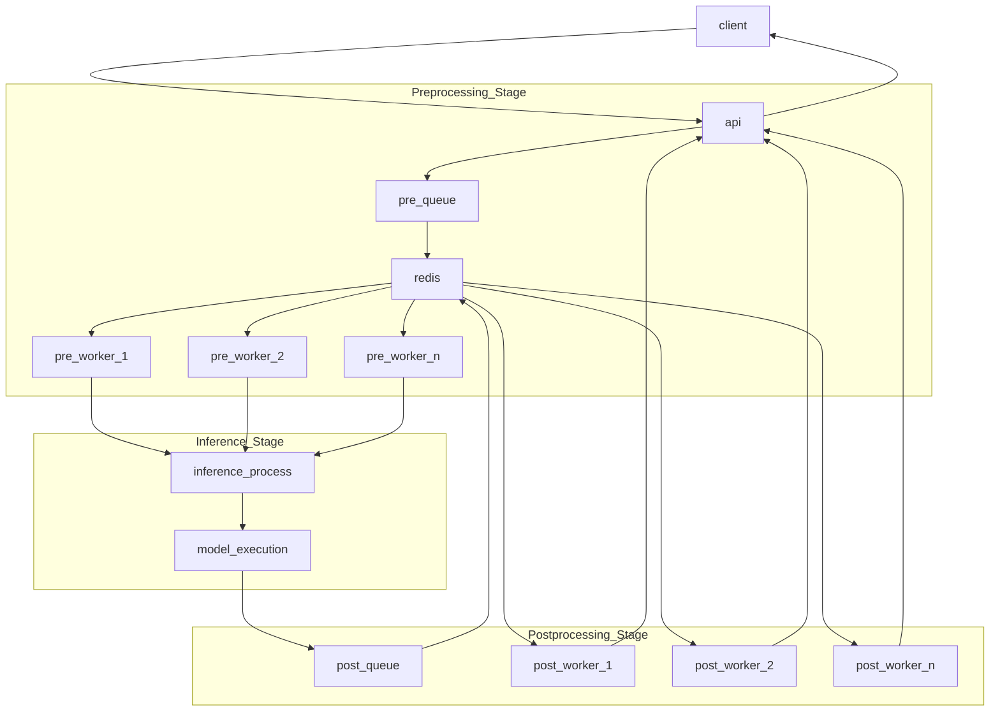
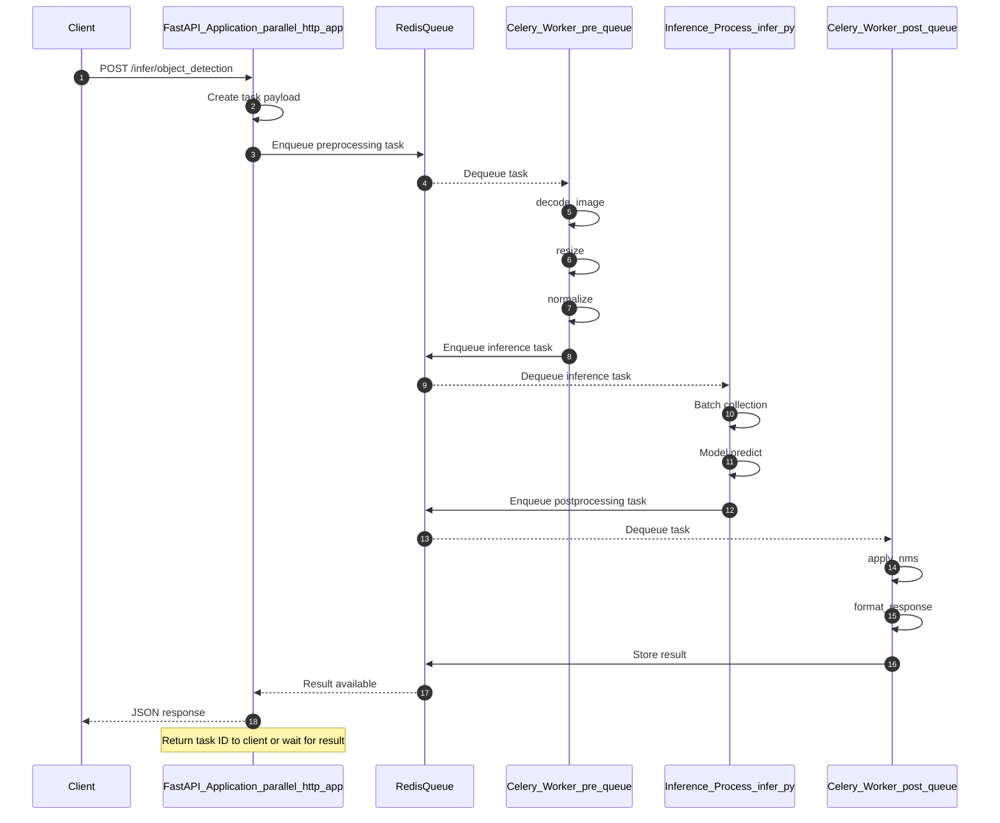

# Parallel Processing Architecture


## Purpose and Scope

This document describes the parallel processing deployment architecture for Inference Server, which uses Redis and Celery to distribute preprocessing and postprocessing operations across multiple worker processes. This architecture enables horizontal scaling of inference workloads by separating the inference pipeline into distinct stages that can be parallelized.

For standard single-process deployment configurations, see [Docker Containers](https://deepwiki.com/roboflow/inference/6.1-docker-containers). For hardware-specific optimizations without parallel processing, see [Hardware Targets](https://deepwiki.com/roboflow/inference/6.2-hardware-targets).

## Architecture Overview

The parallel processing architecture splits inference requests into three distinct stages, each handled by separate processes:

1. **Preprocessing workers** - Handle image decoding, resizing, normalization
2. **Inference process** - Execute model prediction on GPU/CPU
3. **Postprocessing workers** - Format predictions, apply NMS, generate responses

This separation allows CPU-intensive preprocessing and postprocessing operations to scale independently of GPU-bound inference, maximizing hardware utilization.

**Parallel Processing Pipeline**

Here’s a clean Mermaid version you can paste into docs:


Sources: [docker/dockerfiles/Dockerfile.onnx.cpu.parallel82-86](https://github.com/roboflow/inference/blob/55f57676/docker/dockerfiles/Dockerfile.onnx.cpu.parallel#L82-L86) [docker/dockerfiles/Dockerfile.onnx.gpu.parallel59-60](https://github.com/roboflow/inference/blob/55f57676/docker/dockerfiles/Dockerfile.onnx.gpu.parallel#L59-L60)

## Deployment Variants

Two parallel processing images are available, corresponding to the hardware acceleration modes:

|Image Variant|Base Image|Use Case|
|---|---|---|
|`roboflow/roboflow-inference-server-gpu-parallel`|nvcr.io/nvidia/cuda:12.4.1-cudnn-devel-ubuntu22.04|GPU-accelerated inference with parallel CPU workers|
|`roboflow/roboflow-inference-server-cpu-parallel`|python:3.11-bookworm|CPU-only deployments requiring horizontal scaling|

Both variants share the same architectural pattern but differ in their entrypoint orchestration.

Sources: [docker/dockerfiles/Dockerfile.onnx.gpu.parallel1](https://github.com/roboflow/inference/blob/55f57676/docker/dockerfiles/Dockerfile.onnx.gpu.parallel#L1-L1) [docker/dockerfiles/Dockerfile.onnx.cpu.parallel1](https://github.com/roboflow/inference/blob/55f57676/docker/dockerfiles/Dockerfile.onnx.cpu.parallel#L1-L1)

## Component Architecture

### Redis Message Broker

Redis serves as the message broker and task queue for Celery workers. The parallel deployment bundles Redis within the container rather than requiring an external service.

**CPU Parallel Redis Configuration:**

```
redis-server --io-threads 3 --save --port $REDIS_PORT
```

Redis is configured with:

- **I/O threads**: 3 threads for network operations
- **Persistence**: Enabled via `--save` flag
- **Port**: Configurable via `REDIS_PORT` environment variable (default: 6380)
- **Connection limit**: `net.core.somaxconn=1024` system setting

**Environment Variables:**

|Variable|Default|Description|
|---|---|---|
|`REDIS_HOST`|`localhost`|Redis server hostname|
|`REDIS_PORT`|`6380`|Redis server port|

Sources: [docker/dockerfiles/Dockerfile.onnx.cpu.parallel82](https://github.com/roboflow/inference/blob/55f57676/docker/dockerfiles/Dockerfile.onnx.cpu.parallel#L82-L82) [docker/dockerfiles/Dockerfile.onnx.gpu.parallel66-67](https://github.com/roboflow/inference/blob/55f57676/docker/dockerfiles/Dockerfile.onnx.gpu.parallel#L66-L67) [docker/dockerfiles/Dockerfile.onnx.gpu.parallel43](https://github.com/roboflow/inference/blob/55f57676/docker/dockerfiles/Dockerfile.onnx.gpu.parallel#L43-L43)

### Celery Worker Pools

Celery workers are organized into two separate queues with different concurrency characteristics:

**Preprocessing Queue (`pre`)**

- **Purpose**: Image decoding, resizing, normalization, batching
- **Prefetch multiplier**: 2
- **Concurrency**: Configurable via `NUM_CELERY_WORKERS`
- **Task module**: `inference.enterprise.parallel.tasks`

**Postprocessing Queue (`post`)**

- **Purpose**: NMS, coordinate transformation, response serialization
- **Prefetch multiplier**: 8
- **Concurrency**: Configurable via `NUM_CELERY_WORKERS`
- **Task module**: `inference.enterprise.parallel.tasks`

The higher prefetch multiplier for postprocessing (8 vs 2) reflects the typically lighter computational load of postprocessing tasks, allowing workers to prefetch more tasks from the queue.

**CPU Parallel Worker Startup:**

```
celery -A inference.enterprise.parallel.tasks worker \
    --prefetch-multiplier 2 \
    --concurrency $NUM_CELERY_WORKERS \
    -Q pre \
    --loglevel=WARNING

celery -A inference.enterprise.parallel.tasks worker \
    --prefetch-multiplier 8 \
    --concurrency $NUM_CELERY_WORKERS \
    -Q post \
    --loglevel=WARNING
```

Sources: [docker/dockerfiles/Dockerfile.onnx.cpu.parallel83-84](https://github.com/roboflow/inference/blob/55f57676/docker/dockerfiles/Dockerfile.onnx.cpu.parallel#L83-L84)

### Inference Process

The inference process (`inference/enterprise/parallel/infer.py`) handles model execution. It consumes preprocessed data from preprocessing workers, executes model inference, and enqueues results to the postprocessing queue.

**CPU Parallel:**

```
python3 inference/enterprise/parallel/infer.py
```

**GPU Parallel:** The GPU variant uses a centralized entrypoint script:

```
python3 entrypoint.py
```

This script orchestrates all components including Redis, Celery workers, and the inference process.

Sources: [docker/dockerfiles/Dockerfile.onnx.cpu.parallel85](https://github.com/roboflow/inference/blob/55f57676/docker/dockerfiles/Dockerfile.onnx.cpu.parallel#L85-L85) [docker/dockerfiles/Dockerfile.onnx.gpu.parallel72](https://github.com/roboflow/inference/blob/55f57676/docker/dockerfiles/Dockerfile.onnx.gpu.parallel#L72-L72) [docker/dockerfiles/Dockerfile.onnx.gpu.parallel60](https://github.com/roboflow/inference/blob/55f57676/docker/dockerfiles/Dockerfile.onnx.gpu.parallel#L60-L60)

### HTTP API Server

The HTTP API server runs as a separate process, using a parallel-specific configuration module:

**Configuration Module:**

- GPU: `inference/enterprise/parallel/parallel_http_config.py` copied to `parallel_http.py`
- CPU: `inference/enterprise/parallel/parallel_http_config.py` copied to `parallel_http.py`

**Startup Command:**

```
uvicorn parallel_http:app --workers $NUM_WORKERS --host $HOST --port $PORT
```

Environment variables controlling the API server:

|Variable|Default|Description|
|---|---|---|
|`NUM_WORKERS`|1|Number of uvicorn worker processes|
|`HOST`|`0.0.0.0`|Bind address|
|`PORT`|`9001`|HTTP port|

Sources: [docker/dockerfiles/Dockerfile.onnx.cpu.parallel63](https://github.com/roboflow/inference/blob/55f57676/docker/dockerfiles/Dockerfile.onnx.cpu.parallel#L63-L63) [docker/dockerfiles/Dockerfile.onnx.cpu.parallel86](https://github.com/roboflow/inference/blob/55f57676/docker/dockerfiles/Dockerfile.onnx.cpu.parallel#L86-L86) [docker/dockerfiles/Dockerfile.onnx.gpu.parallel59](https://github.com/roboflow/inference/blob/55f57676/docker/dockerfiles/Dockerfile.onnx.gpu.parallel#L59-L59)

## Process Orchestration

### CPU Parallel Entrypoint

The CPU parallel deployment uses bash process backgrounding to run all components concurrently:

```
redis-server --io-threads 3 --save --port $REDIS_PORT & \
    celery -A inference.enterprise.parallel.tasks worker --prefetch-multiplier 2 --concurrency $NUM_CELERY_WORKERS -Q pre --loglevel=WARNING & \
    celery -A inference.enterprise.parallel.tasks worker --prefetch-multiplier 8 --concurrency $NUM_CELERY_WORKERS -Q post --loglevel=WARNING & \
    python3 inference/enterprise/parallel/infer.py & \
    uvicorn parallel_http:app --workers $NUM_WORKERS --host $HOST --port $PORT && fg
```

**Process Flow:**

1. Redis server starts in background (`&`)
2. Preprocessing Celery workers start in background
3. Postprocessing Celery workers start in background
4. Inference process starts in background
5. Uvicorn API server starts in foreground (`&& fg`)

The final `fg` command brings the last backgrounded job (uvicorn) to the foreground, ensuring the container stays running.

Sources: [docker/dockerfiles/Dockerfile.onnx.cpu.parallel82-86](https://github.com/roboflow/inference/blob/55f57676/docker/dockerfiles/Dockerfile.onnx.cpu.parallel#L82-L86)

### GPU Parallel Entrypoint

The GPU parallel deployment uses a Python entrypoint script (`entrypoint.py`) to manage component lifecycle:

**Entrypoint Script:**

- Path: `inference/enterprise/parallel/entrypoint.py`
- Copied to: `/app/entrypoint.py`

This centralized approach allows more sophisticated process management, including:

- Coordinated startup sequences
- Process health monitoring
- Graceful shutdown handling

Sources: [docker/dockerfiles/Dockerfile.onnx.gpu.parallel60](https://github.com/roboflow/inference/blob/55f57676/docker/dockerfiles/Dockerfile.onnx.gpu.parallel#L60-L60) [docker/dockerfiles/Dockerfile.onnx.gpu.parallel72](https://github.com/roboflow/inference/blob/55f57676/docker/dockerfiles/Dockerfile.onnx.gpu.parallel#L72-L72)

## Configuration Differences from Standard Deployment

The parallel processing deployment modifies several environment variables to optimize for distributed workloads:

|Variable|Standard|Parallel|Rationale|
|---|---|---|---|
|`WORKFLOWS_MAX_CONCURRENT_STEPS`|4|1|Prevent workflow execution from overwhelming worker queues|
|`CORE_MODELS_ENABLED`|true|false (GPU only)|Reduce memory footprint; enable specific models via flags|
|`NUM_CELERY_WORKERS`|N/A|12 (CPU default)|Control worker pool size|

**Workflow Execution Mode:** Both standard and parallel deployments use `WORKFLOWS_STEP_EXECUTION_MODE=local`, meaning workflow blocks execute in the same process rather than being distributed.

**Model Enablement:** GPU parallel deployment disables all core models by default (`CORE_MODELS_ENABLED=false`), requiring explicit enablement of required models:

```
ENV CORE_MODEL_SAM2_ENABLED=True
ENV CORE_MODEL_TROCR_ENABLED=false
```

CPU parallel deployment enables specific core models:

```
ENV CORE_MODEL_SAM2_ENABLED=True
ENV CORE_MODEL_TROCR_ENABLED=false
```

Sources: [docker/dockerfiles/Dockerfile.onnx.gpu.parallel63-65](https://github.com/roboflow/inference/blob/55f57676/docker/dockerfiles/Dockerfile.onnx.gpu.parallel#L63-L65) [docker/dockerfiles/Dockerfile.onnx.cpu.parallel74-79](https://github.com/roboflow/inference/blob/55f57676/docker/dockerfiles/Dockerfile.onnx.cpu.parallel#L74-L79) [docker/dockerfiles/Dockerfile.onnx.gpu99](https://github.com/roboflow/inference/blob/55f57676/docker/dockerfiles/Dockerfile.onnx.gpu#L99-L99) [docker/dockerfiles/Dockerfile.onnx.cpu76](https://github.com/roboflow/inference/blob/55f57676/docker/dockerfiles/Dockerfile.onnx.cpu#L76-L76)

## Dependency Installation

Parallel processing deployments require an additional dependency file beyond the standard requirements:

**requirements.parallel.txt:**

- Contains: Celery, Redis client libraries, distributed task dependencies
- Installed in: Both GPU and CPU variants

**Installation Commands:**

GPU Parallel:

```
pip3 install \
    -r _requirements.txt \
    -r requirements.sam.txt \
    -r requirements.clip.txt \
    -r requirements.http.txt \
    -r requirements.gpu.txt \
    -r requirements.gaze.txt \
    -r requirements.parallel.txt \
    -r requirements.easyocr.txt
```

CPU Parallel:

```
pip3 install \
    -r _requirements.txt \
    -r requirements.sam.txt \
    -r requirements.clip.txt \
    -r requirements.cpu.txt \
    -r requirements.http.txt \
    -r requirements.gaze.txt \
    -r requirements.doctr.txt \
    -r requirements.parallel.txt \
    -r requirements.cli.txt \
    -r requirements.sdk.http.txt \
    -r requirements.easyocr.txt
```

Sources: [docker/dockerfiles/Dockerfile.onnx.gpu.parallel21-37](https://github.com/roboflow/inference/blob/55f57676/docker/dockerfiles/Dockerfile.onnx.gpu.parallel#L21-L37) [docker/dockerfiles/Dockerfile.onnx.cpu.parallel19-50](https://github.com/roboflow/inference/blob/55f57676/docker/dockerfiles/Dockerfile.onnx.cpu.parallel#L19-L50)

## Request Processing Flow

**Complete Request Lifecycle in Parallel Architecture**



Sources: [docker/dockerfiles/Dockerfile.onnx.cpu.parallel82-86](https://github.com/roboflow/inference/blob/55f57676/docker/dockerfiles/Dockerfile.onnx.cpu.parallel#L82-L86)

## Performance Characteristics

### Concurrency Settings

**Prefetch Multiplier Impact:**

The prefetch multiplier controls how many tasks a worker reserves from the queue:

- **Preprocessing (prefetch=2)**: Lower prefetch reduces memory pressure from decoded images
- **Postprocessing (prefetch=8)**: Higher prefetch maximizes throughput for lightweight tasks

**Worker Concurrency:**

Controlled by `NUM_CELERY_WORKERS` environment variable:

- CPU Parallel default: 12 workers per queue
- GPU Parallel: Not specified (uses Celery defaults)

This results in:

- 12 concurrent preprocessing operations
- 12 concurrent postprocessing operations
- Total of 24 worker processes plus Redis and inference process

### Resource Allocation

**Memory Considerations:**

Parallel processing requires additional memory for:

- Redis queue storage
- Celery worker overhead (24+ processes)
- Task payload serialization

**CPU Utilization:**

Preprocessing and postprocessing workers maximize CPU utilization during:

- Image decoding (preprocessing)
- Non-maximum suppression (postprocessing)
- JSON serialization (postprocessing)

**GPU Utilization:**

The centralized inference process ensures:

- Single model loading (no duplication across workers)
- Efficient GPU memory usage
- Batch processing opportunities

Sources: [docker/dockerfiles/Dockerfile.onnx.cpu.parallel70](https://github.com/roboflow/inference/blob/55f57676/docker/dockerfiles/Dockerfile.onnx.cpu.parallel#L70-L70) [docker/dockerfiles/Dockerfile.onnx.cpu.parallel83-84](https://github.com/roboflow/inference/blob/55f57676/docker/dockerfiles/Dockerfile.onnx.cpu.parallel#L83-L84)

## Use Cases and Trade-offs

### When to Use Parallel Processing

**Optimal Scenarios:**

- High request volume (>100 requests/second)
- CPU-bound preprocessing (high-resolution images, complex augmentations)
- CPU-bound postprocessing (dense detection outputs requiring NMS)
- Heterogeneous request patterns (batching less effective)

### When to Use Standard Deployment

**Optimal Scenarios:**

- Low to medium request volume (<50 requests/second)
- Memory-constrained environments
- Latency-sensitive applications (parallel introduces queue overhead)
- Simple preprocessing/postprocessing (minimal CPU overhead)

See [Docker Containers](https://deepwiki.com/roboflow/inference/6.1-docker-containers) for standard deployment configurations.

### Performance Trade-offs

|Aspect|Standard Deployment|Parallel Deployment|
|---|---|---|
|Latency (single request)|Lower (direct execution)|Higher (queue overhead)|
|Throughput (sustained)|Limited by single-threaded preprocessing|Scales with worker count|
|Memory usage|Lower (single process)|Higher (24+ processes + Redis)|
|CPU utilization|May underutilize on multi-core|Maximizes multi-core utilization|
|Complexity|Simple (single process)|Complex (multi-process coordination)|

## Monitoring and Observability

### Prometheus Metrics

Both parallel variants enable Prometheus metrics:

```
ENV ENABLE_PROMETHEUS=True
```

This exposes metrics on the standard Prometheus endpoint, including:

- Celery worker queue lengths
- Task processing times
- Worker health status

### Logging Configuration

Celery workers use WARNING level logging to reduce noise:

```
celery ... --loglevel=WARNING
```

The API server uses standard logging controlled by `API_LOGGING_ENABLED`:

```
ENV API_LOGGING_ENABLED=True
```

Sources: [docker/dockerfiles/Dockerfile.onnx.gpu.parallel70](https://github.com/roboflow/inference/blob/55f57676/docker/dockerfiles/Dockerfile.onnx.gpu.parallel#L70-L70) [docker/dockerfiles/Dockerfile.onnx.cpu.parallel80](https://github.com/roboflow/inference/blob/55f57676/docker/dockerfiles/Dockerfile.onnx.cpu.parallel#L80-L80) [docker/dockerfiles/Dockerfile.onnx.cpu.parallel83-84](https://github.com/roboflow/inference/blob/55f57676/docker/dockerfiles/Dockerfile.onnx.cpu.parallel#L83-L84)

## File Structure

Key files implementing the parallel processing architecture:

|File Path|Purpose|
|---|---|
|`inference/enterprise/parallel/entrypoint.py`|GPU parallel orchestration script|
|`inference/enterprise/parallel/parallel_http_config.py`|FastAPI configuration for parallel mode|
|`inference/enterprise/parallel/infer.py`|Model inference process|
|`inference/enterprise/parallel/tasks.py`|Celery task definitions|
|`requirements/requirements.parallel.txt`|Celery and Redis dependencies|

Sources: [docker/dockerfiles/Dockerfile.onnx.gpu.parallel59-60](https://github.com/roboflow/inference/blob/55f57676/docker/dockerfiles/Dockerfile.onnx.gpu.parallel#L59-L60) [docker/dockerfiles/Dockerfile.onnx.cpu.parallel63](https://github.com/roboflow/inference/blob/55f57676/docker/dockerfiles/Dockerfile.onnx.cpu.parallel#L63-L63) [docker/dockerfiles/Dockerfile.onnx.cpu.parallel85](https://github.com/roboflow/inference/blob/55f57676/docker/dockerfiles/Dockerfile.onnx.cpu.parallel#L85-L85)