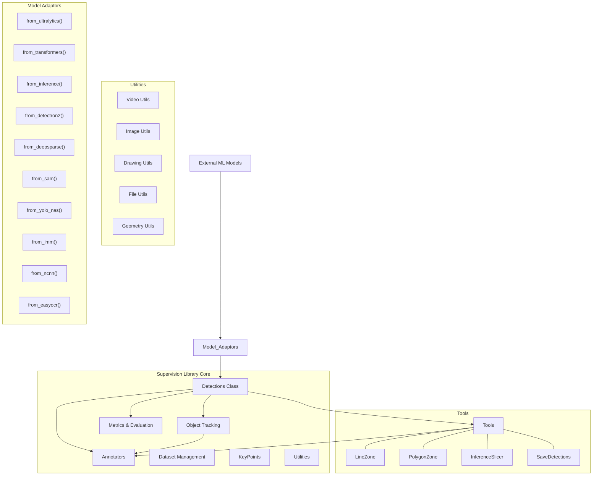
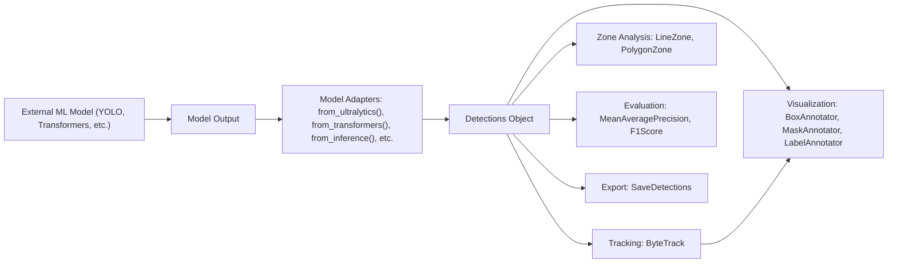
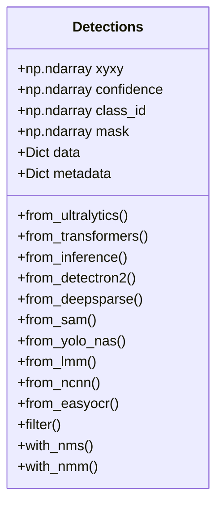
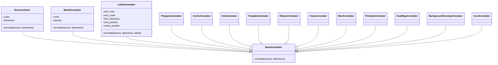
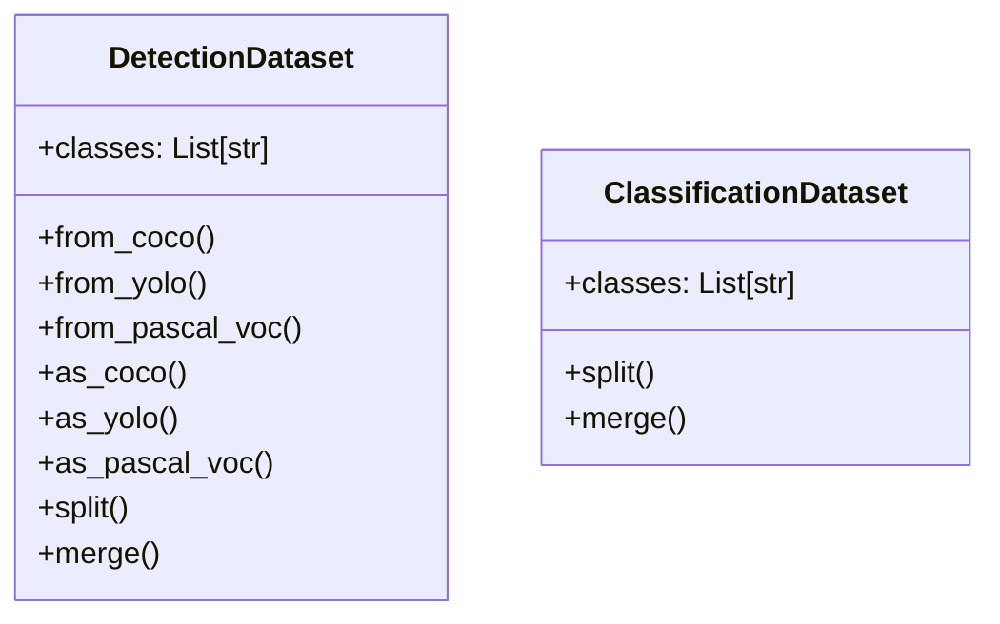
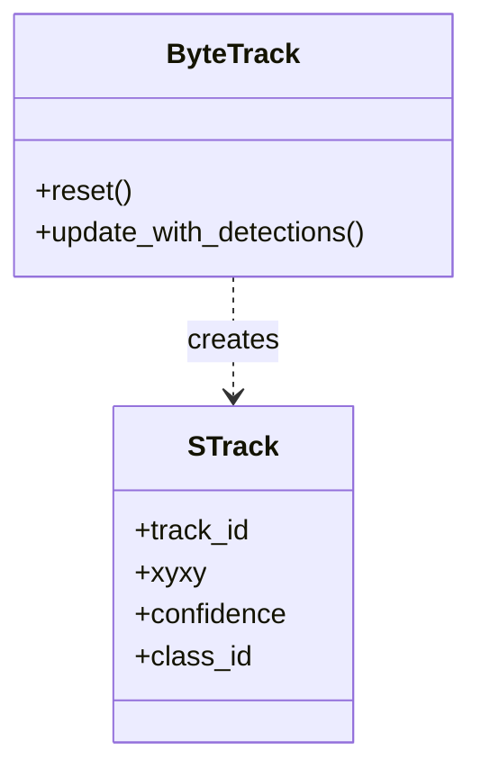
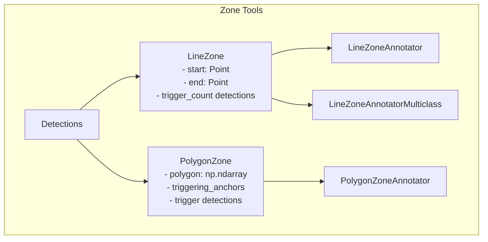
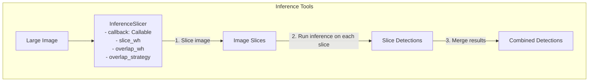
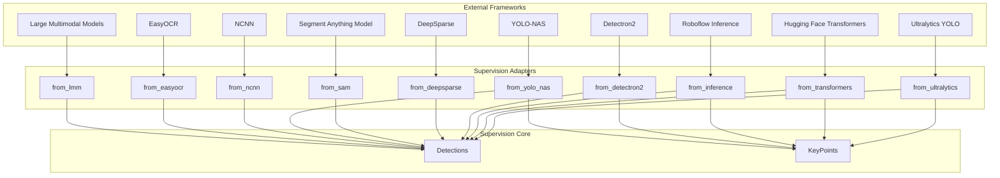
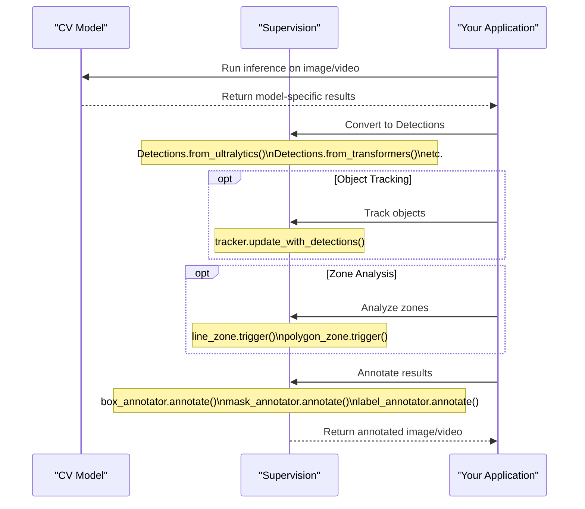

# Overview

Relevant source files

- [README.md](https://github.com/roboflow/supervision/blob/1d0747fb/README.md)
- [docs/changelog.md](https://github.com/roboflow/supervision/blob/1d0747fb/docs/changelog.md)
- [docs/deprecated.md](https://github.com/roboflow/supervision/blob/1d0747fb/docs/deprecated.md)
- [docs/detection/annotators.md](https://github.com/roboflow/supervision/blob/1d0747fb/docs/detection/annotators.md)
- [docs/how_to/detect_and_annotate.md](https://github.com/roboflow/supervision/blob/1d0747fb/docs/how_to/detect_and_annotate.md)
- [docs/how_to/detect_small_objects.md](https://github.com/roboflow/supervision/blob/1d0747fb/docs/how_to/detect_small_objects.md)
- [docs/index.md](https://github.com/roboflow/supervision/blob/1d0747fb/docs/index.md)
- [mkdocs.yml](https://github.com/roboflow/supervision/blob/1d0747fb/mkdocs.yml)
- [pyproject.toml](https://github.com/roboflow/supervision/blob/1d0747fb/pyproject.toml)

Supervision is a comprehensive computer vision toolkit that provides reusable utilities to streamline computer vision workflows. It offers a collection of tools for object detection, tracking, annotation, dataset management, and evaluation, designed to be model-agnostic and easily integrated with various computer vision frameworks.

This document provides a high-level overview of the Supervision library, its architecture, and core components. For installation instructions, see [Installation & Configuration](https://deepwiki.com/roboflow/supervision/1.1-installation-and-configuration), and for documentation structure, refer to [Documentation Structure](https://deepwiki.com/roboflow/supervision/1.2-documentation-structure).

Sources: [pyproject.toml1-50](https://github.com/roboflow/supervision/blob/1d0747fb/pyproject.toml#L1-L50) [README.md33-36](https://github.com/roboflow/supervision/blob/1d0747fb/README.md#L33-L36)

## Key Features

Supervision provides the following key capabilities:

- **Object Detection**: Converting outputs from various model frameworks into a standardized format
- **Visualization**: Annotating images and videos with detection results
- **Object Tracking**: Tracking objects across video frames
- **Dataset Management**: Loading, manipulating, and converting between dataset formats
- **Zone Analysis**: Counting objects in defined zones or crossing lines
- **Performance Metrics**: Evaluating model performance with metrics like mAP, precision, and recall

Supervision is designed to be compatible with Python 3.8+ and integrates with popular computer vision and deep learning frameworks.

Sources: [README.md35-36](https://github.com/roboflow/supervision/blob/1d0747fb/README.md#L35-L36) [pyproject.toml14-21](https://github.com/roboflow/supervision/blob/1d0747fb/pyproject.toml#L14-L21) [pyproject.toml36-50](https://github.com/roboflow/supervision/blob/1d0747fb/pyproject.toml#L36-L50)

## System Architecture

Supervision is organized around a central `Detections` class that standardizes object detection results from various frameworks. The library provides components for visualization, tracking, zone analysis, dataset management, and performance evaluation.

Sources: [mkdocs.yml36-93](https://github.com/roboflow/supervision/blob/1d0747fb/mkdocs.yml#L36-L93) [README.md49-66](https://github.com/roboflow/supervision/blob/1d0747fb/README.md#L49-L66) [docs/changelog.md1-200](https://github.com/roboflow/supervision/blob/1d0747fb/docs/changelog.md#L1-L200)

## Data Flow

The data flow begins with an external model's output, which is converted into Supervision's standardized `Detections` object. This object can then be processed through various components for visualization, tracking, filtering, evaluation, and export.

Sources: [docs/how_to/detect_and_annotate.md17-46](https://github.com/roboflow/supervision/blob/1d0747fb/docs/how_to/detect_and_annotate.md#L17-L46) [README.md49-130](https://github.com/roboflow/supervision/blob/1d0747fb/README.md#L49-L130) [docs/detection/annotators.md7-26](https://github.com/roboflow/supervision/blob/1d0747fb/docs/detection/annotators.md#L7-L26)

## Core Components

### Detections System

The `Detections` class is the central data structure in Supervision, representing a set of object detections. It stores detection information such as bounding boxes, confidence scores, class IDs, and optional mask information. The class provides adapters to convert outputs from various frameworks into this standardized format.

The Detections class provides conversion methods for various frameworks and utilities for filtering, non-maximum suppression, and other operations.

Sources: [docs/how_to/detect_and_annotate.md63-93](https://github.com/roboflow/supervision/blob/1d0747fb/docs/how_to/detect_and_annotate.md#L63-L93) [README.md54-66](https://github.com/roboflow/supervision/blob/1d0747fb/README.md#L54-L66) [docs/changelog.md569-589](https://github.com/roboflow/supervision/blob/1d0747fb/docs/changelog.md#L569-L589)

### Annotation System

Supervision provides a comprehensive set of annotators for visualizing detection results on images and videos.

Each annotator specializes in visualizing detections in a specific way, such as bounding boxes, masks, or labels. Annotators can be customized with parameters like color, thickness, and positioning.

Sources: [docs/detection/annotators.md6-157](https://github.com/roboflow/supervision/blob/1d0747fb/docs/detection/annotators.md#L6-L157) [README.md92-106](https://github.com/roboflow/supervision/blob/1d0747fb/README.md#L92-L106) [docs/changelog.md287-395](https://github.com/roboflow/supervision/blob/1d0747fb/docs/changelog.md#L287-L395)

### Dataset Management

Supervision provides tools for loading, manipulating, and converting between various dataset formats.

The dataset management system supports common formats like COCO, YOLO, and Pascal VOC, and provides methods for splitting, merging, and converting datasets.

Sources: [README.md110-220](https://github.com/roboflow/supervision/blob/1d0747fb/README.md#L110-L220) [docs/changelog.md419-452](https://github.com/roboflow/supervision/blob/1d0747fb/docs/changelog.md#L419-L452)

### Tracking System

Supervision includes object tracking capabilities based on ByteTrack:

The tracking system can assign consistent IDs to objects across video frames, enabling temporal analysis of object movements.

Sources: [docs/changelog.md9-35](https://github.com/roboflow/supervision/blob/1d0747fb/docs/changelog.md#L9-L35) [docs/changelog.md140-145](https://github.com/roboflow/supervision/blob/1d0747fb/docs/changelog.md#L140-L145) [docs/deprecated.md33](https://github.com/roboflow/supervision/blob/1d0747fb/docs/deprecated.md#L33-L33)

### Zone Analysis Tools

Supervision offers zone analysis tools for counting objects in specific areas or crossing defined lines:

These tools enable applications like traffic counting, crowd analysis, and zone-based monitoring.

Sources: [docs/changelog.md7-9](https://github.com/roboflow/supervision/blob/1d0747fb/docs/changelog.md#L7-L9) [docs/changelog.md170-213](https://github.com/roboflow/supervision/blob/1d0747fb/docs/changelog.md#L170-L213) [docs/how_to/detect_small_objects.md150-156](https://github.com/roboflow/supervision/blob/1d0747fb/docs/how_to/detect_small_objects.md#L150-L156)

### Inference Tools

Supervision provides tools to enhance inference capabilities, particularly for challenging scenarios:

The `InferenceSlicer` tool is particularly useful for detecting small objects in high-resolution images by slicing the image into smaller segments for processing.

Sources: [docs/how_to/detect_small_objects.md149-255](https://github.com/roboflow/supervision/blob/1d0747fb/docs/how_to/detect_small_objects.md#L149-L255) [docs/changelog.md433-437](https://github.com/roboflow/supervision/blob/1d0747fb/docs/changelog.md#L433-L437) [docs/deprecated.md16-18](https://github.com/roboflow/supervision/blob/1d0747fb/docs/deprecated.md#L16-L18)

## Framework Integration

Supervision is designed to integrate seamlessly with various computer vision and deep learning frameworks:

This architecture allows Supervision to work with outputs from virtually any computer vision model by providing standardized adapters for popular frameworks.

Sources: [docs/how_to/detect_and_annotate.md122-129](https://github.com/roboflow/supervision/blob/1d0747fb/docs/how_to/detect_and_annotate.md#L122-L129) [docs/changelog.md216-270](https://github.com/roboflow/supervision/blob/1d0747fb/docs/changelog.md#L216-L270) [docs/changelog.md452-461](https://github.com/roboflow/supervision/blob/1d0747fb/docs/changelog.md#L452-L461)

## Usage Patterns

The typical usage pattern for Supervision involves:

1. **Model Inference**: Run your model on the input data (image/video)
2. **Convert to Detections**: Convert the model output to the Supervision `Detections` format
3. **Process Detections**: Apply tracking, filtering, or zone analysis as needed
4. **Visualize Results**: Use annotators to visualize the results on the original image/video

This modular approach allows users to flexibly combine various components of Supervision based on their specific needs.

Sources: [docs/how_to/detect_and_annotate.md130-172](https://github.com/roboflow/supervision/blob/1d0747fb/docs/how_to/detect_and_annotate.md#L130-L172) [README.md54-106](https://github.com/roboflow/supervision/blob/1d0747fb/README.md#L54-L106) [docs/detection/annotators.md10-26](https://github.com/roboflow/supervision/blob/1d0747fb/docs/detection/annotators.md#L10-L26)

## Example Applications

Supervision enables a wide range of computer vision applications:

|Application Type|Relevant Components|Example Use Case|
|---|---|---|
|Object Detection|`Detections`, Box/Mask Annotators|Identifying objects in images|
|Instance Segmentation|`Detections` with masks, `MaskAnnotator`|Pixel-precise object delineation|
|Object Tracking|`ByteTrack`, `TraceAnnotator`|Following objects across video frames|
|Traffic Analysis|`LineZone`, `PolygonZone`|Counting vehicles crossing a line|
|Small Object Detection|`InferenceSlicer`|Detecting small objects in aerial imagery|
|Dataset Processing|`DetectionDataset`|Converting between dataset formats|
|Performance Evaluation|`MeanAveragePrecision`, `F1Score`|Evaluating model accuracy|

Supervision's modular design makes it suitable for both simple visualization tasks and complex computer vision pipelines.

Sources: [README.md223-241](https://github.com/roboflow/supervision/blob/1d0747fb/README.md#L223-L241) [docs/changelog.md149-165](https://github.com/roboflow/supervision/blob/1d0747fb/docs/changelog.md#L149-L165) [docs/how_to/detect_small_objects.md5-16](https://github.com/roboflow/supervision/blob/1d0747fb/docs/how_to/detect_small_objects.md#L5-L16)

## Summary

Supervision is a comprehensive toolkit for computer vision tasks, providing:

1. A standardized representation of detection results (`Detections` class)
2. Rich visualization capabilities (various annotators)
3. Object tracking functionality (`ByteTrack`)
4. Dataset management tools
5. Zone analysis utilities
6. Performance metrics
7. Adapters for various ML frameworks

Its flexibility and interoperability with multiple frameworks make it a valuable tool for computer vision practitioners, allowing them to focus on application logic rather than boilerplate code.

Sources: [README.md33-46](https://github.com/roboflow/supervision/blob/1d0747fb/README.md#L33-L46) [pyproject.toml2-3](https://github.com/roboflow/supervision/blob/1d0747fb/pyproject.toml#L2-L3) [mkdocs.yml1-4](https://github.com/roboflow/supervision/blob/1d0747fb/mkdocs.yml#L1-L4)