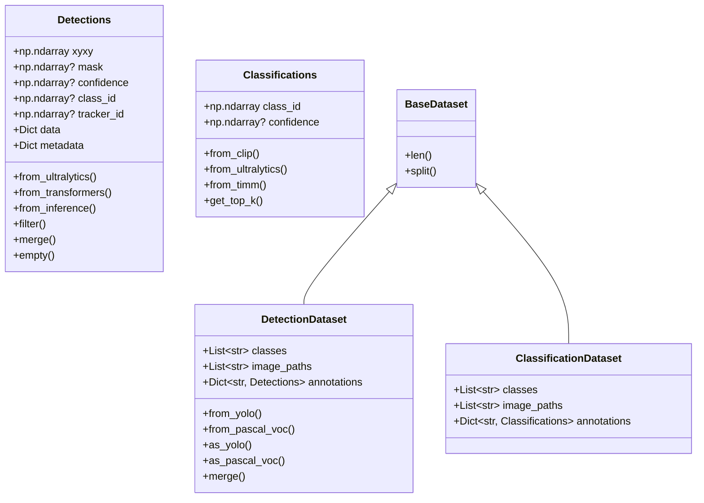
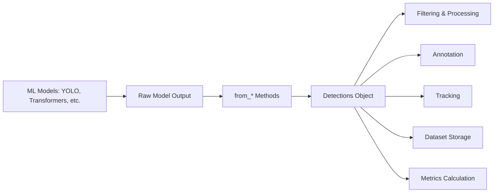
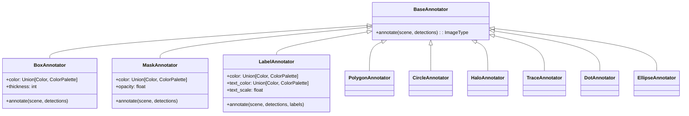
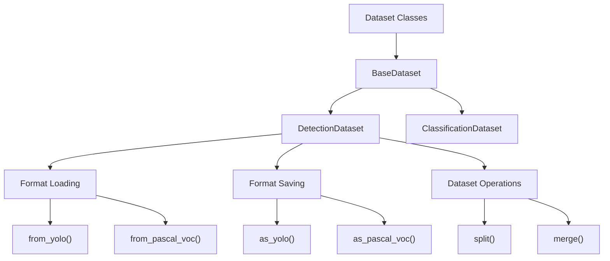
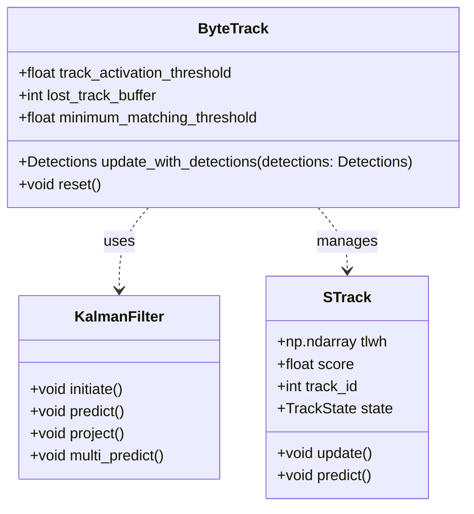
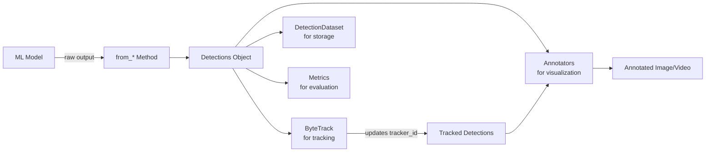
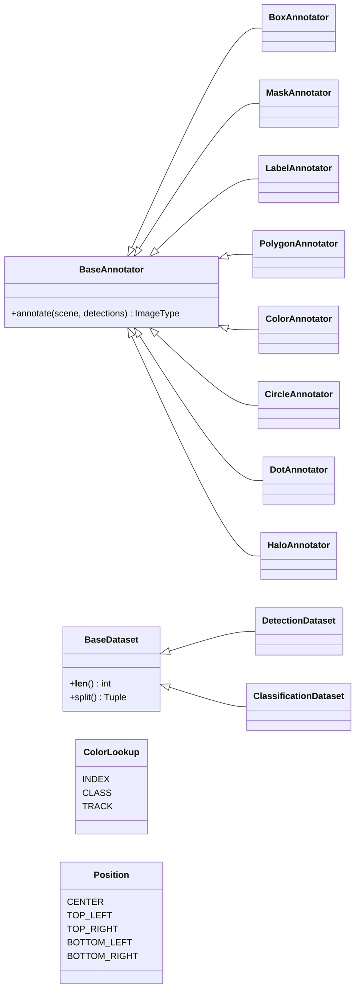

# Core Components

Relevant source files

- [supervision/__init__.py](https://github.com/roboflow/supervision/blob/1d0747fb/supervision/__init__.py)
- [supervision/annotators/core.py](https://github.com/roboflow/supervision/blob/1d0747fb/supervision/annotators/core.py)
- [supervision/classification/__init__.py](https://github.com/roboflow/supervision/blob/1d0747fb/supervision/classification/__init__.py)
- [supervision/classification/core.py](https://github.com/roboflow/supervision/blob/1d0747fb/supervision/classification/core.py)
- [supervision/dataset/core.py](https://github.com/roboflow/supervision/blob/1d0747fb/supervision/dataset/core.py)
- [supervision/dataset/formats/pascal_voc.py](https://github.com/roboflow/supervision/blob/1d0747fb/supervision/dataset/formats/pascal_voc.py)
- [supervision/dataset/formats/yolo.py](https://github.com/roboflow/supervision/blob/1d0747fb/supervision/dataset/formats/yolo.py)
- [supervision/detection/core.py](https://github.com/roboflow/supervision/blob/1d0747fb/supervision/detection/core.py)
- [supervision/detection/tools/transformers.py](https://github.com/roboflow/supervision/blob/1d0747fb/supervision/detection/tools/transformers.py)
- [supervision/detection/utils.py](https://github.com/roboflow/supervision/blob/1d0747fb/supervision/detection/utils.py)
- [supervision/tracker/byte_tracker/core.py](https://github.com/roboflow/supervision/blob/1d0747fb/supervision/tracker/byte_tracker/core.py)
- [supervision/tracker/byte_tracker/kalman_filter.py](https://github.com/roboflow/supervision/blob/1d0747fb/supervision/tracker/byte_tracker/kalman_filter.py)
- [supervision/tracker/byte_tracker/matching.py](https://github.com/roboflow/supervision/blob/1d0747fb/supervision/tracker/byte_tracker/matching.py)
- [test/dataset/formats/test_yolo.py](https://github.com/roboflow/supervision/blob/1d0747fb/test/dataset/formats/test_yolo.py)
- [test/detection/test_core.py](https://github.com/roboflow/supervision/blob/1d0747fb/test/detection/test_core.py)
- [test/detection/test_utils.py](https://github.com/roboflow/supervision/blob/1d0747fb/test/detection/test_utils.py)
- [test/tracker/__init__.py](https://github.com/roboflow/supervision/blob/1d0747fb/test/tracker/__init__.py)
- [test/tracker/test_byte_tracker.py](https://github.com/roboflow/supervision/blob/1d0747fb/test/tracker/test_byte_tracker.py)

This page provides an overview of the core components that make up the Supervision library. Supervision is a computer vision toolkit that standardizes object detection, tracking, and dataset operations across various machine learning frameworks.

For detailed implementation specifics of individual components, refer to their respective documentation pages: [Detection System](https://deepwiki.com/roboflow/supervision/2.1-detection-system), [Annotation System](https://deepwiki.com/roboflow/supervision/2.2-annotation-system), [Dataset Management](https://deepwiki.com/roboflow/supervision/2.3-dataset-management), [Tracking System](https://deepwiki.com/roboflow/supervision/2.4-tracking-system), [Metrics System](https://deepwiki.com/roboflow/supervision/2.5-metrics-system), and [KeyPoint System](https://deepwiki.com/roboflow/supervision/2.6-keypoint-system).

## Architecture Overview

Supervision provides a standardized set of components that work together to handle the entire computer vision pipeline, from model inference to visualization and analytics.

Sources: [supervision/__init__.py1-230](https://github.com/roboflow/supervision/blob/1d0747fb/supervision/__init__.py#L1-L230) [supervision/detection/core.py1-882](https://github.com/roboflow/supervision/blob/1d0747fb/supervision/detection/core.py#L1-L882) [supervision/annotators/core.py1-1000](https://github.com/roboflow/supervision/blob/1d0747fb/supervision/annotators/core.py#L1-L1000) [supervision/dataset/core.py1-540](https://github.com/roboflow/supervision/blob/1d0747fb/supervision/dataset/core.py#L1-L540) [supervision/tracker/byte_tracker/core.py1-386](https://github.com/roboflow/supervision/blob/1d0747fb/supervision/tracker/byte_tracker/core.py#L1-L386)

## Core Data Structures

The main components of Supervision are built around two fundamental data structures:




Sources: [supervision/detection/core.py49-144](https://github.com/roboflow/supervision/blob/1d0747fb/supervision/detection/core.py#L49-L144) [supervision/classification/core.py28-188](https://github.com/roboflow/supervision/blob/1d0747fb/supervision/classification/core.py#L28-L188) [supervision/dataset/core.py39-53](https://github.com/roboflow/supervision/blob/1d0747fb/supervision/dataset/core.py#L39-L53) [supervision/dataset/core.py54-543](https://github.com/roboflow/supervision/blob/1d0747fb/supervision/dataset/core.py#L54-L543)

### Detections Class

The `Detections` class is the cornerstone of Supervision, providing a standardized format for object detection and segmentation results from various models.

Key attributes:

- `xyxy`: Bounding box coordinates in [x1, y1, x2, y2] format
- `mask`: Segmentation masks (optional)
- `confidence`: Confidence scores (optional)
- `class_id`: Class IDs (optional)
- `tracker_id`: Tracking IDs (optional)
- `data`: Additional data (e.g., class names)
- `metadata`: Collection-level metadata

Model integration methods:

- `from_ultralytics()`: For YOLOv8 models
- `from_transformers()`: For Hugging Face Transformers models
- `from_inference()`: For Roboflow API
- `from_sam()`: For Segment Anything Model
- `from_detectron2()`: For Detectron2 models
- And many other model-specific adapters

Sources: [supervision/detection/core.py49-882](https://github.com/roboflow/supervision/blob/1d0747fb/supervision/detection/core.py#L49-L882) [supervision/detection/utils.py14-246](https://github.com/roboflow/supervision/blob/1d0747fb/supervision/detection/utils.py#L14-L246)

### Classifications Class

The `Classifications` class represents classification results:

- `class_id`: Class IDs for each classification
- `confidence`: Confidence scores (optional)

Model integration methods:

- `from_clip()`: For CLIP models
- `from_ultralytics()`: For YOLOv8 classification models
- `from_timm()`: For timm models

Sources: [supervision/classification/core.py28-188](https://github.com/roboflow/supervision/blob/1d0747fb/supervision/classification/core.py#L28-L188)

## Detection System

The Detection System handles the representation, manipulation, and conversion of object detection and segmentation results.





Key components:

- **The `Detections` class**: A standardized container for detection results
- **Model adapters**: Methods to convert outputs from different frameworks
- **Utility functions**: For manipulating detection data (filtering, conversion, etc.)

The Detection System handles:

- Bounding box operations
- Mask operations
- IoU calculations
- Format conversions
- Detection filtering and merging

Sources: [supervision/detection/core.py49-882](https://github.com/roboflow/supervision/blob/1d0747fb/supervision/detection/core.py#L49-L882) [supervision/detection/utils.py14-798](https://github.com/roboflow/supervision/blob/1d0747fb/supervision/detection/utils.py#L14-L798)

## Annotation System

The Annotation System provides tools for visualizing detection results on images or videos.




The Annotation System includes:

1. **BoxAnnotator**: Draws bounding boxes around detected objects
2. **MaskAnnotator**: Visualizes segmentation masks
3. **LabelAnnotator**: Adds text labels to detections
4. **PolygonAnnotator**: Draws polygon outlines from masks
5. **CircleAnnotator**: Draws circles around detections
6. **HaloAnnotator**: Creates halo effects around objects
7. **TraceAnnotator**: Visualizes object trajectories
8. **DotAnnotator**: Draws dots at specific positions
9. **EllipseAnnotator**: Draws ellipses around objects

All annotators follow the same pattern:

- They inherit from `BaseAnnotator`
- They implement an `annotate()` method that takes a scene (image) and detections
- They return the annotated image
- Most have customizable colors, thickness, opacity, etc.

Sources: [supervision/annotators/core.py43-961](https://github.com/roboflow/supervision/blob/1d0747fb/supervision/annotators/core.py#L43-L961) [supervision/__init__.py9-33](https://github.com/roboflow/supervision/blob/1d0747fb/supervision/__init__.py#L9-L33)

## Dataset Management

The Dataset Management system handles loading, saving, and manipulating detection datasets in various formats.





Key features:

- Loading from standard formats (YOLO, Pascal VOC)
- Saving to standard formats
- Dataset splitting (train/test)
- Dataset merging
- Lazy image loading for memory efficiency

The `DetectionDataset` class wraps:

- A list of class names
- Image paths or loaded images
- Annotations as `Detections` objects

Sources: [supervision/dataset/core.py39-543](https://github.com/roboflow/supervision/blob/1d0747fb/supervision/dataset/core.py#L39-L543) [supervision/dataset/formats/pascal_voc.py17-280](https://github.com/roboflow/supervision/blob/1d0747fb/supervision/dataset/formats/pascal_voc.py#L17-L280) [supervision/dataset/formats/yolo.py24-289](https://github.com/roboflow/supervision/blob/1d0747fb/supervision/dataset/formats/yolo.py#L24-L289)

## Tracking System

The Tracking System provides object tracking capabilities, primarily through the ByteTrack algorithm implementation.





The `ByteTrack` class:

- Takes `Detections` objects and assigns consistent tracker IDs
- Manages track creation, updates, and deletion
- Uses Kalman filtering for motion prediction
- Returns updated `Detections` with `tracker_id` field populated

Tracking workflow:

1. Create a `ByteTrack` instance
2. For each frame, create a `Detections` object
3. Call `update_with_detections()` on the tracker
4. Process the returned detections with consistent IDs

Sources: [supervision/tracker/byte_tracker/core.py13-386](https://github.com/roboflow/supervision/blob/1d0747fb/supervision/tracker/byte_tracker/core.py#L13-L386) [supervision/tracker/byte_tracker/kalman_filter.py7-232](https://github.com/roboflow/supervision/blob/1d0747fb/supervision/tracker/byte_tracker/kalman_filter.py#L7-L232) [supervision/tracker/byte_tracker/matching.py13-69](https://github.com/roboflow/supervision/blob/1d0747fb/supervision/tracker/byte_tracker/matching.py#L13-L69)

## Common Data Flow



This diagram shows the standard data flow in a Supervision application:

1. A machine learning model generates raw outputs
2. These outputs are converted to standardized `Detections` objects
3. The `Detections` objects can then be:
    - Visualized using annotators
    - Tracked using ByteTrack
    - Stored in datasets
    - Evaluated using metrics

Sources: [supervision/detection/core.py49-882](https://github.com/roboflow/supervision/blob/1d0747fb/supervision/detection/core.py#L49-L882) [supervision/annotators/core.py43-961](https://github.com/roboflow/supervision/blob/1d0747fb/supervision/annotators/core.py#L43-L961) [supervision/tracker/byte_tracker/core.py13-386](https://github.com/roboflow/supervision/blob/1d0747fb/supervision/tracker/byte_tracker/core.py#L13-L386) [supervision/dataset/core.py39-543](https://github.com/roboflow/supervision/blob/1d0747fb/supervision/dataset/core.py#L39-L543)

## Type Hierarchy





This diagram shows the class hierarchy of the main components in Supervision. The library is designed with a focus on inheritance and composition, allowing for a modular and extensible architecture.

Sources: [supervision/__init__.py9-229](https://github.com/roboflow/supervision/blob/1d0747fb/supervision/__init__.py#L9-L229) [supervision/annotators/core.py10-43](https://github.com/roboflow/supervision/blob/1d0747fb/supervision/annotators/core.py#L10-L43) [supervision/dataset/core.py39-53](https://github.com/roboflow/supervision/blob/1d0747fb/supervision/dataset/core.py#L39-L53)

## Integration Example

Here's a simplified example of how these components work together:

```
import supervision as sv
from ultralytics import YOLO

# Load a model
model = YOLO("yolov8n.pt")

# Process an image
result = model(image)[0]

# Convert to Detections (Detection System)
detections = sv.Detections.from_ultralytics(result)

# Filter detections with high confidence
high_conf_detections = detections[detections.confidence > 0.5]

# Visualize detections (Annotation System)
box_annotator = sv.BoxAnnotator()
label_annotator = sv.LabelAnnotator()

annotated_image = box_annotator.annotate(image.copy(), high_conf_detections)
annotated_image = label_annotator.annotate(
    annotated_image, 
    high_conf_detections,
    labels=[f"{model.names[class_id]}" for class_id in high_conf_detections.class_id]
)

# Track objects across frames (Tracking System)
tracker = sv.ByteTrack()
tracked_detections = tracker.update_with_detections(detections)

# Store in a dataset (Dataset Management)
dataset = sv.DetectionDataset(
    classes=list(model.names.values()),
    images=[image_path],
    annotations={image_path: detections}
)
```

Sources: [supervision/detection/core.py59-116](https://github.com/roboflow/supervision/blob/1d0747fb/supervision/detection/core.py#L59-L116) [supervision/annotators/core.py66-104](https://github.com/roboflow/supervision/blob/1d0747fb/supervision/annotators/core.py#L66-L104) [supervision/annotators/core.py1008-1016](https://github.com/roboflow/supervision/blob/1d0747fb/supervision/annotators/core.py#L1008-L1016) [supervision/tracker/byte_tracker/core.py67-135](https://github.com/roboflow/supervision/blob/1d0747fb/supervision/tracker/byte_tracker/core.py#L67-L135)

## Summary

Supervision provides a comprehensive ecosystem for computer vision tasks, centered around these core components:

1. **Detection System** (`Detections` class): A standardized representation for object detection and segmentation results
2. **Annotation System** (various annotators): For visualizing detections on images and videos
3. **Dataset Management** (`DetectionDataset` class): For working with datasets in various formats
4. **Tracking System** (`ByteTrack` class): For tracking objects across video frames
5. **Metrics System**: For evaluating detection performance
6. **KeyPoint System**: For working with pose estimation and keypoint detection

These components are designed to work together seamlessly, providing a unified interface regardless of which underlying machine learning framework is used.

Sources: [supervision/__init__.py1-230](https://github.com/roboflow/supervision/blob/1d0747fb/supervision/__init__.py#L1-L230) [supervision/detection/core.py49-144](https://github.com/roboflow/supervision/blob/1d0747fb/supervision/detection/core.py#L49-L144) [supervision/annotators/core.py43-961](https://github.com/roboflow/supervision/blob/1d0747fb/supervision/annotators/core.py#L43-L961) [supervision/dataset/core.py39-543](https://github.com/roboflow/supervision/blob/1d0747fb/supervision/dataset/core.py#L39-L543) [supervision/tracker/byte_tracker/core.py13-386](https://github.com/roboflow/supervision/blob/1d0747fb/supervision/tracker/byte_tracker/core.py#L13-L386)