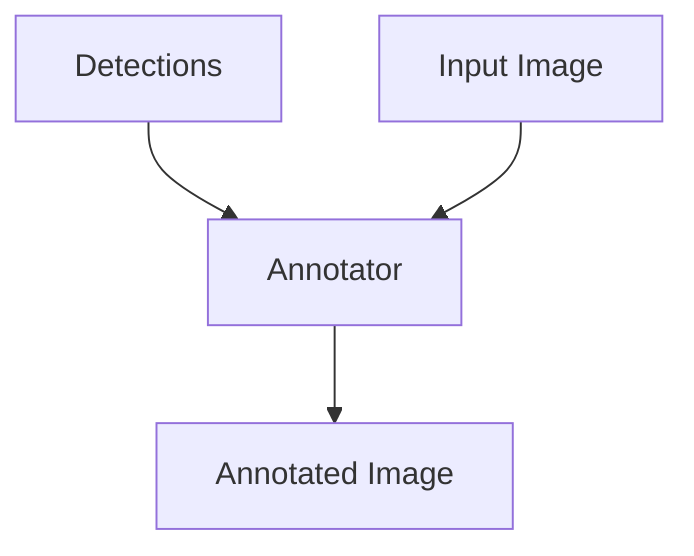
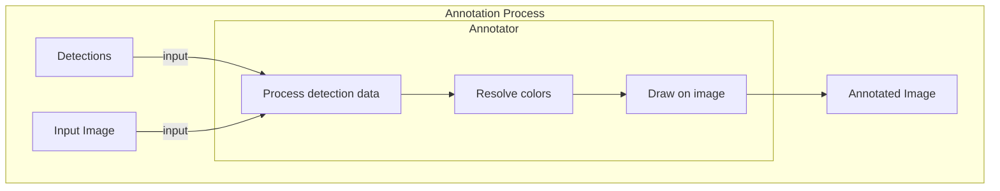
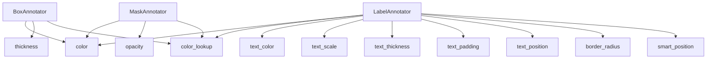
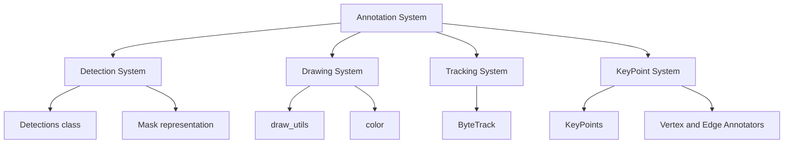

# Annotation System

Relevant source files

- [supervision/__init__.py](https://github.com/roboflow/supervision/blob/1d0747fb/supervision/__init__.py)
- [supervision/annotators/core.py](https://github.com/roboflow/supervision/blob/1d0747fb/supervision/annotators/core.py)
- [supervision/draw/color.py](https://github.com/roboflow/supervision/blob/1d0747fb/supervision/draw/color.py)
- [supervision/draw/utils.py](https://github.com/roboflow/supervision/blob/1d0747fb/supervision/draw/utils.py)
- [supervision/geometry/core.py](https://github.com/roboflow/supervision/blob/1d0747fb/supervision/geometry/core.py)
- [supervision/utils/image.py](https://github.com/roboflow/supervision/blob/1d0747fb/supervision/utils/image.py)
- [test/draw/test_color.py](https://github.com/roboflow/supervision/blob/1d0747fb/test/draw/test_color.py)
- [test/geometry/test_core.py](https://github.com/roboflow/supervision/blob/1d0747fb/test/geometry/test_core.py)
- [test/utils/test_conversion.py](https://github.com/roboflow/supervision/blob/1d0747fb/test/utils/test_conversion.py)
- [test/utils/test_image.py](https://github.com/roboflow/supervision/blob/1d0747fb/test/utils/test_image.py)

The Annotation System in Roboflow Supervision provides powerful tools for visualizing object detections, keypoints, and other computer vision results on images and videos. It offers a flexible set of annotators that can draw various visual elements such as bounding boxes, masks, labels, and special visual effects on images.

The Annotation System works directly with the [Detection System](https://deepwiki.com/roboflow/supervision/2.1-detection-system) to visualize detection results and is complementary to the [Drawing & Visualization](https://deepwiki.com/roboflow/supervision/3.2-drawing-and-visualization) utilities which provide lower-level drawing capabilities.

## Overview




The Annotation System consists of a hierarchy of annotator classes that share a common interface but specialize in drawing different types of visual elements. All annotators follow the same pattern - they take an image and detection data as input and return the annotated image.

Sources: [supervision/annotators/core.py43-123](https://github.com/roboflow/supervision/blob/1d0747fb/supervision/annotators/core.py#L43-L123) [supervision/annotators/core.py210-298](https://github.com/roboflow/supervision/blob/1d0747fb/supervision/annotators/core.py#L210-L298)

## Annotator Architecture

All annotators in Supervision inherit from a common `BaseAnnotator` class, providing a consistent interface and functionality.

```mermaid
classDiagram
  class BaseAnnotator {
    +annotate(scene, detections) : ImageType
  }

  class BoxAnnotator {
    -color : Color|ColorPalette
    -thickness : int
    -color_lookup : ColorLookup
    +annotate(scene, detections, custom_color_lookup) : ImageType
  }

  class MaskAnnotator {
    -color : Color|ColorPalette
    -opacity : float
    -color_lookup : ColorLookup
    +annotate(scene, detections, custom_color_lookup) : ImageType
  }

  class LabelAnnotator {
    -color : Color|ColorPalette
    -text_color : Color|ColorPalette
    -text_scale : float
    -text_thickness : int
    -text_padding : int
    -text_position : Position
    -color_lookup : ColorLookup
    -border_radius : int
    -smart_position : bool
    +annotate(scene, detections, labels, custom_color_lookup) : ImageType
  }

  class PolygonAnnotator
  class ColorAnnotator
  class HaloAnnotator
  class DotAnnotator
  class CircleAnnotator
  class EllipseAnnotator
  class BoxCornerAnnotator
  class TraceAnnotator
  class OrientedBoxAnnotator

  BoxAnnotator --|> BaseAnnotator
  MaskAnnotator --|> BaseAnnotator
  LabelAnnotator --|> BaseAnnotator
  PolygonAnnotator --|> BaseAnnotator
  ColorAnnotator --|> BaseAnnotator
  HaloAnnotator --|> BaseAnnotator
  DotAnnotator --|> BaseAnnotator
  CircleAnnotator --|> BaseAnnotator
  EllipseAnnotator --|> BaseAnnotator
  BoxCornerAnnotator --|> BaseAnnotator
  TraceAnnotator --|> BaseAnnotator
  OrientedBoxAnnotator --|> BaseAnnotator
```



Sources: [supervision/annotators/core.py10-33](https://github.com/roboflow/supervision/blob/1d0747fb/supervision/annotators/core.py#L10-L33) [supervision/annotators/base.py](https://github.com/roboflow/supervision/blob/1d0747fb/supervision/annotators/base.py)

## Annotation Process

The annotation process follows a consistent flow across all annotator types:



Sources: [supervision/annotators/core.py67-123](https://github.com/roboflow/supervision/blob/1d0747fb/supervision/annotators/core.py#L67-L123) [supervision/annotators/core.py239-298](https://github.com/roboflow/supervision/blob/1d0747fb/supervision/annotators/core.py#L239-L298)

## Core Annotator Types

Supervision provides several types of annotators for different visualization needs:

### Box and Shape Annotators

These annotators draw various shapes to highlight detected objects:

- **BoxAnnotator**: Draws rectangular bounding boxes
- **OrientedBoxAnnotator**: Draws rotated bounding boxes
- **BoxCornerAnnotator**: Draws just the corners of bounding boxes
- **CircleAnnotator**: Draws circles around detections
- **EllipseAnnotator**: Draws ellipses under detections
- **DotAnnotator**: Draws dots at specified anchor points

```
import supervision as sv
import cv2

# Load an image and create some detections
image = cv2.imread("image.jpg")
detections = sv.Detections(...)

# Initialize the box annotator
box_annotator = sv.BoxAnnotator(
    color=sv.ColorPalette.DEFAULT,
    thickness=2
)

# Annotate the image
annotated_image = box_annotator.annotate(
    scene=image.copy(),
    detections=detections
)
```

Sources: [supervision/annotators/core.py43-123](https://github.com/roboflow/supervision/blob/1d0747fb/supervision/annotators/core.py#L43-L123) [supervision/annotators/core.py677-767](https://github.com/roboflow/supervision/blob/1d0747fb/supervision/annotators/core.py#L677-L767) [supervision/annotators/core.py768-852](https://github.com/roboflow/supervision/blob/1d0747fb/supervision/annotators/core.py#L768-L852) [supervision/annotators/core.py582-675](https://github.com/roboflow/supervision/blob/1d0747fb/supervision/annotators/core.py#L582-L675)

### Mask and Region Annotators

These annotators visualize segmentation masks and similar region-based detections:

- **MaskAnnotator**: Fills detection masks with color
- **PolygonAnnotator**: Draws polygon outlines from masks
- **ColorAnnotator**: Fills bounding boxes with a semi-transparent color
- **HaloAnnotator**: Creates a glowing halo effect around masked objects

```
import supervision as sv
import cv2

# Load an image and create some detections with masks
image = cv2.imread("image.jpg")
detections = sv.Detections(...)  # With mask attribute set

# Initialize the mask annotator
mask_annotator = sv.MaskAnnotator(
    color=sv.ColorPalette.DEFAULT,
    opacity=0.5
)

# Annotate the image
annotated_image = mask_annotator.annotate(
    scene=image.copy(),
    detections=detections
)
```

Sources: [supervision/annotators/core.py210-298](https://github.com/roboflow/supervision/blob/1d0747fb/supervision/annotators/core.py#L210-L298) [supervision/annotators/core.py301-389](https://github.com/roboflow/supervision/blob/1d0747fb/supervision/annotators/core.py#L301-L389) [supervision/annotators/core.py392-477](https://github.com/roboflow/supervision/blob/1d0747fb/supervision/annotators/core.py#L392-L477) [supervision/annotators/core.py480-579](https://github.com/roboflow/supervision/blob/1d0747fb/supervision/annotators/core.py#L480-L579)

### Label Annotators

These annotators add text labels to visualize class names, probabilities, or other information:

- **LabelAnnotator**: Adds text labels to detections
- **RichLabelAnnotator**: Adds formatted labels with multiple fields (not shown in provided code but mentioned in imports)

```
import supervision as sv
import cv2

# Load an image and create some detections
image = cv2.imread("image.jpg")
detections = sv.Detections(...)

# Initialize the label annotator
label_annotator = sv.LabelAnnotator(
    color=sv.ColorPalette.DEFAULT,
    text_color=sv.Color.WHITE,
    text_scale=0.5,
    text_thickness=1,
    text_padding=10
)

# Annotate the image with custom labels
annotated_image = label_annotator.annotate(
    scene=image.copy(),
    detections=detections,
    labels=["Person", "Car", "Dog"]
)
```

Sources: [supervision/annotators/core.py963-1657](https://github.com/roboflow/supervision/blob/1d0747fb/supervision/annotators/core.py#L963-L1657)

### Effect Annotators

These annotators apply special visual effects to detections:

- **BlurAnnotator**: Blurs the detection regions
- **TraceAnnotator**: Shows motion traces of tracked objects
- **HeatMapAnnotator**: Visualizes detection hotspots as heatmaps

Sources: [supervision/__init__.py9-33](https://github.com/roboflow/supervision/blob/1d0747fb/supervision/__init__.py#L9-L33)

## Annotator Components

The annotator system relies on several key components to provide its functionality:

```mermaid
flowchart TD
  A[Annotators]

  subgraph "Image Conversion"
    direction TB
    E[Image Conversion]
    E1[ensure_cv2_image_for_annotation]
    E2[cv2_to_pillow]
    E3[pillow_to_cv2]
  end

  subgraph Geometry
    direction TB
    G[Geometry]
    D1[Point]
    D2[Rect]
    D3[Position]
  end

  subgraph "Drawing Utilities"
    direction TB
    U[Drawing Utilities]
    C1[draw_line]
    C2[draw_rectangle]
    C3[draw_polygon]
    C4[draw_text]
  end

  subgraph "Color System"
    direction TB
    S[Color System]
    B1[Color]
    B2[ColorPalette]
    B3[ColorLookup]
  end

  %% Relaciones desde Annotators
  A --> S
  A --> U
  A --> G
  A --> E
```



Sources: [supervision/annotators/core.py5-38](https://github.com/roboflow/supervision/blob/1d0747fb/supervision/annotators/core.py#L5-L38) [supervision/draw/color.py10-31](https://github.com/roboflow/supervision/blob/1d0747fb/supervision/draw/color.py#L10-L31) [supervision/draw/utils.py11-38](https://github.com/roboflow/supervision/blob/1d0747fb/supervision/draw/utils.py#L11-L38) [supervision/geometry/core.py9-32](https://github.com/roboflow/supervision/blob/1d0747fb/supervision/geometry/core.py#L9-L32)

### Color System

The Color System provides classes for representing, manipulating, and applying colors to annotations:

- **Color**: A class for representing RGB colors
- **ColorPalette**: A collection of colors for consistent styling
- **ColorLookup**: An enum defining strategies for mapping colors to detections (by class, index, or track ID)

```
from supervision import Color, ColorPalette, ColorLookup

# Predefined colors
red = Color.RED                      # (255, 0, 0)
white = Color.WHITE                  # (255, 255, 255)
roboflow_purple = Color.ROBOFLOW     # (163, 81, 251)

# Custom color
custom_color = Color.from_hex("#00FFAA")

# Color palettes
default_palette = ColorPalette.DEFAULT
roboflow_palette = ColorPalette.ROBOFLOW

# Color lookup strategies
by_class = ColorLookup.CLASS   # Color based on detection class
by_track = ColorLookup.TRACK   # Color based on tracking ID
by_index = ColorLookup.INDEX   # Color based on detection index
```

Sources: [supervision/draw/color.py65-268](https://github.com/roboflow/supervision/blob/1d0747fb/supervision/draw/color.py#L65-L268) [supervision/draw/color.py270-407](https://github.com/roboflow/supervision/blob/1d0747fb/supervision/draw/color.py#L270-L407) [supervision/annotators/utils.py](https://github.com/roboflow/supervision/blob/1d0747fb/supervision/annotators/utils.py)

### Drawing Utilities

Drawing utilities provide low-level functions for drawing shapes, text, and other graphical elements:

- **draw_line**: Draws a line between two points
- **draw_rectangle**: Draws a rectangle based on a Rect object
- **draw_polygon**: Draws a polygon from a set of points
- **draw_text**: Draws text with optional background

Sources: [supervision/draw/utils.py11-38](https://github.com/roboflow/supervision/blob/1d0747fb/supervision/draw/utils.py#L11-L38) [supervision/draw/utils.py41-63](https://github.com/roboflow/supervision/blob/1d0747fb/supervision/draw/utils.py#L41-L63) [supervision/draw/utils.py157-177](https://github.com/roboflow/supervision/blob/1d0747fb/supervision/draw/utils.py#L157-L177) [supervision/draw/utils.py209-281](https://github.com/roboflow/supervision/blob/1d0747fb/supervision/draw/utils.py#L209-L281)

### Geometry

Geometry components provide classes for representing and manipulating geometric primitives:

- **Point**: A 2D point with x and y coordinates
- **Rect**: A rectangle defined by x, y, width, and height
- **Position**: An enum for specifying anchor positions (e.g., TOP_LEFT, CENTER)

```
from supervision import Point, Rect, Position

# Create a point
point = Point(x=100, y=100)

# Create a rectangle
rect = Rect(x=50, y=50, width=200, height=100)

# Position enum for annotation placement
top_left = Position.TOP_LEFT
center = Position.CENTER
```

Sources: [supervision/geometry/core.py9-32](https://github.com/roboflow/supervision/blob/1d0747fb/supervision/geometry/core.py#L9-L32) [supervision/geometry/core.py33-43](https://github.com/roboflow/supervision/blob/1d0747fb/supervision/geometry/core.py#L33-L43) [supervision/geometry/core.py94-128](https://github.com/roboflow/supervision/blob/1d0747fb/supervision/geometry/core.py#L94-L128)

## Common Usage Patterns

Annotators are typically used with a pattern where they are instantiated once and then used to annotate multiple frames:

```
import supervision as sv
import cv2

# Load a video
video_path = "video.mp4"
cap = cv2.VideoCapture(video_path)

# Initialize annotators
box_annotator = sv.BoxAnnotator()
label_annotator = sv.LabelAnnotator()

# Process video frames
while True:
    ret, frame = cap.read()
    if not ret:
        break
        
    # Get detections from a model (example)
    detections = model.predict(frame)
    detections = sv.Detections.from_ultralytics(detections)
    
    # Annotate the frame
    annotated_frame = frame.copy()
    annotated_frame = box_annotator.annotate(annotated_frame, detections)
    annotated_frame = label_annotator.annotate(annotated_frame, detections)
    
    # Display or save the annotated frame
    cv2.imshow("Annotated Frame", annotated_frame)
    if cv2.waitKey(1) & 0xFF == ord('q'):
        break

cap.release()
cv2.destroyAllWindows()
```

### Combining Annotators

Multiple annotators can be chained together to create rich visualizations:

```
# Initialize multiple annotators
box_annotator = sv.BoxAnnotator(
    color=sv.ColorPalette.DEFAULT,
    thickness=2
)
label_annotator = sv.LabelAnnotator(
    color=sv.ColorPalette.DEFAULT,
    text_color=sv.Color.WHITE
)
mask_annotator = sv.MaskAnnotator(
    color=sv.ColorPalette.DEFAULT,
    opacity=0.3
)

# Apply annotations in sequence
annotated_image = image.copy()
annotated_image = mask_annotator.annotate(annotated_image, detections)
annotated_image = box_annotator.annotate(annotated_image, detections)
annotated_image = label_annotator.annotate(annotated_image, detections)
```

## Customizing Annotations

Annotators provide extensive customization options through their initialization parameters:



Sources: [supervision/annotators/core.py48-64](https://github.com/roboflow/supervision/blob/1d0747fb/supervision/annotators/core.py#L48-L64) [supervision/annotators/core.py968-1005](https://github.com/roboflow/supervision/blob/1d0747fb/supervision/annotators/core.py#L968-L1005) [supervision/annotators/core.py220-236](https://github.com/roboflow/supervision/blob/1d0747fb/supervision/annotators/core.py#L220-L236)

## Color Management

The Annotation System provides several ways to control colors:

### Default Colors and Palettes

```
# Use predefined colors
red_annotator = sv.BoxAnnotator(color=sv.Color.RED)
white_annotator = sv.BoxAnnotator(color=sv.Color.WHITE)

# Use color palettes
default_palette_annotator = sv.BoxAnnotator(color=sv.ColorPalette.DEFAULT)
roboflow_palette_annotator = sv.BoxAnnotator(color=sv.ColorPalette.ROBOFLOW)
```

### Color Mapping Strategies

The `color_lookup` parameter controls how colors are assigned to detections:

```
# Color by class (each class gets a consistent color)
class_annotator = sv.BoxAnnotator(color_lookup=sv.ColorLookup.CLASS)

# Color by index (each detection gets a color based on its position)
index_annotator = sv.BoxAnnotator(color_lookup=sv.ColorLookup.INDEX)

# Color by tracking ID (each tracked object gets a consistent color)
track_annotator = sv.BoxAnnotator(color_lookup=sv.ColorLookup.TRACK)
```

## Integration with Other Systems

The Annotation System integrates with various other components of the Supervision library:



Sources: [supervision/annotators/core.py5-38](https://github.com/roboflow/supervision/blob/1d0747fb/supervision/annotators/core.py#L5-L38) [supervision/__init__.py9-33](https://github.com/roboflow/supervision/blob/1d0747fb/supervision/__init__.py#L9-L33) [supervision/__init__.py96-102](https://github.com/roboflow/supervision/blob/1d0747fb/supervision/__init__.py#L96-L102)

## Performance Considerations

When working with large images or videos, keep in mind:

1. Annotators modify the input image in-place (unless you provide a copy)
2. Some annotators (like MaskAnnotator and HaloAnnotator) may be more computationally intensive
3. The order of applying annotators can affect the final result and performance

## Conclusion

The Annotation System in Supervision provides a comprehensive set of tools for visualizing computer vision results. With its consistent interface, flexible customization options, and integration with other Supervision components, it allows for creating rich visual representations of detection results for a variety of applications.