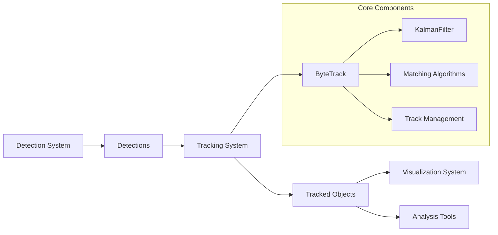
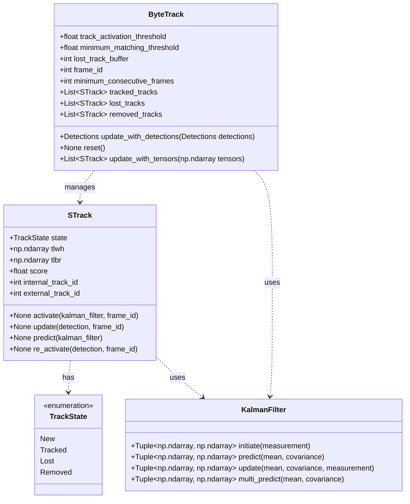
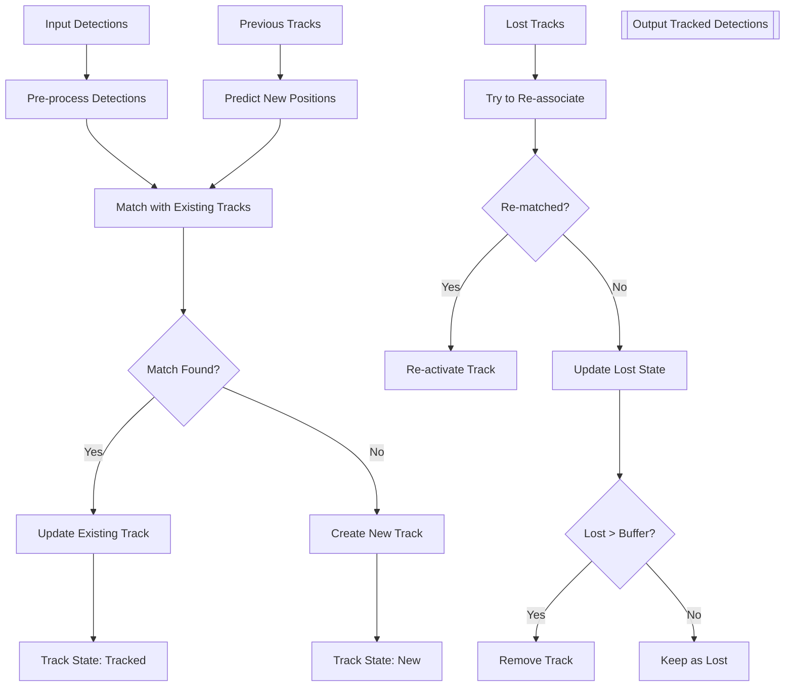
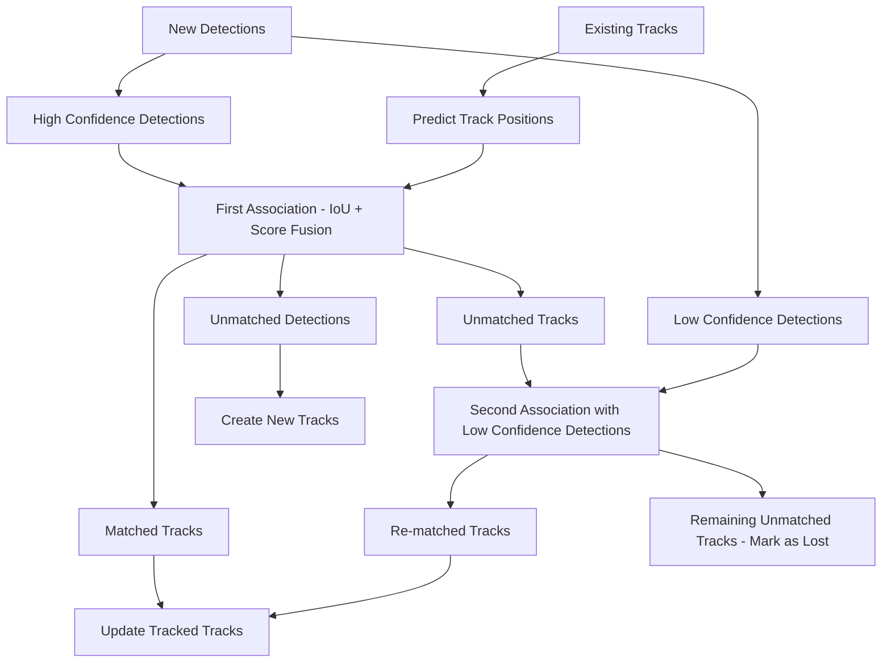

# Tracking System

Relevant source files

- [docs/how_to/track_objects.md](https://github.com/roboflow/supervision/blob/1d0747fb/docs/how_to/track_objects.md)
- [examples/count_people_in_zone/inference_example.py](https://github.com/roboflow/supervision/blob/1d0747fb/examples/count_people_in_zone/inference_example.py)
- [examples/count_people_in_zone/ultralytics_example.py](https://github.com/roboflow/supervision/blob/1d0747fb/examples/count_people_in_zone/ultralytics_example.py)
- [examples/tracking/inference_example.py](https://github.com/roboflow/supervision/blob/1d0747fb/examples/tracking/inference_example.py)
- [examples/tracking/ultralytics_example.py](https://github.com/roboflow/supervision/blob/1d0747fb/examples/tracking/ultralytics_example.py)
- [supervision/tracker/byte_tracker/core.py](https://github.com/roboflow/supervision/blob/1d0747fb/supervision/tracker/byte_tracker/core.py)
- [supervision/tracker/byte_tracker/kalman_filter.py](https://github.com/roboflow/supervision/blob/1d0747fb/supervision/tracker/byte_tracker/kalman_filter.py)
- [supervision/tracker/byte_tracker/matching.py](https://github.com/roboflow/supervision/blob/1d0747fb/supervision/tracker/byte_tracker/matching.py)
- [test/tracker/__init__.py](https://github.com/roboflow/supervision/blob/1d0747fb/test/tracker/__init__.py)
- [test/tracker/test_byte_tracker.py](https://github.com/roboflow/supervision/blob/1d0747fb/test/tracker/test_byte_tracker.py)

The Tracking System in Supervision provides object tracking capabilities that enable continuous identification and monitoring of objects across video frames. Built on the ByteTrack algorithm, this system assigns unique tracking IDs to detected objects and maintains their identity through occlusions, varying lighting conditions, and other challenging scenarios. This page covers the architecture, components, and usage of the tracking system.

## Overview of the Tracking System

The tracking system builds upon the [Detection System](https://deepwiki.com/roboflow/supervision/2.1-detection-system) by adding temporal consistency to object detections. While the Detection System identifies objects in individual frames, the Tracking System associates these detections across frames, creating persistent identities for detected objects.




Sources:

- [supervision/tracker/byte_tracker/core.py13-66](https://github.com/roboflow/supervision/blob/1d0747fb/supervision/tracker/byte_tracker/core.py#L13-L66)
- [supervision/tracker/byte_tracker/kalman_filter.py7-32](https://github.com/roboflow/supervision/blob/1d0747fb/supervision/tracker/byte_tracker/kalman_filter.py#L7-L32)

## System Architecture

The Tracking System is centered around the `ByteTrack` class, which implements a multi-object tracking algorithm. The system uses several key components to track objects efficiently:



Sources:

- [supervision/tracker/byte_tracker/core.py13-136](https://github.com/roboflow/supervision/blob/1d0747fb/supervision/tracker/byte_tracker/core.py#L13-L136)
- [supervision/tracker/byte_tracker/kalman_filter.py7-206](https://github.com/roboflow/supervision/blob/1d0747fb/supervision/tracker/byte_tracker/kalman_filter.py#L7-L206)

### Key Components

1. **ByteTrack**: The main class that implements the tracking algorithm
2. **STrack (Single Object Track)**: Represents a single tracked object with its state and history
3. **KalmanFilter**: Used for motion prediction
4. **Matching Algorithms**: Used to associate detections with existing tracks

### Object Tracking Flow



Sources:

- [supervision/tracker/byte_tracker/core.py67-135](https://github.com/roboflow/supervision/blob/1d0747fb/supervision/tracker/byte_tracker/core.py#L67-L135)
- [supervision/tracker/byte_tracker/core.py152-314](https://github.com/roboflow/supervision/blob/1d0747fb/supervision/tracker/byte_tracker/core.py#L152-L314)

## Track Management

The ByteTrack algorithm manages objects through different states during their lifecycle:

1. **New**: Objects that have been detected but not yet confirmed
2. **Tracked**: Confirmed objects currently being tracked
3. **Lost**: Objects that were previously tracked but not detected in recent frames
4. **Removed**: Objects that have been lost for too long and are no longer tracked

The system maintains three lists to track these states:

- `tracked_tracks`: Objects currently being tracked
- `lost_tracks`: Objects that have been lost but might reappear
- `removed_tracks`: Objects that have been permanently removed from tracking

Sources:

- [supervision/tracker/byte_tracker/core.py58-60](https://github.com/roboflow/supervision/blob/1d0747fb/supervision/tracker/byte_tracker/core.py#L58-L60)
- [supervision/tracker/byte_tracker/core.py300-312](https://github.com/roboflow/supervision/blob/1d0747fb/supervision/tracker/byte_tracker/core.py#L300-L312)

## Configuration Parameters

The ByteTrack tracker can be configured with several parameters that control its behavior:

|Parameter|Default|Description|
|---|---|---|
|`track_activation_threshold`|0.25|Confidence threshold for track activation|
|`lost_track_buffer`|30|Number of frames to buffer when a track is lost|
|`minimum_matching_threshold`|0.8|Threshold for matching tracks with detections|
|`frame_rate`|30|Frame rate of the video|
|`minimum_consecutive_frames`|1|Number of consecutive frames for track validation|

Sources:

- [supervision/tracker/byte_tracker/core.py40-46](https://github.com/roboflow/supervision/blob/1d0747fb/supervision/tracker/byte_tracker/core.py#L40-L46)

### Parameter Effects

- Increasing `track_activation_threshold` improves accuracy and stability but might miss true detections
- Decreasing `track_activation_threshold` increases detection completeness but risks introducing noise
- Increasing `lost_track_buffer` enhances occlusion handling, reducing track fragmentation
- Increasing `minimum_consecutive_frames` prevents creation of accidental tracks from false detections

Sources:

- [supervision/tracker/byte_tracker/core.py21-38](https://github.com/roboflow/supervision/blob/1d0747fb/supervision/tracker/byte_tracker/core.py#L21-L38)

## Using the Tracking System

### Basic Usage

The tracking system is designed to be simple to use. The core pattern follows these steps:

1. Obtain detections from a model (e.g., YOLO)
2. Initialize a `ByteTrack` tracker
3. Update the tracker with new detections
4. Use the returned tracked detections for visualization or analysis

Here's how the system is typically used:

```
import supervision as sv
from ultralytics import YOLO

# Initialize model and tracker
model = YOLO("yolov8n.pt")
tracker = sv.ByteTrack()

# Process video frame by frame
def callback(frame, index):
    # Get detections from model
    results = model(frame)[0]
    detections = sv.Detections.from_ultralytics(results)
    
    # Update tracker with new detections
    tracked_detections = tracker.update_with_detections(detections)
    
    # Now tracked_detections has tracker_id for each detected object
    return tracked_detections
```

Sources:

- [docs/how_to/track_objects.md108-127](https://github.com/roboflow/supervision/blob/1d0747fb/docs/how_to/track_objects.md#L108-L127)
- [examples/tracking/ultralytics_example.py16-30](https://github.com/roboflow/supervision/blob/1d0747fb/examples/tracking/ultralytics_example.py#L16-L30)

### Visualizing Tracked Objects

The tracked detections can be visualized with tracking IDs and traces:

```
# Initialize annotators
box_annotator = sv.BoxAnnotator()
label_annotator = sv.LabelAnnotator()
trace_annotator = sv.TraceAnnotator()

def callback(frame, index):
    # Get tracked detections (as shown above)
    ...
    
    # Create labels with tracking IDs
    labels = [f"#{tracker_id}" for tracker_id in tracked_detections.tracker_id]
    
    # Annotate frame
    annotated_frame = box_annotator.annotate(frame.copy(), detections=tracked_detections)
    annotated_frame = label_annotator.annotate(annotated_frame, detections=tracked_detections, labels=labels)
    annotated_frame = trace_annotator.annotate(annotated_frame, detections=tracked_detections)
    
    return annotated_frame
```

Sources:

- [docs/how_to/track_objects.md163-189](https://github.com/roboflow/supervision/blob/1d0747fb/docs/how_to/track_objects.md#L163-L189)
- [docs/how_to/track_objects.md244-279](https://github.com/roboflow/supervision/blob/1d0747fb/docs/how_to/track_objects.md#L244-L279)

## Internal Tracking Mechanism

### Detection-Track Association

The ByteTrack algorithm uses two key mechanisms for associating detections with tracks:

1. **IoU Matching**: Computes the Intersection over Union between predicted track positions and new detections
2. **Score Fusion**: Combines detection confidence with IoU similarity for more robust association

This two-stage process first tries to match high-confidence detections, then attempts to match remaining tracks with lower-confidence detections.



Sources:

- [supervision/tracker/byte_tracker/core.py172-214](https://github.com/roboflow/supervision/blob/1d0747fb/supervision/tracker/byte_tracker/core.py#L172-L214)
- [supervision/tracker/byte_tracker/core.py229-263](https://github.com/roboflow/supervision/blob/1d0747fb/supervision/tracker/byte_tracker/core.py#L229-L263)
- [supervision/tracker/byte_tracker/matching.py43-69](https://github.com/roboflow/supervision/blob/1d0747fb/supervision/tracker/byte_tracker/matching.py#L43-L69)

### Motion Prediction with Kalman Filter

The tracking system uses a Kalman filter to predict the next position of tracked objects, making it possible to track objects even when detections are temporarily missing (such as during occlusions).

The Kalman filter maintains an 8-dimensional state space:

- Position: x, y (center)
- Size: a (aspect ratio), h (height)
- Velocity: vx, vy, va, vh

This state representation allows the tracker to model both the position and size changes of objects over time.

Sources:

- [supervision/tracker/byte_tracker/kalman_filter.py7-32](https://github.com/roboflow/supervision/blob/1d0747fb/supervision/tracker/byte_tracker/kalman_filter.py#L7-L32)
- [supervision/tracker/byte_tracker/core.py54-56](https://github.com/roboflow/supervision/blob/1d0747fb/supervision/tracker/byte_tracker/core.py#L54-L56)

## Tracking with KeyPoints

The tracking system can also be used with keypoint detections by converting them to bounding box detections:

1. Detect keypoints using a keypoint detection model
2. Convert keypoints to detections using `KeyPoints.as_detections()`
3. Track the resulting detections using `ByteTrack`

This approach allows tracking of pose estimation results, making it applicable to human pose tracking, sports analysis, and other applications involving articulated objects.

Sources:

- [docs/how_to/track_objects.md409-414](https://github.com/roboflow/supervision/blob/1d0747fb/docs/how_to/track_objects.md#L409-L414)
- [docs/how_to/track_objects.md487-562](https://github.com/roboflow/supervision/blob/1d0747fb/docs/how_to/track_objects.md#L487-L562)

## Advanced Features

### Track Smoothing

For applications requiring smooth tracks, the Tracking System can be enhanced with the `DetectionsSmoother` to stabilize object positions:

```
tracker = sv.ByteTrack()
smoother = sv.DetectionsSmoother()

# In processing loop:
detections = tracker.update_with_detections(detections)
detections = smoother.update_with_detections(detections)
```

This reduces jitter in tracking boxes, which is particularly beneficial for keypoint tracking and precise measurements.

Sources:

- [docs/how_to/track_objects.md569-654](https://github.com/roboflow/supervision/blob/1d0747fb/docs/how_to/track_objects.md#L569-L654)

### Tracker Reset

When processing multiple videos sequentially, the tracker state should be reset to avoid contamination between videos:

```
tracker = sv.ByteTrack()

# Process first video
# ...

# Reset before processing next video
tracker.reset()

# Process second video
# ...
```

The `reset()` method clears all internal tracking state, including tracked, lost, and removed tracks, ensuring a fresh start for each new video.

Sources:

- [supervision/tracker/byte_tracker/core.py137-151](https://github.com/roboflow/supervision/blob/1d0747fb/supervision/tracker/byte_tracker/core.py#L137-L151)

## Integration with Other Systems

The Tracking System integrates with other Supervision components:

1. **Integration with Detection System**: Takes `Detections` objects and enhances them with tracking IDs
2. **Integration with Annotation System**: Tracked objects can be visualized with boxes, labels, and traces
3. **Integration with Zone Tools**: Tracked objects can be counted as they enter/exit defined zones

This integration enables complex video analysis pipelines for applications like traffic monitoring, people counting, and sports analytics.

Sources:

- [examples/count_people_in_zone/ultralytics_example.py63-88](https://github.com/roboflow/supervision/blob/1d0747fb/examples/count_people_in_zone/ultralytics_example.py#L63-L88)
- [examples/count_people_in_zone/inference_example.py65-91](https://github.com/roboflow/supervision/blob/1d0747fb/examples/count_people_in_zone/inference_example.py#L65-L91)

## Performance Considerations

When using the Tracking System, consider these performance factors:

1. **Parameter Tuning**:
    
    - Adjust `track_activation_threshold` based on detection model confidence
    - Set `lost_track_buffer` based on expected occlusion duration
    - Modify `minimum_matching_threshold` based on object movement speed
2. **Computational Efficiency**:
    
    - The tracker adds computational overhead proportional to the number of tracked objects
    - Consider downstream applications when choosing parameters
3. **Frame Rate Considerations**:
    
    - The tracker is designed to work with consistent frame rates
    - Large jumps in object position between frames can reduce tracking performance

Sources:

- [supervision/tracker/byte_tracker/core.py21-38](https://github.com/roboflow/supervision/blob/1d0747fb/supervision/tracker/byte_tracker/core.py#L21-L38)
- [supervision/tracker/byte_tracker/core.py52-53](https://github.com/roboflow/supervision/blob/1d0747fb/supervision/tracker/byte_tracker/core.py#L52-L53)

## Summary

The Supervision Tracking System provides robust object tracking capabilities through the ByteTrack algorithm. By maintaining object identities across video frames, it enables temporal analysis of object behavior, making it a crucial component for video understanding applications. The system is designed to be easy to use while offering customization options for advanced applications.