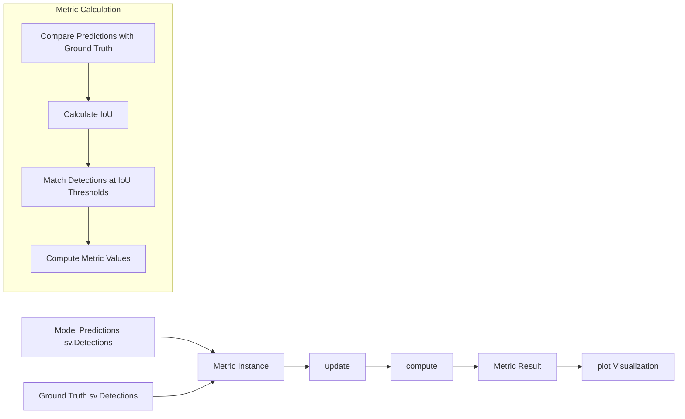
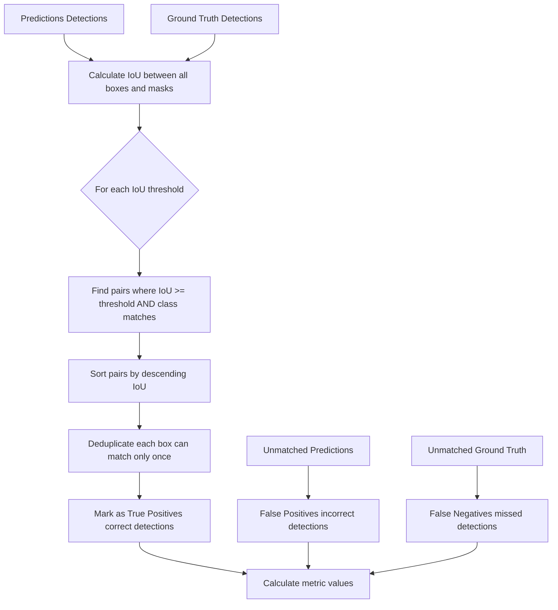
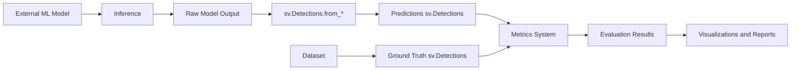

# Metrics System

Relevant source files

- [docs/metrics/common_values.md](https://github.com/roboflow/supervision/blob/1d0747fb/docs/metrics/common_values.md)
- [docs/metrics/precision.md](https://github.com/roboflow/supervision/blob/1d0747fb/docs/metrics/precision.md)
- [docs/metrics/recall.md](https://github.com/roboflow/supervision/blob/1d0747fb/docs/metrics/recall.md)
- [supervision/metrics/__init__.py](https://github.com/roboflow/supervision/blob/1d0747fb/supervision/metrics/__init__.py)
- [supervision/metrics/core.py](https://github.com/roboflow/supervision/blob/1d0747fb/supervision/metrics/core.py)
- [supervision/metrics/detection.py](https://github.com/roboflow/supervision/blob/1d0747fb/supervision/metrics/detection.py)
- [supervision/metrics/f1_score.py](https://github.com/roboflow/supervision/blob/1d0747fb/supervision/metrics/f1_score.py)
- [supervision/metrics/mean_average_precision.py](https://github.com/roboflow/supervision/blob/1d0747fb/supervision/metrics/mean_average_precision.py)
- [supervision/metrics/precision.py](https://github.com/roboflow/supervision/blob/1d0747fb/supervision/metrics/precision.py)
- [supervision/metrics/recall.py](https://github.com/roboflow/supervision/blob/1d0747fb/supervision/metrics/recall.py)
- [test/metrics/__init__.py](https://github.com/roboflow/supervision/blob/1d0747fb/test/metrics/__init__.py)
- [test/metrics/test_detection.py](https://github.com/roboflow/supervision/blob/1d0747fb/test/metrics/test_detection.py)

The Metrics System in Supervision provides comprehensive tools for evaluating object detection performance. These metrics help quantify how well a detection model is performing in terms of accuracy, precision, and recall at different Intersection over Union (IoU) thresholds. This page documents the architecture, components, and usage of the metrics system.

For information about running inference with models, see [Model Adapters](https://deepwiki.com/roboflow/supervision/4.1-model-adapters), and for information about storing and manipulating detections, see [Detection System](https://deepwiki.com/roboflow/supervision/2.1-detection-system).

## Overview and Architecture

The Metrics System is designed around a modular architecture with base classes, metric implementations, and result containers. It supports various types of detection targets (bounding boxes, masks, oriented bounding boxes) and provides detailed evaluation capabilities.

Sources:

- [supervision/metrics/core.py8-72](https://github.com/roboflow/supervision/blob/1d0747fb/supervision/metrics/core.py#L8-L72)
- [supervision/metrics/__init__.py1-40](https://github.com/roboflow/supervision/blob/1d0747fb/supervision/metrics/__init__.py#L1-L40)
- [supervision/metrics/mean_average_precision.py29-69](https://github.com/roboflow/supervision/blob/1d0747fb/supervision/metrics/mean_average_precision.py#L29-L69)
- [supervision/metrics/f1_score.py29-73](https://github.com/roboflow/supervision/blob/1d0747fb/supervision/metrics/f1_score.py#L29-L73)
- [supervision/metrics/precision.py29-76](https://github.com/roboflow/supervision/blob/1d0747fb/supervision/metrics/precision.py#L29-L76)
- [supervision/metrics/recall.py29-77](https://github.com/roboflow/supervision/blob/1d0747fb/supervision/metrics/recall.py#L29-L77)

## Core Components

### Base Classes and Enums

The metrics system is built on a few key abstractions:

1. **Metric (Abstract Base Class)**: Defines the interface for all metrics with three key methods:
    
    - `update()`: Add new data to the metric without computing results
    - `reset()`: Clear all stored data
    - `compute()`: Calculate the metric based on stored data
2. **MetricTarget (Enum)**: Specifies what detection data to use for evaluation
    
    - `BOXES`: Standard bounding boxes (xyxy format)
    - `MASKS`: Instance segmentation masks
    - `ORIENTED_BOUNDING_BOXES`: Rotated bounding boxes
3. **AveragingMethod (Enum)**: Defines how to aggregate metrics across classes
    
    - `MACRO`: Simple average across all classes (treats all classes equally)
    - `MICRO`: Global average considering all detections (gives more weight to frequent classes)
    - `WEIGHTED`: Weighted average based on number of instances per class

Sources:

- [supervision/metrics/core.py8-72](https://github.com/roboflow/supervision/blob/1d0747fb/supervision/metrics/core.py#L8-L72)

### Metrics Flow

The Metrics System follows a consistent pattern for computing evaluation metrics:



Sources:

- [supervision/metrics/mean_average_precision.py97-182](https://github.com/roboflow/supervision/blob/1d0747fb/supervision/metrics/mean_average_precision.py#L97-L182)
- [supervision/metrics/f1_score.py102-162](https://github.com/roboflow/supervision/blob/1d0747fb/supervision/metrics/f1_score.py#L102-L162)
- [supervision/metrics/precision.py105-163](https://github.com/roboflow/supervision/blob/1d0747fb/supervision/metrics/precision.py#L105-L163)
- [supervision/metrics/recall.py106-163](https://github.com/roboflow/supervision/blob/1d0747fb/supervision/metrics/recall.py#L106-L163)

## Supported Metrics

### Mean Average Precision (mAP)

Mean Average Precision is the primary metric for evaluating object detection models. It calculates precision and recall at different IoU thresholds and averages them.

Key features:

- Calculates mAP@50:95 (average over multiple IoU thresholds)
- Provides breakdown by class
- Supports different object sizes (small, medium, large)
- Works with boxes, masks, and oriented bounding boxes

Usage example:

```
import supervision as sv

# Create metric instance
map_metric = sv.MeanAveragePrecision()

# Add data and compute result
map_result = map_metric.update(predictions, targets).compute()

# Access results
print(f"mAP@50:95: {map_result.map50_95}")
print(f"mAP@50: {map_result.map50}")

# Visualize results
map_result.plot()
```

Sources:

- [supervision/metrics/mean_average_precision.py29-628](https://github.com/roboflow/supervision/blob/1d0747fb/supervision/metrics/mean_average_precision.py#L29-L628)

### F1 Score

F1 Score is the harmonic mean of precision and recall, providing a balanced measure of a model's performance.

Key features:

- Calculated at multiple IoU thresholds
- Supports different averaging methods
- Provides F1@50 and F1@75 as key metrics

Usage example:

```
import supervision as sv

f1_metric = sv.F1Score()
f1_result = f1_metric.update(predictions, targets).compute()

print(f"F1@50: {f1_result.f1_50}")
f1_result.plot()
```

Sources:

- [supervision/metrics/f1_score.py29-648](https://github.com/roboflow/supervision/blob/1d0747fb/supervision/metrics/f1_score.py#L29-L648)

### Precision

Precision measures the percentage of correct detections among all detections made by the model. It helps evaluate how accurate the model's positive predictions are.

Key features:

- Calculated at multiple IoU thresholds
- Supports different averaging methods
- Provides per-class precision values

Sources:

- [supervision/metrics/precision.py29-645](https://github.com/roboflow/supervision/blob/1d0747fb/supervision/metrics/precision.py#L29-L645)

### Recall

Recall measures the percentage of ground truth objects that were correctly detected by the model. It helps evaluate how complete the model's predictions are.

Key features:

- Calculated at multiple IoU thresholds
- Supports different averaging methods
- Provides per-class recall values

Sources:

- [supervision/metrics/recall.py29-646](https://github.com/roboflow/supervision/blob/1d0747fb/supervision/metrics/recall.py#L29-L646)

## Implementation Details

### Detection Matching Process

The process of matching predictions to ground truth is fundamental to all metrics and follows these steps:



Sources:

- [supervision/metrics/mean_average_precision.py275-308](https://github.com/roboflow/supervision/blob/1d0747fb/supervision/metrics/mean_average_precision.py#L275-L308)
- [supervision/metrics/f1_score.py272-300](https://github.com/roboflow/supervision/blob/1d0747fb/supervision/metrics/f1_score.py#L272-L300)

### Object Size Categories

The metrics system supports evaluating performance by object size categories:

- **Small Objects**: Area < 32²
- **Medium Objects**: 32² ≤ Area < 96²
- **Large Objects**: Area ≥ 96²

This allows for understanding model performance across different scales of objects in the scene.

Sources:

- [supervision/metrics/mean_average_precision.py149-180](https://github.com/roboflow/supervision/blob/1d0747fb/supervision/metrics/mean_average_precision.py#L149-L180)
- [supervision/metrics/f1_score.py143-158](https://github.com/roboflow/supervision/blob/1d0747fb/supervision/metrics/f1_score.py#L143-L158)

## Integration with Other Components

### Data Flow with Detection System

The Metrics System seamlessly integrates with the Detection System:




Sources:

- [supervision/metrics/mean_average_precision.py568-613](https://github.com/roboflow/supervision/blob/1d0747fb/supervision/metrics/mean_average_precision.py#L568-L613)
- [supervision/metrics/detection.py393-391](https://github.com/roboflow/supervision/blob/1d0747fb/supervision/metrics/detection.py#L393-L391)

### Benchmarking with Dataset Management

The metrics system provides direct benchmarking capabilities that work with the Dataset Management system:

```
import supervision as sv
from ultralytics import YOLO

# Load dataset and model
dataset = sv.DetectionDataset.from_yolo(...)
model = YOLO(...)

# Define callback function
def callback(image: np.ndarray) -> sv.Detections:
    result = model(image)[0]
    return sv.Detections.from_ultralytics(result)

# Benchmark model on dataset
map_result = sv.MeanAveragePrecision.benchmark(
    dataset=dataset,
    callback=callback
)
```

Sources:

- [supervision/metrics/detection.py345-392](https://github.com/roboflow/supervision/blob/1d0747fb/supervision/metrics/detection.py#L345-L392)
- [supervision/metrics/mean_average_precision.py568-613](https://github.com/roboflow/supervision/blob/1d0747fb/supervision/metrics/mean_average_precision.py#L568-L613)

## Legacy vs. New API

The metrics system has evolved over time, with newer implementations providing more features. The library currently maintains both implementations:

1. **Legacy API** (in `detection.py`):
    
    - `ConfusionMatrix` class
    - `MeanAveragePrecision` dataclass
2. **New API** (in dedicated files):
    
    - `MeanAveragePrecision`, `F1Score`, `Precision`, `Recall` classes
    - Based on the `Metric` abstract base class
    - More consistent interface
    - Support for different metric targets and averaging methods

It's recommended to use the new API for new projects, as it provides more flexibility and features.

Sources:

- [supervision/metrics/detection.py72-843](https://github.com/roboflow/supervision/blob/1d0747fb/supervision/metrics/detection.py#L72-L843)
- [supervision/metrics/mean_average_precision.py29-628](https://github.com/roboflow/supervision/blob/1d0747fb/supervision/metrics/mean_average_precision.py#L29-L628)

## Visualization Capabilities

All metric result classes provide built-in plotting capabilities for visualizing results:

```
import supervision as sv

# Create and compute metric
metric = sv.MeanAveragePrecision()
result = metric.update(predictions, targets).compute()

# Generate visualization
result.plot()
```

This produces a bar chart showing key metrics (e.g., mAP@50:95, mAP@50, mAP@75) overall and by object size categories.

Sources:

- [supervision/metrics/mean_average_precision.py562-628](https://github.com/roboflow/supervision/blob/1d0747fb/supervision/metrics/mean_average_precision.py#L562-L628)
- [supervision/metrics/f1_score.py586-648](https://github.com/roboflow/supervision/blob/1d0747fb/supervision/metrics/f1_score.py#L586-L648)

## Example Use Cases

### Evaluating Model Performance

```
import supervision as sv

# Create predictions and ground truth
predictions = sv.Detections(...)
targets = sv.Detections(...)

# Evaluate with multiple metrics
map_metric = sv.MeanAveragePrecision()
f1_metric = sv.F1Score()
precision_metric = sv.Precision()
recall_metric = sv.Recall()

# Compute results
map_result = map_metric.update(predictions, targets).compute()
f1_result = f1_metric.update(predictions, targets).compute()
precision_result = precision_metric.update(predictions, targets).compute()
recall_result = recall_metric.update(predictions, targets).compute()

# Print summary
print(f"mAP@50:95: {map_result.map50_95:.4f}")
print(f"F1@50: {f1_result.f1_50:.4f}")
print(f"Precision@50: {precision_result.precision_at_50:.4f}")
print(f"Recall@50: {recall_result.recall_at_50:.4f}")
```

### Comparing Performance Across Object Sizes

```
import supervision as sv

# Create and compute metric
map_metric = sv.MeanAveragePrecision()
result = map_metric.update(predictions, targets).compute()

# Access results by object size
print(f"Overall mAP@50: {result.map50:.4f}")
print(f"Small objects mAP@50: {result.small_objects.map50:.4f}")
print(f"Medium objects mAP@50: {result.medium_objects.map50:.4f}")
print(f"Large objects mAP@50: {result.large_objects.map50:.4f}")
```

Sources:

- [supervision/metrics/mean_average_precision.py147-182](https://github.com/roboflow/supervision/blob/1d0747fb/supervision/metrics/mean_average_precision.py#L147-L182)