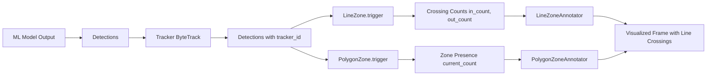
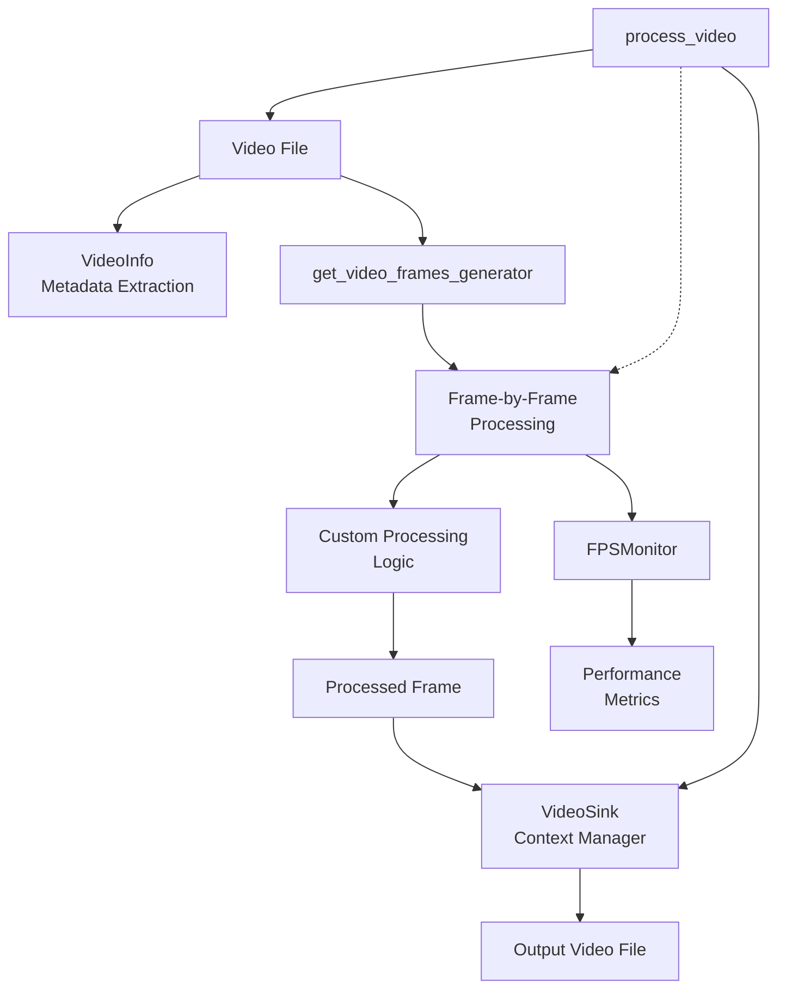
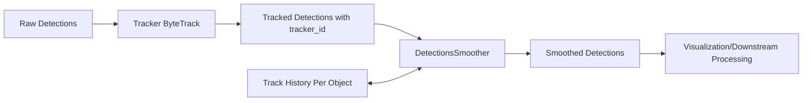
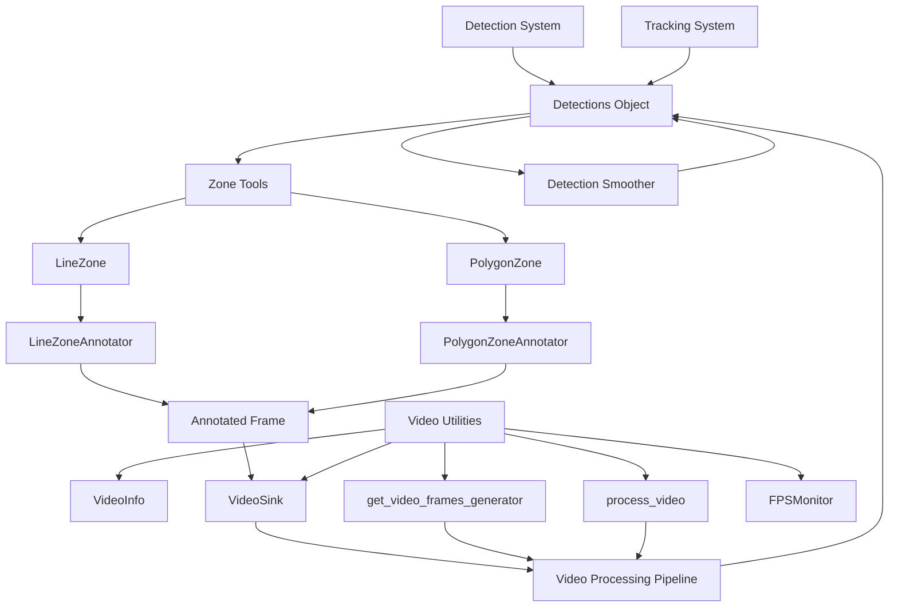

# Tools & Utilities

Relevant source files

- [docs/detection/tools/smoother.md](https://github.com/roboflow/supervision/blob/1d0747fb/docs/detection/tools/smoother.md)
- [docs/utils/file.md](https://github.com/roboflow/supervision/blob/1d0747fb/docs/utils/file.md)
- [docs/utils/image.md](https://github.com/roboflow/supervision/blob/1d0747fb/docs/utils/image.md)
- [docs/utils/notebook.md](https://github.com/roboflow/supervision/blob/1d0747fb/docs/utils/notebook.md)
- [docs/utils/video.md](https://github.com/roboflow/supervision/blob/1d0747fb/docs/utils/video.md)
- [supervision/detection/line_zone.py](https://github.com/roboflow/supervision/blob/1d0747fb/supervision/detection/line_zone.py)
- [supervision/detection/tools/polygon_zone.py](https://github.com/roboflow/supervision/blob/1d0747fb/supervision/detection/tools/polygon_zone.py)
- [supervision/detection/tools/smoother.py](https://github.com/roboflow/supervision/blob/1d0747fb/supervision/detection/tools/smoother.py)
- [supervision/utils/internal.py](https://github.com/roboflow/supervision/blob/1d0747fb/supervision/utils/internal.py)
- [supervision/utils/video.py](https://github.com/roboflow/supervision/blob/1d0747fb/supervision/utils/video.py)
- [test/detection/test_polygon_zone_annotator.py](https://github.com/roboflow/supervision/blob/1d0747fb/test/detection/test_polygon_zone_annotator.py)
- [test/utils/test_internal.py](https://github.com/roboflow/supervision/blob/1d0747fb/test/utils/test_internal.py)

This section covers the auxiliary tools and utilities provided by the Supervision library to enhance computer vision workflows. These components are designed to work alongside the core functionalities ([Detection System](https://deepwiki.com/roboflow/supervision/2.1-detection-system), [Annotation System](https://deepwiki.com/roboflow/supervision/2.2-annotation-system), etc.) to provide specialized capabilities for processing, analyzing, and visualizing detection data.

The tools and utilities in this section focus on:

- Zone-based detection and counting
- Video and image processing
- Detection smoothing

For detailed information about framework integration adapters, see [Framework Integration](https://deepwiki.com/roboflow/supervision/4-framework-integration).

## Zone Tools

Supervision provides specialized tools for defining regions of interest and tracking object movement through them. These tools are particularly useful for applications like traffic monitoring, people counting, and activity analysis.

### LineZone

`LineZone` is a utility for counting objects that cross a predefined line. It requires tracked objects (with tracker IDs) to function properly.

```
import supervision as sv
from ultralytics import YOLO

model = YOLO("yolo8n.pt")
tracker = sv.ByteTrack()
video_info = sv.VideoInfo.from_video_path("video.mp4")
frames_generator = sv.get_video_frames_generator("video.mp4")

# Define the line
start, end = sv.Point(x=0, y=540), sv.Point(x=1920, y=540)
line_zone = sv.LineZone(start=start, end=end)

for frame in frames_generator:
    result = model(frame)[0]
    detections = sv.Detections.from_ultralytics(result)
    detections = tracker.update_with_detections(detections)
    # Check which objects crossed the line
    crossed_in, crossed_out = line_zone.trigger(detections)
```

The `LineZone` class maintains counts of objects crossing the line in both directions and can classify them by their class IDs.

For visualization, `LineZoneAnnotator` draws the line and its counts on the image:

```
line_annotator = sv.LineZoneAnnotator(
    thickness=2,
    text_thickness=2,
    text_scale=1
)
annotated_frame = line_annotator.annotate(frame=frame, line_counter=line_zone)
```

For applications that need to display multi-class statistics, the `LineZoneAnnotatorMulticlass` provides a table visualization of crossing counts per class.

Sources: [supervision/detection/line_zone.py23-315](https://github.com/roboflow/supervision/blob/1d0747fb/supervision/detection/line_zone.py#L23-L315) [supervision/detection/line_zone.py317-395](https://github.com/roboflow/supervision/blob/1d0747fb/supervision/detection/line_zone.py#L317-L395) [supervision/detection/line_zone.py700-859](https://github.com/roboflow/supervision/blob/1d0747fb/supervision/detection/line_zone.py#L700-L859)

### PolygonZone

`PolygonZone` detects objects within a polygon-shaped region. Like `LineZone`, it requires tracked objects to function correctly.

```
import supervision as sv
from ultralytics import YOLO
import numpy as np

model = YOLO("yolo8n.pt")
tracker = sv.ByteTrack()

# Define a polygon region
polygon = np.array([[100, 200], [300, 100], [500, 200], [300, 300]])
polygon_zone = sv.PolygonZone(polygon=polygon)

# Process a frame
frame = cv2.imread("image.jpg") 
result = model(frame)[0]
detections = sv.Detections.from_ultralytics(result)
detections = tracker.update_with_detections(detections)

# Check which detections are in the zone
in_zone = polygon_zone.trigger(detections)
print(f"Objects in zone: {polygon_zone.current_count}")
```

For visualization, `PolygonZoneAnnotator` draws the polygon and the count of objects within it:

```
polygon_annotator = sv.PolygonZoneAnnotator(
    zone=polygon_zone,
    color=sv.Color.WHITE,
    thickness=2,
    opacity=0.2
)
annotated_frame = polygon_annotator.annotate(scene=frame)
```

Sources: [supervision/detection/tools/polygon_zone.py16-109](https://github.com/roboflow/supervision/blob/1d0747fb/supervision/detection/tools/polygon_zone.py#L16-L109) [supervision/detection/tools/polygon_zone.py112-202](https://github.com/roboflow/supervision/blob/1d0747fb/supervision/detection/tools/polygon_zone.py#L112-L202)

### Zone Tools Architecture

Here's a diagram showing how the zone tools interact with detections and trackers:

**Zone Tools Flow**


Sources: [supervision/detection/line_zone.py](https://github.com/roboflow/supervision/blob/1d0747fb/supervision/detection/line_zone.py) [supervision/detection/tools/polygon_zone.py](https://github.com/roboflow/supervision/blob/1d0747fb/supervision/detection/tools/polygon_zone.py)

## Video & Image Processing

Supervision provides utilities for video and image processing, making it easier to work with visual data in computer vision pipelines.

### Video Utilities

The video utilities in Supervision simplify working with video files, including reading frames, calculating FPS, and saving processed videos.

#### VideoInfo

`VideoInfo` provides metadata about a video file:

```
import supervision as sv

video_info = sv.VideoInfo.from_video_path("video.mp4")
print(f"Resolution: {video_info.width}x{video_info.height}")
print(f"FPS: {video_info.fps}")
print(f"Total frames: {video_info.total_frames}")
```

#### Video Processing Tools

Supervision provides several tools for working with videos:

- `get_video_frames_generator`: Creates a generator that yields frames from a video
- `VideoSink`: Saves processed frames to a video file
- `process_video`: Processes a video by applying a callback function to each frame
- `FPSMonitor`: Monitors and calculates frames per second for performance analysis

```
import supervision as sv

# Read frames from a video
frames = sv.get_video_frames_generator("input.mp4")

# Process a video and save the results
def process_frame(frame, index):
    # Process the frame
    return processed_frame

sv.process_video(
    source_path="input.mp4",
    target_path="output.mp4",
    callback=process_frame,
    show_progress=True
)

# Monitor FPS
fps_monitor = sv.FPSMonitor()
for frame in frames:
    # Process frame
    fps_monitor.tick()
    print(f"Current FPS: {fps_monitor.fps}")
```

Sources: [supervision/utils/video.py13-309](https://github.com/roboflow/supervision/blob/1d0747fb/supervision/utils/video.py#L13-L309)

### Video Processing Architecture

**Video Processing Flow**




Sources: [supervision/utils/video.py](https://github.com/roboflow/supervision/blob/1d0747fb/supervision/utils/video.py)

## Detection Smoothing

`DetectionsSmoother` is a utility for smoothing detections over multiple frames in video tracking. It helps stabilize bounding boxes and reduce jitter in tracking applications.

```
import supervision as sv
from ultralytics import YOLO

model = YOLO("yolo8n.pt")
tracker = sv.ByteTrack()
smoother = sv.DetectionsSmoother(length=5)

video_info = sv.VideoInfo.from_video_path("video.mp4")
frames = sv.get_video_frames_generator("video.mp4")

with sv.VideoSink("output.mp4", video_info) as sink:
    for frame in frames:
        result = model(frame)[0]
        detections = sv.Detections.from_ultralytics(result)
        detections = tracker.update_with_detections(detections)
        
        # Smooth the detections
        detections = smoother.update_with_detections(detections)
        
        # Visualize or further process the smoothed detections
        annotated_frame = sv.BoxAnnotator().annotate(frame.copy(), detections)
        sink.write_frame(annotated_frame)
```

The `DetectionsSmoother` maintains a history of detections for each tracked object and provides smoothed predictions based on these histories. This is particularly useful for applications that require stable object tracking.

**Detection Smoothing Flow**



Sources: [supervision/detection/tools/smoother.py12-124](https://github.com/roboflow/supervision/blob/1d0747fb/supervision/detection/tools/smoother.py#L12-L124)

## Internal Utilities

Supervision includes internal utilities that support the library's functionality. While not typically used directly by end users, they provide important functionality like deprecation warnings and property access.

Key internal utilities include:

- `SupervisionWarnings`: Custom warning category for Supervision deprecation notices
- `deprecated` / `deprecated_parameter`: Decorators for marking deprecated functions and parameters
- `classproperty`: A decorator combining `@classmethod` and `@property`
- `get_instance_variables`: Utility to get public variables of a class instance

Sources: [supervision/utils/internal.py8-200](https://github.com/roboflow/supervision/blob/1d0747fb/supervision/utils/internal.py#L8-L200)

## Utility Integration

The following diagram shows how the various tools and utilities in Supervision integrate with each other and the rest of the library:

**Supervision Tools & Utilities Integration**



Sources: [supervision/detection/line_zone.py](https://github.com/roboflow/supervision/blob/1d0747fb/supervision/detection/line_zone.py) [supervision/detection/tools/polygon_zone.py](https://github.com/roboflow/supervision/blob/1d0747fb/supervision/detection/tools/polygon_zone.py) [supervision/detection/tools/smoother.py](https://github.com/roboflow/supervision/blob/1d0747fb/supervision/detection/tools/smoother.py) [supervision/utils/video.py](https://github.com/roboflow/supervision/blob/1d0747fb/supervision/utils/video.py)

## Summary

The tools and utilities in Supervision provide essential capabilities for zone-based detection, video and image processing, and detection smoothing. These components work together with the core systems to enable sophisticated computer vision applications:

1. **Zone Tools**: `LineZone` and `PolygonZone` for detecting objects crossing lines or within regions
2. **Video Utilities**: Tools for processing video frames, monitoring performance, and saving results
3. **Detection Smoothing**: `DetectionsSmoother` for stabilizing object tracking across frames

These utilities are designed to be modular and composable, allowing you to build complex computer vision workflows by combining different components as needed.

For more detailed information about specific components:

- Zone-based counting tools: see [Zone Tools](https://deepwiki.com/roboflow/supervision/3.1-zone-tools)
- Drawing and visualization utilities: see [Drawing & Visualization](https://deepwiki.com/roboflow/supervision/3.2-drawing-and-visualization)
- Video and image processing: see [Video & Image Processing](https://deepwiki.com/roboflow/supervision/3.3-video-and-image-processing)
- File operations: see [File & Asset Management](https://deepwiki.com/roboflow/supervision/3.4-file-and-asset-management)