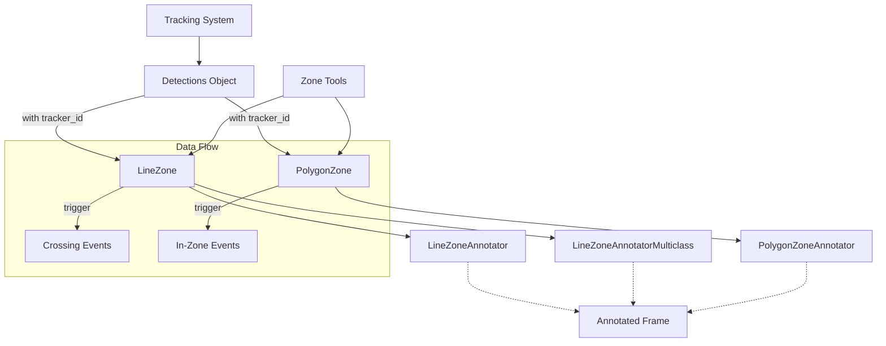
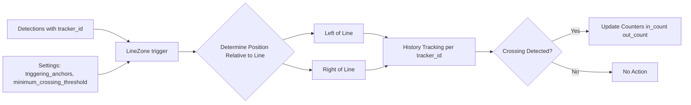
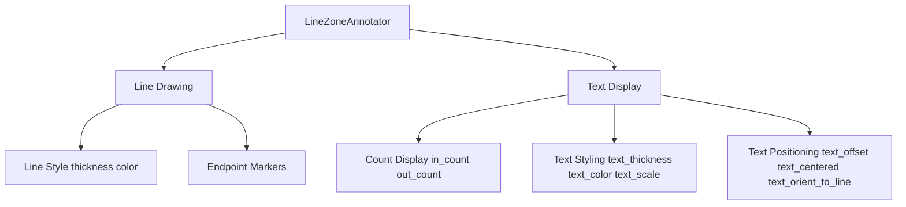
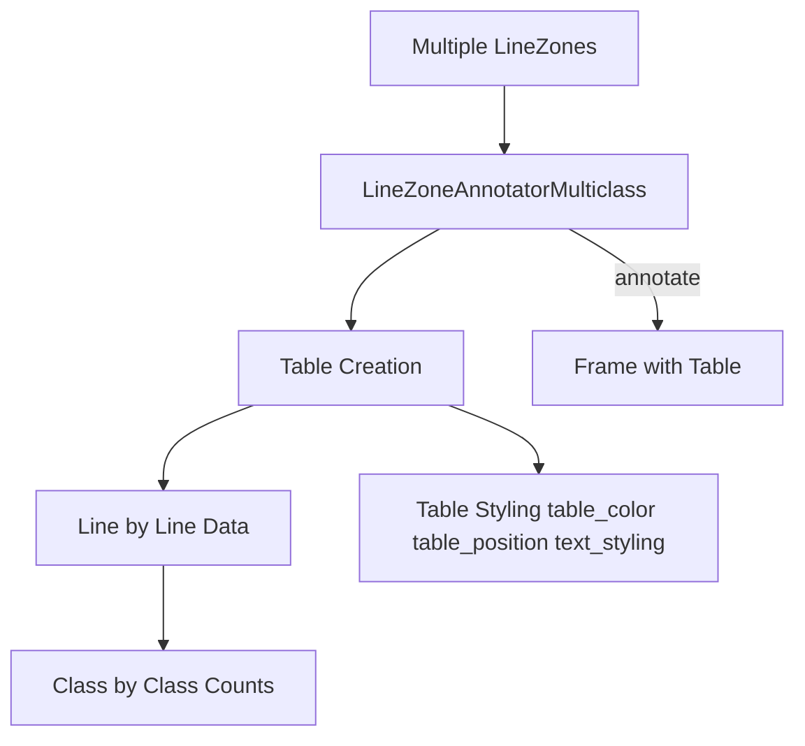
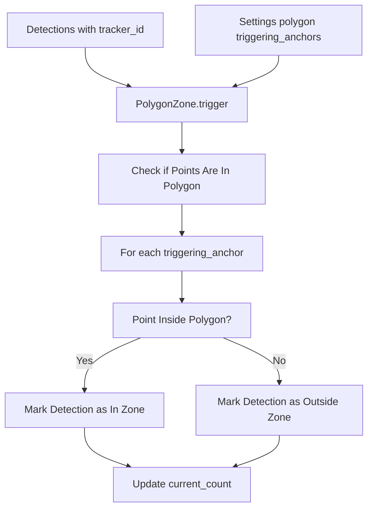
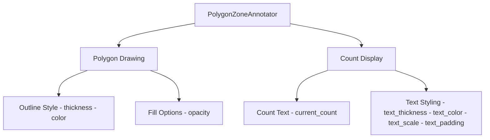
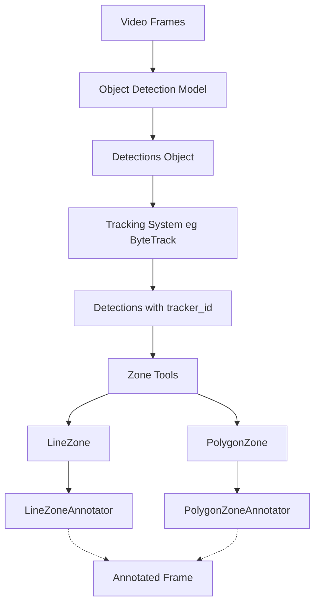

# Zone Tools

Relevant source files

- [docs/detection/tools/smoother.md](https://github.com/roboflow/supervision/blob/1d0747fb/docs/detection/tools/smoother.md)
- [supervision/detection/line_zone.py](https://github.com/roboflow/supervision/blob/1d0747fb/supervision/detection/line_zone.py)
- [supervision/detection/overlap_filter.py](https://github.com/roboflow/supervision/blob/1d0747fb/supervision/detection/overlap_filter.py)
- [supervision/detection/tools/polygon_zone.py](https://github.com/roboflow/supervision/blob/1d0747fb/supervision/detection/tools/polygon_zone.py)
- [supervision/detection/tools/smoother.py](https://github.com/roboflow/supervision/blob/1d0747fb/supervision/detection/tools/smoother.py)
- [supervision/detection/vlm.py](https://github.com/roboflow/supervision/blob/1d0747fb/supervision/detection/vlm.py)
- [supervision/metrics/mean_average_recall.py](https://github.com/roboflow/supervision/blob/1d0747fb/supervision/metrics/mean_average_recall.py)
- [supervision/utils/internal.py](https://github.com/roboflow/supervision/blob/1d0747fb/supervision/utils/internal.py)
- [supervision/validators/__init__.py](https://github.com/roboflow/supervision/blob/1d0747fb/supervision/validators/__init__.py)
- [test/detection/test_csv.py](https://github.com/roboflow/supervision/blob/1d0747fb/test/detection/test_csv.py)
- [test/detection/test_json.py](https://github.com/roboflow/supervision/blob/1d0747fb/test/detection/test_json.py)
- [test/detection/test_line_counter.py](https://github.com/roboflow/supervision/blob/1d0747fb/test/detection/test_line_counter.py)
- [test/detection/test_polygon_zone_annotator.py](https://github.com/roboflow/supervision/blob/1d0747fb/test/detection/test_polygon_zone_annotator.py)
- [test/detection/tools/test_inference_slicer.py](https://github.com/roboflow/supervision/blob/1d0747fb/test/detection/tools/test_inference_slicer.py)
- [test/utils/test_internal.py](https://github.com/roboflow/supervision/blob/1d0747fb/test/utils/test_internal.py)

Zone Tools in Supervision provide utilities for defining regions of interest in images or videos and detecting when objects interact with these regions. These tools are primarily used for counting objects entering, exiting, or contained within specific areas of a frame. The library offers two main types of zones: `LineZone` for counting objects crossing a line, and `PolygonZone` for counting objects within a defined polygon area.

For more general detection capabilities, see [Detection System](https://deepwiki.com/roboflow/supervision/2.1-detection-system). For tracking objects across frames, which is required by Zone Tools, see [Tracking System](https://deepwiki.com/roboflow/supervision/2.4-tracking-system).

## Overview of Zone Tools Architecture




Sources: [supervision/detection/line_zone.py1-860](https://github.com/roboflow/supervision/blob/1d0747fb/supervision/detection/line_zone.py#L1-L860) [supervision/detection/tools/polygon_zone.py1-203](https://github.com/roboflow/supervision/blob/1d0747fb/supervision/detection/tools/polygon_zone.py#L1-L203)

## LineZone

`LineZone` is a utility for counting objects crossing a predefined line in either direction. It's particularly useful for applications like traffic monitoring, people counting at entrances, or tracking movement direction.

### Key Components and Workflow



Sources: [supervision/detection/line_zone.py23-313](https://github.com/roboflow/supervision/blob/1d0747fb/supervision/detection/line_zone.py#L23-L313)

### Core Functionality

The `LineZone` class defines a line with start and end points and counts objects crossing this line in either direction. The key features include:

- Tracks objects by their `tracker_id`, which needs to be provided by a tracking system
- Counts objects crossing from "outside to inside" (`in_count`) and "inside to outside" (`out_count`)
- Maintains separate counts per object class (`in_count_per_class` and `out_count_per_class`)
- Configurable triggering anchors to determine which points of a bounding box are considered for crossing detection
- Adjustable crossing threshold to handle unstable tracking

The main method is `trigger()`, which updates the counters based on new detections.

```
line_zone = LineZone(start=start_point, end=end_point)
crossed_in, crossed_out = line_zone.trigger(detections)
```

Sources: [supervision/detection/line_zone.py128-200](https://github.com/roboflow/supervision/blob/1d0747fb/supervision/detection/line_zone.py#L128-L200)

### Implementation Details

The line zone works by tracking each object's position history relative to the line. When an object's position changes from one side of the line to the other, a crossing is recorded. The line zone uses vector math to determine which side of the line an object is on.

The class has the following important attributes:

- `in_count`: Total number of objects that crossed the line from outside to inside
- `out_count`: Total number of objects that crossed the line from inside to outside
- `in_count_per_class`: Dictionary with counts per class that crossed from outside to inside
- `out_count_per_class`: Dictionary with counts per class that crossed from inside to outside

Sources: [supervision/detection/line_zone.py112-126](https://github.com/roboflow/supervision/blob/1d0747fb/supervision/detection/line_zone.py#L112-L126)

## LineZoneAnnotator

The `LineZoneAnnotator` class visualizes a `LineZone` on an image along with its counts. It provides various styling options to customize the visualization.

### Visualization Options



Sources: [supervision/detection/line_zone.py317-697](https://github.com/roboflow/supervision/blob/1d0747fb/supervision/detection/line_zone.py#L317-L697)

The `LineZoneAnnotator` offers extensive customization:

- Line appearance (thickness, color)
- Text display options (color, thickness, scale)
- Custom labels for in/out counts
- Option to orient text along the line
- Control over text positioning relative to the line

The main method is `annotate()`, which draws the line and counts on a frame.

```
annotator = LineZoneAnnotator(thickness=2, text_scale=0.5)
annotated_frame = annotator.annotate(frame, line_zone)
```

Sources: [supervision/detection/line_zone.py373-440](https://github.com/roboflow/supervision/blob/1d0747fb/supervision/detection/line_zone.py#L373-L440)

## LineZoneAnnotatorMulticlass

For scenarios with multiple classes of objects crossing multiple lines, the `LineZoneAnnotatorMulticlass` provides a tabular display of crossing counts by class.


Sources: [supervision/detection/line_zone.py700-859](https://github.com/roboflow/supervision/blob/1d0747fb/supervision/detection/line_zone.py#L700-L859)

The `LineZoneAnnotatorMulticlass` creates a formatted table showing:

- Counts for each line zone
- Breakdown by in/out direction
- Breakdown by object class
- Positioning options for the table on the frame

Sources: [supervision/detection/line_zone.py756-859](https://github.com/roboflow/supervision/blob/1d0747fb/supervision/detection/line_zone.py#L756-L859)

## PolygonZone

`PolygonZone` defines a polygon-shaped region and detects objects that are within this region. This is useful for applications like area monitoring, restricted zone detection, or counting objects in a specific region.

### Key Components and Workflow


Sources: [supervision/detection/tools/polygon_zone.py16-109](https://github.com/roboflow/supervision/blob/1d0747fb/supervision/detection/tools/polygon_zone.py#L16-L109)

### Core Functionality

The `PolygonZone` class defines a polygon by its vertices and detects when objects are inside this region. Key features include:

- Detection based on configurable anchor points of the bounding box
- Maintains a `current_count` of objects inside the zone
- Provides a boolean mask indicating which detections are in the zone

The main method is `trigger()`, which determines which detections are inside the polygon and returns a boolean array.

```
polygon_zone = PolygonZone(polygon=polygon_vertices)
is_in_zone = polygon_zone.trigger(detections)
```

Sources: [supervision/detection/tools/polygon_zone.py77-109](https://github.com/roboflow/supervision/blob/1d0747fb/supervision/detection/tools/polygon_zone.py#L77-L109)

## PolygonZoneAnnotator

The `PolygonZoneAnnotator` visualizes a `PolygonZone` on an image along with the count of objects inside.

### Visualization Options


Sources: [supervision/detection/tools/polygon_zone.py112-202](https://github.com/roboflow/supervision/blob/1d0747fb/supervision/detection/tools/polygon_zone.py#L112-L202)

The `PolygonZoneAnnotator` offers customization for:

- Polygon outline (thickness, color)
- Optional fill with adjustable opacity
- Text display for the count (color, thickness, scale)
- Option to hide the count display

The main method is `annotate()`, which draws the polygon and count on a frame.

```
annotator = PolygonZoneAnnotator(zone=polygon_zone, color=color, thickness=2)
annotated_frame = annotator.annotate(scene=frame)
```

Sources: [supervision/detection/tools/polygon_zone.py156-202](https://github.com/roboflow/supervision/blob/1d0747fb/supervision/detection/tools/polygon_zone.py#L156-L202)

## Integration with Tracking

Both zone types require objects to have a `tracker_id` field, which means they must be integrated with a tracking system.



Sources: [supervision/detection/line_zone.py148-155](https://github.com/roboflow/supervision/blob/1d0747fb/supervision/detection/line_zone.py#L148-L155) [supervision/detection/tools/polygon_zone.py21-24](https://github.com/roboflow/supervision/blob/1d0747fb/supervision/detection/tools/polygon_zone.py#L21-L24)

### Example Integration

A typical workflow involves:

1. Getting frames from a video source
2. Running an object detection model to get detections
3. Processing detections through a tracker to get `tracker_id`
4. Passing the tracked detections to a zone tool
5. Visualizing the results with the corresponding annotator

Both zone types emit warnings if `tracker_id` is missing, reminding users to add tracking to their pipeline.

Sources: [supervision/detection/line_zone.py148-155](https://github.com/roboflow/supervision/blob/1d0747fb/supervision/detection/line_zone.py#L148-L155) [supervision/utils/internal.py7-18](https://github.com/roboflow/supervision/blob/1d0747fb/supervision/utils/internal.py#L7-L18)

## Use Cases

Common applications for Zone Tools include:

- **Traffic Analysis**: Count vehicles crossing intersection lines
- **Retail Analytics**: Track customer movement in/out of store areas
- **Security Monitoring**: Detect intrusions in restricted zones
- **Flow Analysis**: Measure directional movement through passages
- **Queue Monitoring**: Count people in defined waiting areas

Both zone tools support multiclass counts, making them useful for applications where distinguishing between different types of objects is important (e.g., cars vs. trucks vs. pedestrians).

Sources: [supervision/detection/line_zone.py40-69](https://github.com/roboflow/supervision/blob/1d0747fb/supervision/detection/line_zone.py#L40-L69) [supervision/detection/tools/polygon_zone.py27-56](https://github.com/roboflow/supervision/blob/1d0747fb/supervision/detection/tools/polygon_zone.py#L27-L56)