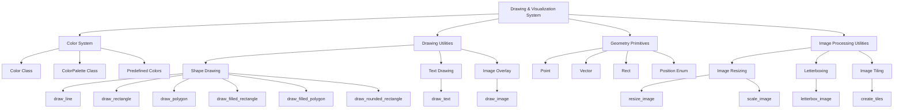
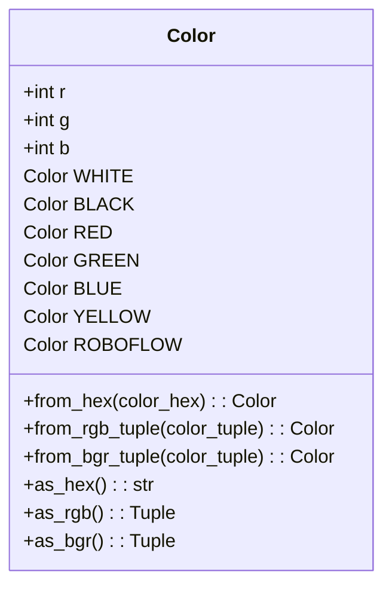
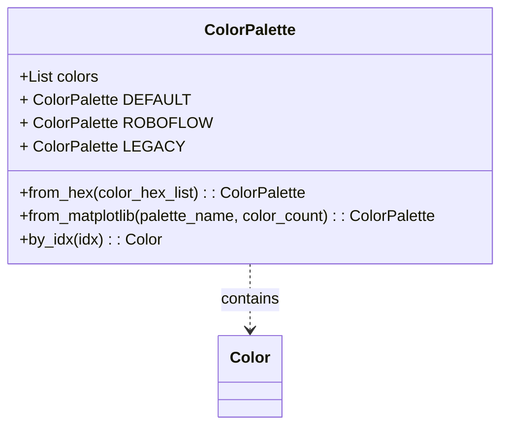
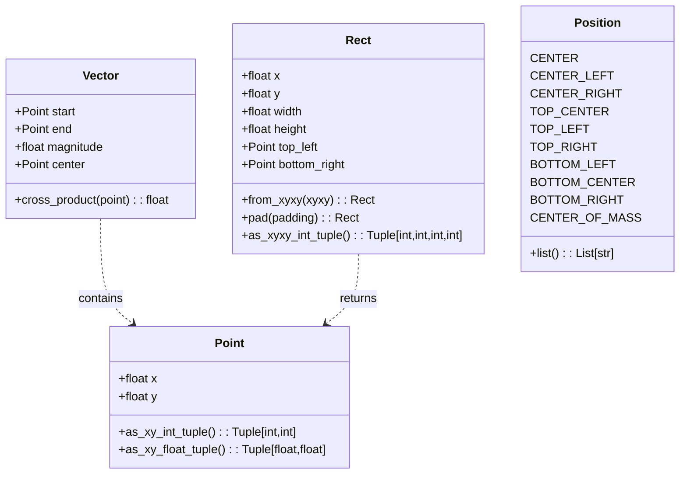
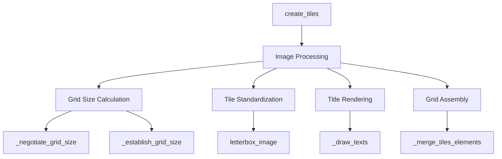
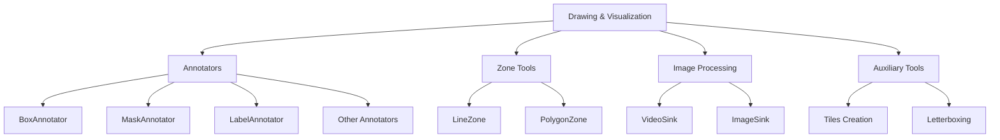

# Drawing & Visualization

Relevant source files

- [supervision/draw/color.py](https://github.com/roboflow/supervision/blob/1d0747fb/supervision/draw/color.py)
- [supervision/draw/utils.py](https://github.com/roboflow/supervision/blob/1d0747fb/supervision/draw/utils.py)
- [supervision/geometry/core.py](https://github.com/roboflow/supervision/blob/1d0747fb/supervision/geometry/core.py)
- [supervision/utils/image.py](https://github.com/roboflow/supervision/blob/1d0747fb/supervision/utils/image.py)
- [test/draw/test_color.py](https://github.com/roboflow/supervision/blob/1d0747fb/test/draw/test_color.py)
- [test/geometry/test_core.py](https://github.com/roboflow/supervision/blob/1d0747fb/test/geometry/test_core.py)
- [test/utils/test_conversion.py](https://github.com/roboflow/supervision/blob/1d0747fb/test/utils/test_conversion.py)
- [test/utils/test_image.py](https://github.com/roboflow/supervision/blob/1d0747fb/test/utils/test_image.py)

The Drawing & Visualization system in Supervision provides a comprehensive set of utilities for drawing shapes, text, and images on computer vision data. This page documents the core drawing utilities and color management system that form the foundation for more complex visualization operations throughout the library.

For information about annotation systems that use these drawing utilities, see [Annotation System](https://deepwiki.com/roboflow/supervision/2.2-annotation-system). For zone tools that leverage drawing capabilities, see [Zone Tools](https://deepwiki.com/roboflow/supervision/3.1-zone-tools).

## 1. System Overview

The Drawing & Visualization system consists of several interconnected components that enable visualization of computer vision data:


Sources: [supervision/draw/utils.py1-374](https://github.com/roboflow/supervision/blob/1d0747fb/supervision/draw/utils.py#L1-L374) [supervision/draw/color.py1-424](https://github.com/roboflow/supervision/blob/1d0747fb/supervision/draw/color.py#L1-L424) [supervision/geometry/core.py1-129](https://github.com/roboflow/supervision/blob/1d0747fb/supervision/geometry/core.py#L1-L129) [supervision/utils/image.py1-789](https://github.com/roboflow/supervision/blob/1d0747fb/supervision/utils/image.py#L1-L789)

## 2. Color System

The color system provides a consistent way to represent and manipulate colors across the library.

### 2.1 Color Class

The `Color` class is the foundation of the color system, supporting various color formats and conversions.


Sources: [supervision/draw/color.py65-267](https://github.com/roboflow/supervision/blob/1d0747fb/supervision/draw/color.py#L65-L267)

#### Predefined Colors

The `Color` class provides several predefined color constants:

|Constant|Hex Code|RGB Value|
|---|---|---|
|WHITE|#FFFFFF|(255, 255, 255)|
|BLACK|#000000|(0, 0, 0)|
|RED|#FF0000|(255, 0, 0)|
|GREEN|#00FF00|(0, 255, 0)|
|BLUE|#0000FF|(0, 0, 255)|
|YELLOW|#FFFF00|(255, 255, 0)|
|ROBOFLOW|#A351FB|(163, 81, 251)|

Sources: [supervision/draw/color.py230-256](https://github.com/roboflow/supervision/blob/1d0747fb/supervision/draw/color.py#L230-L256)

### 2.2 ColorPalette Class

The `ColorPalette` class manages collections of colors and provides methods to create color palettes from various sources.



Sources: [supervision/draw/color.py270-423](https://github.com/roboflow/supervision/blob/1d0747fb/supervision/draw/color.py#L270-L423)

## 3. Geometry Primitives

The geometry primitives provide the foundational structures for specifying positions, points, vectors, and rectangles in the drawing system.



Sources: [supervision/geometry/core.py1-129](https://github.com/roboflow/supervision/blob/1d0747fb/supervision/geometry/core.py#L1-L129)

## 4. Drawing Utilities

The drawing utilities provide a comprehensive set of functions for drawing various shapes, text, and images on a scene.

### 4.1 Shape Drawing Functions

The following functions are available for drawing shapes:

|Function|Description|
|---|---|
|`draw_line`|Draws a line between two points|
|`draw_rectangle`|Draws a rectangle outline|
|`draw_filled_rectangle`|Draws a filled rectangle with optional opacity|
|`draw_rounded_rectangle`|Draws a rectangle with rounded corners|
|`draw_polygon`|Draws a polygon outline|
|`draw_filled_polygon`|Draws a filled polygon with optional opacity|

All shape drawing functions accept a `Color` object or RGB/BGR tuple to specify the color.

Sources: [supervision/draw/utils.py11-206](https://github.com/roboflow/supervision/blob/1d0747fb/supervision/draw/utils.py#L11-L206)

### 4.2 Text Drawing

The `draw_text` function provides comprehensive text rendering with options for positioning, font, size, color, and background.

```
draw_text(
    scene,               # Image to draw on (np.ndarray)
    text,                # Text string to draw
    text_anchor,         # Position (Point object)
    text_color,          # Text color (Color object)
    text_scale,          # Text scale factor
    text_thickness,      # Text thickness
    text_padding,        # Padding around text
    text_font,           # Font (cv2 font constant)
    background_color     # Optional background color
)
```

Sources: [supervision/draw/utils.py209-281](https://github.com/roboflow/supervision/blob/1d0747fb/supervision/draw/utils.py#L209-L281)

### 4.3 Image Overlay

The `draw_image` function allows overlaying one image onto another at a specified position with controlled opacity.

```
draw_image(
    scene,               # Background image (np.ndarray)
    image,               # Image to overlay (np.ndarray or path)
    opacity,             # Opacity of overlaid image (0.0-1.0)
    rect                 # Position and size (Rect object)
)
```

Sources: [supervision/draw/utils.py284-343](https://github.com/roboflow/supervision/blob/1d0747fb/supervision/draw/utils.py#L284-L343)

### 4.4 Automatic Scaling Helpers

Helper functions to calculate optimal text scale and line thickness based on image resolution:

```
calculate_optimal_text_scale(resolution_wh)  # Returns font scale based on image resolution
calculate_optimal_line_thickness(resolution_wh)  # Returns line thickness based on resolution
```

Sources: [supervision/draw/utils.py346-373](https://github.com/roboflow/supervision/blob/1d0747fb/supervision/draw/utils.py#L346-L373)

## 5. Image Processing Utilities

The image processing utilities complement the drawing functionalities by providing methods to manipulate images before or after visualization.

### 5.1 Basic Image Manipulation

The following functions provide core image manipulation capabilities:

|Function|Description|
|---|---|
|`crop_image`|Crops an image based on a bounding box|
|`scale_image`|Scales an image by a factor|
|`resize_image`|Resizes an image to a specified resolution|
|`letterbox_image`|Resizes and pads an image maintaining aspect ratio|
|`overlay_image`|Places one image onto another at a specified location|

Sources: [supervision/utils/image.py28-368](https://github.com/roboflow/supervision/blob/1d0747fb/supervision/utils/image.py#L28-L368)

### 5.2 Image Tiling

The `create_tiles` function creates a grid of images with optional titles and customizable layout.



Sources: [supervision/utils/image.py437-579](https://github.com/roboflow/supervision/blob/1d0747fb/supervision/utils/image.py#L437-L579)

## 6. Integration with Other Supervision Components

The Drawing & Visualization system serves as a foundation for other components in the Supervision library, particularly the Annotation System and Zone Tools.


Sources: [supervision/draw/utils.py1-374](https://github.com/roboflow/supervision/blob/1d0747fb/supervision/draw/utils.py#L1-L374) [supervision/utils/image.py1-789](https://github.com/roboflow/supervision/blob/1d0747fb/supervision/utils/image.py#L1-L789)

## 7. Common Usage Patterns

### 7.1 Drawing Shapes on Images

Drawing shapes on images is a fundamental operation in computer vision visualization:

```
import supervision as sv
import numpy as np
import cv2

# Create a blank image
image = np.zeros((480, 640, 3), dtype=np.uint8)

# Draw a rectangle
rect = sv.Rect(x=100, y=100, width=200, height=150)
image = sv.draw_rectangle(scene=image, rect=rect, color=sv.Color.RED)

# Draw a filled rectangle with opacity
image = sv.draw_filled_rectangle(
    scene=image, 
    rect=rect, 
    color=sv.Color.BLUE, 
    opacity=0.5
)

# Draw text
text_anchor = sv.Point(x=200, y=200)
image = sv.draw_text(
    scene=image,
    text="Object Detected",
    text_anchor=text_anchor,
    text_color=sv.Color.WHITE,
    background_color=sv.Color.BLACK
)
```

Sources: [supervision/draw/utils.py11-281](https://github.com/roboflow/supervision/blob/1d0747fb/supervision/draw/utils.py#L11-L281)

### 7.2 Creating Image Tiles

Creating a grid of images with titles is useful for comparing model outputs or visualizing different processing stages:

```
import supervision as sv
import cv2

# Load multiple images
image1 = cv2.imread("image1.jpg")
image2 = cv2.imread("image2.jpg")
image3 = cv2.imread("image3.jpg")
image4 = cv2.imread("image4.jpg")

# Create image tiles
tiles = sv.create_tiles(
    images=[image1, image2, image3, image4],
    titles=["Original", "Processed", "Detected", "Segmented"],
    grid_size=(2, 2),  # 2 rows, 2 columns
)

# Save or display the result
cv2.imwrite("comparison.jpg", tiles)
```

Sources: [supervision/utils/image.py437-579](https://github.com/roboflow/supervision/blob/1d0747fb/supervision/utils/image.py#L437-L579)

### 7.3 Working with Colors and Palettes

Using color palettes to create visually distinct visualizations:

```
import supervision as sv
import numpy as np

# Use a predefined palette
palette = sv.ColorPalette.DEFAULT

# Create a custom palette from hex colors
custom_palette = sv.ColorPalette.from_hex(["#FF0000", "#00FF00", "#0000FF"])

# Get a color for a specific class ID
class_id = 3
color = palette.by_idx(class_id)

# Create a new blank image
image = np.zeros((480, 640, 3), dtype=np.uint8)

# Draw shapes with the color
rect = sv.Rect(x=100, y=100, width=200, height=150)
image = sv.draw_rectangle(scene=image, rect=rect, color=color)
```

Sources: [supervision/draw/color.py65-408](https://github.com/roboflow/supervision/blob/1d0747fb/supervision/draw/color.py#L65-L408)

## Summary

The Drawing & Visualization system provides the foundation for all visual elements in the Supervision library. With a comprehensive set of drawing utilities, color management, and image processing functions, it enables the creation of sophisticated visualizations for computer vision applications.