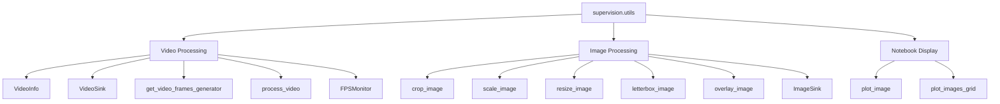
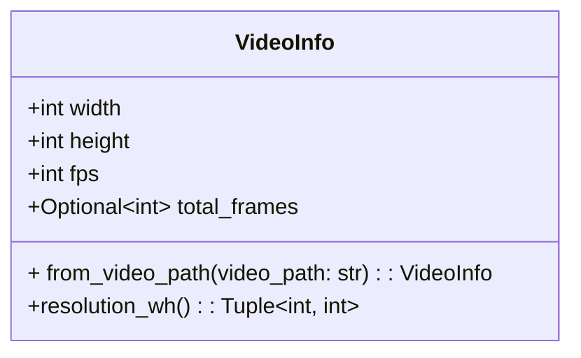
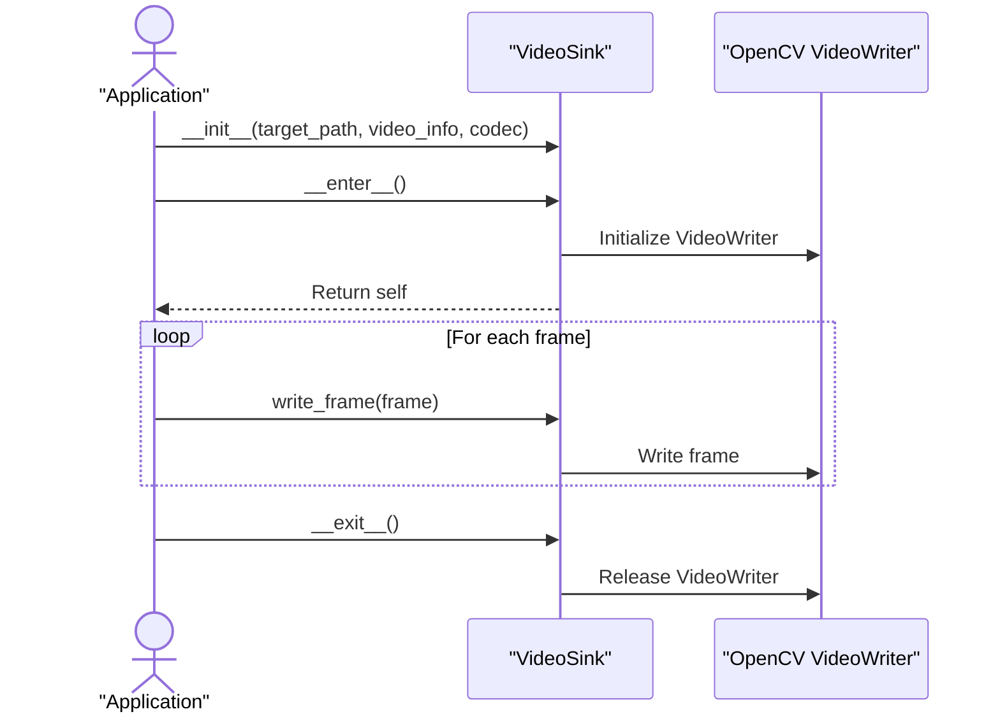
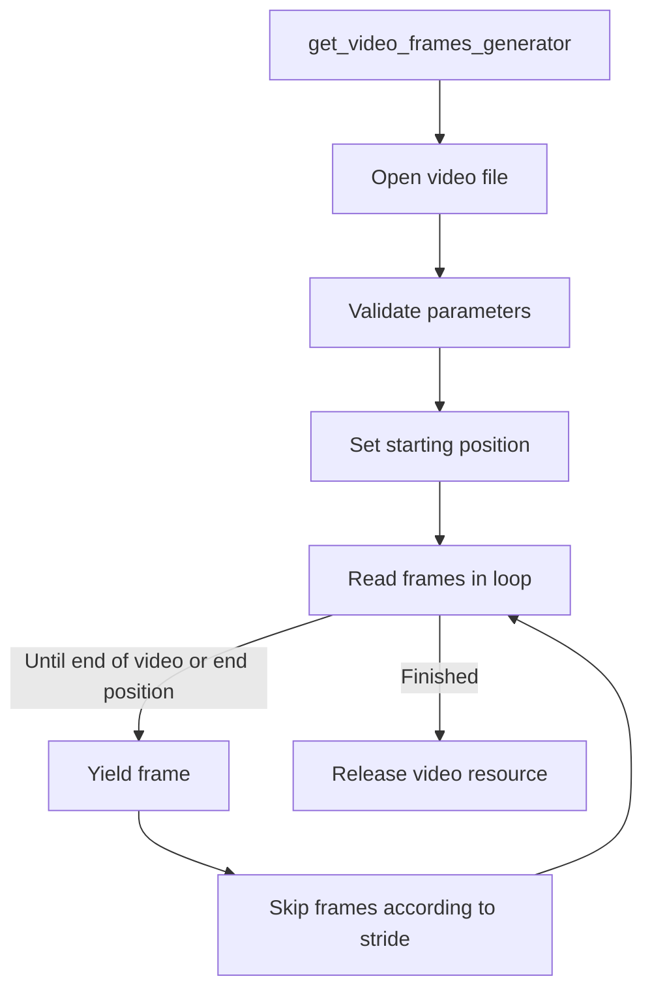
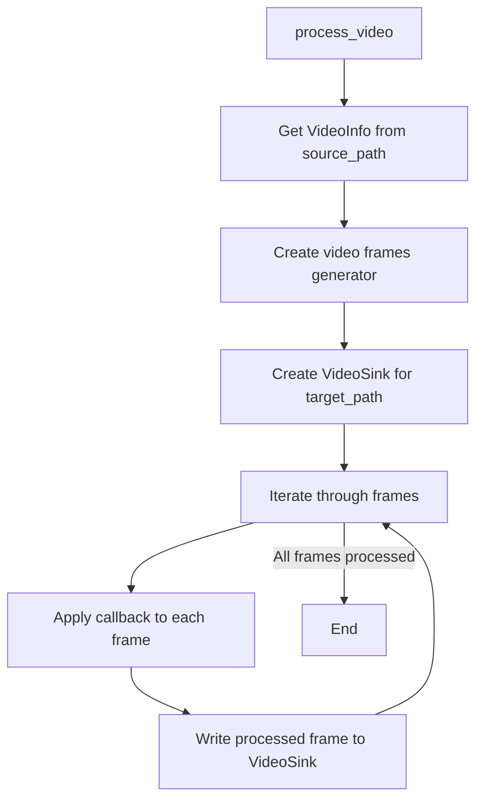
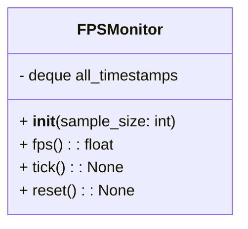
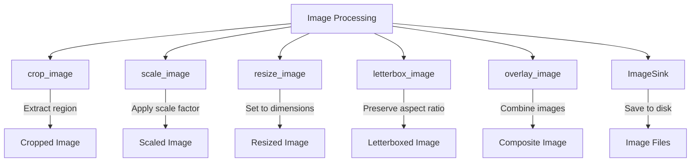
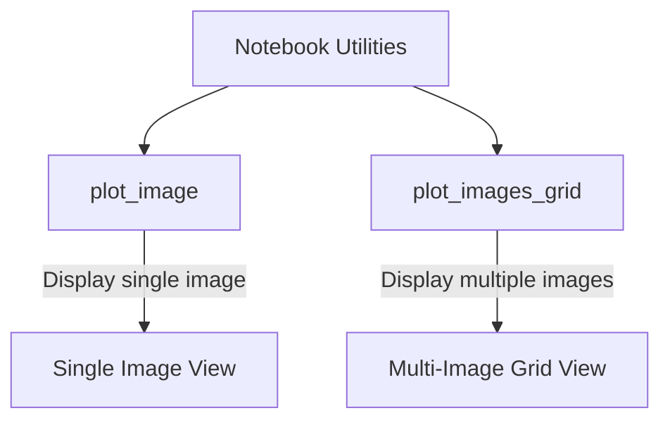
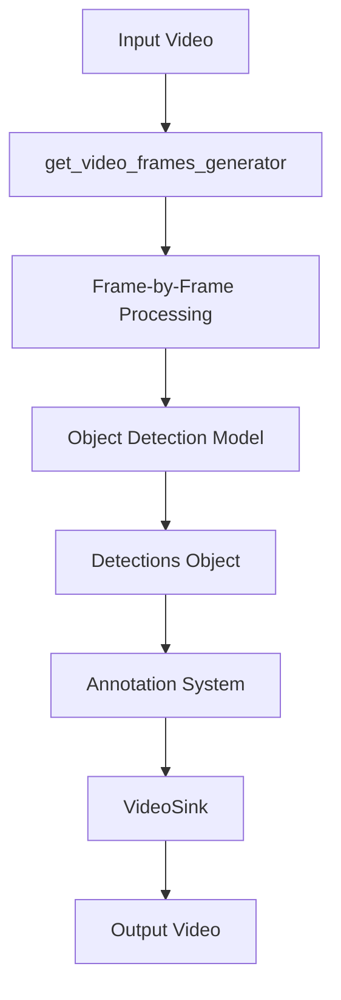
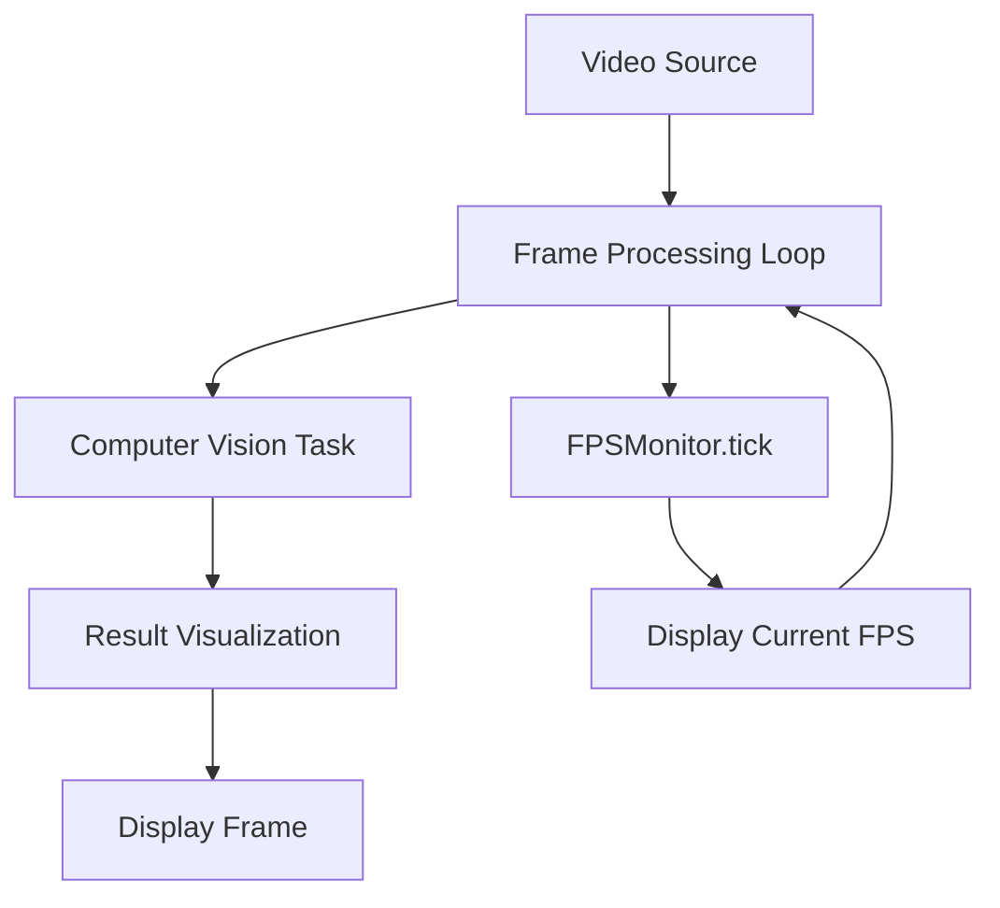

# Video & Image Processing

Relevant source files

- [docs/utils/file.md](https://github.com/roboflow/supervision/blob/1d0747fb/docs/utils/file.md)
- [docs/utils/image.md](https://github.com/roboflow/supervision/blob/1d0747fb/docs/utils/image.md)
- [docs/utils/notebook.md](https://github.com/roboflow/supervision/blob/1d0747fb/docs/utils/notebook.md)
- [docs/utils/video.md](https://github.com/roboflow/supervision/blob/1d0747fb/docs/utils/video.md)
- [supervision/utils/video.py](https://github.com/roboflow/supervision/blob/1d0747fb/supervision/utils/video.py)

This document covers the video and image processing utilities provided by the Supervision library. These utilities help developers efficiently work with multimedia data for computer vision tasks, offering streamlined methods for reading, transforming, processing, and saving video and image content.

For information about file operations and asset handling, see [File & Asset Management](https://deepwiki.com/roboflow/supervision/3.4-file-and-asset-management).

## Overview

The Video & Image Processing utilities in Supervision provide core functionality for handling multimedia data that serves as a foundation for computer vision pipelines. These utilities are designed to work seamlessly with other components in the Supervision ecosystem.



Sources: [supervision/utils/video.py](https://github.com/roboflow/supervision/blob/1d0747fb/supervision/utils/video.py) [docs/utils/image.md](https://github.com/roboflow/supervision/blob/1d0747fb/docs/utils/image.md) [docs/utils/notebook.md](https://github.com/roboflow/supervision/blob/1d0747fb/docs/utils/notebook.md)

## Video Processing

### VideoInfo

The `VideoInfo` class stores essential metadata about a video file, including dimensions, frame rate, and total frame count.


Example usage:

```
import supervision as sv

video_info = sv.VideoInfo.from_video_path(video_path="input.mp4")
print(f"Video dimensions: {video_info.width}x{video_info.height}")
print(f"Frame rate: {video_info.fps} fps")
print(f"Total frames: {video_info.total_frames}")
```

Sources: [supervision/utils/video.py13-60](https://github.com/roboflow/supervision/blob/1d0747fb/supervision/utils/video.py#L13-L60)


### VideoSink

The `VideoSink` class provides a context manager for saving video frames to a file using OpenCV's VideoWriter.



Example usage:

```
import supervision as sv
import numpy as np

video_info = sv.VideoInfo(width=1920, height=1080, fps=30)

with sv.VideoSink(target_path="output.mp4", video_info=video_info) as sink:
    for i in range(100):
        # Create an example frame
        frame = np.zeros((1080, 1920, 3), dtype=np.uint8)
        # Write the frame to the output video
        sink.write_frame(frame=frame)
```

Sources: [supervision/utils/video.py63-118](https://github.com/roboflow/supervision/blob/1d0747fb/supervision/utils/video.py#L63-L118)

### Frame Generation

The `get_video_frames_generator` function creates a generator that yields frames from a video file, with support for specifying start position, end position, and stride.




Example usage:

```
import supervision as sv

# Generate frames from a video file
frames_generator = sv.get_video_frames_generator(
    source_path="input.mp4",
    stride=1,        # Process every frame
    start=0,         # Start from the beginning
    end=None,        # Process until the end
    iterative_seek=False  # Use direct seeking (faster)
)

# Process each frame
for frame in frames_generator:
    # Your processing code here
    processed_frame = frame.copy()
```

Sources: [supervision/utils/video.py144-192](https://github.com/roboflow/supervision/blob/1d0747fb/supervision/utils/video.py#L144-L192) [supervision/utils/video.py120-142](https://github.com/roboflow/supervision/blob/1d0747fb/supervision/utils/video.py#L120-L142)

### Video Processing Pipeline

The `process_video` function combines frame generation and saving into a streamlined pipeline, applying a user-defined callback to each frame.




Example usage:

```
import supervision as sv
import cv2

# Define a callback function to process each frame
def process_frame(frame, index):
    # Add a frame counter text
    cv2.putText(
        frame, 
        f"Frame: {index}", 
        (50, 50), 
        cv2.FONT_HERSHEY_SIMPLEX, 
        1, 
        (0, 255, 0), 
        2
    )
    return frame

# Process a video file
sv.process_video(
    source_path="input.mp4",
    target_path="output.mp4",
    callback=process_frame,
    show_progress=True,
    progress_message="Processing video"
)
```

Sources: [supervision/utils/video.py195-257](https://github.com/roboflow/supervision/blob/1d0747fb/supervision/utils/video.py#L195-L257)

### Performance Monitoring

The `FPSMonitor` class helps monitor processing performance by tracking frames per second.



Example usage:

```
import supervision as sv
import time
import cv2

frames_generator = sv.get_video_frames_generator(source_path="input.mp4")
fps_monitor = sv.FPSMonitor(sample_size=30)

for frame in frames_generator:
    # Process the frame
    processed_frame = cv2.cvtColor(frame, cv2.COLOR_BGR2GRAY)
    
    # Record a timestamp after processing
    fps_monitor.tick()
    
    # Display current FPS
    print(f"Current FPS: {fps_monitor.fps:.2f}")
```

Sources: [supervision/utils/video.py260-309](https://github.com/roboflow/supervision/blob/1d0747fb/supervision/utils/video.py#L260-L309)

## Image Processing

The Supervision library provides several utilities for image manipulation, transformation, and saving.




These utilities include:

- `crop_image`: Extract a specific region from an image
- `scale_image`: Resize an image using a scaling factor
- `resize_image`: Resize an image to specific dimensions
- `letterbox_image`: Resize while preserving aspect ratio (adding padding if necessary)
- `overlay_image`: Superimpose one image onto another
- `ImageSink`: Save images to disk with a consistent interface

Sources: [docs/utils/image.md](https://github.com/roboflow/supervision/blob/1d0747fb/docs/utils/image.md)

## Notebook Display Utilities

For visualization in Jupyter notebooks, Supervision provides display utilities that make it easy to view images during development and experimentation.




These include:

- `plot_image`: Display a single image with customizable size
- `plot_images_grid`: Display multiple images in a customizable grid layout with optional titles

Sources: [docs/utils/notebook.md](https://github.com/roboflow/supervision/blob/1d0747fb/docs/utils/notebook.md)

## Integration with Computer Vision Workflows

The Video & Image Processing utilities integrate with other Supervision components to form complete computer vision pipelines.

### Object Detection Pipeline

A typical object detection workflow combining video processing with detection and visualization:




Example:

```
import supervision as sv
from ultralytics import YOLO

# Load a pre-trained model
model = YOLO("yolov8n.pt")

# Define a frame processor
def process_frame(frame, index):
    # Run inference
    results = model(frame)[0]
    
    # Convert results to Supervision format
    detections = sv.Detections.from_ultralytics(results)
    
    # Annotate the frame
    box_annotator = sv.BoxAnnotator()
    annotated_frame = box_annotator.annotate(frame.copy(), detections)
    
    return annotated_frame

# Process the video
sv.process_video(
    source_path="input.mp4",
    target_path="output.mp4",
    callback=process_frame,
    show_progress=True
)
```

Sources: [supervision/utils/video.py144-192](https://github.com/roboflow/supervision/blob/1d0747fb/supervision/utils/video.py#L144-L192) [supervision/utils/video.py195-257](https://github.com/roboflow/supervision/blob/1d0747fb/supervision/utils/video.py#L195-L257)

### Real-time Processing with Performance Monitoring

For real-time applications, combining frame processing with FPS monitoring:




Example:

```
import supervision as sv
import cv2
from ultralytics import YOLO

# Initialize components
model = YOLO("yolov8n.pt")
fps_monitor = sv.FPSMonitor(sample_size=30)
box_annotator = sv.BoxAnnotator()

# Open a video source
cap = cv2.VideoCapture("input.mp4")  # or 0 for webcam

while True:
    # Read a frame
    success, frame = cap.read()
    if not success:
        break
    
    # Process the frame
    results = model(frame)[0]
    detections = sv.Detections.from_ultralytics(results)
    annotated_frame = box_annotator.annotate(frame.copy(), detections)
    
    # Monitor FPS
    fps_monitor.tick()
    cv2.putText(
        annotated_frame,
        f"FPS: {fps_monitor.fps:.1f}",
        (20, 40),
        cv2.FONT_HERSHEY_SIMPLEX,
        1,
        (0, 255, 0),
        2
    )
    
    # Display the result
    cv2.imshow("Detection", annotated_frame)
    if cv2.waitKey(1) & 0xFF == ord('q'):
        break

# Release resources
cap.release()
cv2.destroyAllWindows()
```

Sources: [supervision/utils/video.py260-309](https://github.com/roboflow/supervision/blob/1d0747fb/supervision/utils/video.py#L260-L309)

## Summary

The Video & Image Processing utilities in Supervision provide essential functionality for handling multimedia data in computer vision applications. They allow developers to:

1. Extract information from video files with `VideoInfo`
2. Generate video frames efficiently with `get_video_frames_generator`
3. Save processed frames with `VideoSink`
4. Apply transformations to entire videos with `process_video`
5. Monitor performance with `FPSMonitor`
6. Manipulate images with various transformation functions
7. Visualize results in Jupyter notebooks

These utilities form the backbone of many computer vision workflows, handling the input/output operations and transformations that allow the core computer vision algorithms to focus on their specialized tasks.