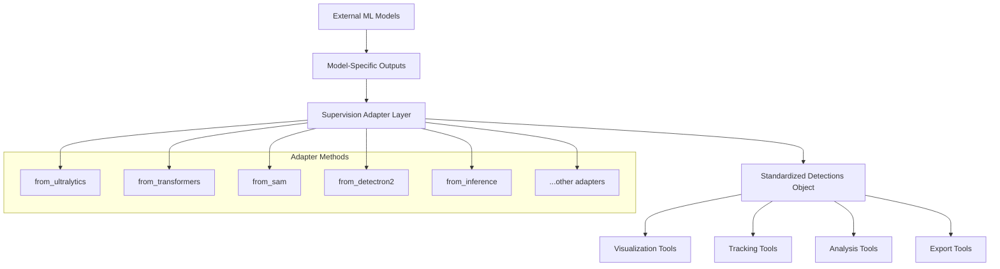
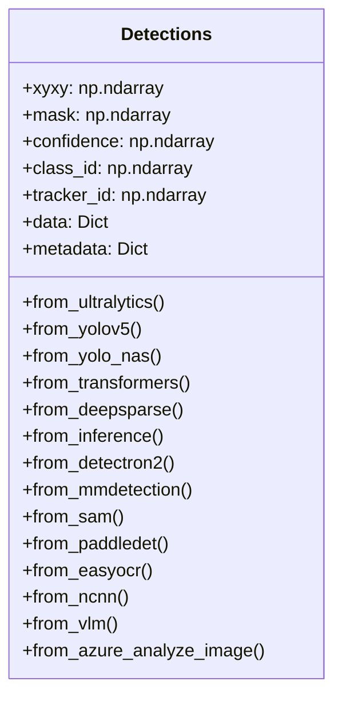
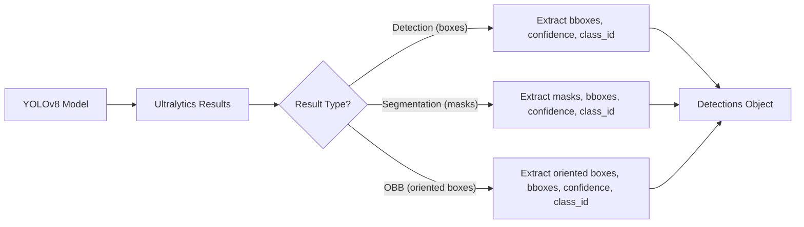
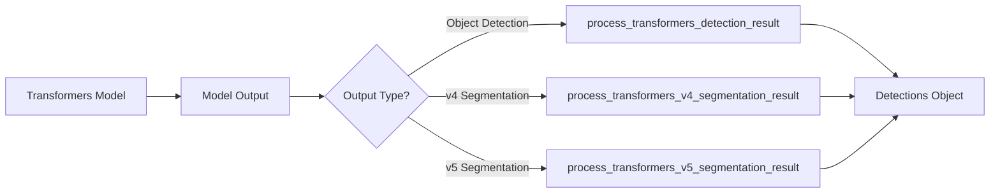
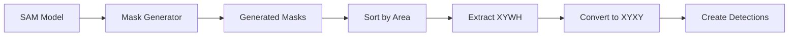
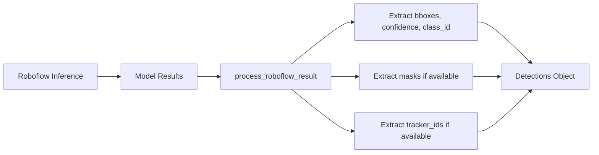
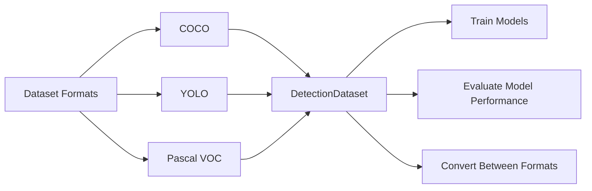
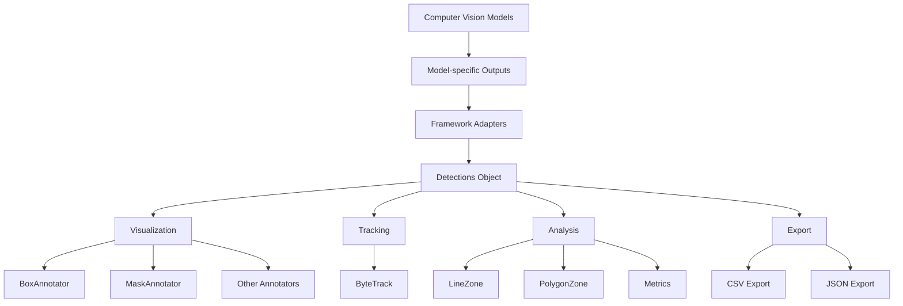

# Framework Integration

Relevant source files

- [docs/changelog.md](https://github.com/roboflow/supervision/blob/1d0747fb/docs/changelog.md)
- [docs/deprecated.md](https://github.com/roboflow/supervision/blob/1d0747fb/docs/deprecated.md)
- [docs/detection/annotators.md](https://github.com/roboflow/supervision/blob/1d0747fb/docs/detection/annotators.md)
- [supervision/detection/core.py](https://github.com/roboflow/supervision/blob/1d0747fb/supervision/detection/core.py)
- [supervision/detection/tools/transformers.py](https://github.com/roboflow/supervision/blob/1d0747fb/supervision/detection/tools/transformers.py)
- [supervision/detection/utils.py](https://github.com/roboflow/supervision/blob/1d0747fb/supervision/detection/utils.py)
- [test/detection/test_core.py](https://github.com/roboflow/supervision/blob/1d0747fb/test/detection/test_core.py)
- [test/detection/test_utils.py](https://github.com/roboflow/supervision/blob/1d0747fb/test/detection/test_utils.py)

Supervision's framework integration system provides a unified interface for working with various machine learning frameworks in computer vision. It allows standardizing outputs from different model architectures into a consistent format (`Detections`), enabling seamless integration with Supervision's visualization, tracking, and analysis tools.

This page covers the architecture of Supervision's framework integration, details of supported ML frameworks, and how to use the adapter methods to convert model outputs into the standardized `Detections` format.

## Framework Integration Architecture

Supervision uses an adapter pattern to convert outputs from different ML frameworks into a standardized `Detections` object. This architecture allows for consistent processing regardless of the underlying model framework.

### High-level Architecture Diagram


Sources: [supervision/detection/core.py234-1007](https://github.com/roboflow/supervision/blob/1d0747fb/supervision/detection/core.py#L234-L1007)

### Detections Adapter Pattern


Sources: [supervision/detection/core.py49-144](https://github.com/roboflow/supervision/blob/1d0747fb/supervision/detection/core.py#L49-L144)

## Supported ML Frameworks

Supervision integrates with many popular ML frameworks through the `Detections` class adapters:

|Framework|Adapter Method|Description|
|---|---|---|
|Ultralytics YOLO|`from_ultralytics`|Supports YOLOv8 detection, segmentation, and OBB models|
|Hugging Face Transformers|`from_transformers`|Supports various detection and segmentation Transformer models|
|Segment Anything Model|`from_sam`|Converts SAM's mask outputs to Detections format|
|Detectron2|`from_detectron2`|Integrates with Facebook's Detectron2 models|
|Roboflow|`from_inference`|Supports the Roboflow Inference API and package|
|MMDetection|`from_mmdetection`|Works with OpenMMLab's detection models|
|YOLOv5|`from_yolov5`|Legacy support for YOLOv5 models|
|YOLO-NAS|`from_yolo_nas`|Supports YOLO-NAS architecture|
|TensorFlow|`from_tensorflow`|Handles TensorFlow Hub model outputs|
|PaddleDetection|`from_paddledet`|Works with Baidu's PaddlePaddle detection models|
|DeepSparse|`from_deepsparse`|Integrates with Neural Magic's inference engine|
|Azure|`from_azure_analyze_image`|Supports Microsoft Azure's Image Analysis 4.0|
|Vision Language Models|`from_vlm`|Handles outputs from multimodal models like Florence-2 or PaLi-Gemma|
|EasyOCR|`from_easyocr`|Converts OCR text detection results|
|NCNN|`from_ncnn`|Supports Tencent's NCNN inference framework|

Sources: [supervision/detection/core.py201-1007](https://github.com/roboflow/supervision/blob/1d0747fb/supervision/detection/core.py#L201-L1007)

## Framework-Specific Integration Details

### Ultralytics Integration

The `from_ultralytics` method handles outputs from YOLOv8 models, supporting detection, segmentation, and oriented bounding box (OBB) results.


Sources: [supervision/detection/core.py234-302](https://github.com/roboflow/supervision/blob/1d0747fb/supervision/detection/core.py#L234-L302)

### Transformers Integration

The `from_transformers` method processes outputs from Hugging Face Transformers models, supporting both detection and segmentation outputs in v4 and v5 formats.


Sources: [supervision/detection/core.py458-534](https://github.com/roboflow/supervision/blob/1d0747fb/supervision/detection/core.py#L458-L534) [supervision/detection/tools/transformers.py11-247](https://github.com/roboflow/supervision/blob/1d0747fb/supervision/detection/tools/transformers.py#L11-L247)

### Segment Anything Model (SAM) Integration

The `from_sam` method converts mask outputs from Facebook's Segment Anything Model into the standardized Detections format.


Sources: [supervision/detection/core.py635-673](https://github.com/roboflow/supervision/blob/1d0747fb/supervision/detection/core.py#L635-L673)

### Roboflow Inference Integration

The `from_inference` method handles results from both the Roboflow API and the Inference package, supporting detection, segmentation, and tracking outputs.


Sources: [supervision/detection/core.py582-631](https://github.com/roboflow/supervision/blob/1d0747fb/supervision/detection/core.py#L582-L631) [supervision/detection/utils.py588-656](https://github.com/roboflow/supervision/blob/1d0747fb/supervision/detection/utils.py#L588-L656)

## Dataset Format Converters

While not directly part of the model integration, Supervision also provides converters between common dataset formats, which complements the framework integration system:



For more information on dataset management, see [Dataset Management](https://deepwiki.com/roboflow/supervision/2.3-dataset-management).

## Using Framework Integration

### Common Pattern

Most framework integrations follow a similar pattern:

1. Import Supervision and the ML framework
2. Load your model
3. Run inference on an image
4. Convert the results to a Detections object
5. Use the Detections object with Supervision tools

Example with Ultralytics:

```
import cv2
import supervision as sv
from ultralytics import YOLO

# Load model
model = YOLO("yolov8n.pt")

# Load image
image = cv2.imread("image.jpg")

# Run inference
results = model(image)[0]

# Convert to Detections
detections = sv.Detections.from_ultralytics(results)

# Use with Supervision tools (e.g., visualization)
box_annotator = sv.BoxAnnotator()
annotated_frame = box_annotator.annotate(scene=image.copy(), detections=detections)
```

### Framework-Specific Considerations

Different frameworks may require specific handling:

1. **Ultralytics models**: Outputs both bounding boxes and masks for segmentation models.
2. **Transformers models**: Different processing for different model types (detection vs. segmentation) and versions (v4 vs. v5).
3. **SAM**: Primarily mask-based output that needs conversion to bounding boxes.
4. **Vision Language Models**: Text parsing to extract detection information.

## Best Practices

1. **Choose the right adapter method**: Use the framework-specific method when available for the most accurate conversion.
2. **Handle empty results**: Check if the model returned empty results before passing to visualization tools.
3. **Respect data types**: Ensure that numeric arrays are properly converted to the expected data types.
4. **Leverage metadata and data fields**: Store additional information in the `data` and `metadata` fields of the Detections object.
5. **Filter before visualization**: Consider filtering detections by confidence or class_id before visualization for cleaner results.

Sources: [supervision/detection/core.py49-144](https://github.com/roboflow/supervision/blob/1d0747fb/supervision/detection/core.py#L49-L144)

## Framework and Model Compatibility Matrix

|Framework|Detection|Segmentation|Keypoints|Tracking|OCR|
|---|---|---|---|---|---|
|Ultralytics YOLO|✅|✅|✅|✅|❌|
|Transformers|✅|✅|❌|❌|❌|
|Segment Anything|❌|✅|❌|❌|❌|
|Detectron2|✅|✅|✅|❌|❌|
|Roboflow|✅|✅|✅|✅|❌|
|MMDetection|✅|✅|❌|❌|❌|
|PaddleDetection|✅|❌|❌|❌|❌|
|Vision Language Models|✅|✅|❌|❌|✅|
|EasyOCR|❌|❌|❌|❌|✅|

Sources: [supervision/detection/core.py201-1007](https://github.com/roboflow/supervision/blob/1d0747fb/supervision/detection/core.py#L201-L1007)

## Data Flow Through Supervision



Sources: [supervision/detection/core.py49-144](https://github.com/roboflow/supervision/blob/1d0747fb/supervision/detection/core.py#L49-L144)

## Conclusion

Supervision's framework integration system provides a unified interface for working with various ML frameworks. By standardizing model outputs into the `Detections` format, it enables seamless use of Supervision's visualization, tracking, and analysis tools regardless of the underlying model architecture.

For more information on working with the `Detections` object itself, see [Detection System](https://deepwiki.com/roboflow/supervision/2.1-detection-system).