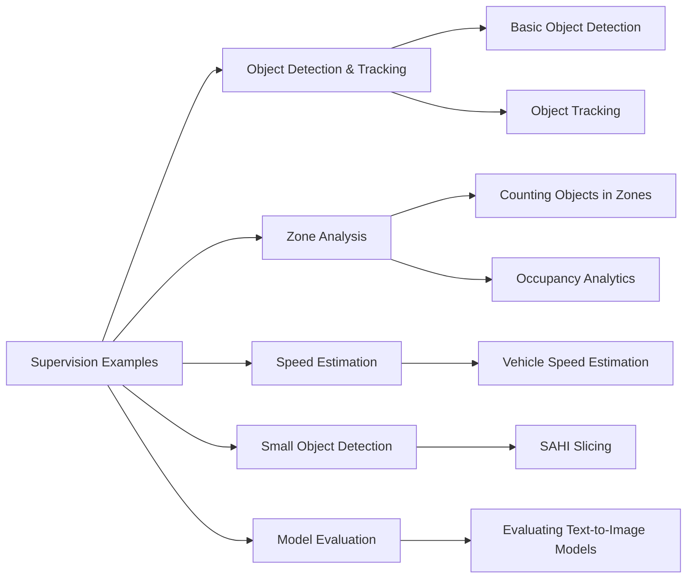
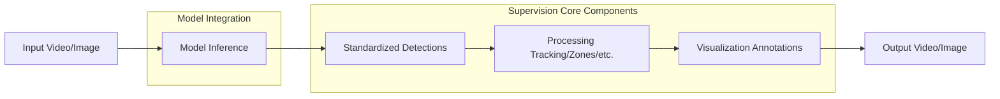
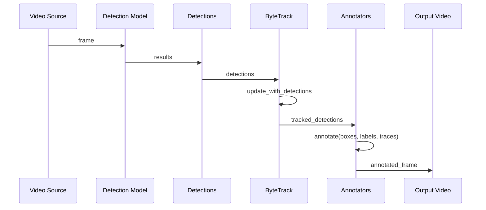
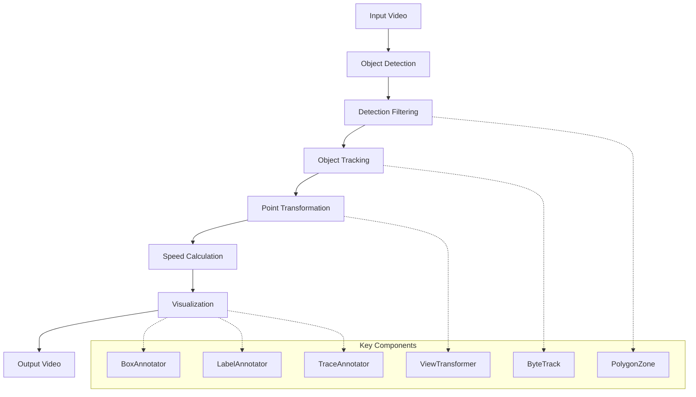
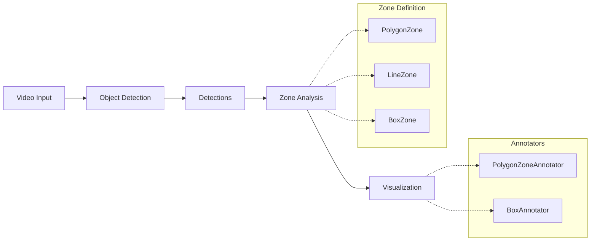
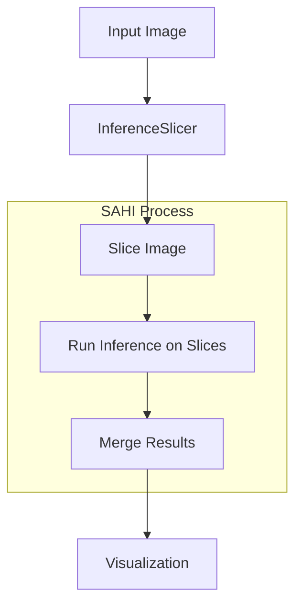
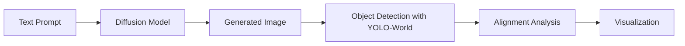
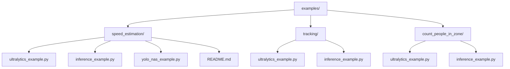
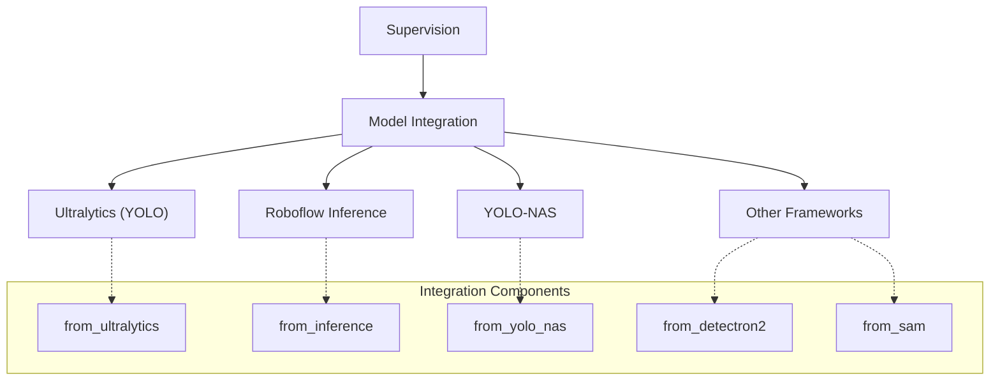

# Examples & Tutorials

Relevant source files

- [docs/how_to/track_objects.md](https://github.com/roboflow/supervision/blob/1d0747fb/docs/how_to/track_objects.md)
- [docs/javascripts/cookbooks-card.js](https://github.com/roboflow/supervision/blob/1d0747fb/docs/javascripts/cookbooks-card.js)
- [docs/notebooks/evaluating-alignment-of-text-to-image-diffusion-models.ipynb](https://github.com/roboflow/supervision/blob/1d0747fb/docs/notebooks/evaluating-alignment-of-text-to-image-diffusion-models.ipynb)
- [docs/notebooks/occupancy_analytics.ipynb](https://github.com/roboflow/supervision/blob/1d0747fb/docs/notebooks/occupancy_analytics.ipynb)
- [docs/notebooks/small-object-detection-with-sahi.ipynb](https://github.com/roboflow/supervision/blob/1d0747fb/docs/notebooks/small-object-detection-with-sahi.ipynb)
- [docs/stylesheets/cookbooks-card.css](https://github.com/roboflow/supervision/blob/1d0747fb/docs/stylesheets/cookbooks-card.css)
- [docs/theme/cookbooks.html](https://github.com/roboflow/supervision/blob/1d0747fb/docs/theme/cookbooks.html)
- [examples/count_people_in_zone/inference_example.py](https://github.com/roboflow/supervision/blob/1d0747fb/examples/count_people_in_zone/inference_example.py)
- [examples/count_people_in_zone/ultralytics_example.py](https://github.com/roboflow/supervision/blob/1d0747fb/examples/count_people_in_zone/ultralytics_example.py)
- [examples/speed_estimation/.gitignore](https://github.com/roboflow/supervision/blob/1d0747fb/examples/speed_estimation/.gitignore)
- [examples/speed_estimation/README.md](https://github.com/roboflow/supervision/blob/1d0747fb/examples/speed_estimation/README.md)
- [examples/speed_estimation/inference_example.py](https://github.com/roboflow/supervision/blob/1d0747fb/examples/speed_estimation/inference_example.py)
- [examples/speed_estimation/requirements.txt](https://github.com/roboflow/supervision/blob/1d0747fb/examples/speed_estimation/requirements.txt)
- [examples/speed_estimation/ultralytics_example.py](https://github.com/roboflow/supervision/blob/1d0747fb/examples/speed_estimation/ultralytics_example.py)
- [examples/speed_estimation/video_downloader.py](https://github.com/roboflow/supervision/blob/1d0747fb/examples/speed_estimation/video_downloader.py)
- [examples/speed_estimation/yolo_nas_example.py](https://github.com/roboflow/supervision/blob/1d0747fb/examples/speed_estimation/yolo_nas_example.py)
- [examples/tracking/inference_example.py](https://github.com/roboflow/supervision/blob/1d0747fb/examples/tracking/inference_example.py)
- [examples/tracking/ultralytics_example.py](https://github.com/roboflow/supervision/blob/1d0747fb/examples/tracking/ultralytics_example.py)

This page provides an overview of practical examples and tutorials for using the Supervision library in computer vision projects. These examples demonstrate real-world applications and show how to implement common computer vision tasks using Supervision's components.

For detailed information about specific components and systems in the Supervision library, refer to the corresponding pages in the Core Components section.

## Overview of Examples

Supervision provides a variety of examples showcasing different capabilities of the library. These examples demonstrate how to use Supervision's components together to build effective computer vision solutions.

### Example Categories




Sources: [docs/theme/cookbooks.html1-61](https://github.com/roboflow/supervision/blob/1d0747fb/docs/theme/cookbooks.html#L1-L61) [examples/tracking/ultralytics_example.py1-84](https://github.com/roboflow/supervision/blob/1d0747fb/examples/tracking/ultralytics_example.py#L1-L84) [examples/speed_estimation/ultralytics_example.py1-147](https://github.com/roboflow/supervision/blob/1d0747fb/examples/speed_estimation/ultralytics_example.py#L1-L147) [docs/notebooks/small-object-detection-with-sahi.ipynb1-256](https://github.com/roboflow/supervision/blob/1d0747fb/docs/notebooks/small-object-detection-with-sahi.ipynb#L1-L256) [docs/notebooks/evaluating-alignment-of-text-to-image-diffusion-models.ipynb1-170](https://github.com/roboflow/supervision/blob/1d0747fb/docs/notebooks/evaluating-alignment-of-text-to-image-diffusion-models.ipynb#L1-L170)

## Common Workflow Pattern

Most examples in Supervision follow a similar workflow pattern, which includes loading a model, processing video or images, detecting objects, applying additional processing (tracking, zone analysis), and visualizing the results.



Sources: [examples/tracking/ultralytics_example.py9-40](https://github.com/roboflow/supervision/blob/1d0747fb/examples/tracking/ultralytics_example.py#L9-L40) [examples/speed_estimation/ultralytics_example.py69-146](https://github.com/roboflow/supervision/blob/1d0747fb/examples/speed_estimation/ultralytics_example.py#L69-L146) [examples/count_people_in_zone/ultralytics_example.py63-122](https://github.com/roboflow/supervision/blob/1d0747fb/examples/count_people_in_zone/ultralytics_example.py#L63-L122)

## Object Detection and Tracking

### Basic Object Detection Workflow

The most fundamental example is object detection and annotation. This example demonstrates how to load a model, run inference, convert results to Supervision's standardized format, and visualize them.

```
# Basic detection workflow
import supervision as sv
from ultralytics import YOLO

# 1. Load model
model = YOLO("yolov8n.pt")

# 2. Run inference
results = model(frame)[0]

# 3. Convert to Supervision format
detections = sv.Detections.from_ultralytics(results)

# 4. Annotate
box_annotator = sv.BoxAnnotator()
annotated_frame = box_annotator.annotate(frame.copy(), detections=detections)
```

### Object Tracking Tutorial

Supervision provides a tutorial on tracking objects across video frames using the ByteTrack algorithm. This is essential for applications that need to maintain object identity across frames.




```
# Tracking objects across video frames
tracker = sv.ByteTrack()
box_annotator = sv.BoxAnnotator()
label_annotator = sv.LabelAnnotator()

for frame in frame_generator:
    # Run detection
    results = model(frame)
    detections = sv.Detections.from_ultralytics(results)
    
    # Track objects
    detections = tracker.update_with_detections(detections)
    
    # Visualize
    annotated_frame = box_annotator.annotate(frame.copy(), detections)
    annotated_frame = label_annotator.annotate(annotated_frame, detections)
```

Sources: [docs/how_to/track_objects.md1-657](https://github.com/roboflow/supervision/blob/1d0747fb/docs/how_to/track_objects.md#L1-L657) [examples/tracking/ultralytics_example.py1-84](https://github.com/roboflow/supervision/blob/1d0747fb/examples/tracking/ultralytics_example.py#L1-L84) [examples/tracking/inference_example.py1-102](https://github.com/roboflow/supervision/blob/1d0747fb/examples/tracking/inference_example.py#L1-L102)

## Speed Estimation

The speed estimation example demonstrates how to combine object detection, tracking, and coordinate transformation to calculate the speed of moving vehicles.



Key features of the speed estimation example:

1. **Perspective transformation**: Transforms road coordinates to allow for accurate distance calculation
2. **Object tracking**: Maintains identity of vehicles across frames
3. **Coordinate history**: Tracks positions over time to calculate speed
4. **Visual feedback**: Annotates vehicles with their calculated speeds

```
# Speed estimation workflow
# 1. Define perspective transformation coordinates
SOURCE = np.array([[1252, 787], [2298, 803], [5039, 2159], [-550, 2159]])
TARGET = np.array([[0, 0], [TARGET_WIDTH-1, 0], 
                 [TARGET_WIDTH-1, TARGET_HEIGHT-1], [0, TARGET_HEIGHT-1]])

# 2. Initialize components
tracker = sv.ByteTrack()
polygon_zone = sv.PolygonZone(polygon=SOURCE)
view_transformer = ViewTransformer(source=SOURCE, target=TARGET)
coordinates = defaultdict(lambda: deque(maxlen=video_info.fps))

# 3. Process each frame
for frame in frame_generator:
    # Detect, filter, and track objects
    detections = sv.Detections.from_ultralytics(model(frame)[0])
    detections = detections[polygon_zone.trigger(detections)]
    detections = byte_track.update_with_detections(detections)
    
    # Transform points and calculate speed
    points = detections.get_anchors_coordinates(anchor=sv.Position.BOTTOM_CENTER)
    points = view_transformer.transform_points(points)
    
    # Track coordinates for speed calculation
    for tracker_id, [_, y] in zip(detections.tracker_id, points):
        coordinates[tracker_id].append(y)
    
    # Calculate speed for each object
    for tracker_id in detections.tracker_id:
        if sufficient_tracking_history:
            distance = abs(coordinates[tracker_id][-1] - coordinates[tracker_id][0])
            time = len(coordinates[tracker_id]) / video_info.fps
            speed = distance / time * 3.6  # Convert to km/h
```

Sources: [examples/speed_estimation/ultralytics_example.py1-147](https://github.com/roboflow/supervision/blob/1d0747fb/examples/speed_estimation/ultralytics_example.py#L1-L147) [examples/speed_estimation/inference_example.py1-169](https://github.com/roboflow/supervision/blob/1d0747fb/examples/speed_estimation/inference_example.py#L1-L169) [examples/speed_estimation/yolo_nas_example.py1-147](https://github.com/roboflow/supervision/blob/1d0747fb/examples/speed_estimation/yolo_nas_example.py#L1-L147) [examples/speed_estimation/README.md1-123](https://github.com/roboflow/supervision/blob/1d0747fb/examples/speed_estimation/README.md#L1-L123)

## Zone-Based Counting

Supervision provides tools for defining zones and counting objects that enter or occupy these zones, which is useful for applications like traffic monitoring and crowd analysis.



### Count Objects Crossing a Line

This example demonstrates how to define line zones and count objects that cross these lines, which is useful for traffic analysis, people counting, and similar applications.

```
# Line crossing detection
line_zone = sv.LineZone(start=LINE_START, end=LINE_END)
line_zone_annotator = sv.LineZoneAnnotator(thickness=2, text_thickness=2, text_scale=1)
box_annotator = sv.BoxAnnotator(thickness=2, text_thickness=2, text_scale=1)

# Process video frames
for frame in frame_generator:
    # Detect objects
    results = model(frame)[0]
    detections = sv.Detections.from_ultralytics(results)
    
    # Track objects across frames
    detections = tracker.update_with_detections(detections)
    
    # Check line crossing events
    line_counter.update(detections)
    
    # Annotate frame
    annotated_frame = frame.copy()
    annotated_frame = line_zone_annotator.annotate(annotated_frame, line_counter)
    annotated_frame = box_annotator.annotate(annotated_frame, detections)
```

### Zone Occupancy Analysis

Another important application is analyzing the occupancy of defined zones, which is useful for parking lot monitoring, crowd analysis, and space utilization.

```
# Zone occupancy analysis
def load_zones_config(file_path):
    with open(file_path, "r") as file:
        data = json.load(file)
        return [np.array(polygon, np.int32) for polygon in data["polygons"]]

# Initialize zone-based tools
zones = []
zone_annotators = []
box_annotators = []

for index, polygon in enumerate(polygons):
    zone = sv.PolygonZone(polygon=polygon)
    zone_annotator = sv.PolygonZoneAnnotator(zone=zone, color=COLORS.by_idx(index))
    box_annotator = sv.BoxAnnotator(color=COLORS.by_idx(index))
    
    zones.append(zone)
    zone_annotators.append(zone_annotator)
    box_annotators.append(box_annotator)

# Process video
for frame in frame_generator:
    # Detect objects
    detections = detect(frame, model, confidence_threshold)
    
    # Annotate each zone with detections
    for zone, zone_annotator, box_annotator in zip(zones, zone_annotators, box_annotators):
        detections_in_zone = detections[zone.trigger(detections)]
        annotated_frame = zone_annotator.annotate(scene=annotated_frame)
        annotated_frame = box_annotator.annotate(
            scene=annotated_frame, detections=detections_in_zone
        )
```

Sources: [examples/count_people_in_zone/ultralytics_example.py1-205](https://github.com/roboflow/supervision/blob/1d0747fb/examples/count_people_in_zone/ultralytics_example.py#L1-L205) [examples/count_people_in_zone/inference_example.py1-223](https://github.com/roboflow/supervision/blob/1d0747fb/examples/count_people_in_zone/inference_example.py#L1-L223) [docs/notebooks/occupancy_analytics.ipynb1-233](https://github.com/roboflow/supervision/blob/1d0747fb/docs/notebooks/occupancy_analytics.ipynb#L1-L233)

## Small Object Detection with SAHI

The Small Object Detection example demonstrates how to use Slicing Aided Hyper Inference (SAHI) for detecting small objects in images.




This approach is particularly useful for:

1. Detecting small objects in high-resolution images
2. Improving detection performance for distant or tiny objects
3. Crowd counting and analysis
4. Analyzing satellite imagery

```
# Small object detection with SAHI
import supervision as sv
from inference import get_model

# Load model
model = get_model(model_id="people_counterv0", api_key=ROBOFLOW_API_KEY)

# Initialize SAHI
inference_slicer = sv.InferenceSlicer(
    model, 
    slice_height=640, 
    slice_width=640, 
    overlap_height_ratio=0.2, 
    overlap_width_ratio=0.2
)

# Process image
results = inference_slicer.slice_and_infer(frame)
detections = sv.Detections.from_inference(results)

# Visualize
box_annotator = sv.BoxAnnotator()
annotated_frame = box_annotator.annotate(frame, detections)
```

Sources: [docs/notebooks/small-object-detection-with-sahi.ipynb1-256](https://github.com/roboflow/supervision/blob/1d0747fb/docs/notebooks/small-object-detection-with-sahi.ipynb#L1-L256)

## Text-to-Image Model Evaluation

This advanced example shows how to evaluate the alignment of text-to-image diffusion models using computer vision techniques.



Key components:

1. Text-to-image model (e.g., Stable Diffusion)
2. Open-vocabulary object detection using YOLO-World
3. Alignment analysis between prompt and detected objects
4. Visualization using Supervision's annotation tools

```
# Text-to-image model evaluation
from diffusers import StableDiffusionXLPipeline
from inference.models import YOLOWorld
import supervision as sv

# Initialize diffusion model
pipeline = StableDiffusionXLPipeline.from_pretrained(
    "stabilityai/stable-diffusion-xl-base-1.0"
).to("cuda")

# Generate image from prompt
prompt = "a black cat playing with a blue ball next to a white car"
image = pipeline(prompt).images[0]
frame = np.array(image)

# Detect objects using YOLO-World
model = YOLOWorld("yolo-world-l")
results = model.infer(frame, classes=["cat", "ball", "car"])
detections = sv.Detections.from_inference(results)

# Visualize results
box_annotator = sv.BoxAnnotator()
label_annotator = sv.LabelAnnotator()
annotated_frame = box_annotator.annotate(frame.copy(), detections)
annotated_frame = label_annotator.annotate(annotated_frame, detections)
```

Sources: [docs/notebooks/evaluating-alignment-of-text-to-image-diffusion-models.ipynb1-170](https://github.com/roboflow/supervision/blob/1d0747fb/docs/notebooks/evaluating-alignment-of-text-to-image-diffusion-models.ipynb#L1-L170)

## Available Example Resources

Supervision maintains a collection of examples in its documentation, accessible through various formats to meet different learning preferences.

### Supervision Cookbooks

Supervision offers a collection of "cookbooks" - practical examples that demonstrate how to use the library for specific tasks. These cookbooks are accessible through the documentation website.

|Cookbook|Description|Categories|
|---|---|---|
|Supervision Quickstart|Get started with basic detection and annotation|ANNOTATOR, DETECTION, SAM|
|Count Objects Crossing the Line|Track and count objects crossing defined lines|ANNOTATORS, LINE ZONE, TRACKING|
|Zero-Shot Object Detection|Use YOLO-World for open-vocabulary detection|ANNOTATORS, DETECTION, INFERENCE|
|Downloading Supervision Assets|How to use Supervision's asset management|ASSETS|
|Annotate Video with Detections|Visualize detections on video|INFERENCE, YOLOV8|
|Object Tracking|Track objects across video frames|TRACKING, ANNOTATOR|
|Analyzing Zone Occupancy|Monitor objects in defined zones|ANNOTATOR, DETECTION, ZONES|
|Evaluating Text-to-Image Models|Analyze diffusion model alignment|ANNOTATORS, YOLO WORLD|
|Serialise Detections to CSV/JSON|Export detection data to file formats|DETECTIONS, CSV/JSON SINK, INFERENCE|
|Small Object Detection with SAHI|Detect small objects efficiently|DETECTIONS, SAHI, INFERENCE|

Sources: [docs/theme/cookbooks.html1-61](https://github.com/roboflow/supervision/blob/1d0747fb/docs/theme/cookbooks.html#L1-L61) [docs/javascripts/cookbooks-card.js1-140](https://github.com/roboflow/supervision/blob/1d0747fb/docs/javascripts/cookbooks-card.js#L1-L140) [docs/stylesheets/cookbooks-card.css1-118](https://github.com/roboflow/supervision/blob/1d0747fb/docs/stylesheets/cookbooks-card.css#L1-L118)

### Example Repository Structure

The following diagram illustrates the structure of examples in the Supervision repository:



Sources: [examples/speed_estimation/ultralytics_example.py1-147](https://github.com/roboflow/supervision/blob/1d0747fb/examples/speed_estimation/ultralytics_example.py#L1-L147) [examples/speed_estimation/inference_example.py1-169](https://github.com/roboflow/supervision/blob/1d0747fb/examples/speed_estimation/inference_example.py#L1-L169) [examples/speed_estimation/yolo_nas_example.py1-147](https://github.com/roboflow/supervision/blob/1d0747fb/examples/speed_estimation/yolo_nas_example.py#L1-L147) [examples/tracking/ultralytics_example.py1-84](https://github.com/roboflow/supervision/blob/1d0747fb/examples/tracking/ultralytics_example.py#L1-L84) [examples/tracking/inference_example.py1-102](https://github.com/roboflow/supervision/blob/1d0747fb/examples/tracking/inference_example.py#L1-L102) [examples/count_people_in_zone/ultralytics_example.py1-205](https://github.com/roboflow/supervision/blob/1d0747fb/examples/count_people_in_zone/ultralytics_example.py#L1-L205) [examples/count_people_in_zone/inference_example.py1-223](https://github.com/roboflow/supervision/blob/1d0747fb/examples/count_people_in_zone/inference_example.py#L1-L223)

## Framework Integration

One of Supervision's key features is its ability to integrate with various model frameworks, making it a versatile tool for computer vision projects.



Most examples in the Supervision repository provide implementations for multiple frameworks, allowing users to choose the one that best fits their needs:

1. **Ultralytics**: For YOLO models (YOLOv5, YOLOv8)
2. **Inference**: For Roboflow-hosted models
3. **YOLO-NAS**: For Neural Architecture Search YOLO models

This multi-framework approach provides flexibility while maintaining the same Supervision workflow for consistent implementation patterns.

Sources: [examples/speed_estimation/ultralytics_example.py1-147](https://github.com/roboflow/supervision/blob/1d0747fb/examples/speed_estimation/ultralytics_example.py#L1-L147) [examples/speed_estimation/inference_example.py1-169](https://github.com/roboflow/supervision/blob/1d0747fb/examples/speed_estimation/inference_example.py#L1-L169) [examples/speed_estimation/yolo_nas_example.py1-147](https://github.com/roboflow/supervision/blob/1d0747fb/examples/speed_estimation/yolo_nas_example.py#L1-L147)

## Getting Started with Examples

To get started with these examples:

1. **Clone the Supervision repository**:
    
    ```
    git clone https://github.com/roboflow/supervision.git
    cd supervision/examples
    ```
    
2. **Install requirements**:
    
    ```
    # For speed estimation example
    cd speed_estimation
    pip install -r requirements.txt
    ```
    
3. **Run an example**:
    
    ```
    # Using Ultralytics
    python ultralytics_example.py --source_video_path data/video.mp4 --target_video_path data/result.mp4
    
    # Using Inference
    python inference_example.py --roboflow_api_key <API_KEY> --source_video_path data/video.mp4 --target_video_path data/result.mp4
    ```
    

Each example typically accepts several command-line arguments to customize its behavior:

|Argument|Description|Example|
|---|---|---|
|`--source_video_path`|Path to input video|`data/video.mp4`|
|`--target_video_path`|Path for output video|`data/result.mp4`|
|`--confidence_threshold`|Minimum confidence score for detections|`0.3`|
|`--iou_threshold`|IOU threshold for NMS|`0.7`|
|`--roboflow_api_key`|API key for Roboflow (for inference)|`<API_KEY>`|
|`--model_id`|Model ID for Roboflow models|`yolov8x-1280`|
|`--source_weights_path`|Path to model weights|`yolov8x.pt`|

Sources: [examples/speed_estimation/README.md1-123](https://github.com/roboflow/supervision/blob/1d0747fb/examples/speed_estimation/README.md#L1-L123) [examples/speed_estimation/requirements.txt1-7](https://github.com/roboflow/supervision/blob/1d0747fb/examples/speed_estimation/requirements.txt#L1-L7) [examples/speed_estimation/video_downloader.py1-9](https://github.com/roboflow/supervision/blob/1d0747fb/examples/speed_estimation/video_downloader.py#L1-L9)