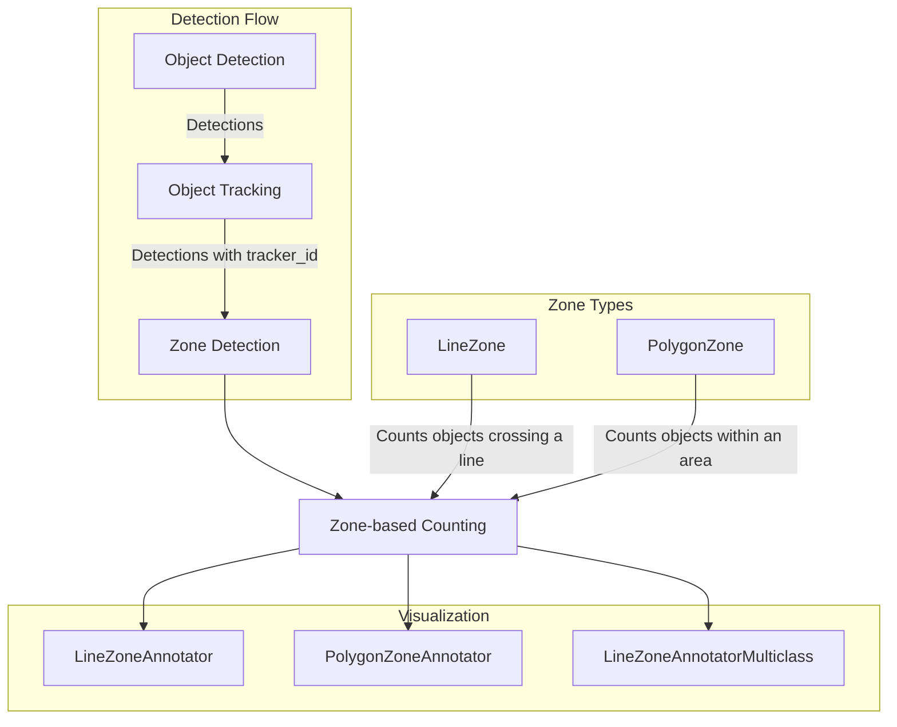
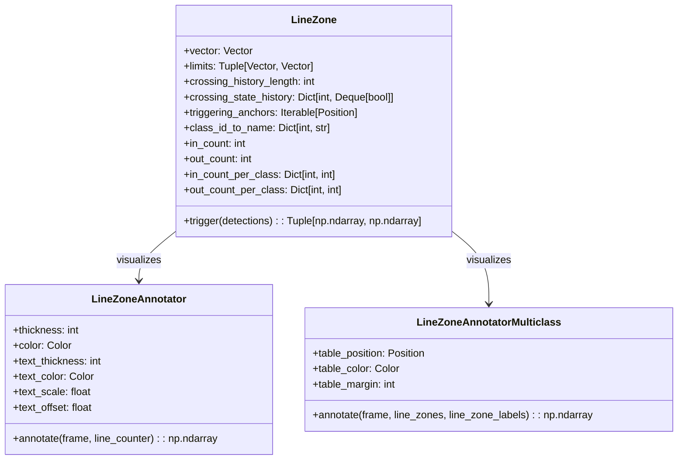
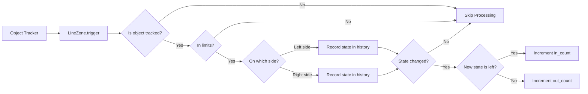
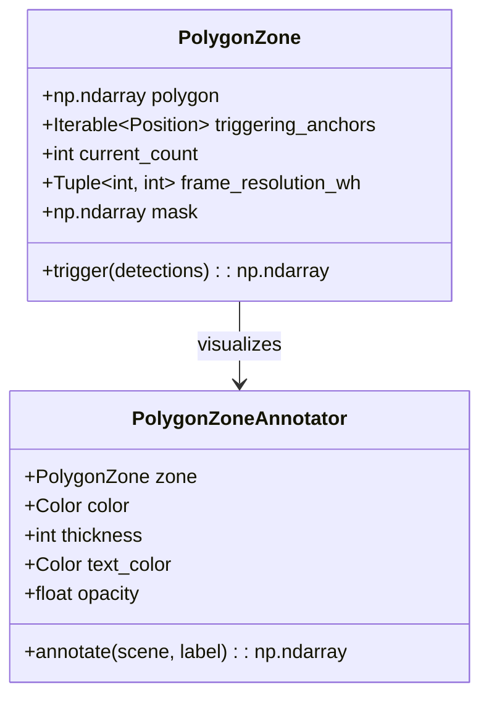
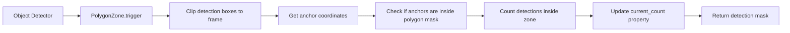
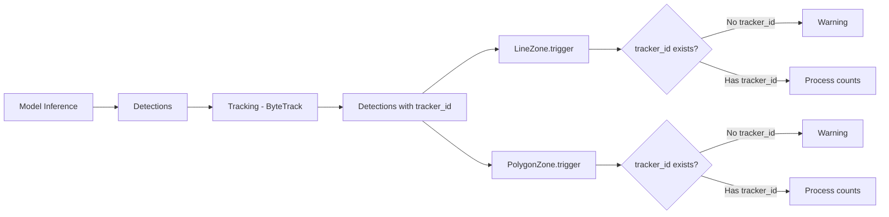
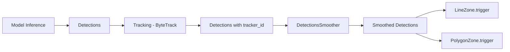

# Zone-based Counting

Relevant source files

- [docs/detection/tools/smoother.md](https://github.com/roboflow/supervision/blob/1d0747fb/docs/detection/tools/smoother.md)
- [supervision/detection/line_zone.py](https://github.com/roboflow/supervision/blob/1d0747fb/supervision/detection/line_zone.py)
- [supervision/detection/tools/polygon_zone.py](https://github.com/roboflow/supervision/blob/1d0747fb/supervision/detection/tools/polygon_zone.py)
- [supervision/detection/tools/smoother.py](https://github.com/roboflow/supervision/blob/1d0747fb/supervision/detection/tools/smoother.py)
- [supervision/utils/internal.py](https://github.com/roboflow/supervision/blob/1d0747fb/supervision/utils/internal.py)
- [test/detection/test_polygon_zone_annotator.py](https://github.com/roboflow/supervision/blob/1d0747fb/test/detection/test_polygon_zone_annotator.py)
- [test/utils/test_internal.py](https://github.com/roboflow/supervision/blob/1d0747fb/test/utils/test_internal.py)

This document covers the zone-based counting capabilities in the Supervision library. Zone-based counting allows you to count objects that either cross predefined lines or exist within polygon areas. For information about object detection and tracking, see [Object Detection & Tracking](https://deepwiki.com/roboflow/supervision/5.1-object-detection-and-tracking).

## Overview

Supervision provides two main tools for zone-based counting:

1. **LineZone** - Counts objects crossing a line (in both directions)
2. **PolygonZone** - Counts objects within a defined polygon area

Both tools require object tracking to function properly, as they need to identify the same object across multiple frames.

### How Zone Counting Works



Sources: [supervision/detection/line_zone.py](https://github.com/roboflow/supervision/blob/1d0747fb/supervision/detection/line_zone.py) [supervision/detection/tools/polygon_zone.py](https://github.com/roboflow/supervision/blob/1d0747fb/supervision/detection/tools/polygon_zone.py)

## LineZone

`LineZone` is used to count objects crossing a defined line in a video. It tracks objects in both directions - entering (in_count) and exiting (out_count).

### LineZone Architecture




> Nota: En los **classDiagram** de Mermaid, los paréntesis de métodos y los tipos con corchetes (p. ej., `Dict[int, ...]`) son seguros; el problema de “corchetes dentro de corchetes” aplica a las **etiquetas de nodos** en _flowcharts_, no aquí. Si aún así quieres evitar `[]`, puedo darte una variante con tipos “verbales” (por ejemplo `Dict int->Deque bool`).

Sources: [supervision/detection/line_zone.py23-315](https://github.com/roboflow/supervision/blob/1d0747fb/supervision/detection/line_zone.py#L23-L315)

### LineZone Counting Logic

The `LineZone` class maintains a history of object positions relative to the line for each tracked object. When an object moves from one side of the line to the other and stays there for a specified number of frames, it is counted as having crossed the line.



Sources: [supervision/detection/line_zone.py128-200](https://github.com/roboflow/supervision/blob/1d0747fb/supervision/detection/line_zone.py#L128-L200)

### Key Parameters

|Parameter|Description|Default|
|---|---|---|
|`start`|The starting point of the line|Required|
|`end`|The ending point of the line|Required|
|`triggering_anchors`|Which part of the detection box to use for triggering|All four corners|
|`minimum_crossing_threshold`|Minimum frames to be on other side to count as crossing|1|

Sources: [supervision/detection/line_zone.py72-98](https://github.com/roboflow/supervision/blob/1d0747fb/supervision/detection/line_zone.py#L72-L98)

### Example Usage

```
import supervision as sv
from ultralytics import YOLO

model = YOLO(<SOURCE_MODEL_PATH>)
tracker = sv.ByteTrack()
frames_generator = sv.get_video_frames_generator(<SOURCE_VIDEO_PATH>)
start, end = sv.Point(x=0, y=1080), sv.Point(x=3840, y=1080)
line_zone = sv.LineZone(start=start, end=end)

for frame in frames_generator:
    result = model(frame)[0]
    detections = sv.Detections.from_ultralytics(result)
    detections = tracker.update_with_detections(detections)
    crossed_in, crossed_out = line_zone.trigger(detections)
    
    # Visualize the line and counts
    annotator = sv.LineZoneAnnotator()
    annotated_frame = annotator.annotate(frame=frame, line_counter=line_zone)
```

Sources: [supervision/detection/line_zone.py50-69](https://github.com/roboflow/supervision/blob/1d0747fb/supervision/detection/line_zone.py#L50-L69)

## PolygonZone

`PolygonZone` is used to count objects within a defined polygon area. It tracks the current count of objects inside the zone.

### PolygonZone Architecture



Sources: [supervision/detection/tools/polygon_zone.py16-110](https://github.com/roboflow/supervision/blob/1d0747fb/supervision/detection/tools/polygon_zone.py#L16-L110) [supervision/detection/tools/polygon_zone.py112-202](https://github.com/roboflow/supervision/blob/1d0747fb/supervision/detection/tools/polygon_zone.py#L112-L202)

### PolygonZone Counting Logic

The `PolygonZone` class determines if the detection anchors (such as the bottom center of a bounding box) are within the polygon boundary. It maintains a count of detections that are currently inside the zone.



Sources: [supervision/detection/tools/polygon_zone.py77-109](https://github.com/roboflow/supervision/blob/1d0747fb/supervision/detection/tools/polygon_zone.py#L77-L109)

### Key Parameters

|Parameter|Description|Default|
|---|---|---|
|`polygon`|Array of polygon coordinates|Required|
|`triggering_anchors`|Which part of the detection box to use for triggering|Bottom center|

Sources: [supervision/detection/tools/polygon_zone.py59-68](https://github.com/roboflow/supervision/blob/1d0747fb/supervision/detection/tools/polygon_zone.py#L59-L68)

### Example Usage

```
import supervision as sv
from ultralytics import YOLO
import numpy as np

image = cv2.imread(<SOURCE_IMAGE_PATH>)
model = YOLO("yolo11s")
tracker = sv.ByteTrack()

polygon = np.array([[100, 200], [200, 100], [300, 200], [200, 300]])
polygon_zone = sv.PolygonZone(polygon=polygon)

result = model.infer(image)[0]
detections = sv.Detections.from_ultralytics(result)
detections = tracker.update_with_detections(detections)

is_detections_in_zone = polygon_zone.trigger(detections)

# Visualize the zone and count
annotator = sv.PolygonZoneAnnotator(zone=polygon_zone)
annotated_frame = annotator.annotate(scene=image)
```

Sources: [supervision/detection/tools/polygon_zone.py36-56](https://github.com/roboflow/supervision/blob/1d0747fb/supervision/detection/tools/polygon_zone.py#L36-L56)

## Integration with Tracking

Both `LineZone` and `PolygonZone` require object tracking to function properly. They look for the `tracker_id` property on the `Detections` object. Supervision provides a warning if the detections don't include tracking information.



Sources: [supervision/detection/line_zone.py142-156](https://github.com/roboflow/supervision/blob/1d0747fb/supervision/detection/line_zone.py#L142-L156) [supervision/detection/tools/polygon_zone.py20-24](https://github.com/roboflow/supervision/blob/1d0747fb/supervision/detection/tools/polygon_zone.py#L20-L24)

## Improving Results with Detection Smoothing

The `DetectionsSmoother` class can help improve zone counting by smoothing detection boxes across frames. This reduces jitter and makes counting more accurate, especially for `LineZone` where small jitters can cause false crossings.



Sources: [supervision/detection/tools/smoother.py12-124](https://github.com/roboflow/supervision/blob/1d0747fb/supervision/detection/tools/smoother.py#L12-L124)

### Key Parameters for DetectionsSmoother

|Parameter|Description|Default|
|---|---|---|
|`length`|Number of frames to consider for smoothing|5|

Sources: [supervision/detection/tools/smoother.py58-65](https://github.com/roboflow/supervision/blob/1d0747fb/supervision/detection/tools/smoother.py#L58-L65)

## Visualization Tools

Supervision provides specialized annotators for visualizing zones and counts:

1. **LineZoneAnnotator** - Visualizes the line and crossing counts
2. **LineZoneAnnotatorMulticlass** - Shows detailed per-class counting in a table
3. **PolygonZoneAnnotator** - Visualizes the polygon zone and object count

### LineZoneAnnotator Parameters

|Parameter|Description|Default|
|---|---|---|
|`thickness`|Line thickness|2|
|`color`|Line color|WHITE|
|`text_thickness`|Text thickness|2|
|`text_scale`|Text scale|0.5|
|`display_in_count`|Show incoming count|True|
|`display_out_count`|Show outgoing count|True|
|`text_orient_to_line`|Rotate text to match line orientation|False|

Sources: [supervision/detection/line_zone.py317-371](https://github.com/roboflow/supervision/blob/1d0747fb/supervision/detection/line_zone.py#L317-L371)

### LineZoneAnnotatorMulticlass Parameters

|Parameter|Description|Default|
|---|---|---|
|`table_position`|Position of the table|TOP_RIGHT|
|`table_color`|Background color of table|WHITE|
|`table_margin`|Margin from frame edge|10|
|`force_draw_class_ids`|Use class IDs instead of names|False|

Sources: [supervision/detection/line_zone.py700-754](https://github.com/roboflow/supervision/blob/1d0747fb/supervision/detection/line_zone.py#L700-L754)

### PolygonZoneAnnotator Parameters

|Parameter|Description|Default|
|---|---|---|
|`zone`|The PolygonZone to annotate|Required|
|`color`|Polygon outline color|WHITE|
|`thickness`|Line thickness|2|
|`display_in_zone_count`|Show the count|True|
|`opacity`|Fill opacity of the zone|0|

Sources: [supervision/detection/tools/polygon_zone.py132-154](https://github.com/roboflow/supervision/blob/1d0747fb/supervision/detection/tools/polygon_zone.py#L132-L154)

## Best Practices and Considerations

1. **Tracking Integration**: Always integrate a tracker like ByteTrack with your pipeline
2. **Smoother Integration**: Consider using `DetectionsSmoother` for more stable results
3. **Triggering Anchors**: Choose appropriate anchors for your use case (e.g., bottom center for people)
4. **Line Positioning**: Position lines in a way that objects fully cross them (not touching the line for extended periods)
5. **Minimum Crossing Threshold**: Increase `minimum_crossing_threshold` if you experience false crossings
6. **Polygon Design**: Design polygons that have clear boundaries and don't overlap with other counting areas

## Troubleshooting

|Issue|Possible Solution|
|---|---|
|No objects counted|Verify that detections include tracker_id|
|False crossings|Increase minimum_crossing_threshold|
|Objects counted multiple times|Check tracker performance, consider smoothing detections|
|Poor visualization|Adjust annotator parameters (thickness, color, text_scale)|
|Overlapping annotations|Modify text position or use text_orient_to_line=True|