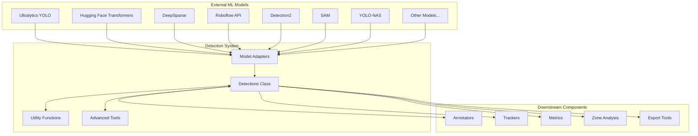
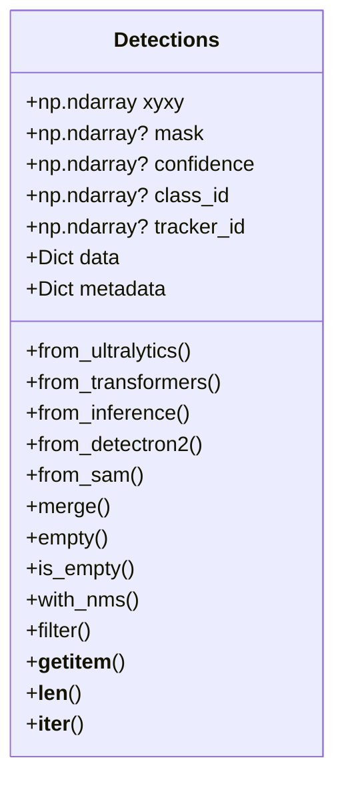
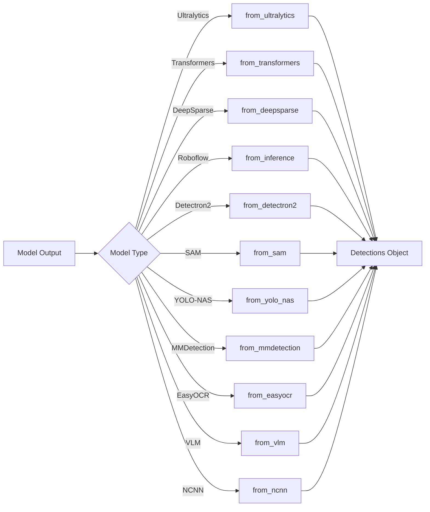
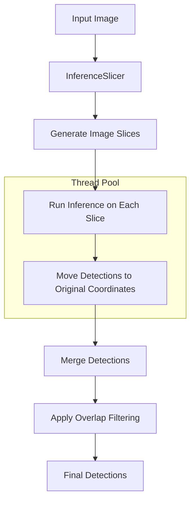

# Detection System

Relevant source files

- [docs/datasets/utils.md](https://github.com/roboflow/supervision/blob/1d0747fb/docs/datasets/utils.md)
- [docs/detection/double_detection_filter.md](https://github.com/roboflow/supervision/blob/1d0747fb/docs/detection/double_detection_filter.md)
- [docs/detection/tools/inference_slicer.md](https://github.com/roboflow/supervision/blob/1d0747fb/docs/detection/tools/inference_slicer.md)
- [docs/detection/utils.md](https://github.com/roboflow/supervision/blob/1d0747fb/docs/detection/utils.md)
- [supervision/detection/core.py](https://github.com/roboflow/supervision/blob/1d0747fb/supervision/detection/core.py)
- [supervision/detection/tools/inference_slicer.py](https://github.com/roboflow/supervision/blob/1d0747fb/supervision/detection/tools/inference_slicer.py)
- [supervision/detection/tools/transformers.py](https://github.com/roboflow/supervision/blob/1d0747fb/supervision/detection/tools/transformers.py)
- [supervision/detection/utils.py](https://github.com/roboflow/supervision/blob/1d0747fb/supervision/detection/utils.py)
- [test/detection/test_core.py](https://github.com/roboflow/supervision/blob/1d0747fb/test/detection/test_core.py)
- [test/detection/test_utils.py](https://github.com/roboflow/supervision/blob/1d0747fb/test/detection/test_utils.py)

The Detection System is a core component of the Supervision library that provides a standardized representation for object detection results. It enables consistent handling of detection data regardless of the source model or framework, serving as a foundation for other Supervision components like annotators, trackers, and analysis tools.

For information about visualization of detection results, see [Annotation System](https://deepwiki.com/roboflow/supervision/2.2-annotation-system). For filtering detections based on spatial zones, see [Zone Tools](https://deepwiki.com/roboflow/supervision/3.1-zone-tools).

## Overview

The Detection System standardizes results from various object detection and segmentation models into a consistent format through the central `Detections` class. This allows developers to process outputs from different ML frameworks using a unified API.




Sources: [supervision/detection/core.py48-1981](https://github.com/roboflow/supervision/blob/1d0747fb/supervision/detection/core.py#L48-L1981) This diagram illustrates how the Detection System connects external ML models with Supervision's components.

## Detections Class

The `Detections` class is the central data structure of the Detection System. It standardizes object detection and segmentation results, making them easy to manipulate and visualize.

### Structure



Sources: [supervision/detection/core.py49-143](https://github.com/roboflow/supervision/blob/1d0747fb/supervision/detection/core.py#L49-L143)

### Attributes

|Attribute|Type|Description|
|---|---|---|
|`xyxy`|`np.ndarray`|Array of shape `(n, 4)` containing bounding box coordinates in format `[x1, y1, x2, y2]`|
|`mask`|`Optional[np.ndarray]`|Array of shape `(n, H, W)` containing segmentation masks (boolean type)|
|`confidence`|`Optional[np.ndarray]`|Array of shape `(n,)` containing confidence scores|
|`class_id`|`Optional[np.ndarray]`|Array of shape `(n,)` containing class identifiers|
|`tracker_id`|`Optional[np.ndarray]`|Array of shape `(n,)` containing tracker identifiers|
|`data`|`Dict[str, Union[np.ndarray, List]]`|Dictionary for additional data (e.g., class names)|
|`metadata`|`Dict[str, Any]`|Dictionary for collection-level metadata (e.g., video name, timestamp)|

Sources: [supervision/detection/core.py118-135](https://github.com/roboflow/supervision/blob/1d0747fb/supervision/detection/core.py#L118-L135)

## Model Adapters

The Detection System provides adapter methods to convert outputs from various ML frameworks into the standardized `Detections` format. These methods are implemented as class methods on the `Detections` class.



Sources: [supervision/detection/core.py200-1006](https://github.com/roboflow/supervision/blob/1d0747fb/supervision/detection/core.py#L200-L1006)

### Adapter Methods

|Method|Description|Input Source|
|---|---|---|
|`from_ultralytics()`|Converts YOLOv8 results|Ultralytics YOLO|
|`from_transformers()`|Converts Transformers results|Hugging Face Transformers|
|`from_inference()`|Converts Roboflow API results|Roboflow API/Inference|
|`from_detectron2()`|Converts Detectron2 results|Detectron2|
|`from_sam()`|Converts Segment Anything Model results|SAM|
|`from_yolo_nas()`|Converts YOLO-NAS results|YOLO-NAS|
|`from_mmdetection()`|Converts MMDetection results|MMDetection|
|`from_deepsparse()`|Converts DeepSparse results|DeepSparse|
|`from_easyocr()`|Converts EasyOCR results|EasyOCR|
|`from_vlm()`|Converts Vision-Language Model results|VLMs|
|`from_ncnn()`|Converts NCNN results|NCNN|

Sources: [supervision/detection/core.py200-1006](https://github.com/roboflow/supervision/blob/1d0747fb/supervision/detection/core.py#L200-L1006)

## Usage Examples

### Creating Detections from Ultralytics

```
import cv2
import supervision as sv
from ultralytics import YOLO

model = YOLO("yolov8n.pt")
image = cv2.imread(<SOURCE_IMAGE_PATH>)
results = model(image)[0]
detections = sv.Detections.from_ultralytics(results)
```

Sources: [supervision/detection/core.py255-263](https://github.com/roboflow/supervision/blob/1d0747fb/supervision/detection/core.py#L255-L263)

### Creating Detections from Transformers

```
import torch
import supervision as sv
from PIL import Image
from transformers import DetrImageProcessor, DetrForObjectDetection

processor = DetrImageProcessor.from_pretrained("facebook/detr-resnet-50")
model = DetrForObjectDetection.from_pretrained("facebook/detr-resnet-50")

image = Image.open(<SOURCE_IMAGE_PATH>)
inputs = processor(images=image, return_tensors="pt")

with torch.no_grad():
    outputs = model(**inputs)

width, height = image.size
target_size = torch.tensor([[height, width]])
results = processor.post_process_object_detection(
    outputs=outputs, target_sizes=target_size)[0]
detections = sv.Detections.from_transformers(
    transformers_results=results,
    id2label=model.config.id2label)
```

Sources: [supervision/detection/core.py480-504](https://github.com/roboflow/supervision/blob/1d0747fb/supervision/detection/core.py#L480-L504)

## Utility Functions

The Detection System includes various utility functions for working with detection data, located in `supervision/detection/utils.py`.

### Coordinate Conversions

|Function|Description|
|---|---|
|`xywh_to_xyxy()`|Converts from `(x, y, width, height)` to `(x_min, y_min, x_max, y_max)`|
|`xyxy_to_xywh()`|Converts from `(x_min, y_min, x_max, y_max)` to `(x, y, width, height)`|
|`xcycwh_to_xyxy()`|Converts from `(center_x, center_y, width, height)` to `(x_min, y_min, x_max, y_max)`|

Sources: [supervision/detection/utils.py288-397](https://github.com/roboflow/supervision/blob/1d0747fb/supervision/detection/utils.py#L288-L397)

### Box Operations

|Function|Description|
|---|---|
|`clip_boxes()`|Clips box coordinates to fit within frame boundaries|
|`pad_boxes()`|Adds padding to bounding boxes|
|`move_boxes()`|Repositions bounding boxes by a specified offset|
|`scale_boxes()`|Scales box dimensions by a specified factor|

Sources: [supervision/detection/utils.py200-864](https://github.com/roboflow/supervision/blob/1d0747fb/supervision/detection/utils.py#L200-L864)

### IoU Calculations

|Function|Description|
|---|---|
|`box_iou_batch()`|Computes IoU between two sets of bounding boxes|
|`mask_iou_batch()`|Computes IoU between two sets of segmentation masks|
|`oriented_box_iou_batch()`|Computes IoU between two sets of oriented bounding boxes|

Sources: [supervision/detection/utils.py51-197](https://github.com/roboflow/supervision/blob/1d0747fb/supervision/detection/utils.py#L51-L197)

## Advanced Tools

### InferenceSlicer

The `InferenceSlicer` is a tool for improving detection of small objects using the Slicing Adaptive Inference (SAHI) technique. It divides a large image into smaller slices, performs inference on each slice, and then combines the results.




Sources: [supervision/detection/tools/inference_slicer.py51-288](https://github.com/roboflow/supervision/blob/1d0747fb/supervision/detection/tools/inference_slicer.py#L51-L288)

### Usage Example

```
import cv2
import supervision as sv
from ultralytics import YOLO

image = cv2.imread(<SOURCE_IMAGE_PATH>)
model = YOLO(...)

def callback(image_slice: np.ndarray) -> sv.Detections:
    result = model(image_slice)[0]
    return sv.Detections.from_ultralytics(result)

slicer = sv.InferenceSlicer(
    callback=callback,
    overlap_filter=sv.OverlapFilter.NON_MAX_SUPPRESSION,
)

detections = slicer(image)
```

Sources: [supervision/detection/tools/inference_slicer.py127-146](https://github.com/roboflow/supervision/blob/1d0747fb/supervision/detection/tools/inference_slicer.py#L127-L146)

## Common Operations

### Filtering Detections

```
# Filter by confidence threshold
high_confidence_detections = detections[detections.confidence > 0.5]

# Filter by class ID
person_detections = detections[detections.class_id == 0]

# Filter by class name (if class names are in data)
cat_dog_detections = detections[np.isin(detections["class_name"], ["cat", "dog"])]
```

Sources: [test/detection/test_core.py131-232](https://github.com/roboflow/supervision/blob/1d0747fb/test/detection/test_core.py#L131-L232)

### Merging Detections

```
# Merge multiple Detections objects
combined_detections = sv.Detections.merge([detections1, detections2, detections3])
```

Sources: [test/detection/test_core.py245-504](https://github.com/roboflow/supervision/blob/1d0747fb/test/detection/test_core.py#L245-L504)

### Non-Maximum Suppression

```
# Remove overlapping detections using Non-Maximum Suppression
filtered_detections = detections.with_nms(threshold=0.5)
```

Sources: [supervision/detection/core.py48-1981](https://github.com/roboflow/supervision/blob/1d0747fb/supervision/detection/core.py#L48-L1981)

## Integration with Other Components

The Detection System provides standardized detection data that can be used with other Supervision components:

- Visualization with annotators: `BoxAnnotator`, `MaskAnnotator`, etc.
- Tracking with `ByteTrack`
- Zone analysis with `LineZone` and `PolygonZone`
- Performance evaluation with metrics like `ConfusionMatrix` and `MeanAveragePrecision`

This standardization makes it easy to build complete computer vision pipelines while maintaining flexibility in model selection.