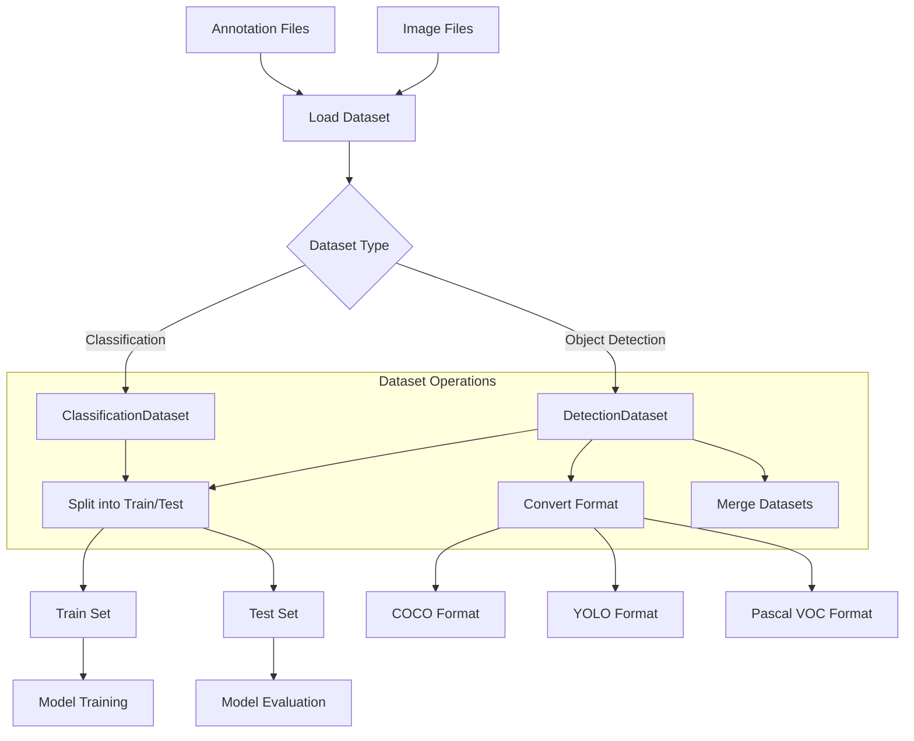
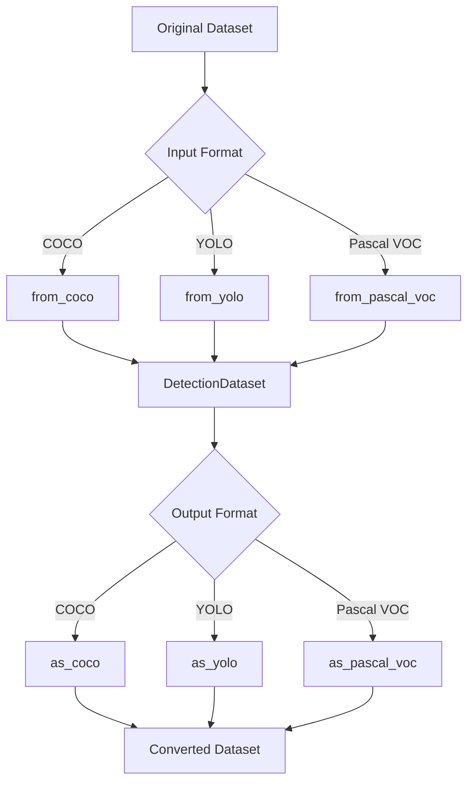
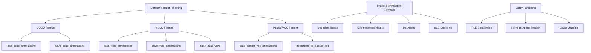
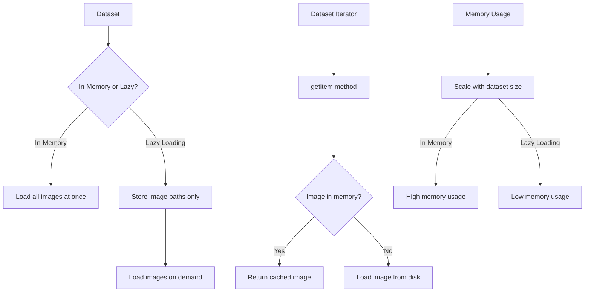

# Dataset Management

Relevant source files

- [supervision/classification/__init__.py](https://github.com/roboflow/supervision/blob/1d0747fb/supervision/classification/__init__.py)
- [supervision/classification/core.py](https://github.com/roboflow/supervision/blob/1d0747fb/supervision/classification/core.py)
- [supervision/dataset/core.py](https://github.com/roboflow/supervision/blob/1d0747fb/supervision/dataset/core.py)
- [supervision/dataset/formats/coco.py](https://github.com/roboflow/supervision/blob/1d0747fb/supervision/dataset/formats/coco.py)
- [supervision/dataset/formats/pascal_voc.py](https://github.com/roboflow/supervision/blob/1d0747fb/supervision/dataset/formats/pascal_voc.py)
- [supervision/dataset/formats/yolo.py](https://github.com/roboflow/supervision/blob/1d0747fb/supervision/dataset/formats/yolo.py)
- [supervision/dataset/utils.py](https://github.com/roboflow/supervision/blob/1d0747fb/supervision/dataset/utils.py)
- [test/dataset/formats/test_coco.py](https://github.com/roboflow/supervision/blob/1d0747fb/test/dataset/formats/test_coco.py)
- [test/dataset/formats/test_yolo.py](https://github.com/roboflow/supervision/blob/1d0747fb/test/dataset/formats/test_yolo.py)
- [test/dataset/test_utils.py](https://github.com/roboflow/supervision/blob/1d0747fb/test/dataset/test_utils.py)

This page documents the dataset management capabilities in the Supervision library. The Supervision dataset management system provides classes, methods, and utilities for efficiently loading, manipulating, and exporting computer vision datasets for object detection and image classification tasks.

Sources: [supervision/dataset/core.py39-897](https://github.com/roboflow/supervision/blob/1d0747fb/supervision/dataset/core.py#L39-L897)

## Overview

The dataset management system in Supervision is designed to handle multiple aspects of working with computer vision datasets:

1. **Dataset Representation**: Structured representation of detection and classification datasets
2. **Format Conversion**: Support for loading from and saving to common dataset formats (COCO, YOLO, Pascal VOC)
3. **Dataset Operations**: Splitting datasets into train/test sets, merging datasets
4. **Memory Efficiency**: Lazy loading of images to handle large datasets
5. **Dataset Preparation**: Utilities for manipulating and preparing datasets for training

The system is based on two primary dataset classes that handle different types of computer vision tasks:

- `DetectionDataset`: For object detection datasets
- `ClassificationDataset`: For image classification datasets

Both inherit from the abstract `BaseDataset` class that defines the common interface.

Sources: [supervision/dataset/core.py39-53](https://github.com/roboflow/supervision/blob/1d0747fb/supervision/dataset/core.py#L39-L53) [supervision/dataset/core.py54-666](https://github.com/roboflow/supervision/blob/1d0747fb/supervision/dataset/core.py#L54-L666) [supervision/dataset/core.py668-897](https://github.com/roboflow/supervision/blob/1d0747fb/supervision/dataset/core.py#L668-L897)

## Dataset Classes

### BaseDataset

`BaseDataset` is an abstract base class that defines the common interface for all dataset types in Supervision. It requires concrete implementations to provide:

- `__len__`: Returns the number of samples in the dataset
- `split`: Splits the dataset into training and testing subsets

Sources: [supervision/dataset/core.py39-53](https://github.com/roboflow/supervision/blob/1d0747fb/supervision/dataset/core.py#L39-L53)

### DetectionDataset

`DetectionDataset` implements the `BaseDataset` interface for object detection tasks. It stores a collection of images and their corresponding annotations in the form of `Detections` objects.

**Key Attributes:**

- `classes`: List of class names for the dataset
- `image_paths`: List of paths to the images
- `annotations`: Dictionary mapping image paths to `Detections` objects
- `_images_in_memory`: Optional dictionary for storing pre-loaded images

**Key Features:**

- Memory-efficient lazy loading of images
- Iterator interface for processing datasets in batches
- Format conversion to/from COCO, YOLO, and Pascal VOC
- Dataset splitting for train/test sets
- Dataset merging

Sources: [supervision/dataset/core.py54-666](https://github.com/roboflow/supervision/blob/1d0747fb/supervision/dataset/core.py#L54-L666)

### ClassificationDataset

`ClassificationDataset` implements the `BaseDataset` interface for image classification tasks. It stores a collection of images and their corresponding class labels in the form of `Classifications` objects.

**Key Attributes:**

- `classes`: List of class names for the dataset
- `image_paths`: List of paths to the images
- `annotations`: Dictionary mapping image paths to `Classifications` objects
- `_images_in_memory`: Optional dictionary for storing pre-loaded images

**Key Features:**

- Memory-efficient lazy loading of images
- Iterator interface for processing datasets in batches
- Support for folder-based dataset structures
- Dataset splitting for train/test sets

Sources: [supervision/dataset/core.py668-897](https://github.com/roboflow/supervision/blob/1d0747fb/supervision/dataset/core.py#L668-L897)

## Dataset Flow and Operations

The following diagram illustrates the typical workflow when using the dataset management system:



Sources: [supervision/dataset/core.py179-239](https://github.com/roboflow/supervision/blob/1d0747fb/supervision/dataset/core.py#L179-L239) [supervision/dataset/core.py763-823](https://github.com/roboflow/supervision/blob/1d0747fb/supervision/dataset/core.py#L763-L823)

## Working with DetectionDataset

### Creating a DetectionDataset

A `DetectionDataset` can be created directly by providing the class names, image paths, and annotations:

```
import supervision as sv

classes = ["person", "car", "dog"]
image_paths = ["image1.jpg", "image2.jpg", "image3.jpg"]
annotations = {
    "image1.jpg": sv.Detections(...),
    "image2.jpg": sv.Detections(...),
    "image3.jpg": sv.Detections(...)
}

dataset = sv.DetectionDataset(
    classes=classes,
    images=image_paths,
    annotations=annotations
)
```

Sources: [supervision/dataset/core.py72-102](https://github.com/roboflow/supervision/blob/1d0747fb/supervision/dataset/core.py#L72-L102)

### Loading from Supported Formats

The `DetectionDataset` class provides several class methods to load datasets from common formats:

**From COCO format:**

```
dataset = sv.DetectionDataset.from_coco(
    images_directory_path="path/to/images",
    annotations_path="path/to/annotations.json"
)
```

**From YOLO format:**

```
dataset = sv.DetectionDataset.from_yolo(
    images_directory_path="path/to/images",
    annotations_directory_path="path/to/labels",
    data_yaml_path="path/to/data.yaml"
)
```

**From Pascal VOC format:**

```
dataset = sv.DetectionDataset.from_pascal_voc(
    images_directory_path="path/to/images",
    annotations_directory_path="path/to/annotations"
)
```

Sources: [supervision/dataset/core.py391-608](https://github.com/roboflow/supervision/blob/1d0747fb/supervision/dataset/core.py#L391-L608)

### Exporting to Supported Formats

The `DetectionDataset` class also provides methods to export datasets to common formats:

**To COCO format:**

```
dataset.as_coco(
    images_directory_path="path/to/output/images",
    annotations_path="path/to/output/annotations.json"
)
```

**To YOLO format:**

```
dataset.as_yolo(
    images_directory_path="path/to/output/images",
    annotations_directory_path="path/to/output/labels",
    data_yaml_path="path/to/output/data.yaml"
)
```

**To Pascal VOC format:**

```
dataset.as_pascal_voc(
    images_directory_path="path/to/output/images",
    annotations_directory_path="path/to/output/annotations"
)
```

Sources: [supervision/dataset/core.py334-665](https://github.com/roboflow/supervision/blob/1d0747fb/supervision/dataset/core.py#L334-L665)

### Dataset Format Conversion Flow



Sources: [supervision/dataset/core.py334-608](https://github.com/roboflow/supervision/blob/1d0747fb/supervision/dataset/core.py#L334-L608)

### Memory-Efficient Processing

The `DetectionDataset` class is designed to be memory-efficient by default. It loads images on-demand rather than storing all images in memory at once. This is especially important for large datasets.

To iterate through a dataset efficiently:

```
# Process all images in the dataset without loading everything into memory
for image_path, image, annotation in dataset:
    # Process each image and its annotations
    processed_image = process_image(image, annotation)
    # ...
```

Sources: [supervision/dataset/core.py133-155](https://github.com/roboflow/supervision/blob/1d0747fb/supervision/dataset/core.py#L133-L155)

### Splitting Datasets

Datasets can be split into training and testing subsets:

```
# Split the dataset with 80% for training and 20% for testing
train_dataset, test_dataset = dataset.split(
    split_ratio=0.8,
    random_state=42,  # For reproducibility
    shuffle=True      # Shuffle before splitting
)
```

Sources: [supervision/dataset/core.py179-239](https://github.com/roboflow/supervision/blob/1d0747fb/supervision/dataset/core.py#L179-L239)

### Merging Datasets

Multiple datasets can be merged into a single dataset:

```
# Merge multiple datasets
merged_dataset = sv.DetectionDataset.merge([dataset1, dataset2, dataset3])
```

Sources: [supervision/dataset/core.py241-332](https://github.com/roboflow/supervision/blob/1d0747fb/supervision/dataset/core.py#L241-L332)

## Working with ClassificationDataset

### Creating a ClassificationDataset

A `ClassificationDataset` can be created directly by providing the class names, image paths, and annotations:

```
import supervision as sv

classes = ["cat", "dog", "bird"]
image_paths = ["image1.jpg", "image2.jpg", "image3.jpg"]
annotations = {
    "image1.jpg": sv.Classifications(...),
    "image2.jpg": sv.Classifications(...),
    "image3.jpg": sv.Classifications(...)
}

dataset = sv.ClassificationDataset(
    classes=classes,
    images=image_paths,
    annotations=annotations
)
```

Sources: [supervision/dataset/core.py682-706](https://github.com/roboflow/supervision/blob/1d0747fb/supervision/dataset/core.py#L682-L706)

### Loading from Folder Structure

Classification datasets are often organized in a folder structure where each subfolder represents a class. `ClassificationDataset` provides a method to load from such structures:

```
dataset = sv.ClassificationDataset.from_folder_structure(
    root_directory_path="path/to/dataset"
)
```

The expected folder structure is:

```
path/to/dataset/
├── class1/
│   ├── image1.jpg
│   ├── image2.jpg
│   └── ...
├── class2/
│   ├── image3.jpg
│   ├── image4.jpg
│   └── ...
└── ...
```

Sources: [supervision/dataset/core.py850-897](https://github.com/roboflow/supervision/blob/1d0747fb/supervision/dataset/core.py#L850-L897)

### Exporting to Folder Structure

Classification datasets can be exported to a folder structure:

```
dataset.as_folder_structure(
    root_directory_path="path/to/output/dataset"
)
```

Sources: [supervision/dataset/core.py825-848](https://github.com/roboflow/supervision/blob/1d0747fb/supervision/dataset/core.py#L825-L848)

### Splitting Classification Datasets

Similar to detection datasets, classification datasets can also be split into training and testing subsets:

```
train_dataset, test_dataset = dataset.split(
    split_ratio=0.8,
    random_state=42,
    shuffle=True
)
```

Sources: [supervision/dataset/core.py763-823](https://github.com/roboflow/supervision/blob/1d0747fb/supervision/dataset/core.py#L763-L823)

## Dataset Format Support Details

### Dataset Format Handling Architecture



Sources: [supervision/dataset/formats/coco.py162-258](https://github.com/roboflow/supervision/blob/1d0747fb/supervision/dataset/formats/coco.py#L162-L258) [supervision/dataset/formats/yolo.py124-289](https://github.com/roboflow/supervision/blob/1d0747fb/supervision/dataset/formats/yolo.py#L124-L289) [supervision/dataset/formats/pascal_voc.py137-272](https://github.com/roboflow/supervision/blob/1d0747fb/supervision/dataset/formats/pascal_voc.py#L137-L272)

### COCO Format Support

The COCO (Common Objects in Context) format is a widely used dataset format for object detection, segmentation, and keypoints. Supervision provides comprehensive support for both importing from and exporting to COCO format.

Key features of COCO format support:

- Support for both bounding box and segmentation annotations
- Automatic determination of segmentation format (polygon vs. RLE)
- Consistent handling of class IDs across formats

Sources: [supervision/dataset/formats/coco.py162-258](https://github.com/roboflow/supervision/blob/1d0747fb/supervision/dataset/formats/coco.py#L162-L258)

### YOLO Format Support

YOLO (You Only Look Once) format is commonly used with YOLO-based detection models. It consists of text files with normalized coordinates and class indices.

Key features of YOLO format support:

- Support for both bounding box and polygon annotations
- Optional oriented bounding box (OBB) support
- Consistent data.yaml file generation

Sources: [supervision/dataset/formats/yolo.py124-289](https://github.com/roboflow/supervision/blob/1d0747fb/supervision/dataset/formats/yolo.py#L124-L289)

### Pascal VOC Format Support

Pascal VOC format uses XML files to store annotations, including bounding boxes and object class information.

Key features of Pascal VOC format support:

- Consistent XML structure for annotations
- Support for polygon segmentation masks
- Proper handling of class indices

Sources: [supervision/dataset/formats/pascal_voc.py137-272](https://github.com/roboflow/supervision/blob/1d0747fb/supervision/dataset/formats/pascal_voc.py#L137-L272)

## Utility Functions

The dataset management system includes several utility functions to help with common dataset operations:

### Train-Test Splitting

```
from supervision.dataset.utils import train_test_split

train_data, test_data = train_test_split(
    data=data_list,
    train_ratio=0.8,
    random_state=42,
    shuffle=True
)
```

Sources: [supervision/dataset/utils.py114-139](https://github.com/roboflow/supervision/blob/1d0747fb/supervision/dataset/utils.py#L114-L139)

### Class Index Mapping

For handling class indices across different datasets or formats:

```
from supervision.dataset.utils import build_class_index_mapping, map_detections_class_id

# Build mapping from source classes to target classes
mapping = build_class_index_mapping(
    source_classes=["dog", "cat"],
    target_classes=["cat", "dog", "bird"]
)

# Map detections from source to target class indices
mapped_detections = map_detections_class_id(
    source_to_target_mapping=mapping,
    detections=detections
)
```

Sources: [supervision/dataset/utils.py63-98](https://github.com/roboflow/supervision/blob/1d0747fb/supervision/dataset/utils.py#L63-L98)

### Mask Operations

Functions for working with segmentation masks:

```
from supervision.dataset.utils import mask_to_rle, rle_to_mask, approximate_mask_with_polygons

# Convert mask to Run-Length Encoding (RLE)
rle = mask_to_rle(mask=mask)

# Convert RLE back to mask
mask = rle_to_mask(rle=rle, resolution_wh=(width, height))

# Approximate mask with polygons (for efficient storage)
polygons = approximate_mask_with_polygons(
    mask=mask,
    min_image_area_percentage=0.0,
    max_image_area_percentage=1.0,
    approximation_percentage=0.75
)
```

Sources: [supervision/dataset/utils.py25-259](https://github.com/roboflow/supervision/blob/1d0747fb/supervision/dataset/utils.py#L25-L259)

## Memory Management

### Memory-Efficient Design Patterns




The dataset classes in Supervision are designed with memory efficiency in mind. By default, they use a lazy loading approach where images are loaded from disk only when needed, rather than storing all images in memory at once.

This pattern is particularly important for large datasets that might not fit entirely in memory. The key aspect of this design is the separation between metadata (annotations, class information) and the actual image data.

Sources: [supervision/dataset/core.py124-155](https://github.com/roboflow/supervision/blob/1d0747fb/supervision/dataset/core.py#L124-L155) [supervision/dataset/core.py708-739](https://github.com/roboflow/supervision/blob/1d0747fb/supervision/dataset/core.py#L708-L739)

## Conclusion

The Dataset Management system in Supervision provides a comprehensive set of tools for working with computer vision datasets. It supports different types of datasets (detection and classification), various formats (COCO, YOLO, Pascal VOC), and provides utilities for common operations like splitting and merging datasets.

The memory-efficient design allows for working with large datasets, and the consistent API makes it easy to switch between different dataset formats and tasks.

For more information about other components of the Supervision library, refer to the following pages:

- [Detection System](https://deepwiki.com/roboflow/supervision/2.1-detection-system)
- [Annotation System](https://deepwiki.com/roboflow/supervision/2.2-annotation-system)
- [Tracking System](https://deepwiki.com/roboflow/supervision/2.4-tracking-system)
- [Metrics System](https://deepwiki.com/roboflow/supervision/2.5-metrics-system)