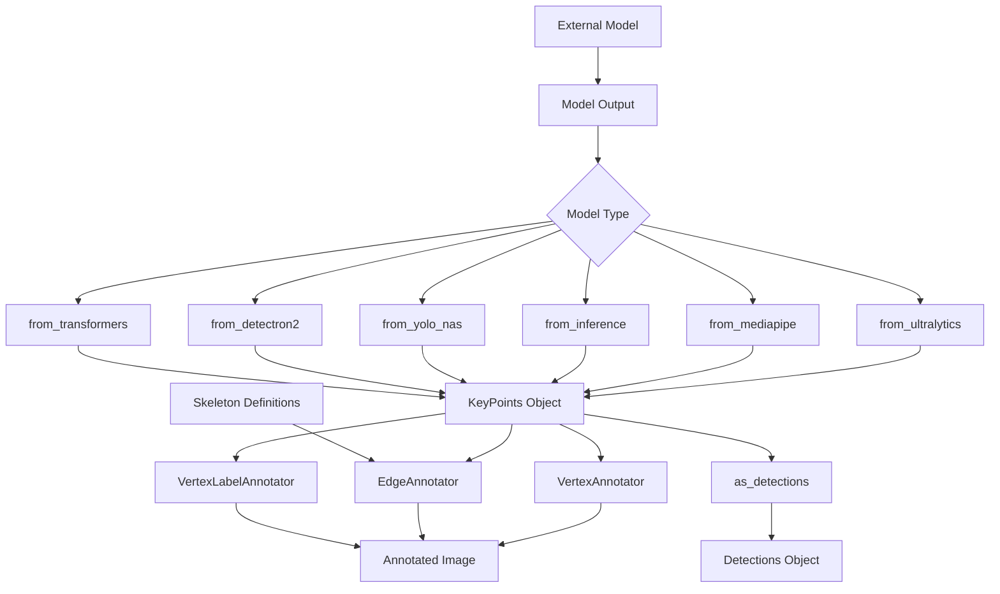
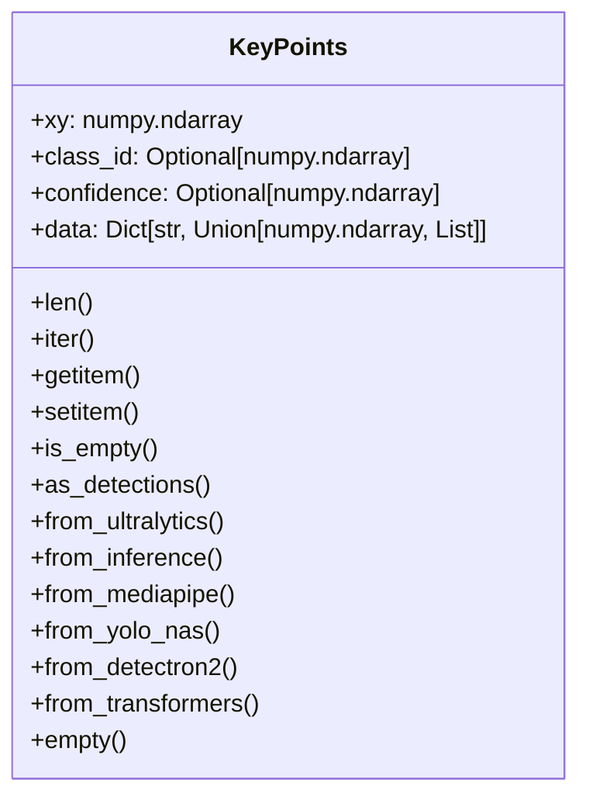
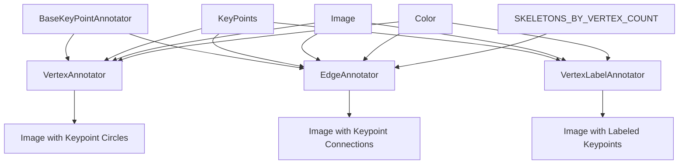
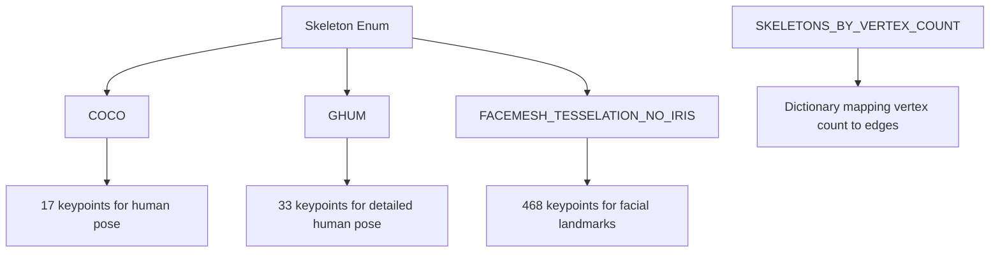
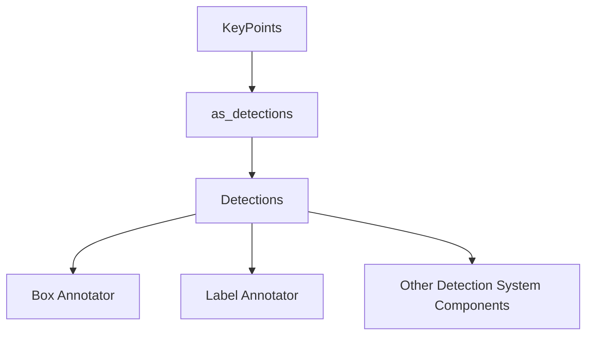

# KeyPoint System

Relevant source files

- [docs/detection/tools/line_zone.md](https://github.com/roboflow/supervision/blob/1d0747fb/docs/detection/tools/line_zone.md)
- [docs/detection/tools/polygon_zone.md](https://github.com/roboflow/supervision/blob/1d0747fb/docs/detection/tools/polygon_zone.md)
- [docs/keypoint/annotators.md](https://github.com/roboflow/supervision/blob/1d0747fb/docs/keypoint/annotators.md)
- [supervision/keypoint/annotators.py](https://github.com/roboflow/supervision/blob/1d0747fb/supervision/keypoint/annotators.py)
- [supervision/keypoint/core.py](https://github.com/roboflow/supervision/blob/1d0747fb/supervision/keypoint/core.py)
- [supervision/keypoint/skeletons.py](https://github.com/roboflow/supervision/blob/1d0747fb/supervision/keypoint/skeletons.py)

The KeyPoint System in Supervision provides a standardized way to represent, manipulate, and visualize keypoints from various pose estimation and landmark detection models. This system converts the outputs from different model frameworks into a consistent format and offers tools for visualization and analysis.

## Overview and Architecture

The KeyPoint System consists of three primary components:

1. **KeyPoints Class**: Core data structure for representing keypoint data
2. **Annotators**: Tools for visualizing keypoints on images
3. **Skeleton Definitions**: Predefined keypoint connection patterns



Sources: [supervision/keypoint/core.py15-774](https://github.com/roboflow/supervision/blob/1d0747fb/supervision/keypoint/core.py#L15-L774) [supervision/keypoint/annotators.py18-442](https://github.com/roboflow/supervision/blob/1d0747fb/supervision/keypoint/annotators.py#L18-L442)

## KeyPoints Class

The `KeyPoints` class is the central data structure of the system that standardizes results from various keypoint detection and pose estimation models.

### Structure and Attributes





- **xy**: A NumPy array of shape `(n, m, 2)` containing `n` detected objects, each with `m` keypoints where each keypoint is represented as `[x, y]` coordinates.
- **class_id**: An optional NumPy array of shape `(n,)` containing the class IDs of each detected object.
- **confidence**: An optional NumPy array of shape `(n, m)` containing confidence scores for each keypoint.
- **data**: A dictionary containing additional data (such as class names) for the detected objects.

Sources: [supervision/keypoint/core.py15-109](https://github.com/roboflow/supervision/blob/1d0747fb/supervision/keypoint/core.py#L15-L109)

### Model Adapters

The `KeyPoints` class includes several class methods to convert results from different model frameworks:

|Method|Description|
|---|---|
|`from_ultralytics()`|Converts YOLOv8-pose, YOLO11-pose results|
|`from_inference()`|Converts Roboflow API or Inference package results|
|`from_mediapipe()`|Converts MediaPipe pose/face landmark results|
|`from_yolo_nas()`|Converts YOLO-NAS pose estimation results|
|`from_detectron2()`|Converts Detectron2 keypoint detection results|
|`from_transformers()`|Converts Hugging Face Transformers keypoint results|

Sources: [supervision/keypoint/core.py159-598](https://github.com/roboflow/supervision/blob/1d0747fb/supervision/keypoint/core.py#L159-L598)

### Utility Methods

The `KeyPoints` class provides several utility methods:

- **as_detections()**: Converts keypoints to a `Detections` object by calculating bounding boxes that encompass the keypoints.
- **is_empty()**: Checks if the `KeyPoints` object has no keypoints.
- **empty()**: Creates an empty `KeyPoints` object.
- **Indexing and Iteration**: Supports indexing with integers, slices, lists, NumPy arrays, and string keys, as well as iteration over keypoints.

Sources: [supervision/keypoint/core.py600-774](https://github.com/roboflow/supervision/blob/1d0747fb/supervision/keypoint/core.py#L600-L774)

## Annotators

The KeyPoint System includes three types of annotators for visualizing keypoints on images:




Sources: [supervision/keypoint/annotators.py18-442](https://github.com/roboflow/supervision/blob/1d0747fb/supervision/keypoint/annotators.py#L18-L442) [supervision/keypoint/skeletons.py1-1760](https://github.com/roboflow/supervision/blob/1d0747fb/supervision/keypoint/skeletons.py#L1-L1760)

### VertexAnnotator

The `VertexAnnotator` draws circular points at keypoint locations with customizable color and radius.

```
vertex_annotator = sv.VertexAnnotator(
    color=sv.Color.GREEN,
    radius=10
)
annotated_image = vertex_annotator.annotate(
    scene=image.copy(),
    key_points=keypoints
)
```

Sources: [supervision/keypoint/annotators.py24-96](https://github.com/roboflow/supervision/blob/1d0747fb/supervision/keypoint/annotators.py#L24-L96)

### EdgeAnnotator

The `EdgeAnnotator` draws lines connecting keypoints based on predefined skeleton structures or custom edge definitions.

```
edge_annotator = sv.EdgeAnnotator(
    color=sv.Color.GREEN,
    thickness=5,
    edges=None  # Will use predefined skeleton based on number of keypoints
)
annotated_image = edge_annotator.annotate(
    scene=image.copy(),
    key_points=keypoints
)
```

Sources: [supervision/keypoint/annotators.py99-188](https://github.com/roboflow/supervision/blob/1d0747fb/supervision/keypoint/annotators.py#L99-L188)

### VertexLabelAnnotator

The `VertexLabelAnnotator` adds text labels to keypoints with customizable styling.

```
vertex_label_annotator = sv.VertexLabelAnnotator(
    color=sv.Color.GREEN,
    text_color=sv.Color.BLACK,
    text_scale=0.5,
    border_radius=5
)
annotated_image = vertex_label_annotator.annotate(
    scene=image.copy(),
    key_points=keypoints,
    labels=["nose", "left_eye", "right_eye", ...]  # Optional custom labels
)
```

Sources: [supervision/keypoint/annotators.py191-442](https://github.com/roboflow/supervision/blob/1d0747fb/supervision/keypoint/annotators.py#L191-L442)

## Skeleton Definitions

The KeyPoint System includes predefined skeleton definitions for common keypoint formats through the `Skeleton` enum:




Each skeleton is defined as a tuple of edge connections, where each edge is a tuple of two keypoint indices.

Sources: [supervision/keypoint/skeletons.py1-1760](https://github.com/roboflow/supervision/blob/1d0747fb/supervision/keypoint/skeletons.py#L1-L1760)

## Integration with Detection System

The KeyPoint System integrates with Supervision's Detection System through the `as_detections()` method, which allows converting keypoints to bounding box detections:


Aquí tienes el diagrama en Mermaid:


This integration allows leveraging all the functionality of the Detection System for keypoint-based objects.

Sources: [supervision/keypoint/core.py712-774](https://github.com/roboflow/supervision/blob/1d0747fb/supervision/keypoint/core.py#L712-L774)

## Usage Examples

### Human Pose Estimation with YOLOv8

```
import cv2
import supervision as sv
from ultralytics import YOLO

# Load image and model
image = cv2.imread("person.jpg")
model = YOLO("yolov8s-pose.pt")

# Perform inference
result = model(image)[0]

# Convert to KeyPoints
keypoints = sv.KeyPoints.from_ultralytics(result)

# Create annotators
vertex_annotator = sv.VertexAnnotator(radius=5)
edge_annotator = sv.EdgeAnnotator(thickness=2)

# Annotate image
annotated_image = image.copy()
annotated_image = vertex_annotator.annotate(annotated_image, keypoints)
annotated_image = edge_annotator.annotate(annotated_image, keypoints)

# Display or save result
cv2.imwrite("annotated_pose.jpg", annotated_image)
```

### Face Landmark Detection with MediaPipe

```
import cv2
import mediapipe as mp
import supervision as sv

# Load image
image = cv2.imread("face.jpg")
image_height, image_width, _ = image.shape

# Create MediaPipe image
mediapipe_image = mp.Image(
    image_format=mp.ImageFormat.SRGB,
    data=cv2.cvtColor(image, cv2.COLOR_BGR2RGB)
)

# Set up face landmarker
options = mp.tasks.vision.FaceLandmarkerOptions(
    base_options=mp.tasks.BaseOptions(
        model_asset_path="face_landmarker.task"
    ),
    output_face_blendshapes=True,
    output_facial_transformation_matrixes=True,
    num_faces=1
)

# Perform detection
with mp.tasks.vision.FaceLandmarker.create_from_options(options) as landmarker:
    face_landmarker_result = landmarker.detect(mediapipe_image)

# Convert to KeyPoints
keypoints = sv.KeyPoints.from_mediapipe(
    face_landmarker_result, 
    (image_width, image_height)
)

# Create annotators
vertex_annotator = sv.VertexAnnotator(radius=1)
edge_annotator = sv.EdgeAnnotator(thickness=1)

# Annotate image
annotated_image = image.copy()
annotated_image = vertex_annotator.annotate(annotated_image, keypoints)
annotated_image = edge_annotator.annotate(annotated_image, keypoints)

# Display or save result
cv2.imwrite("annotated_face.jpg", annotated_image)
```

## Summary

The KeyPoint System in Supervision provides a comprehensive solution for working with keypoint-based model outputs. The `KeyPoints` class standardizes results from various frameworks, while the annotators enable effective visualization. The system's integration with the broader Detection System allows for seamless workflows in applications like pose estimation, face landmark detection, and other keypoint-based computer vision tasks.