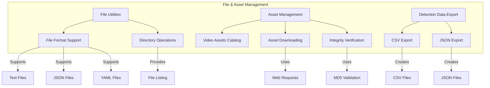
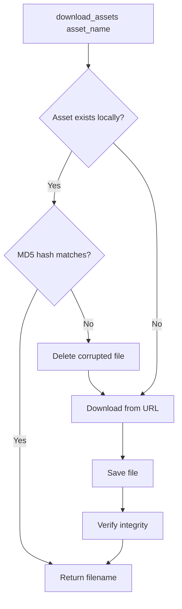
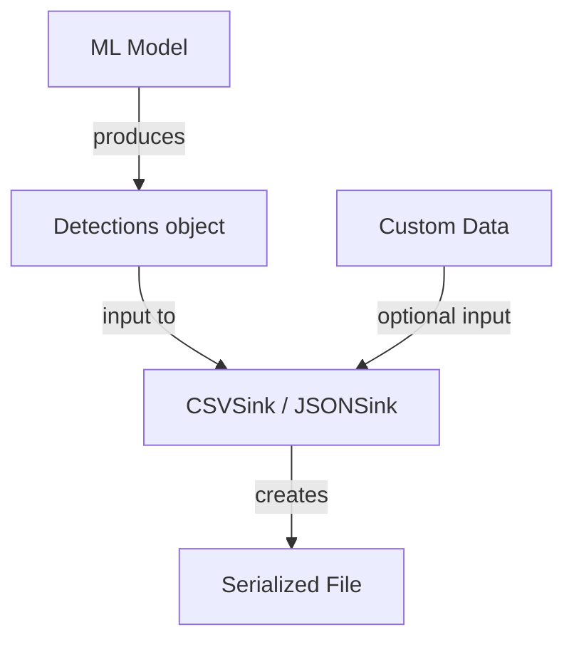
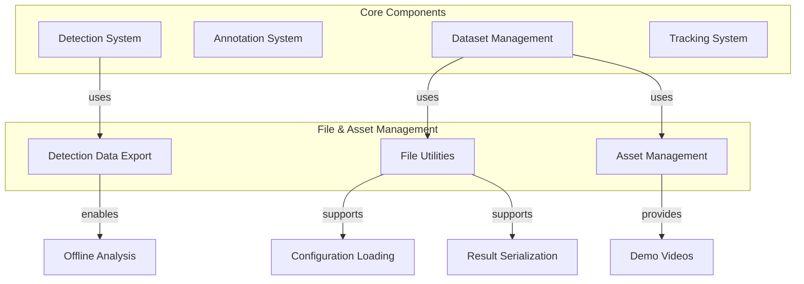

# File & Asset Management

Relevant source files

- [docs/assets.md](https://github.com/roboflow/supervision/blob/1d0747fb/docs/assets.md)
- [docs/detection/metrics.md](https://github.com/roboflow/supervision/blob/1d0747fb/docs/detection/metrics.md)
- [docs/detection/tools/save_detections.md](https://github.com/roboflow/supervision/blob/1d0747fb/docs/detection/tools/save_detections.md)
- [docs/how_to/save_detections.md](https://github.com/roboflow/supervision/blob/1d0747fb/docs/how_to/save_detections.md)
- [docs/trackers.md](https://github.com/roboflow/supervision/blob/1d0747fb/docs/trackers.md)
- [supervision/assets/__init__.py](https://github.com/roboflow/supervision/blob/1d0747fb/supervision/assets/__init__.py)
- [supervision/assets/downloader.py](https://github.com/roboflow/supervision/blob/1d0747fb/supervision/assets/downloader.py)
- [supervision/assets/list.py](https://github.com/roboflow/supervision/blob/1d0747fb/supervision/assets/list.py)
- [supervision/detection/tools/csv_sink.py](https://github.com/roboflow/supervision/blob/1d0747fb/supervision/detection/tools/csv_sink.py)
- [supervision/detection/tools/json_sink.py](https://github.com/roboflow/supervision/blob/1d0747fb/supervision/detection/tools/json_sink.py)
- [supervision/utils/file.py](https://github.com/roboflow/supervision/blob/1d0747fb/supervision/utils/file.py)

This document covers the file operation utilities and asset management capabilities provided by the Supervision library. These components enable you to handle various file formats, download demonstration assets, and export detection results to different serialized formats.

For information about video and image processing utilities, see [Video & Image Processing](https://deepwiki.com/roboflow/supervision/3.3-video-and-image-processing). For details on saving detection results, see the section on Detection data export below.

## System Overview



Sources: [supervision/utils/file.py](https://github.com/roboflow/supervision/blob/1d0747fb/supervision/utils/file.py) [supervision/assets/downloader.py](https://github.com/roboflow/supervision/blob/1d0747fb/supervision/assets/downloader.py) [supervision/assets/list.py](https://github.com/roboflow/supervision/blob/1d0747fb/supervision/assets/list.py) [supervision/detection/tools/csv_sink.py](https://github.com/roboflow/supervision/blob/1d0747fb/supervision/detection/tools/csv_sink.py) [supervision/detection/tools/json_sink.py](https://github.com/roboflow/supervision/blob/1d0747fb/supervision/detection/tools/json_sink.py)

## File Utilities

The file utilities module provides a set of functions for common file operations, supporting various file formats including text, JSON, and YAML.

### File Operations API


Sources: [supervision/utils/file.py9-17](https://github.com/roboflow/supervision/blob/1d0747fb/supervision/utils/file.py#L9-L17) [supervision/utils/file.py20-57](https://github.com/roboflow/supervision/blob/1d0747fb/supervision/utils/file.py#L20-L57) [supervision/utils/file.py60-149](https://github.com/roboflow/supervision/blob/1d0747fb/supervision/utils/file.py#L60-L149)

### Text File Operations

The library provides simple utilities for reading and writing text files:

- `read_txt_file`: Reads a text file and returns content as a list of strings
- `save_text_file`: Writes a list of strings to a text file

### JSON File Operations

JSON operations are enhanced with support for NumPy data types:

- `read_json_file`: Reads a JSON file and returns a dictionary
- `save_json_file`: Writes a dictionary to a JSON file using the `NumpyJsonEncoder`

The `NumpyJsonEncoder` class extends the standard JSON encoder to handle NumPy's numerical data types and arrays, ensuring seamless serialization of detection results that contain NumPy arrays.

### YAML File Operations

For configuration and metadata:

- `read_yaml_file`: Reads a YAML file and returns a dictionary
- `save_yaml_file`: Writes a dictionary to a YAML file

### Directory Operations

- `list_files_with_extensions`: Lists files in a directory, optionally filtered by file extensions

## Asset Management

The asset management system provides access to video assets that can be used for demonstrations, examples, and testing.

### Video Assets Catalog

Sources: [supervision/assets/list.py7-40](https://github.com/roboflow/supervision/blob/1d0747fb/supervision/assets/list.py#L7-L40) [supervision/assets/list.py42-83](https://github.com/roboflow/supervision/blob/1d0747fb/supervision/assets/list.py#L42-L83)

The `VideoAssets` enum provides a catalog of available video assets that can be downloaded and used for testing or demonstrations. Each enum value corresponds to a specific video file.

### Asset Download Process


Sources: [supervision/assets/downloader.py13-33](https://github.com/roboflow/supervision/blob/1d0747fb/supervision/assets/downloader.py#L13-L33) [supervision/assets/downloader.py35-86](https://github.com/roboflow/supervision/blob/1d0747fb/supervision/assets/downloader.py#L35-L86)

The asset download process includes:

1. Checking if the requested asset exists locally
2. Verifying the integrity of existing assets using MD5 hash
3. Downloading assets if they don't exist or are corrupted
4. Displaying a progress bar during downloads

### Usage Example

```
from supervision.assets import download_assets, VideoAssets

# Download a specific video asset
video_path = download_assets(VideoAssets.VEHICLES)
```

## Detection Data Export

Supervision provides utilities for exporting detection results to CSV and JSON formats, making it easy to store and share detection data.

### Export Components

Sources: [supervision/detection/tools/csv_sink.py20-181](https://github.com/roboflow/supervision/blob/1d0747fb/supervision/detection/tools/csv_sink.py#L20-L181) [supervision/detection/tools/json_sink.py10-143](https://github.com/roboflow/supervision/blob/1d0747fb/supervision/detection/tools/json_sink.py#L10-L143)

### Export Workflow



Sources: [docs/how_to/save_detections.md74-146](https://github.com/roboflow/supervision/blob/1d0747fb/docs/how_to/save_detections.md#L74-L146) [docs/how_to/save_detections.md147-228](https://github.com/roboflow/supervision/blob/1d0747fb/docs/how_to/save_detections.md#L147-L228)

Both `CSVSink` and `JSONSink` follow a similar workflow:

1. Initialize the sink with a target file path
2. Open the file when entering the context manager
3. Append detection data as it becomes available
4. Close and finalize the file when exiting the context manager

### Usage Example

```
import supervision as sv
from ultralytics import YOLO

model = YOLO("yolov8n.pt")
frames_generator = sv.get_video_frames_generator("video.mp4")

# Export to CSV
with sv.CSVSink("detections.csv") as sink:
    for frame_index, frame in enumerate(frames_generator):
        results = model(frame)[0]
        detections = sv.Detections.from_ultralytics(results)
        sink.append(detections, {"frame_index": frame_index})

# Export to JSON
with sv.JSONSink("detections.json") as sink:
    for frame_index, frame in enumerate(frames_generator):
        results = model(frame)[0]
        detections = sv.Detections.from_ultralytics(results)
        sink.append(detections, {"frame_index": frame_index})
```

## Integration with System Components

The File & Asset Management system serves as a foundational layer that supports other components of the Supervision library.



Sources: [supervision/utils/file.py](https://github.com/roboflow/supervision/blob/1d0747fb/supervision/utils/file.py) [supervision/assets/downloader.py](https://github.com/roboflow/supervision/blob/1d0747fb/supervision/assets/downloader.py) [supervision/detection/tools/csv_sink.py](https://github.com/roboflow/supervision/blob/1d0747fb/supervision/detection/tools/csv_sink.py) [supervision/detection/tools/json_sink.py](https://github.com/roboflow/supervision/blob/1d0747fb/supervision/detection/tools/json_sink.py)

## Summary

The File & Asset Management system in Supervision provides:

1. File utilities for working with text, JSON, and YAML files
2. Asset management for accessing demo video content
3. Export utilities for saving detection results in CSV and JSON formats

These components support various workflows in the Supervision library, from configuration to result storage and analysis.