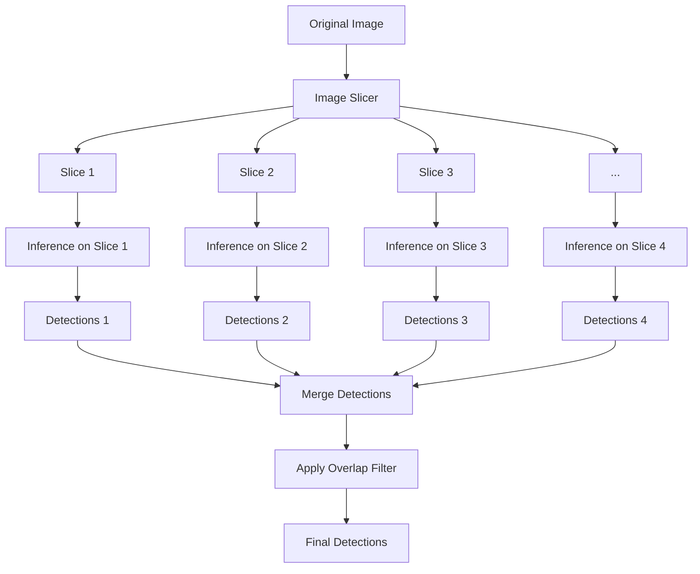
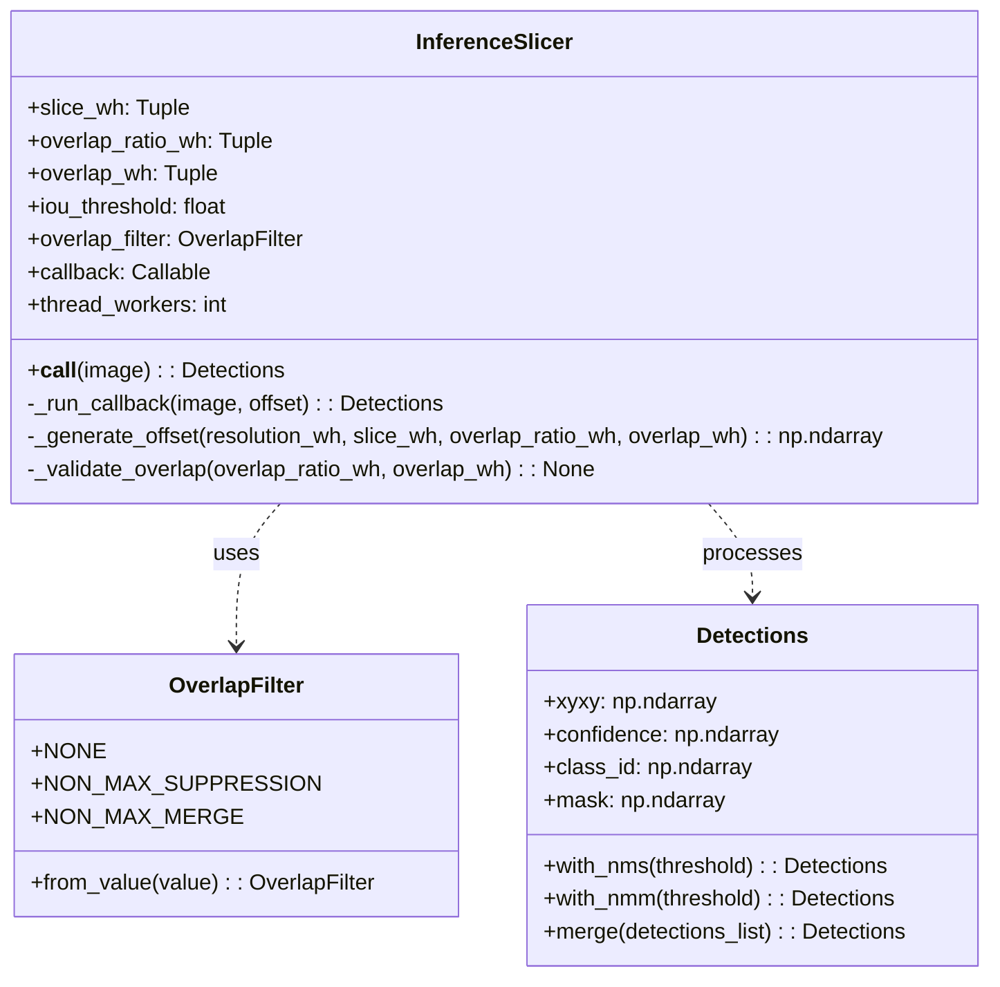
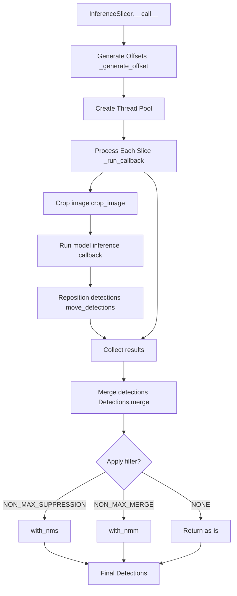
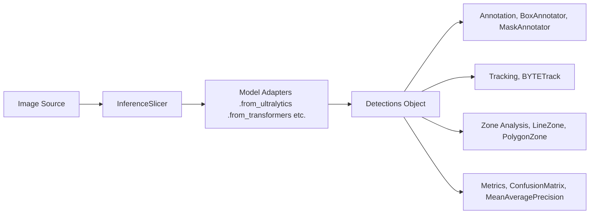

# Inference Tools

Relevant source files

- [docs/datasets/utils.md](https://github.com/roboflow/supervision/blob/1d0747fb/docs/datasets/utils.md)
- [docs/detection/double_detection_filter.md](https://github.com/roboflow/supervision/blob/1d0747fb/docs/detection/double_detection_filter.md)
- [docs/detection/tools/inference_slicer.md](https://github.com/roboflow/supervision/blob/1d0747fb/docs/detection/tools/inference_slicer.md)
- [docs/detection/utils.md](https://github.com/roboflow/supervision/blob/1d0747fb/docs/detection/utils.md)
- [supervision/detection/tools/inference_slicer.py](https://github.com/roboflow/supervision/blob/1d0747fb/supervision/detection/tools/inference_slicer.py)

## Overview

Inference Tools in Supervision provide specialized utilities to enhance the performance and capabilities of object detection models. These tools address common challenges in computer vision inference, particularly for detecting small objects or applying models to large images. This document covers the implementation and usage of the `InferenceSlicer` class, which enables efficient processing of large images through slicing techniques.

For information about other detection tools like zone-based counting and filtering, see [Zone Tools](https://deepwiki.com/roboflow/supervision/3.1-zone-tools).

Sources: [supervision/detection/tools/inference_slicer.py51-289](https://github.com/roboflow/supervision/blob/1d0747fb/supervision/detection/tools/inference_slicer.py#L51-L289)

## InferenceSlicer

The `InferenceSlicer` class implements Slicing Adaptive Inference (SAHI), a technique for improving small object detection. This approach divides a larger image into smaller, potentially overlapping slices, performs inference on each slice, and then merges the results.

### How It Works



Sources: [supervision/detection/tools/inference_slicer.py51-58](https://github.com/roboflow/supervision/blob/1d0747fb/supervision/detection/tools/inference_slicer.py#L51-L58) [supervision/detection/tools/inference_slicer.py113-176](https://github.com/roboflow/supervision/blob/1d0747fb/supervision/detection/tools/inference_slicer.py#L113-L176)

### Key Components and Parameters

`InferenceSlicer` provides several configuration options to control the slicing process:

|Parameter|Type|Description|
|---|---|---|
|`callback`|Callable|Function that performs inference on a given image slice|
|`slice_wh`|Tuple[int, int]|Width and height of each slice in pixels|
|`overlap_wh`|Optional[Tuple[int, int]]|Pixel overlap between consecutive slices|
|`overlap_ratio_wh`|Optional[Tuple[float, float]]|Deprecated: Overlap ratio between slices (0-1)|
|`overlap_filter`|Union[OverlapFilter, str]|Strategy for filtering overlapping detections|
|`iou_threshold`|float|IoU threshold for filtering operations|
|`thread_workers`|int|Number of threads for parallel execution|

Sources: [supervision/detection/tools/inference_slicer.py83-95](https://github.com/roboflow/supervision/blob/1d0747fb/supervision/detection/tools/inference_slicer.py#L83-L95)

### Implementation Details



Sources: [supervision/detection/tools/inference_slicer.py86-111](https://github.com/roboflow/supervision/blob/1d0747fb/supervision/detection/tools/inference_slicer.py#L86-L111) [supervision/detection/tools/inference_slicer.py178-196](https://github.com/roboflow/supervision/blob/1d0747fb/supervision/detection/tools/inference_slicer.py#L178-L196) [supervision/detection/tools/inference_slicer.py199-258](https://github.com/roboflow/supervision/blob/1d0747fb/supervision/detection/tools/inference_slicer.py#L199-L258) [supervision/detection/tools/inference_slicer.py261-288](https://github.com/roboflow/supervision/blob/1d0747fb/supervision/detection/tools/inference_slicer.py#L261-L288)

### Slicing Process

The slicing process follows these key steps:

1. Generate slice offsets based on image dimensions, slice size, and overlap settings
2. For each slice:
    - Crop the region from the original image
    - Run inference using the provided callback function
    - Move detected objects to correct coordinates in original image
3. Merge all detections from all slices
4. Apply specified overlap filtering strategy



Sources: [supervision/detection/tools/inference_slicer.py113-176](https://github.com/roboflow/supervision/blob/1d0747fb/supervision/detection/tools/inference_slicer.py#L113-L176) [supervision/detection/tools/inference_slicer.py199-258](https://github.com/roboflow/supervision/blob/1d0747fb/supervision/detection/tools/inference_slicer.py#L199-L258)

### Helper Functions

The `InferenceSlicer` class uses several helper functions:

1. `move_detections`: Repositions detection coordinates from a slice to the original image
2. `_generate_offset`: Creates coordinates for each slice based on image size and overlap settings
3. `_run_callback`: Executes the inference callback on a specific image slice
4. `_validate_overlap`: Validates the overlap parameters

Sources: [supervision/detection/tools/inference_slicer.py18-48](https://github.com/roboflow/supervision/blob/1d0747fb/supervision/detection/tools/inference_slicer.py#L18-L48) [supervision/detection/tools/inference_slicer.py178-196](https://github.com/roboflow/supervision/blob/1d0747fb/supervision/detection/tools/inference_slicer.py#L178-L196) [supervision/detection/tools/inference_slicer.py199-258](https://github.com/roboflow/supervision/blob/1d0747fb/supervision/detection/tools/inference_slicer.py#L199-L258) [supervision/detection/tools/inference_slicer.py261-288](https://github.com/roboflow/supervision/blob/1d0747fb/supervision/detection/tools/inference_slicer.py#L261-L288)

## Overlap Filtering Strategies

After merging detections from all slices, `InferenceSlicer` can apply one of several filtering strategies to handle overlapping detections:

|Strategy|Description|
|---|---|
|`OverlapFilter.NONE`|No filtering applied; all detections are kept|
|`OverlapFilter.NON_MAX_SUPPRESSION`|Standard NMS to remove lower confidence detections that overlap significantly|
|`OverlapFilter.NON_MAX_MERGE`|Merge overlapping detections instead of removing them|

Sources: [supervision/detection/tools/inference_slicer.py165-176](https://github.com/roboflow/supervision/blob/1d0747fb/supervision/detection/tools/inference_slicer.py#L165-L176)

## Usage Example

Here's a typical workflow for using `InferenceSlicer` with a YOLO model:

```
import cv2
import supervision as sv
from ultralytics import YOLO

# Load model and image
model = YOLO("yolov8n.pt")
image = cv2.imread("large_image.jpg")

# Define callback function for inference
def callback(image_slice):
    result = model(image_slice)[0]
    return sv.Detections.from_ultralytics(result)

# Create InferenceSlicer with desired configuration
slicer = sv.InferenceSlicer(
    callback=callback,
    slice_wh=(640, 640),  # Slice dimensions
    overlap_wh=(100, 100),  # Overlap between slices
    overlap_filter=sv.OverlapFilter.NON_MAX_SUPPRESSION,
    iou_threshold=0.5,
    thread_workers=4  # Parallel processing
)

# Run inference with slicing
detections = slicer(image)

# Visualize results
box_annotator = sv.BoxAnnotator()
annotated_image = box_annotator.annotate(image, detections)
cv2.imwrite("result.jpg", annotated_image)
```

Sources: [supervision/detection/tools/inference_slicer.py127-146](https://github.com/roboflow/supervision/blob/1d0747fb/supervision/detection/tools/inference_slicer.py#L127-L146)

## Benefits and Use Cases

The `InferenceSlicer` is particularly useful in the following scenarios:

1. **Detecting small objects**: By processing smaller image slices, models can better detect small objects that might be missed when processing the entire image at once.
    
2. **Processing high-resolution images**: When working with very large images that might cause memory issues when processed all at once.
    
3. **Improving detection at image boundaries**: By using overlapping slices, objects that might be cut off at the edge of one slice can be fully captured in another.
    
4. **Parallel processing**: The tool supports multi-threading to speed up inference on multiple image slices simultaneously.
    

Sources: [supervision/detection/tools/inference_slicer.py51-58](https://github.com/roboflow/supervision/blob/1d0747fb/supervision/detection/tools/inference_slicer.py#L51-L58) [supervision/detection/tools/inference_slicer.py86-95](https://github.com/roboflow/supervision/blob/1d0747fb/supervision/detection/tools/inference_slicer.py#L86-L95)

## Integration with Supervision Pipeline


Sources: [supervision/detection/tools/inference_slicer.py51-58](https://github.com/roboflow/supervision/blob/1d0747fb/supervision/detection/tools/inference_slicer.py#L51-L58) [supervision/detection/tools/inference_slicer.py113-176](https://github.com/roboflow/supervision/blob/1d0747fb/supervision/detection/tools/inference_slicer.py#L113-L176)

## Performance Considerations

When using `InferenceSlicer`, consider the following factors that may affect performance:

1. **Slice size**: Smaller slices may improve detection of small objects but increase processing time
2. **Overlap size**: Larger overlap helps with objects at slice boundaries but increases processing time
3. **Thread workers**: Increasing thread count can speed up processing but consumes more system resources
4. **Filtering strategy**: Different overlap filtering strategies affect both accuracy and processing time

For memory-constrained environments, manage the number of thread workers carefully to avoid out-of-memory errors.

Sources: [supervision/detection/tools/inference_slicer.py86-95](https://github.com/roboflow/supervision/blob/1d0747fb/supervision/detection/tools/inference_slicer.py#L86-L95) [supervision/detection/tools/inference_slicer.py157-163](https://github.com/roboflow/supervision/blob/1d0747fb/supervision/detection/tools/inference_slicer.py#L157-L163)