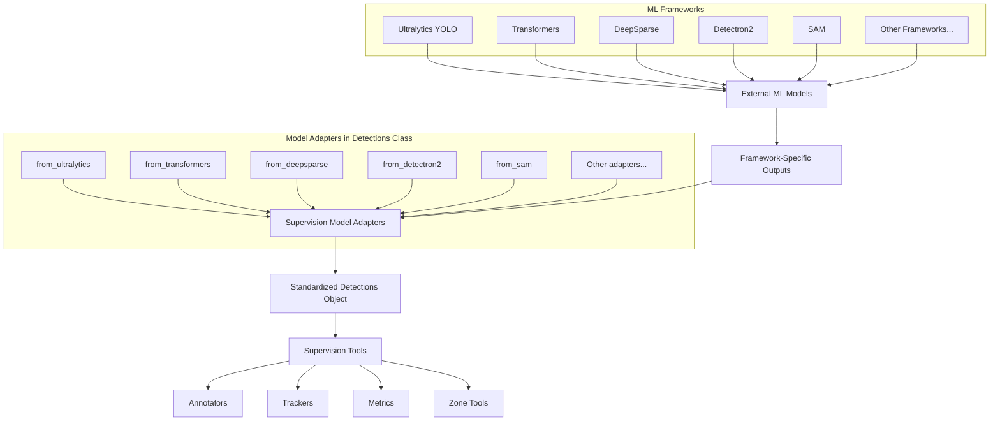
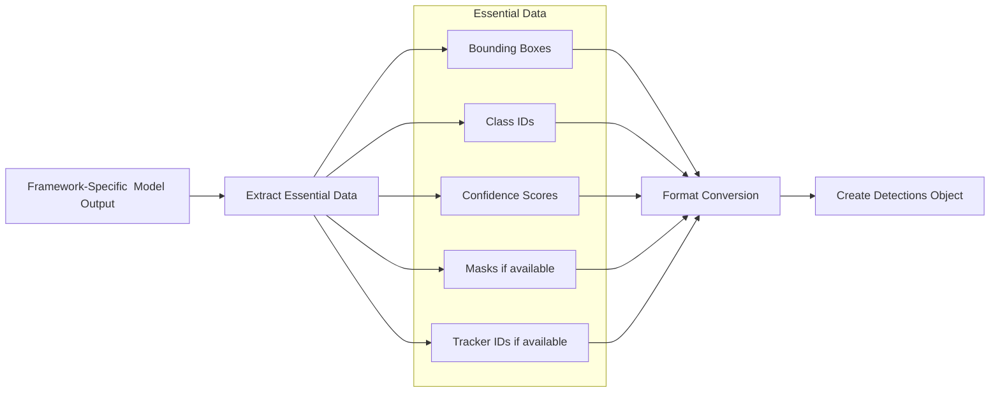
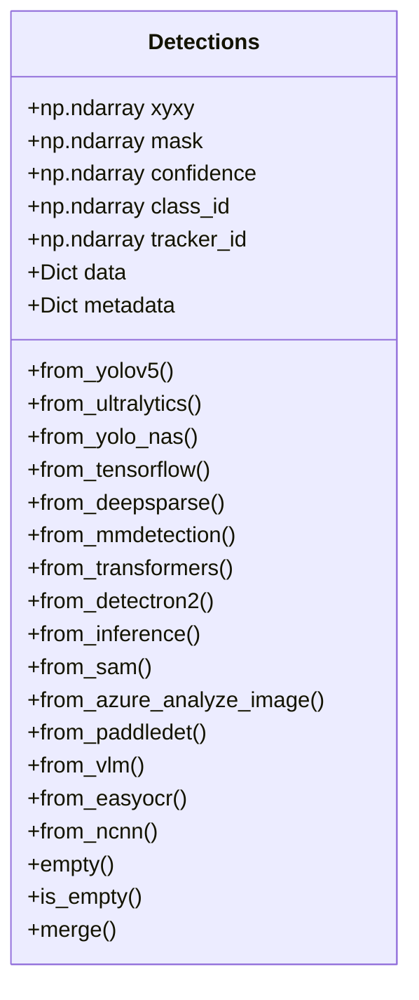

# Model Adapters

Relevant source files

- [supervision/detection/core.py](https://github.com/roboflow/supervision/blob/1d0747fb/supervision/detection/core.py)
- [supervision/detection/tools/transformers.py](https://github.com/roboflow/supervision/blob/1d0747fb/supervision/detection/tools/transformers.py)
- [supervision/detection/utils.py](https://github.com/roboflow/supervision/blob/1d0747fb/supervision/detection/utils.py)
- [test/detection/test_core.py](https://github.com/roboflow/supervision/blob/1d0747fb/test/detection/test_core.py)
- [test/detection/test_utils.py](https://github.com/roboflow/supervision/blob/1d0747fb/test/detection/test_utils.py)

Model adapters in the Supervision library serve as bridge components that convert outputs from various computer vision model frameworks into a standardized `Detections` format. This standardization allows all of Supervision's visualization, analysis, and processing tools to work consistently regardless of which underlying model or framework you're using.

For information about dataset format conversion, see [Dataset Format Converters](https://deepwiki.com/roboflow/supervision/4.2-dataset-format-converters).

## Purpose and Architecture

Model adapters enable Supervision to support multiple AI frameworks without requiring users to handle different output formats manually. They're implemented as class methods of the `Detections` class, with naming convention `from_*` (e.g., `from_ultralytics`, `from_transformers`).



Sources: [supervision/detection/core.py200-1037](https://github.com/roboflow/supervision/blob/1d0747fb/supervision/detection/core.py#L200-L1037)

## Supported Model Frameworks

Supervision provides adapters for numerous popular computer vision frameworks:

|Framework|Adapter Method|Description|
|---|---|---|
|YOLOv5|`from_yolov5`|Converts YOLOv5 outputs|
|Ultralytics (YOLOv8)|`from_ultralytics`|Supports detection, segmentation, and OBB|
|YOLO-NAS|`from_yolo_nas`|Converts YOLO-NAS outputs|
|TensorFlow|`from_tensorflow`|Converts TensorFlow Hub outputs|
|DeepSparse|`from_deepsparse`|Converts DeepSparse YOLO outputs|
|MMDetection|`from_mmdetection`|Converts MMDetection and MMYOLO outputs|
|Transformers|`from_transformers`|Converts Hugging Face Transformers outputs|
|Detectron2|`from_detectron2`|Converts Detectron2 outputs|
|Roboflow|`from_inference`|Converts Roboflow API/Inference outputs|
|SAM|`from_sam`|Converts Segment Anything Model outputs|
|Azure|`from_azure_analyze_image`|Converts Azure Image Analysis outputs|
|PaddleDetection|`from_paddledet`|Converts PaddleDetection outputs|
|Vision Language Models|`from_vlm`|Converts VLM outputs (Florence-2, PaLI-X, etc.)|
|EasyOCR|`from_easyocr`|Converts EasyOCR outputs|
|NCNN|`from_ncnn`|Converts NCNN outputs|

Sources: [supervision/detection/core.py200-1006](https://github.com/roboflow/supervision/blob/1d0747fb/supervision/detection/core.py#L200-L1006)

## Data Flow and Standardization Process

All model adapters follow a similar conversion process:

1. Extract essential data from the framework-specific output
2. Convert formats if needed (e.g., XYWH to XYXY for bounding boxes)
3. Create a standardized `Detections` object with the converted data



Sources: [supervision/detection/core.py200-1006](https://github.com/roboflow/supervision/blob/1d0747fb/supervision/detection/core.py#L200-L1006) [supervision/detection/utils.py288-321](https://github.com/roboflow/supervision/blob/1d0747fb/supervision/detection/utils.py#L288-L321)

## The Detections Class

The `Detections` class is the standardized format that all model adapters convert to:





Key attributes:

- `xyxy`: Bounding box coordinates in [x1, y1, x2, y2] format
- `mask`: Segmentation masks (optional)
- `confidence`: Confidence scores (optional)
- `class_id`: Class IDs (optional)
- `tracker_id`: Tracker IDs (optional)
- `data`: Additional data dictionary (optional)
- `metadata`: Collection-level metadata dictionary (optional)

Sources: [supervision/detection/core.py49-145](https://github.com/roboflow/supervision/blob/1d0747fb/supervision/detection/core.py#L49-L145)

## Using Model Adapters

### Example with Ultralytics (YOLOv8)

```
import supervision as sv
from ultralytics import YOLO

model = YOLO("yolov8n.pt")
results = model(image)[0]
detections = sv.Detections.from_ultralytics(results)
```

### Example with Transformers

```
import supervision as sv
import torch
from transformers import DetrImageProcessor, DetrForObjectDetection

processor = DetrImageProcessor.from_pretrained("facebook/detr-resnet-50")
model = DetrForObjectDetection.from_pretrained("facebook/detr-resnet-50")

inputs = processor(images=image, return_tensors="pt")
with torch.no_grad():
    outputs = model(**inputs)

width, height = image.size
target_size = torch.tensor([[height, width]])
results = processor.post_process_object_detection(
    outputs=outputs, target_sizes=target_size)[0]
detections = sv.Detections.from_transformers(
    transformers_results=results,
    id2label=model.config.id2label)
```

Sources: [supervision/detection/core.py458-534](https://github.com/roboflow/supervision/blob/1d0747fb/supervision/detection/core.py#L458-L534)

## Framework-Specific Implementation Details

### Ultralytics (YOLOv8) Adapter

The `from_ultralytics` method handles special cases like oriented bounding boxes (OBB) and supports both object detection and instance segmentation models:

```
@classmethod
def from_ultralytics(cls, ultralytics_results) -> Detections:
    # Handle oriented bounding boxes if available
    if hasattr(ultralytics_results, "obb") and ultralytics_results.obb is not None:
        # Extract OBB data
        class_id = ultralytics_results.obb.cls.cpu().numpy().astype(int)
        class_names = np.array([ultralytics_results.names[i] for i in class_id])
        oriented_box_coordinates = ultralytics_results.obb.xyxyxyxy.cpu().numpy()
        return cls(
            xyxy=ultralytics_results.obb.xyxy.cpu().numpy(),
            confidence=ultralytics_results.obb.conf.cpu().numpy(),
            class_id=class_id,
            tracker_id=ultralytics_results.obb.id.int().cpu().numpy()
            if ultralytics_results.obb.id is not None
            else None,
            data={
                ORIENTED_BOX_COORDINATES: oriented_box_coordinates,
                CLASS_NAME_DATA_FIELD: class_names,
            },
        )
    
    # Handle standard boxes and segmentation
    class_id = ultralytics_results.boxes.cls.cpu().numpy().astype(int)
    class_names = np.array([ultralytics_results.names[i] for i in class_id])
    return cls(
        xyxy=ultralytics_results.boxes.xyxy.cpu().numpy(),
        confidence=ultralytics_results.boxes.conf.cpu().numpy(),
        class_id=class_id,
        mask=extract_ultralytics_masks(ultralytics_results),
        tracker_id=ultralytics_results.boxes.id.int().cpu().numpy()
        if ultralytics_results.boxes.id is not None
        else None,
        data={CLASS_NAME_DATA_FIELD: class_names},
    )
```

Sources: [supervision/detection/core.py234-302](https://github.com/roboflow/supervision/blob/1d0747fb/supervision/detection/core.py#L234-L302) [supervision/detection/utils.py552-585](https://github.com/roboflow/supervision/blob/1d0747fb/supervision/detection/utils.py#L552-L585)

### Transformers Adapter

The `from_transformers` method handles different types of Transformer model outputs through specialized helper functions:

```
@classmethod
def from_transformers(
    cls, transformers_results: dict, id2label: Optional[Dict[int, str]] = None
) -> Detections:
    # Handle different transformers output types
    
    # Segmentation model (v5)
    if (
        transformers_results.__class__.__name__ == "Tensor"
        or "segmentation" in transformers_results
    ):
        return cls(
            **process_transformers_v5_segmentation_result(
                transformers_results, id2label
            )
        )

    # Segmentation model (v4)
    if "masks" in transformers_results or "png_string" in transformers_results:
        return cls(
            **process_transformers_v4_segmentation_result(
                transformers_results, id2label
            )
        )

    # Object detection model
    if "boxes" in transformers_results:
        return cls(
            **process_transformers_detection_result(transformers_results, id2label)
        )

    else:
        raise ValueError(
            "The provided Transformers results do not contain any valid fields."
            " Expected fields are 'boxes', 'masks', 'segments_info' or"
            " 'segmentation'."
        )
```

Sources: [supervision/detection/core.py458-534](https://github.com/roboflow/supervision/blob/1d0747fb/supervision/detection/core.py#L458-L534) [supervision/detection/tools/transformers.py11-247](https://github.com/roboflow/supervision/blob/1d0747fb/supervision/detection/tools/transformers.py#L11-L247)

## Error Handling and Edge Cases

Model adapters include various error handling mechanisms:

1. **Empty Results**: Many adapters check if the result is empty and return an empty `Detections` object
    
    ```
    if np.asarray(deepsparse_results.boxes[0]).shape[0] == 0:
        return cls.empty()
    ```
    
2. **Missing Fields**: Adapters check for the presence of optional fields before attempting to extract them
    
    ```
    tracker_id=ultralytics_results.boxes.id.int().cpu().numpy()
    if ultralytics_results.boxes.id is not None
    else None
    ```
    
3. **Type Conversions**: Adapters ensure proper data types for consistency
    
    ```
    class_id=ultralytics_results.boxes.cls.cpu().numpy().astype(int)
    ```
    

Sources: [supervision/detection/core.py411-412](https://github.com/roboflow/supervision/blob/1d0747fb/supervision/detection/core.py#L411-L412) [supervision/detection/core.py298-300](https://github.com/roboflow/supervision/blob/1d0747fb/supervision/detection/core.py#L298-L300)

## Conclusion

Model adapters provide a standardized interface to work with various computer vision frameworks in Supervision. By converting framework-specific outputs into a consistent `Detections` format, they enable seamless integration with Supervision's visualization, tracking, and analysis tools.

This architecture makes it easy to:

1. Use different models interchangeably
2. Switch between frameworks without changing downstream code
3. Compare results from different models using the same evaluation metrics

Sources: [supervision/detection/core.py49-1037](https://github.com/roboflow/supervision/blob/1d0747fb/supervision/detection/core.py#L49-L1037)