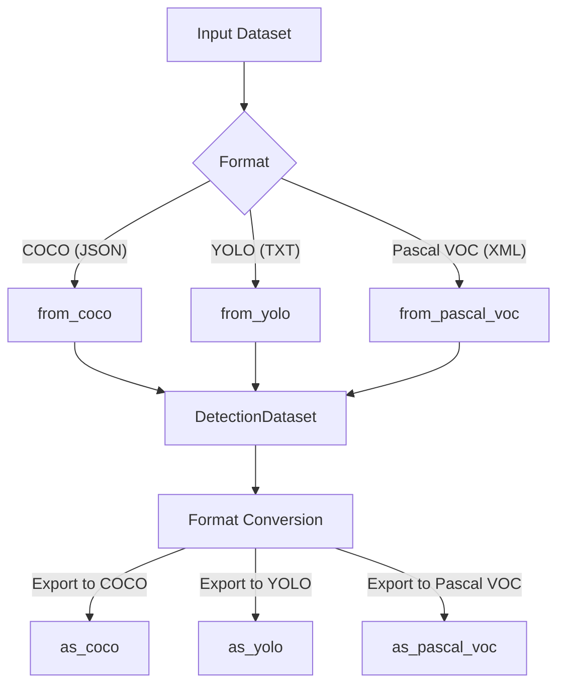
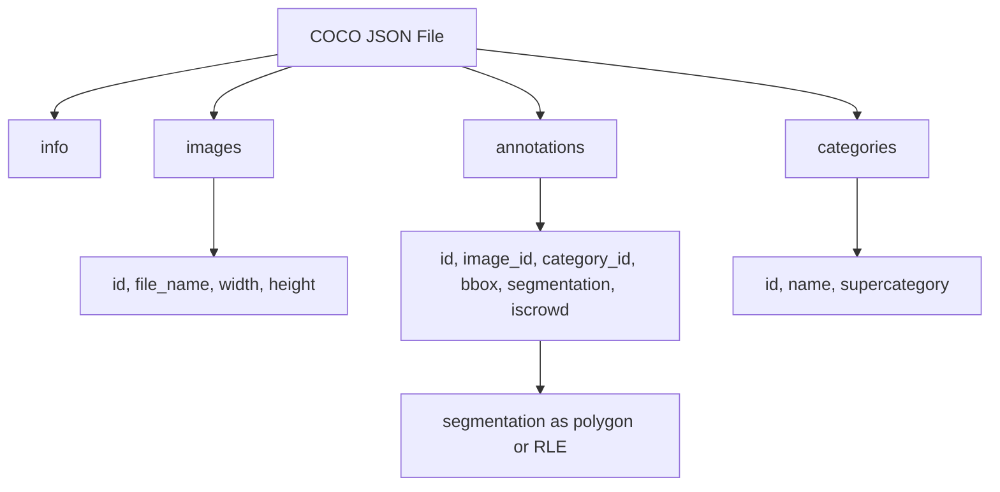
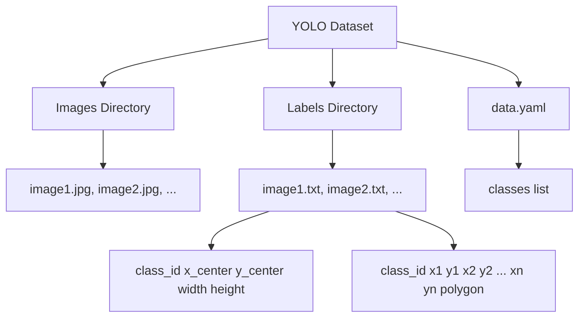
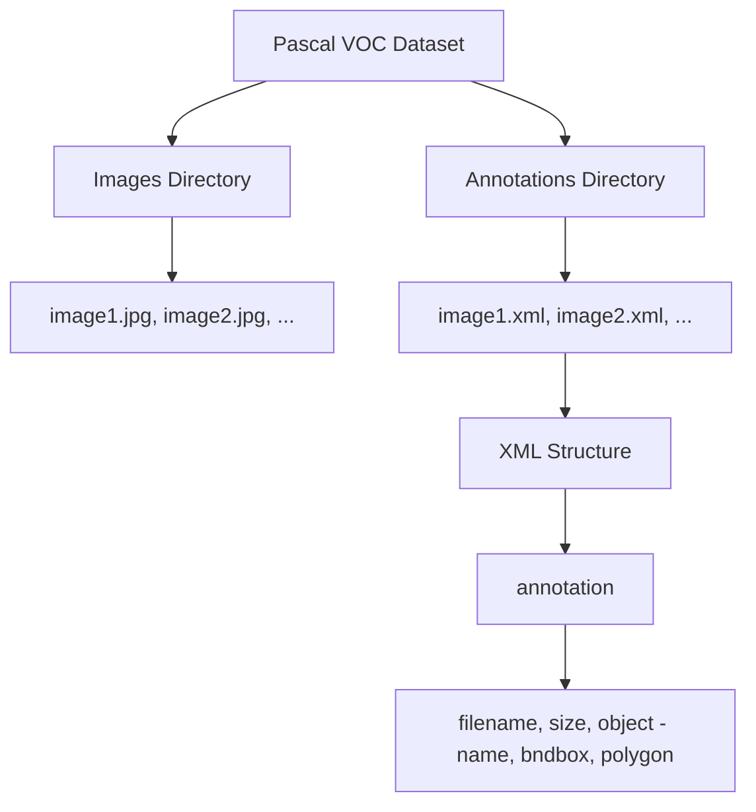
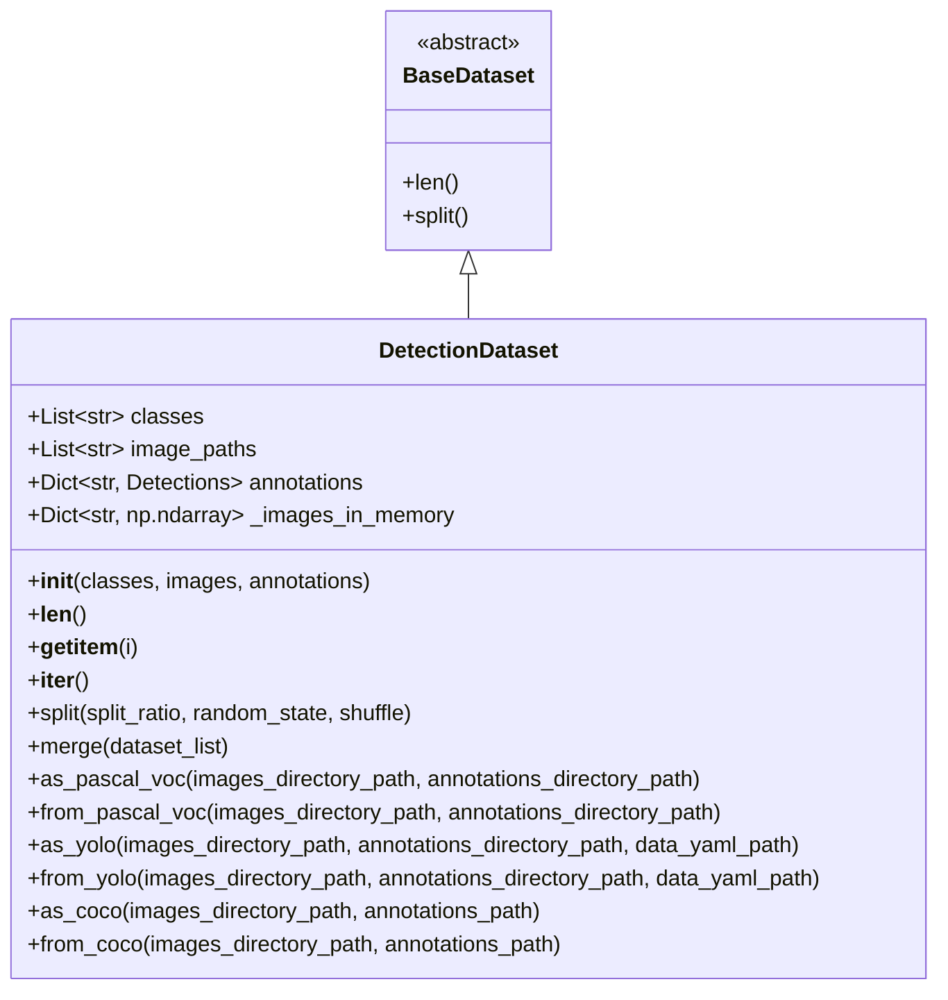
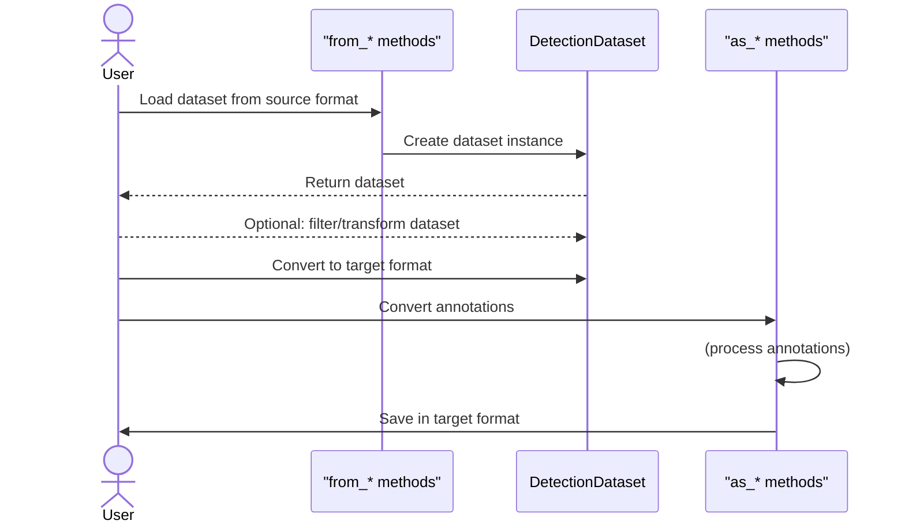
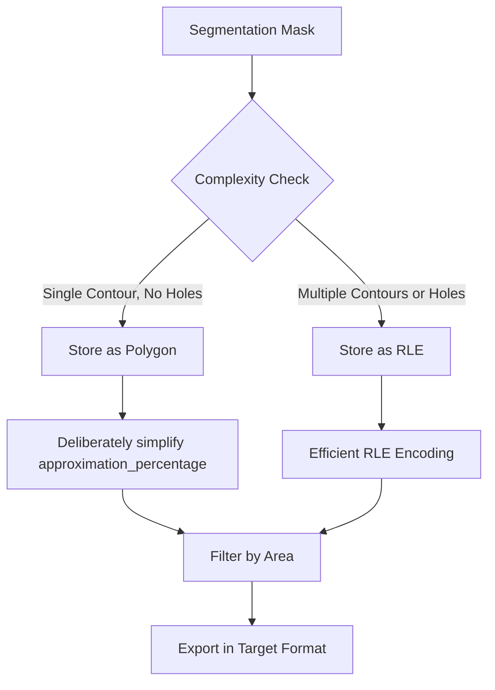
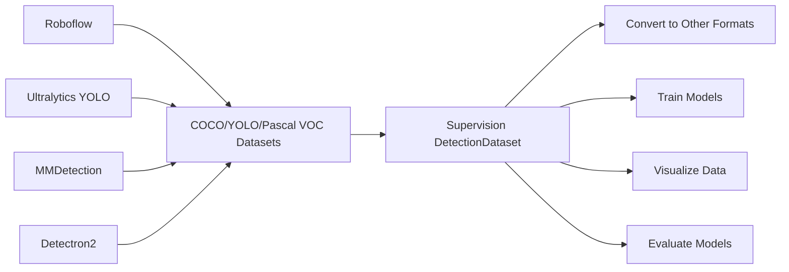

# Dataset Format Converters

Relevant source files

- [supervision/classification/__init__.py](https://github.com/roboflow/supervision/blob/1d0747fb/supervision/classification/__init__.py)
- [supervision/classification/core.py](https://github.com/roboflow/supervision/blob/1d0747fb/supervision/classification/core.py)
- [supervision/dataset/core.py](https://github.com/roboflow/supervision/blob/1d0747fb/supervision/dataset/core.py)
- [supervision/dataset/formats/coco.py](https://github.com/roboflow/supervision/blob/1d0747fb/supervision/dataset/formats/coco.py)
- [supervision/dataset/formats/pascal_voc.py](https://github.com/roboflow/supervision/blob/1d0747fb/supervision/dataset/formats/pascal_voc.py)
- [supervision/dataset/formats/yolo.py](https://github.com/roboflow/supervision/blob/1d0747fb/supervision/dataset/formats/yolo.py)
- [supervision/dataset/utils.py](https://github.com/roboflow/supervision/blob/1d0747fb/supervision/dataset/utils.py)
- [test/dataset/formats/test_coco.py](https://github.com/roboflow/supervision/blob/1d0747fb/test/dataset/formats/test_coco.py)
- [test/dataset/formats/test_yolo.py](https://github.com/roboflow/supervision/blob/1d0747fb/test/dataset/formats/test_yolo.py)
- [test/dataset/test_utils.py](https://github.com/roboflow/supervision/blob/1d0747fb/test/dataset/test_utils.py)

This document describes the dataset format conversion system in Supervision, which allows seamless translation between common computer vision dataset formats including COCO, YOLO, and Pascal VOC. These converters facilitate interoperability between different vision tools and workflows, enabling you to leverage datasets across different platforms and frameworks.

For information about model adapters that work with these datasets, see [Model Adapters](https://deepwiki.com/roboflow/supervision/4.1-model-adapters).

## Overview of Dataset Format Converters

The Supervision library provides a comprehensive system for converting between different dataset formats for computer vision tasks. The format converters are designed to work with the `DetectionDataset` class, which serves as a unified representation of computer vision datasets.



Sources: [supervision/dataset/core.py561-617](https://github.com/roboflow/supervision/blob/1d0747fb/supervision/dataset/core.py#L561-L617) [supervision/dataset/core.py446-506](https://github.com/roboflow/supervision/blob/1d0747fb/supervision/dataset/core.py#L446-L506) [supervision/dataset/core.py391-443](https://github.com/roboflow/supervision/blob/1d0747fb/supervision/dataset/core.py#L391-L443) [supervision/dataset/core.py508-558](https://github.com/roboflow/supervision/blob/1d0747fb/supervision/dataset/core.py#L508-L558)

## Supported Dataset Formats

### COCO Format

COCO (Common Objects in Context) is a large-scale object detection, segmentation, and captioning dataset format. Its annotations are stored in JSON format with a specific structure:



Sources: [supervision/dataset/formats/coco.py162-202](https://github.com/roboflow/supervision/blob/1d0747fb/supervision/dataset/formats/coco.py#L162-L202) [supervision/dataset/formats/coco.py205-258](https://github.com/roboflow/supervision/blob/1d0747fb/supervision/dataset/formats/coco.py#L205-L258)

### YOLO Format

YOLO (You Only Look Once) format uses plain text files with normalized coordinates. Each annotation is represented in a separate text file with the same name as the image:

Here’s the Mermaid flowchart:


Sources: [supervision/dataset/formats/yolo.py124-201](https://github.com/roboflow/supervision/blob/1d0747fb/supervision/dataset/formats/yolo.py#L124-L201) [supervision/dataset/formats/yolo.py262-289](https://github.com/roboflow/supervision/blob/1d0747fb/supervision/dataset/formats/yolo.py#L262-L289)

### Pascal VOC Format

Pascal VOC (Visual Object Classes) uses XML files to store annotations:



Sources: [supervision/dataset/formats/pascal_voc.py137-186](https://github.com/roboflow/supervision/blob/1d0747fb/supervision/dataset/formats/pascal_voc.py#L137-L186) [supervision/dataset/formats/pascal_voc.py52-134](https://github.com/roboflow/supervision/blob/1d0747fb/supervision/dataset/formats/pascal_voc.py#L52-L134)

## DetectionDataset Class

The `DetectionDataset` class is the central component for handling computer vision datasets in Supervision. It provides methods for loading, converting, and manipulating datasets.



Sources: [supervision/dataset/core.py39-52](https://github.com/roboflow/supervision/blob/1d0747fb/supervision/dataset/core.py#L39-L52) [supervision/dataset/core.py54-666](https://github.com/roboflow/supervision/blob/1d0747fb/supervision/dataset/core.py#L54-L666)

## Format Conversion Workflow

The format conversion workflow in Supervision follows these general steps:

1. Load a dataset from its source format into a `DetectionDataset` instance
2. Optionally manipulate or filter the dataset
3. Export the dataset to the desired target format



Sources: [supervision/dataset/core.py391-665](https://github.com/roboflow/supervision/blob/1d0747fb/supervision/dataset/core.py#L391-L665)

## Loading and Converting Between Formats

### Loading from COCO Format

The `from_coco` method loads a dataset from COCO format:

```
import supervision as sv

# Load from COCO format
dataset = sv.DetectionDataset.from_coco(
    images_directory_path="path/to/images",
    annotations_path="path/to/annotations.json",
    force_masks=False
)
```

Sources: [supervision/dataset/core.py561-608](https://github.com/roboflow/supervision/blob/1d0747fb/supervision/dataset/core.py#L561-L608) [supervision/dataset/formats/coco.py162-202](https://github.com/roboflow/supervision/blob/1d0747fb/supervision/dataset/formats/coco.py#L162-L202)

### Loading from YOLO Format

The `from_yolo` method loads a dataset from YOLO format:

```
import supervision as sv

# Load from YOLO format
dataset = sv.DetectionDataset.from_yolo(
    images_directory_path="path/to/images",
    annotations_directory_path="path/to/labels",
    data_yaml_path="path/to/data.yaml",
    force_masks=False,
    is_obb=False  # Set to True for oriented bounding boxes
)
```

Sources: [supervision/dataset/core.py446-506](https://github.com/roboflow/supervision/blob/1d0747fb/supervision/dataset/core.py#L446-L506) [supervision/dataset/formats/yolo.py124-201](https://github.com/roboflow/supervision/blob/1d0747fb/supervision/dataset/formats/yolo.py#L124-L201)

### Loading from Pascal VOC Format

The `from_pascal_voc` method loads a dataset from Pascal VOC format:

```
import supervision as sv

# Load from Pascal VOC format
dataset = sv.DetectionDataset.from_pascal_voc(
    images_directory_path="path/to/images",
    annotations_directory_path="path/to/annotations",
    force_masks=False
)
```

Sources: [supervision/dataset/core.py391-443](https://github.com/roboflow/supervision/blob/1d0747fb/supervision/dataset/core.py#L391-L443) [supervision/dataset/formats/pascal_voc.py137-186](https://github.com/roboflow/supervision/blob/1d0747fb/supervision/dataset/formats/pascal_voc.py#L137-L186)

### Converting to COCO Format

To convert a dataset to COCO format:

```
# Convert to COCO format
dataset.as_coco(
    images_directory_path="path/to/output/images",
    annotations_path="path/to/output/annotations.json",
    min_image_area_percentage=0.0,
    max_image_area_percentage=1.0,
    approximation_percentage=0.0
)
```

Sources: [supervision/dataset/core.py610-665](https://github.com/roboflow/supervision/blob/1d0747fb/supervision/dataset/core.py#L610-L665) [supervision/dataset/formats/coco.py205-258](https://github.com/roboflow/supervision/blob/1d0747fb/supervision/dataset/formats/coco.py#L205-L258)

### Converting to YOLO Format

To convert a dataset to YOLO format:

```
# Convert to YOLO format
dataset.as_yolo(
    images_directory_path="path/to/output/images",
    annotations_directory_path="path/to/output/labels",
    data_yaml_path="path/to/output/data.yaml",
    min_image_area_percentage=0.0,
    max_image_area_percentage=1.0,
    approximation_percentage=0.0
)
```

Sources: [supervision/dataset/core.py508-558](https://github.com/roboflow/supervision/blob/1d0747fb/supervision/dataset/core.py#L508-L558) [supervision/dataset/formats/yolo.py262-289](https://github.com/roboflow/supervision/blob/1d0747fb/supervision/dataset/formats/yolo.py#L262-L289)

### Converting to Pascal VOC Format

To convert a dataset to Pascal VOC format:

```
# Convert to Pascal VOC format
dataset.as_pascal_voc(
    images_directory_path="path/to/output/images",
    annotations_directory_path="path/to/output/annotations",
    min_image_area_percentage=0.0,
    max_image_area_percentage=1.0,
    approximation_percentage=0.0
)
```

Sources: [supervision/dataset/core.py334-390](https://github.com/roboflow/supervision/blob/1d0747fb/supervision/dataset/core.py#L334-L390) [supervision/dataset/formats/pascal_voc.py52-134](https://github.com/roboflow/supervision/blob/1d0747fb/supervision/dataset/formats/pascal_voc.py#L52-L134)

## Format-Specific Implementation Details

### Annotation Structures

Each format uses a different structure to represent annotations:

|Format|Annotation Structure|File Format|Coordinates Type|Segmentation Support|
|---|---|---|---|---|
|COCO|Dictionary with `images`, `categories`, and `annotations`|JSON|Absolute (pixels)|Polygons and RLE masks|
|YOLO|One line per object: `class_id x_center y_center width height`|TXT|Normalized (0-1)|Polygons|
|Pascal VOC|XML structure with `object` elements containing `name` and `bndbox`|XML|Absolute (pixels)|Polygons|

Sources: [supervision/dataset/formats/coco.py](https://github.com/roboflow/supervision/blob/1d0747fb/supervision/dataset/formats/coco.py) [supervision/dataset/formats/yolo.py](https://github.com/roboflow/supervision/blob/1d0747fb/supervision/dataset/formats/yolo.py) [supervision/dataset/formats/pascal_voc.py](https://github.com/roboflow/supervision/blob/1d0747fb/supervision/dataset/formats/pascal_voc.py)

### Mask Handling

The format converters provide various options for handling segmentation masks:



Sources: [supervision/dataset/utils.py25-50](https://github.com/roboflow/supervision/blob/1d0747fb/supervision/dataset/utils.py#L25-L50) [supervision/dataset/formats/coco.py116-159](https://github.com/roboflow/supervision/blob/1d0747fb/supervision/dataset/formats/coco.py#L116-L159)

### Automatic Format Detection

When storing masks, the format converter will automatically choose the most appropriate format:

- For COCO format: If a mask contains multiple disconnected components or holes, it will be saved using Run-Length Encoding (RLE). Otherwise, it will be stored as a polygon.
- For YOLO and Pascal VOC: Masks are always stored as polygons, with optional simplification using `approximation_percentage`.

Sources: [supervision/dataset/core.py622-635](https://github.com/roboflow/supervision/blob/1d0747fb/supervision/dataset/core.py#L622-L635) [supervision/dataset/formats/coco.py116-159](https://github.com/roboflow/supervision/blob/1d0747fb/supervision/dataset/formats/coco.py#L116-L159)

## Advanced Usage

### Mask Approximation and Filtering

When converting formats with segmentation masks, you can control mask complexity and filtering:

```
# Convert to COCO with mask approximation and filtering
dataset.as_coco(
    # Only include masks covering between 5% and 90% of the image
    min_image_area_percentage=0.05,  
    max_image_area_percentage=0.9,
    # Simplify polygon points by removing 75% of points
    approximation_percentage=0.75    
)
```

Sources: [supervision/dataset/utils.py25-50](https://github.com/roboflow/supervision/blob/1d0747fb/supervision/dataset/utils.py#L25-L50) [supervision/dataset/core.py610-665](https://github.com/roboflow/supervision/blob/1d0747fb/supervision/dataset/core.py#L610-L665)

### Dataset Splitting

You can split a dataset into training and testing sets:

```
# Split a dataset into training and testing sets
train_dataset, test_dataset = dataset.split(
    split_ratio=0.8,           # 80% for training, 20% for testing
    random_state=42,           # Set random seed for reproducibility
    shuffle=True               # Shuffle the dataset before splitting
)
```

Sources: [supervision/dataset/core.py179-239](https://github.com/roboflow/supervision/blob/1d0747fb/supervision/dataset/core.py#L179-L239) [supervision/dataset/utils.py114-139](https://github.com/roboflow/supervision/blob/1d0747fb/supervision/dataset/utils.py#L114-L139)

### Dataset Merging

You can merge multiple datasets:

```
# Merge multiple datasets
merged_dataset = sv.DetectionDataset.merge([dataset1, dataset2, dataset3])
```

Sources: [supervision/dataset/core.py241-332](https://github.com/roboflow/supervision/blob/1d0747fb/supervision/dataset/core.py#L241-L332) [supervision/dataset/utils.py53-60](https://github.com/roboflow/supervision/blob/1d0747fb/supervision/dataset/utils.py#L53-L60)

## Complete Conversion Example

Here's a complete example of converting a dataset from COCO to YOLO format:

```
import supervision as sv

# Load dataset from COCO format
dataset = sv.DetectionDataset.from_coco(
    images_directory_path="path/to/coco/images",
    annotations_path="path/to/coco/annotations.json"
)

# Optionally split the dataset
train_dataset, test_dataset = dataset.split(split_ratio=0.8, random_state=42)

# Convert to YOLO format
train_dataset.as_yolo(
    images_directory_path="path/to/yolo/train/images",
    annotations_directory_path="path/to/yolo/train/labels",
    data_yaml_path="path/to/yolo/data.yaml"
)

test_dataset.as_yolo(
    images_directory_path="path/to/yolo/test/images",
    annotations_directory_path="path/to/yolo/test/labels",
    data_yaml_path="path/to/yolo/data.yaml"
)
```

Sources: [supervision/dataset/core.py561-608](https://github.com/roboflow/supervision/blob/1d0747fb/supervision/dataset/core.py#L561-L608) [supervision/dataset/core.py508-558](https://github.com/roboflow/supervision/blob/1d0747fb/supervision/dataset/core.py#L508-L558) [supervision/dataset/core.py179-239](https://github.com/roboflow/supervision/blob/1d0747fb/supervision/dataset/core.py#L179-L239)

## Integration with External Libraries

The Dataset Format Converters integrate well with popular computer vision libraries and tools:



Sources: [supervision/dataset/core.py413-432](https://github.com/roboflow/supervision/blob/1d0747fb/supervision/dataset/core.py#L413-L432) [supervision/dataset/core.py477-495](https://github.com/roboflow/supervision/blob/1d0747fb/supervision/dataset/core.py#L477-L495) [supervision/dataset/core.py583-601](https://github.com/roboflow/supervision/blob/1d0747fb/supervision/dataset/core.py#L583-L601)

In this document, we've covered the detailed functionality of Supervision's Dataset Format Converters, which enable seamless conversion between common computer vision dataset formats. These converters play a crucial role in building efficient computer vision workflows by ensuring interoperability between different tools and frameworks.