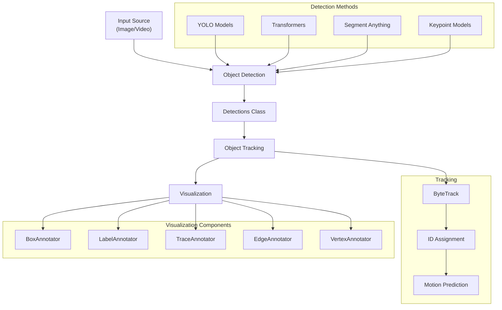
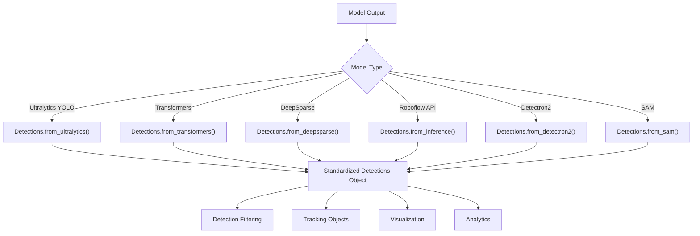
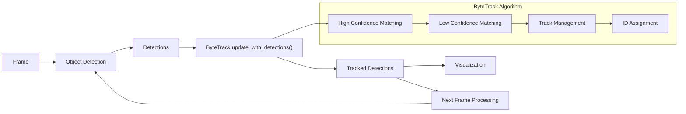
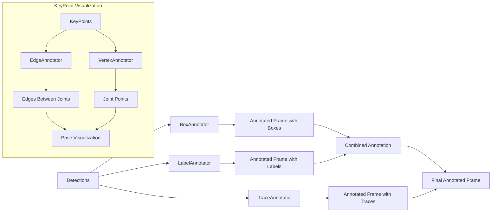
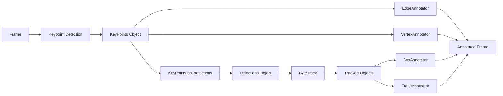
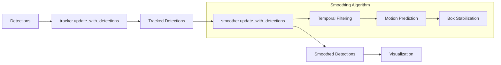
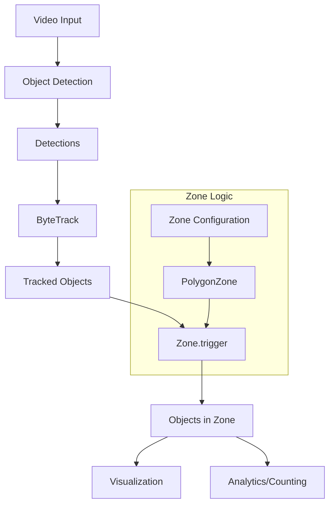

# Object Detection & Tracking

Relevant source files

- [docs/how_to/track_objects.md](https://github.com/roboflow/supervision/blob/1d0747fb/docs/how_to/track_objects.md)
- [examples/count_people_in_zone/README.md](https://github.com/roboflow/supervision/blob/1d0747fb/examples/count_people_in_zone/README.md)
- [examples/count_people_in_zone/inference_example.py](https://github.com/roboflow/supervision/blob/1d0747fb/examples/count_people_in_zone/inference_example.py)
- [examples/count_people_in_zone/ultralytics_example.py](https://github.com/roboflow/supervision/blob/1d0747fb/examples/count_people_in_zone/ultralytics_example.py)
- [examples/tracking/README.md](https://github.com/roboflow/supervision/blob/1d0747fb/examples/tracking/README.md)
- [examples/tracking/inference_example.py](https://github.com/roboflow/supervision/blob/1d0747fb/examples/tracking/inference_example.py)
- [examples/tracking/ultralytics_example.py](https://github.com/roboflow/supervision/blob/1d0747fb/examples/tracking/ultralytics_example.py)
- [examples/traffic_analysis/README.md](https://github.com/roboflow/supervision/blob/1d0747fb/examples/traffic_analysis/README.md)

This page covers the core functionality of Supervision for detecting and tracking objects in images and videos. The guide focuses on how to use the library to perform inference with various model types, track objects across video frames, and visualize results with annotations.

For information about zone-based counting of objects, see [Zone-based Counting](https://deepwiki.com/roboflow/supervision/5.3-zone-based-counting). For speed estimation capabilities, see [Speed Estimation](https://deepwiki.com/roboflow/supervision/5.2-speed-estimation).

## Overview

Supervision provides a streamlined workflow for object detection and tracking tasks that includes:

1. Running inference with detection models
2. Standardizing detection data with the `Detections` class
3. Tracking objects between frames with `ByteTrack`
4. Visualizing results with various annotators




Sources:

- [docs/how_to/track_objects.md8-15](https://github.com/roboflow/supervision/blob/1d0747fb/docs/how_to/track_objects.md#L8-L15) Overview of tracking capabilities.
- [examples/tracking/README.md1-8](https://github.com/roboflow/supervision/blob/1d0747fb/examples/tracking/README.md#L1-L8) Description of tracking functionality.

## Detection System

Supervision standardizes detection data through the `Detections` class, which is the central data structure for detection results. The class stores bounding boxes, confidence scores, class IDs, and other metadata for detected objects.

### Converting Model Results to Detections

Supervision supports various model frameworks and provides methods to convert their outputs to the standardized `Detections` format:




Sources:

- [docs/how_to/track_objects.md34-39](https://github.com/roboflow/supervision/blob/1d0747fb/docs/how_to/track_objects.md#L34-L39) Information about model inference.
- [examples/tracking/inference_example.py28-32](https://github.com/roboflow/supervision/blob/1d0747fb/examples/tracking/inference_example.py#L28-L32) Example of converting model output to Detections.
- [examples/tracking/ultralytics_example.py26-30](https://github.com/roboflow/supervision/blob/1d0747fb/examples/tracking/ultralytics_example.py#L26-L30) Example with Ultralytics YOLO.

## Object Tracking with ByteTrack

Supervision implements `ByteTrack`, an algorithm for tracking objects across video frames. After detecting objects in each frame, ByteTrack associates detections across frames, assigning unique tracker IDs to each object.

### Tracking Workflow




### Implementation Example

A typical tracking implementation contains these key components:

1. Initialize the tracker: `tracker = sv.ByteTrack()`
2. Process each frame:
    - Detect objects
    - Update tracker with new detections
    - Visualize results

Sources:

- [docs/how_to/track_objects.md98-154](https://github.com/roboflow/supervision/blob/1d0747fb/docs/how_to/track_objects.md#L98-L154) Detailed guide on tracking.
- [examples/tracking/inference_example.py20-42](https://github.com/roboflow/supervision/blob/1d0747fb/examples/tracking/inference_example.py#L20-L42) ByteTrack implementation with Inference model.
- [examples/tracking/ultralytics_example.py18-40](https://github.com/roboflow/supervision/blob/1d0747fb/examples/tracking/ultralytics_example.py#L18-L40) ByteTrack implementation with Ultralytics.

## Visualization Components

Supervision provides several annotators to visualize detections and tracking results:

|Annotator|Purpose|Primary Use Case|
|---|---|---|
|`BoxAnnotator`|Draws bounding boxes around detected objects|Object detection visualization|
|`LabelAnnotator`|Adds labels with class name and tracker ID|Identifying objects and their tracks|
|`TraceAnnotator`|Shows movement trails for tracked objects|Visualizing object motion paths|
|`EdgeAnnotator`|Draws edges between keypoints|Pose/keypoint visualization|
|`VertexAnnotator`|Draws keypoint vertices|Pose/keypoint visualization|

### Annotation Pipeline



Sources:

- [docs/how_to/track_objects.md154-233](https://github.com/roboflow/supervision/blob/1d0747fb/docs/how_to/track_objects.md#L154-L233) Guide on visualizing tracking with annotators.
- [examples/tracking/inference_example.py21-41](https://github.com/roboflow/supervision/blob/1d0747fb/examples/tracking/inference_example.py#L21-L41) BoxAnnotator and LabelAnnotator usage.
- [docs/how_to/track_objects.md236-267](https://github.com/roboflow/supervision/blob/1d0747fb/docs/how_to/track_objects.md#L236-L267) TraceAnnotator for showing object trails.

## Working with Keypoints

Supervision also supports keypoint detection models, which can be useful for pose estimation and detailed human analysis.

### Keypoint Detection and Tracking




Sources:

- [docs/how_to/track_objects.md324-404](https://github.com/roboflow/supervision/blob/1d0747fb/docs/how_to/track_objects.md#L324-L404) Guide on keypoint detection.
- [docs/how_to/track_objects.md409-484](https://github.com/roboflow/supervision/blob/1d0747fb/docs/how_to/track_objects.md#L409-L484) Converting keypoints to detections for tracking.

## Advanced Features

### Detection Smoothing

For video applications, Supervision provides the `DetectionsSmoother` to reduce jitter and improve stability of bounding boxes across frames:



Sources:

- [docs/how_to/track_objects.md569-654](https://github.com/roboflow/supervision/blob/1d0747fb/docs/how_to/track_objects.md#L569-L654) Implementation of detection smoothing.

## Example Workflows

### Basic Object Detection and Tracking

This typical workflow shows how to:

1. Obtain a video source
2. Initialize detection model
3. Set up tracking and visualization
4. Process frames in a loop

```
1. Load video source
2. Initialize model (YOLO, Transformers, etc.)
3. Create ByteTrack tracker
4. Initialize annotators (BoxAnnotator, LabelAnnotator, etc.)
5. For each frame:
   - Perform detection
   - Convert results to Detections
   - Update tracker with detections
   - Annotate frame with results
   - Write/display annotated frame
```

Sources:

- [examples/tracking/ultralytics_example.py9-40](https://github.com/roboflow/supervision/blob/1d0747fb/examples/tracking/ultralytics_example.py#L9-L40) Complete tracking workflow with Ultralytics.
- [examples/tracking/inference_example.py10-42](https://github.com/roboflow/supervision/blob/1d0747fb/examples/tracking/inference_example.py#L10-L42) Complete tracking workflow with Inference API.
- [examples/traffic_analysis/README.md1-9](https://github.com/roboflow/supervision/blob/1d0747fb/examples/traffic_analysis/README.md#L1-L9) Real-world application example.
- [examples/count_people_in_zone/README.md1-12](https://github.com/roboflow/supervision/blob/1d0747fb/examples/count_people_in_zone/README.md#L1-L12) Application for zone-based counting.

### Zone-Based Analysis

Combine tracking with zone tools for advanced analytics:



Sources:

- [examples/count_people_in_zone/ultralytics_example.py91-121](https://github.com/roboflow/supervision/blob/1d0747fb/examples/count_people_in_zone/ultralytics_example.py#L91-L121) Zone-based detection example.
- [examples/count_people_in_zone/inference_example.py91-125](https://github.com/roboflow/supervision/blob/1d0747fb/examples/count_people_in_zone/inference_example.py#L91-L125) Another zone example with Inference API.

## Technical Requirements

To use the object detection and tracking capabilities, you'll need:

1. A compatible model (YOLO, Transformers, etc.)
2. Video processing utilities (OpenCV typically)
3. Supervision library with optional assets extension for test videos

```
# Install with pip
pip install supervision

# For example assets
pip install supervision[assets]
```

Sources:

- [docs/how_to/track_objects.md23-27](https://github.com/roboflow/supervision/blob/1d0747fb/docs/how_to/track_objects.md#L23-L27) Instructions for downloading example videos.
- [examples/tracking/README.md26-28](https://github.com/roboflow/supervision/blob/1d0747fb/examples/tracking/README.md#L26-L28) Installation requirements.