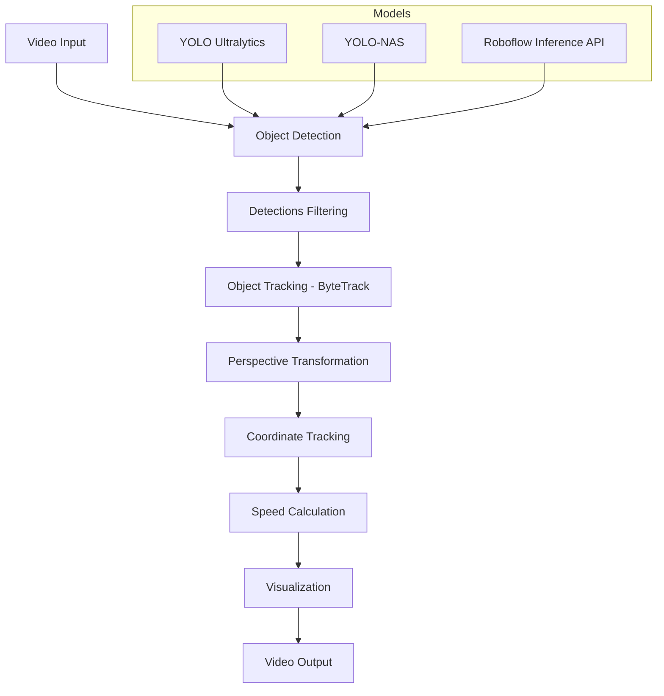
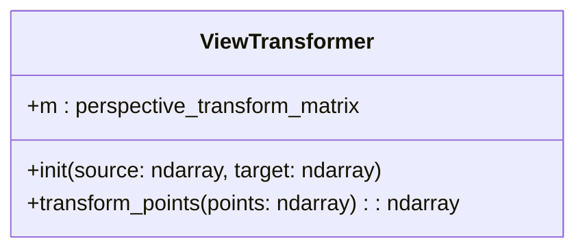
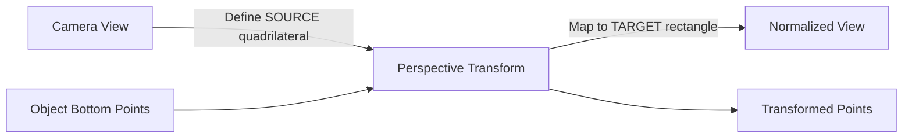
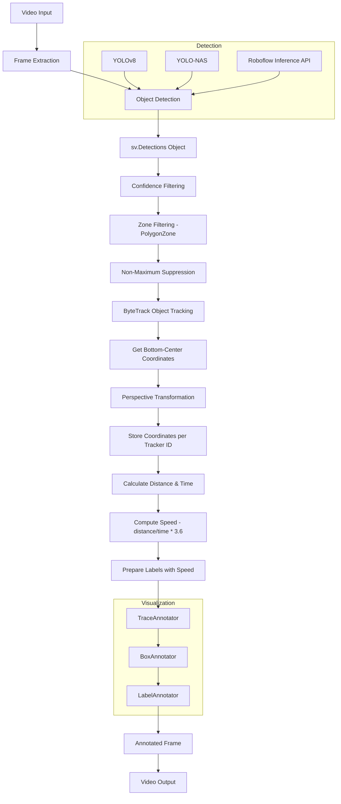

# Speed Estimation

Relevant source files

- [examples/speed_estimation/.gitignore](https://github.com/roboflow/supervision/blob/1d0747fb/examples/speed_estimation/.gitignore)
- [examples/speed_estimation/README.md](https://github.com/roboflow/supervision/blob/1d0747fb/examples/speed_estimation/README.md)
- [examples/speed_estimation/inference_example.py](https://github.com/roboflow/supervision/blob/1d0747fb/examples/speed_estimation/inference_example.py)
- [examples/speed_estimation/requirements.txt](https://github.com/roboflow/supervision/blob/1d0747fb/examples/speed_estimation/requirements.txt)
- [examples/speed_estimation/ultralytics_example.py](https://github.com/roboflow/supervision/blob/1d0747fb/examples/speed_estimation/ultralytics_example.py)
- [examples/speed_estimation/video_downloader.py](https://github.com/roboflow/supervision/blob/1d0747fb/examples/speed_estimation/video_downloader.py)
- [examples/speed_estimation/yolo_nas_example.py](https://github.com/roboflow/supervision/blob/1d0747fb/examples/speed_estimation/yolo_nas_example.py)

## Purpose and Scope

This document details the implementation and usage of the speed estimation system in Supervision. The system provides tools to estimate the speed of moving objects in videos using object detection, tracking, and perspective transformation. It's particularly useful for vehicle traffic analysis, pedestrian monitoring, and other applications requiring motion speed measurement.

For information about object detection and tracking fundamentals, see [Object Detection & Tracking](https://deepwiki.com/roboflow/supervision/5.1-object-detection-and-tracking).

Sources: [examples/speed_estimation/README.md6-10](https://github.com/roboflow/supervision/blob/1d0747fb/examples/speed_estimation/README.md#L6-L10)

## Overview

The speed estimation system combines object detection models, the ByteTrack tracking algorithm, and a perspective transformation approach to calculate object speed in real-world units (km/h). The implementation handles the challenges of estimating speed from a 2D video of a 3D scene by transforming detected object positions to a normalized plane.

### Speed Estimation Architecture



Sources: [examples/speed_estimation/ultralytics_example.py25-146](https://github.com/roboflow/supervision/blob/1d0747fb/examples/speed_estimation/ultralytics_example.py#L25-L146) [examples/speed_estimation/yolo_nas_example.py25-146](https://github.com/roboflow/supervision/blob/1d0747fb/examples/speed_estimation/yolo_nas_example.py#L25-L146) [examples/speed_estimation/inference_example.py25-168](https://github.com/roboflow/supervision/blob/1d0747fb/examples/speed_estimation/inference_example.py#L25-L168)

## Key Components

### ViewTransformer

The `ViewTransformer` class is the core component responsible for transforming points from the camera perspective to a normalized coordinate system. This transformation is crucial for accurate speed estimation as it corrects for perspective distortion.




The transformation process works as follows:



Sources: [examples/speed_estimation/ultralytics_example.py25-37](https://github.com/roboflow/supervision/blob/1d0747fb/examples/speed_estimation/ultralytics_example.py#L25-L37)

### Speed Calculation Process

The speed calculation algorithm tracks objects through frames and computes their speed based on position changes:

```mermaid
flowchart TD
  A[Detect & Track Objects]
  B[Transform Bottom-Center Points]

  subgraph S[For each tracked object]
    C[Store Y-Coordinates in Deque per Object ID]
    D[Calculate Position Change Over Time]
    E[Convert to Speed km/h]

    F[coordinate_start = coordinates&#91;tracker_id&#93;&#91;-1&#93;]
    G[coordinate_end = coordinates&#91;tracker_id&#93;&#91;0&#93;]
    H[distance = abs coordinate_start - coordinate_end]
    I[time = len coordinates&#91;tracker_id&#93;  / video_info.fps]
    J[speed = distance / time * 3.6]

    C --> D --> E
    C --> F --> G --> H --> I --> J
  end

  A --> B --> C

```





Sources: [examples/speed_estimation/ultralytics_example.py119-129](https://github.com/roboflow/supervision/blob/1d0747fb/examples/speed_estimation/ultralytics_example.py#L119-L129)

## Implementation Details

### Configuration Parameters

Two critical configuration parameters must be adjusted for each camera view:

1. **SOURCE**: A numpy array defining a quadrilateral in the original image that represents the area where speed will be measured.
2. **TARGET**: A normalized rectangular representation of the SOURCE area, used for consistent distance measurement.

```
SOURCE = np.array([[1252, 787], [2298, 803], [5039, 2159], [-550, 2159]])

TARGET_WIDTH = 25
TARGET_HEIGHT = 250

TARGET = np.array([
    [0, 0],
    [TARGET_WIDTH - 1, 0],
    [TARGET_WIDTH - 1, TARGET_HEIGHT - 1],
    [0, TARGET_HEIGHT - 1],
])
```

Sources: [examples/speed_estimation/ultralytics_example.py10-22](https://github.com/roboflow/supervision/blob/1d0747fb/examples/speed_estimation/ultralytics_example.py#L10-L22)

### Object Tracking

The system uses ByteTrack to maintain object identity across frames, which is essential for speed calculation:

```
byte_track = sv.ByteTrack(
    frame_rate=video_info.fps, 
    track_activation_threshold=args.confidence_threshold
)

# Later in the processing loop:
detections = byte_track.update_with_detections(detections=detections)
```

Sources: [examples/speed_estimation/ultralytics_example.py75-77](https://github.com/roboflow/supervision/blob/1d0747fb/examples/speed_estimation/ultralytics_example.py#L75-L77) [examples/speed_estimation/ultralytics_example.py109](https://github.com/roboflow/supervision/blob/1d0747fb/examples/speed_estimation/ultralytics_example.py#L109-L109)

### Coordinate Tracking

For each tracked object, the system maintains a deque of recent y-coordinates, limited to the number of frames per second (essentially tracking one second of movement):

```
coordinates = defaultdict(lambda: deque(maxlen=video_info.fps))

# For each detection in a frame:
for tracker_id, [_, y] in zip(detections.tracker_id, points):
    coordinates[tracker_id].append(y)
```

Sources: [examples/speed_estimation/ultralytics_example.py100](https://github.com/roboflow/supervision/blob/1d0747fb/examples/speed_estimation/ultralytics_example.py#L100-L100) [examples/speed_estimation/ultralytics_example.py116-117](https://github.com/roboflow/supervision/blob/1d0747fb/examples/speed_estimation/ultralytics_example.py#L116-L117)

### Speed Calculation

Once enough coordinates are collected for an object (at least half a second worth of data), speed is calculated:

```
for tracker_id in detections.tracker_id:
    if len(coordinates[tracker_id]) < video_info.fps / 2:
        labels.append(f"#{tracker_id}")
    else:
        coordinate_start = coordinates[tracker_id][-1]
        coordinate_end = coordinates[tracker_id][0]
        distance = abs(coordinate_start - coordinate_end)
        time = len(coordinates[tracker_id]) / video_info.fps
        speed = distance / time * 3.6
        labels.append(f"#{tracker_id} {int(speed)} km/h")
```

The factor 3.6 converts from units/second to km/h (assuming the distance is in meters).

Sources: [examples/speed_estimation/ultralytics_example.py120-129](https://github.com/roboflow/supervision/blob/1d0747fb/examples/speed_estimation/ultralytics_example.py#L120-L129)

### Visualization

The system uses three types of annotators to visualize the results:

1. **BoxAnnotator**: Draws bounding boxes around detected objects
2. **TraceAnnotator**: Shows the path of each object
3. **LabelAnnotator**: Displays the object ID and calculated speed

```
box_annotator = sv.BoxAnnotator(thickness=thickness)
label_annotator = sv.LabelAnnotator(
    text_scale=text_scale,
    text_thickness=thickness,
    text_position=sv.Position.BOTTOM_CENTER,
)
trace_annotator = sv.TraceAnnotator(
    thickness=thickness,
    trace_length=video_info.fps * 2,  # 2 second trace
    position=sv.Position.BOTTOM_CENTER,
)
```

Sources: [examples/speed_estimation/ultralytics_example.py83-93](https://github.com/roboflow/supervision/blob/1d0747fb/examples/speed_estimation/ultralytics_example.py#L83-L93)

## Supported Detection Models

The speed estimation system works with multiple object detection frameworks:

|Framework|Adapter Function|Example File|
|---|---|---|
|Ultralytics YOLO|`sv.Detections.from_ultralytics()`|ultralytics_example.py|
|YOLO-NAS|`sv.Detections.from_yolo_nas()`|yolo_nas_example.py|
|Roboflow Inference|`sv.Detections.from_inference()`|inference_example.py|

All examples follow the same general approach, with minor differences in model initialization and detection conversion.

Sources: [examples/speed_estimation/ultralytics_example.py105](https://github.com/roboflow/supervision/blob/1d0747fb/examples/speed_estimation/ultralytics_example.py#L105-L105) [examples/speed_estimation/yolo_nas_example.py106](https://github.com/roboflow/supervision/blob/1d0747fb/examples/speed_estimation/yolo_nas_example.py#L106-L106) [examples/speed_estimation/inference_example.py127](https://github.com/roboflow/supervision/blob/1d0747fb/examples/speed_estimation/inference_example.py#L127-L127)

## Usage Examples

### Basic Usage

To run speed estimation with Ultralytics YOLO:

```
python ultralytics_example.py \
    --source_video_path data/vehicles.mp4 \
    --target_video_path data/vehicles-result.mp4 \
    --confidence_threshold 0.3 \
    --iou_threshold 0.5
```

Sources: [examples/speed_estimation/README.md102-108](https://github.com/roboflow/supervision/blob/1d0747fb/examples/speed_estimation/README.md#L102-L108)

### Command Line Arguments

|Argument|Description|Default|
|---|---|---|
|`--source_video_path`|Path to input video|Required|
|`--target_video_path`|Path to save output video|Required|
|`--confidence_threshold`|Minimum confidence for detections|0.3|
|`--iou_threshold`|IOU threshold for NMS|0.7|
|`--roboflow_api_key`|API key for Roboflow Inference|Environment variable|
|`--model_id`|Model ID for Roboflow Inference|"yolov8x-640"|

Sources: [examples/speed_estimation/README.md48-76](https://github.com/roboflow/supervision/blob/1d0747fb/examples/speed_estimation/README.md#L48-L76)

## Customization and Considerations

### Camera Calibration

The most important customization needed for accurate speed estimation is setting the `SOURCE` and `TARGET` parameters correctly. These must be adjusted for each camera view:

1. Define `SOURCE` as a quadrilateral that represents a known distance in the real world
2. Set `TARGET` dimensions to reflect the real-world measurements

Improper calibration can lead to significant errors in speed estimates.

Sources: [examples/speed_estimation/README.md14-18](https://github.com/roboflow/supervision/blob/1d0747fb/examples/speed_estimation/README.md#L14-L18)

### Speed Calculation Formula

The basic speed formula used is:

```
speed (km/h) = (distance / time) * 3.6
```

Where:

- `distance` is in pixels in the transformed coordinate system
- `time` is in seconds
- `3.6` is the conversion factor from m/s to km/h

For more accurate measurements, you may need to scale the distance based on real-world calibration measurements.

Sources: [examples/speed_estimation/ultralytics_example.py128](https://github.com/roboflow/supervision/blob/1d0747fb/examples/speed_estimation/ultralytics_example.py#L128-L128)

## Complete Data Flow




Si en algún nodo necesitas mostrar corchetes literales, usa comillas en la etiqueta o entidades HTML (`&#91;` y `&#93;`).
Sources: [examples/speed_estimation/ultralytics_example.py103-142](https://github.com/roboflow/supervision/blob/1d0747fb/examples/speed_estimation/ultralytics_example.py#L103-L142)