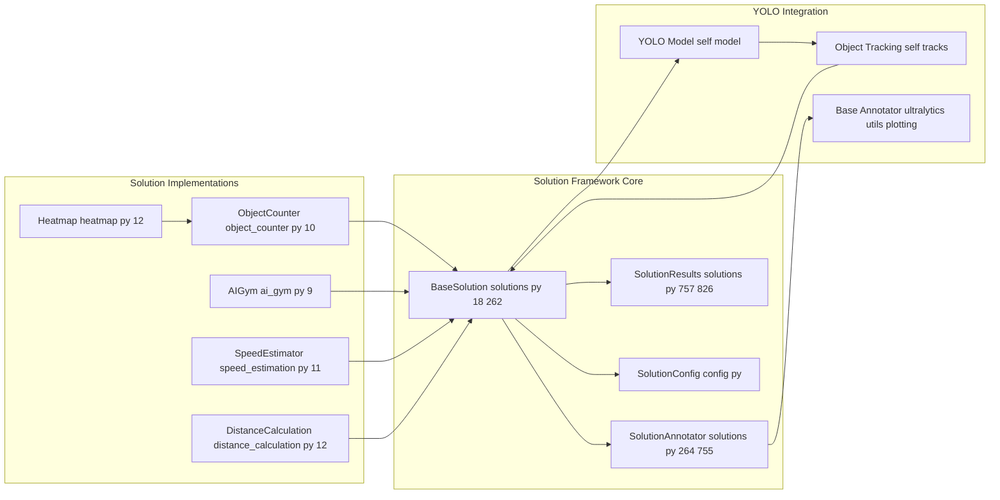
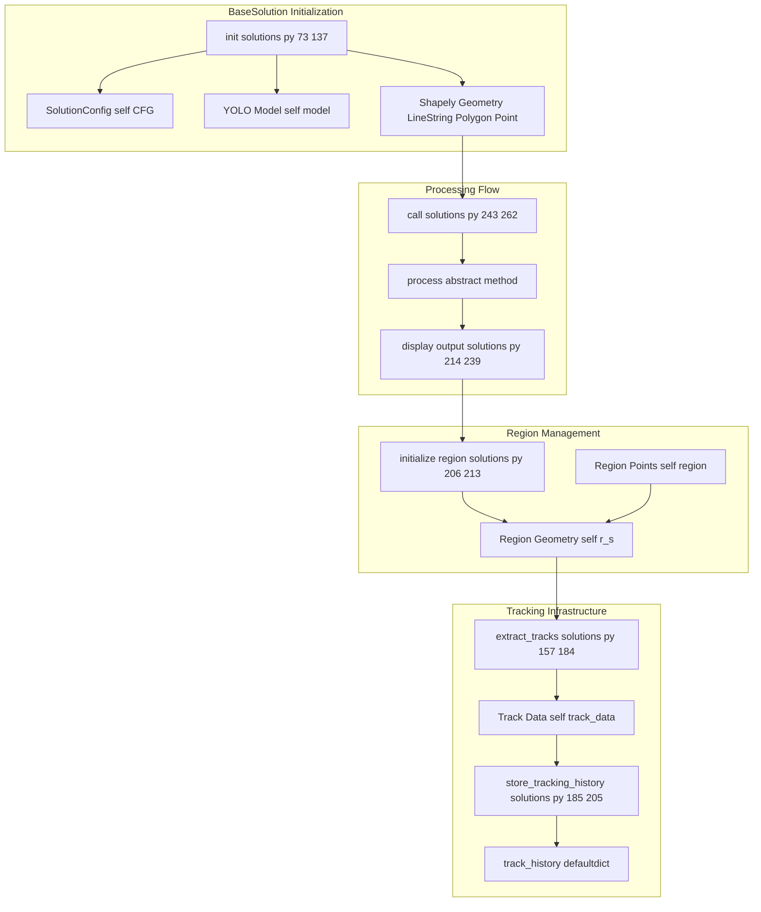
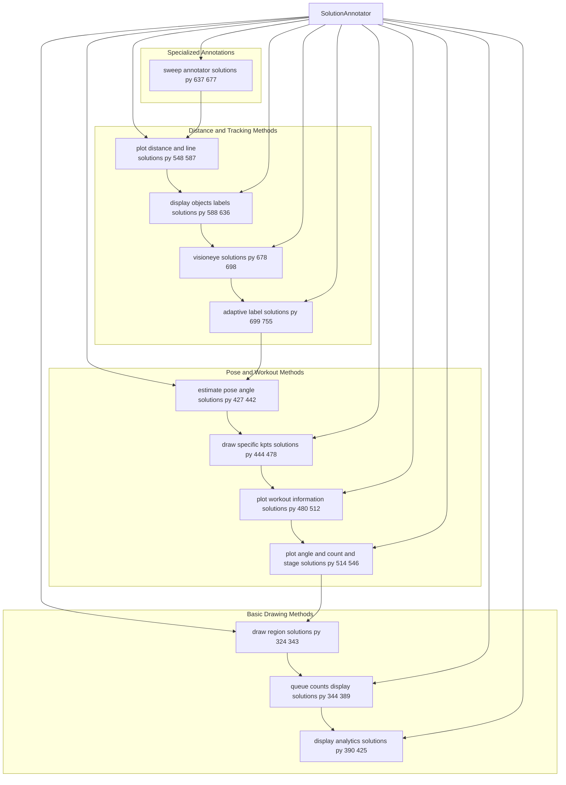
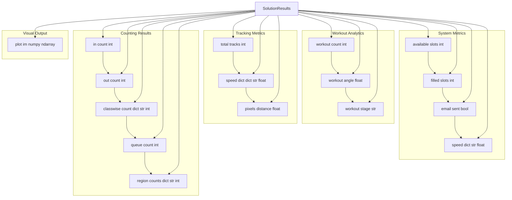
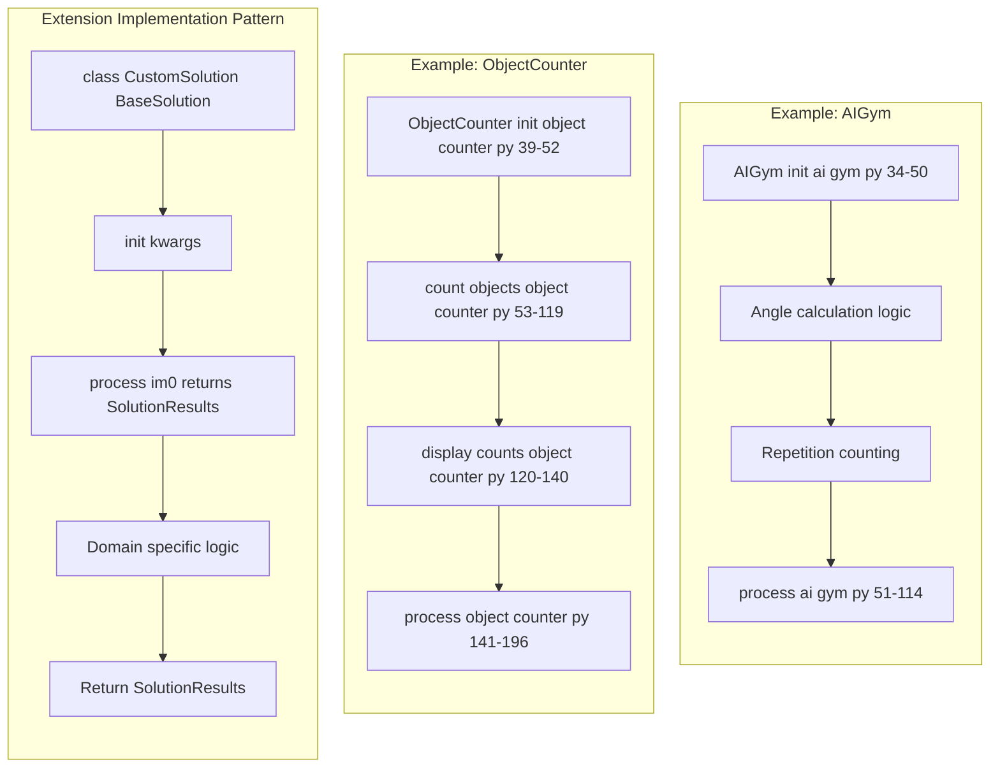
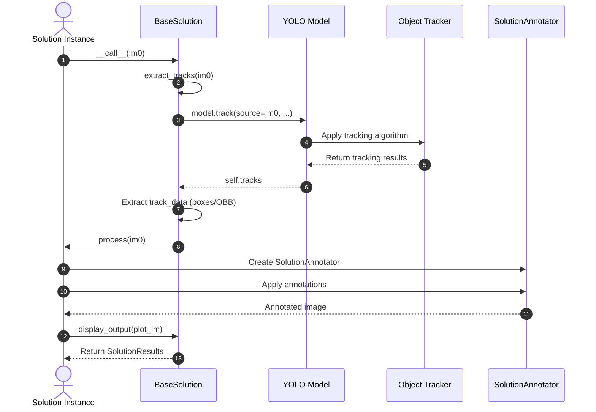

# BaseSolution Architecture

Relevant source files

- [docs/en/guides/distance-calculation.md](https://github.com/ultralytics/ultralytics/blob/42d15b69/docs/en/guides/distance-calculation.md)
- [docs/en/guides/heatmaps.md](https://github.com/ultralytics/ultralytics/blob/42d15b69/docs/en/guides/heatmaps.md)
- [docs/en/guides/object-counting.md](https://github.com/ultralytics/ultralytics/blob/42d15b69/docs/en/guides/object-counting.md)
- [docs/en/guides/queue-management.md](https://github.com/ultralytics/ultralytics/blob/42d15b69/docs/en/guides/queue-management.md)
- [docs/en/guides/region-counting.md](https://github.com/ultralytics/ultralytics/blob/42d15b69/docs/en/guides/region-counting.md)
- [docs/en/guides/speed-estimation.md](https://github.com/ultralytics/ultralytics/blob/42d15b69/docs/en/guides/speed-estimation.md)
- [docs/en/guides/workouts-monitoring.md](https://github.com/ultralytics/ultralytics/blob/42d15b69/docs/en/guides/workouts-monitoring.md)
- [tests/test_solutions.py](https://github.com/ultralytics/ultralytics/blob/42d15b69/tests/test_solutions.py)
- [ultralytics/solutions/ai_gym.py](https://github.com/ultralytics/ultralytics/blob/42d15b69/ultralytics/solutions/ai_gym.py)
- [ultralytics/solutions/distance_calculation.py](https://github.com/ultralytics/ultralytics/blob/42d15b69/ultralytics/solutions/distance_calculation.py)
- [ultralytics/solutions/heatmap.py](https://github.com/ultralytics/ultralytics/blob/42d15b69/ultralytics/solutions/heatmap.py)
- [ultralytics/solutions/instance_segmentation.py](https://github.com/ultralytics/ultralytics/blob/42d15b69/ultralytics/solutions/instance_segmentation.py)
- [ultralytics/solutions/object_counter.py](https://github.com/ultralytics/ultralytics/blob/42d15b69/ultralytics/solutions/object_counter.py)
- [ultralytics/solutions/queue_management.py](https://github.com/ultralytics/ultralytics/blob/42d15b69/ultralytics/solutions/queue_management.py)
- [ultralytics/solutions/region_counter.py](https://github.com/ultralytics/ultralytics/blob/42d15b69/ultralytics/solutions/region_counter.py)
- [ultralytics/solutions/solutions.py](https://github.com/ultralytics/ultralytics/blob/42d15b69/ultralytics/solutions/solutions.py)
- [ultralytics/solutions/speed_estimation.py](https://github.com/ultralytics/ultralytics/blob/42d15b69/ultralytics/solutions/speed_estimation.py)
- [ultralytics/solutions/trackzone.py](https://github.com/ultralytics/ultralytics/blob/42d15b69/ultralytics/solutions/trackzone.py)

This document covers the core solution framework architecture in Ultralytics, including the `BaseSolution` class, `SolutionAnnotator`, `SolutionResults`, and common patterns for building custom computer vision solutions. This framework provides the foundation for all pre-built solutions like object counting, heatmaps, speed estimation, and workout monitoring.

For information about specific solution implementations, see [Advanced Solutions and Applications](https://deepwiki.com/ultralytics/ultralytics/6.2-dataset-classes-and-formats). For general data processing pipelines, see [Data Processing Pipeline](https://deepwiki.com/ultralytics/ultralytics/5-results-and-visualization).

## Core Architecture Overview

The BaseSolution architecture provides a standardized framework for building computer vision solutions that integrate with YOLO models. The system is built around three main components that work together to provide tracking, annotation, and result management.

### System Component Relationships





**Sources:** [ultralytics/solutions/solutions.py1-826](https://github.com/ultralytics/ultralytics/blob/42d15b69/ultralytics/solutions/solutions.py#L1-L826) [ultralytics/solutions/object_counter.py1-196](https://github.com/ultralytics/ultralytics/blob/42d15b69/ultralytics/solutions/object_counter.py#L1-L196) [ultralytics/solutions/heatmap.py1-130](https://github.com/ultralytics/ultralytics/blob/42d15b69/ultralytics/solutions/heatmap.py#L1-L130) [ultralytics/solutions/ai_gym.py1-115](https://github.com/ultralytics/ultralytics/blob/42d15b69/ultralytics/solutions/ai_gym.py#L1-L115) [ultralytics/solutions/speed_estimation.py1-118](https://github.com/ultralytics/ultralytics/blob/42d15b69/ultralytics/solutions/speed_estimation.py#L1-L118) [ultralytics/solutions/distance_calculation.py1-127](https://github.com/ultralytics/ultralytics/blob/42d15b69/ultralytics/solutions/distance_calculation.py#L1-L127)

## BaseSolution Class Architecture

The `BaseSolution` class serves as the abstract base for all computer vision solutions, providing core functionality for model loading, object tracking, region initialization, and result processing.

### BaseSolution Core Components

```mermaid
flowchart TB

  subgraph BaseSolution_Initialization["BaseSolution Initialization"]
    Constructor["init solutions py 73 137"]
    ConfigLoad["SolutionConfig self CFG"]
    ModelLoad["YOLO Model self model"]
    ShapelyImport["Shapely Geometry LineString Polygon Point"]

    Constructor --> ConfigLoad
    Constructor --> ModelLoad
    Constructor --> ShapelyImport
  end

  subgraph Processing_Flow["Processing Flow"]
    CallMethod["call solutions py 243 262"]
    ProcessMethod["process abstract method"]
    DisplayOutput["display output solutions py 214 239"]

    CallMethod --> ProcessMethod --> DisplayOutput
  end

  subgraph Region_Management["Region Management"]
    InitRegion["initialize region solutions py 206 213"]
    RegionPoints["Region Points self region"]
    RegionGeometry["Region Geometry self r_s"]

    InitRegion --> RegionGeometry
    RegionPoints --> RegionGeometry
  end

  subgraph Tracking_Infrastructure["Tracking Infrastructure"]
    ExtractTracks["extract_tracks solutions py 157 184"]
    TrackData["Track Data self track_data"]
    StoreHistory["store_tracking_history solutions py 185 205"]
    TrackHistory["track_history defaultdict"]

    ExtractTracks --> TrackData --> StoreHistory --> TrackHistory
  end
```








**Sources:** [ultralytics/solutions/solutions.py73-262](https://github.com/ultralytics/ultralytics/blob/42d15b69/ultralytics/solutions/solutions.py#L73-L262)

### Key Attributes and Methods

The `BaseSolution` class maintains several critical attributes for solution operation:

|Attribute|Type|Purpose|
|---|---|---|
|`CFG`|`Dict[str, Any]`|Configuration dictionary from `SolutionConfig`|
|`model`|`YOLO`|Loaded YOLO model instance|
|`tracks`|Object|YOLO tracking results from latest inference|
|`track_data`|Object|Extracted tracking data (boxes or OBB)|
|`track_history`|`defaultdict`|Dictionary storing tracking history per object|
|`region`|`List[Tuple[int, int]]`|List of coordinate tuples defining region of interest|
|`r_s`|Geometry|Region or line geometry object for spatial operations|

**Sources:** [ultralytics/solutions/solutions.py26-56](https://github.com/ultralytics/ultralytics/blob/42d15b69/ultralytics/solutions/solutions.py#L26-L56)

Core methods include:

- `extract_tracks(im0)` - Applies object tracking and extracts tracks from input image
- `store_tracking_history(track_id, box)` - Updates tracking history for given track ID
- `initialize_region()` - Initializes counting region and line segment based on configuration
- `adjust_box_label(cls, conf, track_id)` - Generates formatted labels for bounding boxes
- `display_output(plot_im)` - Displays processing results

**Sources:** [ultralytics/solutions/solutions.py138-241](https://github.com/ultralytics/ultralytics/blob/42d15b69/ultralytics/solutions/solutions.py#L138-L241)

## SolutionAnnotator Visualization System

The `SolutionAnnotator` class extends the base `Annotator` class to provide specialized visualization methods for solution-specific annotations and overlays.

### SolutionAnnotator Method Categories



**Sources:** [ultralytics/solutions/solutions.py264-755](https://github.com/ultralytics/ultralytics/blob/42d15b69/ultralytics/solutions/solutions.py#L264-L755)

## SolutionResults Data Structure

The `SolutionResults` class encapsulates all outputs from solution processing, providing a consistent interface for accessing results across different solution types.

### SolutionResults Attributes



**Sources:** [ultralytics/solutions/solutions.py757-826](https://github.com/ultralytics/ultralytics/blob/42d15b69/ultralytics/solutions/solutions.py#L757-L826)

## Solution Extension Patterns

The framework defines consistent patterns for extending `BaseSolution` to create specialized computer vision solutions. Each solution follows a standard structure while implementing domain-specific logic.

### Common Extension Pattern



**Sources:** [ultralytics/solutions/object_counter.py39-196](https://github.com/ultralytics/ultralytics/blob/42d15b69/ultralytics/solutions/object_counter.py#L39-L196) [ultralytics/solutions/ai_gym.py34-114](https://github.com/ultralytics/ultralytics/blob/42d15b69/ultralytics/solutions/ai_gym.py#L34-L114)

### Configuration Integration

All solutions integrate with the `SolutionConfig` system through the `CFG` attribute, which provides centralized configuration management:

```
# Configuration access pattern used across solutions
self.CFG = vars(SolutionConfig().update(**kwargs))
self.region = self.CFG["region"]
self.line_width = self.CFG["line_width"]
self.show_conf = self.CFG["show_conf"]
```

**Sources:** [ultralytics/solutions/solutions.py81-114](https://github.com/ultralytics/ultralytics/blob/42d15b69/ultralytics/solutions/solutions.py#L81-L114)

## Integration with YOLO Tracking System

The BaseSolution framework integrates seamlessly with the YOLO model ecosystem, providing object detection and tracking capabilities as core services.

### YOLO Integration Flow





**Sources:** [ultralytics/solutions/solutions.py157-184](https://github.com/ultralytics/ultralytics/blob/42d15b69/ultralytics/solutions/solutions.py#L157-L184) [ultralytics/solutions/solutions.py243-262](https://github.com/ultralytics/ultralytics/blob/42d15b69/ultralytics/solutions/solutions.py#L243-L262)

The tracking integration provides essential data structures:

- `self.boxes` - Bounding box coordinates (xyxy or xyxyxyxy for OBB)
- `self.clss` - Class indices from tracking results
- `self.track_ids` - Track IDs from tracking results
- `self.confs` - Confidence scores from tracking results

**Sources:** [ultralytics/solutions/solutions.py176-183](https://github.com/ultralytics/ultralytics/blob/42d15b69/ultralytics/solutions/solutions.py#L176-L183)

## Performance Monitoring

The framework includes built-in performance profiling through the `ops.Profile` system, tracking both tracking and solution-specific processing times:

```
self.profilers = (
    ops.Profile(device=self.device),  # track
    ops.Profile(device=self.device),  # solution
)
```

Performance metrics are automatically calculated and included in the returned `SolutionResults` with timing information for tracking and solution processing phases.

**Sources:** [ultralytics/solutions/solutions.py133-136](https://github.com/ultralytics/ultralytics/blob/42d15b69/ultralytics/solutions/solutions.py#L133-L136) [ultralytics/solutions/solutions.py245-261](https://github.com/ultralytics/ultralytics/blob/42d15b69/ultralytics/solutions/solutions.py#L245-L261)