# Solution Applications

Relevant source files

- [docs/en/guides/distance-calculation.md](https://github.com/ultralytics/ultralytics/blob/42d15b69/docs/en/guides/distance-calculation.md)
- [docs/en/guides/heatmaps.md](https://github.com/ultralytics/ultralytics/blob/42d15b69/docs/en/guides/heatmaps.md)
- [docs/en/guides/object-counting.md](https://github.com/ultralytics/ultralytics/blob/42d15b69/docs/en/guides/object-counting.md)
- [docs/en/guides/queue-management.md](https://github.com/ultralytics/ultralytics/blob/42d15b69/docs/en/guides/queue-management.md)
- [docs/en/guides/region-counting.md](https://github.com/ultralytics/ultralytics/blob/42d15b69/docs/en/guides/region-counting.md)
- [docs/en/guides/speed-estimation.md](https://github.com/ultralytics/ultralytics/blob/42d15b69/docs/en/guides/speed-estimation.md)
- [docs/en/guides/workouts-monitoring.md](https://github.com/ultralytics/ultralytics/blob/42d15b69/docs/en/guides/workouts-monitoring.md)
- [tests/test_solutions.py](https://github.com/ultralytics/ultralytics/blob/42d15b69/tests/test_solutions.py)
- [ultralytics/solutions/ai_gym.py](https://github.com/ultralytics/ultralytics/blob/42d15b69/ultralytics/solutions/ai_gym.py)
- [ultralytics/solutions/distance_calculation.py](https://github.com/ultralytics/ultralytics/blob/42d15b69/ultralytics/solutions/distance_calculation.py)
- [ultralytics/solutions/heatmap.py](https://github.com/ultralytics/ultralytics/blob/42d15b69/ultralytics/solutions/heatmap.py)
- [ultralytics/solutions/instance_segmentation.py](https://github.com/ultralytics/ultralytics/blob/42d15b69/ultralytics/solutions/instance_segmentation.py)
- [ultralytics/solutions/object_counter.py](https://github.com/ultralytics/ultralytics/blob/42d15b69/ultralytics/solutions/object_counter.py)
- [ultralytics/solutions/queue_management.py](https://github.com/ultralytics/ultralytics/blob/42d15b69/ultralytics/solutions/queue_management.py)
- [ultralytics/solutions/region_counter.py](https://github.com/ultralytics/ultralytics/blob/42d15b69/ultralytics/solutions/region_counter.py)
- [ultralytics/solutions/solutions.py](https://github.com/ultralytics/ultralytics/blob/42d15b69/ultralytics/solutions/solutions.py)
- [ultralytics/solutions/speed_estimation.py](https://github.com/ultralytics/ultralytics/blob/42d15b69/ultralytics/solutions/speed_estimation.py)
- [ultralytics/solutions/trackzone.py](https://github.com/ultralytics/ultralytics/blob/42d15b69/ultralytics/solutions/trackzone.py)

This document covers specific solution implementations built on the BaseSolution framework. Each solution provides production-ready functionality for real-world computer vision applications including object counting, heatmap generation, speed estimation, queue management, region-based counting, distance measurement, and workout monitoring.

For information about the core BaseSolution architecture and common framework components, see page 7.1.

## Solutions Overview

The Solutions framework provides seven specialized applications that extend `BaseSolution` to deliver task-specific computer vision capabilities. Each solution inherits core functionality from `BaseSolution` while implementing specialized processing logic.

**Solutions Class Hierarchy**


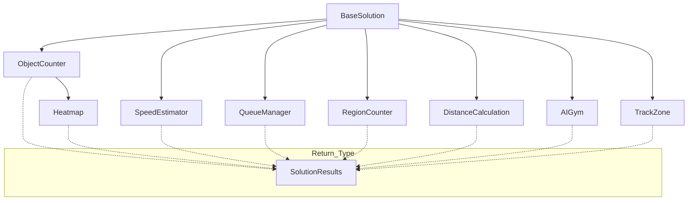


|Solution Class|Primary Use Case|Key Output Metrics|
|---|---|---|
|`ObjectCounter`|In/out counting across lines or regions|`in_count`, `out_count`, `classwise_count`|
|`Heatmap`|Visualizing movement patterns and density|Heat intensity overlay, optional counts|
|`SpeedEstimator`|Vehicle or object speed measurement|`speed_dict` (km/h per object)|
|`QueueManager`|Queue length monitoring|`queue_count`|
|`RegionCounter`|Multi-region simultaneous counting|`region_counts` (per-region totals)|
|`DistanceCalculation`|Object spacing measurement|`pixels_distance`|
|`AIGym`|Exercise repetition counting|`workout_count`, `workout_angle`, `workout_stage`|

Sources: [ultralytics/solutions/object_counter.py12-40](https://github.com/ultralytics/ultralytics/blob/42d15b69/ultralytics/solutions/object_counter.py#L12-L40) [ultralytics/solutions/heatmap.py14-36](https://github.com/ultralytics/ultralytics/blob/42d15b69/ultralytics/solutions/heatmap.py#L14-L36) [ultralytics/solutions/speed_estimation.py11-42](https://github.com/ultralytics/ultralytics/blob/42d15b69/ultralytics/solutions/speed_estimation.py#L11-L42) [ultralytics/solutions/queue_management.py9-38](https://github.com/ultralytics/ultralytics/blob/42d15b69/ultralytics/solutions/queue_management.py#L9-L38) [ultralytics/solutions/region_counter.py13-39](https://github.com/ultralytics/ultralytics/blob/42d15b69/ultralytics/solutions/region_counter.py#L13-L39) [ultralytics/solutions/distance_calculation.py12-34](https://github.com/ultralytics/ultralytics/blob/42d15b69/ultralytics/solutions/distance_calculation.py#L12-L34) [ultralytics/solutions/ai_gym.py9-32](https://github.com/ultralytics/ultralytics/blob/42d15b69/ultralytics/solutions/ai_gym.py#L9-L32) [ultralytics/solutions/solutions.py759-813](https://github.com/ultralytics/ultralytics/blob/42d15b69/ultralytics/solutions/solutions.py#L759-L813)

## ObjectCounter

`ObjectCounter` manages real-time object counting across user-defined lines or polygonal regions. It tracks objects entering and exiting regions with directional awareness and per-class counting.

**ObjectCounter Processing Flow**


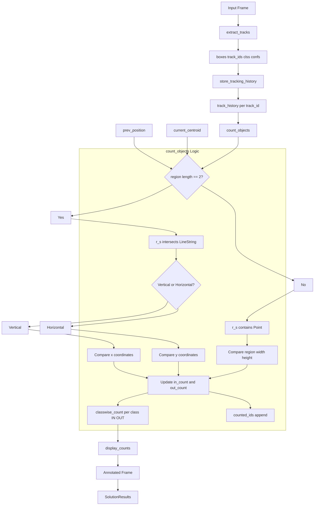


### Key Attributes

|Attribute|Type|Purpose|
|---|---|---|
|`in_count`|int|Total objects moving inward|
|`out_count`|int|Total objects moving outward|
|`counted_ids`|list[int]|IDs of objects already counted (prevents double-counting)|
|`classwise_count`|dict[str, dict[str, int]]|Per-class IN/OUT counts|
|`region_initialized`|bool|Flag for one-time region setup|
|`show_in`|bool|Display inward count|
|`show_out`|bool|Display outward count|

### Counting Algorithm

The `count_objects()` method implements the core counting logic at [ultralytics/solutions/object_counter.py55-121](https://github.com/ultralytics/ultralytics/blob/42d15b69/ultralytics/solutions/object_counter.py#L55-L121):
```python
    def count_objects(
        self,
        current_centroid: tuple[float, float],
        track_id: int,
        prev_position: tuple[float, float] | None,
        cls: int,
    ) -> None:
        """
        Count objects within a polygonal or linear region based on their tracks.

        Args:
            current_centroid (tuple[float, float]): Current centroid coordinates (x, y) in the current frame.
            track_id (int): Unique identifier for the tracked object.
            prev_position (tuple[float, float], optional): Last frame position coordinates (x, y) of the track.
            cls (int): Class index for classwise count updates.

        Examples:
            >>> counter = ObjectCounter()
            >>> track_line = {1: [100, 200], 2: [110, 210], 3: [120, 220]}
            >>> box = [130, 230, 150, 250]
            >>> track_id_num = 1
            >>> previous_position = (120, 220)
            >>> class_to_count = 0  # In COCO model, class 0 = person
            >>> counter.count_objects((140, 240), track_id_num, previous_position, class_to_count)
        """
        if prev_position is None or track_id in self.counted_ids:
            return


        if len(self.region) == 2:  # Linear region (defined as a line segment)
            if self.r_s.intersects(self.LineString([prev_position, current_centroid])):
                # Determine orientation of the region (vertical or horizontal)
                if abs(self.region[0][0] - self.region[1][0]) < abs(self.region[0][1] - self.region[1][1]):
                    # Vertical region: Compare x-coordinates to determine direction
                    if current_centroid[0] > prev_position[0]:  # Moving right
                        self.in_count += 1
                        self.classwise_count[self.names[cls]]["IN"] += 1
                    else:  # Moving left
                        self.out_count += 1
                        self.classwise_count[self.names[cls]]["OUT"] += 1
                # Horizontal region: Compare y-coordinates to determine direction
                elif current_centroid[1] > prev_position[1]:  # Moving downward
                    self.in_count += 1
                    self.classwise_count[self.names[cls]]["IN"] += 1
                else:  # Moving upward
                    self.out_count += 1
                    self.classwise_count[self.names[cls]]["OUT"] += 1
                self.counted_ids.append(track_id)


        elif len(self.region) > 2:  # Polygonal region
            if self.r_s.contains(self.Point(current_centroid)):
                # Determine motion direction for vertical or horizontal polygons
                region_width = max(p[0] for p in self.region) - min(p[0] for p in self.region)
                region_height = max(p[1] for p in self.region) - min(p[1] for p in self.region)


                if (
                    region_width < region_height
                    and current_centroid[0] > prev_position[0]
                    or region_width >= region_height
                    and current_centroid[1] > prev_position[1]
                ):  # Moving right or downward
                    self.in_count += 1
                    self.classwise_count[self.names[cls]]["IN"] += 1
                else:  # Moving left or upward
                    self.out_count += 1
                    self.classwise_count[self.names[cls]]["OUT"] += 1
                self.counted_ids.append(track_id)


```

1. **Intersection Detection**: For 2-point regions (lines), use `r_s.intersects(LineString([prev_position, current_centroid]))` to detect line crossing
2. **Direction Determination**:
    - For vertical lines: compare x-coordinates (moving right = IN, left = OUT)
    - For horizontal lines: compare y-coordinates (moving down = IN, up = OUT)
3. **Polygon Containment**: For 3+ point regions, use `r_s.contains(Point(current_centroid))` to check if object entered the region
4. **Motion Direction**: Analyze region dimensions and centroid displacement to determine IN/OUT direction
5. **Count Update**: Increment appropriate counters and update `classwise_count` dictionary

### Configuration Example

```
from ultralytics import solutions

# Linear region (vertical line)
region_line = [(320, 0), (320, 480)]

counter = solutions.ObjectCounter(
    region=region_line,
    model="yolo11n.pt",
    show_in=True,
    show_out=True,
    classes=[0, 2],  # Count only persons and cars
)
```

Sources: [ultralytics/solutions/object_counter.py12-197](https://github.com/ultralytics/ultralytics/blob/42d15b69/ultralytics/solutions/object_counter.py#L12-L197) [docs/en/guides/object-counting.md39-98](cupertino/nvr/docs/references/ultralitycs/guides/object-counting.md#L39-L98)

```python
class ObjectCounter(BaseSolution):
    """
    A class to manage the counting of objects in a real-time video stream based on their tracks.

    This class extends the BaseSolution class and provides functionality for counting objects moving in and out of a
    specified region in a video stream. It supports both polygonal and linear regions for counting.

    Attributes:
        in_count (int): Counter for objects moving inward.
        out_count (int): Counter for objects moving outward.
        counted_ids (list[int]): List of IDs of objects that have been counted.
        classwise_counts (dict[str, dict[str, int]]): Dictionary for counts, categorized by object class.
        region_initialized (bool): Flag indicating whether the counting region has been initialized.
        show_in (bool): Flag to control display of inward count.
        show_out (bool): Flag to control display of outward count.
        margin (int): Margin for background rectangle size to display counts properly.

    Methods:
        count_objects: Count objects within a polygonal or linear region based on their tracks.
        display_counts: Display object counts on the frame.
        process: Process input data and update counts.

    Examples:
        >>> counter = ObjectCounter()
        >>> frame = cv2.imread("frame.jpg")
        >>> results = counter.process(frame)
        >>> print(f"Inward count: {counter.in_count}, Outward count: {counter.out_count}")
    """


    def __init__(self, **kwargs: Any) -> None:
        """Initialize the ObjectCounter class for real-time object counting in video streams."""
        super().__init__(**kwargs)


        self.in_count = 0  # Counter for objects moving inward
        self.out_count = 0  # Counter for objects moving outward
        self.counted_ids = []  # List of IDs of objects that have been counted
        self.classwise_count = defaultdict(lambda: {"IN": 0, "OUT": 0})  # Dictionary for counts, categorized by class
        self.region_initialized = False  # Flag indicating whether the region has been initialized


        self.show_in = self.CFG["show_in"]
        self.show_out = self.CFG["show_out"]
        self.margin = self.line_width * 2  # Scales the background rectangle size to display counts properly


    def count_objects(
        self,
        current_centroid: tuple[float, float],
        track_id: int,
        prev_position: tuple[float, float] | None,
        cls: int,
    ) -> None:
        """
        Count objects within a polygonal or linear region based on their tracks.

        Args:
            current_centroid (tuple[float, float]): Current centroid coordinates (x, y) in the current frame.
            track_id (int): Unique identifier for the tracked object.
            prev_position (tuple[float, float], optional): Last frame position coordinates (x, y) of the track.
            cls (int): Class index for classwise count updates.

        Examples:
            >>> counter = ObjectCounter()
            >>> track_line = {1: [100, 200], 2: [110, 210], 3: [120, 220]}
            >>> box = [130, 230, 150, 250]
            >>> track_id_num = 1
            >>> previous_position = (120, 220)
            >>> class_to_count = 0  # In COCO model, class 0 = person
            >>> counter.count_objects((140, 240), track_id_num, previous_position, class_to_count)
        """
        if prev_position is None or track_id in self.counted_ids:
            return


        if len(self.region) == 2:  # Linear region (defined as a line segment)
            if self.r_s.intersects(self.LineString([prev_position, current_centroid])):
                # Determine orientation of the region (vertical or horizontal)
                if abs(self.region[0][0] - self.region[1][0]) < abs(self.region[0][1] - self.region[1][1]):
                    # Vertical region: Compare x-coordinates to determine direction
                    if current_centroid[0] > prev_position[0]:  # Moving right
                        self.in_count += 1
                        self.classwise_count[self.names[cls]]["IN"] += 1
                    else:  # Moving left
                        self.out_count += 1
                        self.classwise_count[self.names[cls]]["OUT"] += 1
                # Horizontal region: Compare y-coordinates to determine direction
                elif current_centroid[1] > prev_position[1]:  # Moving downward
                    self.in_count += 1
                    self.classwise_count[self.names[cls]]["IN"] += 1
                else:  # Moving upward
                    self.out_count += 1
                    self.classwise_count[self.names[cls]]["OUT"] += 1
                self.counted_ids.append(track_id)


        elif len(self.region) > 2:  # Polygonal region
            if self.r_s.contains(self.Point(current_centroid)):
                # Determine motion direction for vertical or horizontal polygons
                region_width = max(p[0] for p in self.region) - min(p[0] for p in self.region)
                region_height = max(p[1] for p in self.region) - min(p[1] for p in self.region)


                if (
                    region_width < region_height
                    and current_centroid[0] > prev_position[0]
                    or region_width >= region_height
                    and current_centroid[1] > prev_position[1]
                ):  # Moving right or downward
                    self.in_count += 1
                    self.classwise_count[self.names[cls]]["IN"] += 1
                else:  # Moving left or upward
                    self.out_count += 1
                    self.classwise_count[self.names[cls]]["OUT"] += 1
                self.counted_ids.append(track_id)


    def display_counts(self, plot_im) -> None:
        """
        Display object counts on the input image or frame.

        Args:
            plot_im (np.ndarray): The image or frame to display counts on.

        Examples:
            >>> counter = ObjectCounter()
            >>> frame = cv2.imread("image.jpg")
            >>> counter.display_counts(frame)
        """
        labels_dict = {
            str.capitalize(key): f"{'IN ' + str(value['IN']) if self.show_in else ''} "
            f"{'OUT ' + str(value['OUT']) if self.show_out else ''}".strip()
            for key, value in self.classwise_count.items()
            if value["IN"] != 0 or value["OUT"] != 0 and (self.show_in or self.show_out)
        }
        if labels_dict:
            self.annotator.display_analytics(plot_im, labels_dict, (104, 31, 17), (255, 255, 255), self.margin)


    def process(self, im0) -> SolutionResults:
        """
        Process input data (frames or object tracks) and update object counts.

        This method initializes the counting region, extracts tracks, draws bounding boxes and regions, updates
        object counts, and displays the results on the input image.

        Args:
            im0 (np.ndarray): The input image or frame to be processed.

        Returns:
            (SolutionResults): Contains processed image `im0`, 'in_count' (int, count of objects entering the region),
                'out_count' (int, count of objects exiting the region), 'classwise_count' (dict, per-class object count),
                and 'total_tracks' (int, total number of tracked objects).

        Examples:
            >>> counter = ObjectCounter()
            >>> frame = cv2.imread("path/to/image.jpg")
            >>> results = counter.process(frame)
        """
        if not self.region_initialized:
            self.initialize_region()
            self.region_initialized = True


        self.extract_tracks(im0)  # Extract tracks
        self.annotator = SolutionAnnotator(im0, line_width=self.line_width)  # Initialize annotator


        self.annotator.draw_region(
            reg_pts=self.region, color=(104, 0, 123), thickness=self.line_width * 2
        )  # Draw region


        # Iterate over bounding boxes, track ids and classes index
        for box, track_id, cls, conf in zip(self.boxes, self.track_ids, self.clss, self.confs):
            # Draw bounding box and counting region
            self.annotator.box_label(box, label=self.adjust_box_label(cls, conf, track_id), color=colors(cls, True))
            self.store_tracking_history(track_id, box)  # Store track history


            # Store previous position of track for object counting
            prev_position = None
            if len(self.track_history[track_id]) > 1:
                prev_position = self.track_history[track_id][-2]
            self.count_objects(self.track_history[track_id][-1], track_id, prev_position, cls)  # object counting


        plot_im = self.annotator.result()
        self.display_counts(plot_im)  # Display the counts on the frame
        self.display_output(plot_im)  # Display output with base class function


        # Return SolutionResults
        return SolutionResults(
            plot_im=plot_im,
            in_count=self.in_count,
            out_count=self.out_count,
            classwise_count=dict(self.classwise_count),
            total_tracks=len(self.track_ids),
        )

```

```python

""" 
 example "Object Counting using Ultralytics YOLO"

    === "CLI"


        ```bash
        # Run a counting example
        yolo solutions count show=True


        # Pass a source video
        yolo solutions count source="path/to/video.mp4"


        # Pass region coordinates
        yolo solutions count region="[(20, 400), (1080, 400), (1080, 360), (20, 360)]"
        ```

"""

import cv2


from ultralytics import solutions


cap = cv2.VideoCapture("path/to/video.mp4")
assert cap.isOpened(), "Error reading video file"


# region_points = [(20, 400), (1080, 400)]                                      # line counting
region_points = [(20, 400), (1080, 400), (1080, 360), (20, 360)]  # rectangle region
# region_points = [(20, 400), (1080, 400), (1080, 360), (20, 360), (20, 400)]   # polygon region


# Video writer
w, h, fps = (int(cap.get(x)) for x in (cv2.CAP_PROP_FRAME_WIDTH, cv2.CAP_PROP_FRAME_HEIGHT, cv2.CAP_PROP_FPS))
video_writer = cv2.VideoWriter("object_counting_output.avi", cv2.VideoWriter_fourcc(*"mp4v"), fps, (w, h))


# Initialize object counter object
counter = solutions.ObjectCounter(
	show=True,  # display the output
	region=region_points,  # pass region points
	model="yolo11n.pt",  # model="yolo11n-obb.pt" for object counting with OBB model.
	# classes=[0, 2],  # count specific classes i.e. person and car with COCO pretrained model.
	# tracker="botsort.yaml",  # choose trackers i.e "bytetrack.yaml"
)


# Process video
while cap.isOpened():
	success, im0 = cap.read()


	if not success:
		print("Video frame is empty or processing is complete.")
		break


	results = counter(im0)


	# print(results)  # access the output


	video_writer.write(results.plot_im)  # write the processed frame.


cap.release()
video_writer.release()
cv2.destroyAllWindows()  # destroy all opened windows```

```


---
---

## Heatmap

`Heatmap` extends `ObjectCounter` to generate cumulative density visualizations showing movement patterns over time. It overlays color-coded intensity maps on video frames using OpenCV colormaps.

**Heatmap Generation Workflow**


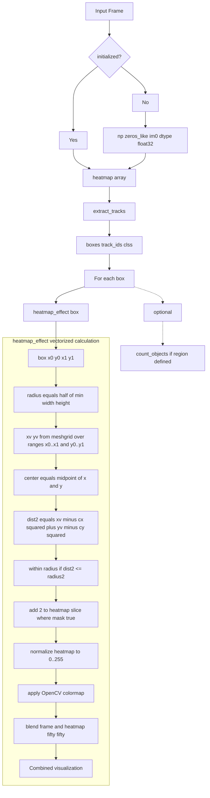


### Key Attributes

|Attribute|Type|Purpose|
|---|---|---|
|`initialized`|bool|Tracks one-time heatmap array initialization|
|`colormap`|int|OpenCV colormap constant (e.g., `cv2.COLORMAP_PARULA`)|
|`heatmap`|np.ndarray|Cumulative intensity array (float32)|

### Heatmap Effect Calculation

The `heatmap_effect()` method at [ultralytics/solutions/heatmap.py55-76](https://github.com/ultralytics/ultralytics/blob/42d15b69/ultralytics/solutions/heatmap.py#L55-L76) uses vectorized NumPy operations for efficiency:

1. **ROI Generation**: Create meshgrid of coordinates within bounding box
2. **Distance Calculation**: Compute squared distances from box center
3. **Circular Masking**: Generate boolean mask for points within circular radius
4. **Intensity Update**: Add heat value (2) to all masked positions in single operation

### Colormap Options

The `colormap` parameter accepts any OpenCV colormap constant. Common options include:

|Colormap|Visual Style|Use Case|
|---|---|---|
|`cv2.COLORMAP_JET`|Blue → Red spectrum|General purpose, high contrast|
|`cv2.COLORMAP_PARULA`|Blue → Yellow|Perceptually uniform|
|`cv2.COLORMAP_INFERNO`|Dark → Bright Yellow|Low-light visualization|
|`cv2.COLORMAP_VIRIDIS`|Purple → Green → Yellow|Colorblind-friendly|

### Optional Region Counting

When `region` is provided during initialization, `Heatmap` inherits counting functionality from `ObjectCounter`. The `process()` method at [ultralytics/solutions/heatmap.py77-131](https://github.com/ultralytics/ultralytics/blob/42d15b69/ultralytics/solutions/heatmap.py#L77-L131) conditionally calls `count_objects()` and `display_counts()` if region is defined.

Sources: [ultralytics/solutions/heatmap.py14-132](https://github.com/ultralytics/ultralytics/blob/42d15b69/ultralytics/solutions/heatmap.py#L14-L132) [docs/en/guides/heatmaps.md39-103](https://github.com/ultralytics/ultralytics/blob/42d15b69/docs/en/guides/heatmaps.md#L39-L103)

## SpeedEstimator

`SpeedEstimator` calculates object velocities by tracking position changes over time. It converts pixel displacement to real-world speed measurements (km/h) using configurable scale factors and frame rate information.

**Speed Estimation Data Flow**


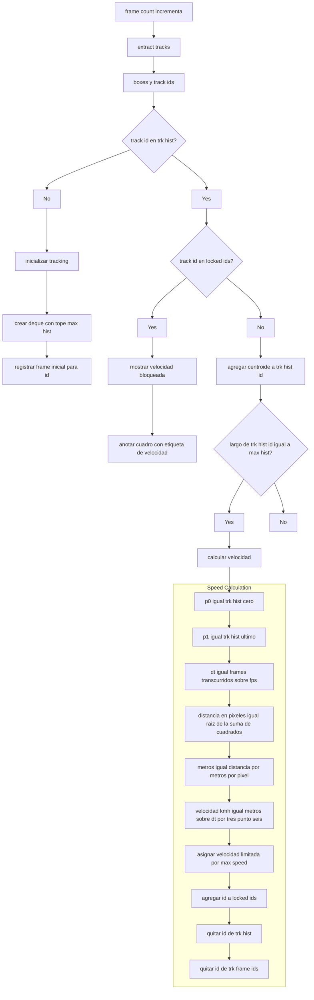

### Key Attributes

|Attribute|Type|Purpose|
|---|---|---|
|`fps`|float|Video frame rate for temporal calculations|
|`frame_count`|int|Global frame counter|
|`trk_frame_ids`|dict[int, int]|Maps track ID to first frame index|
|`spd`|dict[int, int]|Final speeds (km/h) per track ID|
|`trk_hist`|dict[int, deque]|Position history per track|
|`locked_ids`|set[int]|Track IDs with finalized speeds|
|`max_hist`|int|Required frames before calculation (default: 5)|
|`meter_per_pixel`|float|Scene scale conversion (default: 0.05)|
|`max_speed`|int|Speed cap for outlier filtering (default: 120)|

### Speed Calculation Formula

The speed calculation at [ultralytics/solutions/speed_estimation.py95-107](https://github.com/ultralytics/ultralytics/blob/42d15b69/ultralytics/solutions/speed_estimation.py#L95-L107) uses this formula:

```
pixel_distance = sqrt((x1 - x0)² + (y1 - y0)²)
meters = pixel_distance × meter_per_pixel
time_seconds = frames_tracked / fps
speed_kmh = (meters / time_seconds) × 3.6
final_speed = min(speed_kmh, max_speed)
```

### Memory Management

Once a track's speed is calculated and locked:

1. Add to `locked_ids` set to prevent recalculation
2. Remove from `trk_hist` to free position history
3. Remove from `trk_frame_ids` to free frame reference

This prevents memory growth for long-running videos with many unique tracks.

### Calibration: meter_per_pixel

The `meter_per_pixel` parameter requires camera-specific calibration. To calibrate:

1. Measure a known real-world distance in the scene (e.g., lane width = 3.5 meters)
2. Count the pixel distance in the video frame (e.g., 70 pixels)
3. Calculate: `meter_per_pixel = 3.5 / 70 = 0.05`

Different scene depths require different calibration values. Position calibration markers at the depth where speed measurements will occur.

Sources: [ultralytics/solutions/speed_estimation.py11-118](https://github.com/ultralytics/ultralytics/blob/42d15b69/ultralytics/solutions/speed_estimation.py#L11-L118) [docs/en/guides/speed-estimation.md45-104](https://github.com/ultralytics/ultralytics/blob/42d15b69/docs/en/guides/speed-estimation.md#L45-L104)

## QueueManager

`QueueManager` monitors queue lengths by counting objects within a defined region. It provides real-time queue occupancy metrics for applications like retail checkout monitoring and service queue management.

**Queue Management Flow**


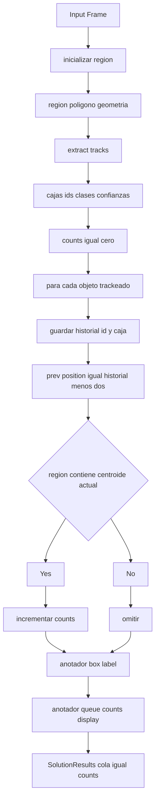
### Key Attributes

|Attribute|Type|Purpose|
|---|---|---|
|`counts`|int|Current queue length (reset each frame)|
|`rect_color`|tuple[int, int, int]|Region visualization color (255, 255, 255)|
|`region_length`|int|Number of region points (cached for efficiency)|

### Queue Counting Logic

The `process()` method at [ultralytics/solutions/queue_management.py48-95](https://github.com/ultralytics/ultralytics/blob/42d15b69/ultralytics/solutions/queue_management.py#L48-L95) implements frame-by-frame counting:

1. **Reset Counter**: Set `counts = 0` at start of each frame
2. **Extract Tracks**: Get current object positions
3. **Region Test**: For each object, check `r_s.contains(Point(centroid))`
4. **Increment**: If object is inside region, increment `counts`
5. **Display**: Show queue count overlaid on region center

### Visualization

The `queue_counts_display()` method at [ultralytics/solutions/solutions.py346-391](https://github.com/ultralytics/ultralytics/blob/42d15b69/ultralytics/solutions/solutions.py#L346-L391) renders the count:

- Calculates region centroid as text anchor point
- Draws background rectangle for text readability
- Centers "Queue Counts: N" text within region

Sources: [ultralytics/solutions/queue_management.py9-96](https://github.com/ultralytics/ultralytics/blob/42d15b69/ultralytics/solutions/queue_management.py#L9-L96) [docs/en/guides/queue-management.md40-96](https://github.com/ultralytics/ultralytics/blob/42d15b69/docs/en/guides/queue-management.md#L40-L96)

## RegionCounter

`RegionCounter` enables simultaneous counting across multiple user-defined regions. Each region tracks objects independently, providing per-region occupancy counts.

**Multi-Region Counting Architecture**


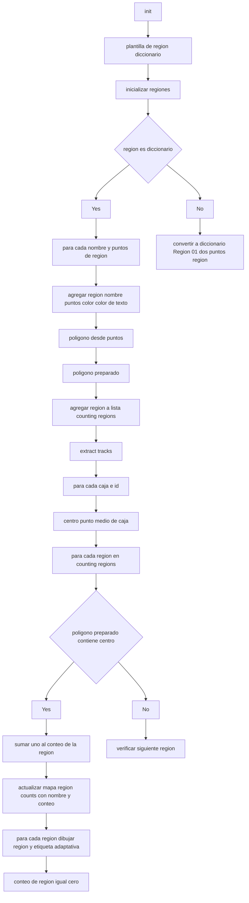
### Key Attributes

|Attribute|Type|Purpose|
|---|---|---|
|`region_template`|dict|Template for creating new regions with default values|
|`counting_regions`|list[dict]|List of region configurations|
|`region_counts`|dict[str, int]|Final count output per region name|

### Region Template Structure

Each region in `counting_regions` has this structure:

```
{
    "name": str,                    # Region identifier
    "polygon": Polygon,             # Shapely polygon geometry
    "counts": int,                  # Current frame count (reset each frame)
    "region_color": tuple,          # BGR visualization color
    "text_color": tuple,            # BGR text color
    "prepared_polygon": PreparedGeometry  # Optimized containment testing
}
```

### Optimized Containment Testing

The `initialize_regions()` method at [ultralytics/solutions/region_counter.py86-94](https://github.com/ultralytics/ultralytics/blob/42d15b69/ultralytics/solutions/region_counter.py#L86-L94) creates prepared geometries:

```
region["prepared_polygon"] = self.prep(region["polygon"])
```

Prepared geometries from Shapely's `prep()` function provide significantly faster containment testing for repeated queries against the same geometry. This optimization is critical when testing hundreds of objects per frame against multiple regions.

### Configuration Example

```
from ultralytics import solutions

# Define multiple regions
regions = {
    "Entrance": [(50, 50), (250, 50), (250, 250), (50, 250)],
    "Checkout": [(400, 100), (600, 100), (600, 300), (400, 300)],
    "Exit": [(700, 150), (900, 150), (900, 350), (700, 350)],
}

counter = solutions.RegionCounter(
    region=regions,
    model="yolo11n.pt",
)

# Access results
results = counter(frame)
print(results.region_counts)  # {"Entrance": 5, "Checkout": 3, "Exit": 2}
```

Sources: [ultralytics/solutions/region_counter.py13-137](https://github.com/ultralytics/ultralytics/blob/42d15b69/ultralytics/solutions/region_counter.py#L13-L137) [docs/en/guides/region-counting.md37-89](https://github.com/ultralytics/ultralytics/blob/42d15b69/docs/en/guides/region-counting.md#L37-L89)

## DistanceCalculation

`DistanceCalculation` enables interactive distance measurement between objects through mouse selection. Users click on two objects to calculate and visualize the Euclidean distance between their centroids.

**Distance Calculation Workflow**


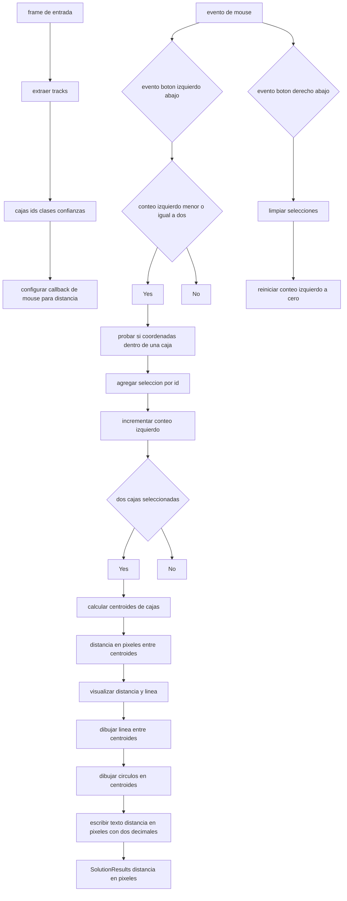
### Key Attributes

|Attribute|Type|Purpose|
|---|---|---|
|`left_mouse_count`|int|Tracks number of selections (max 2)|
|`selected_boxes`|dict[int, list[float]]|Maps track ID to bounding box coordinates|
|`centroids`|list[list[int]]|Temporary storage for selected centroids|

### Mouse Interaction Model

The `mouse_event_for_distance()` method at [ultralytics/solutions/distance_calculation.py45-70](https://github.com/ultralytics/ultralytics/blob/42d15b69/ultralytics/solutions/distance_calculation.py#L45-L70) handles user interaction:

**Left Click (cv2.EVENT_LBUTTONDOWN)**:

- Tests if click coordinates (x, y) fall within any bounding box
- If inside box and track_id not already selected, adds to `selected_boxes`
- Allows maximum of 2 selections

**Right Click (cv2.EVENT_RBUTTONDOWN)**:

- Clears all selections: `selected_boxes = {}`
- Resets counter: `left_mouse_count = 0`
- Enables new measurement

### Distance Calculation

When exactly 2 objects are selected, the `process()` method at [ultralytics/solutions/distance_calculation.py71-126](https://github.com/ultralytics/ultralytics/blob/42d15b69/ultralytics/solutions/distance_calculation.py#L71-L126) calculates distance:

```
# Calculate centroids
centroids = [
    [int((box[0] + box[2]) // 2), int((box[1] + box[3]) // 2)]
    for box in selected_boxes.values()
]

# Euclidean distance
pixels_distance = math.sqrt(
    (centroids[0][0] - centroids[1][0]) ** 2 +
    (centroids[0][1] - centroids[1][1]) ** 2
)
```

### Limitations

Distance measurements are estimates based on 2D image data:

- Assumes objects are at same depth in scene
- Pixel distances don't account for perspective distortion
- Most accurate for objects at similar distances from camera

Sources: [ultralytics/solutions/distance_calculation.py12-127](https://github.com/ultralytics/ultralytics/blob/42d15b69/ultralytics/solutions/distance_calculation.py#L12-L127) [docs/en/guides/distance-calculation.md49-89](https://github.com/ultralytics/ultralytics/blob/42d15b69/docs/en/guides/distance-calculation.md#L49-L89)

## AIGym

`AIGym` monitors workout exercises by tracking body pose angles and counting repetitions. It uses YOLO pose estimation to calculate joint angles and detect exercise stages (up/down positions).

**Workout Monitoring Pipeline**

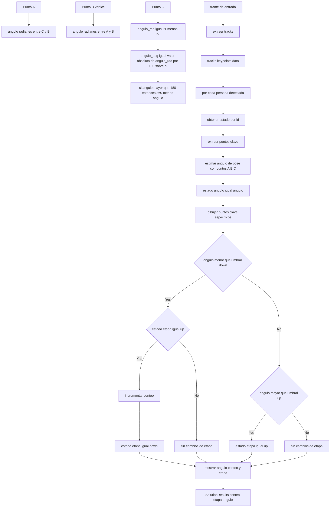

### Key Attributes

|Attribute|Type|Purpose|
|---|---|---|
|`states`|defaultdict|Per-track state: `{"angle": float, "count": int, "stage": str}`|
|`up_angle`|float|Angle threshold for "up" position (default: 145°)|
|`down_angle`|float|Angle threshold for "down" position (default: 90°)|
|`kpts`|list[int]|Keypoint indices for angle calculation|

### Exercise Configuration

Common keypoint combinations for different exercises:

|Exercise|Keypoint Indices|Body Points|
|---|---|---|
|Pushups|`[6, 8, 10]`|Left shoulder, elbow, wrist|
|Pullups|`[6, 8, 10]`|Left shoulder, elbow, wrist|
|Squats|`[11, 13, 15]`|Left hip, knee, ankle|
|Bicep Curls|`[5, 7, 9]`|Right shoulder, elbow, wrist|

### Pose Angle Calculation

The static `estimate_pose_angle()` method at [ultralytics/solutions/solutions.py428-444](https://github.com/ultralytics/ultralytics/blob/42d15b69/ultralytics/solutions/solutions.py#L428-L444) computes the angle at vertex point B formed by points A-B-C:

```
@lru_cache(maxsize=256)
def estimate_pose_angle(a, b, c):
    radians = math.atan2(c[1] - b[1], c[0] - b[0]) - \
              math.atan2(a[1] - b[1], a[0] - b[0])
    angle = abs(radians * 180.0 / math.pi)
    return angle if angle <= 180.0 else (360 - angle)
```

The `@lru_cache` decorator caches angle calculations for repeated keypoint combinations, improving performance.

### Repetition Counting Logic

The counting algorithm at [ultralytics/solutions/ai_gym.py89-94](https://github.com/ultralytics/ultralytics/blob/42d15b69/ultralytics/solutions/ai_gym.py#L89-L94) uses state transitions:

1. **Down Position**: When `angle < down_angle`:
    
    - If previous stage was "up", increment count (rep completed)
    - Set stage to "down"
2. **Up Position**: When `angle > up_angle`:
    
    - Set stage to "up" (ready for next rep)
3. **Intermediate**: When `down_angle <= angle <= up_angle`:
    
    - No state change, transitioning between positions

### Visualization

The `plot_angle_and_count_and_stage()` method at [ultralytics/solutions/solutions.py516-548](https://github.com/ultralytics/ultralytics/blob/42d15b69/ultralytics/solutions/solutions.py#L516-L548) displays:

- Current angle value
- Repetition count
- Current stage ("up" or "down")

All three metrics are stacked vertically near the center keypoint (elbow for pushups).

Sources: [ultralytics/solutions/ai_gym.py9-115](https://github.com/ultralytics/ultralytics/blob/42d15b69/ultralytics/solutions/ai_gym.py#L9-L115) [ultralytics/solutions/solutions.py428-548](https://github.com/ultralytics/ultralytics/blob/42d15b69/ultralytics/solutions/solutions.py#L428-L548) [docs/en/guides/workouts-monitoring.md39-94](https://github.com/ultralytics/ultralytics/blob/42d15b69/docs/en/guides/workouts-monitoring.md#L39-L94)

## Object Processing Solutions

### Object Cropping and Extraction

The `ObjectCropper` class extracts detected objects as separate image files using bounding box coordinates. It saves cropped regions to a specified directory with sequential naming.

The cropping process uses the `save_one_box` utility function which handles coordinate conversion and image file writing with proper BGR format preservation.


```mermaid
flowchart TB

%% ========== ObjectCropper: Recorte y Extracción de Objetos ==========

subgraph FM[File Management]
  cd[crop_dir]
  mk[Crear directorio si no existe]
  idx[crop_idx contador]
  pat[patrón nombre: crop_idx.jpg]
  cd --> mk --> idx --> pat
end

subgraph CW[Cropping Workflow]
  det[Detección de objetos]
  bb[Extracción de bounding boxes]
  for{{Para cada bbox detectado}}
  sob[save_one_box img, bbox, dir • convierte coordenadas • preserva formato BGR]
  wr[Escritura del archivo]
  seq[Nomenclatura secuencial]
  out[Crops guardados en disco]
  det --> bb --> for
  for --> sob --> wr --> seq --> out
end
```

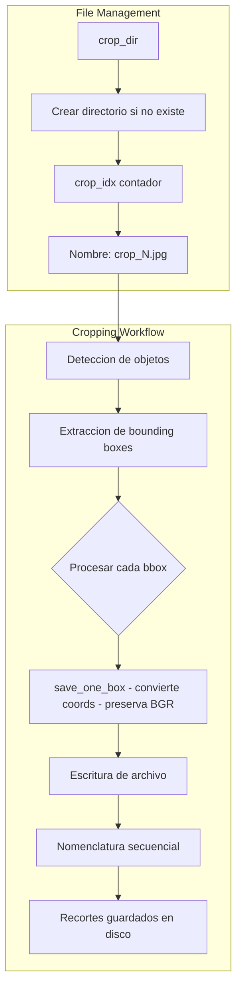


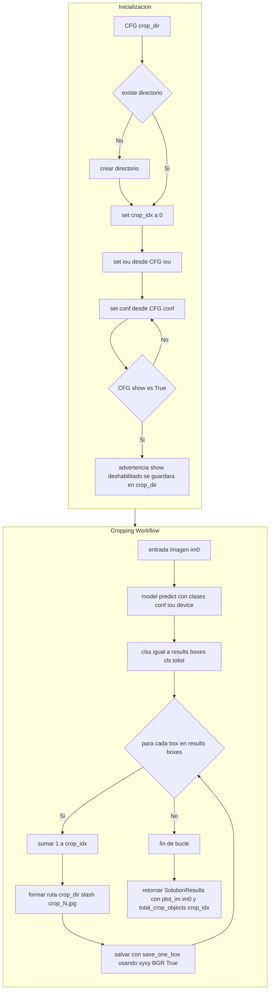


Sources: [ultralytics/solutions/object_cropper.py11-93](https://github.com/ultralytics/ultralytics/blob/42d15b69/ultralytics/solutions/object_cropper.py#L11-L93)
```python
class ObjectCropper(BaseSolution):
    """
    A class to manage the cropping of detected objects in a real-time video stream or images.

    This class extends the BaseSolution class and provides functionality for cropping objects based on detected bounding
    boxes. The cropped images are saved to a specified directory for further analysis or usage.

    Attributes:
        crop_dir (str): Directory where cropped object images are stored.
        crop_idx (int): Counter for the total number of cropped objects.
        iou (float): IoU (Intersection over Union) threshold for non-maximum suppression.
        conf (float): Confidence threshold for filtering detections.

    Methods:
        process: Crop detected objects from the input image and save them to the output directory.

    Examples:
        >>> cropper = ObjectCropper()
        >>> frame = cv2.imread("frame.jpg")
        >>> processed_results = cropper.process(frame)
        >>> print(f"Total cropped objects: {cropper.crop_idx}")
    """

    def __init__(self, **kwargs: Any) -> None:
        """
        Initialize the ObjectCropper class for cropping objects from detected bounding boxes.

        Args:
            **kwargs (Any): Keyword arguments passed to the parent class and used for configuration.
                crop_dir (str): Path to the directory for saving cropped object images.
        """
        super().__init__(**kwargs)

        self.crop_dir = self.CFG["crop_dir"]  # Directory for storing cropped detections
        if not os.path.exists(self.crop_dir):
            os.mkdir(self.crop_dir)  # Create directory if it does not exist
        if self.CFG["show"]:
            self.LOGGER.warning(
                f"show=True disabled for crop solution, results will be saved in the directory named: {self.crop_dir}"
            )
        self.crop_idx = 0  # Initialize counter for total cropped objects
        self.iou = self.CFG["iou"]
        self.conf = self.CFG["conf"]

    def process(self, im0) -> SolutionResults:
        """
        Crop detected objects from the input image and save them as separate images.

        Args:
            im0 (np.ndarray): The input image containing detected objects.

        Returns:
            (SolutionResults): A SolutionResults object containing the total number of cropped objects and processed
                image.

        Examples:
            >>> cropper = ObjectCropper()
            >>> frame = cv2.imread("image.jpg")
            >>> results = cropper.process(frame)
            >>> print(f"Total cropped objects: {results.total_crop_objects}")
        """
        with self.profilers[0]:
            results = self.model.predict(
                im0,
                classes=self.classes,
                conf=self.conf,
                iou=self.iou,
                device=self.CFG["device"],
                verbose=False,
            )[0]
            self.clss = results.boxes.cls.tolist()  # required for logging only.

        for box in results.boxes:
            self.crop_idx += 1
            save_one_box(
                box.xyxy,
                im0,
                file=Path(self.crop_dir) / f"crop_{self.crop_idx}.jpg",
                BGR=True,
            )

        # Return SolutionResults
        return SolutionResults(plot_im=im0, total_crop_objects=self.crop_idx)
```
### Privacy Protection with Object Blurring

The `ObjectBlurrer` class applies blur effects to detected objects for privacy protection. It uses OpenCV's `cv2.blur()` function with configurable intensity levels.

The blurring process modifies the original image by replacing object regions with blurred versions. The `blur_ratio` parameter controls the kernel size for the blur operation.


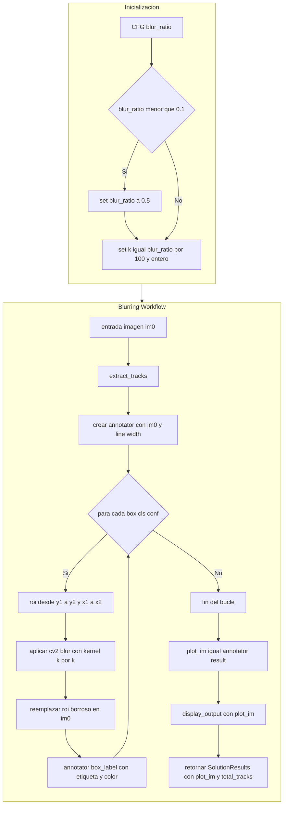


Sources: [ultralytics/solutions/object_blurrer.py12-93](https://github.com/ultralytics/ultralytics/blob/42d15b69/ultralytics/solutions/object_blurrer.py#L12-L93)
```python
class ObjectBlurrer(BaseSolution):
    """
    A class to manage the blurring of detected objects in a real-time video stream.

    This class extends the BaseSolution class and provides functionality for blurring objects based on detected bounding
    boxes. The blurred areas are updated directly in the input image, allowing for privacy preservation or other effects.

    Attributes:
        blur_ratio (int): The intensity of the blur effect applied to detected objects (higher values create more blur).
        iou (float): Intersection over Union threshold for object detection.
        conf (float): Confidence threshold for object detection.

    Methods:
        process: Apply a blurring effect to detected objects in the input image.
        extract_tracks: Extract tracking information from detected objects.
        display_output: Display the processed output image.

    Examples:
        >>> blurrer = ObjectBlurrer()
        >>> frame = cv2.imread("frame.jpg")
        >>> processed_results = blurrer.process(frame)
        >>> print(f"Total blurred objects: {processed_results.total_tracks}")
    """

    def __init__(self, **kwargs: Any) -> None:
        """
        Initialize the ObjectBlurrer class for applying a blur effect to objects detected in video streams or images.

        Args:
            **kwargs (Any): Keyword arguments passed to the parent class and for configuration.
                blur_ratio (float): Intensity of the blur effect (0.1-1.0, default=0.5).
        """
        super().__init__(**kwargs)
        blur_ratio = self.CFG["blur_ratio"]
        if blur_ratio < 0.1:
            LOGGER.warning("blur ratio cannot be less than 0.1, updating it to default value 0.5")
            blur_ratio = 0.5
        self.blur_ratio = int(blur_ratio * 100)

    def process(self, im0) -> SolutionResults:
        """
        Apply a blurring effect to detected objects in the input image.

        This method extracts tracking information, applies blur to regions corresponding to detected objects,
        and annotates the image with bounding boxes.

        Args:
            im0 (np.ndarray): The input image containing detected objects.

        Returns:
            (SolutionResults): Object containing the processed image and number of tracked objects.
                - plot_im (np.ndarray): The annotated output image with blurred objects.
                - total_tracks (int): The total number of tracked objects in the frame.

        Examples:
            >>> blurrer = ObjectBlurrer()
            >>> frame = cv2.imread("image.jpg")
            >>> results = blurrer.process(frame)
            >>> print(f"Blurred {results.total_tracks} objects")
        """
        self.extract_tracks(im0)  # Extract tracks
        annotator = SolutionAnnotator(im0, self.line_width)

        # Iterate over bounding boxes and classes
        for box, cls, conf in zip(self.boxes, self.clss, self.confs):
            # Crop and blur the detected object
            blur_obj = cv2.blur(
                im0[int(box[1]) : int(box[3]), int(box[0]) : int(box[2])],
                (self.blur_ratio, self.blur_ratio),
            )
            # Update the blurred area in the original image
            im0[int(box[1]) : int(box[3]), int(box[0]) : int(box[2])] = blur_obj
            annotator.box_label(
                box, label=self.adjust_box_label(cls, conf), color=colors(cls, True)
            )  # Annotate bounding box

        plot_im = annotator.result()
        self.display_output(plot_im)  # Display the output using the base class function

        # Return a SolutionResults
        return SolutionResults(plot_im=plot_im, total_tracks=len(self.track_ids))
```


### Vision Mapping with VisionEye

The `VisionEye` class provides object detection with vision point mapping functionality. It annotates detected objects and draws connection lines from a specified vision point to object centers.

The visualization uses the `SolutionAnnotator.visioneye()` method to draw connecting lines between the vision point and detected object centers.


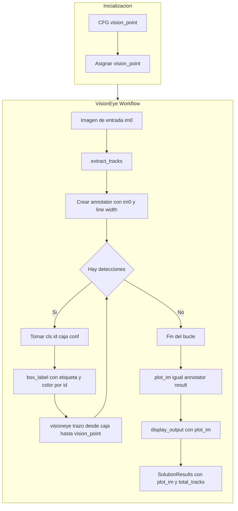


Sources: [ultralytics/solutions/vision_eye.py9-71](https://github.com/ultralytics/ultralytics/blob/42d15b69/ultralytics/solutions/vision_eye.py#L9-L71)
```python
lass VisionEye(BaseSolution):
    """
    A class to manage object detection and vision mapping in images or video streams.

    This class extends the BaseSolution class and provides functionality for detecting objects,
    mapping vision points, and annotating results with bounding boxes and labels.

    Attributes:
        vision_point (tuple[int, int]): Coordinates (x, y) where vision will view objects and draw tracks.

    Methods:
        process: Process the input image to detect objects, annotate them, and apply vision mapping.

    Examples:
        >>> vision_eye = VisionEye()
        >>> frame = cv2.imread("frame.jpg")
        >>> results = vision_eye.process(frame)
        >>> print(f"Total detected instances: {results.total_tracks}")
    """

    def __init__(self, **kwargs: Any) -> None:
        """
        Initialize the VisionEye class for detecting objects and applying vision mapping.

        Args:
            **kwargs (Any): Keyword arguments passed to the parent class and for configuring vision_point.
        """
        super().__init__(**kwargs)
        # Set the vision point where the system will view objects and draw tracks
        self.vision_point = self.CFG["vision_point"]

    def process(self, im0) -> SolutionResults:
        """
        Perform object detection, vision mapping, and annotation on the input image.

        Args:
            im0 (np.ndarray): The input image for detection and annotation.

        Returns:
            (SolutionResults): Object containing the annotated image and tracking statistics.
                - plot_im: Annotated output image with bounding boxes and vision mapping
                - total_tracks: Number of tracked objects in the frame

        Examples:
            >>> vision_eye = VisionEye()
            >>> frame = cv2.imread("image.jpg")
            >>> results = vision_eye.process(frame)
            >>> print(f"Detected {results.total_tracks} objects")
        """
        self.extract_tracks(im0)  # Extract tracks (bounding boxes, classes, and masks)
        annotator = SolutionAnnotator(im0, self.line_width)

        for cls, t_id, box, conf in zip(self.clss, self.track_ids, self.boxes, self.confs):
            # Annotate the image with bounding boxes, labels, and vision mapping
            annotator.box_label(box, label=self.adjust_box_label(cls, conf, t_id), color=colors(int(t_id), True))
            annotator.visioneye(box, self.vision_point)

        plot_im = annotator.result()
        self.display_output(plot_im)  # Display the annotated output using the base class function

        # Return a SolutionResults object with the annotated image and tracking statistics
        return SolutionResults(plot_im=plot_im, total_tracks=len(self.track_ids))
```