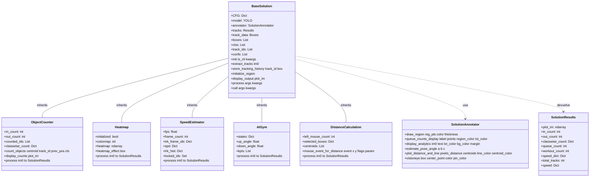
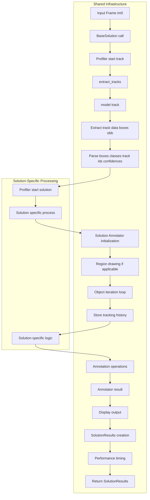
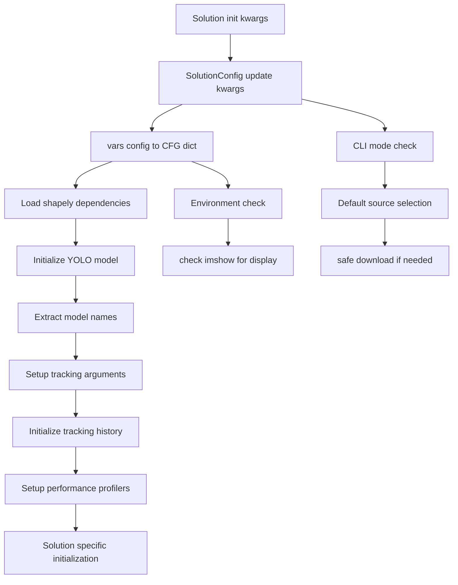

# Solutions Framework

Relevant source files

- [docs/en/guides/distance-calculation.md](https://github.com/ultralytics/ultralytics/blob/42d15b69/docs/en/guides/distance-calculation.md)
- [docs/en/guides/heatmaps.md](https://github.com/ultralytics/ultralytics/blob/42d15b69/docs/en/guides/heatmaps.md)
- [docs/en/guides/object-counting.md](https://github.com/ultralytics/ultralytics/blob/42d15b69/docs/en/guides/object-counting.md)
- [docs/en/guides/queue-management.md](https://github.com/ultralytics/ultralytics/blob/42d15b69/docs/en/guides/queue-management.md)
- [docs/en/guides/region-counting.md](https://github.com/ultralytics/ultralytics/blob/42d15b69/docs/en/guides/region-counting.md)
- [docs/en/guides/speed-estimation.md](https://github.com/ultralytics/ultralytics/blob/42d15b69/docs/en/guides/speed-estimation.md)
- [docs/en/guides/workouts-monitoring.md](https://github.com/ultralytics/ultralytics/blob/42d15b69/docs/en/guides/workouts-monitoring.md)
- [tests/test_solutions.py](https://github.com/ultralytics/ultralytics/blob/42d15b69/tests/test_solutions.py)
- [ultralytics/solutions/ai_gym.py](https://github.com/ultralytics/ultralytics/blob/42d15b69/ultralytics/solutions/ai_gym.py)
- [ultralytics/solutions/distance_calculation.py](https://github.com/ultralytics/ultralytics/blob/42d15b69/ultralytics/solutions/distance_calculation.py)
- [ultralytics/solutions/heatmap.py](https://github.com/ultralytics/ultralytics/blob/42d15b69/ultralytics/solutions/heatmap.py)
- [ultralytics/solutions/instance_segmentation.py](https://github.com/ultralytics/ultralytics/blob/42d15b69/ultralytics/solutions/instance_segmentation.py)
- [ultralytics/solutions/object_counter.py](https://github.com/ultralytics/ultralytics/blob/42d15b69/ultralytics/solutions/object_counter.py)
- [ultralytics/solutions/queue_management.py](https://github.com/ultralytics/ultralytics/blob/42d15b69/ultralytics/solutions/queue_management.py)
- [ultralytics/solutions/region_counter.py](https://github.com/ultralytics/ultralytics/blob/42d15b69/ultralytics/solutions/region_counter.py)
- [ultralytics/solutions/solutions.py](https://github.com/ultralytics/ultralytics/blob/42d15b69/ultralytics/solutions/solutions.py)
- [ultralytics/solutions/speed_estimation.py](https://github.com/ultralytics/ultralytics/blob/42d15b69/ultralytics/solutions/speed_estimation.py)
- [ultralytics/solutions/trackzone.py](https://github.com/ultralytics/ultralytics/blob/42d15b69/ultralytics/solutions/trackzone.py)

The Solutions Framework provides a comprehensive architecture for implementing pre-built computer vision solutions using Ultralytics YOLO models. This framework standardizes the development of specialized applications such as object counting, speed estimation, heatmap generation, and workout monitoring through a common base class and shared infrastructure.

For information about the underlying YOLO system that powers these solutions, see [Core YOLO System](https://deepwiki.com/ultralytics/ultralytics/2-core-yolo-system). For details about specific solution implementations, see [Advanced Solutions and Applications](https://deepwiki.com/ultralytics/ultralytics/6.2-dataset-classes-and-formats).

## Architecture Overview

The Solutions Framework follows an object-oriented design with `BaseSolution` as the foundation class that all specific solutions inherit from. This architecture ensures consistent interfaces, shared functionality, and standardized processing workflows across different solution types.

### Class Hierarchy and Inheritance

Sources: [ultralytics/solutions/solutions.py18-262](https://github.com/ultralytics/ultralytics/blob/42d15b69/ultralytics/solutions/solutions.py#L18-L262) [ultralytics/solutions/object_counter.py10-196](https://github.com/ultralytics/ultralytics/blob/42d15b69/ultralytics/solutions/object_counter.py#L10-L196) [ultralytics/solutions/heatmap.py12-130](https://github.com/ultralytics/ultralytics/blob/42d15b69/ultralytics/solutions/heatmap.py#L12-L130) [ultralytics/solutions/speed_estimation.py11-118](https://github.com/ultralytics/ultralytics/blob/42d15b69/ultralytics/solutions/speed_estimation.py#L11-L118) [ultralytics/solutions/ai_gym.py9-115](https://github.com/ultralytics/ultralytics/blob/42d15b69/ultralytics/solutions/ai_gym.py#L9-L115) [ultralytics/solutions/distance_calculation.py12-127](https://github.com/ultralytics/ultralytics/blob/42d15b69/ultralytics/solutions/distance_calculation.py#L12-L127)

## Core Components

### BaseSolution Class

The `BaseSolution` class [ultralytics/solutions/solutions.py18-262](https://github.com/ultralytics/ultralytics/blob/42d15b69/ultralytics/solutions/solutions.py#L18-L262) serves as the foundation for all solution implementations, providing:

- **Model Management**: Automatic YOLO model loading and configuration
- **Tracking Infrastructure**: Object tracking using the model's `track()` method
- **Region Handling**: Support for polygonal and linear regions using Shapely geometry
- **Configuration System**: Integration with `SolutionConfig` for parameter management
- **Performance Profiling**: Built-in timing for tracking and solution processing

Key attributes include:

- `CFG`: Configuration dictionary from `SolutionConfig`
- `model`: Loaded YOLO model instance
- `track_history`: Defaultdict storing tracking history for each object
- `region`: List of coordinate tuples defining region of interest
- `annotator`: SolutionAnnotator instance for drawing operations

### SolutionAnnotator Class

The `SolutionAnnotator` class [ultralytics/solutions/solutions.py264-755](https://github.com/ultralytics/ultralytics/blob/42d15b69/ultralytics/solutions/solutions.py#L264-L755) extends the base `Annotator` class with specialized visualization methods:

- **Region Visualization**: `draw_region()` for drawing polygons and lines
- **Analytics Display**: `display_analytics()` for overlaying statistics
- **Pose Analysis**: `estimate_pose_angle()` for angle calculations
- **Distance Visualization**: `plot_distance_and_line()` for distance measurements
- **Custom Labeling**: `adaptive_label()` for flexible label positioning

### SolutionResults Class

The `SolutionResults` class [ultralytics/solutions/solutions.py757-826](https://github.com/ultralytics/ultralytics/blob/42d15b69/ultralytics/solutions/solutions.py#L757-L826) encapsulates solution outputs with attributes for:

- `plot_im`: Processed image with annotations
- Count-based metrics: `in_count`, `out_count`, `classwise_count`
- Specialized metrics: `workout_count`, `pixels_distance`, `speed_dict`
- Performance data: `speed` dictionary with timing information

Sources: [ultralytics/solutions/solutions.py18-826](https://github.com/ultralytics/ultralytics/blob/42d15b69/ultralytics/solutions/solutions.py#L18-L826)

## Solution Processing Pipeline

The Solutions Framework follows a standardized processing pipeline that ensures consistent behavior across all solution implementations.

### Data Flow Architecture

Sources: [ultralytics/solutions/solutions.py157-262](https://github.com/ultralytics/ultralytics/blob/42d15b69/ultralytics/solutions/solutions.py#L157-L262) [ultralytics/solutions/solutions.py240-261](https://github.com/ultralytics/ultralytics/blob/42d15b69/ultralytics/solutions/solutions.py#L240-L261)

### Configuration and Initialization Flow

Sources: [ultralytics/solutions/solutions.py73-137](https://github.com/ultralytics/ultralytics/blob/42d15b69/ultralytics/solutions/solutions.py#L73-L137) [ultralytics/solutions/config.py](https://github.com/ultralytics/ultralytics/blob/42d15b69/ultralytics/solutions/config.py)

## Solution Processing Patterns

### Object Tracking Integration

All solutions leverage the YOLO model's tracking capabilities through a standardized pattern:

1. **Track Extraction**: [ultralytics/solutions/solutions.py157-184](https://github.com/ultralytics/ultralytics/blob/42d15b69/ultralytics/solutions/solutions.py#L157-L184)
    
    - Call `model.track()` with persistence enabled
    - Extract OBB or standard boxes based on detection type
    - Parse class IDs, track IDs, and confidence scores
2. **History Management**: [ultralytics/solutions/solutions.py185-204](https://github.com/ultralytics/ultralytics/blob/42d15b69/ultralytics/solutions/solutions.py#L185-L204)
    
    - Store centroid positions for each track ID
    - Maintain maximum 30 points per track
    - Calculate centroids differently for OBB vs standard boxes
3. **Region Operations**: [ultralytics/solutions/solutions.py206-213](https://github.com/ultralytics/ultralytics/blob/42d15b69/ultralytics/solutions/solutions.py#L206-L213)
    
    - Initialize Shapely geometries (Polygon or LineString)
    - Provide default region if none specified
    - Support both counting lines and complex polygons

### Common Solution Methods

Each solution implements the abstract `process()` method with a consistent structure:

1. **Initialization**: Create `SolutionAnnotator` instance
2. **Tracking**: Call `extract_tracks()` to get current frame data
3. **Processing**: Iterate through detected objects for solution-specific logic
4. **Annotation**: Draw bounding boxes, regions, and solution-specific overlays
5. **Output**: Return `SolutionResults` with processed image and metrics

Sources: [ultralytics/solutions/object_counter.py141-196](https://github.com/ultralytics/ultralytics/blob/42d15b69/ultralytics/solutions/object_counter.py#L141-L196) [ultralytics/solutions/heatmap.py75-129](https://github.com/ultralytics/ultralytics/blob/42d15b69/ultralytics/solutions/heatmap.py#L75-L129) [ultralytics/solutions/speed_estimation.py63-117](https://github.com/ultralytics/ultralytics/blob/42d15b69/ultralytics/solutions/speed_estimation.py#L63-L117)

## Configuration System

The Solutions Framework uses a centralized configuration approach through the `SolutionConfig` class, allowing solutions to:

- Override default parameters via keyword arguments
- Validate configuration keys against allowed parameters
- Provide CLI-compatible argument parsing
- Support both programmatic and command-line usage

Common configuration parameters include:

- `model`: YOLO model path or name
- `source`: Input video/image source
- `region`: Region of interest coordinates
- `show`: Display output flag
- `line_width`: Annotation line thickness
- Tracking parameters: `conf`, `iou`, `tracker`, `classes`

Sources: [ultralytics/solutions/solutions.py81-119](https://github.com/ultralytics/ultralytics/blob/42d15b69/ultralytics/solutions/solutions.py#L81-L119) [ultralytics/solutions/config.py](https://github.com/ultralytics/ultralytics/blob/42d15b69/ultralytics/solutions/config.py)

## Integration with YOLO Ecosystem

The Solutions Framework seamlessly integrates with the broader YOLO ecosystem:

- **Model Compatibility**: Works with any YOLO model variant (detection, segmentation, pose)
- **Tracking Integration**: Leverages YOLO's built-in tracking capabilities
- **Export Support**: Solutions can work with exported model formats through AutoBackend
- **CLI Integration**: Accessible via `yolo solutions` command structure
- **HUB Compatibility**: Can be deployed through Ultralytics HUB platform

This integration ensures that solutions benefit from ongoing improvements to the core YOLO system while maintaining their specialized functionality.

Sources: [ultralytics/solutions/solutions.py107-119](https://github.com/ultralytics/ultralytics/blob/42d15b69/ultralytics/solutions/solutions.py#L107-L119) [tests/test_solutions.py31-162](https://github.com/ultralytics/ultralytics/blob/42d15b69/tests/test_solutions.py#L31-L162) [docs/en/guides/object-counting.md39-98](https://github.com/ultralytics/ultralytics/blob/42d15b69/docs/en/guides/object-counting.md#L39-L98)