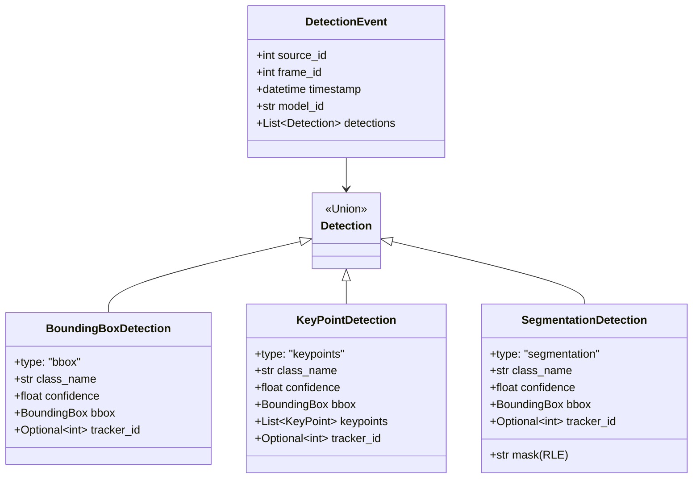
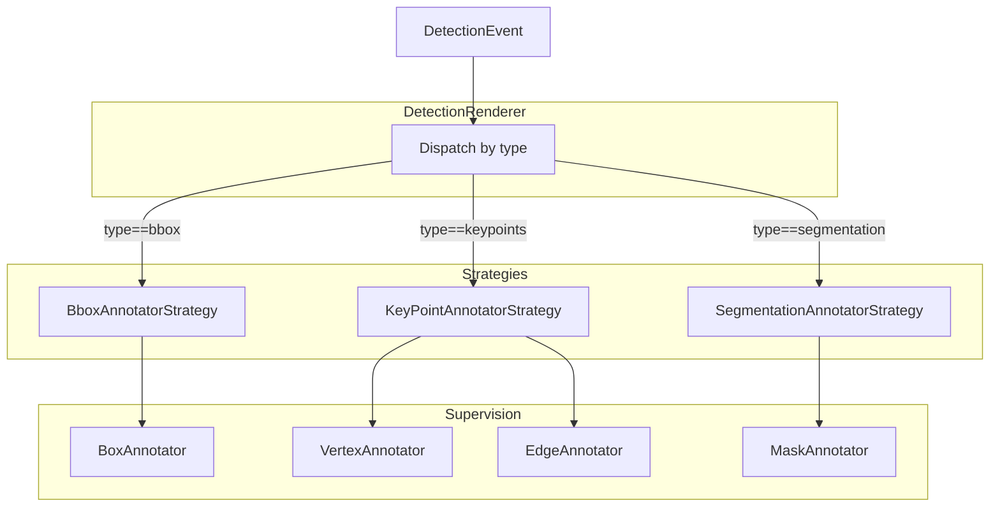
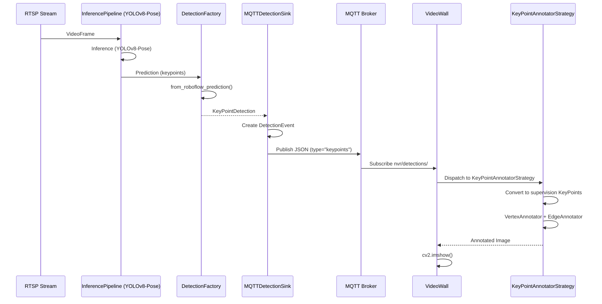

# Informe Consultivo: Arquitectura Cupertino NVR

**Fecha:** 2025-10-25
**Preparado por:** Gaby (Visiona)
**Revisado con:** Ernesto
**Versión:** 1.0

---

## Resumen Ejecutivo

Este informe presenta un análisis profundo del diseño de **Cupertino NVR**, evaluando su adherencia a los principios del **Manifiesto de Diseño "Blues Style"** de Visiona, identificando fortalezas arquitectónicas, proponiendo mejoras tácticas (Quick Wins), y diseñando extensiones estratégicas para soportar **YOLO Pose (keypoints)** y **YOLO-Seg (segmentación)**.

**Conclusión Principal:** Cupertino NVR implementa correctamente los principios fundamentales de diseño limpio (bounded contexts, pub/sub, separation of concerns), pero presenta **simplificación excesiva** en algunas áreas que comprometen extensibilidad futura. Las mejoras propuestas mantienen KISS mientras preparan el sistema para evolución controlada.

---

## Tabla de Contenidos

1. [Contexto y Objetivos](#contexto-y-objetivos)
2. [Análisis Arquitectónico](#análisis-arquitectónico)
3. [Evaluación según Manifiesto Visiona](#evaluación-según-manifiesto-visiona)
4. [Quick Wins - Mejoras Tácticas](#quick-wins---mejoras-tácticas)
5. [Diseño de Extensiones Estratégicas](#diseño-de-extensiones-estratégicas)
6. [Roadmap de Implementación](#roadmap-de-implementación)
7. [Conclusiones y Recomendaciones](#conclusiones-y-recomendaciones)

---

## 1. Contexto y Objetivos

### 1.1 Sistema Actual

**Cupertino NVR** es un sistema distribuido de Network Video Recorder con inferencia AI, compuesto por:

- **Processor** (headless): Ejecuta inferencia YOLOv8 sobre streams RTSP y publica eventos de detección vía MQTT
- **Wall** (visualización): Consume eventos MQTT y renderiza grids de video con overlays de detecciones
- **Event Protocol**: Schema Pydantic para DetectionEvent serializado en JSON

**Arquitectura Core:**
```
RTSP Streams → InferencePipeline (YOLOv8) → MQTTDetectionSink → MQTT Broker
                                                                        ↓
                                                                  MQTTListener
                                                                        ↓
VideoSource → DetectionCache (TTL) → DetectionRenderer → OpenCV Grid Display
```

### 1.2 Objetivos del Informe

1. **Evaluar** adherencia a principios de diseño Visiona (Complejidad por Diseño, KISS ≠ Simplicidad Ingenua, etc.)
2. **Identificar** Quick Wins para mejorar robustez sin over-engineering
3. **Diseñar** extensiones arquitectónicas para:
   - **YOLO Pose**: Detección de keypoints de postura humana
   - **YOLO-Seg**: Segmentación de instancias (máscaras)
4. **Garantizar** que complejidad se maneje con **diseño**, no código complicado

---

## 2. Análisis Arquitectónico

### 2.1 Bounded Contexts - Separación de Dominios

**✅ Fortaleza:** El sistema implementa **bounded contexts claros**:

| Bounded Context | Responsabilidad | Acoplamiento |
|-----------------|----------------|--------------|
| **Processor** (`cupertino_nvr/processor/`) | Inferencia headless, publicación MQTT | Completamente desacoplado de Wall |
| **Wall** (`cupertino_nvr/wall/`) | Visualización event-driven | Solo conoce DetectionEvent schema |
| **Events** (`cupertino_nvr/events/`) | Protocolo de integración | Compartido, no mutable |

**Patrón Pub/Sub MQTT:**
```
Processor → MQTT (nvr/detections/{source_id}) → Wall
```

**Análisis:**
- Desacoplamiento total: Processor no conoce Wall (puede escalar horizontalmente N processors + M viewers)
- Protocol-first design: DetectionEvent es contrato explícito
- QoS 0 (fire-and-forget): Decisión correcta para video real-time

**Comparación con Adeline:**

Adeline implementa **dual-plane MQTT** (Control QoS 1 + Data QoS 0), mientras Cupertino solo usa data plane. Esto es **pragmático** para MVP, pero limita control remoto de pipelines.

### 2.2 Event Schema - Pydantic como Contrato

**Schema actual** (`cupertino_nvr/events/schema.py`):

```python
class DetectionEvent(BaseModel):
    source_id: int
    frame_id: int
    timestamp: datetime
    model_id: str
    inference_time_ms: float
    detections: List[Detection]  # BoundingBox + class_name + confidence + tracker_id
    fps: Optional[float]
    latency_ms: Optional[float]
```

**✅ Fortaleza:**
- Schema versionado con Pydantic (type-safe serialization)
- Incluye tracking (`tracker_id`) para multi-object tracking
- Metadata de performance (inference_time_ms, fps, latency)

**⚠️ Limitación Crítica:**

El schema **asume bounding boxes únicamente**. No soporta:
- Keypoints (YOLO Pose)
- Máscaras de segmentación (YOLO-Seg)
- Clasificación sin bbox (image classification)

Esto requiere **extensión del schema**, pero debe hacerse **sin romper backward compatibility**.

### 2.3 Renderer Pattern - OpenCV + Supervision

**Implementación actual** (`cupertino_nvr/wall/renderer.py`):

```python
class DetectionRenderer:
    def render_frame(self, frame: VideoFrame, event: Optional[DetectionEvent]) -> np.ndarray:
        # 1. Draw bounding boxes con OpenCV
        # 2. Resize con letterboxing
        # 3. Overlay de estadísticas
```

**✅ Fortaleza:**
- Renderer separado de lógica de cache/MQTT
- Letterboxing para aspect ratio correcto

**❌ Debilidad - Hard-coded para Bounding Boxes:**

El renderer **solo dibuja bboxes**. No usa **supervision** para anotaciones avanzadas (masks, keypoints). Supervision provee:
- `EdgeAnnotator`, `VertexAnnotator` para keypoints
- `MaskAnnotator` para segmentación
- `TraceAnnotator` para trayectorias

**Propuesta:** Refactorizar a **Strategy Pattern** para diferentes tipos de anotación.

### 2.4 DetectionCache - TTL Thread-Safe

**Implementación** (`cupertino_nvr/wall/detection_cache.py`):

```python
class DetectionCache:
    def __init__(self, ttl_seconds: float = 1.0):
        self._cache: Dict[int, Tuple[DetectionEvent, datetime]] = {}
        self._lock = Lock()
        self._ttl = timedelta(seconds=ttl_seconds)
```

**✅ Fortaleza:**
- Thread-safe con `Lock`
- Lazy expiration (no background thread)
- TTL configurable

**⚠️ Riesgo - Memory Leak si TTL muy alto:**

Si `ttl_seconds` es muy grande y hay muchos sources, cache crece sin límite. No hay **max_size** con LRU eviction.

**Propuesta Quick Win:** Añadir `max_entries` con LRU eviction.

---

## 3. Evaluación según Manifiesto Visiona

### 3.1 Complejidad por Diseño, No por Accidente

**Principio:** Atacar complejidad mediante arquitectura, no código complicado.

**Cupertino NVR:**

✅ **Cumple:**
- Pub/sub MQTT para desacoplamiento (complejidad distribuida manejada con protocolo)
- Pydantic schemas para validación (fail-fast en load time)
- Bounded contexts claros

⚠️ **Oportunidad:**
- Falta **Factory Pattern** para crear diferentes tipos de handlers (YOLOv8, YOLOv8-Pose, YOLOv8-Seg)
- Falta **Strategy Pattern** para rendering (bbox vs keypoints vs masks)

**Adeline hace esto bien:**
```python
# Adeline usa StrategyFactory para seleccionar handler según config
handler = InferenceHandlerFactory.create(config)  # Standard, Adaptive, FixedROI
```

**Propuesta:** Introducir `InferenceTypeFactory` que cree handlers especializados.

### 3.2 KISS ≠ Simplicidad Ingenua

**Principio:** Simple para leer, NO simple para escribir una vez. Diseño limpio, no simplista.

**Cupertino NVR:**

✅ **Cumple en arquitectura:**
- Código legible y cohesivo
- No hay abstracciones innecesarias

❌ **No cumple en extensibilidad:**

El código actual es **demasiado simple**, asumiendo solo bounding boxes:

```python
# mqtt_sink.py - Hardcoded para bbox
detections.append(
    Detection(
        class_name=p["class"],
        bbox=BoundingBox(x=p["x"], y=p["y"], width=p["width"], height=p["height"])
    )
)
```

Esto no escala a keypoints/masks sin reescribir todo el sink.

**Comparación con Adeline:**

Adeline separa **handler logic** de **sink logic** con abstractions bien definidas:
```python
# Handler produce predictions
# Sink consume predictions (pueden ser diferentes tipos)
```

**Propuesta:** Introducir `DetectionType` discriminator en schema para polimorfismo.

### 3.3 Fail Fast (Load Time vs Runtime)

**Principio:** Fallar inmediatamente en load con errores claros, no en runtime.

**Cupertino NVR:**

✅ **Cumple parcialmente:**
- Pydantic valida schema en deserialización

❌ **No cumple:**
- No valida que `model_id` corresponda a modelo real antes de start
- No valida conectividad MQTT antes de iniciar pipeline

**Adeline hace esto bien:**
```python
# Valida config completo antes de build pipeline
config = AdelineConfig.from_yaml("config.yaml")  # Pydantic validation
```

**Propuesta Quick Win:** Añadir `validate()` method en configs que verifique precondiciones.

### 3.4 Cohesión > Ubicación

**Principio:** Módulos se definen por cohesión conceptual, no por tamaño.

**Cupertino NVR:**

✅ **Cumple:**
```
cupertino_nvr/
├── processor/      # Cohesión: inferencia
├── wall/           # Cohesión: visualización
└── events/         # Cohesión: protocolo
```

**Sin problemas identificados.**

---

## 4. Quick Wins - Mejoras Tácticas

### Quick Win #1: DetectionCache con LRU Eviction

**Problema:** Cache puede crecer sin límite si TTL es alto.

**Solución:**
```python
from collections import OrderedDict

class DetectionCache:
    def __init__(self, ttl_seconds: float = 1.0, max_entries: int = 100):
        self._cache: OrderedDict[int, Tuple[DetectionEvent, datetime]] = OrderedDict()
        self._max_entries = max_entries

    def update(self, event: DetectionEvent):
        with self._lock:
            # LRU: move to end
            if event.source_id in self._cache:
                self._cache.move_to_end(event.source_id)
            else:
                # Evict oldest if full
                if len(self._cache) >= self._max_entries:
                    self._cache.popitem(last=False)

            self._cache[event.source_id] = (event, datetime.now())
```

**Impacto:**
- Previene memory leak
- Mantiene simplicidad (no background thread)
- 15 LOC

**Esfuerzo:** 1 hora (test + implementación)

---

### Quick Win #2: Config Validation en Load Time

**Problema:** Errores de configuración se descubren cuando pipeline ya inició.

**Solución:**
```python
# cupertino_nvr/processor/config.py
class StreamProcessorConfig:
    # ... existing fields ...

    def validate(self) -> None:
        """Validate config before pipeline starts"""
        # Check MQTT connectivity
        try:
            import paho.mqtt.client as mqtt
            client = mqtt.Client()
            client.connect(self.mqtt_host, self.mqtt_port, timeout=5)
            client.disconnect()
        except Exception as e:
            raise ValueError(f"MQTT broker unreachable: {e}")

        # Check model_id format
        if not self.model_id:
            raise ValueError("model_id cannot be empty")

        # Check stream URIs
        if not self.stream_uris:
            raise ValueError("At least one stream URI required")
```

**Uso:**
```python
# cli.py
config = StreamProcessorConfig(...)
config.validate()  # Fail fast
processor = StreamProcessor(config)
```

**Impacto:**
- Fail-fast antes de alocar recursos
- Mensajes de error claros
- 30 LOC

**Esfuerzo:** 2 horas

---

### Quick Win #3: Supervision Integration para Rendering

**Problema:** Renderer usa OpenCV crudo, no aprovecha supervision's annotators.

**Solución:**
```python
# cupertino_nvr/wall/renderer.py
import supervision as sv

class DetectionRenderer:
    def __init__(self, config: VideoWallConfig):
        self.config = config
        # Setup supervision annotators
        self.bbox_annotator = sv.BoxAnnotator(
            thickness=config.box_thickness,
            text_thickness=2,
        )
        self.label_annotator = sv.LabelAnnotator(
            text_scale=config.label_font_scale,
        )

    def render_frame(self, frame: object, event: Optional[DetectionEvent]) -> np.ndarray:
        image = frame.image.copy()

        if event and event.detections:
            # Convert to supervision Detections
            detections = self._to_supervision_detections(event)

            # Annotate using supervision
            image = self.bbox_annotator.annotate(image, detections)
            image = self.label_annotator.annotate(image, detections)

        # ... letterboxing and stats overlay ...
        return image

    def _to_supervision_detections(self, event: DetectionEvent) -> sv.Detections:
        xyxy = []
        confidence = []
        class_id = []

        for det in event.detections:
            # Convert center+size to xyxy
            x1 = det.bbox.x - det.bbox.width / 2
            y1 = det.bbox.y - det.bbox.height / 2
            x2 = det.bbox.x + det.bbox.width / 2
            y2 = det.bbox.y + det.bbox.height / 2
            xyxy.append([x1, y1, x2, y2])
            confidence.append(det.confidence)
            class_id.append(0)  # TODO: map class_name to ID

        return sv.Detections(
            xyxy=np.array(xyxy),
            confidence=np.array(confidence),
            class_id=np.array(class_id),
        )
```

**Beneficios:**
- Preparado para extender a keypoints/masks (supervision ya tiene annotators)
- Menos código OpenCV custom
- Mejor calidad visual (supervision optimizado)

**Impacto:**
- Refactor de 100 LOC → 60 LOC
- Preparación para Quick Win #4

**Esfuerzo:** 3 horas

---

### Quick Win #4: MQTT Control Plane (inspirado en Adeline)

**Problema:** No hay forma de pausar/reanudar/detener processor remotamente.

**Solución (simplificada de Adeline):**

```python
# cupertino_nvr/processor/control.py
import paho.mqtt.client as mqtt
import json

class ControlPlane:
    def __init__(self, mqtt_host: str, mqtt_port: int, on_command):
        self.client = mqtt.Client()
        self.client.on_message = self._on_message
        self.on_command = on_command
        self.client.connect(mqtt_host, mqtt_port)
        self.client.subscribe("nvr/control/commands", qos=1)  # QoS 1 for reliability
        self.client.loop_start()

    def _on_message(self, client, userdata, msg):
        try:
            command = json.loads(msg.payload)
            self.on_command(command)
        except Exception as e:
            logger.error(f"Control command error: {e}")

    def publish_status(self, status: dict):
        self.client.publish("nvr/control/status", json.dumps(status), qos=1)
```

**Uso en StreamProcessor:**
```python
class StreamProcessor:
    def start(self):
        # ... existing code ...

        # Setup control plane
        self.control = ControlPlane(
            mqtt_host=self.config.mqtt_host,
            mqtt_port=self.config.mqtt_port,
            on_command=self._handle_command
        )
        self.control.publish_status({"state": "running"})

    def _handle_command(self, command: dict):
        if command["action"] == "pause":
            self.pipeline.pause()
        elif command["action"] == "resume":
            self.pipeline.resume()
        elif command["action"] == "stop":
            self.terminate()
```

**Impacto:**
- Control remoto de processors
- No requiere Registry Pattern completo de Adeline (YAGNI por ahora)
- 80 LOC

**Esfuerzo:** 4 horas

---

## 5. Diseño de Extensiones Estratégicas

### 5.1 Extensión para YOLO Pose (Keypoints)

#### 5.1.1 Cambios en Event Schema

**Principio:** Backward compatibility total. Old clients siguen funcionando.

**Estrategia:** Discriminated Union con Pydantic.

```python
# cupertino_nvr/events/schema.py
from typing import Literal, Union
from pydantic import Field, BaseModel

class KeyPoint(BaseModel):
    """Single keypoint with confidence"""
    x: float
    y: float
    confidence: float = Field(ge=0.0, le=1.0)

class BoundingBoxDetection(BaseModel):
    """Bbox-based detection (existing)"""
    type: Literal["bbox"] = "bbox"
    class_name: str
    confidence: float
    bbox: BoundingBox
    tracker_id: Optional[int] = None

class KeyPointDetection(BaseModel):
    """Keypoint-based detection (YOLO Pose)"""
    type: Literal["keypoints"] = "keypoints"
    class_name: str = "person"  # YOLOv8-pose solo detecta personas
    confidence: float
    bbox: BoundingBox  # Bbox envolvente (calculado de keypoints)
    keypoints: List[KeyPoint] = Field(min_length=17, max_length=17)  # COCO format
    tracker_id: Optional[int] = None

# Discriminated union
Detection = Union[BoundingBoxDetection, KeyPointDetection]

class DetectionEvent(BaseModel):
    # ... existing fields ...
    detections: List[Detection]  # Ahora acepta ambos tipos
```

**Serialización JSON:**
```json
{
  "type": "keypoints",
  "class_name": "person",
  "confidence": 0.95,
  "bbox": {"x": 320, "y": 240, "width": 150, "height": 400},
  "keypoints": [
    {"x": 320, "y": 180, "confidence": 0.98},  // nose
    {"x": 310, "y": 175, "confidence": 0.95},  // left_eye
    // ... 15 more keypoints
  ]
}
```

**Backward Compatibility:**
```python
# Old clients leen "bbox" ignorando keypoints → OK
# New clients leen keypoints si type=="keypoints"
```

#### 5.1.2 Cambios en MQTTDetectionSink

**Estrategia:** Factory Pattern para crear detections según tipo de predicción.

```python
# cupertino_nvr/processor/detection_factory.py
class DetectionFactory:
    @staticmethod
    def from_roboflow_prediction(prediction: dict) -> Detection:
        """Convert Roboflow prediction to Detection"""
        if "keypoints" in prediction:
            # YOLOv8-Pose prediction
            keypoints = [
                KeyPoint(x=kp["x"], y=kp["y"], confidence=kp.get("confidence", 1.0))
                for kp in prediction["keypoints"]
            ]

            # Calculate bbox from keypoints
            xs = [kp.x for kp in keypoints if kp.confidence > 0.5]
            ys = [kp.y for kp in keypoints if kp.confidence > 0.5]
            x_min, x_max = min(xs), max(xs)
            y_min, y_max = min(ys), max(ys)

            return KeyPointDetection(
                class_name="person",
                confidence=prediction["confidence"],
                bbox=BoundingBox(
                    x=(x_min + x_max) / 2,
                    y=(y_min + y_max) / 2,
                    width=x_max - x_min,
                    height=y_max - y_min,
                ),
                keypoints=keypoints,
                tracker_id=prediction.get("tracker_id"),
            )
        else:
            # Standard bbox detection
            return BoundingBoxDetection(
                class_name=prediction["class"],
                confidence=prediction["confidence"],
                bbox=BoundingBox(
                    x=prediction["x"],
                    y=prediction["y"],
                    width=prediction["width"],
                    height=prediction["height"],
                ),
                tracker_id=prediction.get("tracker_id"),
            )
```

**Uso en MQTTDetectionSink:**
```python
def _create_event(self, prediction: dict, frame: object) -> DetectionEvent:
    detections = [
        DetectionFactory.from_roboflow_prediction(p)
        for p in prediction.get("predictions", [])
    ]

    return DetectionEvent(
        source_id=frame.source_id,
        # ... metadata ...
        detections=detections,
    )
```

#### 5.1.3 Cambios en Renderer - Strategy Pattern

**Estrategia:** Annotator strategies según tipo de detection.

```python
# cupertino_nvr/wall/annotators.py
import supervision as sv

class BboxAnnotatorStrategy:
    def __init__(self, config: VideoWallConfig):
        self.bbox_annotator = sv.BoxAnnotator(thickness=config.box_thickness)
        self.label_annotator = sv.LabelAnnotator()

    def annotate(self, image: np.ndarray, detection: BoundingBoxDetection) -> np.ndarray:
        # Convert to supervision Detections and annotate
        # ... existing logic from Quick Win #3 ...
        return image

class KeyPointAnnotatorStrategy:
    def __init__(self, config: VideoWallConfig):
        self.vertex_annotator = sv.VertexAnnotator(radius=5, color=sv.Color.GREEN)
        self.edge_annotator = sv.EdgeAnnotator(thickness=2, color=sv.Color.GREEN)
        self.bbox_annotator = sv.BoxAnnotator(thickness=1)  # Thin bbox

    def annotate(self, image: np.ndarray, detection: KeyPointDetection) -> np.ndarray:
        # Convert to supervision KeyPoints
        xy = np.array([[kp.x, kp.y] for kp in detection.keypoints]).reshape(1, 17, 2)
        confidence = np.array([kp.confidence for kp in detection.keypoints]).reshape(1, 17)

        keypoints = sv.KeyPoints(xy=xy, confidence=confidence)

        # Draw keypoints skeleton
        image = self.vertex_annotator.annotate(image, keypoints)
        image = self.edge_annotator.annotate(image, keypoints)

        # Draw thin bbox
        # ... convert detection.bbox to supervision Detections ...
        image = self.bbox_annotator.annotate(image, bbox_detections)

        return image

# cupertino_nvr/wall/renderer.py
class DetectionRenderer:
    def __init__(self, config: VideoWallConfig):
        self.bbox_strategy = BboxAnnotatorStrategy(config)
        self.keypoint_strategy = KeyPointAnnotatorStrategy(config)

    def render_frame(self, frame: object, event: Optional[DetectionEvent]) -> np.ndarray:
        image = frame.image.copy()

        if event and event.detections:
            for detection in event.detections:
                if detection.type == "bbox":
                    image = self.bbox_strategy.annotate(image, detection)
                elif detection.type == "keypoints":
                    image = self.keypoint_strategy.annotate(image, detection)

        # ... letterboxing and stats ...
        return image
```

#### 5.1.4 Uso de YOLO Pose en Processor

**Configuración:**
```python
# CLI update
config = StreamProcessorConfig(
    stream_uris=["rtsp://..."],
    model_id="yolov8x-pose-640",  # ← Pose model
    mqtt_host="localhost",
)
```

**No requiere cambios en StreamProcessor:** DetectionFactory automáticamente detecta keypoints en predictions.

**Diagrama de Flujo:**
```
RTSP → InferencePipeline (yolov8x-pose) → Prediction con keypoints
          ↓
    DetectionFactory.from_roboflow_prediction() → KeyPointDetection
          ↓
    MQTTDetectionSink → MQTT (JSON con type="keypoints")
          ↓
    Wall → DetectionRenderer → KeyPointAnnotatorStrategy → Supervision KeyPoints
```

---

### 5.2 Extensión para YOLO-Seg (Segmentación)

#### 5.2.1 Cambios en Event Schema

**Nuevo tipo de detection:**

```python
class SegmentationDetection(BaseModel):
    """Segmentation detection (YOLO-Seg)"""
    type: Literal["segmentation"] = "segmentation"
    class_name: str
    confidence: float
    bbox: BoundingBox  # Bbox envolvente
    mask: str = Field(description="RLE-encoded mask (COCO format)")  # Compressed
    tracker_id: Optional[int] = None

# Update discriminated union
Detection = Union[BoundingBoxDetection, KeyPointDetection, SegmentationDetection]
```

**Encoding de Máscara:**

Máscaras de segmentación son arrays grandes (HxW). Comprimirlas es crítico para MQTT.

**Estrategia:** Run-Length Encoding (RLE) - formato estándar COCO.

```python
# cupertino_nvr/events/encoding.py
import pycocotools.mask as mask_util

def encode_mask(binary_mask: np.ndarray) -> str:
    """Encode binary mask to RLE string"""
    rle = mask_util.encode(np.asfortranarray(binary_mask.astype(np.uint8)))
    return rle["counts"].decode("utf-8")  # Base64 string

def decode_mask(rle_string: str, height: int, width: int) -> np.ndarray:
    """Decode RLE string to binary mask"""
    rle = {"counts": rle_string.encode("utf-8"), "size": [height, width]}
    return mask_util.decode(rle)
```

**Uso en DetectionFactory:**
```python
elif "mask" in prediction:
    # YOLOv8-Seg prediction
    mask = prediction["mask"]  # NumPy array (H, W)

    return SegmentationDetection(
        class_name=prediction["class"],
        confidence=prediction["confidence"],
        bbox=BoundingBox(...),
        mask=encode_mask(mask),  # RLE compression
        tracker_id=prediction.get("tracker_id"),
    )
```

#### 5.2.2 Renderer Strategy para Segmentación

```python
class SegmentationAnnotatorStrategy:
    def __init__(self, config: VideoWallConfig):
        self.mask_annotator = sv.MaskAnnotator(
            opacity=0.5,
            color=sv.Color.GREEN,
        )
        self.label_annotator = sv.LabelAnnotator()

    def annotate(self, image: np.ndarray, detection: SegmentationDetection) -> np.ndarray:
        # Decode mask from RLE
        h, w = image.shape[:2]
        mask = decode_mask(detection.mask, h, w)

        # Convert to supervision Detections with mask
        detections = sv.Detections(
            xyxy=np.array([[bbox_to_xyxy(detection.bbox)]]),
            mask=mask.reshape(1, h, w),  # (N, H, W)
            confidence=np.array([detection.confidence]),
            class_id=np.array([0]),
        )

        # Annotate
        image = self.mask_annotator.annotate(image, detections)
        image = self.label_annotator.annotate(image, detections)

        return image
```

**Update renderer dispatch:**
```python
def render_frame(self, frame, event):
    # ...
    for detection in event.detections:
        if detection.type == "bbox":
            image = self.bbox_strategy.annotate(image, detection)
        elif detection.type == "keypoints":
            image = self.keypoint_strategy.annotate(image, detection)
        elif detection.type == "segmentation":
            image = self.segmentation_strategy.annotate(image, detection)
```

#### 5.2.3 Consideraciones de Performance

**Problema:** Máscaras RLE aumentan payload MQTT.

**Benchmark estimado:**
- Bbox JSON: ~150 bytes
- Keypoints JSON: ~1.5 KB (17 keypoints)
- Segmentation JSON (RLE): ~5-10 KB (mask comprimida)

**Mitigación:**

1. **MQTT max_payload_size:** Configurar broker con `message_size_limit` mayor (default 268 MB, OK)
2. **Downsampling de máscaras:** Redimensionar mask a resolución menor antes de RLE
3. **QoS 0:** Mantener fire-and-forget (pérdida de frames aceptable en video)

**Config adicional:**
```python
class StreamProcessorConfig:
    # ... existing ...
    mask_downsampling_factor: float = 4.0  # 640x640 → 160x160 mask
```

---

### 5.3 Comparativa de Diseño: Cupertino vs Adeline

| Aspecto | Cupertino NVR | Adeline | Evaluación |
|---------|---------------|---------|------------|
| **Bounded Contexts** | 3 contexts (Processor/Wall/Events) | 7+ contexts (Control/Data/Inference/Handlers/Sinks/Config/Logging) | ✅ Cupertino apropiado para scope |
| **Factory Pattern** | ❌ No usa | ✅ 3 factories (Handler/Sink/Strategy) | ⚠️ Cupertino necesita InferenceTypeFactory |
| **Strategy Pattern** | ❌ Renderer hardcoded | ✅ ROI strategies, Stabilization strategies | ⚠️ Propuesto en este informe |
| **Control Plane** | ❌ No existe | ✅ Dual-plane MQTT (Control QoS 1 + Data QoS 0) | ⚠️ Quick Win #4 propuesto |
| **Config Validation** | ⚠️ Solo Pydantic | ✅ Pydantic + custom validators + fail-fast | ⚠️ Quick Win #2 propuesto |
| **Extensibilidad** | ❌ Hardcoded bbox | ✅ Polimórfico (Handlers, Sinks, Strategies) | ⚠️ Diseños de extensión propuestos |
| **KISS Adherence** | ✅ Muy simple | ⚠️ Complejo pero justificado | ✅ Ambos correctos para su scope |

**Conclusión:** Adeline es **más complejo** porque su dominio lo requiere (ROI adaptativo, stabilization, multi-strategy). Cupertino debe evolucionar hacia **complejidad diseñada** (factories, strategies) solo cuando agregue Pose/Seg, no antes (YAGNI).

---

## 6. Roadmap de Implementación

### Fase 1: Quick Wins (1-2 semanas)

| Quick Win | Esfuerzo | Prioridad | Dependencias |
|-----------|----------|-----------|--------------|
| #1: LRU Cache | 1h | Alta | Ninguna |
| #2: Config Validation | 2h | Alta | Ninguna |
| #3: Supervision Integration | 3h | Media | Ninguna |
| #4: Control Plane | 4h | Baja | Quick Win #2 |

**Orden sugerido:**
1. QW #2 (Config Validation) - Base para fail-fast
2. QW #1 (LRU Cache) - Previene memory leak
3. QW #3 (Supervision) - Preparación para Fase 2
4. QW #4 (Control Plane) - Nice-to-have

### Fase 2: YOLO Pose (2-3 semanas)

**Sprint 1: Event Schema & Serialization**
- [ ] Implementar `KeyPointDetection` con discriminated union
- [ ] Tests de serialización/deserialización JSON
- [ ] Backward compatibility tests (old clients leen new events)

**Sprint 2: Detection Factory**
- [ ] Implementar `DetectionFactory.from_roboflow_prediction()`
- [ ] Tests con mock predictions (bbox y keypoints)
- [ ] Integrar en `MQTTDetectionSink`

**Sprint 3: Renderer Strategies**
- [ ] Implementar `KeyPointAnnotatorStrategy` con supervision
- [ ] Refactor `DetectionRenderer` para dispatch por tipo
- [ ] Tests visuales con imágenes de referencia

**Sprint 4: Integration Testing**
- [ ] Test end-to-end con YOLOv8-pose
- [ ] Validar latencia (target: <200ms)
- [ ] Validar MQTT payload size (<2KB por evento)

### Fase 3: YOLO-Seg (3-4 semanas)

**Sprint 1: Mask Encoding**
- [ ] Implementar RLE encoding/decoding
- [ ] Benchmarks de compresión
- [ ] Tests de round-trip (encode → decode → compare)

**Sprint 2: Segmentation Schema**
- [ ] Implementar `SegmentationDetection`
- [ ] Update `DetectionFactory`
- [ ] Tests con mock masks

**Sprint 3: Renderer Strategy**
- [ ] Implementar `SegmentationAnnotatorStrategy`
- [ ] Integrar en `DetectionRenderer`
- [ ] Optimizar downsampling de máscaras

**Sprint 4: Performance Tuning**
- [ ] Benchmark MQTT payload con máscaras reales
- [ ] Tuning de `mask_downsampling_factor`
- [ ] Test de stress (10+ streams con segmentación)

---

## 7. Conclusiones y Recomendaciones

### 7.1 Fortalezas del Diseño Actual

1. **Bounded Contexts Claros:** Processor/Wall/Events bien separados
2. **Pub/Sub Desacoplamiento:** MQTT elimina acoplamiento directo
3. **Type-Safe Schema:** Pydantic garantiza contratos
4. **Thread-Safe Cache:** DetectionCache bien diseñado
5. **KISS Apropiado:** No hay over-engineering para scope actual

### 7.2 Debilidades Críticas

1. **Falta de Extensibilidad:** Hardcoded para bounding boxes
2. **No Factory Pattern:** Dificulta agregar tipos de inferencia
3. **No Strategy Pattern:** Renderer no puede extenderse sin romper OCP
4. **Config Validation Débil:** No fail-fast en errores de conectividad
5. **Memory Leak Potencial:** Cache sin LRU eviction

### 7.3 Recomendaciones Prioritarias

#### Recomendación #1: Implementar Quick Wins en orden

**Prioridad:** ALTA
**Justificación:** Quick Wins #1-#3 son **prerequisitos** para extensiones de Fase 2/3.

**Orden:**
1. Config Validation (fail-fast culture)
2. LRU Cache (production-ready)
3. Supervision Integration (base para strategies)
4. Control Plane (operational excellence)

#### Recomendación #2: Diseñar Schema Extensible AHORA

**Prioridad:** ALTA
**Justificación:** Cambiar schema después de producción rompe clientes.

**Acción:** Implementar discriminated union (`Detection = Union[Bbox, KeyPoint, Segmentation]`) **antes** de agregar nuevos modelos.

**Backward Compatibility:**
```python
# Old code (sigue funcionando):
for det in event.detections:
    draw_bbox(det.bbox)  # Todos los tipos tienen bbox

# New code:
for det in event.detections:
    if det.type == "keypoints":
        draw_keypoints(det.keypoints)
```

#### Recomendación #3: Adoptar Strategy Pattern Gradualmente

**Prioridad:** MEDIA
**Justificación:** Strategy Pattern es prerequisito para soportar múltiples tipos de anotación sin código espagueti.

**Plan:**
- **Ahora:** Refactor renderer a strategies en Quick Win #3
- **Fase 2:** Agregar KeyPointAnnotatorStrategy
- **Fase 3:** Agregar SegmentationAnnotatorStrategy

**No hacer:** Refactorizar todo a strategies "por si acaso" (YAGNI). Solo cuando agregues segundo tipo.

#### Recomendación #4: NO Sobre-Diseñar Control Plane

**Prioridad:** BAJA
**Justificación:** Adeline necesita Control Plane complejo porque tiene múltiples comandos (pause/resume/toggle_crop/stabilization_stats). Cupertino solo necesita start/stop.

**Pragmatismo:** Implementar Quick Win #4 (simple control plane) solo si hay **necesidad operacional** de control remoto. De lo contrario, YAGNI.

#### Recomendación #5: Validar Assumptions con Prototipos

**Prioridad:** ALTA para Fase 2/3
**Justificación:** Mask compression, MQTT payload size, latencia con keypoints son **assumptions no validadas**.

**Acción:** Antes de Fase 2/3, crear **spike técnico** que:
1. Serialize keypoints/masks reales
2. Mida MQTT latency end-to-end
3. Valide que supervision's annotators funcionan con schemas propuestos

**Criterios de éxito:**
- Keypoints: <2KB payload, <200ms latency
- Segmentation: <10KB payload (RLE), <250ms latency

### 7.4 Reflexión Final: KISS vs Complejidad Diseñada

**Cupertino NVR hoy está en el punto correcto de KISS** para un MVP de detección de objetos. Agregar factories/strategies ahora sería over-engineering.

**PERO:** Si vas a agregar Pose/Seg (Fase 2/3), **diseñar extensibilidad AHORA es más barato** que refactorizar después.

**La Lección del Blues:**
> "Tocar Blues = Conocer escalas (inmutabilidad, desacoplamiento) + Improvisar con contexto (no aplicar todo rígido) + Pragmatismo (versión simple primero)"

**Aplicado a Cupertino:**
- **Escalas conocidas:** Factory, Strategy, Discriminated Unions
- **Improvisar con contexto:** No aplicar Adeline's dual-plane si no hay comandos complejos
- **Pragmatismo:** Implementar Quick Wins primero, extensiones después

---

## Anexo A: Diagramas de Arquitectura Propuesta

### A.1 Event Schema con Discriminated Union



### A.2 Renderer Strategy Pattern



### A.3 Data Flow - YOLO Pose Extension



---

**Fin del Informe**

Este documento será base para sesiones de debate arquitectónico.

**Próximos Pasos:**
1. Revisar Quick Wins con Ernesto
2. Validar assumptions de Pose/Seg con spike técnico
3. Decidir prioridad de Fases 2/3 según roadmap de producto
4. Iterar sobre diseño de schema extensible

---

**Preparado por:** Gaby (Visiona Engineering)
**Fecha:** 2025-10-25
**Versión:** 1.0
**Licencia:** Interno Visiona
